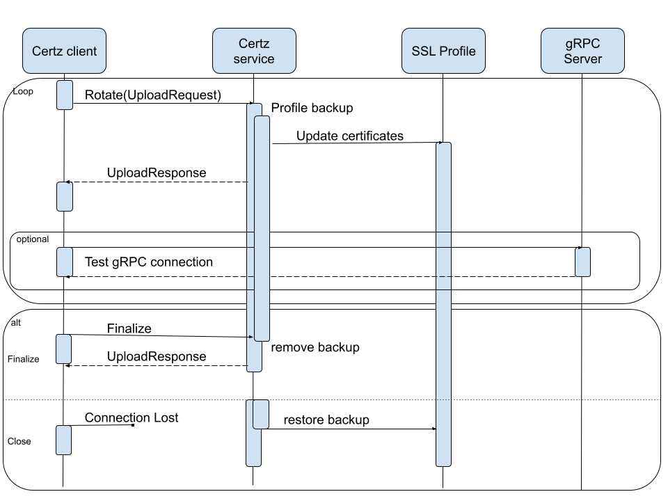

# gNSI HLD #

_Rev v0.1_

## Table of Contents
- [gNSI HLD](#gnsi-hld)
  - [Table of Contents](#table-of-contents)
    - [Revision](#revision)
    - [Scope](#scope)
    - [Definitions/Abbreviations](#definitionsabbreviations)
    - [Overview](#overview)
    - [Requirements](#requirements)
    - [Architecture Design](#architecture-design)
    - [High-Level Design](#high-level-design)
      - [Certz](#certz)
        - [Certz.Rotate](#certzrotate)
        - [Profiles](#profiles)
        - [Certificate Signing Request](#certificate-signing-request)
      - [Authz](#authz)
      - [Pathz](#pathz)
      - [Credentialz](#credentialz)
        - [Console Mgmt (users/passwords)](#console-mgmt-userspasswords)
          - [Create checkpoint](#create-checkpoint)
          - [Restore from checkpoint](#restore-from-checkpoint)
          - [Delete checkpoint](#delete-checkpoint)
          - [Set credentials](#set-credentials)
        - [SSH Mgmt](#ssh-mgmt)
          - [Create checkpoint](#create-checkpoint-1)
          - [Restore from checkpoint](#restore-from-checkpoint-1)
          - [Delete checkpoint](#delete-checkpoint-1)
          - [Set credentials](#set-credentials-1)
    - [SAI API](#sai-api)
    - [Configuration and management](#configuration-and-management)
      - [gNMI](#gnmi)
      - [Manifest (if the feature is an Application Extension)](#manifest-if-the-feature-is-an-application-extension)
      - [CLI/YANG model Enhancements](#cliyang-model-enhancements)
      - [Config DB Enhancements](#config-db-enhancements)
    - [Warmboot and Fastboot Design Impact](#warmboot-and-fastboot-design-impact)
    - [Restrictions/Limitations](#restrictionslimitations)
    - [Testing Requirements/Design](#testing-requirementsdesign)
      - [Unit Test cases](#unit-test-cases)
        - [Authz](#authz-1)
        - [Certz](#certz-1)
        - [Pathz](#pathz-1)
      - [System Test cases](#system-test-cases)
    - [Open/Action items - if any](#openaction-items---if-any)

### Revision

| Rev  | Rev Date   | Author(s)          | Change Description |
|------|------------|--------------------|--------------------|
| v0.1 | 11/10/2023 | Ryan Lucus (Google) | Initial version |

### Scope

Add the microservice for supporting gNSI APIs. Add related gNMI telemetry paths.

### Definitions/Abbreviations

- [gNMI](https://github.com/openconfig/reference/blob/master/rpc/gnmi/gnmi-specification.md) - gRPC Network Management Interface
- [gNSI](https://github.com/openconfig/gnsi/tree/main) gRPC Network Security Interface
- PKI - Public Key Infrastructure
- CRL - Certificate Revocation List
- CSR - Certificate Signing Request

### Overview

gRPC Network Security Interface is a set of microservices to provides a management layer for security credentials of multiple types. Each service shares a similiar design of `Rotate()` which takes in the new payload, creates a backup of the current state, and rolls back the state if it isn't finalized.

### Requirements

This feature should implement support for the gNSI APIs.

### Architecture Design

This feature does not change the SONiC Architecture

### High-Level Design

- Is it a built-in SONiC feature or a SONiC Application Extension?
  - built-in SONiC feature
- What are the modules and sub-modules that are modified for this design?
  - gNMI Server
- What are the repositories that would be changed?
  - [sonic-gnmi](https://github.com/sonic-net/sonic-gnmi)
  - [sonic-mgmt-common](https://github.com/sonic-net/sonic-mgmt-common)
- Module/sub-module interfaces and dependencies.
  - Add some flags to the gNMI module that point to default PKI elements.
  - Add flags to point to metadata files for each service
- SWSS and Syncd changes in detail
  - N/A
- DB and Schema changes (APP_DB, ASIC_DB, COUNTERS_DB, LOGLEVEL_DB, CONFIG_DB, STATE_DB)
  - Adds entries to STATE_DB for state and freshness of policies. See [Openconfig Models](https://github.com/openconfig/public/tree/master/release/models/gnsi)
- Sequence diagram if required.
 See [Certz.Rotate](#certzrotate)
- Linux dependencies and interface
  - N/A
- Warm reboot requirements/dependencies
  - None
- Fastboot requirements/dependencies
  - None
- Scalability and performance requirements/impact
  - There is a linear requirement for the numbers of profiles and the number of certificate revocation list rotations. The golang version of gRPC requires a complete history of CRL files since the last startup.
- Memory requirements
  - A map containing a few details for each profile.
- Docker dependency
  - None
- Build dependency if any
  - [gNSI](https://github.com/openconfig/gnsi/tree/main) gRPC Network Security Interface
- Management interfaces - SNMP, CLI, RestAPI, etc.,
  - [Configuration and management](#configuration-and-management)
- Is this change specific to any platform? Are there dependencies for platforms to implement anything to make this feature work? If yes, explain in detail and inform community in advance.
  - Any Platform
- SAI API requirements, CLI requirements, ConfigDB requirements. Design is covered in following sections.

#### Certz

##### Certz.Rotate

The Certz service definition provides the API to be used for rotating and testing PKI primitives used on network systems. The PKI primitives are grouped by SSL profiles and the service can manage multiple profiles beyond the default.

The Rotate() function is a bidirectional streaming RPC which permits mutating Certificates, Root Certificate Bundles, Certificate Revocation Lists and Authentication Policies of a given profile. In a Rotate() stream it is possible to mutate one or more of the elements, and to send a Finalize message once the in-flight change has been verified to be operational. Failure to send the Finalize message will result in the candidate element being discarded and the original element being used instead.

Certz.Rotate() will permit rotation, and verification of function, of any of the PKI elements. The normal use-case would be to:
- send a PKI element to a network system as a RotateCertificateRequest.
- verify that the services which will use the new certificate bundle continue to operate normally.
- send a FinalizeRequest to finish the rotation process.

The Certz Rotate Flow Diagram


##### Profiles

SSL profiles logically group the PKI primitives together and any gRPC Server may be configured to use a given profile. There is a default profile with the `gnxi` id that gNMI/gNOI/gNSI use. If no profile is specified, this is the profile that will be referenced.

There are 3 RPC for profiles:
- Certz.GetProfileList() - Existing profiles on a target can be discovered.
- Certz.AddProfile() - An SSL profile can be added.
- Certz.DeleteProfile() - When a profile is no longer needed it can be removed. Note that the gnxi SSL profile cannot be removed.

##### Certificate Signing Request

The server can optionally support generating a Certificate Signing Request. This allows the client to open a Certz.Rotate() stream, request a CSR and then have the Certificate signed externally.

- Certz.CanGenerateCSR()
- Certz.Rotate(GenerateCSRRequest)

#### Authz
Authz is policy based authorization for gRPC access. The policy is enforced by the gRPC server by registering a file watcher with a gRPC Interceptor in the options. The policy is managed by the gNSI Authz service running in the gNMI server. \

The policy to be enforced is defined in the form of a JSON string whose schema can be found [here](https://github.com/grpc/proposal/blob/master/A43-grpc-authorization-api.md).

- Authz.Rotate()
  - upload a new policy - same flow as Certz diagram
- Authz.Probe()
  - test the current policy

#### Pathz

Pathz is policy based authorization for gNMI access that is tunable for read/write at any level in the tree. The policy must be enforced by the gnmi server. A policy processor will be added as a new library to authorize gnmi requests. A call to the policy processor will be placed at the start of any gNMI request.

- Pathz.Rotate()
  - upload a new policy - same flow as Certz diagram
- Pathz.Probe()
  - test the current policy

#### Credentialz

Credentialz is for managing SSH and Console access. Changes are made through dbus calls to appropiate host service modules. The expected calls and behavior of the host service modules are defined in the next sections.

- Credentialz.RotateAccountCredentials()
  - Modify users' keys, passwords, and certificates
- Credentialz.RotateHostParameters()
  - Modify host's keys and certificates

##### Console Mgmt (users/passwords)
This describes the API and expected behavior of a host service module to be named console_mgmt. This handles the backend tasks needed for Credentialz.

The APIs may be called in any logical order (Create must be called before Restore or Delete).
###### Create checkpoint
When the console_mgmt.create_checkpoint message is received the back-end will make a copy of all password-related files. This copy will be used to restore the state of the system account credential configuration to the state it was when this message was received.
Files to be copied:
- /etc/passwd
- /etc/shadow

There will be only one transaction in progress, so only one copy is needed.
###### Restore from checkpoint
When the system account credential mutation session finishes without the Finalize message the state of the system account credential configuration has to be reverted to the state it was before the session started. To perform this action the front-end will send the console_mgmt.restore_checkpoint message to the backend that will overwrite all password-related files with the copy that was made when handling the console_mgmt.create_checkpoint message.
Files to be restored: \
- /etc/passwd
- /etc/shadow

After the files are restored the checkpoint should be destroyed. \

###### Delete checkpoint
The final step of a system account credential mutation transaction is to delete the checkpoint that has been created at the beginning of the transaction. This operation is requested by sending the console_mgmt.delete_checkpoint message.
###### Set credentials
Changes of the system account credentials are requested by sending the console_mgmt.set message.
That differs from the other DBUS calls as it has a parameter - a string that contains a JSON-encoded structure that provides all details about the requested change.

```json
{
 "ConsolePasswords": [
   { "name": "alice", "password" : "password-alice" },
   { "name": "bob", "password" : "password-bob" }
 ]
}
```

When this type of message is received the back-end will replace the content of /etc/passwd and /etc/shadow files.

##### SSH Mgmt
This describes the API and expected behavior of a host service module to be named ssh_mgmt. This handles the backend tasks needed for Credentialz.
###### Create checkpoint
When ssh_mgmt.create_checkpoint message is received the backend will make a copy of all SSH-related files. This copy will be used to restore the state of the SSH configuration to the state it was when this message was received.
Files to be copied:
- /etc/sshd/sshd_config
- /etc/sshd/ssh_ca_pub_key
- /etc/sshd/ssh_host_*_cert.pub
- /etc/sshd/ssh_host_openssh_*_key
- /home/*/.ssh/authorized_keys
- /home/*/.ssh/authorized_users
- /root/.ssh/authorized_keys
- /root/.ssh/authorized_users

There will be only one transaction in progress, so only one copy is needed.
###### Restore from checkpoint
When the SSH credentials mutation session finishes without the Finalize message the state of the SSH has to be reverted to the state it was before the session started. To perform this action the Front End will send the ssh_mgmt.restore_checkpoint message to the backend that will overwrite all SSH-related files with the copy that was made when handling the ssh_mgmt.create_checkpoint message.
Files to be restored:
- /etc/sshd/sshd_config
- /etc/sshd/ssh_ca_pub_key
- /etc/sshd/ssh_host_*_cert.pub
- /etc/sshd/ssh_host_openssh_*_key
- /home/*/.ssh/authorized_keys
- /home/*/.ssh/authorized_users
- /root/.ssh/authorized_keys
- /root/.ssh/authorized_users

After the files are restored the checkpoint should be destroyed.

###### Delete checkpoint
The final step of a SSH credential mutation transaction is to delete the checkpoint that has been created at the beginning of the transaction. This operation is requested by sending the ssh_mgmt.delete_checkpoint message.

###### Set credentials
Changes of the SSH credentials are requested by sending the ssh_mgmt.set message.
That differs from the other DBUS calls as it has a parameter - a string that contains a JSON-encoded structure that provides all details about the requested change.

The structure is used to represent all types of requests and the details are shown below.
Set authorized keys
```json
{ "SshAccountKeys":
  [
    { "account": "root",
      "keys": [
        { "key" : "Authorized-key #1",
          "options": [
            { "name": "from",
              "value" : "*.sales.example.net,!pc.sales.example.net"
            }
          ]
        },
        { "key" : "Authorized-key #2",
          "options": [
          ]
        }
      ]
    }
  ]
}
```

When this type of message is received the back-end will replace the content of `/home/<account>/.ssh/authorized_keys` file and restart the sshd daemon.
Set authorized users
```json
{ "SshAccountUsers":
  [
    { "account": "root",
      "users": [
        { "name" : "alice",
          "options": [
            { "name": "from",
              "value" : "*.sales.example.net,!pc.sales.example.net"
            }
          ]
        },
        { "name" : "bob", "options": [] }
      ]
    }
  ]
}
```

When this type of message is received the back-end will replace the content of `/home/<account>/.ssh/authorized_users` file and restart the sshd daemon.
Set CA public key
```json
{ "SshCaPublicKey": [ "TEST-CERT #1", "TEST-CERT #2" ] }
```

When this type of message is received the back-end will replace the content of `/etc/sshd/ssh_ca_pub_key` file and restart the sshd daemon.

### SAI API

No change in SAI API.

### Configuration and management

#### gNMI

New flags for gnmi server:
- EnableAuthzPolicy     bool   // Enable authz policy.
- AuthzPolicyFile string // Path to JSON file with authz policies.
- EnablePathzPolicy     bool   // Enable gNMI pathz policy.
- PathzPolicyFile string // Path to gNMI pathz policy file.
- CertCRLConfig        string // Path to the CRL directory. Disable if empty.
- SshCredMetaFile      string // Path to JSON file with SSH server credential metadata.
- ConsoleCredMetaFile  string // Path to JSON file with console credential metadata.
- CredEntitiesMetaFile string // Path to JSON file with gRPC credential metadata.
- AuthzMetaFile        string // Path to JSON file with authz metadata.
- PathzMetaFile        string // Path to JSON file with pathz metadata.

#### Manifest (if the feature is an Application Extension)

Not an app extension.

#### CLI/YANG model Enhancements

Adds YANG model paths as defined here in: \
  [gnsi-certz.yang](https://github.com/openconfig/public/blob/master/release/models/gnsi/openconfig-gnsi-certz.yang) \
  [gnsi-credentialz.yang](https://github.com/openconfig/public/blob/master/release/models/gnsi/openconfig-gnsi-credentialz.yang) \
  [gnsi-pathz.yang](https://github.com/openconfig/public/blob/master/release/models/gnsi/openconfig-gnsi-pathz.yang) \
  [gnsi-authz.yang](https://github.com/openconfig/public/blob/master/release/models/gnsi/openconfig-gnsi-authz.yang)

#### Config DB Enhancements

None

### Warmboot and Fastboot Design Impact

No effect on warm/fast boot

### Restrictions/Limitations

### Testing Requirements/Design

#### Unit Test cases

##### Authz
- Rotate - Open and Close
- Rotate - Send Empty Request
- Rotate - Send Incomplete Upload Request
- Rotate - Send Invalid Policy Request
- Rotate - Rollback policy
- Rotate - Finalize Valid Policy
- Rotate - Force Overwrite
- Rotate - Reject Concurrent Requests
- Probe - Successful Request
- Probe - Reject Request

##### Certz
- Rotate - Open and Close
- Rotate - Send Empty Request
- Rotate - Send Incomplete Upload Request
- Rotate - Send Invalid Certificate/TB/CRL/AuthPol
- Rotate - Send Valid Certificate/TB/CRL/AuthPol
- Rotate - Rollback Certificate/TB/CRL/AuthPol
- Rotate - Finalize Certificate/TB/CRL/AuthPol
- Rotate - Rollback non-default profile Certificate/TB/CRL/AuthPol
- Rotate - Finalize non-default profile Certificate/TB/CRL/AuthPol
- Rotate - Force Overwrite
- Rotate - Reject Concurrent Requests
- Rotate - Generate CSR Request
- Profile - Add a profile
- Profile - Delete a profile

##### Pathz
- Rotate - Open and Close
- Rotate - Send Empty Request
- Rotate - Send Incomplete Upload Request
- Rotate - Send Invalid Policy Request
- Rotate - Rollback policy
- Rotate - Finalize Valid Policy
- Rotate - Force Overwrite
- Rotate - Reject Concurrent Requests

#### System Test cases

### Open/Action items - if any