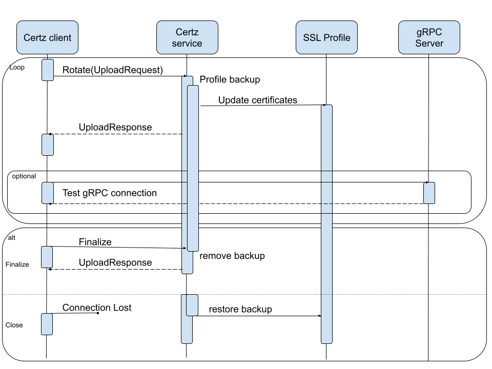

# gNSI Certz HLD #

_Rev v0.1_

## Table of Contents

- [gNSI Certz HLD](#gnsi-certz-hld)
  - [Table of Contents](#table-of-contents)
    - [Revision](#revision)
    - [Scope](#scope)
    - [Definitions/Abbreviations](#definitionsabbreviations)
    - [Overview](#overview)
    - [Requirements](#requirements)
    - [Architecture Design](#architecture-design)
    - [High-Level Design](#high-level-design)
      - [Certz.Rotate](#certzrotate)
      - [Profiles](#profiles)
      - [Certificate Signing Request](#certificate-signing-request)
    - [SAI API](#sai-api)
    - [Configuration and management](#configuration-and-management)
      - [gNMI](#gnmi)
      - [Manifest (if the feature is an Application Extension)](#manifest-if-the-feature-is-an-application-extension)
      - [CLI/YANG model Enhancements](#cliyang-model-enhancements)
      - [Config DB Enhancements](#config-db-enhancements)
    - [Warmboot and Fastboot Design Impact](#warmboot-and-fastboot-design-impact)
    - [Restrictions/Limitations](#restrictionslimitations)
    - [Testing Requirements/Design](#testing-requirementsdesign)
      - [Unit Test cases](#unit-test-cases)
      - [System Test cases](#system-test-cases)
    - [Open/Action items - if any](#openaction-items---if-any)

### Revision

| Rev  | Rev Date   | Author(s)          | Change Description |
|------|------------|--------------------|--------------------|
| v0.1 | 11/10/2023 | Ryan Lucus (Google) | Initial version |

### Scope

Add the microservice for supporting gNSI Certz API.

### Definitions/Abbreviations

- [gNMI](https://github.com/openconfig/reference/blob/master/rpc/gnmi/gnmi-specification.md) - Google Network Management Interface
- [gNSI](https://github.com/openconfig/gnsi/tree/main) Google Network Security Interface
- UMF - Unified Management Framework
- PKI - Public Key Infrastructure
- CRL - Certificate Revocation List
- CSR - Certificate Signing Request

### Overview

The Certz service definition provides the API to be used for rotating and testing PKI primitives used on network systems. The PKI primitives are grouped by SSL profiles and the service can manage multiple profiles beyond the default.

The Rotate() function is a bidirectional streaming RPC which permits mutating Certificates, Root Certificate Bundles, Certificate Revocation Lists and Authentication Policies of a specific profile. In a Rotate() stream it is possible to mutate one or more of the elements, and to send a Finalize message once the in-flight change has been verified to be operational. Failure to send the Finalize message will result in the candidate element being discarded and the original element being used instead.

### Requirements

This feature should implement support for the gNSI Certz API.

### Architecture Design

This feature does not change the SONiC Architecture

### High-Level Design

- Is it a built-in SONiC feature or a SONiC Application Extension?
  - built-in SONiC feature
- What are the modules and sub-modules that are modified for this design?
  - gNMI Server
- What are the repositories that would be changed?
  - [sonic-gnmi](https://github.com/sonic-net/sonic-gnmi)
  - [sonic-mgmt-common](https://github.com/sonic-net/sonic-mgmt-common)
- Module/sub-module interfaces and dependencies.
  - Add some flags to the gNMI module that point to default PKI elements.
- SWSS and Syncd changes in detail
  - N/A
- DB and Schema changes (APP_DB, ASIC_DB, COUNTERS_DB, LOGLEVEL_DB, CONFIG_DB, STATE_DB)
  - Adds entries to STATE_DB for state and freshness of profiles.
- Sequence diagram if required.
 See [Certz.Rotate](#certzrotate)
- Linux dependencies and interface
  - N/A
- Warm reboot requirements/dependencies
  - None
- Fastboot requirements/dependencies
  - None
- Scalability and performance requirements/impact
  - There is a linear requirement for the numbers of profiles and the number of certificate revocation list rotations. The golang version of gRPC requires a complete history of CRL files since the last startup.
- Memory requirements
  - A map containing a few details for each profile.
- Docker dependency
  - None
- Build dependency if any
  - [gNSI](https://github.com/openconfig/gnsi/tree/main) gRPC Network Security Interface
- Management interfaces - SNMP, CLI, RestAPI, etc.,
  - [Configuration and management](#configuration-and-management)
- Is this change specific to any platform? Are there dependencies for platforms to implement anything to make this feature work? If yes, explain in detail and inform community in advance.
  - Any Platform
- SAI API requirements, CLI requirements, ConfigDB requirements. Design is covered in following sections.

#### Certz.Rotate

Certz.Rotate() will permit rotation, and verification of function, of any of the PKI elements. The normal use-case would be to:
- send a PKI element to a network system as a RotateCertificateRequest.
- verify that the services which will use the new certificate bundle continue to operate normally.
- send a FinalizeRequest to finish the rotation process.

#### Profiles

SSL profiles logically group the PKI primitives together and any gRPC Server may be configured to use a given profile. There is a default profile with the gnxi id that gNMI/gNOI/gNSI use. If no profile is specified, this is the profile that will be referenced.

There are 3 RPC for profiles:
- Certz.GetProfileList() - Existing profiles on a target can be discovered.
- Certz.AddProfile() - An SSL profile can be added.
- Certz.DeleteProfile() - When a profile is no longer needed it can be removed. Note that the gnxi SSL profile cannot be removed.

The SSL profile ID of a gRPC server is exposed in the [YANG](https://github.com/openconfig/gnsi/blob/main/certz/gnsi-certz.yang) leaf ssl-profile-id which is an augment to the /system/grpc-servers/grpc-server/state branch.

#### Certificate Signing Request

The server can optionally support generating a Certificate Signing Request. This allows the client to open a Certz.Rotate() stream, request a CSR and then have the Certificate signed externally.

- Certz.CanGenerateCSR()
- Certz.Rotate(GenerateCSRRequest)

### SAI API

No change in SAI API.

### Configuration and management

#### gNMI

Add some flags to the gNMI module that point to default PKI elements.

#### Manifest (if the feature is an Application Extension)

Not an app extension.

#### CLI/YANG model Enhancements

Adds YANG model paths as defined here in [gnsi-certz.yang](https://github.com/openconfig/gnsi/blob/main/certz/gnsi-certz.yang)

#### Config DB Enhancements

None

### Warmboot and Fastboot Design Impact

No effect on warm/fast boot

### Restrictions/Limitations

### Testing Requirements/Design

#### Unit Test cases

#### System Test cases

- Rotate - Open and Close
- Rotate - Send Empty Request
- Rotate - Send Incomplete Upload Request
- Rotate - Send Invalid Certificate/TB/CRL/AuthPol
- Rotate - Send Valid Certificate/TB/CRL/AuthPol
- Rotate - Rollback Certificate/TB/CRL/AuthPol
- Rotate - Finalize Certificate/TB/CRL/AuthPol
- Rotate - Rollback non-default profile Certificate/TB/CRL/AuthPol
- Rotate - Finalize non-default profile Certificate/TB/CRL/AuthPol
- Rotate - Generate CSR Request
- Profile - Add a profile
- Profile - Delete a profile

### Open/Action items - if any