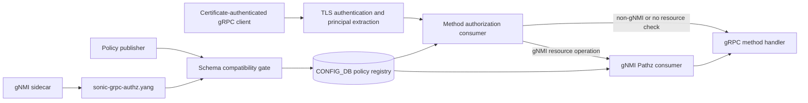
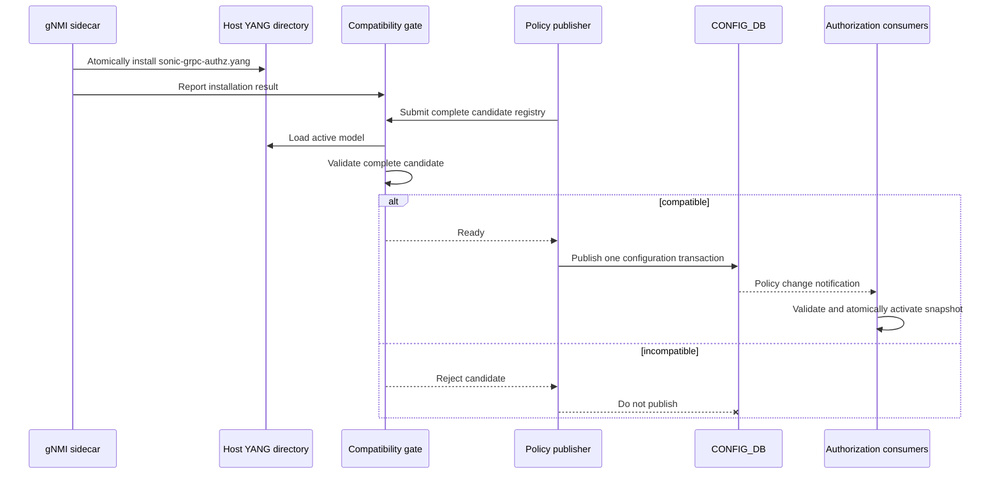

# Shared gRPC Certificate Authentication and Authorization Policy HLD

_Revision v0.1_

## Table of Contents

- [1. Revision](#1-revision)
- [2. Scope](#2-scope)
- [3. Definitions and Abbreviations](#3-definitions-and-abbreviations)
- [4. Overview](#4-overview)
- [5. Requirements](#5-requirements)
- [6. Architecture Design](#6-architecture-design)
- [7. High-Level Design](#7-high-level-design)
- [8. SAI API](#8-sai-api)
- [9. Configuration and Management](#9-configuration-and-management)
- [10. Warmboot and Fastboot Design Impact](#10-warmboot-and-fastboot-design-impact)
- [11. Memory Consumption](#11-memory-consumption)
- [12. Restrictions and Limitations](#12-restrictions-and-limitations)
- [13. Testing Requirements and Design](#13-testing-requirements-and-design)
- [14. Open and Action Items](#14-open-and-action-items)

## 1. Revision

| Revision | Date | Author | Change Description |
|----------|------|--------|--------------------|
| v0.1 | 2026-08-20 | Dawei Huang | Initial design |

## 2. Scope

This document defines a shared SONiC policy registry for certificate-authenticated
gRPC clients. The registry contains authenticated principals, role assignments,
exact gRPC method rules, and gNMI resource rules.

The first phase stores the registry only in `CONFIG_DB`. It uses the following
authorization layers:

1. gRPC proposal [A43](https://github.com/grpc/proposal/blob/master/A43-grpc-authorization-api.md)
   semantics for full-method authorization.
2. OpenConfig gNSI [Pathz](https://github.com/openconfig/gnsi/blob/4aaf7b37/pathz/pathz.proto)
   semantics for resources addressed by gNMI requests.

This document also defines schema delivery, policy publication, runtime reload,
upgrade, restart, rollback, and failure behavior.

The following items are outside this design:

- Certificate enrollment, trust-anchor distribution, and private-key storage.
- Password, JSON Web Token (JWT), SSH, console, and TACACS+ authorization.
- A general policy language for HTTP headers or wildcard gRPC methods.
- Policy storage outside `CONFIG_DB`.
- Image qualification, deployment, and production rollout procedures.

### 2.1 Implementation Status

This document is a design. It does not state that the design is deployed.

On 2026-08-20, [sonic-buildimage PR 29087](https://github.com/sonic-net/sonic-buildimage/pull/29087)
was open and unmerged. That pull request proposed the `sonic-grpc-authz.yang`
model, wheel packaging, and atomic installation by the gNMI sidecar. PR 29087
did not implement policy publication or runtime policy enforcement. This design
does not assume that change is present in a released or deployed SONiC image.

## 3. Definitions and Abbreviations

| Term | Definition |
|------|------------|
| A43 | The gRPC authorization API proposal and its deny-first decision order. |
| AAA | Authentication, authorization, and accounting. |
| Canonical principal | The stable identity string derived from a verified client certificate. |
| gNMI | gRPC Network Management Interface. |
| gNOI | gRPC Network Operations Interface. |
| gNSI | gRPC Network Security Interface. |
| Pathz | OpenConfig path-based authorization for gNMI resources. |
| Policy publisher | The component that validates and writes the policy registry. |
| Protected service | A gRPC service configured to enforce this registry. |
| Registry version 1 | The initial three-table policy contract defined in this document. |
| Role | A policy label assigned to one or more authenticated principals. |
| SAN | Subject Alternative Name in an X.509 certificate. |
| TLS | Transport Layer Security. |

The words **must**, **should**, and **may** identify required, recommended, and
optional behavior in this design.

## 4. Overview

Authentication proves a client's identity. Authorization decides which gRPC
methods and gNMI resources that identity can use. These operations remain
separate.

A gRPC server first authenticates the client certificate and derives one
canonical principal. The server then resolves the principal's roles from
`GRPC_AUTHZ_PRINCIPAL`. It applies `GRPC_AUTHZ_RULE` to the exact full gRPC
method. For an applicable gNMI operation, the gNMI server also applies
`GNMI_PATHZ_RULE` to every addressed resource.

Method authorization and Pathz authorization have separate tables and separate
decision algorithms. A method allow does not imply a resource permit. A Pathz
permit cannot bypass a method deny.

Installing the YANG model does not enable authorization and does not change
existing runtime behavior. Enforcement starts only when a runtime consumer is
configured to use this registry.

## 5. Requirements

### 5.1 Functional Requirements

- A verified client certificate must map to one canonical principal.
- A principal must map to one or more roles.
- Method rules must match exact full gRPC method names.
- Method decisions must use deny-first, allow-second, default-deny semantics.
- Pathz rules must distinguish `READ` from `WRITE` access.
- Pathz rules must support direct-principal and role subjects.
- A gNMI request must pass method authorization before resource authorization.
- Policy consumers must never activate a partially loaded policy snapshot.

### 5.2 Security Requirements

- Authorization must use only an identity produced by authenticated TLS state.
- Request metadata must not override the certificate-derived principal.
- Missing principals, missing rules, invalid policies, and unmatched requests
  must not grant access.
- An authenticated but unauthorized request must return gRPC
  `PERMISSION_DENIED`.
- A post-handshake identity extraction failure must return `UNAUTHENTICATED`.
  A TLS handshake failure closes the transport before a gRPC status exists.
- Policy changes must preserve a validated last-known-good snapshot until a
  complete replacement is ready.
- Policy logs must not include certificate private material or secret values.

### 5.3 Compatibility Requirements

- The compatible YANG model must be active before policy data is published.
- The policy publisher must validate each candidate policy configuration
  against the active model.
- Upgrade and rollback must not leave `CONFIG_DB` data without a compatible
  schema.
- Model installation alone must remain backward compatible with systems that do
  not enable the new authorization consumers.
- Legacy gNMI certificate configuration must not be silently treated as this
  shared registry.

## 6. Architecture Design

This feature extends the management plane. It does not change the packet data
plane, SWSS, Syncd, or the SAI interface.



### 6.1 Component Ownership

| Component | Responsibility |
|-----------|----------------|
| `sonic-buildimage` | Own the shared YANG model, package it in `sonic-yang-models`, and provide sidecar installation. |
| gNMI sidecar | Atomically converge the packaged model to host `/usr/local/yang-models`. |
| Policy publisher | Generate one complete policy registry and publish it only after compatibility checks pass. |
| TLS-enabled gRPC server | Validate the client certificate and derive the canonical principal. |
| Method authorization consumer | Load principal and method tables and enforce the full gRPC method. |
| gNMI authorization coordinator | Load all three tables and atomically activate the method and Pathz snapshot. |
| Deployment system | Order sidecar rollout, policy publication, upgrade, and rollback. |

The schema defines valid data. It does not own policy generation or implement
either authorization algorithm.

### 6.2 Trust Boundaries

The design trusts the following components to perform security-sensitive work:

- The configured certificate authority and TLS stack authenticate the peer.
- The principal extractor produces a stable identity from verified TLS state.
- The policy publisher and authorized local configuration tools can grant or
  remove access.
- The sidecar image and its privileged host-write path install the schema.
- Runtime consumers correctly validate, load, and enforce policy snapshots.

Any actor that can modify these components, `CONFIG_DB`, the schema directory,
or process startup options can change authorization behavior. These interfaces
must use existing SONiC access controls. The policy registry is not a substitute
for protecting those interfaces.

## 7. High-Level Design

### 7.1 Policy Publication Flow

The sidecar establishes schema readiness before the policy publisher writes
policy data.
File presence alone is not a sufficient compatibility signal. The publication
gate must load the installed host model, confirm the expected module revision,
and validate the complete candidate registry with that model.



The committed `CONFIG_DB` transaction is the registry version 1 publication
boundary. The policy publisher must publish principal, method, and Pathz
changes in one atomic transaction. A change notification is only a reload
trigger. After the commit, each consumer must read all three tables, validate
them as one snapshot, and atomically replace its active snapshot.

The gNMI method and Pathz evaluators must activate one composite snapshot. The
gNMI authorization coordinator must load both rule sets and replace them with
one atomic pointer change. A gNMI request must not use a method snapshot from
one commit and a Pathz snapshot from another commit.

If a publication path cannot provide an atomic commit and an observable commit
boundary, it must not publish this registry. Registry version 1 has no
activation marker that can make a sequence of independent table writes safe.

The policy publisher must compute a stable digest of the complete candidate
registry. Each required runtime consumer must report the digest of its active
snapshot through an operational readiness interface. Runtime activation is
complete only after all required consumers report the expected digest. The
digest and readiness interface are operational state. They are not new
`CONFIG_DB` policy fields.

Consumers must stop accepting new protected requests after they observe a new
commit and until they activate that snapshot. They must also terminate existing
protected streams. If a policy change revokes access, the deployment must place
the affected services in a deny state before the commit. It can remove that
deny state only after all required consumers report the expected digest.

### 7.2 Request Authorization Flow

For each request, the server performs these steps:

1. Complete mutual TLS authentication and derive the canonical principal.
2. Find the exact principal entry and its roles. Deny an unknown principal.
3. Evaluate the exact full gRPC method with the method algorithm in section 7.4.
4. Deny the request if method authorization does not allow it.
5. For an applicable gNMI operation, evaluate each addressed resource with the
   Pathz algorithm in section 7.5.
6. Pass only authorized work to the method handler.

Every requested Get or Subscribe path requires an explicit permit. Otherwise,
the server rejects the RPC before data lookup. A permit on a subtree can contain
more-specific denied descendants. The server must remove those descendants
before lookup and must not emit their values.

Every explicit and implicit resource changed by Set must be permitted. This
includes descendants changed by replace and implicit delete behavior. One
denied resource denies the complete transaction before mutation.

### 7.3 Certificate Principal and Roles

`GRPC_AUTHZ_PRINCIPAL` is an authorization registry. It does not configure TLS
trust, certificate revocation, or server certificates.

The TLS layer must provide one canonical principal string. Before enforcement
is enabled, a deployment must select one certificate identity profile. That
profile must define the selected field, such as URI SAN, DNS SAN, or Subject,
and its byte-level normalization. All publishers and consumers must use that
same profile. They must not use fallback fields to turn one certificate into
multiple principals.

The runtime must use an exact match against the `name` key. Case folding, alias
expansion, and substring matching are not allowed unless the selected identity
profile requires them. Enforcement must remain disabled until the identity
profile is defined.

Each principal entry contains at least one role. Registry version 1 has no
independent role table. A role exists because it appears in a principal's
`roles` field. Method and Pathz role references must resolve to such a role. An
empty role with no members cannot be represented.

### 7.4 gRPC Method Authorization

Method rules use the A43 decision order, narrowed to role subjects and exact
method names. A method name has the form `/package.Service/Method`.

A method rule matches when both conditions are true:

- The authenticated principal has at least one role listed by the rule.
- The request's full method name exactly equals the rule's `rpc` value.

The consumer then applies this algorithm:

1. If any matching rule has `effect=deny`, deny the request.
2. Otherwise, if any matching rule has `effect=allow`, allow the method layer.
3. Otherwise, deny the request.

Rule order is not significant. Method rules have no priority field. Wildcard,
prefix, suffix, header, and arbitrary principal matching from the wider A43
policy language are not part of this registry.

The method layer applies to all protected gRPC services, including gNMI, gNOI,
and gNSI. Each server implementation is responsible for installing the
authorization consumer on unary and streaming RPC paths.

### 7.5 gNMI Pathz Authorization

Pathz is evaluated only after the full gRPC method passes. The design uses the
Pathz protobuf semantics at OpenConfig gNSI commit `4aaf7b37de5f`. `READ`
applies to data retrieval and subscription. `WRITE` applies to delete, replace,
update, and the gNMI `union_replace` extension. Union replacement requires a
permit for every affected origin and resource.

The consumer combines the gNMI prefix elements before the request path
elements. A target is valid only in the request prefix. If a prefix is present,
its origin applies to all paths and an origin in a request path is invalid.
Without a prefix, each request path can identify its origin. An unspecified
origin uses the gNMI default.

The policy path string is converted to a structured `gnmi.Path`. `/` is the
root. Each element uses `/name`, followed by zero or more `[key=value]`
selectors. Key names are sorted lexicographically in the canonical string. A
key value of exactly `*` is a wildcard. A different value containing `*` is
invalid. Registry version 1 has no escape syntax, so a key value containing
`[`, `]`, or `=` is not representable. Key values must not be empty. Path
element and key names must match `[A-Za-z_][A-Za-z0-9_.:-]*`. The publication
gate must reject paths that violate these rules.

A Pathz candidate must match all configured selectors:

- The rule subject is the exact principal or one of that principal's roles.
- The rule mode equals the requested mode.
- A configured `target` equals the request target.
- A configured `origin` equals the request origin.
- The rule path is a prefix of the requested resource path.

An omitted target or origin does not constrain that selector. Path element names
must match exactly. Configured key values match exactly, except `*`, which
matches any value for that key. Missing request keys do not match configured
keys.

The consumer selects a result in this order:

1. Prefer the longest matching path by path elements.
2. For equal path lengths, prefer the rule with more exact key values over key
   wildcards.
3. For equal path specificity, prefer a direct-principal rule over a role rule.
4. If equally specific rules remain, `DENY` wins over `PERMIT`.
5. If no rule matches, deny the resource.

Method-rule conflict handling does not apply to Pathz. Pathz uses the preceding
specificity algorithm and its own default deny.

### 7.6 Runtime Policy Loading

Each consumer must build a complete immutable policy snapshot before replacing
its active snapshot. Unary requests and new streaming requests must observe one
snapshot for each authorization decision. A consumer must not combine entries
from two publication transactions.

When enforcement is enabled, initial startup requires a valid snapshot. If no
valid snapshot is available, the protected server must not accept requests or
must deny them all.

For a later malformed or unreadable update, the consumer must not activate the
candidate. It must stop serving protected requests, terminate protected
streams, and report an unhealthy state. After the policy publisher restores the
previous committed registry, the consumer can reactivate the corresponding
validated last-known-good snapshot. If no last-known-good snapshot exists, it
must remain closed.

Long-running consumers must reload after a committed policy update. After a new
snapshot becomes active, the server must terminate existing protected streams
and require clients to reconnect. This rule includes gNMI subscriptions and
prevents a revoked permission from remaining active on an old stream.

Consumers that cache YANG modules must reload or restart after a schema
replacement before the compatibility gate reports readiness.

### 7.7 Policy Source Authority

`CONFIG_DB` is the only policy authority for this design. When a server enables
this registry, it must disable independent method and Pathz policy files. It
must also reject gNSI Authz or Pathz rotation that would bypass the registry.

A future implementation can support another policy management interface only
if that interface publishes through the same validation, atomic transaction,
and runtime activation contract. Two active policy sources must never be
combined with logical OR behavior.

### 7.8 Schema Installation and Lifecycle

The `sonic-yang-models` wheel is the canonical package for the model. The gNMI
sidecar contains that wheel and atomically synchronizes
`/usr/local/yang-models/sonic-grpc-authz.yang` to the same host path. The file
mode is `0644`.

The sidecar compares packaged and host content during its normal convergence
loop. A failed copy leaves the previous host file in place and causes a retry.
The publication gate remains closed until it validates the intended active
model.

#### 7.8.1 Upgrade

An upgrade uses this order:

1. Deploy the sidecar that contains the new compatible model.
2. Atomically install the model on the host.
3. Reload or restart model-caching validators and consumers.
4. Validate the complete candidate registry against the active model.
5. Publish the candidate through the policy publisher.
6. Confirm that runtime consumers activated the new policy.

The deployment must stop before policy publication if any preceding step fails.

#### 7.8.2 Restart

`CONFIG_DB` policy persists across service and device restart through the normal
configuration persistence path. On restart, schema readiness must precede
policy validation and runtime startup. A runtime must revalidate its initial
snapshot. It must not rely only on an in-memory snapshot from before restart.

#### 7.8.3 Rollback

A rollback to an older schema reverses the upgrade dependency:

1. Restore policy data that the older schema accepts, or remove all three new
   tables in one configuration transaction.
2. Confirm that validators and runtime consumers accepted the restored state.
3. Roll back consumers that depend on the newer schema.
4. Roll back the sidecar or host model.
5. Validate the resulting `CONFIG_DB` against the active older schema.

The deployment system must not roll back the sidecar or downgrade the schema
while incompatible data is present. If policy cleanup or migration fails, it
must stop the rollback and retain the latest compatible schema and
last-known-good policy. The file sync proposed in PR 29087 does not implement
this deployment guard.

### 7.9 Failure Behavior

| Failure | Required behavior |
|---------|-------------------|
| TLS certificate validation fails | Close the TLS transport; no gRPC status is available. |
| Post-handshake identity extraction fails | Reject as `UNAUTHENTICATED`; do not evaluate policy. |
| Principal is absent | Reject as `PERMISSION_DENIED`. |
| Method or Pathz rule does not match | Deny by default. |
| Candidate policy fails YANG validation | Do not publish or activate it. |
| Sidecar cannot install the model | Keep the prior file, close the publication gate, and retry. |
| Consumer cannot load an initial policy | Do not serve protected requests. |
| Later update is invalid | Stop protected traffic. Retain the prior snapshot, but do not serve it until repair or rollback. |
| Rollback data is incompatible with the old schema | Stop rollback before schema downgrade. |

### 7.10 Serviceability and Debug

Consumers should log policy load success, validation failure, reload failure,
and authorization denial. A denial log should identify the service, full method,
decision layer, and stable rule name when one matched. Logs should limit or hash
principal values according to the deployment's privacy requirements.

Implementations should expose counters for method and Pathz allow and deny
decisions. Health must distinguish schema readiness, policy validity, and
consumer activation. A file-presence check alone must not report readiness.

### 7.11 Scalability and Performance

Policy publication is outside the request path. Consumers should parse and
index a snapshot before activation. The request path should perform role, exact
method, and path-prefix lookups without reading `CONFIG_DB` for each request.

Memory and load time grow with the number of principals, role assignments,
method rules, Pathz rules, and indexed path elements. Implementations must set
and test practical limits. This design does not set platform-specific limits.

### 7.12 Repository and Platform Impact

The feature is a built-in SONiC management function, not a SONiC Application
Extension. The schema and sidecar source belong in `sonic-buildimage`. Runtime
consumers belong in their respective gRPC server repositories. Policy
generation and deployment orchestration remain separate delivery boundaries.

The design is platform independent. It requires no ASIC vendor or platform SAI
implementation.

## 8. SAI API

No SAI API change is required.

## 9. Configuration and Management

### 9.1 Manifest

This feature is not a SONiC Application Extension. It has no application
manifest.

### 9.2 CLI and YANG Model Enhancements

The design adds the shared `sonic-grpc-authz.yang` model. The model is separate
from `sonic-gnmi.yang` because method authorization applies to shared gRPC
services, not only gNMI.

This revision adds no CLICK, KLISH, REST, or operator CLI commands. The policy
publisher is the first-phase policy source.

### 9.3 CONFIG_DB Enhancements

The model defines three tables. Stable rule names are table keys and are used
for diagnostics. Names and role identifiers are non-empty strings with a
maximum length of 255 characters.

#### 9.3.1 `GRPC_AUTHZ_PRINCIPAL`

| Field | Required | Description |
|-------|----------|-------------|
| `name` | Yes, table key | Exact canonical principal from authenticated transport identity. |
| `roles` | Yes | One or more role identifiers assigned to the principal. |

#### 9.3.2 `GRPC_AUTHZ_RULE`

| Field | Required | Description |
|-------|----------|-------------|
| `name` | Yes, table key | Stable method-rule identifier. |
| `roles` | Yes | One or more roles to which the rule applies. |
| `rpc` | Yes | Exact method in `/package.Service/Method` form. |
| `effect` | Yes | `allow` or `deny`. |

The table has no priority field.

#### 9.3.3 `GNMI_PATHZ_RULE`

| Field | Required | Description |
|-------|----------|-------------|
| `name` | Yes, table key | Stable Pathz rule identifier. |
| `principal` | Conditional | Exact direct principal subject. Exactly one subject field is required. |
| `role` | Conditional | Role subject. Exactly one subject field is required. |
| `target` | No | Exact gNMI target selector. |
| `origin` | No | Exact gNMI origin selector. |
| `path` | Yes | Canonical gNMI path, including path-element keys; maximum 4096 characters. |
| `mode` | Yes | `READ` or `WRITE`. |
| `action` | Yes | `PERMIT` or `DENY`. |

The following `config_db.json` fragment shows the canonical data shape:

```json
{
    "GRPC_AUTHZ_PRINCIPAL": {
        "client.example.com": {
            "roles": ["reader"]
        }
    },
    "GRPC_AUTHZ_RULE": {
        "allow-gnmi-get": {
            "roles": ["reader"],
            "rpc": "/gnmi.gNMI/Get",
            "effect": "allow"
        }
    },
    "GNMI_PATHZ_RULE": {
        "allow-interface-read": {
            "role": "reader",
            "target": "default",
            "origin": "openconfig",
            "path": "/interfaces/interface[name=*]",
            "mode": "READ",
            "action": "PERMIT"
        },
        "deny-interface-write": {
            "principal": "client.example.com",
            "path": "/interfaces/interface[name=Ethernet1/2/3]",
            "mode": "WRITE",
            "action": "DENY"
        }
    }
}
```

The model has no policy metadata or activation table. Policy identity,
freshness, and transaction signaling are runtime and publication concerns until
a consumer contract requires a shared schema.

### 9.4 Backward Compatibility

Systems without these tables remain schema-valid after model installation.
The installation itself does not enable enforcement. When enforcement is
enabled, an absent or empty usable policy denies access.

`GNMI_CLIENT_CERT` is an existing gNMI-specific certificate allowlist. This
design does not redefine or automatically migrate that table. A deployment must
select one authoritative principal-to-role source during migration and must not
allow conflicting tables to grant broader access.

## 10. Warmboot and Fastboot Design Impact

The policy is management-plane configuration. It does not change data-plane
warmboot or fastboot behavior.

During warmboot, fastboot, or cold restart, the active schema must remain
compatible with persisted `CONFIG_DB`. Authorization consumers must revalidate
their initial policy before serving protected requests.

### 10.1 Warmboot and Fastboot Performance Impact

The sidecar adds one small file comparison and, when needed, one atomic file
write to its existing convergence loop. Policy consumers add model and policy
parsing to management-service startup. They add no intentional delay, costly
configuration generation, or dependency update to the data-plane boot-critical
sequence.

Authorization checks add management-plane CPU work for each gRPC request. The
feature adds no packet-processing stall or data-plane downtime.

## 11. Memory Consumption

When enforcement is disabled, model installation adds only the model file and
normal YANG loader metadata. When enforcement is enabled, each consumer holds
an indexed policy snapshot. During reload, it may briefly hold the active and
candidate snapshots together.

Consumers must release superseded snapshots after in-flight decisions finish.
Memory use must not grow with the number of reloads.

## 12. Restrictions and Limitations

- `CONFIG_DB` is the only first-phase policy store.
- Method rules support only exact full methods, roles, and allow or deny effects.
- Pathz applies only to gNMI resources and has independent `READ` and `WRITE`
  decisions.
- Registry version 1 has no independent role declaration or policy metadata
  table.
- This design does not specify gNSI Authz or Pathz Rotate as the source of the
  `CONFIG_DB` registry.
- At the 2026-08-20 evidence cutoff, the proposed schema and sidecar changes in
  PR 29087 were unmerged and undeployed.

## 13. Testing Requirements and Design

### 13.1 Unit and Component Tests

Schema tests must accept a complete valid registry and reject these cases:

- A principal without roles or a rule with an unknown role.
- An invalid method name, invalid path, or unsupported priority field.
- A Pathz rule with no subject, two subjects, or a missing path, mode, or action.
- A method rule containing Pathz fields, or a Pathz rule containing method
  fields.

Runtime tests must cover these decision boundaries:

- A43 deny, allow, conflict, and default-deny results across multiple roles.
- Pathz path length, exact-key, wildcard-key, principal, role, deny-tie, and
  default-deny precedence.
- Unknown principals, failed authentication, unary RPCs, and streaming RPCs.
- Atomic policy reload, invalid candidate rejection, and last-known-good use.
- Stream termination after policy activation.
- Canonical path parsing, prefix merge, key ordering, and invalid key values.
- Compound gNMI reads, subscriptions, and explicit or implicit writes.
- Union replacement across every affected origin and resource.

Sidecar tests must cover changed, unchanged, missing-source, write-failure, and
retry behavior for the model file.

### 13.2 System Tests

System tests must verify the lifecycle on a SONiC device:

1. Start without the new tables and confirm model installation has no runtime
   effect before enforcement is enabled.
2. Install the sidecar model, validate readiness, publish policy, and confirm
   method and Pathz decisions.
3. Attempt publication before schema readiness and confirm that the gate rejects
   it without changing `CONFIG_DB`.
4. Restart the sidecar, authorization consumers, and device. Confirm the same
   policy remains active and default deny remains effective.
5. Upgrade and roll back across schema versions. Confirm data is migrated or
   removed before an older schema becomes active.
6. Run warmboot and fastboot regression tests. Confirm management-plane policy
   recovery does not change the existing data-plane performance boundary.

Tests must also inject malformed policy, an unknown principal, certificate
authentication failure, `CONFIG_DB` unavailability, consumer reload failure,
and sidecar installation failure. Tests must confirm that no failure enables
access.

At the 2026-08-20 evidence cutoff, PR 29087 reported local schema, fixture,
wheel, sidecar, and libyang 3 evidence. That evidence does not replace a full
image build, runtime enforcement tests, or on-device lifecycle validation for
this design.

## 14. Open and Action Items

1. Select the certificate identity profile and define migration from the
   gNMI-specific `GNMI_CLIENT_CERT` table.
2. Define the implementation of the schema revision signal and atomic policy
   publication handoff.
3. Decide whether a future revision needs independent role declarations or
   policy version and activation metadata.
4. Define reload triggers and readiness reporting for every long-running YANG
   validator and authorization consumer.
5. Confirm the canonical Pathz parser and precedence contract against runtime
   consumer tests before implementation review.
