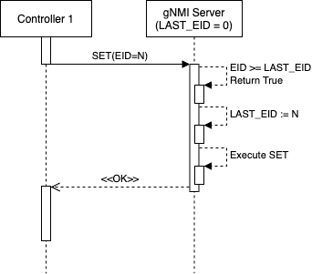

# gNMI Master Arbitration HLD

## Table of Content
- [Revision](#revision)
- [Scope](#scope)
- [Definitions / Abbreviations](#definitions--abbreviations)
- [Overview](#overview)
- [Requirements](#requirements)
- [Architecture Design](#architecture)
- [High-Level Design](#high-level-design)
- [SAI API](#sai-api)
- [Configuration and management](#configuration-and-management)
- [Warmboot and Fastboot Design Impact](#warmboot-and-fastboot-design-impact)
- [Restrictions / Limitations](#restrictions--limitations)
- [Testing Requirements / Design](#testing-requirements--design)
- [Open / Action items - if any](#open--action-items---if-any)

### Revision

| Rev  | Rev Date   | Author(s)          | Change Description |
|------|------------|--------------------|--------------------|
| v0.1 | 03/14/2023 | Tomek Madejski (Google), Sally Lyu (Google) | Initial version |

### Scope

This document describes the high level design of gNMI Master Arbitration. It provides a detailed explanation of the definition, as well as the implementation needed in the SONIC framework.


### Definitions/Abbreviations

gNMI - gRPC Network Management Interface (gNMI) is a protocol to manage and report a network element's configuration and operational data.

gNMI client - a software application that is used to connect to a network element and manage its configuration and operational data. The gNMI client can be written in any language that supports gRPC.

SDN - Software-defined networking (SDN) is a network architecture that uses software-based controllers or application programming interfaces (APIs) to communicate with underlying hardware infrastructure and direct traffic on a network.

EID -  Election ID. A 128-bit integer. The election ID MUST be guaranteed to be monotonically increasing.But how it is done is out of scope of this document and implementation.

Reference: https://github.com/openconfig/reference/blob/master/rpc/gnmi/gnmi-master-arbitration.md

### Overview

For high availability, a system may run multiple replicas of a gNMI client (controller). Among the replicas, only one client should be elected as master and do gNMI operations that mutate any state on the target. However, in the event of a network partition, there can be two or more replicas thinking themselves as master. For read-only RPCs, this is OK. But if they both call the `Set` RPC, the target may be incorrectly configured by the stale master. Therefore, "Master Arbitration" is needed when multiple clients exist.

**Definition**

When Master Arbitration feature is turned on, the gNMI server receives a proto with the election ID (EID) specified in it. The election ID is a 128-bit integer MUST be guaranteed to be monotonically increasing -- a new master's election ID MUST always be larger than its predecessor. The process through which election IDs are allocated to client replicas is out-of-scope of this specification.

The client carries the election ID in all of its `Set` requests. When the target receives any `Set` request, it looks at the election ID carried with the requests and stores the largest ID it sees. An election ID that is equal to or greater than the currently stored one should be accepted as the master. On the other hand, Set requests with no election ID or with a smaller election ID are rejected and return an error.

**Client Role**

Sometimes, there is a need to partition the config tree among multiple clients
(where each client in turn could be replicated). This is accomplished by
assigning a *role* to each client. Master Arbitration is performed on a per-role
basis. There can be one master for each role, i.e. multiple master clients are
allowed only if they belong to different roles.

The role is identified by its `id`, which is assigned offline in agreement
across the entire control plane. The target will use the role ID to arbitrate
such that each role has one and only one master controller instance.

To simplify for use-cases where multiple roles are not needed, the client can
leave the role message unset in MasterArbitration. This implies default role.
All `Set` RPCs that uses a default role are arbitrated in the same group.

### Requirements

Master Arbitration is a HA (high-availability) SDN-focused feature therefore it cannot be enabled by default. On the other hand, when it is required, it has to be enabled from the very moment the gNMI server starts. As an optional feature, Master Arbitration could be turned off when gNMI server restarted. And it should not impact the overall perfermance.

### Architecture Design

No architecture change is needed for Master Arbitration. The protobuf changes is done already. The protobuf of a `MasterArbitration` message is defined as following:

```
message MasterArbitration {
  Role role = 1;
  Uint128 election_id = 2;
}

message Uint128 {
  uint64 high = 1;
  uint64 low = 2;
}

message Role {
  string id = 1;
}
```

The Master Arbitration is an extension of the basic gNMI protocol. It uses the extension field in the SetRequest message that has been introduced to allow adding such extensions as the Master Arbitration.

```
// SetRequest is sent from a client to the target to update values in the data
// tree. Paths are either deleted by the client, or modified by means of being
// updated, or replaced. Where a replace is used, unspecified values are
// considered to be replaced, whereas when update is used the changes are
// considered to be incremental. The set of changes that are specified within
// a single SetRequest is considered to be a transaction.
// Reference: gNMI Specification Section 3.4.1
message SetRequest {
  ...
  // Extension messages associated with the SetRequest. See the
  // gNMI extension specification for further definition.
  repeated gnmi_ext.Extension extension = 5;
}
```

The Master Arbitration uses the following messages that are defined in the `gnmi_ext.proto`.

```
// ...

// The Extension message contains a single gNMI extension.
message Extension {
  oneof ext {
    RegisteredExtension registered_ext = 1;    // A registered extension.
    // Well known extensions.
    MasterArbitration master_arbitration = 2;  // Master arbitration extension.
    History history = 3;                       // History extension.
  }
}

// ...
```

### High-Level Design

When Master Arbitration is enabled, `SetRequest` with `MasterArbitration` message sent from clients (controllers) will get checked by gNMI. The client with the highest `election_id` will be treated as master with the condition of `ReqFromMaster = True`. The rest clients are non-masters. After the initial `SetRequest`, only request from master will be handled by gNMI server, the requests from non-master clients will be dropped.

The implementation of Master Arbitration, a new built-in feature in SONIC, will involve modifications in the telemetry module and the sonic-gnmi repository. However, it is important to note that this change will not affect other modules or sub-modules. It is worth mentioning that Master Arbitration does not require any changes to be made to SWSS or Syncd. A new field will be created in `CONFIG_DB` to record the status of Master Arbitration.

**Optional Feature**

Master Arbitration is an optional feature that can be turned on with a command-line option when gNMI server starts. It will not affect the requirements and dependencies for warm reboot or fastboot. Additionally, no docker dependency and build dependency changes are required. The performance and scalability of the system should remain the same as they are currently. The only additional memory requirements are for a 128-bit ID and the memory needed for the role object.

To enable Master Arbitration, a commend-line parameter will be employed, namely `--with-master-arbitration`. When gNMI server starts, the variable set by `--with-master-arbitration` will be checked:

```
var (
  withMasterArbitration = flag.Bool("with-master-arbitration", false, "Enables Master Arbitration policy.")
)

// ...

if withMasterArbitration {
  gnmi.ReqFromMaster = gnmi.ReqFromMasterEnabledMA
}

```

**Use Cases**

To enable usage of UMF's implementation of gNMI in SDN, it is important to implement Master Arbitration protocols. SDN allows for multiple controllers to interact with a specific switch, but without Master Arbitration, multiple controllers may try to configure the same switch, leading to incorrect configuration of the switch. In the absence of Master Arbitration in the `SetRequest` extension, a default `EID = 0` is assigned to each controller. This can lead to conflicts where one controller may configure the gNMI server with one set of configurations, while another controller wants to configure the server with a different set of configurations. As a result, the gNMI server may receive conflicting `SetRequest`s from both controllers, leading to a situation where it alternates between the configurations set by each controller. Therefore, Master Arbitration is necessary to ensure that only one controller is responsible for configuring the switch and prevent conflicting requests from multiple controllers.


If only one controller is interacting with the gNMI server and Master Arbitration is enabled, the behavior of the controller-switch is identical to the scenario where there is no Master Arbitration.



In a scenario where there are multiple controllers, only the master controller is allowed to modify the switche's configuration using the gNMI server. Suppose Controller 1 with `EID = N` sets a configuration to the gNMI server first. If Controller 2 sends a `SetRequest` with `EID = N + M`, the gNMI server will execute the `SetRequest` from Controller 2 and record `LAST_EID = N + M` to compare with any incoming `SetRequest`s. If Controller 1 subsequently sends a `SetRequest` with `EID = N`, the `SET` operation will not be executed because Controller 2 is currently the master controller.


It should be noted that Master Arbitration only affects `SET` operations. Therefore, when Controller 2 is chosen as the master controller, a `GetRequest` from Controller 1 can be executed without any problem.


**Debug Facility**

The modification of the `SetRequest` has an impact on the gNMI management interface. In order to ensure serviceability and facilitate debugging, it will be necessary to include a logging message for Master Arbitration.

As a disabled feature by default, a DEBUG level log message is needed when a client is seleced as master, i.e. `ReqFromMaster = True`. When gNMI server decides a non-master client, a DEBUG level log message should be generated as well. The message should include the `election_id`. Error level log message should be printed when a non-master clients try to send request to gNMI server, inidcating the `Permission Deny` error.

### SAI API

Master Arbitration is a gRPC related feature and it has no impact on SAI API.

### Configuration and management

gNMI management interfaces will be modified by adding more functionalities. The very first thing that gNMI server does is to authenticate the caller by calling the `authenticate()` method. As this method is called for all gNMI and gNOI RPCs it is not the right place to add the Master Arbitration handling code.

As there is no point in authenticating the caller if the caller is not the Master, the code handling the Master Arbitration protocol should be called before the `authenticate()` method.


A `MasterArbitration` message is required in the `SetRequest` if Master Arbitration is enabled. `SET` RPC handler is expanded to use one of two functions that handle incoming `SetRequest` differently if the Master Arbitration is enabled or disabled. By default, disabling Master Arbitration is applied:

```
// ReqFromMasterDisabledMA always returns true. It is used when Master Arbitration
// is disabled.
func ReqFromMasterDisabledMA(req *gnmipb.SetRequest) bool {
  return true
}

// ReqFromMaster point to a function that is called to verify if the request comes
// from a master controller.
ReqFromMaster := ReqFromMasterDisabledMA

func (s *Server) Set(ctx context.Context, req *gnmipb.SetRequest) (*gnmipb.SetResponse, error) {
  if !reqFromMaster(req) {
    return nil, status.Error(codes.PermissionDenied, "Not a master")
  }

  // ...

```

If Master Arbitration is enabled, the following check is executed:

```
type uint128 struct {
  High uint64
  Low uint64
}

func (lh *uint128) Compare(rh *uint128) {
  if lh.High > rh.High {
    return 1;
  }
  if lh.High < rh.High {
    return -1;
  }
  if lh.Low > rh.Low {
    return 1;
  }
  if lh.Low < rh.Low {
    return -1;
  }
  return 0;
}

var masterEID = uint128{High: 0, Low: 0}

// ReqFromMasterEnabledMA returns true if the request is sent by the master
// controller.
func ReqFromMasterEnabledMA(req *gnmipb.SetRequest) bool {
  // Read the election_id.
  reqEID := uint128{High: 0, Low: 0}
  // It can be one of many extensions, so iterate through them to find it.
  for _, e := range req.extension {
    ma := e.GetMasterArbitration()
    if ma == nil {
      continue
    }
    // The Master Arbitration descriptor has been found.
    reqEID = uint128{High: ma.ElectionID.High, Low = ma.ElectionID.Low}
    // Use the election ID that is in the last extension, so, no 'break' here.
  }
  switch masterEID.Compare(reqEID) {
  case 1:  // This Election ID is smaller than the known Master Election ID.
    return false
  case -1: // New Master Election ID received!
    masterEID = reqEID
  }
  return true
}
```

#### Manifest (if the feature is an Application Extension)

N/A

#### CLI/YANG model Enhancements

N/A

#### Config DB Enhancements

N/A

### Warmboot and Fastboot Design Impact

N/A

### Restrictions/Limitations

Master Arbitration is designed to enable one master client for one role. However, only default role is supported for now.  In other words, the content of the role field is ignored.

### Testing Requirements/Design
The main focus of the test is on the coverage of the new feature. The user cases are listed as following:

* No Master Arbitration extension protobuf when Master Arbitration is disabled
  * Nothing should happen

* No Master Arbitration extension protobuf when Master Arbitration is enabled
  * The EID = 0 should be used

* Multiple arbitration extension protobufs when Master Arbitration is disabled
  * Nothing should happen

* Multiple Master Arbitration extension protobufs when Master Arbitration is enabled
  * The last one should be used.

* Change of the master taking place
  * Accepted call from EID = 1
  * Accepted call from EID = 2
  * Rejected call from EID = 1

* Restart of the switch resets the expected master EID to 0

#### Unit Test cases

Mock one or more clients in the unit tests to test the feature. Here are the list of test cases in unit test:

* TestDisabledMasterArbitration
  * Single client - Expect always recieving request
  * Multiple clients - Expect recieving requests from all clients
* TestEnabledMasterArbitrationWithoutProtoDefine
  * Single client - Expect always recieving request
  * Multiple clients - Expect recieving requests from all clients, as all clients with `EID = 0` but no comparsion happens.
* TestDisabledMasterArbitrationWithProtoDefine
  * Single client - Expect always recieving request
  * Multiple clients - Expect recieving requests from all clients
* TestEnabledMasterArbitrationWithProtoDefine
  * Single client - Expect always recieving request
  * Multiple clients - Expect recieving requests from the client with the largest `EID`. As `EID` is guaranteed to be monotonically increasing, the last client will be used.
* TestEnabledMasterArbitrationWithChangeOfMaster
  * Single client - Expect always recieving request
  * Multiple clients - Expect recieving requests from the client with the largest `EID` and requests from other clients will be rejected.
* TestMasterArbitrationWhenSwitchRestart
  * Single client - Expect client with `EID = 0`
  * Multiple clients - Expect all clients with `EID = 0`.


#### System Test cases

The test cases for system test are the same as the ones for the unit tests. Instead of mocking clients, real requests will be send to verify the behavior of Master Arbitration.

### Open/Action items - if any
N/A