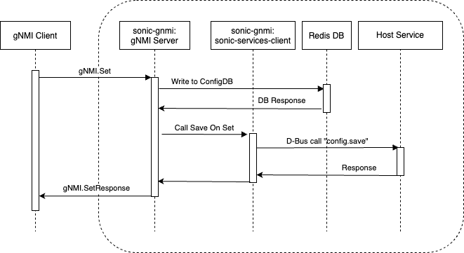

# Save-On-Set HLD #

_Rev v0.1_

## Table of Contents

- [Save-On-Set HLD](#save-on-set-hld)
  - [Table of Contents](#table-of-contents)
    - [Revision](#revision)
    - [Scope](#scope)
    - [Definitions/Abbreviations](#definitionsabbreviations)
    - [Overview](#overview)
    - [Requirements](#requirements)
    - [Architecture Design](#architecture-design)
    - [High-Level Design](#high-level-design)
      - [Required Changes](#required-changes)
        - [Telemetry Executable](#telemetry-executable)
        - [Call to Save ConfigDB](#call-to-save-configdb)
        - [gNMI.Set() Handler](#gnmiset-handler)
    - [SAI API](#sai-api)
    - [Configuration and management](#configuration-and-management)
      - [gNMI](#gnmi)
      - [Manifest (if the feature is an Application Extension)](#manifest-if-the-feature-is-an-application-extension)
      - [CLI/YANG model Enhancements](#cliyang-model-enhancements)
      - [Config DB Enhancements](#config-db-enhancements)
    - [Warmboot and Fastboot Design Impact](#warmboot-and-fastboot-design-impact)
    - [Restrictions/Limitations](#restrictionslimitations)
    - [Testing Requirements/Design](#testing-requirementsdesign)
      - [Unit Test cases](#unit-test-cases)
      - [System Test cases](#system-test-cases)
    - [Open/Action items - if any](#openaction-items---if-any)

### Revision

| Rev  | Rev Date   | Author(s)          | Change Description |
|------|------------|--------------------|--------------------|
| v0.1 | 02/22/2021 | Tomek Madejski (Google), Ryan Lucus (Google)  | Initial version |

### Scope

Add the option for enabling the SONiC gNMI implementation to save its in-memory stored configuration to a file every time it changes.

### Definitions/Abbreviations

- [gNMI](https://github.com/openconfig/reference/blob/master/rpc/gnmi/gnmi-specification.md) - Google Network Management Interface
- UMF - Unified Management Framework


### Overview

Having configuration be persistant across switch reboot is a useful feature that is not currently implemented by UMF.

The required behaviour is to save the configuration to a file that is used to populate the configuration database during the startup process every time the gNMI.Set() RPC call is performed.

Due to SONiC architecture the UMF container cannot perform this action completely by itself and a dedicated support is needed on the ‘host’ side.

Currently there are a number of devices that are ‘out in the wild’ that use the current implementation of the UMF and therefore do not persist configuration across reboots and their behavior cannot be changed without changing the configuration tools that interact with them.
For this reason and for more versatility the save-on-set behavior should be able to be toggled by a command-line parameter to the telemetry executable.

### Requirements

This feature should be off by default to avoid interfering with legacy switches.
### Architecture Design

This feature does not change the SONiC Architecture

### High-Level Design

- Is it a built-in SONiC feature or a SONiC Application Extension?
  - built-in SONiC feature
- What are the modules and sub-modules that are modified for this design?
  - gNMI Server
- What are the repositories that would be changed?
  - [sonic-gnmi](https://github.com/sonic-net/sonic-gnmi)
  - [sonic-mgmt-common](https://github.com/sonic-net/sonic-mgmt-common)
- Module/sub-module interfaces and dependencies.
  - Adds a flag to the gNMI module.
- SWSS and Syncd changes in detail
  - N/A
- DB and Schema changes (APP_DB, ASIC_DB, COUNTERS_DB, LOGLEVEL_DB, CONFIG_DB, STATE_DB)
  - Adds an entry to the CONFIG_DB to determine if the feature is enabled.
- Sequence diagram if required.

- Linux dependencies and interface
  - N/A
- Warm reboot requirements/dependencies
  - None
- Fastboot requirements/dependencies
  - None
- Scalability and performance requirements/impact
  - If the feature is enabled, there is performance hit that scales with the size of ConfigDB.
- Memory requirements
  - Negligible, a couple function pointers.
- Docker dependency
  - None
- Build dependency if any
  - None
- Management interfaces - SNMP, CLI, RestAPI, etc.,
  - [Configuration and management](#configuration-and-management)
- Serviceability and Debug (logging, counters, trace etc) related design
  - Logging of feature being enabled;
- Is this change specific to any platform? Are there dependencies for platforms to implement anything to make this feature work? If yes, explain in detail and inform community in advance.
  - Any Platform
- SAI API requirements, CLI requirements, ConfigDB requirements. Design is covered in following sections.

#### Required Changes

##### Telemetry Executable
A new command-line parameter will be added to control the behavior of the save-on-set functionality. By default, i.e. when the option is not specified, the gNMI server will behave as it did before this change - the configuration will not be saved to a file without explicit action from the administrator for example by execution of a command via ssh connection.

The new parameter will be: --with-save-on-set and when present it will configure a function pointer variable gnmi.SaveOnSet to point to a function that actually performs the save operation.

```go
var (
  withSaveOnSet = flag.Bool("with-save-on-set", false, "Enables save-on-set.")
)

// ...

if *withSaveOnSet {
  gnmi.SaveOnSet = gnmi.SaveOnSetEnabled
}
```

##### Call to Save ConfigDB
A function to initial the backup located in the sonic-mgmt-framework.

```go
// SaveConfig initiates the operation of saving the current content of
// the ConfigDB to a file that is then used to populate the database during the
// startup.
func SaveConfig() error {
    r := HostQuery("cfg_mgmt.save", []string{})
    if r.Err != nil{
        return errors.New("internal SONiC Hostservice failure: " + r.Err.Error())
    }
    if len(r.Body) < 2 {
        return errors.New(
            "internal SONiC Hostservice failure: the response is too short.")
    }
    if _, ok := r.Body[0].(int32); !ok {
        return errors.New(
            "internal SONiC Hostservice failure: first element is not int32.")
    }
if_, ok := r.Body[1].(string); !ok {
        return errors.New(
            "internal SONiC Hostservice failure: second element is not string.")
    }
    if r.Body[0].(int32) != 0 {
        return errors.New(r.Body[1].(string))
    }
    return nil
}
```

##### gNMI.Set() Handler

The RPC will execute the save-on-set function at the end of each call.

```go
// SaveOnSetEnabled saves configuration to a file
func SaveOnSetEnabled() {
  transformer.SaveStartupConfig()
}
// SaveOnSetDisabeld does nothing.
func SaveOnSetDisabled() {}

// SaveOnSet point to a function that is called to save changes of configuration
// to a file. By default it points to an empty function - the configuration is not
// saved to a file.
var SaveOnSet = SaveOnSetDisabled

func (s *Server) Set(ctx context.Context, req *gnmipb.SetRequest) (*gnmipb.SetResponse, error) {

  // ...

  SaveOnSet()
  return resp, err
}
```

### SAI API

No change in SAI API.

### Configuration and management

#### gNMI

Adds flag to enable feature in gNMI binary

#### Manifest (if the feature is an Application Extension)

Not an app extension.

#### CLI/YANG model Enhancements

No changes to CLI or YANG

#### Config DB Enhancements

Add an entry to Config DB for toggling the save-on-set feature.

### Warmboot and Fastboot Design Impact

No effect on warm/fast boot

### Restrictions/Limitations

### Testing Requirements/Design

#### Unit Test cases

- No behavior change if the feature is not enabled.
- A gNMI.Set() call should generate a signal to save ConfigDB.
#### System Test cases

- A gNMI.Set() call should result in an update to the ConfigDB backup file.

### Open/Action items - if any
