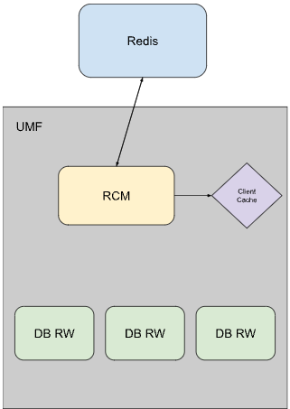

# Redis Client Manager \(RCM\) HLD #

## Table of Contents
- [Table of Contents](#table-of-contents)
- [Revision](#revision)
- [Scope](#scope)
- [Definition/Abbreviation](#definitionsabbreviations)
- [Overview](#overview)
- [Requirements](#requirements)
- [Architecture Design](#architecture-design)
- [High Level Design](#high-level-design)
- [SAI API](#sai-api)
- [Configuration and Management](#configuration-and-management)
- [Warmboot and Fastboot Design Impact](#warmboot-and-fastboot-design-impact)
- [Memory Consumption](#memory-consumption)
- [Restrictions/Limitations](#restrictionslimitations)
- [Testing Requirements/Design](#testing-requirementsdesign)
- [Open/Action items - if any](#openaction-items---if-any)

### Revision
| Rev  | Rev Date   | Author(s)          | Change Description |
|------|------------|--------------------|--------------------|
| v0.1 | 09/13/2024 | Lucas Rodriguez (Google) | Initial version |

### Scope

This document describes the high-level design using Redis connection pools to connect to Redis from within sonic-mgmt-common. It describes the singleton object that manages these connections and the integration of these connection pools into the existing framework.

### Definitions/Abbreviations

- Redis: An open-source, in-memory data store that's used as a cache, database, and message broker.
- RCM: Redis Client Manager.
- Redis Client: A type defined in go-redis that is used to interact with the Redis databases.
- Redis Transaction: The execution of a group of Redis commands in a single step.
- go-redis: The [Redis API](https://pkg.go.dev/github.com/go-redis/redis/v8) used in sonic-mgmt-common.
- RPC: Remote Procedure Call, used to interface with sonic-mgmt-common.
- CVL: [Config Validation Library](https://github.com/sonic-net/SONiC/blob/master/doc/mgmt/Management%20Framework.md#3228-config-validation-library-cvl)

### Overview

The translib framework that lives in sonic-mgmt-common is responsible for carrying out various config and telemetry related tasks, such as serving gNMI GETs, SETs, and SUBSCRIBEs. In order to do this, translib creates and uses many Redis Clients to read/write the Redis databases. Redis Clients support connection pooling, which consists of keeping a pool of active connections that can be used instead of creating a new one each time one is needed. Connection pools significantly reduce the number of connections made to Redis and reduce stress on the Redis TCP/Unix sockets. Since the connection pools are held and managed by a Redis Client object, these Redis Client objects must be reused instead of being closed after each use.

### Requirements

- Redis Clients with a connection pool must be reused wherever possible instead of creating a new Redis Client each time one is needed, within sonic-mgmt-common.
- Transactional Redis operations must be handled correctly. Connection pools do not support transactions.
- The number of Redis Clients and connections to Redis must be tracked for the life of the server.

### Architecture Design

This design does not change the existing SONiC Architecture. This design adds a new API that is meant to be a replacement for redis.NewClient and redis.Close.

### High-Level Design

This design introduces a new API that manages all Redis connections within sonic-mgmt-common called Redis Client Manager (RCM). With a central manager, Redis Clients can be kept open after an RPC completes, reused, and usage statistics can be tracked. This will also abstract most of the Redis logic away from the user and avoid misuse of the go-redis library. Since the RCM will be the only place in sonic-mgmt-common where new Redis Clients are created, any client/connection creation failure can be exposed here. By pinging a newly created client, UMF can identify and log any connection failures.

The new API will expose four new functions that will replace [redis.NewClient](https://pkg.go.dev/github.com/go-redis/redis/v8#NewClient) and [redis.Close](https://pkg.go.dev/github.com/go-redis/redis/v8#Client.Close).

#### RedisClient(db DBNum)

This RedisClient function takes in a database number, defined in [db.go](https://github.com/sonic-net/sonic-mgmt-common/blob/master/translib/db/db.go#L136), and returns an existing Redis Client to the caller. This Redis Client can be shared across multiple goroutines and has a connection pool. It cannot be used for [Transactional Redis Operations](https://redis.io/docs/latest/develop/interact/transactions/) (such as MULTI, EXEC, PSUBSCRIBE, etc...).

This function is implemented using a cache of Redis Clients that are initialized during the Go init process. One client is created for each DBNum and stored in a map. Initially, each Redis Client will only have 1 active connection in the connection pool but the number of connections in the pool can grow up to a specified max number of connections as needed. The max pool size is set to 20, and the rest of the Redis options are taken from the [existing API](https://github.com/sonic-net/sonic-mgmt-common/blob/master/translib/db/db_redis_opts.go) for these options. This init process looks like this:

When a Redis Client is requested through this new function, the Redis Client is taken from the cache and returned to the caller. Multiple callers can use a given Redis Client at a time and the number of connections in the pool will increase to satisfy simulatenous Redis operations through the same client. All of the connection pool management is handled by go-redis, with more details [here](https://pkg.go.dev/github.com/go-redis/redis/v8#Options). This process looks like this:

#### TransactionalRedisClient(db DBNum)

The TransactionalRedisClient function takes in a database number, defined in [db.go](https://github.com/sonic-net/sonic-mgmt-common/blob/master/translib/db/db.go#L136), creates a new Redis Client for that database with a PoolSize of 1, and returns it to the caller. This Redis Client is not shared with any other client and it can be used for [Transactional Redis Operations](https://redis.io/docs/latest/develop/interact/transactions/) (such as MULTI, EXEC, PSUBSCRIBE, etc...). This client must be closed after it is done being used, by calling CloseRedisClient. The Redis Options that are used to create the client will be fetched using the existing [adjustRedisOpts()](https://github.com/sonic-net/sonic-mgmt-common/blob/master/translib/db/db_redis_opts.go#L80) API.

No initialization is required to support this function. A new client is created using redis.NewClient when this function is called. This process looks like this:

#### TransactionalRedisClientWithOpts(opts *redis.Options)

The TransactionalRedisClientWithOpts function takes in [redis.Options](https://pkg.go.dev/github.com/go-redis/redis/v8#Options) struct, creates a new Redis Client with those options and a PoolSize of 1, and returns it to the caller. This Redis Client is not shared with any other client and it can be used for [Transactional Redis Operations](https://redis.io/docs/latest/develop/interact/transactions/) (such as MULTI, EXEC, PSUBSCRIBE, etc...). This client must be closed after it is done being used, by calling CloseRedisClient. The purpose of this function is to provide a more custom client to the caller if necessary.

The implementation of this function is very similar to TransactionalRedisClient.

#### CloseRedisClient(client *redis.Client)

The CloseRedisClient function takes in a [redis.Client](https://pkg.go.dev/github.com/go-redis/redis/v8#Client) object and closes the client if necessary. For shared Redis Clients that use a connection pool, this function is a no-op because those clients must stay open. For unique Redis Clients fetched with TransactionalRedisClient or TransactionalRedisClientWithOpts, this function will close the client. This is necessary to prevent a leak of these clients.

The function is implemented by calling [redis.Close](https://pkg.go.dev/github.com/go-redis/redis/v8#Client.Close) on the client if the pool size of that Client is equal to 1.

#### Counters

RCM keeps counters for the number of requests for Redis Clients. The counters are updated on calls to the functions described above. This is why it is important to refactor all call sites to use these new functions. The counters include:
- curTransactionalClients: The number of active transactional clients that were provided by RCM.
- totalPoolClientsRequested: The number of pool clients that were requested through RCM.
- totalTransactionalClientsRequested: The number of transactional clients that were requested through RCM.

Additionally go-redis has internal counters for Connection Pools that can be accessed for each Redis Client in the cache. More details are provided [here](https://pkg.go.dev/github.com/go-redis/redis/v8@v8.11.5/internal/pool#Stats).

The counters will be managed by RCM and exported through the existing [DBStats](https://github.com/sonic-net/sonic-mgmt-common/blob/master/translib/db/db_stats.go) API. This will require modifications to the existing API to integrate these new counters.

#### Command Line Flag

The connection pools feature can be disabled through a new boolean command line flag: "use_connection_pools"

This flag is set to true by default, enabling connection pools.

When "use_connection_pools" is false, all calls to RedisClient() will just call TransactionalRedisClient(). This will return a unique Redis Client to each caller and bypass the pool feature completely.

#### Refactoring Callsites

In all places where a Redis Client is not used to perform a transactional operation, the call will be refactored to use RedisClient(). This will result in the caller now using a shared Redis Client with a connection pool. This will significantly reduce the number of new Redis Clients and connections to Redis.

In all places where a transactional operation is performed, the call will be refactored to use TransactionalRedisClient(). This will give the caller a new Redis Client that is unique. If more options need to be specified, the call will be refactored to use TransactionalRedisClientWithOpts().

The calls to redis.NewClient() that will be refactored are:
- [db.go:401](https://github.com/sonic-net/sonic-mgmt-common/blob/b91a4df3bd0e4be97e67ab3f27b1826b1713afc5/translib/db/db.go#L401): RedisClient or TransactionalRedisClient depending on the value of the `ForceNewRedisConnection` option.
- [db_lock.go:268](https://github.com/sonic-net/sonic-mgmt-common/blob/b91a4df3bd0e4be97e67ab3f27b1826b1713afc5/translib/db/db_lock.go#L268): TransactionalRedisClient
- [db_stats.go:538](https://github.com/sonic-net/sonic-mgmt-common/blob/b91a4df3bd0e4be97e67ab3f27b1826b1713afc5/translib/db/db_stats.go#L538): TransactionalRedisClient
- []

Since calls to [NewDB()](https://github.com/sonic-net/sonic-mgmt-common/blob/b91a4df3bd0e4be97e67ab3f27b1826b1713afc5/translib/db/db.go#L388) will need to result in using a pool or transactional Redis Client, the caller will need to specify which one is needed. A new DB [Option](https://github.com/sonic-net/sonic-mgmt-common/blob/b91a4df3bd0e4be97e67ab3f27b1826b1713afc5/translib/db/db.go#L164) is being introduced, called `TrasactionsRequired`. If a transactional Redis Client is needed, the caller of NewDB() needs to pass this option in, otherwise a pool client will be used.

All the calls to NewDB() and their corresponding `ForceNewRedisConnection` value are:
- [cs.go:183](https://github.com/sonic-net/sonic-mgmt-common/blob/b91a4df3bd0e4be97e67ab3f27b1826b1713afc5/translib/cs/cs.go#L183): TrasactionsRequired=`true`
- [cs_getdb.go:49](https://github.com/sonic-net/sonic-mgmt-common/blob/b91a4df3bd0e4be97e67ab3f27b1826b1713afc5/translib/cs/cs_getdb.go#L49): TrasactionsRequired=`true`
- [db/subscribe.go:145](https://github.com/sonic-net/sonic-mgmt-common/blob/b91a4df3bd0e4be97e67ab3f27b1826b1713afc5/translib/db/subscribe.go#L145): ForceNewRedisConnection=`true`
- [subscribe.go:176](https://github.com/sonic-net/sonic-mgmt-common/blob/b91a4df3bd0e4be97e67ab3f27b1826b1713afc5/translib/subscribe.go#L176): ForceNewRedisConnection=`false`
- [subscribe.go:223](https://github.com/sonic-net/sonic-mgmt-common/blob/b91a4df3bd0e4be97e67ab3f27b1826b1713afc5/translib/subscribe.go#L223): ForceNewRedisConnection=`false`
- [subscribe.go:275](https://github.com/sonic-net/sonic-mgmt-common/blob/b91a4df3bd0e4be97e67ab3f27b1826b1713afc5/translib/subscribe.go#L275): ForceNewRedisConnection=`false`
- [translib:go:179](https://github.com/sonic-net/sonic-mgmt-common/blob/b91a4df3bd0e4be97e67ab3f27b1826b1713afc5/translib/translib.go#L179): ForceNewRedisConnection=`true`
- [translib.go:252](https://github.com/sonic-net/sonic-mgmt-common/blob/b91a4df3bd0e4be97e67ab3f27b1826b1713afc5/translib/translib.go#L252): ForceNewRedisConnection=`true`
- [translib.go:326](https://github.com/sonic-net/sonic-mgmt-common/blob/b91a4df3bd0e4be97e67ab3f27b1826b1713afc5/translib/translib.go#L326): ForceNewRedisConnection=`true`
- [translib.go:399](https://github.com/sonic-net/sonic-mgmt-common/blob/b91a4df3bd0e4be97e67ab3f27b1826b1713afc5/translib/translib.go#L399): ForceNewRedisConnection=`true`
- [translib.go:524](https://github.com/sonic-net/sonic-mgmt-common/blob/b91a4df3bd0e4be97e67ab3f27b1826b1713afc5/translib/translib.go#L524): ForceNewRedisConnection=`true`
- [translib.go:569](https://github.com/sonic-net/sonic-mgmt-common/blob/b91a4df3bd0e4be97e67ab3f27b1826b1713afc5/translib/translib.go#L569): ForceNewRedisConnection=`true`
- [translib.go:468](https://github.com/sonic-net/sonic-mgmt-common/blob/b91a4df3bd0e4be97e67ab3f27b1826b1713afc5/translib/translib.go#L468): ForceNewRedisConnection=`false`

All calls to redis.Close() will be replaced with calls to CloseRedisClient(). This will ensure that Redis Clients that use connection pools are not closed.

### SAI API

This HLD does not include any changes to the SAI API.

### Configuration and Management
Although this change interacts with configuration and management, it should be a transparent change. There is no change in functionality. The purpose of this HLD is to reduce the stress of configuration and management on Redis.

#### CLI/YANG model Enhancements

This HLD does not include any changes to CLI or YANG models.

#### Config DB Enhancements

This HLD does not include any changes to the Config DB.

### Warmboot and Fastboot Design Impact

This HLD does not have any implications on Warmboot/Fastboot.

### Memory Consumption

Increased memory usage from this HLD should be minimal. Increased memory  comes from the 10 (DBNum) Redis pool clients that are created during initialization and stay open for the life of the server. There are also new counters that are being introduced that live in memory.

### Restrictions/Limitations

RCM lives in the translib/db package. This package imports CVL, so refactoring calls in CVL to use RCM would create a circular dependency.

### Testing Requirements/Design

Unit tests are implemented to test RCM's functionality. Since callsites are updated to use RCM, many existing tests provide additional coverage for this feature.

#### Unit Test cases

- TestCreateRedisClient
    - Tests the internal RCM function that creates new Redis Clients.
- TestRedisClient
	- Tests the exposed RCM function that returns a Redis Client with a connection pool, given a DBNum.
- TestTransactionalRedisClient
	- Tests the exposed RCM function that returns a new Redis Client, given a DBNum.
- TestTransactionalRedisClientWithOpts
	- Tests the exposed RCM function that returns a new Redis Client, given a redis.Options object.
- TestCloseRedisClient
	- Tests the exposed RCM function that closes the given Redis Client, if necessary.
- TestIsTransactionalClient
	- Tests the function that returns whether or not a given Redis Client is a transactional one or not.
- TestConnectionPoolDisable
	- Tests the command line flag that can be used to enable/disable Redis connection pools.
- TestNilRCM
	- Tests the scenario where RCM is nil or never intialized.
- TestRedisCounters
	- Tests that the RCM counters are updated correctly given different scenarios.
- TestRedisClientManagerCounters
	- Tests the exposed RCM function that returns the counters held by RCM.
- TestRedisClientPoolExhaustion
	- Tests the scenario where more requests than connections in a given Redis Client's connection pool are received.

### Open/Action items - if any

RCM can be used across other Go repositories, such as sonic-gnmi and sonic-mgmt-framework. This will further reduce the stress on Redis from those repositories.
