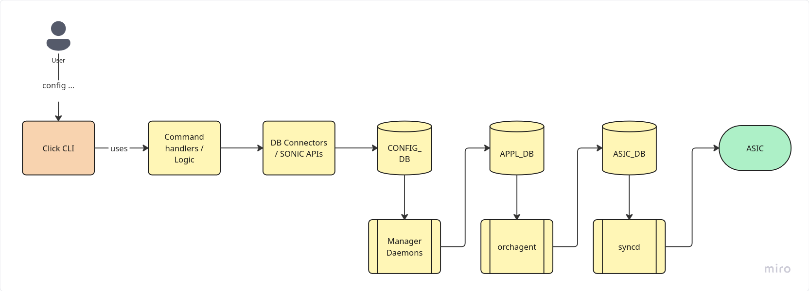
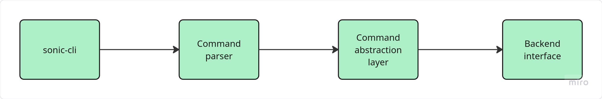
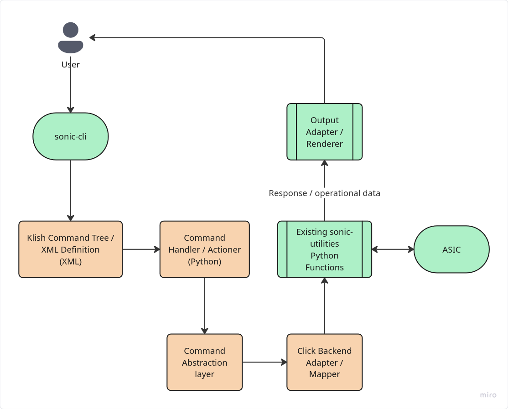
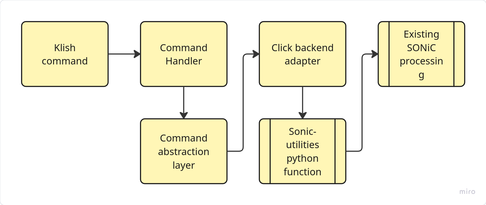
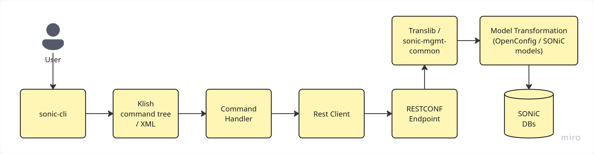

****High-Level Design proposal for SONiC CLI Architecture****

****

****

# **1. Introduction**

****

****SONiC currently provides a set of management interfaces for
configuring and operating network devices, with the **Click-based**
command-line interface being one of the primary interfaces used for
day-to-day configuration and operational tasks. While the existing CLI
provides broad functionality, its command structure ****and output****
differs from the hierarchical, network-device-style CLI commonly used by
network operators.****

****The goal of this work is to provide a modern **sonic-cli **that
offers a more familiar and structured command-line experience ****for
users, ****while integrating with the existing SONiC management
architecture. The CLI should support both configuration commands and
operational commands, while remaining maintainable, extensible, and
aligned with SONiC's existing management mechanisms.****

****Two architectural approaches are being evaluated for the backend
implementation of **sonic-cli**. The first approach reuses the existing
**Click-based** CLI implementation by invoking its underlying functions
through a wrapper or adapter layer. This allows the new CLI to reuse
existing SONiC command logic and validation while exposing a different
user-facing command structure.****

****The second approach decouples **sonic-cli** from the Click CLI
entirely and introduces an independent backend based on REST APIs. In
this model, CLI commands are translated into REST requests that interact
with SONiC management services through dedicated or existing API
endpoints.****

****This document presents the high-level architecture of both
approaches, compares their advantages and limitations, and identifies
the design considerations that influence the choice of backend
architecture for the future development of **sonic-cli**.****

# ****2. **Goals and Non-Goals**

## **2.1 **Goals****

****The main goal of the proposed **sonic-cli** is to provide a
structured and familiar command-line interface for SONiC ****catered
towards network operators ****and independent users****, ****while
integrating cleanly with the existing management architecture.****

**The design aims to:**

- ****Provide a hierarchical, network-device-style CLI with familiar
  configuration and operational modes.****
- ****Support both configuration and operational commands through a
  consistent command structure.****
- ****Reuse existing SONiC data models, management components, and
  validation mechanisms where practical.****
- ****Separate the user-facing CLI from the underlying backend
  implementation so that backend mechanisms can evolve
  independently.****
- ****Provide a modular and extensible architecture that allows new
  commands and features to be added without major changes to the overall
  CLI framework.****
- ****Maintain compatibility with existing SONiC configuration and
  operational workflows.****

## **2.2 Non-Goals**

****The initial implementation is not intended to replace the complete
SONiC management stack or reproduce all existing functionality
immediately.****

**The following are considered outside the initial scope:**

- ****Replacing all existing SONiC management interfaces such as the
  Click CLI, REST APIs, gNMI, or other automation interfaces.****
- ****Reimplementing every command currently available through the
  Click-based CLI in the first development phase.****
- ****Changing the structure or behavior of SONiC's underlying
  configuration databases, including CONFIG_DB, APPL_DB, or
  STATE_DB.****
- ****Modifying the fundamental SONiC control-plane or data-plane
  architecture.****
- ****Removing the existing Click CLI.****

# ****3. Existing management architecture****

****For configuration operations, the Click CLI invokes command-specific
Python functions that use SONiC database connectors or supporting APIs
to modify the desired configuration. Configuration changes are typically
written to CONFIG_DB, from where the relevant SONiC services and manager
daemons process them. Depending on the type of configuration, the
resulting state is propagated through the SONiC database and
orchestration layers until the required configuration is applied to the
underlying switching hardware.****

At a high level, the configuration flow can be represented as:

Operational commands do not
necessarily follow the complete configuration path. Commands used to
display interface state, VLAN information, routing information,
statistics, or other operational data can retrieve information directly
from SONiC databases and services such as CONFIG_DB, STATE_DB, APPL_DB,
or other runtime data sources.

SONiC also exposes multiple management interfaces, including the
Click-based CLI, REST, gNMI, and components of the Management
Framework/UMF. These interfaces provide different paths for accessing
the same underlying SONiC configuration and operational state.

# 4. Proposed common SONiC CLI front-end Architecture

The proposed sonic-cli architecture separates the user-facing CLI from
the mechanism used to interact with SONiC. The CLI frontend is
responsible for parsing user commands, maintaining the CLI command
hierarchy and modes, validating command syntax, and converting user
input into backend-independent operations.

At a high level, the frontend architecture is structured as follows:

The Command Parser interprets the
command entered by the user and identifies the corresponding CLI
operation. It is also responsible for maintaining the hierarchical
command structure and the current CLI context, such as global
configuration mode or interface configuration mode.

The Command Abstraction Layer provides a common internal representation
of CLI operations after parsing. It separates the command syntax
presented to the user from the internal execution flow and ensures that
commands are handled in a consistent way across the CLI.

The Backend Interface defines how these internal operations are passed
from the CLI frontend to the underlying SONiC management components. It
provides a common interaction point for configuration and operational
requests, allowing the command-processing layers above it to remain
independent of backend-specific implementation details.

# 5. Approach 1: Using Click CLI as a Backend

The first approach uses the existing Click-based SONiC CLI
implementation as the backend for sonic-cli. In this architecture,
sonic-cli provides the user-facing command structure and command
hierarchy, while the underlying configuration and operational logic
already implemented in sonic-utilities is reused.

The intention is not to execute existing Click commands as separate
shell commands. Instead, where possible, sonic-cli directly imports and
invokes the underlying functions used by the existing Click
implementation. This avoids creating an additional command-line process
and allows existing validation, database interaction, and logic to be
reused directly.

The purpose of this approach is to avoid implementing a second set of
backend logic for operations that are already supported by SONiC. The
existing configuration validation, database interaction, and
SONiC-specific processing can therefore continue to be used while a
different CLI frontend is provided.

The proposed architecture:

## 5.1 Design

Commands available to the user are defined through the Klish command
tree using XML definitions. Klish provides the hierarchical CLI
structure and passes the parsed command and its parameters to the
corresponding Python command handler/actioner.

The command handler translates the parsed command into an internal
operation that is passed through the command abstraction layer. The
Click backend adapter then maps this operation to the corresponding
functionality available in sonic-utilities.

For example, the following sonic-cli operation:

sonic-cli(config)# interface Ethernet0

sonic-cli(config-if)# ip address 10.0.0.1/24

corresponds functionally to the existing Click operation:

config interface ip add Ethernet0 10.0.0.1/24

The proposed implementation does not invoke the existing command as a
separate shell command. Instead, the Click backend adapter should, where
possible, directly import and invoke the Python functionality used to
implement the existing command.

The execution flow can therefore be summarized as:

Once the request reaches the existing sonic-utilities functionality,
processing continues through the existing SONiC mechanisms. No
alternative configuration path to the SONiC databases or services is
introduced by this approach.

For operational commands, information returned by the existing
implementation is passed to an output adapter or renderer before being
presented to the user. This allows sonic-cli to provide its own output
structure which without requiring the existing Click output format to be
exposed directly.

## 5.2 Main Components

Klish Command Tree / XML Definitions

Defines the command hierarchy, available commands, parameters, and CLI
contexts exposed through sonic-cli.

Command Handler / Actioner

Receives the parsed command and parameters from Klish and initiates the
corresponding CLI operation.

Command Abstraction Layer

Provides a common representation of the requested operation before it is
passed to the backend implementation.

Click Backend Adapter / Mapper

Maps the operation generated by sonic-cli to the appropriate existing
sonic-utilities Python functionality and performs any required parameter
conversion.

Existing sonic-utilities Python Functions

Provide the existing implementation for configuration and operational
functionality, including SONiC-specific validation and interaction with
databases and services.

Output Adapter / Renderer

Processes responses and operational data returned from the backend and
converts them into the output representation required by sonic-cli.

## 5.3 Advantages

- Reuses existing SONiC configuration and operational functionality.
- Avoids duplicating business logic already implemented in
  sonic-utilities.
- Retains existing validation and SONiC-specific processing where the
  underlying functions can be reused directly.
- Requires less backend development compared with implementing the same
  operations independently.
- Allows CLI functionality to be introduced incrementally by mapping
  commands to existing implementations.
- Continues to use the existing SONiC database and service processing
  paths.
- Fixes or improvements to shared underlying functionality can
  potentially be reused by both CLI implementations.
- Development and debugging is much easier.
- Initial adaptation and development is much faster.
- Development teams can be cross-functional.

## 5.4 Disadvantages

- sonic-cli becomes dependent on the internal structure of
  sonic-utilities.
- Requires a few changes on the click-cli to expose those interfaces to
  sonic-mgmt-framework.
- Some existing functions may depend on Click-specific decorators,
  contexts, parameter handling, or other CLI-specific behaviour.
- Internal function signatures and implementation details may change as
  sonic-utilities evolves.
- Some commands may require additional adapter logic before their
  existing functionality can be reused.
- Operational commands that directly generate terminal output may
  require refactoring or interception to provide structured data to the
  sonic-cli renderer.
- Commands without reusable underlying functions may require changes to
  the existing implementation before they can be integrated.
- Slower command execution as it depends on the click-cli python
  packages.

# 6. Approach 2: Independent CLI with REST Backend

The second approach builds on the architecture already used by the
existing sonic-cli implementation in the SONiC Management Framework.
Instead of depending on the Click-based sonic-utilities implementation,
sonic-cli communicates with SONiC through REST-based management
interfaces. However, the current state of implementation is very
limited.

Where suitable OpenConfig model-driven endpoints already exist, they can
be reused directly. For operations that are not currently supported by
the available endpoints, the required REST functionality can be extended
or implemented within the existing management framework rather than
routing the command through Click.

## 6.1 Design

In this approach, sonic-cli continues to use the existing Klish-based
frontend. Commands and command hierarchies are defined through XML, and
the associated actioner receives the parsed command parameters.

Instead of mapping the requested operation to a Click function, the
actioner communicates with the SONiC Management Framework through a
REST-based interface.

For example:

sonic-cli(config)# interface Ethernet0

sonic-cli(config-if)# ip address 10.0.0.1/24

can be translated into a REST or RESTCONF request targeting the
corresponding interface configuration resource.

Where an appropriate OpenConfig endpoint exists, the command can use the
existing model-driven path. The management framework translates the
external model representation into the SONiC representation required by
the underlying databases and services.

For functionality that is not currently exposed through an appropriate
endpoint, the REST layer can be extended while continuing to use the
same management framework architecture.

Operational commands follow the same general mechanism. The backend
retrieves the requested state or operational data and returns structured
information to the CLI, which can then render it in the required format.

## 6.2 Main Components

**Klish Command Tree / XML Definitions**

Defines the command hierarchy, syntax, parameters, and configuration
modes exposed through sonic-cli.

**Command Handler / Actioner**

Receives the parsed command and parameters and initiates the
corresponding backend request.

REST Client

Creates and sends the required REST or RESTCONF request and processes
the returned response.

REST / RESTCONF Endpoints

Expose configuration and operational functionality required by
sonic-cli. Existing OpenConfig or SONiC model-based endpoints can be
used where available, while additional endpoints can be introduced when
necessary.

SONiC Management Framework

Provides the existing model-driven management infrastructure used to
process northbound management requests.

Translib / sonic-mgmt-common

Provides the translation and common management functionality required to
map model-driven requests to the underlying SONiC representation and
databases.

Model Transformation Layer

Handles transformations between external models, such as OpenConfig, and
SONiC-specific models or database representations.

SONiC Databases and Services

Store and process the resulting configuration or operational state
through the normal SONiC architecture.

**Output Renderer**

Formats structured responses returned from the backend into the
representation displayed by sonic-cli.

## 6.3 Advantages

- Keeps sonic-cli independent of the internal implementation of the
  Click CLI.
- Uses the management architecture design already present in the
  existing sonic-cli and SONiC Management Framework.
- Provides a defined interface between the CLI and backend through REST
  or RESTCONF APIs.
- Command execution will be generally faster than Click based approach
  as it is an independent implementation which can be optimised
  accordingly.
- Changes to internal Click or sonic-utilities implementations do not
  directly affect sonic-cli.
- Missing functionality can be added by extending the management API
  without introducing a dependency on Click.

## 6.4 Disadvantages

- Implementing new or extended REST endpoints is a very long process.
- Some SONiC functionality already available through Click may need
  additional implementation in the Management Framework.
- Model transformations between OpenConfig and SONiC representations can
  introduce additional complexity.
- Changes may be required across several repositories or components,
  such as sonic-mgmt-framework and sonic-mgmt-common.
- Development effort is higher for commands that do not already have
  suitable model-driven support.
- API compatibility and model changes must be considered as the
  management framework evolves.
- Debugging can involve several layers between the CLI and the actual
  SONiC database operation.
- Development and debugging effort is much higher as there are multiple
  layers.

# 7. Comparison of Approach

|                           |                                                                                        |                                                                                                  |
|---------------------------|----------------------------------------------------------------------------------------|--------------------------------------------------------------------------------------------------|
| Criteria                  | Click backend                                                                          | REST Backend                                                                                     |
| Development effort        | Lower                                                                                  | Higher                                                                                           |
| Reusability of components | High                                                                                   | Low                                                                                              |
| New backend work          | Limited – as it is reusing sonic utilities                                             | Heavily required                                                                                 |
| Coupling                  | Higher                                                                                 | More separation                                                                                  |
| Long term maintainability | High – as adding functionalities is easier and can be mirrored across both frameworks  | Need separate workflow for every command                                                         |
| Cross-functional teams    | Possible – It will be easier for contributors to rapidly get used to both the systems. | Separation of concerned team is required – as both approaches have very different backend logic. |
| Initial adaptation speed  | Very fast                                                                              | Very slow                                                                                        |
| Command execution speed   | Slower – directly proportional to click-cli commands.                                  | Faster – Independent logic and processing.                                                       |

# 

# 8. Recommended Approach

Approach 1, using the existing Click-based sonic-utilities
implementation as the backend for sonic-cli, is the recommended approach
for the initial implementation.

The main reason is that a large amount of configuration and operational
functionality is already implemented and tested in sonic-utilities.
Reusing these functions avoids duplicating existing SONiC logic and
reduces the amount of new backend development required.

This approach also provides a faster path to increasing sonic-cli
command coverage. Instead of implementing or extending REST endpoints
for every unsupported command, the required functionality can be mapped
to existing Python implementations where they are reusable.

The implementation should avoid executing Click commands through shell
calls. The preferred integration is to directly invoke reusable Python
functionality from sonic-utilities through a defined adapter layer.

The adapter layer is important because it prevents the sonic-cli
frontend from depending directly on individual Click implementation
details. Where existing functions are tightly coupled to Click-specific
decorators, contexts, or output handling, the underlying logic should be
refactored into reusable functions where practical.

The existing Management Framework and REST-based architecture is
available for a limited list of functionalities. However, for the
expansion of sonic-cli, reusing the existing Click implementation
provides the best balance between development effort, functionality
reuse, implementation speed, and compatibility with current SONiC
behaviour.

# 9. Design considerations

The implementation of Approach 1 should consider the following
architectural aspects to ensure that sonic-cli remains maintainable and
does not become unnecessarily dependent on the internal structure of the
existing Click CLI.

- **Backend abstraction:** sonic-cli should access existing
  functionality through a dedicated adapter or mapping layer rather than
  calling sonic-utilities functions directly from individual command
  handlers.

- **Separation from Click-specific behavior:** Reusable functionality
  should be separated from Click decorators, contexts, argument parsing,
  and terminal-specific output where necessary. The objective is to
  reuse the underlying operation rather than the Click command itself.

- **Command mapping: **A clear mapping should exist between each
  sonic-cli command and the corresponding backend operation. This
  mapping should remain separate from the Klish command definitions.

- **Configuration and operational commands:** Configuration commands and
  operational commands may require different handling. Configuration
  functions typically modify SONiC state, while operational functions
  may need additional adaptation to return structured data instead of
  directly printing output.

- **Output formatting:** Backend functions should preferably return data
  that can be formatted by the sonic-cli renderer. Existing
  Click-specific output formatting should not determine the presentation
  of the new CLI.

- **Error propagation:** Errors returned by the existing backend
  functionality should be converted into consistent and meaningful
  sonic-cli responses.

- **Incremental implementation:** Command support should be introduced
  incrementally, starting with functionality that can be cleanly reused
  from sonic-utilities. Commands requiring significant refactoring can
  be addressed separately.

  These considerations allow the implementation to benefit from the
  existing SONiC functionality while keeping the integration between
  sonic-cli and sonic-utilities as well-defined as possible.

# 10. Risk and Open questions

Although Approach 1 provides significant reuse of existing SONiC
functionality, several technical and architectural questions still
remain.

- **Stability of internal interfaces:** The existing Python functions
  are not necessarily defined as stable public APIs. Changes in
  sonic-utilities may therefore require corresponding changes in the
  sonic-cli backend adapter.
- **Command execution performance:** Some existing Click commands may
  have noticeable execution latency. Since Approach 1 reuses the same
  underlying functionality, this performance characteristic may also
  affect sonic-cli. The implementation should therefore evaluate command
  execution time and identify opportunities to reduce unnecessary
  database access, repeated initialization, or other processing overhead
  where possible.
- **Output handling:** Operational commands may directly print formatted
  output rather than return structured data. Additional adaptation or
  refactoring may be required so that results can be rendered
  consistently by sonic-cli.
- **Command coverage:** Not every existing Click command may have a
  directly reusable implementation. Some commands may require additional
  backend logic or restructuring.
- **Validation ownership:** It must be determined which validation
  should remain in the existing backend functions and which validation
  should be performed by the sonic-cli frontend.
- **Long-term maintenance:** The dependency between sonic-cli and
  sonic-utilities should be kept as well-defined as possible to reduce
  maintenance effort when either project evolves.

# 

# 11. Testing

Testing should verify that sonic-cli behaves consistently with the
existing SONiC CLI functionality while correctly using the proposed
backend integration.

The testing should include:

- **CLI parsing tests:** Verify command syntax, hierarchy, configuration
  modes, parameters, and invalid command handling.
- **Command mapping tests:** Verify that each sonic-cli command is
  mapped to the correct sonic-utilities backend function.
- **Backend adapter tests:** Validate parameter conversion, function
  invocation, returned results, and error propagation.
- **Configuration tests:** Compare the resulting SONiC configuration
  with the equivalent existing Click command and verify the expected
  state in CONFIG_DB and related services.
- **Operational command tests:** Verify that show and other operational
  commands return the expected information and are correctly formatted
  by the sonic-cli renderer.
- **Performance tests:** Measure command execution time, particularly
  for commands known to be slower in the existing Click implementation,
  and identify unnecessary overhead introduced by the new adapter layer.
- **Integration tests:** Validate complete command execution in a SONiC
  virtual environment.
- **Hardware validation:** Test representative configuration and
  operational commands on physical SONiC switches to confirm behaviour
  under real deployment conditions.
- **Regression tests:** Ensure that changes made to support sonic-cli do
  not modify the behaviour of the existing Click CLI.

# 

# 

# 12. Conclusion

This document evaluated two possible backend approaches for extending
sonic-cli: reusing the existing Click-based sonic-utilities
implementation and using the existing SONiC Management Framework through
REST-based interfaces.

Approach 1 is recommended for the initial implementation because it
provides the greatest reuse of existing SONiC functionality and reduces
the amount of backend logic that must be implemented again. By
introducing a dedicated adapter and mapping layer between sonic-cli and
sonic-utilities, the

new CLI can reuse existing validation, database interaction, and
configuration logic while maintaining separation between the frontend
command structure and the backend implementation.

The primary implementation focus should therefore be on identifying
reusable backend functions, providing consistent output and error
handling, and evaluating command execution performance. This allows
sonic-cli functionality to be expanded incrementally while continuing to
use the existing and well established SONiC processing architecture.
