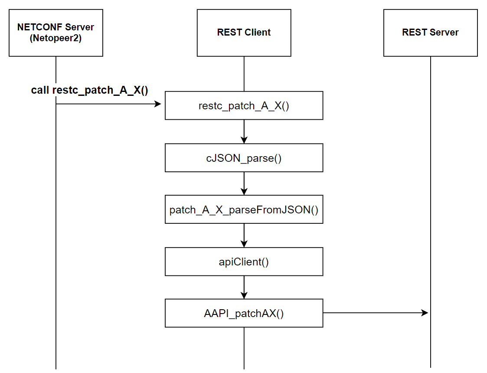

# NETCONF Server

<!-- omit in toc -->
## High Level Design Document

<!-- omit in toc -->
#### Rev 0.1

<!-- omit in toc -->
## Table of Content
- [Revision](#revision)
- [Scope](#scope)
- [Definitions/Abbreviations](#definitionsabbreviations)
- [Overview](#overview)
- [Requirements](#requirements)
  - [Supported transport protocols](#supported-transport-protocols)
  - [Supported standards](#supported-standards)
  - [Supported capabilities](#supported-capabilities)
  - [Supported operations](#supported-operations)
  - [Supported XPATH](#supported-xpath)
    - [XPath related to `openconfig-interfaces.yang`, `openconfig-if-ip.yang`](#xpath-related-to-openconfig-interfacesyang-openconfig-if-ipyang)
    - [XPath related to `openconfig-network-instance.yang`](#xpath-related-to-openconfig-network-instanceyang)
    - [XPath related to `openconfig-ospfv2.yang`](#xpath-related-to-openconfig-ospfv2yang)
    - [XPath related to `openconfig-bgp.yang`](#xpath-related-to-openconfig-bgpyang)
- [Architecture Design](#architecture-design)
- [High-Level Design](#high-level-design)
  - [Build time and Run time components](#build-time-and-run-time-components)
  - [Build time workflow](#build-time-workflow)
  - [Run time workflow](#run-time-workflow)
    - [NETCONF edit-config flow](#netconf-edit-config-flow)
    - [NETCONF create connection (capability modification)](#netconf-create-connection-capability-modification)
- [Building and Configuration](#building-and-configuration)
  - [Repository and directory structure](#repository-and-directory-structure)
  - [Patches](#patches)
  - [Build dependency](#build-dependency)
  - [New user addition](#new-user-addition)
  - [Scalability and performance requirements/impact](#scalability-and-performance-requirementsimpact)
- [SAI API (no change required)](#sai-api-no-change-required)
- [DB and Schema changes](#db-and-schema-changes)
- [Configuration and management](#configuration-and-management)
  - [Boot sequence and Config file](#boot-sequence-and-config-file)
  - [Config DB Enhancements](#config-db-enhancements)
- [Warmboot and Fastboot Design Impact](#warmboot-and-fastboot-design-impact)
  - [CLI/YANG model Enhancements](#cliyang-model-enhancements)
- [Serviceability and Debug (logging, counters, trace etc) related design](#serviceability-and-debug-logging-counters-trace-etc-related-design)
  - [Error Handling on NETCONF server (Netopeer2)](#error-handling-on-netconf-server-netopeer2)
  - [debug options on Netopeer2](#debug-options-on-netopeer2)
- [Testing Requirements/Design](#testing-requirementsdesign)
  - [Unit Test cases](#unit-test-cases)
  - [System Test cases](#system-test-cases)
    - [Test Plan (overview)](#test-plan-overview)
    - [Config Items](#config-items)
- [Open/Action items - if any](#openaction-items---if-any)
  - [Third Party software Open Issues](#third-party-software-open-issues)
- [Appendix](#appendix)
  - [Netopeer2 initialization and callback registration](#netopeer2-initialization-and-callback-registration)
  - [Netopeer2 Config change notification generation flow](#netopeer2-config-change-notification-generation-flow)
  - [Netopeer2 Config change notification processing flow](#netopeer2-config-change-notification-processing-flow)
  - [Netopeer2 Config change notification callback processing flow](#netopeer2-config-change-notification-callback-processing-flow)
  - [Netopeer2, REST Client and Server interaction flow](#netopeer2-rest-client-and-server-interaction-flow)


## Revision

|  Rev  |     Date     |                       Author                       | Change Description |
| :---: | :----------: | :------------------------------------------------: | ------------------ |
|  0.1  | May 24, 2023 | Kentaro Ebisawa, Kanji Nakano, Hitoshi Irino (NTT) | Initial version    |

## Scope

This document describes NETCONF server feature implementation in SONiC, utilizing the [SONiC Management Framework](https://github.com/sonic-net/SONiC/blob/master/doc/mgmt/Management%20Framework.md).

## Definitions/Abbreviations

| Definitions/Abbreviation | Description                              |
| ------------------------ | ---------------------------------------- |
| CLI                      | Command Line Interface                   |
| gNMI                     | gRPC Network Management Interface        |
| REST                     | Representational State Transfer          |
| NETCONF                  | Network Configuration Protocol           |
| NBI                      | North Bound Interface                    |
| YANG                     | Yet Another Next Generation              |
| JSON                     | Java Script Object Notation              |
| XML                      | eXtensible Markup Language               |
| CVL                      | Config Validation Library (SONiC module) |

## Overview

> The purpose of this section is to give an overview of high-level design document and its architecture implementation in SONiC.

This HLD will add NETCONF as an additional North Bound Interface (NBI) to [SONiC Management Framework](https://github.com/sonic-net/SONiC/blob/master/doc/mgmt/Management%20Framework.md) which currently provides various common NBIs such as REST, CLI via REST, and gNMI.

Adding NETCONF feature in the SONiC Management framework will allow user (including controller) to install, manipulate, and delete configuration of SONiC using NETCONF, an IETF standard protocol.

- As similar to CLI in the Management Framework, the new NETCONF server will use REST API to communicate with the existing framework and interact with SONiC Redis DB (namely, CONFIG_DB).
- TransLib will be used to translate schema and update Redis DB.

NETCONF server consists of below components

- [`Netopeer2`](https://github.com/CESNET/netopeer2): an Open Source NETCONF Server, will be used to provide NETCONF NBI.
  - Custom Handler will register custom callbacks for supported xpaths.
- [`sysrepo`](https://www.sysrepo.org/): an YANG-based datastore, will be used to store data within NETCONF server.
- `C based REST client SDK`: generated and integrated in NETCONF server to communicate with REST server.

<!-- omit in toc -->
##### Figure: high level architecture diagram
<p align=center>

</p>

As further mentioned in the "Requirements", Redis will be updated using CAS (Check-and-Set) transaction and will be no locking nor rollback supported.

## Requirements

> This section list out all the requirements for the HLD coverage and exemptions (not supported) if any for this design.

- NETCONF server must support below transport protocols and standards.
- NETCONF server must support below capabilities, operations and XPath marked "Supported == YES".
- NETCONF server would not support items marked "Supported == NO".
  - Most of the limitation comes from capability of the current SONiC Management Framework and Redis DB.
  - For example, Locking nor Rollback feature will be provied since current SONiC does not support it with CONFIG_DB.

### Supported transport protocols

NETCONF server must support below transport protocols.

- Secure Shell (SSH)
- Transport Layer Security (TLS)

### Supported standards

NETCONF server must comply to below standards.

<!-- omit in toc -->
##### Table: Supported standards
| Feature      | Compliant Standard                      |
| ------------ | --------------------------------------- |
| NETCONF      | RFC6241 (base:1.1), RFC4741 (base:1.0)  |
| YANG         | RFC7950 (YANG 1.1), RFC 6020 (YANG 1.0) |
| OpenApi Spec | 3.0                                     |

### Supported capabilities

NETCONF server must support capability marked "Supported == NO".

<!-- omit in toc -->
##### Table: Supported capabilities
| Capability Name                    | Supported           | Remark                                     |
| ---------------------------------- | ------------------- | ------------------------------------------ |
| Writable-Running Capability        | Yes                 | RFC6241 8.2                                |
| Candidate Configuration Capability | No                  | RFC6241 8.3 [*1]                           |
| Confirmed Commit Capability        | No                  | RFC6241 8.4 [*1]                           |
| Rollback-on-Error Capability       | Yes                 | RFC6241 8.5                                |
| Validate Capability                | Yes                 | RFC6241 8.6 [*2]                           |
| Distinct Startup Capability        | No                  | RFC6241 8.7 [*3]                           |
| URL Capability                     | Partially Supported | RFC6241 8.8 only for edit-config operation |
| XPath Capability                   | Yes                 | RFC6241 8.9                                |

- [*1] As SONiC management framework doesn’t support transaction for configuration update, this capability is not supported
- [*2] Syntactic and semantic validation for payload will be supported, but explicit "validation" operation will not be supported in this release
- [*3] As SONiC infrastructure doesn’t have separate startup and Running Redis DB, this capability is not supported

### Supported operations

NETCONF server must support operations marked "Supported == NO".

<!-- omit in toc -->
##### Table: Supported operations
| RFC Operation Name | Supported | Remark |
| ------------------ | --------- | ------ |
| edit-config        | Partially | [*1]   |
| get-config         | No        |        |
| get                | No        |        |
| copy-config        | No        | [*2]   |
| delete-config      | No        | [*2]   |
| lock               | No        | [*3]   |
| unlock             | No        | [*3]   |
| close-session      | Yes       |        |
| kill-session       | Yes       |        |

- [*1] only below options are supported:
  - operation : merge,delete
  - target : running (as commit feature is not supported only Running config is applicable)
  - test-option : test-and-set
  - error-option : rollback-on-error
- [*2] As SONiC infrastructure doesn’t have separate startup and Running Redis DB and also it doesn’t support transaction for config updates
- [*3] As SONiC management framework doesn’t support transaction for configuration update, this operation is not supported

Below table shows mapping between supported edit-config operation and HTTP method.

<!-- omit in toc -->
##### Table: edit-config operation and HTTP Method
| YANG node type     | edit-config operation | HTTP Method |
| ------------------ | --------------------- | ----------- |
| Configuration data | merge                 | PATCH       |
| Configuration data | delete                | DELETE      |

### Supported XPATH

NETCONF server must support XPath listed below.

#### XPath related to `openconfig-interfaces.yang`, `openconfig-if-ip.yang`

```
/interfaces
/interfaces/interface
/interfaces/interface/name
/interfaces/interface/config
/interfaces/interface/config/name
/interfaces/interface/subinterfaces
/interfaces/interface/subinterfaces/subinterface
/interfaces/interface/subinterfaces/subinterface/index
/interfaces/interface/subinterfaces/subinterface/config
/interfaces/interface/subinterfaces/subinterface/config/index
/interfaces/interface/subinterfaces/subinterface/ipv4
/interfaces/interface/subinterfaces/subinterface/ipv4/addresses
/interfaces/interface/subinterfaces/subinterface/ipv4/addresses/address
/interfaces/interface/subinterfaces/subinterface/ipv4/addresses/address/ip
/interfaces/interface/subinterfaces/subinterface/ipv4/addresses/address/config
/interfaces/interface/subinterfaces/subinterface/ipv4/addresses/address/config/ip
/interfaces/interface/subinterfaces/subinterface/ipv4/addresses/address/config/prefix-length
```

#### XPath related to `openconfig-network-instance.yang`

```
/network-instances
/network-instances/network-instance
/network-instances/network-instance/name
/network-instances/network-instance/protocols
/network-instances/network-instance/protocols/protocol
/network-instances/network-instance/protocols/protocol/identifier
/network-instances/network-instance/protocols/protocol/name
/network-instances/network-instance/protocols/protocol/config
/network-instances/network-instance/protocols/protocol/config/identifier
/network-instances/network-instance/protocols/protocol/config/name
/network-instances/network-instance/protocols/protocol/config/enabled
```

#### XPath related to `openconfig-ospfv2.yang`

```
/network-instances/network-instance/protocols/protocol/ospfv2
/network-instances/network-instance/protocols/protocol/ospfv2/global
/network-instances/network-instance/protocols/protocol/ospfv2/global/config
/network-instances/networkinstance/protocols/protocol/ospfv2/global/config/router-id
/network-instances/network-instance/protocols/protocol/ospfv2/areas
/network-instances/network-instance/protocols/protocol/ospfv2/areas/area
/network-instances/networkinstance/protocols/protocol/ospfv2/areas/area/identifier
/network-instances/networkinstance/protocols/protocol/ospfv2/areas/area/config
/network-instances/networkinstance/protocols/protocol/ospfv2/areas/area/config/identifier
/network-instances/networkinstance/protocols/protocol/ospfv2/areas/area/interfaces
/network-instances/networkinstance/protocols/protocol/ospfv2/areas/area/interfaces/interface
/network-instances/networkinstance/protocols/protocol/ospfv2/areas/area/interfaces/interface/id
/network-instances/networkinstance/protocols/protocol/ospfv2/areas/area/interfaces/interface/config
/network-instances/networkinstance/protocols/protocol/ospfv2/areas/area/interfaces/interface/config/id
/network-instances/networkinstance/protocols/protocol/ospfv2/areas/area/interfaces/interface/interface-ref
/network-instances/networkinstance/protocols/protocol/ospfv2/areas/area/interfaces/interface/interface-ref/config
/network-instances/networkinstance/protocols/protocol/ospfv2/areas/area/interfaces/interface/interface-ref/config/interface
```

#### XPath related to `openconfig-bgp.yang`

```
/network-instances/network-instance/protocols/protocol/bgp
/network-instances/network-instance/protocols/protocol/bgp/global
/network-instances/network-instance/protocols/protocol/bgp/global/config
/network-instances/network-instance/protocols/protocol/bgp/global/config/as
/network-instances/network-instance/protocols/protocol/bgp/neighbors
/network-instances/network-instance/protocols/protocol/bgp/neighbors/neighbor
/network-instances/networkinstance/protocols/protocol/bgp/neighbors/neighbor/neighbor-address
/network-instances/networkinstance/protocols/protocol/bgp/neighbors/neighbor/config
/network-instances/networkinstance/protocols/protocol/bgp/neighbors/neighbor/config/neighbor-address
/network-instances/networkinstance/protocols/protocol/bgp/neighbors/neighbor/config/peer-as
/network-instances/networkinstance/protocols/protocol/bgp/neighbors/neighbor/afi-safis
/network-instances/networkinstance/protocols/protocol/bgp/neighbors/neighbor/afi-safis/afi-safi
/network-instances/networkinstance/protocols/protocol/bgp/neighbors/neighbor/afi-safis/afi-safi/afi-safi-name
/network-instances/networkinstance/protocols/protocol/bgp/neighbors/neighbor/afi-safis/afi-safi/config
/network-instances/networkinstance/protocols/protocol/bgp/neighbors/neighbor/afi-safis/afi-safi/config/afi-safi-name
/network-instances/networkinstance/protocols/protocol/bgp/neighbors/neighbor/afi-safis/afi-safi/config/enabled
```

## Architecture Design

> This section covers the changes that are required in the SONiC architecture. In general, it is expected that the current architecture is not changed. This section should explain how the new feature/enhancement (module/sub-module) fits in the existing architecture.
>
> If this feature is a SONiC Application Extension mention which changes (if any) needed in the Application Extension infrastructure to support new feature.

Below diagram describes how NETCONF server fits in the existing architecture of the SONiC Management Framework.
Since it will be an extension to the SONiC Management Framework leveraging its REST API, it would not require any modification to other SONiC modules.

Netopeer2 will be used as NETCONF server. It is fully open source and standards compliant implementation of a NETCONF server and YANG configuration data stores (sysrepo) with a active community support.
It has most of the recent NETCONF features/RFCs supported.
See [README.md on Netopeer2 GitHub repo](https://github.com/CESNET/netopeer2/blob/master/README.md) for list of RFC Compliance.

The role of Netopeer2 are:
- Parsing and loading Standard based YANG models
- Configuration Validation based on YANG models loaded
- NETCONF RFCs capabilities and operations support.

Below diagram shows how NETCONF server fits into the current SONiC Management Framework.
Note that TransLib, including Transformer and Config Validation (CVL), will be leveraged to translate data from YANG (e.g. Openconfig) to ABNF/Redis schema and vice versa when set/get-ing data to/from REDIS database.

<!-- omit in toc -->
##### Figure: NETCONF architecture diagram
<p align=center>

</p>


## High-Level Design

> This section covers the high level design of the feature/enhancement. This section covers the following points in detail.

This NETCONF server feature is an extension to the SONiC Management Framework.
Thus, there is no platform dependency nor impact to other (sub-)modules.

### Build time and Run time components

Below diagram describes components related to the NETCONF server feature.

Details of Build time and Run time data flow will be explained in the following sub-sections.

<!-- omit in toc -->
##### Figure: NETCONF Modules and Data Flow
<p align=center>

</p>

### Build time workflow

The NETCONF server leverages below components during build time to create REST client and for schema translation.

- Pyang Compiler (included in `sonic-mgmt-framework`)
- Swagger Tools (OpenAPI codegen tool)
- YGOT Generator

Refer to [SONiC Management Framework HLD > 3.2.1 Build time components](https://github.com/sonic-net/SONiC/blob/master/doc/mgmt/Management%20Framework.md#321-build-time-components) for details about generating REST Server code and Translib required code and files namely Go-bind objects, YIN Schema.

Workflow to generate REST Client components required to integrate with Netopeer2 are as below.
(Assumption is YANG are based on Openconfig model)

1. Get the Openconfig Yang file. Currently using Openconfig Yang files from `git clone https://github.com/openconfig/public.git`
2. Generate OpenAPI spec (YAML) file from YANG file using Pyang.

```
> Execute below command in sonic-netconf/models folder:

pyang -f swaggerapi --outdir ../build/yaml --supported-xpath-list \
yangs/oc_omw_xpath_list.txt --plugindir ../tools/pyang/pyang_plugins -p \
yangs/common:yangs yangs/openconfig-acl.yang
```
> TODO: update this to a model used in test (e.g. BGP/OSPF)

3. Use OpenApi codegen tool to generate REST Client C code, `open_api_client_c`

```
java -jar openapi-generator-cli.jar generate -i openconfig-acl.yaml -g c -o openapi_client_c
```
> TODO: update this to a model used in test (e.g. BGP/OSPF)

4. Compile and generate shared object library (.so)

```
xxx
```
> TODO: update this after actually generating the .so

5. Setting up REST Client

> TODO: Explain what is required to integrate REST Client to Netopeer2 for an example YANG model used in test. (e.g. BGP)

### Run time workflow

Below components are involed during the run time.

1. NETCONF Sever (Netopeer2)
2. REST Client SDK
3. REST server
4. Translib
5. Transformer
6. Config Validation Library (CVL)
7. Redis DB
8. Non DB data provider

Only component 1 ~ 2 are newly added by the NETCONF server feature.
Component 3 ~ 8 are part of the existing SONiC Management Framework.

On build time, one may need to generate and update files related to 4 ~ 8 when adding new YANG model support.
For details, following procedure covered in the original SONiC Management Framework document.

#### NETCONF edit-config flow

<!-- omit in toc -->
##### Figure: Netopeer2 edit-config flow
<p align=center>

</p>

1. During initialization, Netopeer2 will `Register Custom Callbacks` for supported xpaths of supported modules.
2. NETCONF Client will `Establish NETCONF Session` with NETCONF Server (Netopeer2).
3. NETCONF Client sends `edit-config` RPC request to Netopeer2.
4. Netopeer2 parse and validate configuration based on YANG models loaded, and updates datastore (sysrepo).
6. `Invoke Custom Callback`. Respective callback gets invoked after config updates.
7. `Custom Handler` receives config updates, create and send `REST request` to REST server.
8. REST server handles all the REST requests and invokes a common handler for all the create, update, replace, delete and get operations along with path and payload. This common handler converts all the requests into Translib arguments and invokes the corresponding Translib provided APIs.
9. Translib API then calls the corresponding handler defined in Common App module, subsequently invokes Transformer functions with YGOT structured request to perform model to model transformation, i.e. Openconfig Model to SONiC model, to generate the request DB map.
10. Translib update configuration in Redis DB.

Step 8 to 10 are similar to the one described in `3.1.2 Run time flow` > `3.1.2.1 CLI` on the [Management Framework HLD](https://github.com/sonic-net/SONiC/blob/master/doc/mgmt/Management%20Framework.md#3121-cli).
Refer the document for more details.

#### NETCONF create connection (capability modification)

Netopeer2 server supports all standard NETCONF capabilities.
But as mentioned in Requirements section, the NETCONF server feature has limited support for capabilities.
This must be reported to NETCONF client in hello message sent during connection creation.

> Note: As a build time change, `nc_server_get_cpblts_version()` must be updated to be inline with the supported capability.
> (changes are stored under the `patches` directory in `sonic-netconf` repository)

Below diagram shows Netopeer2 create connection flow.

<!-- omit in toc -->
##### Figure: Netopeer2 create connection flow
<p align=center>

</p>

1. NETCONF Client sends `connect request` to Netopeer2 (NETCONF Server).
2. Netopeer2 calls `server_accept_session()` to accept and process connection request.
3. Netopeer2 calls `nc_handshake_io()`, `nc_send_hello_io()` for hello handshake.
4. Netopeer2 calls `nc_server_get_cpblts_version()` to construct server hello message.
5. Netopeer2 calls `nc_write_msg_io()` to send `Hello message`.
6. NETCONF Client sends client `Hello message` to Netopeer2.
7. NETCONF session got created with handshake capabilities.

## Building and Configuration

### Repository and directory structure

>	- What are the repositories that would be changed?

- NETCONF server will be part of existing SONiC management container.
- It will use `sonic-mgmt-common` and `sonic-mgmtframework` components.
- Files and folders required for NETCONF server will be stored in a new repository called `sonic-netconf` for ease of maintenance.

`sonic-netconf` repository structure and contents:

> TODO: confirm with source code  

- Directory `debian`
  - used to build debian package
- Directory `models`
  - This includes YANG data model files and Makefiles to generate and compile C based REST client.
- Directory `netconf-server`
  - libnetconf2
  - libyang
  - netopeer2
  - sysrepo
- Directory `patches`
  - This includes patches to apply to `libnetconf2`, `libyang`, `netopeer2`,  `OpenApiTool` and `sysrepo`
- Directory `scripts`
  - This includes scripts which needed to build and run netopeer2 server.
- Directory `startup_config`
  - This includes startup configuration which needed to be load in netopeer2 server during startup time.
- Directory `tools`
  - `pyang`
  - `openapi.py` ... OpenApiTool
- `Makefile`
- `README.md`
  - describes Prerequisites, Build Instruction and Referencesd

### Patches

> TODO: explain what each patch will change. e.g. limit supported operation Netopeer2 will report.

Changes to Netopeer2
- nc_server_get_cpblts_version()
  - This is used to construct server hello message.
  - This is modified to only add supported capabilities in hello message and send to NETCONF Client.
  - refer to [NETCONF create connection (capability modification)](#netconf-create-connection-capability-modification) for detailed flow
- x

### Build dependency

>	- Docker dependency
>	- Build dependency if any

TODO: list which Linux modules etc. requried.
TODO: Dependency when building Netopeer2 (including sysrepo, libyang, libnetconf2, libssh, OpenSSL,  etc.)
TODO: Dependency of other SONiC repo. e.g. sonic-mgmt-framework, sonic-mgmt-common, etc.
TODO: Dependency of non-SONiC code, files, etc. e.g. Openconfig YANG files

### New user addition

When a new user is created in SONiC host, below steps needs to be done in mgmt-framework container to be able to connect with netopeer2 server using this new user:

- Add this new user and group in mgmt-framework container.

Example:
```
groupadd -g 1000 admin
useradd -u 1000 -g 1000 -p YourPaSsWoRd admin
```

- Need to add NACM Rules for access control in `sonic-netconf/startup_config/ietf-netconfacm.xml`

Example:
```
<nacm xmlns="urn:ietf:params:xml:ns:yang:ietf-netconf-acm">
<groups>
<group>
<name>admin</name>
<user-name>admin</user-name>
</group>
</groups>
<rule-list>
<name>admin-rule-list</name>
<group>admin</group>
<rule>
<name>admin-rule-list</name>
<module-name></module-name>
<path>/</path>
<access-operations></access-operations>
<action>permit</action>
<comment>admin-user-rule-addition</comment>
</rule>
</rule-list>
</nacm>
```

- Above example NACM rule configuration allowed admin user to perform all operations for all xpaths of all modules.
- Above configuration will be loaded as startup config during netopeer2 server startup time.

### Scalability and performance requirements/impact
>	- Scalability and performance requirements/impact
>	- Memory requirements

TODO: study and document if there are any.

## SAI API (no change required)

There is no change in SAI API for this feature.

## DB and Schema changes

> DB and Schema changes (APP_DB, ASIC_DB, COUNTERS_DB, LOGLEVEL_DB, CONFIG_DB, STATE_DB)

## Configuration and management

> This section should have sub-sections for all types of configuration and management related design. Example sub-sections for "CLI" and "Config DB" are given below. Sub-sections related to data models (YANG, REST, gNMI, etc.,) should be added as required.

### Boot sequence and Config file

TODO:
1. desribe boot sequence
   - Which startup script will be used and parameter in the script
2. describe NETCONF server specific config file, if exists
3. Paste a preliminary manifest in a JSON format, if required.
4. describe if Non-DB data provider is related to boot or config.

### Config DB Enhancements

> TODO: This sub-section covers the addition/deletion/modification of config DB changes needed for the feature. If there is no change in configuration for HLD feature, it should be explicitly mentioned in this section. This section should also ensure the downward compatibility for the change.

TODO: Mention here if we need to expain CONFIG_DB schema extention when adding more YANG model which NETCONF server supports (e.g. OSPF). If it was fully covered in the previous sections, i.e. `## DB and Schema changes`, remove this section.

## Warmboot and Fastboot Design Impact

> Mention whether this feature/enhancement has got any requirements/dependencies/impact w.r.t. warmboot and fastboot. Ensure that existing warmboot/fastboot feature is not affected due to this design and explain the same.
>
>	- Warm reboot requirements/dependencies
>	- Fastboot requirements/dependencies

TODO: describe boot sequence for Warmboot and Fastboot. Clearly mention if there is any difference from Cold Boot (clean boot) or consideration required.

### CLI/YANG model Enhancements

>This sub-section covers the addition/deletion/modification of CLI changes and YANG model changes needed for the feature in detail. If there is no change in CLI for HLD feature, it should be explicitly mentioned in this section. Note that the CLI changes should ensure downward compatibility with the previous/existing CLI. i.e. Users should be able to save and restore the CLI from previous release even after the new CLI is implemented.
>This should also explain the CLICK and/or KLISH related configuration/show in detail.
>https://github.com/sonic-net/sonic-utilities/blob/master/doc/Command-Reference.md needs be updated with the corresponding CLI change.

TODO: describe any CLI command available.

## Serviceability and Debug (logging, counters, trace etc) related design

### Error Handling on NETCONF server (Netopeer2)

The complete validation of config payload is performed by Netopeer2 against YANG models loaded, so it is not expected for SONiC framework to return validation errors.
However, such errors are logged into syslog for debugging purposes.

> TODO: Add syslog example?

### debug options on Netopeer2

Netopeer2 have it’s own debug and logging mechanism.While starting netopeer2 server, desired logging level can be given as mentioned in below help output.
netopeer2 server can be run in debug mode using -d option.

> TODO: copy and paste output during test.

```
~# netopeer2-server --help
netopeer2-server: invalid option -- '-'
Usage: netopeer2-server [-dhV] [-p PATH] [-U[PATH]] [-m MODE] [-u UID] [-g GID] [-t TIMEOUT] [-x PATH] [-v LEVEL] [-c CATEGORY]
-d Debug mode (do not daemonize and print verbose messages to stderr instead of syslog).
-h Display help.
-V Show program version.
-p PATH Path to pidfile (default path is "/var/run/netopeer2-server.pid").
-f PATH Path to netopeer2 server files directory (default path is "/root/.netopeer2-server")
-U[PATH] Listen on a local UNIX socket (default path is "/var/run/netopeer2-server.sock").
-m MODE Set mode for the listening UNIX socket.
-u UID Set UID/user for the listening UNIX socket.
-g GID Set GID/group for the listening UNIX socket.
-t TIMEOUT Timeout in seconds of all sysrepo functions (applying editconfig, reading data, ...), if 0 (default), the default sysrepo timeouts are used.
-x PATH Path to a data file with data for libyang ext data callback. They are required for supporting some extensions such as schema-mount.
-v LEVEL Verbose output level:
    0 - errors
    1 - errors and warnings
    2 - errors, warnings, and verbose messages
-c CATEGORY[,CATEGORY...]
    Verbose debug level, print only these debug message categories.
    Categories: DICT, YANG, YIN, XPATH, DIFF, MSG, LN2DBG, SSH, SYSREPO
```

## Testing Requirements/Design

> Explain what kind of unit testing, system testing, regression testing, warmboot/fastboot testing, etc.
> Ensure that the existing warmboot/fastboot requirements are met. For example, if the current warmboot feature expects maximum of 1 second or zero second data disruption, the same should be met even after the new feature/enhancement is implemented. Explain the same here.
> Example sub-sections for unit test cases and system test cases are given below.

### Unit Test cases

TODO: Unit Test == Test internal to sonic-netconf or sonic-mgmt container ??

### System Test cases

TODO: System Test == Test using sonic-vs ??

#### Test Plan (overview)

- edit-config (merge)
  - Set conifg via NETCONF
  - Set the same config via CLI
  - Compare `CONFIG_DB` entries between NETCONF and CLI
- edit-config (delete)
  - Delete config via NETCONF
  - Confirm `CONFIG_DB` entries are removed

#### Config Items

> TODO:
> - add more specific info like XPATH and parameters to be used
> - Scope
>   - Test CONFIG_DB Update (add/delete)
> - CONFIG_DB schema
>   - BGP ... reuse current schema (double check it's not modified)
>   - OSPF ... not in current sonic. Create new YANG, ABNF Schema Section in CONFIG_DB

- Interfaces
  - CLI
  - CONFIG_DB Schema
- BGP
  - CLI
    - https://github.com/sonic-net/sonic-utilities/blob/master/doc/Command-Reference.md#bgp-config-commands
  - CONFIG_DB Schema
    - https://github.com/sonic-net/SONiC/wiki/Configuration#bgp-sessions
    - https://github.com/sonic-net/sonic-buildimage/blob/master/src/sonic-yang-models/doc/Configuration.md#bgp-sessions
- OSPF
  - TODO: There is no support for OSPF in current SONiC (202305). CONFIG_DB schema was created for this feature.


## Open/Action items - if any
	
> NOTE: All the sections and sub-sections given above are mandatory in the design document. Users can add additional sections/sub-sections if required.

### Third Party software Open Issues

TODO: review below issues and remove if not related to SONiC

OpenConfig
- https://github.com/openconfig/public/issues/642

OpenAPITools
- https://github.com/OpenAPITools/openapi-generator/issues/14219
- https://github.com/OpenAPITools/openapi-generator/issues/14224

## Appendix

Useful information to understand the design and implementation are noted here.

### Netopeer2 initialization and callback registration

- Netopeer2 initialization, including callback registration to `Sysrepo`, is done in the `main()` function.
- Refer to the [netopeer2/src/main.c](https://github.com/CESNET/netopeer2/blob/master/src/main.c) for details.

To newly add support for OpenConfig, we have added `np2srv_A_config_subscription ()` for each YANG module `module A` and call from the `main()` function during the initialization. Note that `-` (hyphen) will be replaced to `_` (underscore) if it exists in module name.

For example, we have added `np2srv_openconfig_interfaces_config_subscription ()` for the config module `openconfig-interface`.

Another example is all routing protocols (BGP, OSPFv2, etc.) exists under `openconfig-network-instance.yang` module `openconfig-network-instance` included to YANG tree structure using `uses` keyword.
For this case, function name will be `np2srv_openconfig_network_instance_config_subscription ()`.

<!-- omit in toc -->
##### Table: relationship between YANG module name and function name
|           | YANG module name            | function name                                          |
| --------- | --------------------------- | ------------------------------------------------------ |
|           | A                           | np2srv_A_config_subscription                           |
| example 1 | openconfig-interfaces       | np2srv_openconfig_interfaces_config_subscription       |
| example 2 | openconfig-network-instance | np2srv_openconfig_network_instance_config_subscription |

Inside these functions, `sr_module_change_subscribe()` would be called per required XPath.
Callback function name will follow naming rule below.

- replace `:` (colon) to `_` (underscore) connecting module name and XPath
- replace `/` and `-` to `_`
- start from `np2srv_` and end with `_cb`

<!-- omit in toc -->
##### Table: relationship between module name and callback function name
| module name | XPath | combined XPath | call back function |
| ----------- | ----- | -------------- | ------------------ |
| A           | X     | /A:X           | np2srv_A_X_cb      |

### Netopeer2 Config change notification generation flow

When Netopeer2 (NETCONF Server) receive edit-config request, change notification will be genereated as below.

<!-- omit in toc -->
##### Figure: Netopeer2 Config change notification generation flow
<p align=center>

</p>

1. NETCONF client sends `edit-config request` to Netopeer2 (NETCONF Server).
2. Netopeer2 calls `np2srv_rpc_editconfig_cb ()` to process edit-config request.
3. It uses sysrepo API `sr_edit_batch ()` to process and prepare changes.
4. It calls sysrepo API `sr_apply_changes ()` followed by `sr_modinfo_edit_apply ()` to update config in sysrepo data store.
5. It calls `sr_changes_notify_store ()` to get config changes
6. and sends config change notification to all subscribers.
7. Netopeer2 (NETCONF Server) respond `OK` to NETCONF Client

### Netopeer2 Config change notification processing flow

<!-- omit in toc -->
##### Figure: Netopeer2 Config change notification processing flow
<p align=center>

</p>

### Netopeer2 Config change notification callback processing flow

<!-- omit in toc -->
##### Figure: Netopeer2 Config change notification callback processing flow
<p align=center>

</p>

### Netopeer2, REST Client and Server interaction flow

<!-- omit in toc -->
##### Figure: Netopeer2, REST Client and Server interaction flow
<p align=center>

</p>