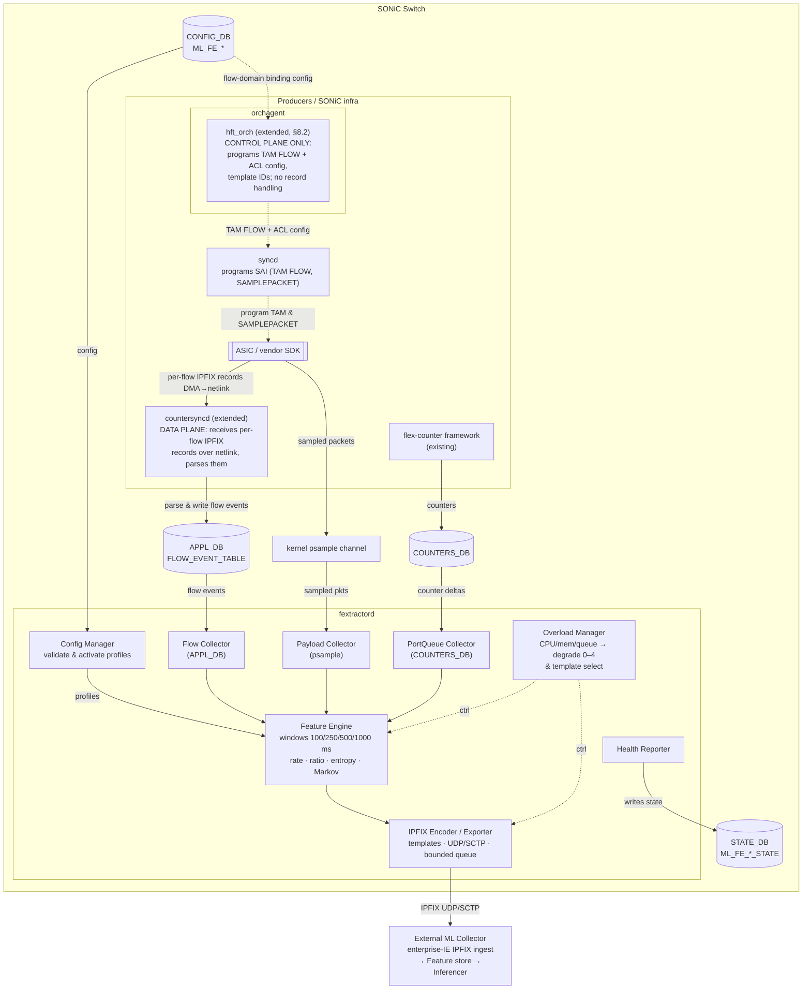

# HLD: ML Feature Extraction Daemon (fextractord) for SONiC

## Table of Contents

- [1. Revision](#1-revision)
- [2. Scope](#2-scope)
- [3. Definitions/Abbreviations](#3-definitionsabbreviations)
- [4. Overview](#4-overview)
- [5. Requirements](#5-requirements)
- [6. Architecture Design](#6-architecture-design)
- [7. High-Level Design](#7-high-level-design)
- [8. SAI API](#8-sai-api)
- [9. Configuration and management](#9-configuration-and-management)
- [10. Warmboot and Fastboot Design Impact](#10-warmboot-and-fastboot-design-impact)
- [11. Memory Consumption](#11-memory-consumption)
- [12. Security Constraints](#12-security-constraints)
- [13. Restrictions/Limitations](#13-restrictionslimitations)
- [14. Testing Requirements/Design](#14-testing-requirementsdesign)
- [15. Phased Implementation Plan](#15-phased-implementation-plan)
- [16. Risks and Mitigations](#16-risks-and-mitigations)
- [Appendix A. Enterprise Information Element Catalog](#appendix-a-enterprise-information-element-catalog)

---

## 1. Revision

| Rev | Date | Author(s) | Description |
|-----|------|-----------|-------------|
| 0.1 | (initial draft date) | (original author) | Initial draft: architecture, DB schema, feature groups, IPFIX export, overload management |
| 0.2 | 2026-07-07 | (original author) | Restructured to match `hld_template.md` section order; added Revision, Scope, Definitions, Requirements, SAI API, Configuration and management (Manifest/CLI/YANG), Warmboot and Fastboot Design Impact, Memory Consumption, Restrictions/Limitations, and Testing Requirements/Design sections; incorporated SAI TAM per-flow telemetry (`TELEMETRY_TYPE_FLOW`) as the target mechanism for hardware flow ingestion |

---

## 2. Scope

This document is the High-Level Design for **`fextractord`**, a new SONiC daemon (packaged as a SONiC Application Extension — see §6.4) that:

- Observes existing SONiC telemetry sources (`COUNTERS_DB`, `APPL_DB` flow events, sampled packets) — it introduces no new hardware polling mechanism of its own beyond what §7 and §8 describe.
- Computes windowed ML feature vectors per configurable profile.
- Exports those feature vectors as IPFIX with enterprise Information Elements to an external ML collector.

**In scope**: daemon architecture and threading, `CONFIG_DB`/`STATE_DB` schema, feature-group definitions, IPFIX export design, overload/degradation behavior, sampled payload inspection, SAI dependencies, packaging, CLI/YANG, warmboot/fastboot impact, and a phased rollout plan.

**Out of scope** (see §13 for the full list): full-rate deep packet inspection, decryption/payload reassembly, replacing the existing High-Frequency Telemetry (HFT) pipeline (`hft_orch`/`countersyncd`), long-lived feature storage in Redis, and on-switch ML inferencing.

**Design context carried through the rest of this document**: 100 Gbps enterprise switches; sampled payload depth of 32–64 bytes; timing/size metadata only for encrypted traffic; sub-second (300–800 ms) export latency target; progressive overload degradation with a compact emergency template; targeting the latest stable SONiC release.

---

## 3. Definitions/Abbreviations

| Term | Definition |
|------|------------|
| IPFIX | IP Flow Information Export (RFC 7011) — used as the on-box record format the HFT pipeline delivers to `countersyncd` over netlink (which `countersyncd` then re-emits as OTLP), and as `fextractord`'s external export protocol. |
| IE | Information Element — a single typed field in an IPFIX template/record. |
| PEN | Private Enterprise Number (IANA) — used to namespace enterprise-specific IPFIX IEs. |
| SPLT | Sequence of Packet Lengths and Times — a per-flow Markov transition feature. |
| DPI | Deep Packet Inspection. |
| SAI | Switch Abstraction Interface. |
| TAM | Telemetry And Monitoring — the SAI object family (`SAI_OBJECT_TYPE_TAM`, tel_types, reports, collectors) used for hardware-driven telemetry export. |
| ECN / WRED | Explicit Congestion Notification / Weighted Random Early Detection. |
| PFC | Priority Flow Control. |
| SNI | Server Name Indication — a TLS Client Hello extension carrying the requested hostname in cleartext. |
| ACL | Access Control List (SAI `SAI_OBJECT_TYPE_ACL_ENTRY`/`ACL_TABLE`). |
| HFT | High-Frequency Telemetry — SONiC's existing hardware counter/flow telemetry feature. Two components implement it: `hft_orch` (a new object inside `orchagent` that owns the SAI TAM object lifecycle — `tam_counter_subscription`, transport/collector objects — driven by `CONFIG_DB`) and `countersyncd` (a separate process that receives counter/IPFIX data pushed by the vendor driver over netlink and forwards it to `COUNTER_DB` and an OpenTelemetry collector). See [`high-frequency-telemetry-hld.md`](https://github.com/sonic-net/SONiC/blob/master/doc/high-frequency-telemetry/high-frequency-telemetry-hld.md). |
| Degrade level | The `fextractord` overload state (0–4) selecting which template tier and feature groups are active (see §7.7). |

---

## 4. Overview

This document describes the High-Level Design for a generic, multi-use-case **Feature Extraction daemon (`fextractord`)** integrated into SONiC. The daemon consumes several standard SONiC telemetry sources, computes windowed ML features, and exports the resulting feature vectors in **IPFIX format with enterprise Information Elements (IEs)** to an external collector for ML inferencing.

### Input sources: what fextractord consumes

`fextractord` is a feature *computation* engine, not a single-protocol collector. It draws raw signals from **three complementary input sources**, each feeding different feature groups (§7.5):

| Input source | Mechanism | Feeds (examples) | SAI dependency |
|---|---|---|---|
| **Flex counters** | `COUNTERS_DB` deltas already populated by the existing flex-counter framework | `port_queue_stats`, `ecn_stats`, `protocol_id`, `ip_ttl` | None new (§8.1) |
| **Per-flow telemetry** | Per-flow packet/byte/timing counters delivered as `APPL_DB` flow events (§7.14) | `pkt_size_stats`, `ipt_stats`, `flow_behavior`, flow-derived encrypted-traffic signals | `SAI_TAM_TELEMETRY_TYPE_FLOW` (in review, §8.2) |
| **Sampled packets** | Truncated (32–64 byte) sampled packets via `SAI_OBJECT_TYPE_SAMPLEPACKET` / `psample` | `tls_metadata`, `dns_metadata`, `http_metadata`, `byte_dist_entropy`, `splt_markov` | Existing (sFlow mechanism, §8.3) |

IPFIX appears in two distinct roles that should not be conflated: it is the **export encoding** `fextractord` emits (all three sources → feature vectors → IPFIX out), and it is *also* the wire format of exactly **one** of the input sources (hardware per-flow telemetry). Flex counters and sampled packets do not involve IPFIX on the ingest side at all.

### Goals

1. Generic, profile-driven feature extraction reusable across ML use cases.
2. Standard SONiC DB semantics: `CONFIG_DB` for intent, `STATE_DB` for operational status.
3. Consume only existing SONiC DB telemetry sources; no proprietary SDK side-channels.
4. Export feature vectors as standards-compliant IPFIX with enterprise IEs.
5. Bounded, safe operation under 100 Gbps traffic with strict CPU/memory guardrails.
6. Support multiple simultaneous feature profiles (app fingerprinting, experience scoring, encrypted traffic classification, DPI metadata, etc.).

(Full requirements coverage, including exemptions, is in §5.)

---

## 5. Requirements

### 5.1 Functional requirements

| # | Requirement |
|---|-------------|
| R1 | Support multiple, independently configurable feature-extraction profiles, each targeting one or more feature groups (§7.5). |
| R2 | Bind profiles to ports, LAGs, VLANs, queues, **flows**, or the whole device, with optional VRF/DSCP/tenant filters. Flow-scoped extraction is served by the SAI TAM per-flow telemetry proposal (§8.2) in two forms: (a) **operator-defined flow domains** — a class of flows matched by an ACL and bound via `object_type=flow_domain` + `SAI_ACL_ENTRY_ATTR_ACTION_TAM_OBJECT` (§7.3.3); and (b) **individual, ephemeral flows** discovered by HW auto-learn, which ride under a broader `device`/`port`-scoped binding since they cannot be pre-enumerated. |
| R3 | Compute features in configurable windows (100/250/500/1000 ms). |
| R4 | Export computed features as IPFIX with enterprise IEs, at sub-second (300–800 ms) end-to-end latency. |
| R5 | Detect and respond to CPU/memory/queue-depth overload with a defined degradation ladder (§7.7), never exceeding configured guardrails. |
| R6 | Operate correctly across a daemon warm restart with bounded quality-of-data impact (§10.1). |
| R7 | Reject invalid or unsafe configuration at write time and surface the reason in `STATE_DB` (§7.3, §7.4). |

### 5.2 Non-functional requirements

- Guardrails: ≤ 5% CPU (configurable up to 20%), ≤ 512 MB RSS (configurable) per daemon instance by default (§7.2.2).
- Scale: up to 64K active flows, 1024-deep export queue, 10K pps sampled-packet ingest by default (§7.2.2).
- Target SONiC version: latest stable release.

### 5.3 Exemptions / not supported

1. Full-rate deep packet inspection across all flows (unsafe at 100 Gbps on the control plane).
2. Decryption or payload reassembly.
3. Replacing the HFT pipeline (`hft_orch`/`countersyncd`) or any existing SONiC daemon.
4. Long-lived feature vector storage in Redis.
5. ML model hosting or inferencing on-switch.

(See §13 for the full restrictions/limitations discussion, including scale ceilings and platform coverage.)

---

## 6. Architecture Design

### 6.1 Statement of architectural impact

This design **does not modify existing SONiC architecture**. `fextractord` is a new, independent process that:

- Reads `CONFIG_DB`, `STATE_DB`, `COUNTERS_DB`, and `APPL_DB` as a standard Redis client — no changes to `orchagent`, `syncd`, or `swss` are required for Phase 1 or Phase 3.
- For Phase 2 hardware flow ingestion, depends on two additive extensions to the existing HFT pipeline (§4), following its established control/data split: (a) `hft_orch` (in `orchagent`) extended to also program `SAI_TAM_TELEMETRY_TYPE_FLOW` objects and their ACL bindings — a **control-plane** change, additive to its existing TAM-object management; and (b) `countersyncd` extended to parse the resulting per-flow IPFIX records (which arrive over the same vendor netlink channel it already consumes) and populate the `APPL_DB` flow-event contract defined in §7.14 — the **data-plane** producer. Neither modifies unrelated `orchagent`/`syncd` flow logic (see §7.1 and §8).
- Exports independently over UDP/SCTP to an external collector; it does not participate in the data plane.

### 6.2 Deployment model: Application Extension

`fextractord` is proposed as a **SONiC Application Extension** (a distinct SONiC Package per [`sonic-application-extention-hld.md`](https://github.com/sonic-net/SONiC/blob/master/doc/sonic-application-extension/sonic-application-extention-hld.md)), not a built-in container, because:

- It is optional and use-case-specific — unlike `swss`/`syncd`/`database`, most deployments will never enable ML feature export.
- As an independent package it can be installed, upgraded, or removed on its own via `sonic-package-manager`, without rebuilding or reflashing the SONiC image.
- It only needs read access to existing DBs (`CONFIG_DB`, `STATE_DB`, `COUNTERS_DB`, `APPL_DB`) and, once the sampled-payload design in §7.8 adopts `SAI_OBJECT_TYPE_SAMPLEPACKET`, does not need a privileged container or raw socket access — keeping it eligible for the standard (non-privileged) Application Extension security model.
- There is existing precedent for this packaging model (`cpu-report`, `dhcp-relay` in the SONiC docs).

The preliminary manifest is in §9.1.

#### 6.2.1 Packaging and installation model

`fextractord` runs in its **own dedicated Docker container**, distributed and versioned independently of the base SONiC image and managed by `sonic-package-manager` (`spm`). It is *not* code added to `swss`, `syncd`, or any existing container. The Docker image carries its manifest (§9.1) as image labels (the manifest content is embedded under `com.azure.sonic.manifest`), which `spm` reads to auto-generate the host-side systemd unit (from `service.requires`/`after`/`wanted-by`), feature-table/dockerd wiring, and CLI plugins (from the `cli` node) at install time.

**`fextractord` is shipped as an install-later package — installed and removed at runtime via `spm`, not built into the SONiC image.** This is a deliberate design decision, following directly from §6.2: (1) most deployments will never enable ML feature export, so the feature should cost nothing unless an operator explicitly installs it; and (2) shipping it as an `spm`-installed package lets it be **installed, upgraded, or removed independently** of the base image, with no reflash. A built-in package, by contrast, is flagged `built-in` (with `image-id: null`) in `/var/lib/sonic-packages/packages.json` and can be changed only by a full SONiC-to-SONiC image upgrade — which would defeat both goals.

Registration in `sonic-buildimage` publishes the image to a registry and adds a `packages.json` entry (via `packages.json.j2`, or `rules/sonic-packages.mk` with `$(PACKAGE)_INSTALL = n`) that carries its `repository` and `default-reference` while leaving `status: not-installed`; `INCLUDE_FEXTRACTORD` is intentionally not used. The package then appears in `sonic-package-manager list` as *Not installed*, and an operator installs or removes it on a live switch with no image rebuild:

```bash
sudo sonic-package-manager install fextractord                        # uses default-reference
sudo sonic-package-manager uninstall fextractord                      # remove later
```

A deployment that never wants ML feature extraction simply does not publish or register the package — nothing is built, shipped, or run, so there is zero disk, CPU, or memory cost.

> **For reviewers:** this HLD commits to the install-later model rather than building `fextractord` into the image, because runtime install/upgrade/removal flexibility and pay-only-if-used optionality matter more than out-of-the-box availability for a feature most switches will not run. If the community prefers a built-in default (e.g. for specific platforms), that is a self-contained build-system change (`INCLUDE_FEXTRACTORD = y` with `$(PACKAGE)_INSTALL = y`) that does not affect `fextractord`'s design or runtime behavior — we are open to it but do not propose it as the default.

### 6.3 Architecture diagram



---

## 7. High-Level Design

`fextractord` is a **SONiC Application Extension** (§6.2), not a built-in feature. The subsections below cover its modules, DB/schema changes, data flows, and cross-cutting design points required by the template.

### 7.1 SONiC Component Interaction

#### 7.1.1 Configuration Flow

```
Operator / NMS
     │
     │  YANG-validated write
     ▼
 CONFIG_DB
  ML_FE_GLOBAL
  ML_FE_PROFILE|<name>
  ML_FE_BINDING|<id>
  ML_FE_SAMPLING|<name>
  ML_FE_IPFIX_EXPORT|<name>
  ML_FE_OVERLOAD_POLICY|<name>
     │
     │  inotify / SubscriberStateTable
     ▼
 fextractord::ConfigManager
  ├─ validates CPU/mem guardrails
  ├─ rejects invalid config with error in STATE_DB
  ├─ builds active ProfileSet
  └─ programs Collector subscriptions
```

#### 7.1.2 Data Collection Flow

```
ASIC / Hardware
     │
     │
     ▼
 COUNTERS_DB
  COUNTERS:oid:<port>   (if_in_octets, if_out_octets, drops, ECN marks, etc.)
  COUNTERS:oid:<queue>  (SAI_QUEUE_STAT_* fields)
     │
     │  periodic delta reads (100ms)
     ▼
 fextractord::PortQueueCollector
  └─ accumulates per-window deltas in ring buffer

SAI TAM per-flow telemetry (TELEMETRY_TYPE_FLOW, see §8)
   configured by hft_orch (control plane, §4); per-flow IPFIX
   records received & parsed by countersyncd (data plane, extended)
     │
     │  countersyncd writes/updates APPL_DB flow events (§7.14)
     ▼
 fextractord::FlowCollector
  └─ builds per-flow statistics records

SAI_OBJECT_TYPE_SAMPLEPACKET (existing sFlow mechanism, see §8) via psample netlink
     │
     │  sampled truncated packet (first 64 bytes)
     ▼
 fextractord::PayloadCollector
  └─ parses L4 payload header fields, byte distribution, TLS hello
```

#### 7.1.3 Feature Compute and Export Flow

```
fextractord::FeatureEngine (every 250ms window)
  │
  ├─ consumes PortQueueCollector ring buffer
  ├─ consumes FlowCollector flow records
  ├─ consumes PayloadCollector payload records
  │
  ├─ computes configured feature groups (see §7.5)
  ├─ applies profile-specific normalization
  │
  ▼
fextractord::OverloadManager
  ├─ checks cpu_pct, mem_pct, export_queue_depth
  ├─ selects degrade_level (0–4)
  └─ selects template_id (FULL / COMPACT / EMERGENCY)
  │
  ▼
fextractord::IPFIXEncoder
  ├─ serializes feature vector → IPFIX Data Record
  ├─ applies enterprise IE mapping (see §7.6)
  └─ enqueues to send buffer (bounded, drop-oldest)
  │
  ▼
fextractord::IPFIXExporter
  ├─ sends IPFIX Template Records on startup and refresh interval
  ├─ sends IPFIX Data Records in batches
  └─ writes export stats to STATE_DB::ML_FE_RUNTIME_STATS
  │
  ▼ UDP / SCTP
External ML Collector
```

#### 7.1.4 Warm Restart Flow

See §10.1 for the full warmboot/fastboot treatment. Summary:

```
System signals fextractord to restart
     │
     ▼
fextractord::WarmRestartHandler
  ├─ reads ML_FE_PROFILE from CONFIG_DB  (source of truth)
  ├─ reads last sequence numbers from STATE_DB
  ├─ rebuilds ProfileSet and Collector subscriptions
  ├─ marks quality_flag=WARM_RESTART_GAP for first window
  └─ resumes export; STATE_DB oper_status = ACTIVE
```

### 7.2 Daemon Design: fextractord

**Instance model.** `fextractord` is a single **host-scoped** service by default (`host-service: true`, `asic-service: false` in the manifest, §9.1): one daemon process per switch, which reads the per-namespace `COUNTERS_DB`/`APPL_DB` instances it is configured to observe. On multi-ASIC platforms that prefer isolation, the same package MAY instead be deployed as an `asic-service` (one instance per ASIC namespace); to keep the schema identical across both models, `ML_FE_RUNTIME_STATS` is keyed by `<instance_id>` (§7.4.2) — a single well-known key on the default host-scoped deployment, or one key per namespace when run per-ASIC. All guardrails in §7.2.2 are therefore expressed **per `fextractord` instance**, not per profile and not per ASIC.

#### 7.2.1 Thread Model

```
Main Thread
  └─ ConfigManager loop (SubscriberStateTable on CONFIG_DB)

Collector Thread Pool (one per collector type)
  ├─ PortQueueCollectorThread  (100ms tick, COUNTERS_DB reads)
  ├─ FlowCollectorThread       (event-driven + 250ms sweep)
  └─ PayloadCollectorThread    (psample netlink receive loop, rate-gated by SAI_OBJECT_TYPE_SAMPLEPACKET)

FeatureEngine Thread (250ms tick)
  └─ drains collector ring buffers, computes features per profile

ExportThread
  └─ drains IPFIX send queue, sends to collector

HealthReporterThread (1s tick)
  └─ writes STATE_DB health tables

OverloadMonitorThread (100ms tick)
  └─ samples /proc/stat for daemon CPU, self RSS for memory
  └─ updates degrade_level atomically
```

#### 7.2.2 Per-Instance CPU and Memory Guardrails

These ceilings bound the whole `fextractord` instance (all profiles it serves combined), not any single profile — see the instance model above.

| Limit | Default | Config Override |
|-------|---------|-----------------|
| Max CPU per instance | 5% | `ML_FE_GLOBAL:cpu_pct_limit` |
| Max RSS per instance | 512 MB | `ML_FE_GLOBAL:mem_mb_limit` |
| Max active flow cache | 64K entries | `ML_FE_GLOBAL:max_active_flows` |
| Max export queue depth | 1024 records | `ML_FE_GLOBAL:export_queue_depth` |
| Max sampled pkt rate | 10K pps | `ML_FE_SAMPLING:max_pps` |
| Max payload parse rate | 5K pps | `ML_FE_SAMPLING:max_parse_pps` |

Any `CONFIG_DB` write that requests values above hard-coded safety ceilings is rejected, and `ML_FE_PROFILE_STATE:oper_status` is set to `CONFIG_REJECTED` with a reason string.

### 7.3 CONFIG_DB Schema

#### 7.3.1 ML_FE_GLOBAL

```
Key: ML_FE_GLOBAL
Fields:
  admin_status         : "enabled" | "disabled"
  cpu_pct_limit        : uint8, 1–20  (default: 5)
  mem_mb_limit         : uint32       (default: 512)
  max_active_flows     : uint32       (default: 65536)
  export_queue_depth   : uint32       (default: 1024)
  observation_domain_id: uint32       (IPFIX Observation Domain; HFT's own domain ID is vendor-defined and not centrally registered, so this must be picked from fextractord's own reserved range — see §7.6.1)
  log_level            : "debug" | "info" | "warn" | "error"
```

#### 7.3.2 ML_FE_PROFILE

```
Key: ML_FE_PROFILE|<profile_name>
Fields:
  description          : string
  use_case             : "enc_traffic_class" | "app_fingerprint" |
                         "app_exp_score" | "dpi_metadata" | "custom"
  admin_status         : "enabled" | "disabled"
  window_ms            : uint32  (100 | 250 | 500 | 1000, default: 250)
  feature_groups       : comma-separated list from:
                           "pkt_size_stats"
                           "ipt_stats"
                           "splt_markov"
                           "byte_dist_entropy"
                           "tls_metadata"
                           "dns_metadata"
                           "http_metadata"
                           "ip_ttl"
                           "port_queue_stats"
                           "flow_behavior"
                           "queue_occupancy"
                           "ecn_stats"
                           "protocol_id"
  sampling_profile     : references ML_FE_SAMPLING key
  export_profile       : references ML_FE_IPFIX_EXPORT key
  overload_policy      : references ML_FE_OVERLOAD_POLICY key
  normalize            : "none" | "max" | "l2"  (default: none; normalization at collector is preferred)
  schema_version       : uint16 (increment when feature_groups change)
```

#### 7.3.3 ML_FE_BINDING

```
Key: ML_FE_BINDING|<binding_id>
Fields:
  profile_name         : references ML_FE_PROFILE key
  object_type          : "port" | "lag" | "vlan" | "queue" | "flow_domain" | "device"
  object_id_pattern    : SONiC OID string or glob (e.g. "Ethernet*", "Queue:Ethernet4:0")
  direction            : "ingress" | "egress" | "both"
  vrf                  : optional VRF name filter
  dscp_filter          : optional comma-separated DSCP values
  tenant_tag           : optional string for multi-tenant annotation
```

Flow-scoped bindings (R2) are realized in two ways:
- `object_type=flow_domain`: the extended `hft_orch` (§4, §8.2) installs one ACL entry with `SAI_ACL_ENTRY_ATTR_ACTION_TAM_OBJECT` per binding, matching an operator-defined class of flows (see §8.2 for the ACL/TAM object reuse guidance across profiles sharing the same match).
- Individual, ephemeral flows discovered by HW auto-learn are **not** enumerated as their own `ML_FE_BINDING` rows; they are captured under a broader `object_type=device` or `object_type=port` binding whose profile requests flow-derived feature groups, with HW auto-learn enabled switch-wide (`SAI_SWITCH_ATTR_TAM_FLOW_AUTO_LEARN_ENABLE`, §8.2).

#### 7.3.4 ML_FE_SAMPLING

```
Key: ML_FE_SAMPLING|<sampling_name>
Fields:
  sample_rate          : 1-in-N (e.g. 1000 = 1-in-1000 packets sampled)
  truncation_bytes     : uint16 (32 | 64, default: 64)
  first_pkts_per_flow  : uint8  (max payload-parsed packets per flow, default: 5)
  max_pps              : uint32 (sampled packet receive rate cap, default: 10000)
  max_parse_pps        : uint32 (payload parse rate cap, default: 5000)
  payload_allow_types  : comma-separated: "tls" | "dns" | "http" | "raw_bytes"
  flow_idle_timeout_s  : uint16 (evict idle flow from cache, default: 30)
  flow_active_timeout_s: uint16 (force-export active flow, default: 300)
```

> **Interaction with HW auto-learn aging (§8.2.1)**: `flow_idle_timeout_s` governs `fextractord`'s own software flow cache eviction and is independently configurable per profile. It is a *distinct* value from `SAI_SWITCH_ATTR_TAM_FLOW_AUTO_LEARN_AGING_TIME_S`, which is switch-scoped (one value for the whole switch) when HW auto-learned flows are in use. `ConfigManager` treats the HW aging value as a floor/hint: hardware may retain a flow's HW state longer than a given profile's `flow_idle_timeout_s`, in which case `fextractord` simply stops caring about it in software (evicts from its own cache) before HW does. `ConfigManager` MUST NOT allow this mismatch to silently produce partial data — if a profile's `flow_idle_timeout_s` is materially shorter than the configured HW aging time, log a warning and set `quality_flags` accordingly (see §7.6.5) — the configuration is accepted (not rejected) since the software cache can always evict earlier than hardware.

#### 7.3.5 ML_FE_IPFIX_EXPORT

```
Key: ML_FE_IPFIX_EXPORT|<export_name>
Fields:
  collector_ip         : IPv4 or IPv6 address
  collector_port       : uint16 (default: 4739)
  transport            : "udp" | "sctp" | "tcp"
  source_ip            : optional bind address
  dscp                 : uint8 DSCP mark on export packets
  template_refresh_s   : uint32 (default: 600)
  mtu_bytes            : uint16 (default: 1400 for UDP safety)
  max_records_per_msg  : uint16 (default: 20)
  enterprise_id        : uint32 IANA Private Enterprise Number
  tls_enabled          : "true" | "false"
  tls_ca_cert_path     : string (if tls_enabled)
  retry_interval_s     : uint16 (default: 5)
  max_retry            : uint8  (default: 3, then drop and continue)
```

#### 7.3.6 ML_FE_OVERLOAD_POLICY

```
Key: ML_FE_OVERLOAD_POLICY|<policy_name>
Fields:
  l1_cpu_pct           : uint8  (enter level 1 above this CPU%, default: 40)
  l2_cpu_pct           : uint8  (enter level 2 above this CPU%, default: 60)
  l3_cpu_pct           : uint8  (enter level 3 above this CPU%, default: 75)
  l4_cpu_pct           : uint8  (enter level 4 above this CPU%, default: 90)
  l1_action            : "increase_window"
  l2_action            : "drop_payload_features"
  l3_action            : "compact_template"
  l4_action            : "emergency_template"
  hysteresis_pct       : uint8  (CPU must drop this much before downgrade, default: 10)
  emergency_export_interval_ms : uint32  (interval for emergency template, default: 2000)
```

### 7.4 STATE_DB Schema

#### 7.4.1 ML_FE_PROFILE_STATE

```
Key: ML_FE_PROFILE_STATE|<profile_name>
Fields:
  oper_status          : "active" | "disabled" | "config_rejected" | "degraded" | "error"
  degrade_level        : 0–4
  active_bindings      : uint32 (count of active bindings)
  windows_computed     : uint64 (cumulative)
  vectors_exported     : uint64 (cumulative)
  vectors_dropped      : uint64 (cumulative)
  last_error           : string
  last_update_ts       : ISO8601 timestamp
```

#### 7.4.2 ML_FE_RUNTIME_STATS

```
Key: ML_FE_RUNTIME_STATS|<instance_id>
Fields:
  cpu_pct              : float  (daemon CPU usage, 1s average)
  mem_mb               : uint32 (daemon RSS)
  active_flows         : uint32 (current flow cache size)
  export_queue_depth   : uint32
  avg_extract_us       : uint32 (average feature compute latency)
  avg_export_us        : uint32 (average export latency)
  sampled_pkt_rate     : uint32 (current pps received for payload)
  parse_rate           : uint32 (current pps payload-parsed)
  backpressure_events  : uint64
  hw_flow_learn_failures : uint64 (mirrors SAI_SWITCH_ATTR_TAM_FLOW_AUTO_LEARN_FAILURES when HW auto-learn is in use; switch-scoped, not per-profile — see §8.2.1)
```

#### 7.4.3 ML_FE_TEMPLATE_STATE

```
Key: ML_FE_TEMPLATE_STATE|<profile_name>
Fields:
  template_id_full     : uint16
  template_id_compact  : uint16
  template_id_emergency: uint16
  active_template_id   : uint16
  schema_version       : uint16
  last_refresh_ts      : ISO8601 timestamp
  field_count          : uint16
```

#### 7.4.4 ML_FE_DEGRADE_STATE

```
Key: ML_FE_DEGRADE_STATE|<profile_name>
Fields:
  current_level        : 0–4
  trigger_reason       : "cpu" | "mem" | "queue_depth" | "none"
  trigger_value        : float (metric value that triggered degradation)
  entered_at_ts        : ISO8601 timestamp
  level_description    : string
```

### 7.5 Feature Groups

Each feature group maps to a named set of Information Elements in the IPFIX template. Feature groups are composable per-profile.

#### 7.5.1 Packet Size Statistics (`pkt_size_stats`)

Derived from per-flow, per-direction packet byte sizes.

**Features (14):** forward/backward packet-size mean, std, min, max; total packets and bytes per direction; flow duration; bytes-per-second. Full IE names/types in [Appendix A.1](#appendix-a-enterprise-information-element-catalog).

**Source**: Flow collector + sampled packet timestamps.

---

#### 7.5.2 Inter-Packet Time Statistics (`ipt_stats`)

Derived from per-flow, per-direction inter-packet timestamps.

**Features (13):** forward/backward inter-packet-time mean, std, min, max, and sum (microseconds); forward/backward/total packets-per-second. Full IE names/types in [Appendix A.2](#appendix-a-enterprise-information-element-catalog).

> **Accuracy caveat (per-silicon):** IPT precision depends on the timestamp resolution of the flow source. On hardware IPFIX paths whose per-flow timestamp is coarse or wraps periodically (§7.13), sub-window IPT statistics are approximate; where the flow source supplies only first/last timestamps, per-packet IPT is reconstructed from sampled-packet arrival times, not hardware per-packet stamps.

**Source**: Flow collector timestamps; sampled-packet arrival times for validation.

---

#### 7.5.3 SPLT Markov Transition Matrix (`splt_markov`)

A 20×20 matrix capturing packet-size-and-direction sequence patterns, encoded as a flat 400-element float32 array in the IPFIX record.

**Class mapping**:
- Forward classes 0–9: `floor(size / 150)`, capped at 9 for sizes ≥ 1350 bytes
- Backward classes 10–19: forward class + 10

Each transition `(j → i)` yields `splt[i][j]` = normalized probability.

**Feature (1):** the packed 20×20 Markov transition matrix (`mlFeSplt`, `float32[400]`). Full IE detail in [Appendix A.3](#appendix-a-enterprise-information-element-catalog).

**Encoding**: Transmitted as a single variable-length IE field (400 × 4 bytes = 1600 bytes). Included only in full and compact templates. Excluded in emergency template.

**Source**: Flow collector (requires first-N packet tracking per flow).

> **Note**: This is expensive at scale. It is enabled only when `window_ms >= 500` or `degrade_level == 0`. Disabled automatically at degrade level ≥ 2.

---

#### 7.5.4 Byte Distribution and Entropy (`byte_dist_entropy`)

Normalized 256-bin byte-value histogram from sampled L4 payload bytes, plus Shannon entropy.

**Features (2):** normalized 256-bin byte-value distribution (`mlFeByteDistribution`, `float32[256]`) and Shannon entropy (`mlFePayloadEntropy`). Full IE detail in [Appendix A.4](#appendix-a-enterprise-information-element-catalog).

**Encoding**: `float32[256]` packed = 1024 bytes. Included only in full template.

**Source**: Sampled payload collector (first 64 bytes of L4 payload from sampled packets).

**Constraint**: Enabled only when payload inspection is configured and `degrade_level == 0`.

---

#### 7.5.5 TLS Metadata (`tls_metadata`)

Extracted from TLS Client Hello and Server Hello, available without decryption.

**Features (7):** TLS version, negotiated cipher suite, SNI (string), client key length, session-ID length, observed-extensions bitmask, and handshake duration. Full IE names/types in [Appendix A.5](#appendix-a-enterprise-information-element-catalog).

**Source**: Sampled payload collector, L4 byte parser.

---

#### 7.5.6 DNS Metadata (`dns_metadata`)

Extracted from DNS query/response pairs observed in the flow.

**Features (7):** query type, response code, answer count, min/max answer TTL, query-name length, and label count. Full IE names/types in [Appendix A.6](#appendix-a-enterprise-information-element-catalog).

**Source**: Sampled payload collector, DNS parser.

---

#### 7.5.7 HTTP Metadata (`http_metadata`)

Extracted from unencrypted HTTP/1.x or HTTP/2 cleartext headers only.

**Features (6):** encoded method, response status code, hashed Content-Type, hashed User-Agent, Host-header length, and Authorization-present flag. Full IE names/types in [Appendix A.7](#appendix-a-enterprise-information-element-catalog).

> **Note**: HTTP features are hashed before export to avoid transporting user-identifiable strings. Full string export requires explicit opt-in via `payload_allow_types: "http_raw"` in sampling profile, with data-minimization review.

**Source**: Sampled payload collector, HTTP parser.

---

#### 7.5.8 IP TTL (`ip_ttl`)

**Features (2):** observed forward and backward TTL. Full IE names/types in [Appendix A.8](#appendix-a-enterprise-information-element-catalog).

**Source**: Flow collector (from hardware flow table or sampled packets).

---

#### 7.5.9 Protocol Identifier (`protocol_id`)

**Features (3):** IP protocol number, L4 source port, L4 destination port. Full IE names/types in [Appendix A.9](#appendix-a-enterprise-information-element-catalog).

> Source/destination port fields are included only when `object_type != flow_domain` bindings are absent; they are excluded from the default feature vector to avoid identity leakage, consistent with the privacy constraints in §12.

---

#### 7.5.10 Port and Queue Statistics (`port_queue_stats`)

Infrastructure-level telemetry consumed from COUNTERS_DB. No payload or flow tracking needed.

**Features (12):** port rx/tx rate (bps and pps), rx/tx drop rate, rx error rate, port utilization %, average/peak queue occupancy, queue tail-drop rate, queue WRED-drop rate. Full IE names/types in [Appendix A.10](#appendix-a-enterprise-information-element-catalog).

**Source**: `COUNTERS_DB:COUNTERS:oid:<port>` and `COUNTERS_DB:COUNTERS:oid:<queue>`.

---

#### 7.5.11 Flow Behavior (`flow_behavior`)

Higher-level flow lifecycle and directional-ratio signals.

**Features (9):** byte ratio, packet ratio, flow symmetry, burst coefficient, new-flows-per-second, concurrent-flows, flow-reuse ratio, FIN+RST ratio (TCP), retransmit ratio. Full IE names/types in [Appendix A.11](#appendix-a-enterprise-information-element-catalog).

> **Fidelity caveat (flow-lifecycle signals):** `new_flows_per_s`, `fin_rst_ratio`, and `flow_reuse_ratio` depend on flow-lifecycle events whose completeness is producer- and silicon-dependent (§7.13, §7.14). On hardware auto-learn paths, new-flow discovery is poll/interrupt-bounded and short-lived flows created and recycled between two poll cycles may never be observed individually, so `new_flows_per_s` is a **lower bound** under high flow churn. `fin_rst_ratio` requires TCP-flag visibility (sampled packets or an extended IPFIX template) and is `0`/`PARTIAL` when the active producer cannot supply flags. `flow_reuse_ratio` is only meaningful when the producer supplies a per-instance discriminator (`flow_instance_id`/start-timestamp, §7.14); without it, tuple reuse cannot be distinguished from continuation.

**Source**: Flow collector; TCP flags from sampled packets; new-flow events from the flow producer (§7.14).

---

#### 7.5.12 ECN and Congestion Statistics (`ecn_stats`)

**Features (5):** ECN-CE marks/s, ECN-ECT packets/s, WRED-drop ratio, PFC pause frames/s, PFC-storm-detected flag. Full IE names/types in [Appendix A.12](#appendix-a-enterprise-information-element-catalog).

**Source**: `COUNTERS_DB` ECN and PFC counters.

---

#### 7.5.13 Encrypted Traffic Classification Signals (`enc_traffic_signals`)

Non-decrypting signals suitable for VPN/non-VPN and traffic-type classification.

**Features (9):** packet-size entropy, IPT entropy, compact SPLT class-frequency vector (`float32[20]`), directionality ratio, large/small/zero-payload packet ratios, handshake-detected flag, cipher-entropy class. Full IE names/types in [Appendix A.13](#appendix-a-enterprise-information-element-catalog).

**Source**: Flow collector + sampled payload collector + TLS parser.

### 7.6 IPFIX Export Design

#### 7.6.1 Observation Domain IDs

| Domain | Value | Owner |
|--------|-------|-------|
| HFT hardware telemetry (on-box IPFIX record stream) | Vendor/implementation-defined (not centrally registered — see HFT HLD) | vendor SDK / `countersyncd` |
| ML Feature Extraction (external IPFIX export) | `0x4D4C0001` | fextractord |

Note that the HFT pipeline's IPFIX records are an **on-box** transport (vendor driver → netlink → `countersyncd`) that `countersyncd` converts to OTLP for external egress; it does not export IPFIX to an external collector. `fextractord` is therefore the only component in this design that emits IPFIX externally. The domain-ID reservation below is nonetheless kept as defensive hygiene: because HFT's on-box domain ID is vendor-defined rather than allocated from a shared SONiC registry, `fextractord` picks a fixed, reserved value (`0x4D4C0001`) from a high range unlikely to collide with vendor IPFIX domain IDs, so that any collector ingesting both streams (e.g. a future setup that also taps the on-box records) can disambiguate them. This should be confirmed against each target platform's actual HFT domain ID during platform bring-up (§7.13).

#### 7.6.2 Template Tiers

Three template tiers are maintained simultaneously. The active template is selected by the Overload Manager.

**Full Template** (degrade_level 0–1)
- All enabled feature groups for the profile.
- Sent every configured `window_ms`.

**Compact Template** (degrade_level 2–3)
- Feature groups: `pkt_size_stats`, `ipt_stats`, `port_queue_stats`, `flow_behavior`, `protocol_id`, `ip_ttl`, `enc_traffic_signals` (compact only, excluding SPLT and byte_dist).
- Sent every `window_ms × 2`.

**Emergency Template** (degrade_level 4)
- Minimal essential health and coarse aggregate signals only.
- Fields: `mlFePortRxBps`, `mlFePortTxBps`, `mlFePortUtilPct`, `mlFePortRxDropPps`, `mlFeNewFlowsPerS`, `mlFeConcurrentFlows`, `mlFeEcnCePps`, `mlFeDegradeLevel`, `mlFeQualityFlags`.
- Sent every `emergency_export_interval_ms` (default: 2000 ms).

Each profile is assigned three distinct template IDs (from the dynamic range ≥ 256), one per tier, recorded in `ML_FE_TEMPLATE_STATE` (§7.4.3). The exact numeric allocation scheme is an implementation detail and is not part of this design, but IDs MUST remain stable for the life of a `schema_version` so collectors can cache templates.

> **Why emergency template beats raw telemetry**: At 100 Gbps, any increase in exported data volume under overload worsens the condition. Emergency template is ≤ 100 bytes per record, allowing continued ML visibility at near-zero CPU/network cost.

#### 7.6.3 Enterprise Information Element Layout

All ML-specific IEs use the configured `enterprise_id` (IANA PEN) from `ML_FE_IPFIX_EXPORT`; standard IANA IEs (`sourceIPv4Address`, `destinationIPv4Address`, `protocolIdentifier`, etc.) are reused wherever an equivalent already exists. Enterprise IEs are organized as **one block per feature group**, each Data Record beginning with the mandatory context block (§7.6.5). The concrete IE identifiers, names, and widths for every feature group are catalogued in [Appendix A](#appendix-a-enterprise-information-element-catalog). The numeric ID assignment within the enterprise space is an implementation registry rather than a design constraint, but — like template IDs — it MUST remain stable for the life of a `schema_version` once published to collectors.

#### 7.6.4 IPFIX Message Structure

`fextractord` emits standard **RFC 7011** messages with no framing deviation: the fixed message header (version `0x000A`, length, export time, sequence number, and Observation Domain ID = `0x4D4C0001`, §7.6.1), followed by Template Sets (Set ID 2) sent on startup and every `template_refresh_s`, and Data Sets (Set ID = the active `template_id`) sent per export interval.

#### 7.6.5 Context Block (always first in every Data Record)

| Field | IE | Type | Description |
|-------|----|------|-------------|
| profile_id | enterprise+1+0 | uint32 | Active profile identifier |
| schema_version | enterprise+1+1 | uint16 | Feature schema version |
| quality_flags | enterprise+1+2 | uint16 | Bitmask: WARM_RESTART_GAP=0x01, SAMPLED=0x02, PARTIAL=0x04, OVERLOADED=0x08, HW_SW_AGING_MISMATCH=0x10 |
| degrade_level | enterprise+1+3 | uint8 | 0–4 |
| window_start_ms | enterprise+1+4 | uint64 | Unix ms window start |
| window_end_ms | enterprise+1+5 | uint64 | Unix ms window end |
| object_type | enterprise+1+6 | uint8 | 1=port, 2=queue, 3=flow, 4=device |
| object_id | enterprise+1+7 | string(max 64B) | SONiC object identifier |

> `HW_SW_AGING_MISMATCH` (new) is set when a profile's `flow_idle_timeout_s` is materially shorter than the switch-wide `SAI_SWITCH_ATTR_TAM_FLOW_AUTO_LEARN_AGING_TIME_S` for HW-learned flows (see §7.3.4, §16).

### 7.7 Overload Management and Degradation Ladder

```
                        ┌─────────────────────────────────┐
                        │       Overload Monitor           │
                        │  polls every 100ms:              │
                        │  - daemon CPU %                  │
                        │  - daemon RSS MB                 │
                        │  - export_queue_depth            │
                        └──────────────┬──────────────────┘
                                       │
              ┌────────────────────────▼────────────────────────────┐
              │                Degradation Ladder                    │
              │                                                      │
              │  Level 0 ─ Normal                                   │
              │   • Full template, all feature groups                │
              │   • Configured window_ms                             │
              │   • Full sampling rate                               │
              │                                                      │
              │  Level 1 ─ Soft pressure                            │
              │   • Full template still active                       │
              │   • window_ms × 2 (increase observation window)     │
              │   • Sample rate reduced by 50%                       │
              │   • STATE_DB degrade_level=1                        │
              │                                                      │
              │  Level 2 ─ Medium pressure                          │
              │   • Compact template selected                        │
              │   • Payload features disabled (byte_dist, SPLT)     │
              │   • Payload parser suspended                         │
              │   • SPLT matrix dropped from export                  │
              │   • STATE_DB degrade_level=2                        │
              │                                                      │
              │  Level 3 ─ High pressure                            │
              │   • Compact template                                 │
              │   • Only top-6 feature groups retained              │
              │     (port_queue_stats, flow_behavior, enc_signals,  │
              │      ipt_stats, pkt_size_stats, ecn_stats)          │
              │   • Flow cache max_active_flows halved               │
              │   • STATE_DB degrade_level=3                        │
              │                                                      │
              │  Level 4 ─ Emergency                                │
              │   • Emergency template only                          │
              │   • 9 essential fields (see §7.6.2)                 │
              │   • Export every 2s                                  │
              │   • All expensive collectors suspended               │
              │   • STATE_DB oper_status="degraded"                 │
              │   • Alert logged via syslog                         │
              └──────────────────────────────────────────────────────┘

Transition rules:
  - Upgrade (higher level): immediately when threshold crossed
  - Downgrade (lower level): only after hysteresis_pct sustained below threshold
  - Emergency→Normal: requires operator clear or config reload
```

### 7.8 Sampled Payload Inspection

#### 7.8.1 Architecture

Sampled payload capture uses SONiC's existing hardware-assisted sampling path (`SAI_OBJECT_TYPE_SAMPLEPACKET`, the same mechanism sFlow/`hsflowd` uses today — see §8.3) rather than a raw `AF_PACKET`/BPF socket, so that rate enforcement happens in the ASIC data path instead of in software after packets already reached the CPU:

```
SAI_OBJECT_TYPE_SAMPLEPACKET session per port/LAG (existing SAI mechanism)
  │  SAI_SAMPLEPACKET_ATTR_SAMPLE_RATE, _TRUNCATE_ENABLE, _TRUNCATE_SIZE
  │  bound via SAI_PORT_ATTR_INGRESS_SAMPLEPACKET_ENABLE
  ▼
psample netlink channel (Linux kernel, existing sFlow infrastructure)
  ▼
PayloadCollectorThread
  ├─ Rate gate: token bucket at max_pps (defense in depth; HW already rate-limits)
  ├─ Parser dispatch: match L4 proto → TLS parser | DNS parser | HTTP parser | raw
  ├─ Per-flow first-packet counter: skip if > first_pkts_per_flow
  ├─ Result: PayloadRecord { flow_key, ts, parsed_fields, raw_bytes[0..63] }
  └─ Enqueue to bounded ring buffer → FeatureEngine
```

#### 7.8.2 Constraints and Safety

1. Truncation is enforced in hardware via `SAI_SAMPLEPACKET_ATTR_TRUNCATE_SIZE`; no full packet capture reaches the CPU.
2. `first_pkts_per_flow` caps total inspection per flow (default: 5 packets).
3. `max_parse_pps` caps parser CPU usage in software, as defense in depth behind the hardware sample rate.
4. Overload at level ≥ 2 suspends the payload parser entirely (the `SAI_OBJECT_TYPE_SAMPLEPACKET` session itself may remain configured; `fextractord` simply stops consuming from the `psample` channel).
5. **Coexistence with sFlow**: most SAI implementations allow only one active `SAI_PORT_ATTR_INGRESS_SAMPLEPACKET_ENABLE` session per port. On such platforms, `ConfigManager` enforces mutual exclusion at config-validation time — it rejects enabling `fextractord` payload sampling on a port already used by sFlow (and reports the conflict in `STATE_DB`) rather than silently fighting over the session. Transparent sharing (a sampling broker, or per-consumer filtering on the shared `psample` multicast group) is a possible future enhancement, not required for GA.

#### 7.8.3 Parser Allowlist

`payload_allow_types` in `ML_FE_SAMPLING` controls which parsers activate:

| Value | Parser | Notes |
|-------|--------|-------|
| `tls` | TLS Client/Server Hello parser | Safe; no decryption |
| `dns` | DNS query/response parser | UDP/53 or TCP/53 only |
| `http` | HTTP/1.x header parser | Cleartext only |
| `raw_bytes` | Byte distribution accumulator | For entropy computation |

### 7.9 Fault Isolation

- Each feature profile runs within the same daemon process but is managed as an independent pipeline.
- A panic or unhandled error in one profile's feature computation must not terminate the entire daemon. Use C++ exceptions or Go defer/recover (depending on implementation language) per-profile.
- Collector unreachability causes per-profile backoff with `max_retry` attempts. After exhaustion, the profile continues computing and buffering; it does not block other profiles.
- Configuration errors detected at runtime set `ML_FE_PROFILE_STATE:oper_status=CONFIG_REJECTED` and log to syslog but do not terminate the daemon.

(Warm restart behavior — a related but distinct concern — is covered in §10.1.)

### 7.10 Serviceability and Debug

- **Logging**: `ML_FE_GLOBAL:log_level` controls daemon log verbosity (`debug`/`info`/`warn`/`error`), written to the standard SONiC syslog path for the package.
- **Operational visibility**: `STATE_DB` health tables (§7.4) are the source of truth for automated monitoring; §9.2 defines the corresponding `show` CLI so operators do not need to query `STATE_DB` directly.
- **Counters**: `ML_FE_RUNTIME_STATS` (§7.4.2) exposes CPU/memory/queue-depth/backpressure counters at 1 s granularity for troubleshooting overload behavior against §7.7's degradation ladder.
- **Trace**: quality flags in every exported IPFIX record's context block (§7.6.5) let a collector-side operator distinguish degraded/partial data from a live production issue without needing switch access.

### 7.11 Docker and Build Dependency

`fextractord` ships as its own Docker image per the Application Extension model (§6.2, §6.2.1); it is not built into any existing SONiC container. It depends on the `swss` and `database` containers being up (see the manifest's `service.requires`/`service.after` in §9.1) but does not modify their build rules. Making it available in a SONiC image uses standard Application Extension registration — a `rules/sonic-packages.mk` entry (`SONIC_PACKAGES += fextractord`, `$(PACKAGE)_INSTALL = n`) that registers `fextractord` as an install-later package without baking it into the image (§6.2.1) — with no changes to any existing container's build rules.

### 7.12 Management Interfaces

`fextractord` is managed exclusively via `CONFIG_DB`/CLI (§9.2) and monitored via `STATE_DB`/`show` CLI (§7.10). No SNMP or RestAPI integration is planned in the phases covered by this document; if a future use case requires SNMP polling of ML feature health, it should be layered on top of the existing `STATE_DB` tables rather than requiring daemon changes.

### 7.13 Platform-Specific Dependencies

- Hardware flow ingestion (§8.1) depends on per-platform SAI support for `SAI_TAM_TELEMETRY_TYPE_FLOW` (both operator-configured and HW auto-learn modes) — support is expected to vary by silicon and ship on a per-vendor timeline after the SAI proposal ratifies (§16).
- Sampled payload capture (§7.8) depends on existing `SAI_OBJECT_TYPE_SAMPLEPACKET` support, which is already implemented for sFlow on shipping SONiC platforms; no new platform enablement is expected here.
- Platform-specific performance tuning is scheduled for Phase 4 (§15).

**Platform example — flow lifecycle is software-synthesized, not hardware-native.** On a representative merchant ASIC (Marvell Prestera 98DX35xx / AC5X family, IPFIX per RFC 3917), the silicon maintains per-flow packet/byte/drop counters, first/last timestamps, and last-packet command in a Policer "IPFIX Flow Entry", but it exposes **no flow-end reason and no flow-termination event**. The producer must synthesize the `FLOW_EVENT_TABLE` lifecycle (§7.14) from three raw signals, each with hard constraints:
- **Idle/END** is inferred from an **aging bitmap** the CPU must poll and clear — there is no pushed end event, and resolution is bounded by the poll cadence.
- **TCP close** is available only as a raw mirrored last packet ("mirror TCP RST/FIN"), ingress-only and only if explicitly enabled; software must parse the packet to conclude FIN/RST.
- **Resource eviction** recycles Flow-IDs **oldest-first (FIFO), not LRU** — an old but still-active flow can be evicted before a young idle one, producing a truncated feature vector that must be flagged (`HW_SW_AGING_MISMATCH`, §7.6.5) rather than treated as a completed flow.
- Additional per-platform bounds observed here: the hardware flow timestamp **wraps every 128 s** (entries must be read at least that often), and on this ASIC the per-flow **first-timestamp/last-command fields are muxed with the sampling parameters** — i.e. payload sampling and full flow-timing cannot both be active on the same flow entry. These are illustrative of the class of per-silicon limits `fextractord` must tolerate; exact behavior is vendor-defined.

### 7.14 APPL_DB Flow Event Contract (Data-plane Contract)

> This is an `APPL_DB` data-plane producer/consumer contract (machine-written rows), **not** operator `CONFIG_DB` schema, so it is documented as its own section rather than under §7.3. (Relocated from the former §7.3.7.)

This section defines the `APPL_DB` contract used by `FlowCollectorThread`. It is intentionally **producer-agnostic**: it is satisfied today by a software fallback (flow state reconstructed from sampled packets) and, once available, by extending `countersyncd` (§4) — the existing HFT data-plane process that already receives vendor IPFIX records over netlink — to translate SAI TAM per-flow telemetry (§8) records into these same rows. (The corresponding control-plane setup — programming the FLOW TAM objects and ACL bindings — is done by `hft_orch`; see §4 and §8.2.) Keeping this contract stable means `fextractord` itself does not need to change when the underlying producer changes.

#### Producer and Consumer

- Producer: either (a) a software flow-tracking component deriving state from `PayloadCollector`-sampled packets (near-term / fallback), or (b) `countersyncd`, extended to parse SAI `TELEMETRY_TYPE_FLOW` IPFIX records (delivered over its existing vendor netlink channel) and write these rows — with `hft_orch` performing the control-plane TAM/ACL configuration that produces those records (target state, pending SAI proposal ratification — see §8, §16).
- Consumer: `fextractord::FlowCollector`.

#### Table Names

```
FLOW_EVENT_TABLE                # per-flow state (SET = create/update, DEL = flow gone)
FLOW_SNAPSHOT_TABLE             # optional periodic snapshot for resync/recovery
```

#### Key Format

```
FLOW_EVENT_TABLE:<switch_id>:<flow_id>
FLOW_SNAPSHOT_TABLE:<switch_id>:<flow_id>
```

Where:
- `switch_id`: SONiC switch identifier.
- `flow_id`: stable producer identifier for a **single flow instance**. The producer MUST assign a fresh `flow_id` when a 5-tuple is reused by a new connection, so distinct instances are never merged into one key.

#### Event Semantics (native SET/DEL)

The table follows SONiC's idiomatic `ProducerStateTable`/`ConsumerStateTable` model rather than an explicit event-type enum:

- **SET** conveys create-or-update (upsert): the first SET for a `flow_id` creates the entry; subsequent SETs refresh counters/timestamps.
- **DEL** conveys that the flow is gone (closed, aged, or evicted).

Two pieces of information are *not* recoverable from SET/DEL alone, so they are carried as explicit fields:

- `flow_end_reason` on the final SET before removal — because a FIFO-evicted flow (not LRU; see §7.13 platform notes) yields a truncated, biased feature vector that the consumer must discard or flag rather than treat as complete. This distinguishes a clean close from an idle-timeout or a resource eviction.
- `flow_id` per-instance identity (above) — which is what prevents a reused 5-tuple from silently merging two connections into one feature vector.

This is the committed contract: it avoids duplicating `SET/DEL` with a redundant enum and avoids forcing the producer to persist per-flow "already-published" state across warm restart.

#### Required Fields

```
event_ts_ns           : uint64 (producer timestamp, monotonic preferred)
flow_start_ts_ns      : uint64
flow_last_ts_ns       : uint64

ip_version            : uint8  (4|6)
l4_proto              : uint8  (6=TCP, 17=UDP, ...)
src_ip                : string
dst_ip                : string
src_port              : uint16 (0 if not applicable)
dst_port              : uint16 (0 if not applicable)
ingress_if            : string (port/LAG logical name)
egress_if             : string (optional if unknown)

pkts_fwd              : uint64
pkts_rev              : uint64
bytes_fwd             : uint64
bytes_rev             : uint64

tcp_flags_syn         : uint64 (count)
tcp_flags_fin         : uint64 (count)
tcp_flags_rst         : uint64 (count)
retransmit_pkts       : uint64 (0 if unavailable)

flow_state            : string enum (ACTIVE|IDLE|CLOSED)
flow_end_reason       : string optional, on final SET (AGED|TCP_FIN|TCP_RST|RESOURCE_EVICT|...)
```

> **Producer capability note**: not every producer can populate every field, and `flow_end_reason` in particular is a *synthesized, best-effort* value rather than hardware ground truth (see §8.2 and the §7.13 platform example — merchant silicon exposes no native flow-end reason). The SAI-TAM-backed producer typically distinguishes only `AGED` (idle detected via the hardware aging bitmap) and `RESOURCE_EVICT`/operator-removed (FIFO recycling or ACL entry deleted); it generally **cannot** distinguish `TCP_FIN`/`TCP_RST` because it does not inspect TCP flags, and it cannot report a flow it recycled before observing (§13, item 10). `tcp_flags_*` and `retransmit_pkts` are populated only when the implementation supports additional per-flow counters in its IPFIX template (§8.2) or when a sampled-packet-derived producer is in use. Per the missing-field policy below, `fextractord` treats these as optional, not required, when the active producer is SAI-TAM-backed — see §7.14 processing semantics, item 5.

#### Optional Fields

```
vrf_name              : string
dscp                  : uint8
ecn_ce_pkts           : uint64
app_id                : string optional
direction_hint        : "ingress"|"egress"|"both"
```

#### Processing Semantics in FlowCollector

1. First `SET` for a `flow_id`
   - Create flow-cache entry keyed by `flow_id` (which maps to 5-tuple + ingress_if + vrf_name(optional)).
   - Increment `new_flows_per_s` accounting.

2. Subsequent `SET` for the same `flow_id`
   - Refresh packet/byte counters and timestamps.
   - Compute per-window deltas for `flow_behavior` features.

3. `DEL` (flow gone)
   - Finalize entry for current window using the last known state, then remove from active cache.
   - If the final `SET` carried a `flow_end_reason` implying incomplete accounting (`RESOURCE_EVICT`, `AGED`), mark the corresponding quality flag.

4. Ordering and idempotency
   - Ignore out-of-order SETs with older `event_ts_ns` than the cached entry.
   - Treat duplicate (`flow_id`, `event_ts_ns`) as idempotent no-op.

5. Missing-field policy
   - Required field absent: drop event, increment parser error counter, log once per rate-limit interval — **except** `tcp_flags_*`/`retransmit_pkts` when the active producer is SAI-TAM-backed, which are treated as optional (see producer capability note above) and default to `0` with `quality_flags |= PARTIAL`.
   - Optional field absent: apply neutral default (`0` or empty string).

#### Snapshot Resync

- `FLOW_SNAPSHOT_TABLE` is read on startup and warm restart.
- Snapshot rows must contain the same required fields as a `SET`.
- If snapshot and event stream disagree, latest `event_ts_ns` wins.

#### Example Entry (Wire-Level Shape)

One illustrative `FLOW_EVENT_TABLE` row (Redis hash) for a TCP/443 flow is shown below (the initial SET). Subsequent SETs reuse the same key with refreshed counters/timestamps and updated `flow_state`, and the final SET before removal carries `flow_end_reason`; a `DEL` then removes the key. A `FLOW_SNAPSHOT_TABLE` row carries the same required fields as a SET.

```
Key: FLOW_EVENT_TABLE:sw0:fid-0000009a
Fields:
  event_ts_ns=1735561200123456789
  flow_start_ts_ns=1735561200123456789   flow_last_ts_ns=1735561200123456789
  ip_version=4   l4_proto=6
  src_ip=10.10.1.10   dst_ip=10.10.2.20   src_port=44321   dst_port=443
  ingress_if=Ethernet8   egress_if=Ethernet0
  pkts_fwd=1   pkts_rev=0   bytes_fwd=74   bytes_rev=0
  tcp_flags_syn=1   tcp_flags_fin=0   tcp_flags_rst=0   retransmit_pkts=0
  flow_state=ACTIVE   flow_end_reason=
  vrf_name=default   dscp=0   ecn_ce_pkts=0   app_id=   direction_hint=ingress
```

#### Notes on lifecycle

- `FLOW_EVENT_TABLE` rows hold the latest per-flow state and are overwritten by newer SETs for the same key until a DEL removes the flow.
- `FLOW_SNAPSHOT_TABLE` rows represent latest known state and are periodically refreshed.
- During restart/resync, consumer reads snapshot first, then processes newer SETs by `event_ts_ns`.

---

## 8. SAI API

### 8.1 Summary

| Feature group(s) | Data source | SAI touchpoint | New SAI required? |
|---|---|---|---|
| `port_queue_stats`, `ecn_stats`, `protocol_id`, `ip_ttl` | `COUNTERS_DB` via existing flex counters | `SAI_PORT_STAT_*`, `SAI_QUEUE_STAT_*`, PFC/WRED counters | No — reuses counters already exposed today |
| `pkt_size_stats`, `ipt_stats`, `flow_behavior`, `enc_traffic_signals` (flow-derived) | `APPL_DB` `FLOW_EVENT_TABLE` (§7.14) | `SAI_TAM_TELEMETRY_TYPE_FLOW` (in review, see §8.2) | Not yet ratified — tracked external dependency |
| `tls_metadata`, `dns_metadata`, `http_metadata`, `byte_dist_entropy`, `splt_markov` | Sampled payload (§7.8) | `SAI_OBJECT_TYPE_SAMPLEPACKET` (existing, see §8.3) | No |

**No new SAI API is required for Phase 1** (`port_queue_stats`, `ecn_stats`, `protocol_id`) or **Phase 3** (§8.3) — both reuse SAI mechanisms already implemented for existing SONiC features (flex counters and sFlow, respectively).

### 8.2 Hardware flow ingestion: SAI TAM per-flow telemetry (`TELEMETRY_TYPE_FLOW`)

Phase 2 flow ingestion targets a SAI proposal currently **in community review** ("SAI TAM per-flow telemetry (TELEMETRY_TYPE_FLOW)"), which fills in the attribute block for the existing-but-unspecified `SAI_TAM_TELEMETRY_TYPE_FLOW` enum value. It defines two independent, composable population sources for per-flow IPFIX telemetry:

- **Operator-configured flows**: reuses the *existing* `SAI_ACL_ENTRY_ATTR_ACTION_TAM_OBJECT` ACL action (already defined in `saiacl.h` — no new ACL attribute needed) to bind specific ACL entries to a FLOW tel_type. This is the target mechanism for `ML_FE_BINDING(object_type=flow_domain)` bindings (§7.3.3): pre-known subnets, tenant tunnels, or DSCP classes.
- **Hardware auto-learned flows**: a new, switch-scoped capability (`SAI_SWITCH_ATTR_TAM_FLOW_AUTO_LEARN_ENABLE`, independent of any specific tel_type) where the ASIC autonomously identifies new flows from live traffic. This is the target mechanism for broader, device/port-scoped bindings that cannot be pre-enumerated (ephemeral, host-initiated flows).

Both sources can be active simultaneously and feed the same IPFIX record stream (flow key values, packet/byte counters, `observationTimeNanoseconds`, `flowEndReason`, sequence number). `hft_orch` (control plane) programs the TAM FLOW objects and ACL bindings that cause these records to be produced; `countersyncd` (data plane, extended for `TELEMETRY_TYPE_FLOW` — §4, §7.14) receives and parses the records off the vendor netlink channel and translates them into `fextractord`'s existing `APPL_DB` flow-event contract.

> **`flowEndReason` fidelity is best-effort, not hardware ground truth.** Merchant silicon in this class does not expose a native flow-termination event or reason code: per-flow state is a Policer/exact-match counter entry, flow inactivity is detected by CPU-polling an aging bitmap, TCP close is available only as an optionally-mirrored last packet, and table overflow recycles flow entries oldest-first (FIFO), not LRU (representative example and citations in §7.13). The `flowEndReason` an IPFIX exporter emits is therefore **synthesized by the vendor SDK (and/or `countersyncd` when it reconstructs lifecycle from the record stream)** from these raw signals, and the set of reasons it can actually distinguish is platform-dependent. This HLD consequently treats `flow_end_reason` as an optional, best-effort hint (§7.14), not a guaranteed field, and recommends the SAI proposal expose a per-implementation **capability descriptor** advertising which reasons a platform can distinguish, rather than mandating a fixed enum every vendor must claim to support.

#### 8.2.1 Proposed attributes (summary)

| Attribute | Scope | Purpose |
|---|---|---|
| `SAI_TAM_TEL_TYPE_ATTR_FLOW_REPORT_INTERVAL_US` | Per tel_type | Per-flow record cadence (independently configurable per `ML_FE_PROFILE`'s `window_ms`) |
| `SAI_SWITCH_ATTR_TAM_FLOW_AUTO_LEARN_ENABLE` | Switch-wide | Turns HW auto-learning on/off; default `false` |
| `SAI_SWITCH_ATTR_TAM_FLOW_AUTO_LEARN_AGING_TIME_S` | Switch-wide | Idle timeout for HW-learned flows only — **not** independently configurable per profile (see §7.3.4, §16) |
| `SAI_SWITCH_ATTR_TAM_FLOW_AUTO_LEARN_FAILURES` | Switch-wide, read-only | Count of rejected learn attempts under capacity exhaustion; surfaced in `ML_FE_RUNTIME_STATS` (§7.4.2) |

Overflow behavior for HW-learned flows (what happens when the flow table is full) is deliberately left as an unspecified, vendor-defined mechanism by this SAI proposal — since flow admission itself is an autonomous hardware decision, SONiC has no basis to dictate a portable overflow *policy* on top of it. `fextractord` observes the effect (via `AUTO_LEARN_FAILURES`) rather than controlling the cause.

#### 8.2.2 Implementation guidance: ACL/TAM object reuse across profiles

A `SAI_TAM_ATTR_TELEMETRY_OBJECTS_LIST` on a TAM object is a list — one TAM object can drive multiple tel_types. When two or more `ML_FE_PROFILE`s share the same `ML_FE_BINDING` match criteria but request different `window_ms`, the extended `hft_orch` should install **one** ACL entry/TAM object and list **all** relevant tel_types under it, rather than duplicating ACL entries per profile. ACL TCAM is a shared, scarce resource (contended with security/QoS policy), so this reuse is a hard requirement for Phase 2, not an optimization.

#### 8.2.3 Status and risk

This mechanism is **not yet ratified**. §15 sequences Phase 2 around this dependency, and §16 tracks it as a risk with a fallback: if ratification stalls or a given platform does not implement it, `fextractord` falls back to software flow tracking derived from `PayloadCollector`-sampled packets (already the mechanism assumed for TCP-flag-derived features regardless — see §7.14's producer capability note).

### 8.3 Sampled payload capture: `SAI_OBJECT_TYPE_SAMPLEPACKET`

§7.8 specifies payload sampling via the existing `SAI_OBJECT_TYPE_SAMPLEPACKET` mechanism already used by sFlow in SONiC:

- Create a `SAI_OBJECT_TYPE_SAMPLEPACKET` session per port/LAG with `SAI_SAMPLEPACKET_ATTR_SAMPLE_RATE` derived from `ML_FE_SAMPLING:max_pps`, `SAI_SAMPLEPACKET_ATTR_TYPE = SAI_SAMPLEPACKET_TYPE_SLOW_PATH`, `SAI_SAMPLEPACKET_ATTR_TRUNCATE_ENABLE = true`, `SAI_SAMPLEPACKET_ATTR_TRUNCATE_SIZE = ML_FE_SAMPLING:truncation_bytes`.
- Attach via `SAI_PORT_ATTR_INGRESS_SAMPLEPACKET_ENABLE` — the same attribute `hsflowd` uses today.
- Sampled, truncated packets arrive over the existing `psample` genetlink channel.

This requires **no new SAI objects**, since `SAI_OBJECT_TYPE_SAMPLEPACKET` is already implemented industry-wide for sFlow. The one implementation consideration (not a SAI gap) is port-level contention with sFlow if both are enabled simultaneously — tracked in §7.8.2 and §16.

### 8.4 Statement of no impact

This design introduces **no mandatory new SAI API** for Phase 1 or Phase 3. Phase 2 depends on the in-review SAI TAM per-flow telemetry proposal (§8.2), tracked as an open external dependency (§16) with a documented software fallback.

---

## 9. Configuration and management

### 9.1 Manifest

Preliminary manifest for `fextractord` as a SONiC Application Extension (§6.2). This is a draft only — to be validated against the current `sonic-package-manager` manifest schema at implementation time.

```json
{
  "version": "1.0.0",
  "package": {
    "version": "1.0.0",
    "name": "fextractord",
    "description": "ML feature extraction daemon: computes windowed telemetry features and exports them via IPFIX to an external ML collector",
    "depends": [
      { "name": "swss", "version": ">=1.0.0" }
    ]
  },
  "service": {
    "name": "fextractord",
    "requires": ["database", "swss"],
    "after": ["database", "swss", "syncd"],
    "wanted-by": ["multi-user.target"],
    "host-service": true,
    "asic-service": false,
    "delayed": false
  },
  "container": {
    "privileged": false,
    "volumes": [],
    "mounts": [],
    "environment": {}
  },
  "cli": {
    "mandatory": false,
    "show-cli-plugin": ["/usr/share/sonic/scripts/fextractord_show_plugin.py"],
    "config-cli-plugin": ["/usr/share/sonic/scripts/fextractord_config_plugin.py"]
  }
}
```

`container.privileged` is `false` because §7.8/§8.3 adopt the existing SAI sample-packet path rather than a raw socket. If a given platform cannot support that path and must fall back to raw `AF_PACKET` capture, this field must flip to `true` and the Application Extension security review (per the SONiC Application Extension HLD's security considerations) must be re-run for that platform's package build.

### 9.2 CLI/YANG model Enhancements

A new YANG module, `sonic-ml-feature-extraction.yang`, covers all six `CONFIG_DB` tables in §7.3. Example (abbreviated — `ML_FE_SAMPLING`, `ML_FE_IPFIX_EXPORT`, `ML_FE_OVERLOAD_POLICY` follow the same list-keyed pattern as `ML_FE_BINDING` below):

```yang
module sonic-ml-feature-extraction {
    yang-version 1.1;
    namespace "http://github.com/sonic-net/sonic-ml-feature-extraction";
    prefix mlfe;

    import sonic-types { prefix stypes; }

    organization "SONiC";
    description "YANG model for the ML Feature Extraction daemon (fextractord) CONFIG_DB tables";

    revision 2026-07-07 {
        description "Initial revision";
    }

    container sonic-ml-feature-extraction {

        container ML_FE_GLOBAL {
            presence "ML feature extraction global config";
            leaf admin_status { type stypes:admin_status; default "disabled"; }
            leaf cpu_pct_limit { type uint8 { range "1..20"; } default 5; }
            leaf mem_mb_limit { type uint32; default 512; }
            leaf max_active_flows { type uint32; default 65536; }
            leaf export_queue_depth { type uint32; default 1024; }
            leaf observation_domain_id { type uint32; mandatory true; }
            leaf log_level {
                type enumeration { enum debug; enum info; enum warn; enum error; }
                default "info";
            }
        }

        container ML_FE_PROFILE {
            list ML_FE_PROFILE_LIST {
                key "name";
                leaf name { type string; }
                leaf description { type string; }
                leaf use_case {
                    type enumeration {
                        enum enc_traffic_class;
                        enum app_fingerprint;
                        enum app_exp_score;
                        enum dpi_metadata;
                        enum custom;
                    }
                }
                leaf admin_status { type stypes:admin_status; default "disabled"; }
                leaf window_ms { type uint32; default 250; }
                leaf-list feature_groups { type string; }
                leaf sampling_profile { type string; }
                leaf export_profile { type string; }
                leaf overload_policy { type string; }
                leaf normalize {
                    type enumeration { enum none; enum max; enum l2; }
                    default "none";
                }
                leaf schema_version { type uint16; default 1; }
            }
        }

        container ML_FE_BINDING {
            list ML_FE_BINDING_LIST {
                key "id";
                leaf id { type string; }
                leaf profile_name { type string; }
                leaf object_type {
                    type enumeration {
                        enum port; enum lag; enum vlan;
                        enum queue; enum flow_domain; enum device;
                    }
                }
                leaf object_id_pattern { type string; }
                leaf direction {
                    type enumeration { enum ingress; enum egress; enum both; }
                }
                leaf vrf { type string; }
                leaf dscp_filter { type string; }
                leaf tenant_tag { type string; }
            }
        }
    }
}
```

CLI additions in `sonic-utilities` (`config`/`show` plugins referenced by the manifest's `cli` node in §9.1):

**Config commands**
- `config mlfe global admin-status <enable|disable>`
- `config mlfe global cpu-limit <1-20>` / `mem-limit <MB>` / `observation-domain-id <id>`
- `config mlfe profile add <name> --use-case <..> --window-ms <..> --feature-groups <csv>`
- `config mlfe profile del <name>`
- `config mlfe binding add --profile <name> --object-type <port|lag|vlan|queue|flow_domain|device> --object-id <pattern> --direction <ingress|egress|both>`
- `config mlfe sampling add <name> --sample-rate <N> --truncation-bytes <32|64> ...`
- `config mlfe export add <name> --collector-ip <ip> --collector-port <port> --transport <udp|sctp|tcp> ...`
- `config mlfe overload-policy add <name> --l1-cpu-pct <..> --l2-cpu-pct <..> ...`

**Show commands**
- `show mlfe global`
- `show mlfe profile [<name>]`, `show mlfe binding`, `show mlfe sampling [<name>]`, `show mlfe export [<name>]`, `show mlfe overload-policy [<name>]`
- `show mlfe state [<profile>]` → `ML_FE_PROFILE_STATE` (§7.4.1)
- `show mlfe runtime-stats` → `ML_FE_RUNTIME_STATS` (§7.4.2)
- `show mlfe template [<profile>]` → `ML_FE_TEMPLATE_STATE` (§7.4.3)
- `show mlfe degrade-state [<profile>]` → `ML_FE_DEGRADE_STATE` (§7.4.4)

`sonic-utilities/doc/Command-Reference.md` must be updated with these commands per standard process.

### 9.3 Config DB Enhancements

All `ML_FE_*` tables (§7.3) are net-new; no existing `CONFIG_DB` table is modified. A config saved from a release without `fextractord` simply omits these tables — `admin_status` defaults to `"disabled"` everywhere, so a switch upgraded to include this package sees no behavior change until an operator explicitly configures a profile. This satisfies the template's downward-compatibility requirement without additional migration logic.

---

## 10. Warmboot and Fastboot Design Impact

### 10.1 Warm Restart Behavior

- `CONFIG_DB` is the authoritative source for profiles. No warm-restart state is needed for config.
- Flow cache is rebuilt from scratch. A `quality_flag=WARM_RESTART_GAP` bit is set on the first N exported windows after restart.
- IPFIX sequence numbers continue from a value stored in `STATE_DB` before shutdown.
- Restart is transparent to the collector: the same template IDs and Observation Domain ID are resumed.
- As an Application Extension (§6.2), `fextractord`'s warm-restart ordering is declared via the manifest's `service.dependent-of`/warm-shutdown fields if it should be tied to `swss`'s warm-restart cycle; by default it restarts independently, since it holds no data-plane state.

### 10.2 Fastboot

`fextractord` holds no data-plane state and does not participate in forwarding, so it has no fastboot data-plane downtime dependency. On fastboot, the package restarts like any other Application Extension: `CONFIG_DB` is replayed, and `fextractord` rebuilds its flow cache and resumes export with `quality_flag=WARM_RESTART_GAP` set, identical to the warm-restart path in §10.1.

### 10.3 Warmboot and Fastboot Performance Impact

- **Boot-critical-path stalls/sleeps/IO**: none. `fextractord`'s manifest (§9.1) sets `service.delayed` so it does not gate the boot-critical chain; it starts after `database`/`swss`/`syncd` are already up.
- **CPU-heavy boot processing**: none — no Jinja template rendering or config generation occurs in the boot path; `ConfigManager` reads `CONFIG_DB` directly at daemon start, off the critical path.
- **Third-party dependency impact on boot time**: none identified; the daemon's dependencies (Redis client libraries, standard SAI/psample bindings) are already present in the base image via existing features (flex counters, sFlow).
- **Can the service be delayed?** Yes — this is the default (§9.1 `service.delayed: true` recommended), since ML feature export has no correctness dependency on being available immediately at boot.
- **Expected degradation**: none, given the above. If a future platform's SAI TAM Flow implementation (§8.2) requires switch-level `AUTO_LEARN_ENABLE` to be set at `syncd` init rather than post-boot, that would need re-evaluation — currently out of scope since the proposal doesn't specify implementation-time configuration constraints.

---

## 11. Memory Consumption

- **When the package is not installed**: zero memory consumption — `fextractord` is a separate Application Extension container (§6.2); nothing loads into any existing container's memory footprint.
- **When installed but `admin_status=disabled`** (the default, §9.3): the daemon process still runs (per the manifest) but holds no active `ProfileSet`, no flow cache, and no collector subscriptions — steady-state RSS is bounded by baseline runtime overhead only (target: a few MB, to be measured in Phase 1 testing, §14.1).
- **When enabled**: RSS is bounded by `ML_FE_GLOBAL:mem_mb_limit` (default 512 MB, hard-capped, §7.2.2) via the flow cache's `max_active_flows` ceiling with LRU eviction and the bounded, drop-oldest export queue (`export_queue_depth`). Memory does not grow unboundedly over time under sustained load — the same guardrail table in §7.2.2 that bounds CPU also bounds memory, and the `OverloadMonitorThread` (§7.2.1) actively degrades feature computation before the memory ceiling is reached.
- No growing memory consumption is expected while the feature is configured but idle (no matching traffic) — the flow cache and export queue only grow with observed activity, both bounded as above.

---

## 12. Security Constraints

1. No payload beyond `truncation_bytes` is retained or transmitted.
2. HTTP and DNS raw string values require explicit opt-in. By default, only hashes are exported.
3. SNI strings (TLS feature `tls_sni`) are included by default because they are metadata, not payload; but may be anonymized with a hash if required by policy.
4. Source/destination IPs and ports are excluded from the ML feature vector by default to avoid identity leakage. They appear only in the IPFIX flow key fields used for correlation, not as features.
5. All export traffic should be DSCP-marked to a low-priority class to prevent feature export from competing with production traffic.
6. TLS export is recommended for production (`tls_enabled: "true"` in `ML_FE_IPFIX_EXPORT`).
7. Collector IP and certificate validation must be configured. Unauthenticated export to unknown collectors is rejected at config validation time.
8. As a SONiC Application Extension (§6.2), `fextractord`'s container runs unprivileged (`container.privileged: false`, §9.1) as long as §7.8/§8.3's SAI sample-packet path is used on the target platform; any fallback to raw `AF_PACKET` capture requires re-running the Application Extension security review per §9.1.

---

## 13. Restrictions/Limitations

1. Full-rate deep packet inspection across all flows is not supported (unsafe at 100 Gbps on the control plane) — only sampled inspection per §7.8.
2. No decryption or payload reassembly.
3. Does not replace the HFT pipeline (`hft_orch`/`countersyncd`) or any existing SONiC daemon (§4).
4. No long-lived feature vector storage in Redis.
5. No ML model hosting or inferencing on-switch.
6. Scale ceilings (defaults, all configurable up to hard-coded safety maxima, §7.2.2): 64K active flows, 1024-deep export queue, 10K pps sampled-packet ingest, 5K pps payload parse rate, ≤ 20% CPU, ≤ 512 MB RSS per instance.
7. `splt_markov` and `byte_dist_entropy` feature groups are unavailable at degrade level ≥ 2 (§7.7) and require `window_ms >= 500` or `degrade_level == 0` for `splt_markov` specifically.
8. Hardware flow ingestion (§8.2) is available only on platforms whose SAI implementation supports `SAI_TAM_TELEMETRY_TYPE_FLOW`, once ratified; other platforms are limited to the software flow-tracking fallback (§7.14) with correspondingly reduced accuracy for TCP-flag-derived features.
9. Only one hardware sample-packet session per port is assumed available in most SAI implementations (§7.8.2) — `fextractord` and sFlow cannot both independently sample the same port, so `ConfigManager` enforces mutual exclusion between them at config-validation time (§7.8.2); transparent sharing is a possible future enhancement.
10. On hardware auto-learn flow paths, individual-flow observation is not exhaustive: because new-flow discovery is poll/interrupt-bounded and flow-entry recycling is oldest-first FIFO (§7.13), short-lived flows created and recycled within a single poll interval may never be reported as individual flows (their packets survive only in aggregate counters). Flow-count and new-flow-rate features are therefore lower bounds under high flow churn, and this loss cannot be fully eliminated on such silicon.

---

## 14. Testing Requirements/Design

### 14.1 Unit Test cases

- Feature computation correctness for each of the 13 feature groups (§7.5) against known input windows (golden-value tests).
- `ConfigManager` validation: guardrail rejection paths (§7.2.2), `CONFIG_REJECTED` `oper_status` transitions.
- IPFIX encoder: template generation for full/compact/emergency tiers (§7.6.2), enterprise IE encoding correctness.
- Overload Manager: degrade-level transition logic, including hysteresis (§7.7).
- `FlowCollector` processing semantics: ordering/idempotency, missing-field policy, snapshot resync (§7.14).

### 14.2 System Test cases

- Flow churn at scale: sustained new-flow rate against `max_active_flows` ceiling, verifying LRU eviction and no unbounded memory growth (ties to §11).
- CPU/memory soak testing at 100 Gbps with sampled payload active (Phase 3 scope, §15).
- Warm restart: verify `WARM_RESTART_GAP` quality flag, IPFIX sequence-number continuity across restart (§10.1).
- Overload ladder end-to-end: synthetic CPU/memory pressure driving degrade level 0→4 and back, verifying template/feature-group selection at each level (§7.7).
- Collector compatibility validation: third-party IPFIX collectors correctly parsing enterprise IEs and variable-length fields (SPLT, byte distribution).
- `sonic-mgmt` integration tests covering CLI (§9.2), CONFIG_DB downward compatibility (§9.3), and `show` output correctness.
- Coexistence test: sFlow and `fextractord` both configured on the same port, verifying the sample-packet contention behavior documented in §7.8.2 is either safely rejected or safely shared.

---

## 15. Phased Implementation Plan

### Phase 1 — Infrastructure and Port/Queue Features

Scope:
- `fextractord` daemon skeleton, config manager, health reporter.
- `CONFIG_DB` and `STATE_DB` schema registration and YANG models (§9.2).
- `PortQueueCollectorThread` (`COUNTERS_DB`, flex counters).
- Feature groups: `port_queue_stats`, `ecn_stats`, `protocol_id`.
- IPFIX encoder: full and emergency templates.
- Overload manager (all 5 levels).
- Export via UDP, no TLS.
- Packaged and installable as a SONiC Application Extension (§6.2, §9.1).
- Unit tests for feature computation (§14.1).

Deliverable: Operator can install the package, configure a port-stats ML profile, and see IPFIX records at the collector — with **no new SAI API required** (§8.4).

### Phase 2 — Flow Features

Scope:
- Extend the existing HFT pipeline (§4) once the SAI proposal ratifies, keeping its control/data split: `hft_orch` gains FLOW TAM-object + ACL programming (control plane, §8.2), and `countersyncd` gains a translator that parses the resulting per-flow IPFIX records off its existing netlink channel into the `APPL_DB` flow-event contract (§7.14, data plane). Sequenced as:
  - **2a — Operator-configured flows** (`SAI_ACL_ENTRY_ATTR_ACTION_TAM_OBJECT`, existing SAI mechanism, §8.2): smaller vendor lift, targets `ML_FE_BINDING(object_type=flow_domain)`.
  - **2b — HW auto-learned flows** (`SAI_SWITCH_ATTR_TAM_FLOW_AUTO_LEARN_*`, new switch attributes, §8.2): larger vendor lift, targets ephemeral/host-initiated flows on broader bindings.
  - If ratification or vendor support stalls for either sub-phase, software flow tracking from sampled packets (§7.14) is the fallback, allowing Phase 2 to proceed on schedule with reduced flow-derived feature accuracy.
- Active flow cache with LRU eviction.
- Feature groups: `pkt_size_stats`, `ipt_stats`, `flow_behavior`, `ip_ttl`, `enc_traffic_signals` (without payload-derived fields).
- Compact template tier.
- Warm restart support (§10.1).
- Functional test: flow churn at scale (§14.2).

Deliverable: Full flow-lifecycle feature vectors exported per profile.

### Phase 3 — Payload-Derived Features

Scope:
- `PayloadCollectorThread`: `SAI_OBJECT_TYPE_SAMPLEPACKET` session management, `psample` netlink consumption (§7.8, §8.3) — **no new SAI required**.
- Parser modules: TLS, DNS, HTTP, raw-byte distribution.
- Feature groups: `tls_metadata`, `dns_metadata`, `http_metadata`, `byte_dist_entropy`, `splt_markov`.
- Variable-length IE encoding for SPLT and byte distribution.
- sFlow coexistence enforcement (config-time mutual exclusion, §7.8.2).
- CPU/memory soak testing at 100 Gbps with sampled payload (§14.2).

Deliverable: All 13 feature groups available.

### Phase 4 — Hardening and Production Readiness

Scope:
- TLS export support.
- YANG model completion (§9.2) and SONiC management framework integration.
- Performance profiling: target ≤ 3% CPU, ≤ 200 MB RSS at full rate Phase 2 load.
- Platform-specific tuning (§7.13).
- `sonic-mgmt` integration tests (§14.2).
- Collector compatibility validation (§14.2).

---

## 16. Risks and Mitigations

| Risk | Severity | Mitigation |
|------|----------|-----------|
| Sample-packet capture impact on CPU at 100 Gbps | High | Hardware-enforced sampling via `SAI_OBJECT_TYPE_SAMPLEPACKET` (§7.8, §8.3) rather than software BPF filtering; software rate gate as defense in depth |
| Flow cache memory exhaustion | High | Hard cap on `max_active_flows`, LRU eviction of `fextractord`'s **software** cache, counter in `STATE_DB` (§11). Note: hardware flow-entry recycling is a separate layer and is FIFO, not LRU (§7.13) |
| Incomplete individual-flow observation under HW auto-learn (short-lived flows recycled between polls) | Medium (new) | Documented as a limitation (§13, item 10); expose loss via `SAI_SWITCH_ATTR_TAM_FLOW_AUTO_LEARN_FAILURES` in `ML_FE_RUNTIME_STATS`; treat flow-count/new-flow-rate features as lower bounds; consider first-N-packet mirroring where supported |
| SPLT matrix computation cost | Medium | Disable at degrade ≥ 2, require window ≥ 500ms (§7.5.3) |
| Collector unreachability causing daemon instability | Medium | Per-profile backoff, bounded queue with drop-oldest, non-blocking export path (§7.9) |
| Template mismatch after schema_version change | Medium | Collector must handle Option Template refresh; `fextractord` re-sends templates on reconnect |
| Hardware flow event availability variance across platforms | Medium | SAI TAM per-flow telemetry proposal in review (§8.2); software flow-tracking fallback documented and testable independently (§7.14) |
| Switch-wide HW auto-learn aging conflicts with per-profile `flow_idle_timeout_s` | Medium (new) | `ConfigManager` validation + `HW_SW_AGING_MISMATCH` quality flag (§7.3.4, §7.6.5) |
| sFlow / fextractord contention for the single per-port sample-packet session | Medium (new) | `ConfigManager` enforces mutual exclusion at config-validation time on platforms with a single per-port sample-packet session (§7.8.2); a shared sampling broker is a possible future enhancement |
| IPFIX sequence number gaps on warm restart | Low | Persist last sequence number in `STATE_DB`; set `WARM_RESTART_GAP` quality flag (§10.1) |
| Raw telemetry fallback under overload (original request) | N/A — rejected | Emergency template is the correct fallback; raw telemetry under overload increases pressure and is not implemented |

---

## Appendix A. Enterprise Information Element Catalog

Reference catalog of the enterprise IEs referenced by the feature groups in §7.5. All IEs use the profile's configured `enterprise_id` (IANA PEN, §7.3.5); IANA-standard IEs are reused where an equivalent exists (§7.6.3). IE identifiers, names, and widths MUST remain stable for the life of a `schema_version`.

### A.1 Packet Size Statistics (`pkt_size_stats`)

| Feature | IE Name | Type | Description |
|---------|---------|------|-------------|
| `for_pkt_size_mean` | `mlFePktSizeForMean` | float32 | Mean forward packet size (bytes) |
| `for_pkt_size_std` | `mlFePktSizeForStd` | float32 | Std dev forward packet size |
| `back_pkt_size_mean` | `mlFePktSizeBackMean` | float32 | Mean backward packet size |
| `back_pkt_size_std` | `mlFePktSizeBackStd` | float32 | Std dev backward packet size |
| `flow_duration_ms` | `mlFeFlowDurationMs` | uint64 | Flow duration in milliseconds |
| `tot_for_pkts` | `mlFeTotForPkts` | uint64 | Total forward packet count |
| `tot_back_pkts` | `mlFeTotBackPkts` | uint64 | Total backward packet count |
| `tot_for_bytes` | `mlFeTotForBytes` | uint64 | Total forward bytes |
| `tot_back_bytes` | `mlFeTotBackBytes` | uint64 | Total backward bytes |
| `max_for_pkt_size` | `mlFeMaxForPktSize` | uint32 | Maximum forward packet size |
| `min_for_pkt_size` | `mlFeMinForPktSize` | uint32 | Minimum forward packet size |
| `max_back_pkt_size` | `mlFeMaxBackPktSize` | uint32 | Maximum backward packet size |
| `min_back_pkt_size` | `mlFeMinBackPktSize` | uint32 | Minimum backward packet size |
| `bytes_per_sec` | `mlFeBytesPerSec` | float32 | Total bytes / flow duration |

### A.2 Inter-Packet Time Statistics (`ipt_stats`)

| Feature | IE Name | Type | Description |
|---------|---------|------|-------------|
| `for_ipt_mean_us` | `mlFeForIptMeanUs` | float32 | Mean forward IPT (microseconds) |
| `for_ipt_std_us` | `mlFeForIptStdUs` | float32 | Std dev forward IPT |
| `back_ipt_mean_us` | `mlFeBackIptMeanUs` | float32 | Mean backward IPT |
| `back_ipt_std_us` | `mlFeBackIptStdUs` | float32 | Std dev backward IPT |
| `tot_for_ipt_us` | `mlFeTotForIptUs` | uint64 | Total forward IPT sum |
| `tot_back_ipt_us` | `mlFeTotBackIptUs` | uint64 | Total backward IPT sum |
| `max_for_ipt_us` | `mlFeMaxForIptUs` | uint64 | Maximum forward IPT |
| `min_for_ipt_us` | `mlFeMinForIptUs` | uint64 | Minimum forward IPT |
| `max_back_ipt_us` | `mlFeMaxBackIptUs` | uint64 | Maximum backward IPT |
| `min_back_ipt_us` | `mlFeMinBackIptUs` | uint64 | Minimum backward IPT |
| `for_pps` | `mlFeForPps` | float32 | Forward packets per second |
| `back_pps` | `mlFeBackPps` | float32 | Backward packets per second |
| `total_pps` | `mlFeTotalPps` | float32 | Total packets per second |

### A.3 SPLT Markov Transition Matrix (`splt_markov`)

| Feature | IE Name | Type | Description |
|---------|---------|------|-------------|
| `splt[0][0]`…`splt[19][19]` | `mlFeSplt` | float32[400] | Packed 20×20 Markov transition matrix |

### A.4 Byte Distribution and Entropy (`byte_dist_entropy`)

| Feature | IE Name | Type | Description |
|---------|---------|------|-------------|
| `byte_dist[0]`…`byte_dist[255]` | `mlFeByteDistribution` | float32[256] | Normalized frequency per byte value 0–255 |
| `entropy` | `mlFePayloadEntropy` | float32 | Shannon entropy of byte distribution |

### A.5 TLS Metadata (`tls_metadata`)

| Feature | IE Name | Type | Description |
|---------|---------|------|-------------|
| `tls_version` | `mlFeTlsVersion` | uint16 | TLS protocol version (0x0303 = TLS 1.2, 0x0304 = TLS 1.3) |
| `tls_cipher_suite` | `mlFeTlsCipherSuite` | uint16 | Negotiated cipher suite ID |
| `tls_sni` | `mlFeTlsSni` | string (max 253B) | Server Name Indication from Client Hello |
| `tls_client_key_len` | `mlFeTlsClientKeyLen` | uint16 | Client key length (bits) |
| `tls_session_id_len` | `mlFeTlsSessionIdLen` | uint8 | Session ID length |
| `tls_extensions_mask` | `mlFeTlsExtMask` | uint32 | Bitmask of observed TLS extension types |
| `tls_handshake_duration_us` | `mlFeTlsHandshakeDurUs` | uint32 | Time from Client Hello to Server Hello Finish |

### A.6 DNS Metadata (`dns_metadata`)

| Feature | IE Name | Type | Description |
|---------|---------|------|-------------|
| `dns_qtype` | `mlFeDnsQtype` | uint16 | Query type (A=1, AAAA=28, CNAME=5, etc.) |
| `dns_response_code` | `mlFeDnsRcode` | uint8 | DNS response code |
| `dns_answer_count` | `mlFeDnsAnswerCount` | uint8 | Number of answer records |
| `dns_ttl_min_s` | `mlFeDnsTtlMinS` | uint32 | Minimum TTL across answer records |
| `dns_ttl_max_s` | `mlFeDnsTtlMaxS` | uint32 | Maximum TTL across answer records |
| `dns_query_len` | `mlFeDnsQueryLen` | uint16 | Length of the query name |
| `dns_label_count` | `mlFeDnsLabelCount` | uint8 | Number of dot-separated labels in query name |

### A.7 HTTP Metadata (`http_metadata`)

| Feature | IE Name | Type | Description |
|---------|---------|------|-------------|
| `http_method` | `mlFeHttpMethod` | uint8 | Encoded HTTP method (GET=1, POST=2, PUT=3, …) |
| `http_status_code` | `mlFeHttpStatusCode` | uint16 | HTTP response status code |
| `http_content_type_hash` | `mlFeHttpCtHash` | uint32 | FNV hash of Content-Type header value |
| `http_user_agent_hash` | `mlFeHttpUaHash` | uint32 | FNV hash of User-Agent header value |
| `http_host_len` | `mlFeHttpHostLen` | uint16 | Length of Host header |
| `http_has_auth` | `mlFeHttpHasAuth` | uint8 | 1 if Authorization header present |

### A.8 IP TTL (`ip_ttl`)

| Feature | IE Name | Type | Description |
|---------|---------|------|-------------|
| `ttl_forward` | `mlFeTtlForward` | uint8 | Observed TTL in the forward direction |
| `ttl_backward` | `mlFeTtlBackward` | uint8 | Observed TTL in the backward direction |

### A.9 Protocol Identifier (`protocol_id`)

| Feature | IE Name | Type | Description |
|---------|---------|------|-------------|
| `ip_proto` | `mlFeIpProto` | uint8 | IP protocol number (6=TCP, 17=UDP, 132=SCTP, …) |
| `l4_src_port` | `mlFeL4SrcPort` | uint16 | Source port (0 if ICMP or protocol has no port) |
| `l4_dst_port` | `mlFeL4DstPort` | uint16 | Destination port |

### A.10 Port and Queue Statistics (`port_queue_stats`)

| Feature | IE Name | Type | Description |
|---------|---------|------|-------------|
| `port_rx_bps` | `mlFePortRxBps` | uint64 | Port receive rate (bits/s), windowed delta |
| `port_tx_bps` | `mlFePortTxBps` | uint64 | Port transmit rate (bits/s), windowed delta |
| `port_rx_pps` | `mlFePortRxPps` | uint64 | Port receive rate (packets/s) |
| `port_tx_pps` | `mlFePortTxPps` | uint64 | Port transmit rate (packets/s) |
| `port_rx_drop_pps` | `mlFePortRxDropPps` | uint64 | Receive drop rate |
| `port_tx_drop_pps` | `mlFePortTxDropPps` | uint64 | Transmit drop rate |
| `port_rx_error_pps` | `mlFePortRxErrPps` | uint64 | Receive error rate |
| `port_utilization_pct` | `mlFePortUtilPct` | float32 | (rx_bps + tx_bps) / link_speed_bps × 100 |
| `queue_depth_avg_bytes` | `mlFeQueueDepthAvgBytes` | uint64 | Average queue occupancy in window |
| `queue_depth_max_bytes` | `mlFeQueueDepthMaxBytes` | uint64 | Peak queue occupancy in window |
| `queue_drop_pps` | `mlFeQueueDropPps` | uint64 | Queue tail-drop rate |
| `queue_wred_drop_pps` | `mlFeQueueWredDropPps` | uint64 | Queue WRED drop rate |

### A.11 Flow Behavior (`flow_behavior`)

| Feature | IE Name | Type | Description |
|---------|---------|------|-------------|
| `byte_ratio` | `mlFeByteRatio` | float32 | tot_back_bytes / (tot_for_bytes + 1) |
| `pkt_ratio` | `mlFePktRatio` | float32 | tot_back_pkts / (tot_for_pkts + 1) |
| `flow_symmetry` | `mlFeFlowSymmetry` | float32 | 1.0 - \|byte_ratio - 1\| / max(byte_ratio, 1) |
| `burst_coeff` | `mlFeBurstCoeff` | float32 | Max burst bytes / mean bytes per interval |
| `new_flows_per_s` | `mlFeNewFlowsPerS` | uint32 | New flows observed per second (per port or domain); lower bound under HW auto-learn (§7.5.11, §13) |
| `concurrent_flows` | `mlFeConcurrentFlows` | uint32 | Active flows in the window |
| `flow_reuse_ratio` | `mlFeFlowReuseRatio` | float32 | Flows reusing existing 5-tuple within timeout |
| `fin_rst_ratio` | `mlFeFinRstRatio` | float32 | (FIN+RST) / (SYN+1), TCP only |
| `retransmit_ratio` | `mlFeRetransmitRatio` | float32 | Estimated retransmit fraction |

### A.12 ECN and Congestion Statistics (`ecn_stats`)

| Feature | IE Name | Type | Description |
|---------|---------|------|-------------|
| `ecn_ce_pps` | `mlFeEcnCePps` | uint64 | ECN Congestion Experienced marks per second |
| `ecn_ect_pps` | `mlFeEcnEctPps` | uint64 | ECN ECT-capable packets per second |
| `wred_drop_ratio` | `mlFeWredDropRatio` | float32 | WRED drops / total drops |
| `pfc_pause_pps` | `mlFePfcPausePps` | uint64 | PFC pause frames per second |
| `pfc_storm_detected` | `mlFePfcStorm` | uint8 | 1 if PFC pause frames exceed storm threshold |

### A.13 Encrypted Traffic Classification Signals (`enc_traffic_signals`)

| Feature | IE Name | Type | Description |
|---------|---------|------|-------------|
| `pkt_size_entropy` | `mlFePktSizeEntropy` | float32 | Shannon entropy of packet-size distribution in window |
| `ipt_entropy` | `mlFeIptEntropy` | float32 | Shannon entropy of IPT distribution |
| `size_seq_class_dist` | `mlFeSizeSeqClassDist` | float32[20] | Normalized SPLT class frequency vector (compact) |
| `directionality_ratio` | `mlFeDirectionalityRatio` | float32 | Asymmetry of flow (proxy for streaming vs. browsing) |
| `large_pkt_ratio` | `mlFeLargePktRatio` | float32 | Fraction of packets ≥ 1000 bytes |
| `small_pkt_ratio` | `mlFeSmallPktRatio` | float32 | Fraction of packets ≤ 100 bytes |
| `zero_payload_ratio` | `mlFeZeroPayloadRatio` | float32 | Fraction of packets with no payload (ACKs, keepalives) |
| `handshake_detected` | `mlFeHandshakeDetected` | uint8 | 1 if TLS or QUIC handshake detected in sampled pkts |
| `cipher_entropy_class` | `mlFeCipherEntropyClass` | uint8 | Payload byte entropy class (low=0, medium=1, high=2) |
