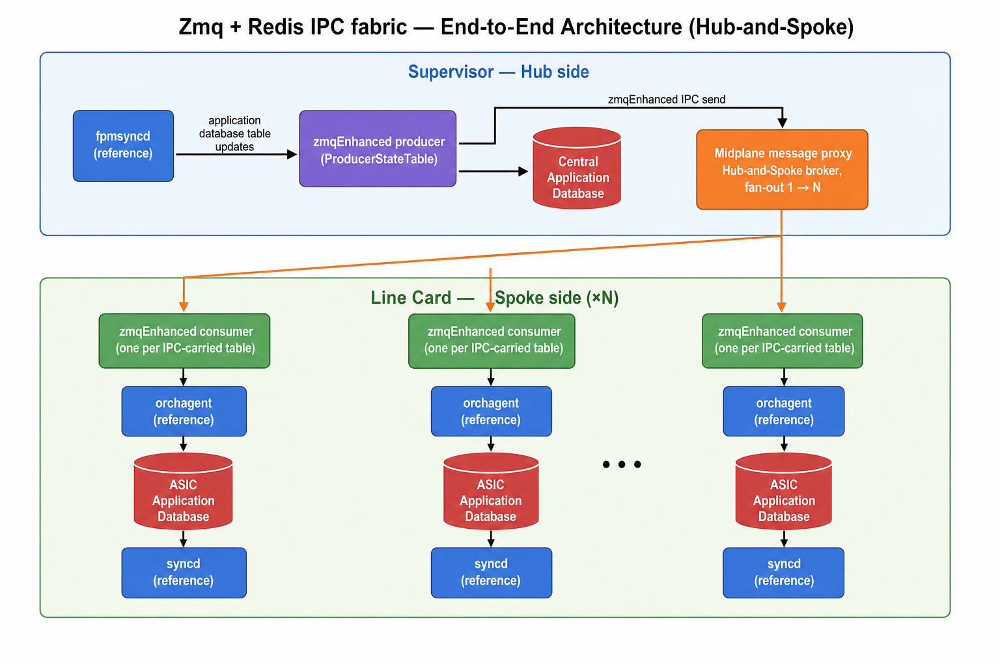
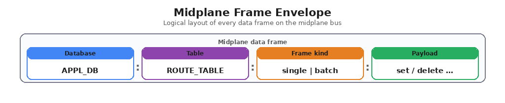
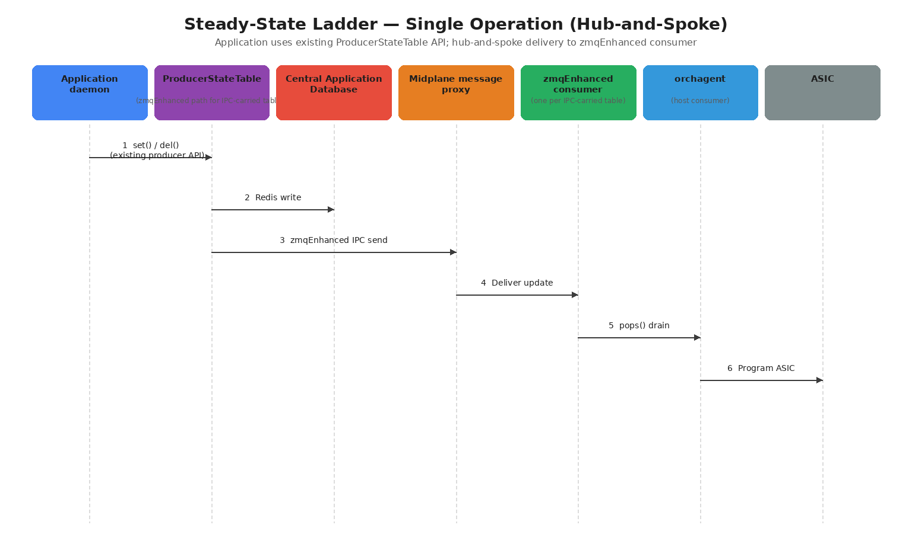
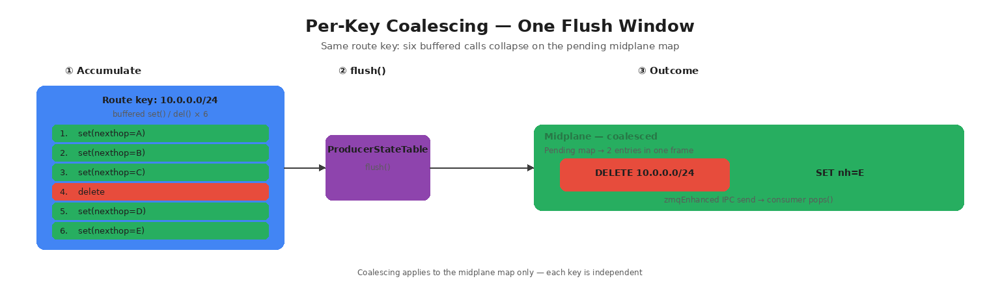
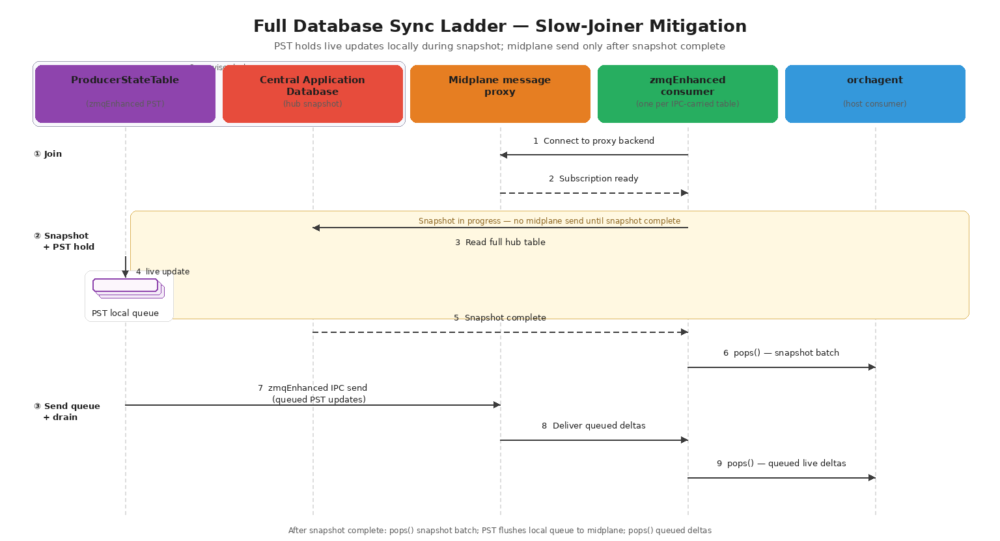
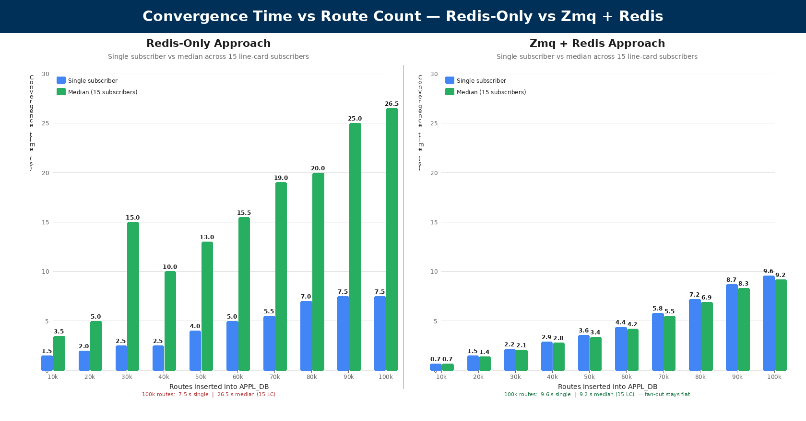

# Zmq + Redis based Inter-Process Communication (IPC)

**Authors**:
Pradeep Revanniah — Cisco  
Amit Grover — Cisco

**Date:** 06/10/2026

---

## Table of Contents

- [1. Definitions/Abbreviations](#1-definitionsabbreviations)
- [2. Revision](#2-revision)
- [3. Problem statement](#3-problem-statement)
  - [3.1 Problem](#31-problem)
  - [3.2 Solution](#32-solution)
- [4. Scope](#4-scope)
- [5. Assumptions](#5-assumptions)
- [6. Architecture](#6-architecture)
  - [Midplane message proxy](#midplane-message-proxy)
  - [zmqEnhanced producer](#zqmenhanced-producer)
  - [zmqEnhanced consumer](#zqmenhanced-consumer)
- [7. Midplane message format](#7-midplane-message-format)
  - [7.1 Frame Envelope](#71-frame-envelope)
  - [7.2 Single-Entry Frame](#72-single-entry-frame)
  - [7.3 Batched-Entry Frame](#73-batched-entry-frame)
  - [7.4 Subscription Frames](#74-subscription-frames)
- [8. Operational IPC flows](#8-operational-ipc-flows)
  - [8.1 Steady-state Update (Single Operation)](#81-steady-state-update-single-operation)
  - [8.2 Batched Update](#82-batched-update)
  - [8.3 Full database sync (slow-joiner mitigation)](#83-full-database-sync-slow-joiner-mitigation)
  - [8.4 Failure and Recovery](#84-failure-and-recovery)
    - [8.4.1 Proxy restart on Supervisor](#841-proxy-restart-on-supervisor)
    - [8.4.2 Consumer back-pressure (message drop)](#842-consumer-back-pressure-message-drop)
    - [8.4.3 No subscribers yet](#843-no-subscribers-yet)
    - [8.4.4 zmqEnhanced consumer disconnect](#844-zqmenhanced-consumer-disconnect)
    - [8.4.5 Producer back-pressure (send queue full)](#845-producer-back-pressure-send-queue-full)
- [9. IPC table set and sizing parameters](#9-ipc-table-set-and-sizing-parameters)
- [10. Restrictions and limitations](#10-restrictions-and-limitations)
- [11. Performance characterization](#11-performance-characterization)
  - [11.1 Methodology](#111-methodology)
  - [11.2 Convergence time](#112-convergence-time)
    - [11.2.1 Redis-only approach](#1121-redis-only-approach)
    - [11.2.2 Zmq + Redis based approach](#1122-zmq-redis-based-approach)
  - [11.3 Comparison and design implications](#113-comparison-and-design-implications)
- [12. Related documents](#12-related-documents)

---

## 1. Definitions/Abbreviations

**Table 1: Definitions and abbreviations**

| Term                         | Definition                                                                                                                                                                                                                                                                                                   |
| ---------------------------- | ------------------------------------------------------------------------------------------------------------------------------------------------------------------------------------------------------------------------------------------------------------------------------------------------------------ |
| zmqEnhanced IPC              | Extension to producer and consumer state tables for **IPC-carried tables**: Redis write and midplane publish on the producer side; **full database sync** and midplane deltas on the consumer side.                                                                                                          |
| zmqEnhanced producer         | Enhancement to `ProducerStateTable` on the Supervisor for IPC-carried tables. Each operation performs a **zmqEnhanced IPC send**. No change to existing publish API.                                                                                                                                         |
| zmqEnhanced consumer         | Enhancement to `ConsumerStateTable` on the Linecardand for IPC-carried tables. Connects to the message proxy via miaplane, demultiplexes frames by `(database, table)`, One instance per IPC-carried table per NPU in **orchagent**.                                                                         |
| Midplane                     | Control-plane interconnect between Supervisor and line cards in a centralized chassis.                                                                                                                                                                                                                       |
| Message proxy                | XPUB/XSUB **Hub-and-Spoke** broker on the Supervisor. Stateless forwarder — ingests producer frames on the frontend and fans each frame to all connected consumers on the backend ([§6](#6-architecture)).                                                                                                   |
| Zmq + Redis IPC fabric       | Communication fabric for **platforms using this transport**: using **Hub-and-Spoke** proxy, **zmqEnhanced producers** on the producer side, and per-table **zmqEnhanced consumers** on the consumer side (one per NPU).                                                                                      |
| Central application database | Centralized Redis database on the Supervisor — **source of truth** for IPC-carried tables. Every zmqEnhanced IPC operation writes here first; line cards reconcile through **full database sync** when midplane notifications are missed ([§8.4](#84-failure-and-recovery)).                                 |
| Full database sync           | Read database snapshot for IPC-carried table from the **central application database**. Triggered at zmqEnhanced consumer start, reconnect, and consumer restart ([§8.3](#83-full-database-sync-slow-joiner-mitigation), [§8.4](#84-failure-and-recovery)). Live midplane deltas follow once sync completes. |
| Per-key coalescing           | Within one buffered flush window, repeated operations on the same key collapse; Redis still executes every queued script ([§8.2](#82-batched-update)).                                                                                                                                                       |
| ProducerStateTable (PST)     | Standard SONiC producer state table — `set` / `del` / `flush` with Redis scripted writes. Extended as **zmqEnhanced producer** for IPC-carried tables ([§6](#6-architecture)).                                                                                                                               |
| ConsumerStateTable (CST)     | Standard SONiC consumer state table — drains pending keys via Redis pub/sub. Supports at most one consumer per table channel; does not scale to multi-NPU fan-out ([§3.1](#31-problem)).                                                                                                                     |
| Supervisor                   | Supervisor card in a centralized chassis; hosts the **central application database** and **midplane message proxy**.                                                                                                                                                                                         |
| LC (line card)               | Line card in a centralized chassis; hosts per-NPU **orchagent** (**zmqEnhanced consumer** + host consumer) and **syncd**.                                                                                                                                                                                    |
| routeCheck                   | SONiC background consistency check comparing line-card programmed state against the **central application database**. Flags drift after midplane message loss; recovery triggers **full database sync** via service restart ([§8.4](#84-failure-and-recovery)).                                              |

---

## 2. Revision

**Table 2: Document revision history**

| Rev | Date       | Author                                         | Change Description              |
| --- | ---------- | ---------------------------------------------- | ------------------------------- |
| 1.0 | 06/10/2026 | Pradeep Revanniah (Cisco), Amit Grover (Cisco) | Initial Zmq + Redis IPC design. |

---

## 3. Problem statement

### 3.1 Problem

In a **centralized chassis**, a control-plane **producer** on the Supervisor (for example, **fpmsyncd** writing `ROUTE_TABLE`) must deliver table updates to **many consumers** — one **orchagent** per NPU namespace on line cards. SONiC today offers two Redis-based notification paths for this class of update; **neither scales** on a centralized chassis.

The `ProducerStateTable` **/** `ConsumerStateTable` **(PST/CST)** path is designed for **one publisher and at most one consumer**. The publisher inserts modified keys into a shared Redis **key set**, updates a **shadow table**, and publishes to a single table channel. The consumer wakes on that channel, **pops** keys from the key set, and applies updates. When a **second consumer** wakes on the same channel, the key set has already been **drained** by the first — it finds nothing to process. On a centralized chassis with multiple per-NPU orchagents, standard PST/CST **cannot fan out** the same update to every consumer.

**Example:** A route published from **fpmsyncd** must reach every line-card **Route Orch** that programs the prefix locally. With standard PST/CST, only one orchagent reliably consumes the pending key set; others miss the notification cycle.

The alternative — remote subscribers on **Redis keyspace notifications** with **PSUBSCRIBE** (pattern subscribe per table entry) — avoids the empty key-set problem but **does not scale**. Subscriber count grows with **(namespaces × tables × line cards)**. As subscriber count rises, measured **Redis publish throughput degrades**. Keyspace notifications are **not durably queued**; under load, **slow receivers** **application-level event loss**, with consistency depending on background checks (e.g. **routeCheck**) and **full database sync** for recovery.

**Requirement** — Need 1→N fan-out, **full database sync** from the **central application database** at zmqEnhanced consumer construction, route-scale performance, and midplane notification without per-NPU **PSUBSCRIBE**.

### 3.2 Solution

This HLD defines the **Zmq + Redis IPC fabric** for a **centralized chassis** that:

1. **Extends PST/CST for 1→N fan-out** — `ProducerStateTable` keeps the existing `set` / `del` / `flush` API and Redis write path; for IPC-carried tables it adds a **zmqEnhanced IPC send** (Redis write plus midplane publish). Each line card uses a **zmqEnhanced consumer** — a `ConsumerStateTable` subclass that preserves the `pops()` contract while receiving live midplane deltas instead of competing for the shared Redis key set.
2. **Decouples delivery from Redis pub/sub fan-in** — a **midplane message proxy** (ZMQ XPUB/XSUB **Hub-and-Spoke** broker) on the control-plane interconnect fans each published frame to all connected zmqEnhanced consumers with **one forwarding cost per frame**, without adding a remote **PSUBSCRIBE** session per NPU per table.
3. **Keeps Redis authoritative** — every zmqEnhanced IPC operation writes to the **central application database** first; zmqEnhanced consumers perform **full database sync** from that database at construction, after midplane reconnect, and when rebuilt after service restart, then drain midplane deltas — so notification loss on the midplane path does not replace Redis as the source of truth. Missed notifications are surfaced by **routeCheck** and reconciled through service restart and full database sync ([§8.4](#84-failure-and-recovery)).

Implemented in **sonic-swss-common**; IPC-carried table set only ([§9](#9-ipc-table-set-and-sizing-parameters)); other paths unchanged (including **ProducerTable** / **ConsumerTable** 1:1 RPC).

---

## 4. Scope

This HLD covers:

1. The **Zmq + Redis IPC fabric** — midplane XPUB/XSUB proxy, zmqEnhanced producer, and zmqEnhanced consumer ([§6](#6-architecture)).
2. **Midplane message format** — logical frame envelope and payload layouts ([§7](#7-midplane-message-format)).
3. **Operational flows** — steady state, batched updates, full database sync, and failure recovery ([§8](#8-operational-ipc-flows)).
4. The coordinated **IPC-carried table set** and transport sizing parameters ([§9](#9-ipc-table-set-and-sizing-parameters)).
5. **Design-validation performance** characterization motivating the fabric ([§11](#11-performance-characterization)).

**Delivery model.** Midplane notification is **best-effort**, not guaranteed. Every producer operation still writes to the **central application database** first; any message loss on the midplane path must be recovered through **full database sync** ([§8.3](#83-full-database-sync-slow-joiner-mitigation), [§8.4](#84-failure-and-recovery)).

Out of scope:

- Application-level orchagent programming logic beyond the producer/consumer drain contract.

---

## 5. Assumptions

This design assumes the following:

1. **Reachable IPC transport** — Producers on the Supervisor and zmqEnhanced consumers on line cards SHALL reach the same XPUB/XSUB proxy over the centralized chassis midplane (TCP).
2. **Authoritative Redis** — IPC-carried tables live in the **central application database** (Redis on the Supervisor). The producer **writes each update to that database**; the **zmqEnhanced IPC path** delivers the same changes to zmqEnhanced consumers over the **Zmq midplane**. Redis remains the **source of truth**; consumers reconcile through **full database sync** at construction, after reconnect, and when rebuilt after service restart; the midplane carries notification only.
3. **One proxy per chassis** — One midplane message proxy serves each centralized chassis on the Supervisor. Publishers connect to its frontend and zmqEnhanced consumers to its backend ([midplane message proxy](#midplane-message-proxy)).

---

## 6. Architecture

Today, SONiC distributes table updates through PST/CST over Redis: the producer writes to Redis and publishes a notification; the consumer drains pending entries. On a centralized chassis, multiple per-NPU consumers must receive the same update; standard PST/CST and remote Redis pub/sub do not scale for that 1→N fan-out ([§3.1](#31-problem)). The fabric below extends the existing producer/consumer interface for the IPC-carried table set ([§8](#8-operational-ipc-flows)).

The Zmq + Redis IPC fabric is **not** a new application or container. It is a **plug-and-play extension** of the existing producer/consumer state-table mechanism in the shared SONiC library layer, comprising **three cooperating components** — midplane message proxy, zmqEnhanced producer, and zmqEnhanced consumer.

| Side         | What changes                                                                                                                                                                                            | What stays the same                                                        |
| ------------ | ------------------------------------------------------------------------------------------------------------------------------------------------------------------------------------------------------- | -------------------------------------------------------------------------- |
| **Producer** | For IPC-carried tables, each publish performs write to the **central application database** and notification on the midplane ([zmqEnhanced producer](#zqmenhanced-producer)).                           | Application daemons keep the same publish contract they use today.         |
| **Consumer** | For IPC-carried tables, the consumer performs a **full database sync** from the **central application database**, then drains **live midplane deltas** ([zmqEnhanced consumer](#zqmenhanced-consumer)). | The host consumer's event loop and per-table handler wiring are unchanged. |

Redis remains the **authoritative store** and the source for full database sync on every zmqEnhanced IPC operation. Tables outside the IPC-carried set continue to use the **existing Redis pub/sub interface**. The diagram below describe the **centralized chassis deployment**: Supervisor publisher (**fpmsyncd**), line-card **orchagent** (per NPU namespace), and the midplane message proxy on the Supervisor.

**Figure 1: End-to-end architecture — Zmq + Redis IPC fabric (Hub-and-Spoke)**

| Step  | Figure 1              | From → To                                                              | What happens                                                                                               |
| ----- | --------------------- | ---------------------------------------------------------------------- | ---------------------------------------------------------------------------------------------------------- |
| **1** | fpmsyncd → Producer   | Application daemon → producer state table                              | A table update is issued on the Supervisor.                                                                |
| **2** | zmqEnhanced IPC send  | Producer → Central application database **and** Midplane message proxy | The same update is written to Redis and published on the midplane in one producer action (parallel paths). |
| **3** | Hub-and-Spoke fan-out | Midplane message proxy → zmqEnhanced consumer (×N)                     | The proxy forwards each frame to every connected spoke; forwarding cost is per frame, not per subscriber.  |
| **4** | orchagent             | zmqEnhanced consumer → consumer → ASIC application database → syncd    | The consumer applies updates to local forwarding state and programs the ASIC.                              |

**Full database sync:** when a zmqEnhanced consumer is created while publishers are already active, it reads the full table from the **central application database** first, delivers that snapshot to the host consumer, then drains live midplane deltas ([§8.3](#83-full-database-sync-slow-joiner-mitigation)).

**Table 3: Component summary**

| Component              | Location                                         | Role                                                                                                                                                                                          |
| ---------------------- | ------------------------------------------------ | --------------------------------------------------------------------------------------------------------------------------------------------------------------------------------------------- |
| Midplane message proxy | Supervisor                                       | XPUB/XSUB hub on the centralized chassis midplane. Stateless forwarder — no parse, persist, or replay.                                                                                        |
| zmqEnhanced producer   | Supervisor application daemons                   | Extends the existing producer state table: Redis write plus midplane publish for IPC-carried tables.                                                                                          |
| zmqEnhanced consumer   | Line-card host consumer, per NPU (**orchagent**) | One per IPC-carried table. Receives midplane frames, **full database sync** from the central application database at construction and after reconnect, delivers updates to the host consumer. |
| Host-consumer wiring   | Line-card **orchagent**                          | Selects zmqEnhanced consumer vs standard PST/CST consumer for each table based on runtime flag and line-card mode.                                                                            |

---

#### Midplane message proxy

The midplane message proxy is the **Hub-and-Spoke broker** for Zmq + Redis IPC traffic.

| Socket       | Pattern | Connects                               | Role                                            |
| ------------ | ------- | -------------------------------------- | ----------------------------------------------- |
| **Frontend** | XSUB    | Producers (PUB) connect in             | Ingests every published frame.                  |
| **Backend**  | XPUB    | zmqEnhanced consumers (SUB) connect in | Fans each ingested frame to all current spokes. |

**Properties**

- **Stateless** — no application parsing, no persistence, no replay. A frame published while the proxy is down is dropped ([§8.4.1](#841-proxy-restart-on-supervisor)).
- **Location** — runs on the Supervisor; bind address is the centralized chassis midplane. Producers and consumers learn endpoints through platform database configuration.
- **Trivial filtering** — each zmqEnhanced consumer demultiplexes locally on `(database, table)` identity.
- **One per chassis** — one proxy per centralized chassis.
- **Lifecycle** — starts after the **central application database** is up and before chassis configuration is applied; systemd `Restart=always` on exit; stop/start recovery hook cycles `sonic.target` on the Supervisor and line cards so spokes reconcile via full database sync at consumer construction ([§8.4](#84-failure-and-recovery)).
- **Observability** — periodic stats (received / forwarded / dropped / subscriber count) and shutdown summary.

#### zmqEnhanced producer

The zmqEnhanced producer is the **existing producer state table**, extended internally for IPC-carried tables. Application daemons require **no publish-contract change**.

**zmqEnhanced IPC send** — every IPC-carried operation performs both paths in one call:

1. **Write to Redis** — same scripted write path as the non-IPC case; any Redis-only observer sees unchanged semantics.
2. **Publish to midplane** — the same row operation is serialized and sent to the proxy frontend.

The table below summarizes the four operation classes. Detailed batching, flush, and per-key coalescing behaviour is in [§8.2](#82-batched-update).

| Operation     | Redis path                                                         | Midplane path                                                                                           |
| ------------- | ------------------------------------------------------------------ | ------------------------------------------------------------------------------------------------------- |
| Single set    | Scripted write (queued in buffered mode).                          | Buffered: merged per key until flush. Unbuffered: immediate single-entry frame.                         |
| Single delete | Scripted delete (queued in buffered mode).                         | Buffered: coalesced per key until flush. Unbuffered: immediate single-entry frame.                      |
| Batched set   | Pipelined batch write.                                             | One batched-entry frame for the full vector.                                                            |
| Flush         | Drains the Redis pipeline to the **central application database**. | Emits one batched-entry frame with per-key coalescing on the midplane map ([§8.2](#82-batched-update)). |

**Back-pressure** — midplane publish is non-blocking. A full producer send queue drops the frame, increments a per-producer counter, and returns soft failure; the Redis write still succeeds. TCP may reconnect underneath, but dropped notifications are not replayed. **routeCheck** flags line-card drift; recovery is a service restart and full database sync from the central application database ([§8.4.5](#845-producer-back-pressure-send-queue-full), [§8.3](#83-full-database-sync-slow-joiner-mitigation)).

**Resources** — one publish socket per `(database, table)`; send buffers sized for route-scale bursts; TCP keep-alive on dead peers.

**Observability** — messages sent, messages dropped, connection state, reconnect.

#### zmqEnhanced consumer

The zmqEnhanced consumer replaces Redis pub/sub notification for IPC-carried tables while preserving the **same drain contract** the host consumer uses today. On a centralized chassis it runs inside line-card **orchagent**, one per IPC-carried table per NPU namespace.

**Responsibilities**

- Connect to the proxy backend; receive and deserialize midplane frames.
- Accept only frames matching this consumer's `(database, table)` pair.
- On construction: **full database sync** — read the full table from the **central application database**, stage as the first delivery batch, then process live midplane deltas ([§8.3](#83-full-database-sync-slow-joiner-mitigation)).
- In steady state: enqueue decoded updates and wake the host consumer's event loop; deliver **snapshot first, then deltas**.
- On disconnect: bounded back-off reconnect, re-subscribe, **full database sync** for lost messages ([§8.4.4](#844-zqmenhanced-consumer-disconnect)).
- On consumer back-pressure: receiver queue full — message dropped; **routeCheck** flags drift; service restart reconciles via full database sync ([§8.4.2](#842-consumer-back-pressure-message-drop)).
- Maintain telemetry: received, delivered, dropped, reconnect attempts, connection state.

---

## 7. Midplane message format

This section describes the **logical shape** of a frame published on the midplane message bus — the contract between the [zmqEnhanced producer](#zqmenhanced-producer) and the [zmqEnhanced consumer](#zqmenhanced-consumer). The *logical envelope* below is what the two sides agree on.

### 7.1 Frame Envelope

Every midplane frame carries a small envelope identifying the source of the update, followed by a payload section whose shape depends on whether the frame is a single entry or a batched entry.

**Figure 2: Midplane frame envelope — database : table : frame kind : payload.**

| Envelope field      | Direction             | Purpose                                                                                                                                                                                                               |
| ------------------- | --------------------- | --------------------------------------------------------------------------------------------------------------------------------------------------------------------------------------------------------------------- |
| Database identifier | Producer → Subscriber | Names the logical Redis database the update belongs to (the **central application database** on the Supervisor). Subscribers reject any frame whose database identifier does not match their own database connection. |
| Table identifier    | Producer → Subscriber | Names the Redis table (one of the entries in [§9](#9-ipc-table-set-and-sizing-parameters)). Subscribers reject any frame whose table identifier does not match the table they own.                                    |
| Frame kind          | Producer → Subscriber | One of `single` or `batch`. Selects the payload layout below.                                                                                                                                                         |

The proxy itself does **not** read the envelope; it forwards every received frame to every currently connected spoke ([midplane message proxy](#midplane-message-proxy)). The `(database, table)` demultiplex is performed locally ([zmqEnhanced consumer](#zqmenhanced-consumer)).

### 7.2 Single-Entry Frame

A single-entry frame carries exactly one operation on exactly one key.

| Payload field    | Purpose                                                                                            |
| ---------------- | -------------------------------------------------------------------------------------------------- |
| Operation        | One of `set` or `delete`.                                                                          |
| Key              | The Redis table key the operation applies to (e.g. a route prefix, an interface name, a LAG name). |
| Field-value list | Present for `set`; the row contents. Absent or empty for `delete`.                                 |

Single-entry frames are produced by the single-set and single-delete operations described in the [zmqEnhanced producer](#zqmenhanced-producer).

### 7.3 Batched-Entry Frame

A batched-entry frame carries one or more **set** or **delete** operations as a length-prefixed list.

| Payload field | Purpose                                                                                                                                                         |
| ------------- | --------------------------------------------------------------------------------------------------------------------------------------------------------------- |
| Entry count   | Number of entries in this batch.                                                                                                                                |
| Entry 1 .. N  | A repeated `<Operation, Key, Field-value list>` tuple per entry. Each entry preserves the same shape it would have in a single-entry frame, minus the envelope. |

Batched-entry frames are produced by the batched-set operation and by the flush operation when buffered mode has accumulated entries ([zmqEnhanced producer](#zqmenhanced-producer), [§8.2](#82-batched-update)).

A consumer that receives a batched-entry frame surfaces the entire batch in a single delivery to the host consumer's event loop ([§8.2](#82-batched-update)).

### 7.4 Subscription Frames

Distinct from the data frames described above, ZeroMQ's XPUB/XSUB pattern also propagates **subscription frames** in the reverse direction (backend → frontend). These frames are produced by the underlying ZeroMQ library when a subscriber connects to the proxy's backend, and they are forwarded by the proxy back to its frontend so that publishers can become aware that at least one subscriber is attached.

In the Zmq + Redis IPC fabric:

- Per-table filtering is performed locally.
- Producers do not consume subscription frames for routing decisions; the proxy simply uses subscription state to track the current spoke count, which is exposed via the proxy stats line ([midplane message proxy](#midplane-message-proxy)).

Subscription frames are mentioned here only for completeness; an integrator implementing a new subscriber does not need to construct them explicitly.

---

## 8. Operational IPC flows

This section describes end-to-end behaviour on a **centralized chassis** (Supervisor publishers, line-card consumers, ASIC programming on line cards).

### 8.1 Steady-state Update (Single Operation)

**Figure 3: Steady-state ladder — single IPC-carried table update (Hub-and-Spoke).**

At construction, PST selects the zmqEnhanced path when the table is IPC-carried ([§9](#9-ipc-table-set-and-sizing-parameters)). Application daemons use the **existing** `ProducerStateTable` **API** (`set` / `del` / `flush`) — no publish-contract change. On each operation, PST performs the standard Redis write; for IPC-carried tables it also performs a **zmqEnhanced IPC send** to the midplane message proxy in the same call. The proxy forwards the frame to all connected spokes. The host consumer drains the queue and programs the ASIC.

**Invariants.**

- Redis remains the central store on every operation; midplane publish is best-effort and never gates the Redis write.
- Redis write and midplane publish happen in the same producer call.
- Midplane publish is non-blocking; a full producer send queue drops the frame and increments a per-producer counter ([§8.4.5](#845-producer-back-pressure-send-queue-full)).
- Per-table demultiplexing is performed locally based in filter.

### 8.2 Batched Update

The fabric supports batched delivery in two ways:

1. **Explicit batched invocation** — the application passes a vector of updates in one producer call. Redis and the midplane each receive one aligned batch.
2. **Buffered accumulation** — many single-key updates accumulate in memory (typical BGP route churn on the Supervisor) and flush together. This is the dominant mode for `ROUTE_TABLE`.

| Mode                        | How triggered                                   | Redis at flush                                                        | Midplane at flush                          |
| --------------------------- | ----------------------------------------------- | --------------------------------------------------------------------- | ------------------------------------------ |
| Explicit batched invocation | Producer called with a vector of updates        | One pipelined script batch                                            | One frame carrying the full vector         |
| Buffered accumulation       | Many single-key `set` / `del` calls, then flush | One pipeline flush executing **N** scripts (one per application call) | One frame carrying **M** coalesced entries |
| Per-key coalescing          | Automatic on the pending midplane map           | No coalescing — all **N** scripts still queued                        | Collapses repeated ops on the same key     |

**Explicit vector.** One `set(vector)` call writes a pipelined Redis batch and sends one midplane frame. The zmqEnhanced consumer delivers the full batch in a single `pops()`.

**Buffered routes.** `ROUTE_TABLE` PST runs in buffered mode: each `set` / `del` queues a Redis script and updates the pending midplane map. `flush()` is triggered when pipeline capacity is reached. On flush, PST performs a paired **Redis write** and **zmqEnhanced IPC send** ([§7.3](#73-batched-entry-frame)).

**Per-key coalescing (midplane only).** Within one flush window, repeated operations on the same key collapse on the pending midplane map — merged `set` fields (last value wins per field), with `delete` clearing prior sets and preserving withdraw-then-re-add order when a `set` follows. Redis still executes every queued script.

**Figure 4: Per-key coalescing — accumulate, flush, outcome (midplane only).** Six buffered calls on route key `10.0.0.0/24` — `set(nexthop=A/B/C)`, `delete`, `set(nexthop=D)`, `set(nexthop=E)` — coalesce on the pending midplane map to **DELETE** plus one merged **SET nh=E**.

**Line card.** The zmqEnhanced consumer deserializes one frame, enqueues all entries, and wakes orchagent once. The host consumer drains the batch in one iteration.

### 8.3 Full database sync (slow-joiner mitigation)

**Figure 5: Full database sync ladder — join, snapshot + PST hold, send queue + drain.**

When the host consumer registers for an IPC-carried table, the zmqEnhanced consumer connects to the proxy backend, then reads the full table from the **central application database** as a one-shot snapshot staged for the first `pops()`.

While the snapshot read is in progress, live updates at the zmqEnhanced PST accumulate in a **local pending queue on the Supervisor** — no midplane publish until the snapshot completes. When the snapshot read completes, the first `pops()` returns the snapshot batch. PST then sends held updates via **zmqEnhanced IPC send**; a subsequent `pops()` returns the queued live deltas.

### 8.4 Failure and Recovery

[Figure 6](#84-failure-and-recovery) shows the three saturation queues on the steady-state path from **ProducerStateTable** on the Supervisor to **orchagent** on a line card. Each numbered queue sits on the connector between stages: **①** PUB send queue, **②** XPUB fan-out (one queue per subscriber — queue1 … queue-n), and **③** received-op buffer before **orchagent** drains. When a marked queue saturates, midplane frames may be dropped while the **central application database** write on the Supervisor still completes. **①** maps to producer send-queue saturation ([§8.4.5](#845-producer-back-pressure-send-queue-full)), **②** to proxy XPUB fan-out with no subscribers or blocked send ([§8.4.3](#843-no-subscribers-yet)), and **③** to consumer receive-queue saturation ([§8.4.2](#842-consumer-back-pressure-message-drop)).

**Figure 6: Saturation queues on the IPC stack (① PUB · ② XPUB fan-out · ③ received-op).**

Five failure classes can interrupt midplane delivery. Each is detected by a different actor and increments a drop or restart counter. The central application database on the Supervisor remains authoritative in every case; line cards recover through **full database sync** ([§8.3](#83-full-database-sync-slow-joiner-mitigation), [§8.4](#84-failure-and-recovery)).

| Scenario                                 | Detecting actor                                                                | On failure                                                                                                                                  | Recovery                                                                                                                                                                                                                                                                                                                                                                                                                                |
| ---------------------------------------- | ------------------------------------------------------------------------------ | ------------------------------------------------------------------------------------------------------------------------------------------- | --------------------------------------------------------------------------------------------------------------------------------------------------------------------------------------------------------------------------------------------------------------------------------------------------------------------------------------------------------------------------------------------------------------------------------------- |
| Proxy restart on Supervisor              | systemd (midplane proxy service `Restart=always`; recovery hook on stop/start) | Midplane notifications **not delivered** to zmqEnhanced consumers while the proxy is down; **Redis writes still succeed** on the Supervisor | systemd restarts the proxy and re-binds midplane endpoints; recovery handler cycles **sonic.target** on the Supervisor and all active line cards, restarting dependent services (including **orchagent**). Rebuilt zmqEnhanced consumers perform **full database sync** from the central application database at construction ([§8.3](#83-full-database-sync-slow-joiner-mitigation)); producers and subscribers reconnect to the proxy |
| Consumer back-pressure (message drop)    | zmqEnhanced consumer (receiver queue full; message dropped)                    | Message **dropped** when receiver queue is full; per-consumer drop counter incremented                                                      | Subscriber does not retry the dropped frame. **routeCheck** flags programming drift on line cards; a **service restart** rebuilds zmqEnhanced consumers for **full database sync** from the central application database ([§8.3](#83-full-database-sync-slow-joiner-mitigation))                                                                                                                                                        |
| Producer back-pressure (send queue full) | zmqEnhanced producer (send queue full; frame dropped)                          | Midplane frame **dropped**; per-producer drop counter incremented; **Redis write still succeeds** on the Supervisor                         | **routeCheck** flags programming drift on line cards; a **service restart** rebuilds zmqEnhanced consumers for **full database sync** from the central application database ([§8.3](#83-full-database-sync-slow-joiner-mitigation))                                                                                                                                                                                                     |
| No subscribers yet                       | Midplane message proxy                                                         | Frame dropped when no SUB socket is connected; drop counter visible in periodic stats                                                       | When subscriber connects, line cards rely on full database sync at construction ([§8.3](#83-full-database-sync-slow-joiner-mitigation))                                                                                                                                                                                                                                                                                                 |
| zmqEnhanced consumer disconnect          | zmqEnhanced consumer                                                           | Frames published while disconnected are **lost**                                                                                            | Bounded back-off reconnect, re-subscribe, **full database sync** for lost messages ([§8.3](#83-full-database-sync-slow-joiner-mitigation))                                                                                                                                                                                                                                                                                              |

#### 8.4.1 Proxy restart on Supervisor

While the midplane proxy is down, notifications are not delivered to zmqEnhanced consumers but **Redis writes still succeed** on the Supervisor. A systemd recovery hook restarts the proxy and cycles `sonic.target` on the Supervisor and line cards; rebuilt consumers perform full database sync from the central application database ([§8.3](#83-full-database-sync-slow-joiner-mitigation)).

#### 8.4.2 Consumer back-pressure (message drop)

When the receiver queue is full, the message is **dropped** and the per-consumer drop counter is incremented. The subscriber does not retry. **routeCheck** flags programming drift; a service restart rebuilds zmqEnhanced consumers for full database sync ([§8.3](#83-full-database-sync-slow-joiner-mitigation)).

#### 8.4.3 No subscribers yet

The proxy drops frames while no SUB socket is connected. When a subscriber connects, line cards rely on full database sync at zmqEnhanced consumer construction ([§8.3](#83-full-database-sync-slow-joiner-mitigation)).

#### 8.4.4 zmqEnhanced consumer disconnect

Frames published while the zmqEnhanced consumer is disconnected are **lost**. Recovery is bounded back-off reconnect, re-subscribe, and full database sync for lost messages ([§8.3](#83-full-database-sync-slow-joiner-mitigation)).

#### 8.4.5 Producer back-pressure (send queue full)

When the producer send queue is full, the midplane frame is **dropped** and the per-producer drop counter is incremented; the **Redis write still succeeds**. **routeCheck** flags programming drift; a service restart rebuilds zmqEnhanced consumers for full database sync ([§8.3](#83-full-database-sync-slow-joiner-mitigation)).

---

## 9. IPC table set and sizing parameters

The Zmq + Redis IPC sizing is expressed through **coordinated parameters** in the producer, proxy, and consumer for route scale and chassis fan-out. The zmqEnhanced IPC path is **database-agnostic**: any Redis database may participate when its tables are added to the coordinated producer/consumer set on **both** sides.

The tables below use the ZeroMQ midplane on a centralized chassis (central Supervisor application database). Additional tables may be added through a coordinated producer and consumer change. Queue placement and saturation behavior are summarized in [Figure 6](#84-failure-and-recovery).

**IPC-carried tables:** `BUFFER_PG_TABLE`, `BUFFER_POOL_TABLE`, `BUFFER_PORT_EGRESS_PROFILE_LIST_TABLE`, `BUFFER_PORT_INGRESS_PROFILE_LIST_TABLE`, `BUFFER_PROFILE_TABLE`, `BUFFER_QUEUE_TABLE`, `COPP_TABLE`, `FABRIC_MONITOR_TABLE`, `FABRIC_PORT_TABLE`, `INTF_TABLE`, `LAG_MEMBER_TABLE`, `LAG_TABLE`, `NEIGH_TABLE`, `PORT_TABLE`, `ROUTE_TABLE`, `VRF_TABLE`

**Table 4: Coordinated sizing parameters**

| Component                                   | Sizing parameter                                | Design intent                                                                                                                                                                                                               |
| ------------------------------------------- | ----------------------------------------------- | --------------------------------------------------------------------------------------------------------------------------------------------------------------------------------------------------------------------------- |
| zmqEnhanced producer (buffered)             | Redis pipeline depth (`COMMAND_MAX`)            | Cap how many scripted Redis operations accumulate before a pipeline flush; route producers are sized for large burst windows                                                                                                |
|                                             | Idle / timer flush interval                     | Time-based drain of buffered producer work when churn pauses                                                                                                                                                                |
|                                             | Per-key coalescing (pending midplane map)       | Collapse repeated operations on the same key within one flush window (Redis still executes one script per application call) ([§8.2](#82-batched-update))                                                                    |
| zmqEnhanced producer (transport)            | PUB send high-water mark (`SNDHWM`)             | Bound the producer socket send queue; saturation drops frames rather than blocking the application thread                                                                                                                   |
|                                             | PUB socket send buffer (`SNDBUF`)               | OS-level egress buffering on the publish socket                                                                                                                                                                             |
| Midplane message proxy                      | XSUB receive high-water mark and receive buffer | Ingress buffering from all producers before the forward loop                                                                                                                                                                |
|                                             | XPUB send high-water mark and send buffer       | Egress buffering toward all line-card subscribers                                                                                                                                                                           |
|                                             | Context I/O thread count and max sockets        | Forwarding capacity for chassis-scale fan-out                                                                                                                                                                               |
| zmqEnhanced consumer (`ZmqEnhancedClient`)  | SUB receive high-water mark (`RCVHWM`)          | Socket-level burst absorption on the line card                                                                                                                                                                              |
|                                             | SUB socket receive buffer (`RCVBUF`)            | OS-level ingress buffering on the subscribe socket                                                                                                                                                                          |

---

## 10. Restrictions and limitations

| Item                     | Detail                                                                                                                                                                                                                                                                                   |
| ------------------------ | ---------------------------------------------------------------------------------------------------------------------------------------------------------------------------------------------------------------------------------------------------------------------------------------- |
| IPC-carried table set    | Fixed, coordinated producer/consumer list ([§9](#9-ipc-table-set-and-sizing-parameters)); tables outside the set use the existing PST/CST interface unchanged                                                                                                                            |
| Midplane delivery        | Best-effort; Redis write always succeeds; dropped midplane frames are not replayed by the proxy                                                                                                                                                                                          |
| Full database sync scope | Consumer reconciles from the **central application database** through a full table read at construction, after midplane reconnect following disconnect, and when rebuilt after service restart ([§8.3](#83-full-database-sync-slow-joiner-mitigation), [§8.4](#84-failure-and-recovery)) |
| Proxy placement          | One midplane message proxy per centralized chassis, on the Supervisor                                                                                                                                                                                                                    |
| Subscriber scale         | One SUB socket and worker thread per (IPC-carried table × subscriber instance)                                                                                                                                                                                                           |

---

## 11. Performance characterization

**Disclaimer. All performance numbers in this section were collected from tests performed on Cisco hardware in a Controlled Cisco lab environment. They are representative design-validation measurements from pre-deployment validation, not a hard performance contract or a guarantee on other platforms. Specific platform details influence absolute values; the shape of the curves — and the qualitative conclusions drawn from them.**

### 11.1 Methodology

- **Setup.** A centralized chassis with one Supervisor and N line cards, deployed on Cisco hardware in a Cisco lab environment. Updates are produced on the Supervisor (route table is the dominant load source); zmqEnhanced consumers run inside per-NPU **orchagent** on line cards.
- **Configurations under test.** Two approaches are compared on the same hardware:
  1. **Redis-only approach** — every line-card consumer attaches to the Supervisor's **central application database** via a Redis pub/sub session.
  2. **Zmq + Redis based approach** — the same producers use the **Zmq + Redis IPC fabric** in this document: Redis remains the central store, but live notification fan-out moves to the Hub-and-Spoke midplane message proxy and **zmqEnhanced consumers** on line cards.
- **Workloads.** [§11.2](#112-convergence-time) measures **convergence time** — bulk insert of N routes and wall-clock time until each subscriber has all N routes.

### 11.2 Convergence time

The motivating performance question for a centralized chassis is route-scale **convergence under fan-out**: how long until every line-card **orchagent** has applied a bulk route insert from the Supervisor. [Figure 7](#112-convergence-time) plots the same convergence workload side by side — Redis-only on the left, Zmq + Redis on the right — with single-subscriber time and median time across 15 line-card subscribers at each route count.

**Figure 7: Convergence time vs route count**

#### 11.2.1 Redis-only approach

Bulk insert of N routes into the central route table on the Supervisor; measure wall-clock time until each consumer has all N routes. Reported as subscriber time in seconds.

**Observations.**

- Single-subscriber time grows roughly linearly with route count, from ~1.5 s at 10k routes to ~7.5 s at 100k routes — i.e. each additional 10k routes adds roughly 0.5–1 s of convergence delay.
- The 15-subscriber median is **substantially worse** at every route count, opening a 2–3× gap by 60k routes and a 3.5× gap at 100k routes (≈26.5 s vs ≈7.5 s). Crucially, the gap does **not** close at higher route counts; it widens. This is the defining symptom of the 1-producer → 1-consumer Redis fan-out: each additional consumer adds an independent Redis pub/sub session that competes for the same Supervisor Redis CPU and notification queue.

#### 11.2.2 Zmq + Redis based approach

Same convergence workload on the Zmq + Redis based approach.

**Observations.**

- Single-subscriber convergence grows with route count but stays bounded — ≈9.6 s at 100k routes on the measured hardware path.
- The 15-subscriber median **tracks the single-subscriber curve**. Fan-out cost does not multiply with line-card count.

### 11.3 Comparison and design implications

[Figure 7](#112-convergence-time) shows the convergence story: Redis-only fan-out degrades the 15-subscriber median to ≈26.5 s at 100k routes while Zmq + Redis keeps median near single-subscriber time (≈9.2 s). Qualitative comparison:

| Property                     | Redis-only approach                                                                            | Zmq + Redis based approach                                                                                 | Implication                                                                                            |
| ---------------------------- | ---------------------------------------------------------------------------------------------- | ---------------------------------------------------------------------------------------------------------- | ------------------------------------------------------------------------------------------------------ |
| Notification path            | Redis pub/sub session per `(producer, consumer)` pair                                          | One Hub-and-Spoke proxy frame per producer call, fanned out by ZeroMQ                                      | Zmq + Redis IPC removes Supervisor Redis as the fan-out bottleneck.                                    |
| Cost as N consumers grows    | Per-consumer Redis sessions multiply; Supervisor Redis CPU and notification queue scale with N | Per-frame proxy cost is constant; ZeroMQ replicates one frame to all current spokes in one forwarding step | Zmq + Redis IPC offers **constant** throughput as line-card / NPU count rises.                         |
| Convergence at scale         | 100k routes × 15 subscribers ≈ **26.5 s median** ([§11.2.1](#1121-redis-only-approach))        | 100k routes × 15 subscribers ≈ **9.2 s median** ([§11.2.2](#1122-zmq-redis-based-approach))                | Zmq + Redis IPC removes the multi-subscriber convergence penalty that defines the Redis-only baseline. |
| End-to-end hot-path delivery | Redis pub/sub round-trip; polling-style notification                                           | One proxy hop on the midplane; sub-millisecond forwarding step                                             | Zmq + Redis IPC is **sub-millisecond** on the wire portion of the path.                                |
| Central store state          | Redis                                                                                          | Redis (unchanged)                                                                                          | Zmq + Redis IPC is **purely additive**; non-IPC consumers see identical Redis semantics.               |

The qualitative claims that drive the design — **sub-millisecond delivery on the hot path** and **flat convergence under multi-subscriber fan-out** — are supported by [Figure 7](#112-convergence-time) and the comparison rows above. For chassis sizing, the key quantitative result is the flat ≈9 s 15-subscriber median at 100k routes ([§11.2.2](#1122-zmq-redis-based-approach)), which decouples fabric capacity from topology.

---

## 12. Related documents

| Document                        | Link                                                                                                                                                                                |
| ------------------------------- | ----------------------------------------------------------------------------------------------------------------------------------------------------------------------------------- |
| Centralized chassis baseline    | [voq_chassis_hld.md](https://wwwin-github.cisco.com/whitebox/SONiC/blob/master/doc/centralized-chassis/voq_chassis_hld.md)                                                          |
| Centralized chassis routing HLD | [centralized_chassis_routing_hld.md](https://wwwin-github.cisco.com/whitebox/SONiC/blob/centralized-chassis-routing-hld/doc/centralized-chassis/centralized_chassis_routing_hld.md) |

---

*End of document.*