# Memory and CPU Monitoring Enhancement

## Table of Contents
- [Scope](#scope)
- [Overview](#overview)
- [Requirements](#requirements)
- [High-Level Design](#high-level-design)
    - [Memory Gradual Increase Detection](#memory-gradual-increase-detection)
    - [Architecture](#architecture)
    - [State Format](#state-format)
    - [Monit Configuration](#monit-configuration)
    - [Example Flows](#example-flows)
    - [Output Format](#output-format)
    - [CPU Monitoring Enhancement](#cpu-monitoring-enhancement)
- [Testing Considerations](#testing-considerations)

## Scope

This document describes the high-level design of memory and CPU monitoring enhancements in SONiC.

## Terminology

**OOM (Out of Memory):** A critical system state where available memory is exhausted. OOM can be caused by (a) memory leak, (b) misconfigured limits, or (c) insufficient resources.

**RSS (Resident Set Size):** The portion of a process's memory held in RAM, excluding swapped memory.

**Linear Regression:** A statistical method that fits a straight line through a series of data points to identify trends. Simple linear regression uses one independent variable (time) to predict one dependent variable (memory usage).

**Slope:** The rate of change in a linear trend, measured in MB/min for memory growth.

**R² (R-squared):** A statistical confidence metric (0.0 to 1.0) indicating how well data fits a linear trend. Higher values indicate stronger linear patterns.


## Overview

Current memory monitoring is threshold-based (triggers at 90% memory usage) and fires at late stage when system is already at high memory. Sustained memory increases that grow slowly over hours or days go undetected until threshold is breached, by which time the system may be near OOM.

**OOM behavior in SONiC:** SONiC configures the kernel with `vm.panic_on_oom=2` and `kernel.panic=10`. With this configuration, a system-wide memory exhaustion triggers a **kernel panic and automatic box reload** (after 10 seconds) rather than the default Linux behavior of selectively killing processes. Since most SONiC containers run without explicit cgroup memory limits, virtually all OOM scenarios result in a full switch reload — making early detection of memory growth critical.

This enhancement adds:
1. **Memory gradual increase detection** - Statistical trend-based detection using linear regression across three time scales to predict time-to-OOM
2. **CPU monitoring** - Process-level logging when existing CPU threshold is breached

## High-Level Design

### Memory Gradual Increase Detection

This enhancement uses **linear regression** to detect memory trends and predict time-to-OOM across three time scales. Each time scale operates independently:

**Time scale:**

| Scale | Check Interval | Window Size | Samples | Target Growth Pattern |
|-------|---------------|-------------|---------|----------------------|
| Short | 5 min | 2 hours | 24 | Rapid growth (hours to OOM) |
| Medium | 60 min | 24 hours | 24 | Moderate growth (days to OOM) |
| Long | 480 min (8h) | 7 days | 21 | Gradual growth (weeks to OOM) |

**Cycle:** Monit runs checks every cycle (1 cycle = 1 minute).

**Detection methodology:**
1. Collect memory samples at regular intervals into a sliding window
2. Run linear regression on the window to calculate:
   - **Slope** (MB/min growth rate)
   - **R²** (confidence in trend, 0.0-1.0)
3. Calculate **time-to-90%**: How long until memory reaches 90% threshold at current growth rate
4. Alert if:
   - Time-to-90% is less than threshold (e.g., < 6 hours for short window)
   - Memory grew significantly as % of free memory (e.g., > 1% of free mem for short window)
   - Trend is statistically significant (R² > 0.7)

### Architecture

**Components:**

| Component | Function | Output |
|-----------|----------|--------|
| Checker | Sample collection, regression, detection | Exit code: 0 or 2 |
| Handler | Logging, process attribution | Syslog (INFO level) |
| Monit | Scheduling, exit code monitoring | Triggers handler on exit 2 |

**Monit:** Process and resource monitoring daemon. Runs checks at configured intervals, executes actions based on exit codes.

#### Component Interaction

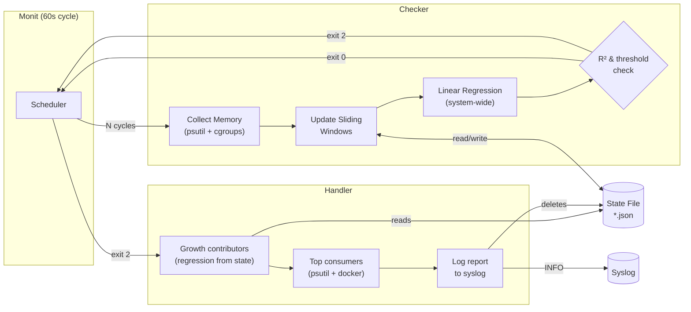

#### Detection Decision Tree

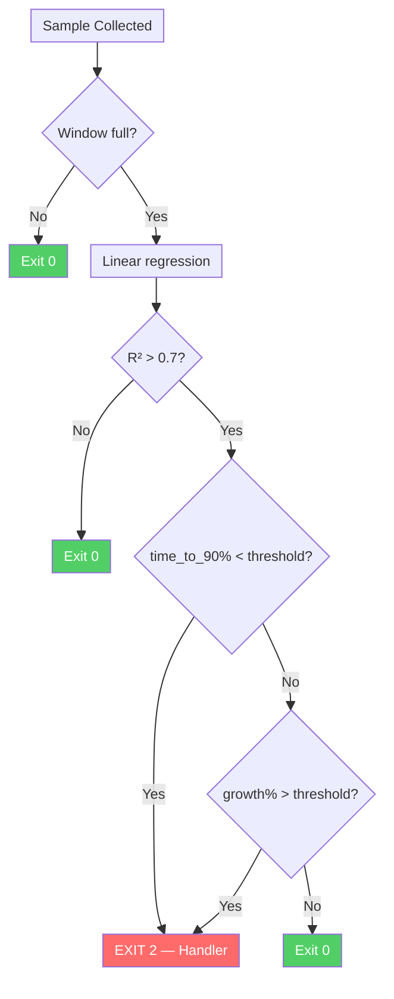

#### End-to-End Sequence

```mermaid
sequenceDiagram
    participant Monit
    participant Checker as Checker<br/>(memory_gradual_check.py)
    participant State as State File<br/>(/var/run/*.json)
    participant Handler as Handler<br/>(memory_gradual_handler.py)
    participant Syslog as Syslog<br/>(/var/log/syslog)

    Note over Monit,Syslog: Window Collection Phase (e.g. 2 hours for short)

    loop Every N cycles (5 min / 60 min / 8 hr)
        Monit->>Checker: Execute check --scale {scale}
        Checker->>Checker: Collect system memory (psutil)
        Checker->>Checker: Enumerate processes + container cgroups
        Checker->>State: Load state (or create if first run)
        Checker->>State: Append sample to sliding windows
        alt Window NOT full (still collecting)
            Checker->>State: Save updated state
            Checker-->>Monit: Exit 0 (normal)
        else Window FULL — run detection
            Checker->>Checker: Linear regression → slope, R²
            alt R² > 0.7 AND (time_to_90 < threshold OR growth% > threshold)
                Note over Checker: DETECTION TRIGGERED
                Checker->>State: Save state (for handler to read)
                Checker-->>Monit: Exit 2 (detection!)
                Monit->>Handler: Execute handler --scale {scale}
                Handler->>State: Load state file
                Handler->>Handler: Per-process regression (identify growth contributors)
                Handler->>Handler: Per-container regression (identify growing containers)
                Handler->>Handler: Get current top processes (psutil snapshot)
                Handler->>Handler: Get current containers (docker stats)
                Handler->>Syslog: Log detection header + memory stats
                Handler->>Syslog: Log growth contributors + top consumers
                Handler->>Syslog: Log container summary
                Handler->>State: DELETE state file (fresh window on next cycle)
                Handler-->>Monit: Exit 0
                Note over Checker: Next run creates fresh state → new window begins
            else No detection
                Checker->>State: Save updated state
                Checker-->>Monit: Exit 0 (normal)
            end
        end
    end
```

**Detection algorithm:**

**Note:** Detection triggers on system-wide memory growth (total RAM usage trending toward OOM). Per-process memory is tracked only for attribution—to identify which process caused the growth after detection fires.

1. **Data collection** (every check interval):
   - Collect system memory: `psutil.virtual_memory().used`
   - Collect processes meeting criteria: RSS >0.5% of total RAM (max 100 processes)
   - Collect container memory: dynamically discover running containers via `docker ps`, then map each process to its container by reading `/proc/<pid>/cgroup`
   - Append to sliding windows (system + filtered per-process + per-container)
   - Rationale: Self-scales to RAM size (e.g., >156 MB on 31 GB system), caps storage at ~100 processes. Dynamic container discovery adapts to any SONiC deployment without hardcoded container lists.

2. **Regression calculation** (when window is full):
   - Run linear regression on system memory samples using Python stdlib (`statistics.linear_regression`, Python 3.10+, with manual fallback for older interpreters; no NumPy/SciPy)
   - Calculate system slope (MB/min) and R² (goodness of fit)
   - Store all process memory windows for handler analysis

3. **Threshold checks**:
   ```
   headroom = (total_ram * 0.9) - current_memory
   time_to_90pct = headroom / slope  (in minutes)
   
   # Growth measured as % of FREE memory (self-scaling)
   free_memory = total_ram - current_memory
   growth_mb = current_memory - baseline_memory
   percent_of_free = (growth_mb / free_memory) * 100
   
   # Detection logic: High confidence trend (R² > 0.7) AND (time urgent OR growth significant)
   time_triggered = (time_to_90pct < threshold_time)
   growth_triggered = (percent_of_free > threshold_percent)
   
   if (r_squared > 0.7 AND (time_triggered OR growth_triggered)):
       trigger alert (exit code 2)
   ```

4. **Alert thresholds per time scale**:
   - **Short (2h)**: time_to_90% < 6 hours, growth > 1% of free memory
   - **Medium (24h)**: time_to_90% < 3 days, growth > 5% of free memory
   - **Long (7d)**: time_to_90% < 21 days, growth > 5% of free memory
   
   **Growth calculation**: Growth is measured as percentage of **free memory** (not total RAM). This makes the threshold self-scaling - on a system with less free memory, smaller absolute growth triggers detection, which is appropriate since the system is closer to exhaustion.

**Process attribution:** When alert fires, handler:
1. Reads per-process and per-container memory windows from state file
2. Runs linear regression on each to calculate slope and R²
3. Collects current state:
   - Process memory via `psutil` (top 15 by RSS)
   - Container memory via `docker stats --no-stream --format` (top 15, 10s timeout; falls back to process-only on failure)
4. Filters contributors using criteria:
   - Contribution threshold: Growth ≥ 10% of system growth (self-scaling)
   - Consistent trend: R² > 0.5 (filters spikes/oscillations)
5. Builds output lists (5-10 items each):
   - **Processes**: Growth contributors first (with growth stats + R²), then top consumers by RSS
   - **Containers**: Growth contributors first (with growth stats + R²), then top consumers
6. Reports each process on separate line with PID, name, memory, cmdline
7. Reports all containers on one line (semicolon-separated)

**Process tracking:** Processes are tracked by `pid:name` key (e.g., `"1234:orchagent"`), so distinct PIDs sharing a common name (e.g., multiple `python3` processes) are tracked independently. Entries for dead PIDs accumulate `None` values and are pruned once the entire window is `None`.

**Process restart handling:** If a process restarts during the window, the old PID's entry gets `None` appended (process gone) and the new PID starts a fresh entry padded with `None`. Neither entry mixes data from the other. The R² > 0.5 filter requires at least 3 valid samples, so short-lived entries are naturally excluded from attribution.

**Resource overhead:** Measured on Cisco 8000:

| Operation | Time | Frequency |
|-----------|------|-----------|
| System memory (`virtual_memory()`) | ~0.1 ms | Every sample |
| Process enumeration + filter | ~140 ms | Every sample |
| **CPU impact (short, every 5 min)** | **0.047%** | Highest frequency |
| CPU impact (medium, every 60 min) | 0.004% | |
| CPU impact (long, every 8 hours) | Negligible | |
| State file I/O | ~8 KB (typical) | Every sample |

Per-process collection is done at every sample (not deferred to handler) because attribution requires historical windows to calculate per-process slope and R². A single snapshot at alert time cannot distinguish a process that grew by +1200 MB from one that always uses 1200 MB.

### State Format

**File:** `/var/run/memory_gradual_{short,medium,long}.json`

**Storage location:** `/var/run` (tmpfs, RAM-backed). Typical total ~25 KB across all three files.

**Purpose:** State file stores sliding windows of memory samples, bridging the checker and handler components:
- **Checker (writer)**: Collects and appends system memory + per-process/per-container samples at each check interval
- **Handler (reader)**: When detection fires, reads windows to run per-process/per-container regression and identify growth contributors
- **Detection vs Attribution**: `system_memory_window` triggers alerts (system-wide trend), `tracked_processes`/`tracked_containers` identify culprits (attribution)

```json
{
  "window_type": "short",
  "window_size": 24,
  "window_description": "2 hours",
  "sample_count": 18,
  
  "system_memory_window": [4400.0, 4450.0, 4500.0, ..., 5200.0],
  
  "tracked_processes": {
    "1234:syncd": [1200.0, 1210.0, 1220.0, ..., 1320.0],
    "5678:bgpd": [850.0, 852.0, 855.0, ..., 880.0],
    "2345:orchagent": [320.0, 322.0, 325.0, ..., 350.0],
    "3456:swss": [260.0, 261.0, 262.0, ..., 270.0],
    "4567:pmon": [235.0, 235.0, 236.0, ..., 238.0],
    "...additional processes...": []
  },
  
  "tracked_containers": {
    "syncd": [1250.0, 1260.0, 1270.0, ..., 1370.0],
    "bgp": [200.0, 201.0, 202.0, ..., 210.0],
    "pmon": [450.0, 451.0, 452.0, ..., 460.0],
    "database": [110.0, 111.0, 111.0, ..., 115.0],
    "...additional containers...": []
  },
  
  "baseline_snapshot": {
    "timestamp": "2026-02-06T10:00:00.123456",
    "memory_mb": 4400.0,
    "total_ram_mb": 20000.0
  },
  
  "last_regression": {
    "slope_mb_per_min": 3.42,
    "r_squared": 0.87,
    "calculated_at_sample": 18
  }
}
```

**Field Descriptions:**
- `window_type`: Time scale identifier ("short", "medium", or "long")
- `window_size`: Maximum number of samples to store (24/24/21 for short/medium/long)
- `sample_count`: Current number of samples collected (1 to window_size)
- `system_memory_window`: Array of system-wide memory readings (MB). Used for system-level regression.
- `tracked_processes`: Per-process memory windows for processes >0.5% of total RAM (max 100). Keyed by `pid:name` (e.g., `"1234:orchagent"`) so distinct PIDs with the same comm name are tracked independently. Each process has array of memory readings (MB) over the window; `null` entries indicate the process was not running at that sample. Entries that are entirely `null` (process gone for full window) are pruned. Used by handler to calculate per-process regression and filter false positives.
- `tracked_containers`: Per-container memory windows collected via `docker stats`. Each container has array of memory readings (MB) over the window. Used by handler to calculate per-container regression and identify containers with sustained growth.
- `baseline_snapshot`: Metadata captured at window start (sample 1)
  - `timestamp`: When window started
  - `memory_mb`: System memory at baseline
  - `total_ram_mb`: Total system RAM (for calculations)
- `last_regression`: Cached system-level regression results (updated every 5-10 samples to reduce CPU)
  - `slope_mb_per_min`: System memory growth rate from linear regression
  - `r_squared`: Confidence metric (0.0-1.0) for system trend
  - `calculated_at_sample`: Which sample number regression was last calculated

**Storage size (measured on Cisco 8000):**
- Typical (8 processes, 15 containers): ~8 KB per file, **~25 KB total**
- Worst case (100 processes, 20 containers): ~40 KB per file, ~120 KB total
- File is reset when window fills and detection fires

**Lifecycle:** Created on first run, updated at each check interval, reset when window fills and detection fires.

#### Enabling and Disabling

The feature is enabled by default when the monit stanzas are present in `/etc/monit/conf.d/sonic-host`. Operators can disable it at runtime or persistently.

**Runtime (non-persistent across reboot):**

Disable all memory gradual checks without removing the configuration:

```bash
sudo monit unmonitor memory_gradual_short
sudo monit unmonitor memory_gradual_medium
sudo monit unmonitor memory_gradual_long
```

To disable only a single scale (e.g., short window):

```bash
sudo monit unmonitor memory_gradual_short
```

Re-enable:

```bash
sudo monit monitor memory_gradual_short
sudo monit monitor memory_gradual_medium
sudo monit monitor memory_gradual_long
```

Verify current status:

```bash
sudo monit summary
```

Expected output when disabled:

```
Program 'memory_gradual_short'      Not monitored
Program 'memory_gradual_medium'     Not monitored
Program 'memory_gradual_long'       Not monitored
```

**Persistent (survives reboot):**

Comment out the relevant `check program` stanzas in `/etc/monit/conf.d/sonic-host` and reload:

```bash
sudo vi /etc/monit/conf.d/sonic-host    # comment out memory_gradual_* stanzas
sudo monit reload
```

### Example Flows

#### Memory Pattern Graphs

The following graphs visualize four representative memory patterns. All examples use a 20 GB RAM system at ~40% baseline usage, with 90% threshold = 18 GB. Flows 1–2 are sustained increases (detected); Flows 3–4 are benign patterns (not detected).

**Flow 1 — Rapid memory growth (Short window: 2 hours, 24 samples every 5 min)**

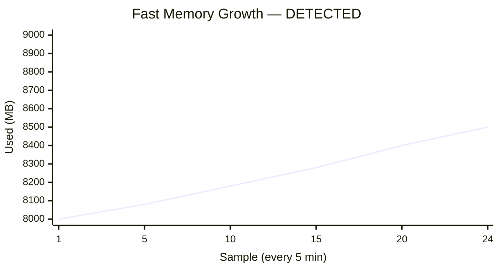

| Metric | Value | Threshold | Result |
|--------|-------|-----------|--------|
| R² | 0.92 | > 0.7 | PASS |
| Growth % of free | 4.3% (500 MB / 11500 MB free) | > 1% (short) | PASS |
| Time to 90% | 37 hours | < 6 hours | — |
| **Decision** | R² pass AND growth pass | | **EXIT 2 → Handler** |

**Flow 2 — Gradual memory growth (Long window: 7 days, 21 samples every 8 hours)**

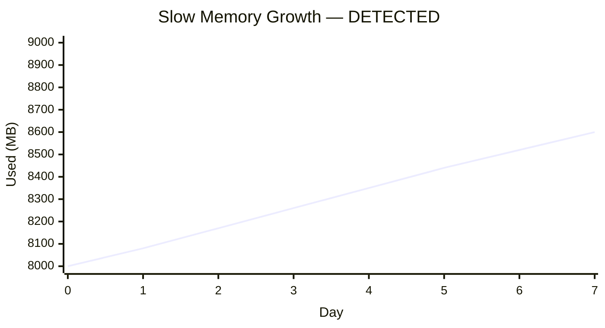

| Metric | Value | Threshold | Result |
|--------|-------|-----------|--------|
| R² | 0.94 | > 0.7 | PASS |
| Growth % of free | 5.3% (600 MB / 11400 MB free) | > 5% (long) | PASS |
| Time to 90% | 77 days | < 21 days | — |
| **Decision** | R² pass AND growth pass | | **EXIT 2 → Handler** |

**Flow 3 — Oscillation (Medium window: 24 hours, 24 samples every 60 min)**

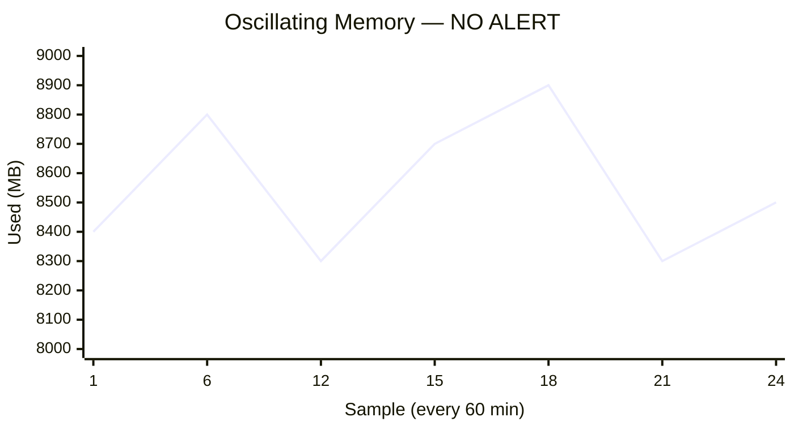

| Metric | Value | Threshold | Result |
|--------|-------|-----------|--------|
| R² | 0.15 | > 0.7 | **FAIL — stops here** |
| **Decision** | R² gate blocks | | **EXIT 0 — No alert** |

**Flow 4 — Spike then recovery (Short window: 2 hours, 24 samples every 5 min)**

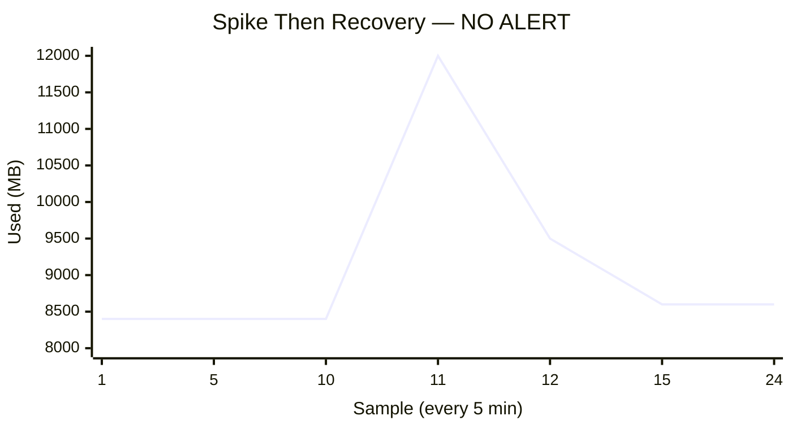

| Metric | Value | Threshold | Result |
|--------|-------|-----------|--------|
| R² | 0.35 | > 0.7 | **FAIL — stops here** |
| **Decision** | R² gate blocks | | **EXIT 0 — No alert** |

> **Key takeaway:** Flows 1–2 show consistent linear trends (high R²) that pass the confidence gate, then trigger on growth%. Flows 3–4 produce low R² because the data doesn't fit a straight line — the R² gate is the primary defense against false positives from normal memory fluctuations.

#### R² Behavior Across Different Memory Patterns

Real-world memory growth is rarely a perfectly straight line. The following scenarios show how R² behaves with realistic noise patterns. The key insight is that R² measures *overall linear trend confidence* — minor dips and jitter don't break it, but sustained non-linear behavior does.

**Patterns that PASS the R² > 0.7 gate (detection triggers):**

*Noisy growth — small dips within an upward trend (R² ≈ 0.85):*

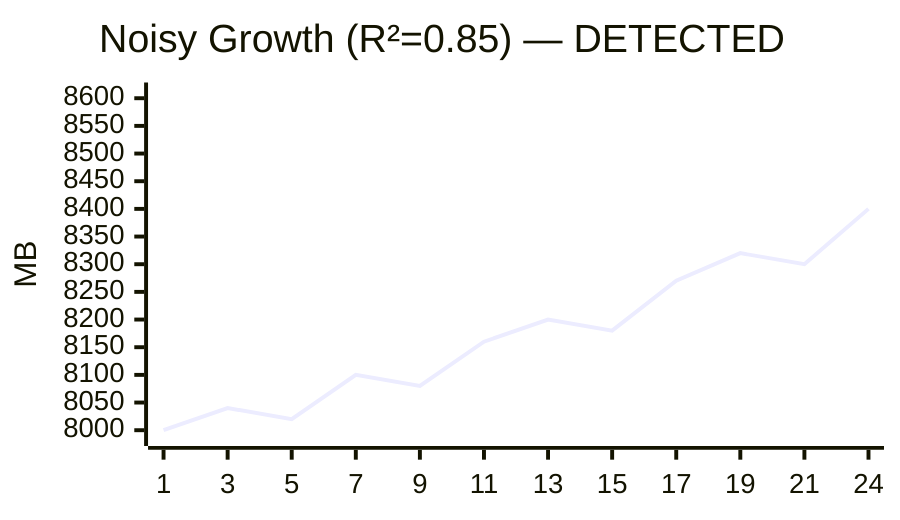

*Staircase growth — flat periods then jumps (R² ≈ 0.92):*

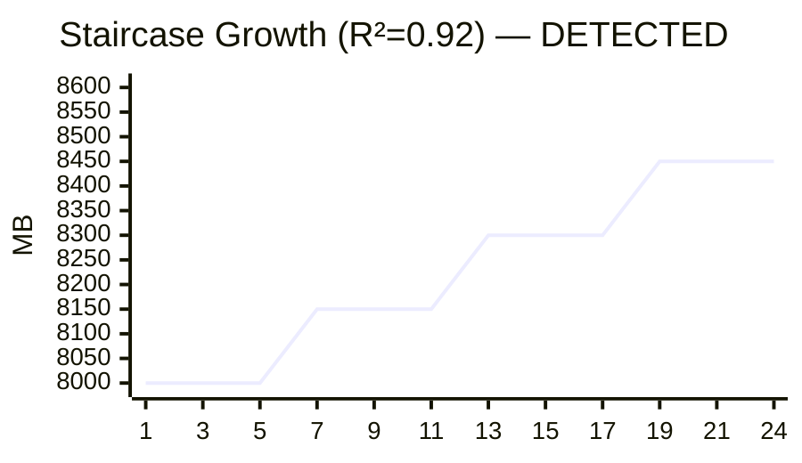

*Slow acceleration — gentle curve that's still mostly linear (R² ≈ 0.95):*

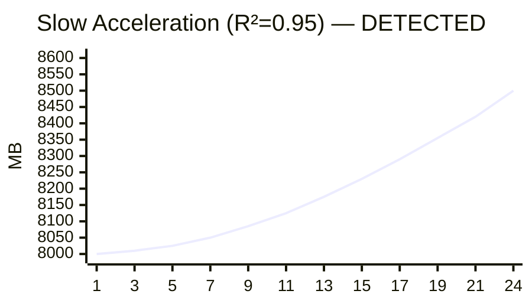

**Patterns that FAIL the R² > 0.7 gate (no false alert):**

*Sawtooth — periodic allocation and release (R² ≈ 0.10):*

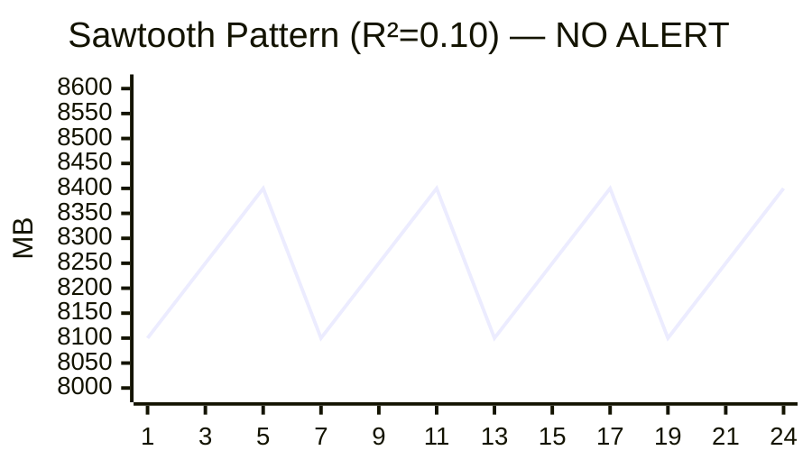

> Net growth is zero — memory cycles between 8100–8400 MB repeatedly. The linear regression line is nearly flat, so R² is very low. This is typical of periodic batch jobs or cache eviction cycles.

*Plateau — fast rise then stable (R² ≈ 0.45):*

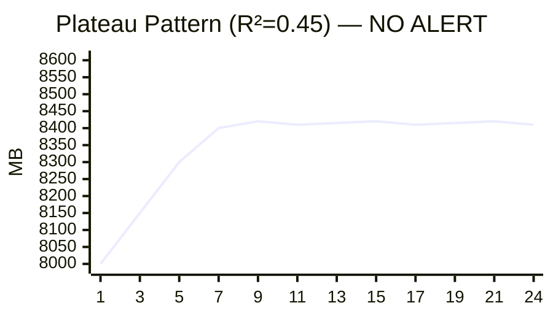

> **Why not detected despite +400 MB growth?** The growth% gate (3.5% > 1%) would pass, BUT R² = 0.45 < 0.7 blocks the alert first. R² is low because the data is not linearly increasing — it rises steeply in samples 1–4 then flattens for samples 5–24. A straight-line fit is a poor model for this shape. This is the correct behavior: a one-time legitimate increase (e.g., new routes loaded, cache warming after restart) is not a sustained trend. A concerning memory increase would keep growing through the entire window, producing high R².

*Mean-reverting — grows then falls back to baseline (R² ≈ 0.05):*

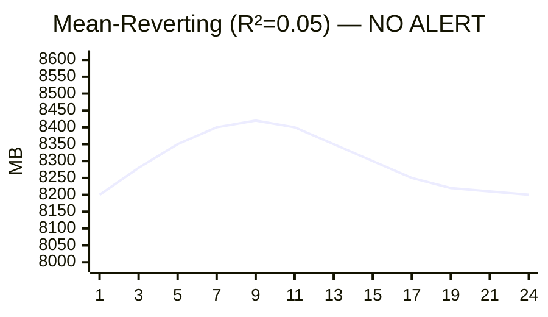

> Memory rises to a peak then returns to the starting point. Net growth is near zero and the symmetric hump produces an almost-flat regression line. Typical of temporary workload spikes that the OS reclaims naturally.

**Why R² is the first gate (evaluated before growth%):** Growth percentage alone cannot distinguish between a one-time jump that stabilized (plateau — benign) and continuous growth that will reach OOM. R² measures whether memory is *continuously increasing across the entire window*. Only patterns with sustained linear growth produce R² > 0.7, which is why R² is checked first — it filters out all benign patterns before growth% or time-to-90% are even evaluated.

#### Detailed Flow Analysis

**Flow 1: Rapid Memory Growth Detection (Short Window)**

```
System: 20 GB RAM, currently at 8000 MB (40%)
Window: Short (2 hours, 24 samples every 5 min)

Sample 1:  Memory = 8000 MB → Baseline captured, window = [8000]
Sample 5:  Memory = 8080 MB → window = [8000, 8020, 8040, 8060, 8080]
Sample 12: Memory = 8280 MB → window = [8000...8280]
Sample 24: Memory = 8500 MB → Window full [8000...8500]

  Regression:
    Slope = 4.3 MB/min (+260 MB/hour)
    R² = 0.92 (high confidence)
  
  Thresholds check:
    Headroom = 18000 - 8500 = 9500 MB
    Time to 90% = 9500 / 4.3 = 2209 min = 37 hours
    
    Free memory = 20000 - 8500 = 11500 MB
    Growth = 8500 - 8000 = 500 MB
    Growth as % of free = (500 / 11500) * 100 = 4.3%
    
    R² > 0.7? YES (0.92)
    Time triggered: 37 hours < 6 hours? NO
    Growth triggered: 4.3% > 1% (short threshold)? YES
    
    R² > 0.7 AND (time OR growth)? YES (0.92 > 0.7 AND growth triggered)
    → Exit code 2 → Handler logs rapid memory growth detected
  
  Process attribution (contribution-based filtering):
    System growth: +500 MB
    Min contribution threshold: 500 × 10% = 50 MB
    
    syncd:     1200 → 1420 MB (+220 MB, R² = 0.88) ✓ Reports (220 > 50, high R²)
    orchagent: 320 → 500 MB (+180 MB, R² = 0.91) ✓ Reports (180 > 50, high R²)
    bgp:       850 → 880 MB (+30 MB, R² = 0.35) ✗ Filtered (30 < 50)
    swss:      260 → 275 MB (+15 MB, R² = 0.72) ✗ Filtered (15 < 50)
```
**Result:** Rapid memory growth (260 MB/hour) caught in 2 hours

**Flow 2: Gradual Memory Growth Detection (Long Window)**

```
System: 20 GB RAM, currently at 8000 MB (40%)
Window: Long (7 days, 21 samples every 8 hours)

Sample 1:  Memory = 8000 MB (Day 0)
Sample 7:  Memory = 8200 MB (Day 2)
Sample 14: Memory = 8400 MB (Day 4)
Sample 21: Memory = 8600 MB (Day 7) → Window full

  Regression:
    Slope = 0.063 MB/min (+3.7 MB/hour, +86 MB/day)
    R² = 0.94 (very high confidence - clear linear trend)
  
  Thresholds check:
    Headroom = 18000 - 8600 = 9400 MB
    Time to 90% = 9400 / 0.063 = 149206 min = 77 days
    
    Free memory = 20000 - 8600 = 11400 MB
    Growth = 8600 - 8000 = 600 MB
    Growth as % of free = (600 / 11400) * 100 = 5.3%
    
    R² > 0.7? YES (0.94)
    Time triggered: 77 days < 21 days? NO
    Growth triggered: 5.3% > 5% (long threshold)? YES
    
    R² > 0.7 AND (time OR growth)? YES (0.94 > 0.7 AND growth triggered)
    → Exit code 2 → Handler logs gradual memory growth detected
  
  Process attribution (contribution-based filtering):
    System growth: +600 MB
    Min contribution threshold: 600 × 10% = 60 MB
    
    syncd: 1200 → 1580 MB (+380 MB, R² = 0.96) ✓ Reports (380 > 60, very high R²)
    bgp:   850 → 1010 MB (+160 MB, R² = 0.94) ✓ Reports (160 > 60, very high R²)
    pmon:  235 → 260 MB (+25 MB, R² = 0.85) ✗ Filtered (25 < 60)
```
**Result:** Slow persistent growth (86 MB/day) caught in 7 days despite 77-day time-to-OOM

**Flow 3: Oscillating Memory (No False Alert)**

```
System: 20 GB RAM, at ~40% usage, cache fluctuations
Window: Medium (24 hours, 24 samples every 60 min)

Sample 1:  Memory = 8400 MB
Sample 6:  Memory = 8800 MB
Sample 12: Memory = 8300 MB
Sample 18: Memory = 8900 MB
Sample 24: Memory = 8500 MB → Window full

  Regression:
    Slope = 0.07 MB/min (very small)
    R² = 0.15 (low confidence - data is scattered, not linear)
  
  Thresholds check:
    Time to 90% = very large (slow slope)
    
    Free memory = 20000 - 8500 = 11500 MB
    Growth = 8500 - 8400 = 100 MB
    Growth as % of free = (100 / 11500) * 100 = 0.9%
    
    R² > 0.7? NO (0.15)
    
    R² > 0.7 AND (time OR growth)? NO (0.15 < 0.7)
    → Exit code 0 → No alert (normal oscillation)
```
**Result:** Normal memory fluctuation (cache churn) does not trigger false alert due to low R²

**Flow 4: Spike Then Recovery (No False Alert)**

```
System: 20 GB RAM, at ~40% usage, config reload causes temporary spike
Window: Short (2 hours, 24 samples every 5 min)

Sample 1-10: Memory steady at 8400 MB (50 min)
Sample 11:   Memory spikes to 12000 MB (config reload)
Sample 12-24: Memory drops back to 8600 MB (70 min)

  Regression:
    Slope = 1.7 MB/min (small positive slope)
    R² = 0.35 (low confidence - spike creates non-linear pattern)
  
  Thresholds check:
    Free memory = 20000 - 8600 = 11400 MB
    Growth = 8600 - 8400 = 200 MB
    Growth as % of free = (200 / 11400) * 100 = 1.8%
    
    R² > 0.7? NO (0.35)
    
    R² > 0.7 AND (time OR growth)? NO (0.35 < 0.7)
    → Exit code 0 → No alert (transient spike, not sustained growth)
```
**Result:** Temporary spike filtered out by low R² and low net growth

### Output Format

**Log format:** Structured syslog entries with essential information for investigation.

```
INFO memory_gradual_handler: Gradual memory increase detected (window: 24 hours)
INFO memory_gradual_handler:   Current: 8800MB used, 11200MB free (44.0%) ; Growth: 4400MB -> 8800MB (+4400MB, +39.3% of free mem), time to 90%: 2.0 days
INFO memory_gradual_handler:   Memory-consuming processes:
INFO memory_gradual_handler:     #1 PID:123 orchagent - +1330MB (+416%) - /usr/bin/orchagent -d
INFO memory_gradual_handler:     #2 PID:456 syncd - +2200MB (+183%) - /usr/bin/syncd -u -s
INFO memory_gradual_handler:     #3 PID:789 bgpd - 800MB (4.0%) - /usr/lib/frr/bgpd
INFO memory_gradual_handler:     #4 PID:234 dockerd - 350MB (1.8%) - /usr/bin/dockerd -H unix://
INFO memory_gradual_handler:     #5 PID:567 redis-server - 320MB (1.6%) - /usr/bin/redis-server
INFO memory_gradual_handler:   Memory-consuming containers: syncd: +2200MB (+176%); swss: +1350MB (+450%); bgp: 680MB (3.4%); pmon: 450MB (2.3%); database: 160MB (0.8%)
```

**Field explanations:**
- **Line 1**: Detection header with window type (2 hours/24 hours/7 days)
- **Line 2**: System-level summary
  - Current memory (used, free, percentage)
  - Growth over window (baseline → current, absolute, percentage of free memory)
  - Time to 90%: Predicted time until reaching 90% threshold
- **Line 3+**: Memory-consuming processes (each on separate line)
  - **Growth contributors** (first): Processes with ≥10% of system growth AND R² > 0.5
    - Shows: PID, name, growth (absolute + percentage), command line
  - **Top consumers** (fill to 5-10): Largest processes by current RSS
    - Shows: PID, name, current memory (absolute + percentage), command line
- **Last line**: Memory-consuming containers (all on one line, semicolon-separated)
  - Same ordering: growth contributors first, then top consumers
  - Shows: name, memory (absolute + percentage) or growth stats if contributor

**Output sizing:** 5-10 processes, 5-10 containers (min 5 each, max 10 each)

**Total log overhead:** 4+ lines per detection (header + summary + process header + N processes + containers)

### CPU Monitoring Enhancement

When existing monit CPU threshold is breached, log detailed process-level CPU information:
- Top CPU-consuming processes with usage percentages
- Process command lines for identification
- CPU usage distribution across processes

Implementation: Handler script triggered by existing monit CPU check, logs to syslog (INFO level).

**Output Format:**

```
INFO cpu_threshold_check: CPU usage user=92.5% system=85.3% exceeds threshold 90%. Top 5 CPU consumers:
INFO cpu_threshold_check:   #1 PID:1234 orchagent - CPU:45.2% MEM:450MB - /usr/bin/orchagent
INFO cpu_threshold_check:   #2 PID:5678 syncd - CPU:38.5% MEM:380MB - /usr/bin/syncd
INFO cpu_threshold_check:   #3 PID:2345 bgpd - CPU:12.3% MEM:250MB - /usr/lib/frr/bgpd
INFO cpu_threshold_check:   #4 PID:3456 python3 - CPU:8.7% MEM:180MB - /usr/bin/portsyncd
INFO cpu_threshold_check:   #5 PID:4567 redis-server - CPU:6.2% MEM:320MB - /usr/bin/redis-server
INFO cpu_threshold_check: Container CPU: swss(52.3%), syncd(41.2%), bgp(15.8%), database(8.5%)
```

## Testing Considerations

### Test Strategy

The testing approach follows a phased methodology to ensure comprehensive validation before production deployment:

**Phase 1: Testbed Setup**
Bring up spytest testbed environment to provide a controlled testing infrastructure that mirrors production topology and configuration.

**Phase 2: Unit, Functional, and Integration Testing**
All tests run under --test-mode with the short scale for rapid validation. A memory controller process deployed on the DUT allocates bytearrays on demand to produce real, measurable memory growth.

Test acceleration: The --test-mode flag activates SCALE_CONFIG_TEST_MODE with accelerated sampling intervals (1/2/5 min) and reduced window sizes (10 samples each). Test-mode windows complete in 10/20/50 minutes respectively instead of 2h/24h/7d. DUT injection tests use a 15-second injection interval with monit running every 15-second daemon cycles. To avoid duplicate detections during testing, enable only one window check at a time in monit configuration by commenting out the other two.

**Phase 3: System-Level Validation** Execute Jenkins ring 3 run, followed by syslog validation to verify:

- Detection events are logged with correct format and detail level
- No unexpected errors or warnings in system logs

**Phase 4: Soak Testing Build image with all changes integrated and deploy to soak test environment for extended validation:**

- Monitor system behavior over multiple days to verify stability
- Validate detection across actual operational time scales (2 hours, 24 hours, 7 days)
- Confirm no resource leaks or performance degradation from monitoring itself
- Verify detection accuracy and false positive rate in real-world conditions

## Future Enhancements

- Store detection events and historical data in Redis STATE_DB for telemetry
- Integrate with SONiC system health framework for early warnings
- Use cgroups to limit monit resource usage and prevent memory pressure from monitoring
- Extend `procdockerstatsd` to collect richer per-container metrics (memory high-watermarks, RSS/VSZ breakdowns, restart counts) in the existing `DOCKER_STATS` and `PROCESS_STATS` STATE_DB tables, giving operators more complete real-time snapshots for telemetry dashboards without adding a new daemon (note: `procdockerstatsd` captures point-in-time snapshots every 2 minutes and wipes previous entries in STATE_DB, so it is complementary to — not a substitute for — the regression-based detection which requires multi-hour/multi-day sliding windows with history)
- Write structured detection events (alerts, threshold breaches, growth attribution) into STATE_DB so that the telemetry agent can stream them over gNMI/gRPC and internal applications can query them directly from Redis without parsing log files; requires scoping which fields to persist, retention depth (latest event vs. rolling history), and table schema
- Extend handlers to take action on memory grown critical