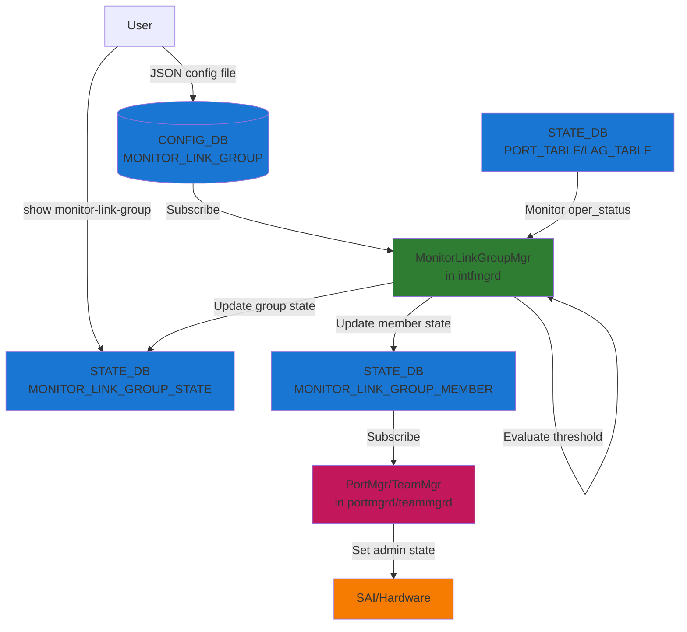
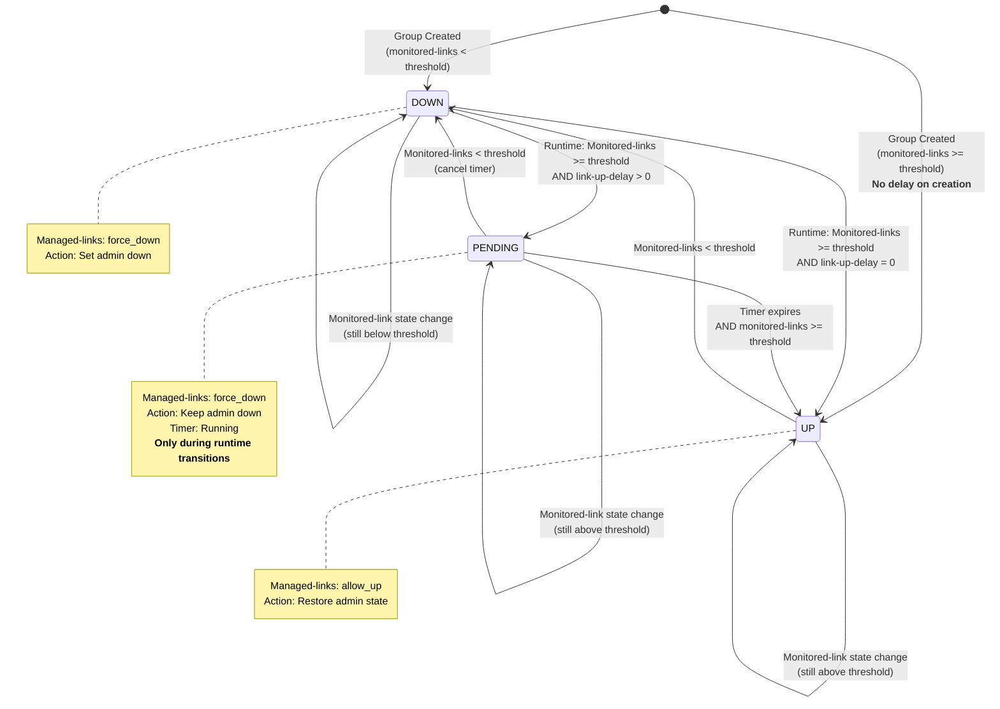
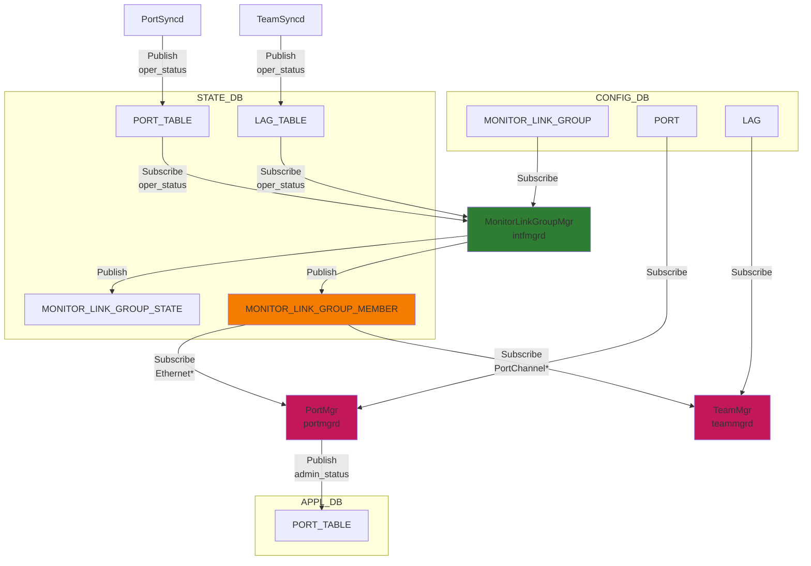
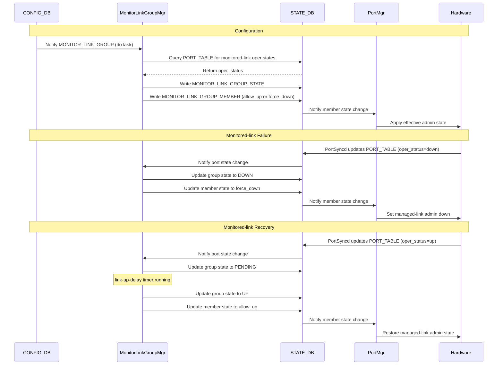

# Monitor Link Group High-Level Design

## Table of Content

- [1. Revision](#1-revision)
- [2. Scope](#2-scope)
- [3. Definitions/Abbreviations](#3-definitionsabbreviations)
- [4. Requirements](#4-requirements)
- [5. Architecture Design](#5-architecture-design)
- [6. High-Level Design](#6-high-level-design)
- [7. SAI API](#7-sai-api)
- [8. Configuration and Management](#8-configuration-and-management)
- [9. Warmboot and Fastboot Design Impact](#9-warmboot-and-fastboot-design-impact)
- [10. Restrictions/Limitations](#10-restrictionslimitations)
- [11. Testing Requirements/Design](#11-testing-requirementsdesign)


## 1. Revision

| Rev | Date       | Author           | Change Description |
|-----|------------|------------------|--------------------|
| 0.1 | 2026-04-28 | Satishkumar Rodd | Initial version    |
| 0.2 | 2026-05-12 | Satishkumar Rodd | Rename uplinks/downlinks to monitored-links/managed-links (R-4); drop empty-string defaults on leaf-lists (R-7); extend `must` constraint to bound `min-monitored-links` by `count(monitored-links)` (R-10) |
| 0.3 | 2026-05-12 | Satishkumar Rodd | Add dependency-cycle rejection between groups (R-6); state-transition tracking in STATE_DB (`last_state_change_*`, `pending_start_time`, `total_transitions`); `show monitor-link` renders last-change / counters / PENDING progress; `show interface status` and `show interface description` render `error-down (mlg)` for MLG-held interfaces |


## 2. Scope

This document describes the Monitor Link Group feature in SONiC. The feature provides link state tracking functionality that allows managed-link interfaces to be automatically disabled when a specified number of monitored-link interfaces go down, preventing traffic black-holing in network topologies where managed-links depend on monitored-links for connectivity.

```
                    ┌───────────────────────────┐
                    │       Router / Spine      │
                    └─────┬──────────────┬──────┘
                          ↕              ↕
                     Ethernet64    Ethernet72
                      [monitored-link]      [monitored-link]
                          │              │
    ┌─────────────────────┴──────────────┴───────────────────┐
    │                      SONiC Switch                      │
    │  ┌──────────────────────────────────────────────────┐  │
    │  │              Monitor Link Group                  │  │
    │  │  monitored-links:     Ethernet64, Ethernet72             │  │
    │  │  managed-links:   Ethernet80, Ethernet88             │  │
    │  │  min-monitored-links: 2   link-up-delay: 10 sec          │  │
    │  └──────────────────────────────────────────────────┘  │
    └─────────────────────┬──────────────────┬───────────────┘
                          ↕                  ↕
                     Ethernet80        Ethernet88
                     [managed-link]        [managed-link]
                          │                  │
              ┌───────────┴───────┐  ┌───────┴───────────┐
              │     Server 1      │  │     Server 2      │
              └───────────────────┘  └───────────────────┘
```

## 3. Definitions/Abbreviations

| Term | Definition |
|------|------------|
| Monitor Link Group | A logical grouping of monitored-link and managed-link interfaces with defined tracking behavior |
| Monitored-link | An interface whose operational state is monitored |
| Managed-link | An interface whose administrative state is controlled based on monitored-link status |
| min-monitored-links | Minimum number of monitored-links that must be operational for the group to be considered "up" |
| link-up-delay | Time delay (in seconds) before bringing managed-links up after monitored-link threshold is met |

## 4. Requirements

### 5.1 Functional Requirements

1. Support grouping of interfaces into monitor link groups with monitored-links and managed-links
2. Monitor operational status of monitored-link interfaces
3. Automatically control managed-link interface states based on monitored-link availability
4. Support configurable minimum monitored-link threshold (min-monitored-links)
5. Support configurable link-up-delay to prevent managed-link churn from monitored-link flaps
6. Allow interfaces to belong to multiple monitor link groups in any role combination — an interface may be an monitored-link in one group and a managed-link in another simultaneously
7. Provide operational status visibility through show commands and STATE_DB
8. Support both physical Ethernet interfaces and PortChannel interfaces

### 5.2 Configuration Requirements

1. JSON configuration file format for monitor link groups (via `config load`)
2. YANG model validation on `config load` / `config reload`

## 5. Architecture Design

The Monitor Link Group feature is implemented within the existing SONiC architecture without requiring architectural changes. The feature integrates with:

- **CONFIG_DB**: Stores monitor link group configuration
- **STATE_DB**: Stores operational state of groups and member interfaces
- **MonitorLinkGroupMgr (SWSS)**: Sibling `Orch` in `intfmgrd`; owns the monitor-link state machine
- **PortMgr/TeamMgr**: Consumes managed-link state changes to control interface admin status

### 6.1 System Architecture



### 6.2 State Machine Diagram



## 6. High-Level Design

### 7.2 Modified Components

Built-in SONiC feature in the SWSS container.

**Repositories:**
- sonic-swss-common: STATE_DB table-name macros
- sonic-swss: MonitorLinkGroupMgr, PortMgr, TeamMgr
- sonic-utilities: CLI show commands
- sonic-yang-models: YANG model definition

**Modules:**
- `cfgmgr/monitorlinkgroupmgr.cpp` + `.h`: Core monitor-link state machine (new)
- `cfgmgr/intfmgrd.cpp`: Process loop — adds `MonitorLinkGroupMgr` to `cfgOrchList`
- `cfgmgr/portmgr.cpp` + `.h`: Ethernet managed-link admin-state control
- `cfgmgr/teammgr.cpp` + `.h`: PortChannel managed-link admin-state control
- `common/schema.h`: `STATE_MONITOR_LINK_GROUP_STATE_TABLE_NAME` and `STATE_MONITOR_LINK_GROUP_MEMBER_TABLE_NAME` macros
- `show/monitor_link.py`: CLI show commands
- `show/main.py`: CLI show command registration
- `yang-models/sonic-monitor-link-group.yang`: YANG model

### 7.3 Database Schema and Daemon Interactions

This section describes the complete database schema and how different daemons interact through Redis databases.

#### 7.3.1 CONFIG_DB Schema

**Key:** `MONITOR_LINK_GROUP|<group_name>`

| Field | Type | Default | Description |
|-------|------|---------|-------------|
| monitored-links | list of interface names | — | Interfaces whose oper_status is monitored |
| managed-links | list of interface names | — | Interfaces whose admin state is controlled |
| min-monitored-links | string (integer) | "1" | Minimum monitored-links that must be operationally up |
| link-up-delay | string (seconds) | "0" | Delay before bringing managed-links up after threshold met |
| description | string | "" | Human-readable description (optional) |

#### 7.3.2 STATE_DB Schema

**Key:** `MONITOR_LINK_GROUP_STATE|<group_name>`

| Field | Values | Description |
|-------|--------|-------------|
| state | up / down / pending | Group operational state (used exclusively for `show monitor-link-group`) |
| monitored-links | comma-separated list | Configured monitored-links |
| managed-links | comma-separated list | Configured managed-links |
| link_up_threshold | string | min-monitored-links from CONFIG_DB |
| link_up_delay | string | link-up-delay from CONFIG_DB |
| description | string | Description from CONFIG_DB |
| last_state_change_from | up / down / pending | Source state of the most recent transition (absent until first runtime transition) |
| last_state_change_to | up / down / pending | Target state of the most recent transition |
| last_state_change_time | epoch seconds (string) | Time of the most recent transition |
| pending_start_time | epoch seconds (string) | Time the current PENDING window started; **set on entry to PENDING and cleared on entry to UP** so consumers never read a stale value |
| total_transitions | integer (string) | Cumulative count of state transitions; bumped on each `state` write regardless of direction (`DOWN→UP`, `UP→DOWN`, `DOWN→PENDING`, `PENDING→UP`, `PENDING→DOWN`). Groups created in their final state record 0 transitions until the first runtime change |

All transition-tracking fields are **optional**: groups that have not yet transitioned render exactly as before, preserving backward compatibility with consumers that ignore the new fields. See §6.2 for the underlying state machine.

**Purpose:** This table is used **exclusively for operational visibility** through CLI show commands. It is NOT used by any daemon for functional logic. The actual control of managed-link interfaces is performed through the `MONITOR_LINK_GROUP_MEMBER` table.

**Key:** `MONITOR_LINK_GROUP_MEMBER|<interface_name>`

| Field | Values | Description |
|-------|--------|-------------|
| state | allow_up / force_down | allow_up when all groups are UP; force_down when any group is DOWN/PENDING |
| down_due_to | comma-separated group names | Groups forcing this interface down; empty when allow_up |

**Producer:** MonitorLinkGroupMgr (intfmgrd)
**Consumer:** PortMgr (portmgrd) for Ethernet interfaces, TeamMgr (teammgrd) for PortChannel interfaces

**PORT_TABLE / LAG_TABLE** (existing tables, monitored by MonitorLinkGroupMgr)

MonitorLinkGroupMgr subscribes to `STATE_DB:PORT_TABLE` for Ethernet monitored-links and `STATE_DB:LAG_TABLE` for PortChannel monitored-links. When a change arrives, it checks whether the interface is operationally up and updates the group's monitored-link count accordingly. The specific field names used internally by SONiC to signal operational state are an implementation detail and may differ between Ethernet and PortChannel entries; the daemon handles both transparently.

**Producers:** PortSyncd / Kernel (Ethernet), TeamSyncd / Teamd (PortChannel)
**Consumer:** MonitorLinkGroupMgr

#### 7.3.3 Database Interaction Diagram



### 7.4 Threshold and State Transition Logic

```
// During group creation — link-up-delay bypassed
if (is_new_group and monitored-link_up_count >= min-monitored-links):
    group_state = UP

// During runtime transitions
else if (monitored-link_up_count >= min-monitored-links):
    if (link-up-delay > 0 and group was previously DOWN):
        group_state = PENDING
        start_delay_timer(link-up-delay)
    else:
        group_state = UP
else:
    group_state = DOWN
    cancel_delay_timer() if pending
```

Managed-link state: `should_be_up = (down_group_count == 0)`. A managed-link is forced down if ANY of its groups is DOWN or PENDING.

### 7.5 Managed-link Admin State Combination

PortMgr (Ethernet) and TeamMgr (PortChannel) apply the same truth table when combining the monitor-link signal with the operator's configured `admin_status`:

```
┌─────────────────────┬─────────────────┬──────────────────┐
│ monitor_link_state  │ config_admin_up │ Final Admin State│
├─────────────────────┼─────────────────┼──────────────────┤
│ force_down          │ up              │ DOWN             │
│ force_down          │ down            │ DOWN             │
│ allow_up            │ up              │ UP               │
│ allow_up            │ down            │ DOWN             │
└─────────────────────┴─────────────────┴──────────────────┘
```

On DEL (group deleted or interface removed): interface is restored to its configured `admin_status`. See [Appendix A](#appendix-a--portmgrteammgr-processing-detail) for full per-event processing logic.

### 7.6 Multi-Group and Cross-Role Support

An interface can belong to multiple monitor link groups, including as different roles in different groups.

**Multiple managed-link groups:**
- Managed-link is forced down if ANY group it belongs to is DOWN/PENDING
- Managed-link is allowed up only when ALL groups it belongs to are UP
- The `down_due_to` field lists all groups currently forcing the interface down

**Cross-role (monitored-link in one group, managed-link in another):**
- An interface may simultaneously be an monitored-link in group A and a managed-link in group B
- Its oper_status drives group A's threshold evaluation (monitored-link role)
- Group B's state drives its admin-state (managed-link role)
- The two roles are tracked independently; a state change in the monitored-link role does not trigger evaluation of the managed-link role, and vice versa
- An interface **cannot** be both monitored-link and managed-link within the **same** group; this is enforced at `config load` time by a YANG `must` constraint

**Dependency-cycle rejection (R-6):**
The daemon rejects group SETs that would form a recovery-dependency cycle between groups. A cycle exists when group A's monitored-link is also some group B's managed-link, and group B's monitored-link is some group A's managed-link (transitively, for chains of length > 2 as well). Allowing such a cycle would mean A's recovery waits on B coming up, while B's recovery waits on A coming up — neither group can ever leave DOWN.

- Detection runs at SET time: the daemon builds a directed dependency graph where each edge `X → Y` means "group X's recovery depends on group Y" (i.e., X has a monitored-link that is a managed-link of Y). A cycle is any strongly-connected component with more than one group, or any self-loop within a single group across roles.
- On a cycle-forming SET, the CONFIG_DB write itself succeeds (`config load -y` is intentionally permissive), but the daemon logs an error and **does not write a STATE_DB entry** for the offending group. Operators see the absence of `MONITOR_LINK_GROUP_STATE|<group>` and the `SWSS_LOG_ERROR` line as the signal.
- Removing or modifying a group such that the cycle is broken makes the previously-rejected configuration acceptable; the daemon re-evaluates on the next SET.

### 7.7 Sequence Diagram



### 7.8 Operator Workflows and Design Constraints

**In-place group update (non-destructive):**
A SET on an existing group via `config load` can be applied repeatedly with the same result. All fields (monitored-links, managed-links, min-monitored-links, link-up-delay, description) can be updated in-place. The daemon diffs the new and existing interface lists and adds/removes members incrementally. If `link-up-delay` changes while the group is PENDING, the running timer is adjusted to reflect the remaining time under the new value (or the group transitions to UP immediately if the new delay is zero or already elapsed).

**Group rename:**
Group names are CONFIG_DB keys; renaming requires a DEL of the old key followed by a SET of the new key. The DEL releases monitor-link control on all managed-links (STATE_DB member entries deleted; PortMgr/TeamMgr restores each to its configured admin state). The SET then re-evaluates the new group from scratch.

**Removing a managed-link from a DOWN group:**
When a managed-link is removed from a group that is currently DOWN/PENDING, `down_group_count` is decremented. If it reaches zero (no other groups forcing it down), the daemon writes `state=allow_up` to STATE_DB and PortMgr/TeamMgr restores the interface to its configured admin state.

**User admin-down override:**
A user setting `admin_status=down` on a managed-link takes effect unconditionally regardless of monitor-link state. When the user later sets `admin_status=up`, PortMgr/TeamMgr checks STATE_DB for any active `force_down` override and blocks the bring-up if one is present.

## 7. SAI API

No SAI API changes. The feature operates entirely in the control plane via `ip link`; existing SAI port APIs handle admin-state changes, making it ASIC- and platform-agnostic.

## 8. Configuration and Management

### 9.1 Configuration Method

**Configuration via JSON File:**

The monitor-link feature is configured through JSON configuration files loaded into CONFIG_DB. CLI commands for configuration are **not currently supported**.

**Configuration File Format:**

```json
{
    "MONITOR_LINK_GROUP": {
        "critical_links": {
            "monitored-links": ["Ethernet64", "Ethernet72"],
            "managed-links": ["Ethernet80"],
            "min-monitored-links": "2",
            "link-up-delay": "10",
            "description": "Critical monitored-link monitoring"
        }
    }
}
```

**Show Commands:**

```bash
# Show all monitor link groups
show monitor-link-group

# Show specific group
show monitor-link-group <group_name>

# Example output (UP, post-transition):
Monitor Link Group: critical_links
==================================
Description:           Critical monitored-link monitoring
State:                 UP
Monitored Up:          2/2
Min-monitored-links:   2
Link-up-delay:         10 seconds
Last change:           UP -> DOWN @ 2026-05-12 11:42:18 (4m 31s ago)
Transitions:           3
Total Interfaces:      3 (2 monitored, 1 managed)

Interfaces:
--------------------------------------------------
Interface    Link Type    Status    Reason
-----------  -----------  --------  --------
Ethernet64   monitored    UP
Ethernet72   monitored    UP
Ethernet80   managed      UP

# Example output (PENDING, mid-window):
Monitor Link Group: critical_links
==================================
State:                 PENDING
Monitored Up:          2/2
Min-monitored-links:   2
Link-up-delay:         10 seconds (elapsed: 4s, remaining: 6s)
Transitions:           5
```

**Transition tracking line semantics (PR-B):**

- `Last change:` rendered when STATE_DB has `last_state_change_*`; absent for groups that have not yet transitioned at runtime
- `Transitions:` always rendered; defaults to `0` for groups that never transitioned (transition-tracking fields absent)
- `Link-up-delay:` carries `(elapsed: Xs, remaining: Ys)` only while `state == pending` and `pending_start_time` is set. After UP, `pending_start_time` is cleared and the parenthetical disappears. If the daemon overshoots the timer (rare; load-induced jitter), the parenthetical renders `OVERDUE` instead of a negative `remaining` value

**`show interface status` / `show interface description` admin column (PR-C):**

For interfaces that MLG is actively holding down (`MONITOR_LINK_GROUP_MEMBER|<intf>.state != allow_up`), the Admin column renders `error-down (mlg)` instead of plain `down`. This distinguishes policy-driven admin-down from user-initiated admin-down or transceiver issues, so operators don't chase the wrong cause. The `(mlg)` tag names the source so future features driving admin-down through the same code path can take distinct tags rather than collapsing into a generic `error-down`. Sub-interfaces are not tracked by MLG and pass through unchanged.

**YANG Model:**

The `sonic-monitor-link-group` YANG module defines and validates the CONFIG_DB schema for the `MONITOR_LINK_GROUP` table. `config load` and `config reload` run CONFIG_DB contents through YANG validation before committing.

File: `src/sonic-yang-models/yang-models/sonic-monitor-link-group.yang`

Structure (see file for full patterns and error messages):

```yang
module sonic-monitor-link-group {
    yang-version 1.1;
    namespace "http://github.com/sonic-net/sonic-monitor-link-group";
    prefix mlg;

    import sonic-port        { prefix port; }
    import sonic-portchannel { prefix lag;  }

    revision 2026-05-12 {
        description "R-4 terminology rename; R-7 drop empty-string defaults; R-10 bound min-monitored-links by count(monitored-links).";
    }

    container sonic-monitor-link-group {
        container MONITOR_LINK_GROUP {
            list MONITOR_LINK_GROUP_LIST {
                key "group_name";

                // R-4: disjointness — same interface cannot be both monitored and managed in one group
                must "not(monitored-links[. = current()/managed-links])" {
                    error-message "An interface cannot be configured as both monitored-link and managed-link in the same group";
                }

                // R-10: min-monitored-links cannot exceed the configured monitored-link count
                must "min-monitored-links <= count(monitored-links[. != ''])" {
                    error-message "min-monitored-links must not exceed count(monitored-links)";
                }

                leaf group_name {
                    type string { length "1..128"; pattern "[a-zA-Z0-9_-]+"; }
                }

                // Union of leafref to PORT and PORTCHANNEL. Empty-string default
                // dropped per R-7: leaf-lists are optional by definition; an absent
                // entry now means "no interfaces" rather than "one empty string".
                leaf-list monitored-links {
                    type union {
                        type leafref { path /port:sonic-port/port:PORT/port:PORT_LIST/port:name; }
                        type leafref { path /lag:sonic-portchannel/lag:PORTCHANNEL/lag:PORTCHANNEL_LIST/lag:name; }
                    }
                }

                leaf-list managed-links {
                    type union {
                        type leafref { path /port:sonic-port/port:PORT/port:PORT_LIST/port:name; }
                        type leafref { path /lag:sonic-portchannel/lag:PORTCHANNEL/lag:PORTCHANNEL_LIST/lag:name; }
                    }
                }

                leaf description   { type string { length "1..255"; } }
                leaf link-up-delay { type string; default "0"; }  // numeric string; valid range 0-3600
                leaf min-monitored-links   { type string; default "1"; }  // numeric string; valid range 1-128
            }
        }
    }
}
```

## 9. Warmboot and Fastboot Design Impact

### 10.1 Warmboot and Fastboot Impact

1. **Timer Handling:** Startup delay timers are not persisted. On restart, groups re-evaluate as fresh creations: if sufficient monitored-links are operational, the group transitions directly to UP (link-up-delay bypassed). Groups that were PENDING before restart do not resume their timers.
2. **Startup Ordering:** If `portsyncd` has not yet populated STATE_DB when `intfmgrd` starts, monitored-links appear down at creation time and groups start DOWN. As `portsyncd` writes port states, groups re-evaluate via normal runtime transitions (link-up-delay applied). If `portsyncd` starts first, groups may start directly UP with no delay. This ordering dependency is expected and acceptable.

Fastboot behavior is identical: no data-plane impact; configuration re-derived from CONFIG_DB and current STATE_DB on restart.

## 10. Restrictions/Limitations

### 11.1 By-design restrictions

1. **Interface Types:** Only physical Ethernet and PortChannel (LAG) interfaces are supported. Sub-interfaces, VLAN interfaces, loopbacks, and router interfaces are out of scope — their admin state is not a useful indicator of upstream reachability.
2. **Timer Precision:** Startup-delay timer has ~1-second precision (limited by `SelectableTimer` resolution).
3. **Timer Persistence:** Startup-delay timers are not persisted across reboots. On restart, groups re-evaluate as fresh creations; see §10.1 for the complete restart behavior.
4. **Configuration Validation:** `min-monitored-links > count(configured monitored-links)` is rejected at `config load` time by the R-10 YANG `must` constraint; if the constraint is bypassed (e.g., `config load -y` with YANG validation skipped) the daemon accepts the group and it remains always-DOWN at runtime.
5. **Cross-namespace groups (multi-ASIC):** On multi-ASIC platforms, monitor-link groups are scoped to a single ASIC namespace. Monitored-links and managed-links of the same group must belong to the same ASIC; cross-namespace groups are not supported.
6. **Port-channel membership not enforced:** Any physical port or port-channel name can be listed in `monitored-links` / `managed-links`. The schema does not check whether a physical port is also a port-channel member — the operator chooses what makes sense for their topology.

### 11.2 Open Items

| Item | Notes |
|------|-------|
| Configuration CLI (`config monitor-link-group add / delete / modify`) | Supported via `config load` of a JSON snippet with YANG validation; no imperative add/delete CLI. |

## 11. Testing Requirements/Design

### 11.1 Unit Tests

Cfgmgr unit tests live under `sonic-swss/tests/mock_tests/` alongside the existing PortMgr / TeamMgr tests:

- `MonitorLinkGroupMgr`: state machine, ref-count handling, cycle detection
- `PortMgr` / `TeamMgr`: `applyEffectiveAdminStatus()` paths (force_down + user admin_up; allow_up + user admin_down; restore on DEL)

### 11.2 System Tests (sonic-mgmt)

System tests live in `sonic-net/sonic-mgmt` at `tests/monitor-link-group/test_monitor_link.py` (parallel PR: sonic-net/sonic-mgmt#24555). Topology: one DUT + PTF (`pytest.mark.topology("t0", "t1")`). All CONFIG_DB writes go through `sonic-cfggen -j -w` or `config apply-patch`; group state is verified by polling `STATE_DB:MONITOR_LINK_GROUP_STATE` and `STATE_DB:MONITOR_LINK_GROUP_MEMBER`.

#### 11.2.1 Numbered HLD scenarios

| # | Step | Goal | Expected results |
|-|-|-|-|
| 1 | Create group with all monitored up | Create — monitored UP | `state=up`; managed = `allow_up`; managed oper-up |
| 4 | Create group with all monitored down | Create — monitored DOWN | `state=down`; managed = `force_down`; managed oper-down |
| 6 | Runtime: drop all monitored on a healthy group | UP → DOWN | `state=down`; managed = `force_down`; managed oper-down |
| 7 | Recover one monitored after step 6 | DOWN → UP (min=1) | `state=up`; managed = `allow_up`; managed oper-up |
| 8 | Admin-down a managed on a UP group, then drop and recover monitored | Admin-down overrides | Managed stays oper-down across UP/DOWN/UP regardless of group state |
| 14 | Three groups sharing the same monitored list | Cascade | All three transition DOWN together, recover UP together |
| 15 | Three groups sharing the same managed list | AND-of-groups | Managed = `allow_up` only when all three groups are UP; `force_down` if any one is DOWN |

#### 11.2.2 Runtime configuration paths

| Step | Goal | Expected results |
|-|-|-|
| Re-apply with an extra monitored | Add monitored — no flap | `state=up` throughout |
| Shrink monitored list to one, then shut that one | Remove monitored — recompute | `state=down`; managed = `force_down` |
| Add a second managed to a DOWN group | Late-arrival managed inherits DOWN | New managed = `force_down`; managed oper-down |
| Raise `min-monitored-links` above current up count | Threshold-bump drops group | `state=down`; managed = `force_down` |
| Description-only update | Cosmetic change — no flap | Description in STATE_DB; `state` never leaves `up` during ~3s sample window |

#### 11.2.3 `link-up-delay` edge cases

| Step | Goal | Expected results |
|-|-|-|
| Monitored recovers from DOWN with `link-up-delay > 0` | DOWN → PENDING → UP | `state=pending` then `up` after timer |
| Mid-PENDING flap of the single up monitored | Cancel timer | `state=down`; subsequent recovery starts a fresh PENDING |
| Apply `link-up-delay=0` while PENDING | Reduce to zero — immediate UP | `state=up` within seconds |
| Reduce `link-up-delay` while PENDING such that elapsed ≥ new delay | Reduce past elapsed — immediate UP | `state=up` within seconds |
| Raise `link-up-delay` while PENDING | Extend timer | Group still PENDING past original deadline; eventually UP under extended timer |
| Delete group while PENDING | Group removal cancels timer | STATE entry gone; managed back to oper-up |

#### 11.2.4 Group lifecycle and boundary configs

| Step | Goal | Expected results |
|-|-|-|
| Delete a UP group | Released managed | STATE entry gone; managed remains oper-up |
| Delete + recreate same group name | Executor reuse | New group reaches `up` under any prior `link-up-delay` |
| `min-monitored-links=0` | Always-meets threshold | `state=up` even with all monitored down |
| `min-monitored-links > count(configured monitored)` (bypassing R-10) | Unsatisfiable threshold | `state=down` permanently; managed = `force_down` |
| Group with no managed | STATE-only group | STATE entry exists; no `MONITOR_LINK_GROUP_MEMBER` entries created |
| PortChannel as monitored | LAG monitored-link | Toggle LAG admin drives group state |
| PortChannel as managed | LAG managed-link | `force_down` drives LAG admin-down |

#### 11.2.5 Multi-group, multi-role fan-out

| Step | Goal | Expected results |
|-|-|-|
| Interface X is monitored in A, managed in B and C | Three-role fan-out | X = `allow_up` only when both B and C are UP; otherwise `force_down` |
| Apply 8 groups in a single `config load` | Concurrent apply | All 8 reach `up` |

#### 11.2.6 R-6 cycle detection

| Step | Goal | Expected results |
|-|-|-|
| Apply `groupA(monitored=X, managed=Y)`; then apply `groupB(monitored=Y, managed=X)` | Reject 2-group cycle | `MONITOR_LINK_GROUP_STATE\|groupB` is **not** created; groupA stays `up` |
| Resolve the cycle by deleting groupB | Cycle resolution | Re-applying the previously-cyclic SET succeeds; new STATE entry appears |

#### 11.2.7 Transition tracking (PR-A)

| Step | Goal | Expected results |
|-|-|-|
| Drive a runtime UP → DOWN | First-transition fields populated | `last_state_change_from=up`, `last_state_change_to=down`, non-zero `last_state_change_time` |
| Enter PENDING then exit to UP | `pending_start_time` lifecycle | Field set in PENDING, removed in UP (no stale value) |
| Drive a direct UP → DOWN | Counter advance | `total_transitions` advances by 1 |
| Drive DOWN → PENDING → UP via timer expiry | Path-agnostic counter | `total_transitions` advances by 2 across two transitions |

#### 11.2.8 CLI / observability (PR-B + PR-C)

| Step | Goal | Expected results |
|-|-|-|
| After a runtime transition, `show monitor-link-group <g>` | PR-B last-change line | Output contains `Last change:` with `UP -> DOWN` or `DOWN -> UP` |
| Same group, any state | PR-B transition counter | Output contains `Transitions: N` where N ≥ 1 |
| While `state=pending` | PR-B PENDING progress | `Link-up-delay:` line carries `(elapsed: Xs, remaining: Ys)` |
| Managed held `force_down`; run `show interface status` | PR-C error-down admin column | Admin column for the held interface renders `error-down (mlg)`; user-shut ports (not in any group) still render plain `down` |
| Same managed; `show interface description` | PR-C inherits | Admin column for the held interface renders `error-down (mlg)` |

### 11.3 Negative Tests

| Input | Goal | Expected results |
|-|-|-|
| Same interface in both `monitored-links` and `managed-links` of one group | R-4 disjointness (YANG `must`) | `config load` rejects; no STATE entry |
| Non-Ethernet, non-PortChannel interface as monitored (e.g. `Loopback0`) | Leafref enforcement | `config load` rejects; no STATE entry |
| `min-monitored-links > count(monitored-links)` | R-10 bound (YANG `must`) | `config load` rejects |
| Group SET that forms a recovery-dependency cycle (R-6) | Daemon-side rejection | CONFIG_DB write accepted (`config load -y` permissive); STATE entry **not** created; orchagent logs error |

---

## Appendix A — PortMgr/TeamMgr Processing Detail

### A.1 PortMgr (Ethernet interfaces)

**On `STATE_DB:MONITOR_LINK_GROUP_MEMBER` SET:**
1. Skip if interface is not in `CONFIG_DB:PORT` (PortChannel — handled by TeamMgr)
2. Read `state` field (`allow_up` or `force_down`)
3. Read configured `admin_status` from `CONFIG_DB:PORT`
4. Apply `final = (state == "allow_up") AND (config_admin_up)` via `setPortAdminStatus()` → `APPL_DB:PORT_TABLE`

**On `STATE_DB:MONITOR_LINK_GROUP_MEMBER` DEL:**
- Restore interface to its configured `admin_status` from `CONFIG_DB:PORT`

**On `CONFIG_DB:PORT` admin_status change:**
- Calls `applyEffectiveAdminStatus()` which re-reads the current monitor-link state from STATE_DB and applies the combined result; a user `admin_status=up` is blocked if `force_down` is active

**Key points:** PortMgr does not modify CONFIG_DB. `down_due_to` is logged but not used in decision logic.

### A.2 TeamMgr (PortChannel interfaces)

**On `STATE_DB:MONITOR_LINK_GROUP_MEMBER` SET:**
1. Skip if interface is not in `CONFIG_DB:LAG` (Ethernet — handled by PortMgr)
2. Read `state` field and configured `admin_status` from `CONFIG_DB:LAG`
3. Apply `final = (state == "allow_up") AND (config_admin_up)` via `setLagAdminStatus()` → `ip link set dev <pc> up/down`

**On `STATE_DB:MONITOR_LINK_GROUP_MEMBER` DEL:**
- Restore PortChannel to its configured `admin_status` from `CONFIG_DB:LAG`

**On `CONFIG_DB:LAG` admin_status change:**
- Checks STATE_DB for an active monitor-link entry; blocks `admin_status=up` if `force_down` is present

**Key point:** TeamMgr applies admin state directly to the kernel netdev via `ip link`; no APPL_DB write for admin state changes.

