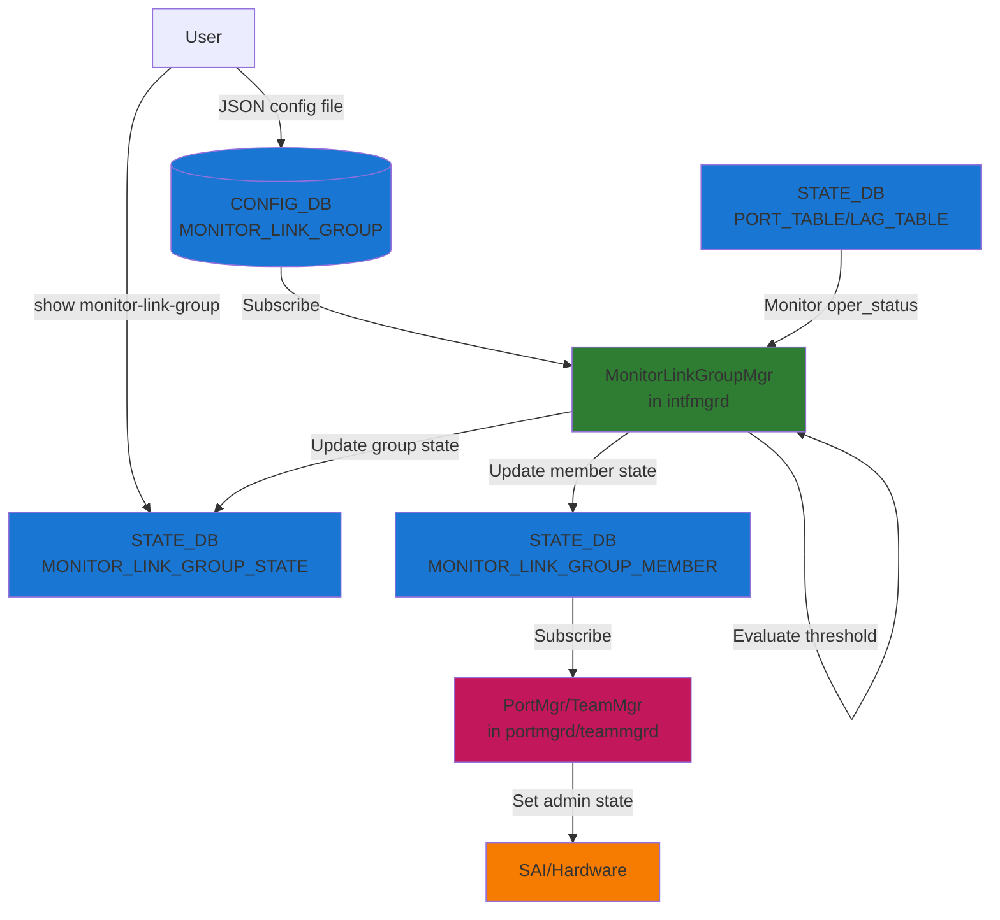
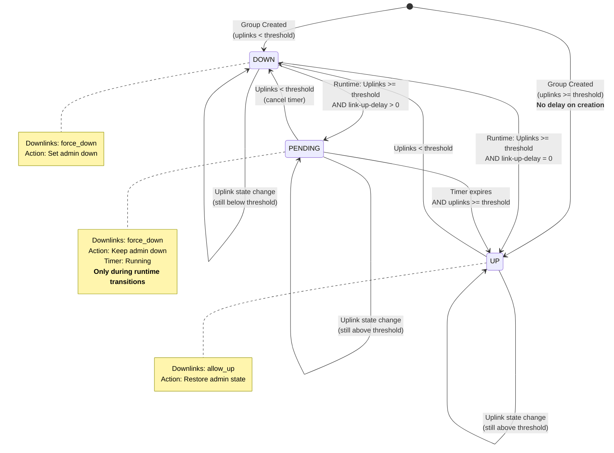
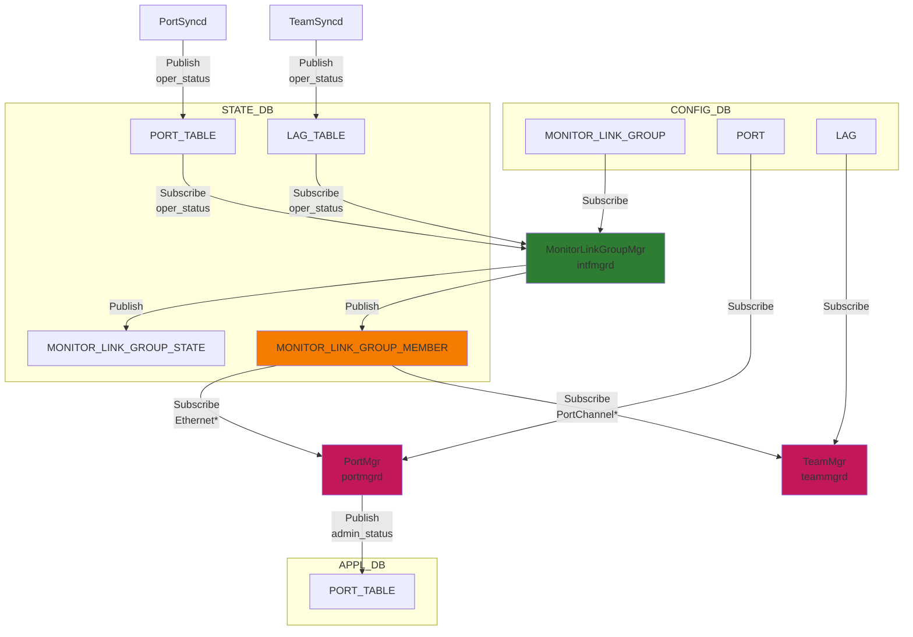
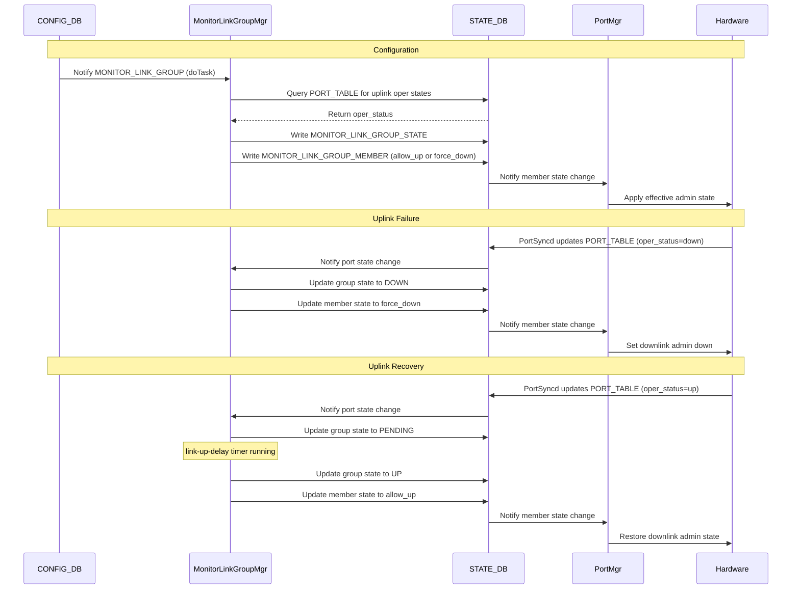

# Monitor Link Group High-Level Design

## Table of Content

- [1. Revision](#1-revision)
- [2. Scope](#2-scope)
- [3. Definitions/Abbreviations](#3-definitionsabbreviations)
- [4. Requirements](#4-requirements)
- [5. Architecture Design](#5-architecture-design)
- [6. High-Level Design](#6-high-level-design)
- [7. SAI API](#7-sai-api)
- [8. Configuration and Management](#8-configuration-and-management)
- [9. Warmboot and Fastboot Design Impact](#9-warmboot-and-fastboot-design-impact)
- [10. Restrictions/Limitations](#10-restrictionslimitations)
- [11. Testing Requirements/Design](#11-testing-requirementsdesign)


## 1. Revision

| Rev | Date       | Author           | Change Description |
|-----|------------|------------------|--------------------|
| 0.1 | 2026-04-28 | Satishkumar Rodd | Initial version    |


## 2. Scope

This document describes the Monitor Link Group feature in SONiC. The feature provides link state tracking functionality that allows downlink interfaces to be automatically disabled when a specified number of uplink interfaces go down, preventing traffic black-holing in network topologies where downlinks depend on uplinks for connectivity.

```
                    ┌───────────────────────────┐
                    │       Router / Spine      │
                    └─────┬──────────────┬──────┘
                          ↕              ↕
                     Ethernet64    Ethernet72
                      [uplink]      [uplink]
                          │              │
    ┌─────────────────────┴──────────────┴───────────────────┐
    │                      SONiC Switch                      │
    │  ┌──────────────────────────────────────────────────┐  │
    │  │              Monitor Link Group                  │  │
    │  │  uplinks:     Ethernet64, Ethernet72             │  │
    │  │  downlinks:   Ethernet80, Ethernet88             │  │
    │  │  min-uplinks: 2   link-up-delay: 10 sec          │  │
    │  └──────────────────────────────────────────────────┘  │
    └─────────────────────┬──────────────────┬───────────────┘
                          ↕                  ↕
                     Ethernet80        Ethernet88
                     [downlink]        [downlink]
                          │                  │
              ┌───────────┴───────┐  ┌───────┴───────────┐
              │     Server 1      │  │     Server 2      │
              └───────────────────┘  └───────────────────┘
```

## 3. Definitions/Abbreviations

| Term | Definition |
|------|------------|
| Monitor Link Group | A logical grouping of uplink and downlink interfaces with defined tracking behavior |
| Uplink | An interface whose operational state is monitored |
| Downlink | An interface whose administrative state is controlled based on uplink status |
| min-uplinks | Minimum number of uplinks that must be operational for the group to be considered "up" |
| link-up-delay | Time delay (in seconds) before bringing downlinks up after uplink threshold is met |

## 4. Requirements

### 5.1 Functional Requirements

1. Support grouping of interfaces into monitor link groups with uplinks and downlinks
2. Monitor operational status of uplink interfaces
3. Automatically control downlink interface states based on uplink availability
4. Support configurable minimum uplink threshold (min-uplinks)
5. Support configurable link-up-delay to prevent downlink churn from uplink flaps
6. Allow interfaces to belong to multiple monitor link groups in any role combination — an interface may be an uplink in one group and a downlink in another simultaneously
7. Provide operational status visibility through show commands and STATE_DB
8. Support both physical Ethernet interfaces and PortChannel interfaces

### 5.2 Configuration Requirements

1. JSON configuration file format for monitor link groups (via `config load`)
2. YANG model validation on `config load` / `config reload`

## 5. Architecture Design

The Monitor Link Group feature is implemented within the existing SONiC architecture without requiring architectural changes. The feature integrates with:

- **CONFIG_DB**: Stores monitor link group configuration
- **STATE_DB**: Stores operational state of groups and member interfaces
- **MonitorLinkGroupMgr (SWSS)**: Sibling `Orch` in `intfmgrd`; owns the monitor-link state machine
- **PortMgr/TeamMgr**: Consumes downlink state changes to control interface admin status

### 6.1 System Architecture



### 6.2 State Machine Diagram



## 6. High-Level Design

### 7.2 Modified Components

Built-in SONiC feature in the SWSS container.

**Repositories:**
- sonic-swss-common: STATE_DB table-name macros
- sonic-swss: MonitorLinkGroupMgr, PortMgr, TeamMgr
- sonic-utilities: CLI show commands
- sonic-yang-models: YANG model definition

**Modules:**
- `cfgmgr/monitorlinkgroupmgr.cpp` + `.h`: Core monitor-link state machine (new)
- `cfgmgr/intfmgrd.cpp`: Process loop — adds `MonitorLinkGroupMgr` to `cfgOrchList`
- `cfgmgr/portmgr.cpp` + `.h`: Ethernet downlink admin-state control
- `cfgmgr/teammgr.cpp` + `.h`: PortChannel downlink admin-state control
- `common/schema.h`: `STATE_MONITOR_LINK_GROUP_STATE_TABLE_NAME` and `STATE_MONITOR_LINK_GROUP_MEMBER_TABLE_NAME` macros
- `show/monitor_link.py`: CLI show commands
- `show/main.py`: CLI show command registration
- `yang-models/sonic-monitor-link-group.yang`: YANG model

### 7.3 Database Schema and Daemon Interactions

This section describes the complete database schema and how different daemons interact through Redis databases.

#### 7.3.1 CONFIG_DB Schema

**Key:** `MONITOR_LINK_GROUP|<group_name>`

| Field | Type | Default | Description |
|-------|------|---------|-------------|
| uplinks | list of interface names | — | Interfaces whose oper_status is monitored |
| downlinks | list of interface names | — | Interfaces whose admin state is controlled |
| min-uplinks | string (integer) | "1" | Minimum uplinks that must be operationally up |
| link-up-delay | string (seconds) | "0" | Delay before bringing downlinks up after threshold met |
| description | string | "" | Human-readable description (optional) |

#### 7.3.2 STATE_DB Schema

**Key:** `MONITOR_LINK_GROUP_STATE|<group_name>`

| Field | Values | Description |
|-------|--------|-------------|
| state | up / down / pending | Group operational state (used exclusively for `show monitor-link-group`) |
| uplinks | comma-separated list | Configured uplinks |
| downlinks | comma-separated list | Configured downlinks |
| link_up_threshold | string | min-uplinks from CONFIG_DB |
| link_up_delay | string | link-up-delay from CONFIG_DB |
| description | string | Description from CONFIG_DB |


**Purpose:** This table is used **exclusively for operational visibility** through CLI show commands. It is NOT used by any daemon for functional logic. The actual control of downlink interfaces is performed through the `MONITOR_LINK_GROUP_MEMBER` table.

**Key:** `MONITOR_LINK_GROUP_MEMBER|<interface_name>`

| Field | Values | Description |
|-------|--------|-------------|
| state | allow_up / force_down | allow_up when all groups are UP; force_down when any group is DOWN/PENDING |
| down_due_to | comma-separated group names | Groups forcing this interface down; empty when allow_up |

**Producer:** MonitorLinkGroupMgr (intfmgrd)
**Consumer:** PortMgr (portmgrd) for Ethernet interfaces, TeamMgr (teammgrd) for PortChannel interfaces

**PORT_TABLE / LAG_TABLE** (existing tables, monitored by MonitorLinkGroupMgr)

MonitorLinkGroupMgr subscribes to `STATE_DB:PORT_TABLE` for Ethernet uplinks and `STATE_DB:LAG_TABLE` for PortChannel uplinks. When a change arrives, it checks whether the interface is operationally up and updates the group's uplink count accordingly. The specific field names used internally by SONiC to signal operational state are an implementation detail and may differ between Ethernet and PortChannel entries; the daemon handles both transparently.

**Producers:** PortSyncd / Kernel (Ethernet), TeamSyncd / Teamd (PortChannel)
**Consumer:** MonitorLinkGroupMgr

#### 7.3.3 Database Interaction Diagram



### 7.4 Threshold and State Transition Logic

```
// During group creation — link-up-delay bypassed
if (is_new_group and uplink_up_count >= min-uplinks):
    group_state = UP

// During runtime transitions
else if (uplink_up_count >= min-uplinks):
    if (link-up-delay > 0 and group was previously DOWN):
        group_state = PENDING
        start_delay_timer(link-up-delay)
    else:
        group_state = UP
else:
    group_state = DOWN
    cancel_delay_timer() if pending
```

Downlink state: `should_be_up = (down_group_count == 0)`. A downlink is forced down if ANY of its groups is DOWN or PENDING.

### 7.5 Downlink Admin State Combination

PortMgr (Ethernet) and TeamMgr (PortChannel) apply the same truth table when combining the monitor-link signal with the operator's configured `admin_status`:

```
┌─────────────────────┬─────────────────┬──────────────────┐
│ monitor_link_state  │ config_admin_up │ Final Admin State│
├─────────────────────┼─────────────────┼──────────────────┤
│ force_down          │ up              │ DOWN             │
│ force_down          │ down            │ DOWN             │
│ allow_up            │ up              │ UP               │
│ allow_up            │ down            │ DOWN             │
└─────────────────────┴─────────────────┴──────────────────┘
```

On DEL (group deleted or interface removed): interface is restored to its configured `admin_status`. See [Appendix A](#appendix-a--portmgrteammgr-processing-detail) for full per-event processing logic.

### 7.6 Multi-Group and Cross-Role Support

An interface can belong to multiple monitor link groups, including as different roles in different groups.

**Multiple downlink groups:**
- Downlink is forced down if ANY group it belongs to is DOWN/PENDING
- Downlink is allowed up only when ALL groups it belongs to are UP
- The `down_due_to` field lists all groups currently forcing the interface down

**Cross-role (uplink in one group, downlink in another):**
- An interface may simultaneously be an uplink in group A and a downlink in group B
- Its oper_status drives group A's threshold evaluation (uplink role)
- Group B's state drives its admin-state (downlink role)
- The two roles are tracked independently; a state change in the uplink role does not trigger evaluation of the downlink role, and vice versa
- An interface **cannot** be both uplink and downlink within the **same** group; this is enforced at `config load` time by a YANG `must` constraint

### 7.7 Sequence Diagram



### 7.8 Operator Workflows and Design Constraints

**In-place group update (non-destructive):**
A SET on an existing group via `config load` can be applied repeatedly with the same result. All fields (uplinks, downlinks, min-uplinks, link-up-delay, description) can be updated in-place. The daemon diffs the new and existing interface lists and adds/removes members incrementally. If `link-up-delay` changes while the group is PENDING, the running timer is adjusted to reflect the remaining time under the new value (or the group transitions to UP immediately if the new delay is zero or already elapsed).

**Group rename:**
Group names are CONFIG_DB keys; renaming requires a DEL of the old key followed by a SET of the new key. The DEL releases monitor-link control on all downlinks (STATE_DB member entries deleted; PortMgr/TeamMgr restores each to its configured admin state). The SET then re-evaluates the new group from scratch.

**Removing a downlink from a DOWN group:**
When a downlink is removed from a group that is currently DOWN/PENDING, `down_group_count` is decremented. If it reaches zero (no other groups forcing it down), the daemon writes `state=allow_up` to STATE_DB and PortMgr/TeamMgr restores the interface to its configured admin state.

**User admin-down override:**
A user setting `admin_status=down` on a downlink takes effect unconditionally regardless of monitor-link state. When the user later sets `admin_status=up`, PortMgr/TeamMgr checks STATE_DB for any active `force_down` override and blocks the bring-up if one is present.

## 7. SAI API

No SAI API changes. The feature operates entirely in the control plane via `ip link`; existing SAI port APIs handle admin-state changes, making it ASIC- and platform-agnostic.

## 8. Configuration and Management

### 9.1 Configuration Method

**Configuration via JSON File:**

The monitor-link feature is configured through JSON configuration files loaded into CONFIG_DB. CLI commands for configuration are **not currently supported**.

**Configuration File Format:**

```json
{
    "MONITOR_LINK_GROUP": {
        "critical_links": {
            "uplinks": ["Ethernet64", "Ethernet72"],
            "downlinks": ["Ethernet80"],
            "min-uplinks": "2",
            "link-up-delay": "10",
            "description": "Critical uplink monitoring"
        }
    }
}
```

**Show Commands:**

```bash
# Show all monitor link groups
show monitor-link-group

# Show specific group
show monitor-link-group <group_name>

# Example output:
Monitor Link Group: critical_links
==================================
Description:      Critical uplink monitoring
State:            UP
Uplinks Up:       2/2
Min-uplinks:      2
Link-up-delay:    10 seconds
Total Interfaces: 3 (2 uplinks, 1 downlinks)

Interfaces:
--------------------------------------------------
Interface    Link Type    Status    Reason
-----------  -----------  --------  --------
Ethernet64   uplink       UP
Ethernet72   uplink       UP
Ethernet80   downlink     UP
```

**YANG Model:**

The `sonic-monitor-link-group` YANG module defines and validates the CONFIG_DB schema for the `MONITOR_LINK_GROUP` table. `config load` and `config reload` run CONFIG_DB contents through YANG validation before committing.

File: `src/sonic-yang-models/yang-models/sonic-monitor-link-group.yang`

Structure (see file for full patterns and error messages):

```yang
module sonic-monitor-link-group {
    yang-version 1.1;
    namespace "http://github.com/sonic-net/sonic-monitor-link-group";
    prefix mlg;

    import sonic-port        { prefix port; }
    import sonic-portchannel { prefix lag;  }

    revision 2026-04-27 {
        description "Initial version";
    }

    container sonic-monitor-link-group {
        container MONITOR_LINK_GROUP {
            list MONITOR_LINK_GROUP_LIST {
                key "group_name";

                must "not(uplinks[. = current()/downlinks])" {
                    error-message "An interface cannot be configured as both uplink and downlink in the same group";
                }

                leaf group_name {
                    type string { length "1..128"; pattern "[a-zA-Z0-9_-]+"; }
                }

                // union of leafref to PORT and PORTCHANNEL; empty-string fallback for SONiC
                // "set-to-empty instead of delete" convention
                leaf-list uplinks {
                    type union {
                        type leafref { path /port:sonic-port/port:PORT/port:PORT_LIST/port:name; }
                        type leafref { path /lag:sonic-portchannel/lag:PORTCHANNEL/lag:PORTCHANNEL_LIST/lag:name; }
                        type string  { pattern ""; }
                    }
                    ordered-by user;
                    default "";
                }

                leaf-list downlinks {
                    type union {
                        type leafref { path /port:sonic-port/port:PORT/port:PORT_LIST/port:name; }
                        type leafref { path /lag:sonic-portchannel/lag:PORTCHANNEL/lag:PORTCHANNEL_LIST/lag:name; }
                        type string  { pattern ""; }
                    }
                    ordered-by user;
                    default "";
                }

                leaf description   { type string { length "1..255"; } }
                leaf link-up-delay { type string; default "0"; }  // numeric string; valid range 0-3600
                leaf min-uplinks   { type string; default "1"; }  // numeric string; valid range 1-128
            }
        }
    }
}
```

## 9. Warmboot and Fastboot Design Impact

### 10.1 Warmboot and Fastboot Impact

1. **Timer Handling:** Startup delay timers are not persisted. On restart, groups re-evaluate as fresh creations: if sufficient uplinks are operational, the group transitions directly to UP (link-up-delay bypassed). Groups that were PENDING before restart do not resume their timers.
2. **Startup Ordering:** If `portsyncd` has not yet populated STATE_DB when `intfmgrd` starts, uplinks appear down at creation time and groups start DOWN. As `portsyncd` writes port states, groups re-evaluate via normal runtime transitions (link-up-delay applied). If `portsyncd` starts first, groups may start directly UP with no delay. This ordering dependency is expected and acceptable.

Fastboot behavior is identical: no data-plane impact; configuration re-derived from CONFIG_DB and current STATE_DB on restart.

## 10. Restrictions/Limitations

### 11.1 By-design restrictions

1. **Interface Types:** Only physical Ethernet and PortChannel (LAG) interfaces are supported. Sub-interfaces, VLAN interfaces, loopbacks, and router interfaces are out of scope — their admin state is not a useful indicator of upstream reachability.
2. **Timer Precision:** Startup-delay timer has ~1-second precision (limited by `SelectableTimer` resolution).
3. **Timer Persistence:** Startup-delay timers are not persisted across reboots. On restart, groups re-evaluate as fresh creations; see §10.1 for the complete restart behavior.
4. **Configuration Validation:** A group with `min-uplinks > count(configured uplinks)` is accepted at load time and remains always-DOWN at runtime; runtime does not reject the configuration.
5. **Cross-namespace groups (multi-ASIC):** On multi-ASIC platforms, monitor-link groups are scoped to a single ASIC namespace. Uplinks and downlinks of the same group must belong to the same ASIC; cross-namespace groups are not supported.

### 11.2 Open Items

| Item | Notes |
|------|-------|
| Configuration CLI (`config monitor-link-group add / delete / modify`) | Supported via `config load` of a JSON snippet with YANG validation; no imperative add/delete CLI. |

## 11. Testing Requirements/Design

### 12.1 System Test Cases

| # | Test | Key Assertion |
|---|------|---------------|
| 1 | Create group, all uplinks up | group=up, downlinks=allow_up |
| 2 | Create group with description | STATE_DB reflects description |
| 3 | Delete group | STATE_DB entry removed |
| 4 | Create group, all uplinks down | group=down, downlinks=force_down |
| 5 | One uplink down (min_uplinks=1, 2 uplinks) | Group stays up |
| 6 | All uplinks down | group=down, downlinks=force_down |
| 7 | Uplink recovers | group=up, downlinks=allow_up |
| 8 | Downlink configured admin-down | Stays admin-down through group UP/DOWN transitions |
| 9 | Add uplink to group | State re-evaluated correctly |
| 10 | Remove uplink from group | State re-evaluated correctly |
| 11 | Add downlink to group | Downlink reflects group state |
| 12 | Remove downlink from DOWN group | Removed link restored to configured admin state |
| 13 | Remove entire DOWN group | All downlinks restored |
| 14 | Three groups share uplinks | All go down/recover together |
| 15 | Three groups share downlinks | Downlinks down when any group down; up only when all up |
| 16 | Remove DOWN group sharing downlinks with UP group | Downlinks restored |

---

## Appendix A — PortMgr/TeamMgr Processing Detail

### A.1 PortMgr (Ethernet interfaces)

**On `STATE_DB:MONITOR_LINK_GROUP_MEMBER` SET:**
1. Skip if interface is not in `CONFIG_DB:PORT` (PortChannel — handled by TeamMgr)
2. Read `state` field (`allow_up` or `force_down`)
3. Read configured `admin_status` from `CONFIG_DB:PORT`
4. Apply `final = (state == "allow_up") AND (config_admin_up)` via `setPortAdminStatus()` → `APPL_DB:PORT_TABLE`

**On `STATE_DB:MONITOR_LINK_GROUP_MEMBER` DEL:**
- Restore interface to its configured `admin_status` from `CONFIG_DB:PORT`

**On `CONFIG_DB:PORT` admin_status change:**
- Calls `applyEffectiveAdminStatus()` which re-reads the current monitor-link state from STATE_DB and applies the combined result; a user `admin_status=up` is blocked if `force_down` is active

**Key points:** PortMgr does not modify CONFIG_DB. `down_due_to` is logged but not used in decision logic.

### A.2 TeamMgr (PortChannel interfaces)

**On `STATE_DB:MONITOR_LINK_GROUP_MEMBER` SET:**
1. Skip if interface is not in `CONFIG_DB:LAG` (Ethernet — handled by PortMgr)
2. Read `state` field and configured `admin_status` from `CONFIG_DB:LAG`
3. Apply `final = (state == "allow_up") AND (config_admin_up)` via `setLagAdminStatus()` → `ip link set dev <pc> up/down`

**On `STATE_DB:MONITOR_LINK_GROUP_MEMBER` DEL:**
- Restore PortChannel to its configured `admin_status` from `CONFIG_DB:LAG`

**On `CONFIG_DB:LAG` admin_status change:**
- Checks STATE_DB for an active monitor-link entry; blocks `admin_status=up` if `force_down` is present

**Key point:** TeamMgr applies admin state directly to the kernel netdev via `ip link`; no APPL_DB write for admin state changes.

