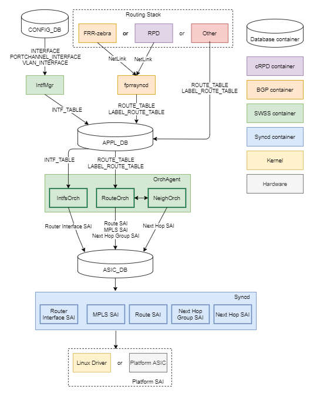

# MPLS for SONiC High Level Design Document #

## Table of Content
- [MPLS for SONiC High Level Design Document](#mpls-for-sonic-high-level-design-document)
  - [Table of Content](#table-of-content)
    - [Revision](#revision)
    - [Scope](#scope)
    - [Definitions/Abbreviations](#definitionsabbreviations)
    - [Overview](#overview)
    - [Requirements](#requirements)
      - [Functional Requirements](#functional-requirements)
      - [Configuration and Management Requirements](#configuration-and-management-requirements)
      - [Scalability Requirements](#scalability-requirements)
      - [Warm Boot Requirements](#warm-boot-requirements)
      - [Future Requirements](#future-requirements)
    - [Architecture Design](#architecture-design)
    - [High-Level Design](#high-level-design)
      - [Overview](#overview-1)
      - [Database Changes](#database-changes)
        - [APPL_DB](#appl-db)
          - [INTERFACE_TABLE](#interface_table)
          - [ROUTE_TABLE](#route_table)
          - [LABEL_ROUTE_TABLE](#label_route_table)
      - [Software Modules](#software-modules)
        - [NetLink](#netlink)
          - [Functions](#functions)
        - [IntfMgr](#intfmgr)
        - [FPM Syncd](#fpm-syncd)
          - [Functions](#functions-1)
        - [IntfsOrch](#intfsorch)
          - [Functions](#functions-2)
        - [RouteOrch](#routeorch)
          - [Functions](#functions-3)
        - [NeighOrch](#neighorch)
          - [Functions](#functions-4)
        - [CrmOrch](#crmorch)
          - [Functions](#functions-5)
        - [Label/LabelStack](#label-labelstack)
        - [NextHopKey](#nexthopkey)
        - [Syncd](#syncd)
    - [SAI API](#sai-api)
      - [Router Interface](#router-interface)
      - [MPLS](#mpls)
      - [Next Hop](#next-hop)
    - [Configuration and management](#configuration-and-management)
      - [CLI Enhancements](#cli-enhancements)
      - [Config DB Enhancements](#config-db-enhancements)
        - [INTERFACE](#interface)
        - [PORTCHANNEL_INTERFACE](#portchannel_interface)
        - [VLAN_INTERFACE](#vlan_interface)
      - [YANG Model Enhancements](#yang-model-enhancements)
    - [Warmboot and Fastboot Design Impact](#warmboot-and-fastboot-design-impact)
    - [Restrictions/Limitations](#restrictionslimitations)
    - [Testing Requirements/Design](#testing-requirementsdesign)
      - [Unit Test cases](#unit-test-cases)
      - [System Test cases](#system-test-cases)
    - [Open/Action items - if any](#openaction-items---if-any)
### Revision
|  Rev  |  Date       |  Author  | Change Description |
| :---: | :---------: | :------: | ------------------ |
|  0.1  | Jan-10-2021 | A Pokora | Initial version    |
|  0.2  | Jan-19-2021 | A Pokora | Updates from MPLS community review |

### Scope

This document provides general information about the MPLS feature implementation in SONiC.

### Definitions/Abbreviations
| Abbreviation | Description                           |
| ------------ | ------------------------------------- |
| cRPD         | Containerized Routing Protocol Daemon |
| LSP          | Label-Switched Path                   |
| MPLS         | Multi-Protocol Label Switching        |

### Overview

This document provides general information about the MPLS feature implementation in SONiC.

### Requirements

This section describes the SONiC requirements for the MPLS feature.

#### Functional requirements
- Support to enable/disable MPLS per Interface.
- Support for MPLS Push, Pop, and Swap label operations.
- Support for bulk MPLS in-segment entry SAI programming.
- Support for CRM monitoring of MPLS in-segment used/available entries.

#### Configuration and Management requirements
- SONiC CLI support for MPLS enable/disable per Router Interface.
- Configurable CRM thresholds for monitoring MPLS in-segment entries used/available.

#### Scalability Requirements
- Up to max ASIC capable MPLS routes are supported.
- Error is logged in syslog for all attempted MPLS routes after max limit is reached.
- CRM notification upon reaching configurable scaling thresholds.

#### Warm Boot Requirements
- MPLS functionality continues across warm reboot.
- Support for planned system warm restart.
- Support for SWSS docker warm restart.

#### Future Requirements
- Support for VRFs
- SONiC CLI support for operational commands.
- Integration with FRR routing stack.
- Integration with VS SAI.

### Architecture Design
The MPLS feature extends Route and Next Hop support in SONiC to include optional MPLS label stack in addition to the existing IPv4/IPv6 address information.

### High-Level Design

#### Overview


**Figure 1: Overview of the data flow and related components of MPLS**

#### Database Changes
This section describes the modifications to SONiC Databases to support MPLS.

##### APPL_DB

###### INTERFACE_TABLE
The existing INTERFACE_TABLE is enhanced to accept a new "mpls" enable/disable attribute.

``` rfc5234
INTERFACE_TABLE|{{interface_name}}
    "mpls":{{enable|disable}} (OPTIONAL)

; Defines schema for MPLS configuration attribute
key                         = INTERFACE:ifname             ; Interface name
; field                     = value
mpls                        = "enable" / "disable"         ; Enable/disable MPLS function. Default disable
```

###### ROUTE_TABLE
The existing ROUTE_TABLE for IPv4/IPv6 prefix routes is enhanced to accept an optional MPLS label stack component in the existing "nexthop" formatted-string attribute.  The new format of the nexthop attribute string with MPLS label stack is: "label0/.../labelN+ip-prefix".  For IP-only next hops, the previous string format is retained and no preceding label stack information will be included.

``` rfc5234
"ROUTE_TABLE":{{prefix}}
    "nexthop":{{nexthop_list}}
    "ifname":{{ifname_list}}

; Defines schema for IPv4/IPv6 route table attributes
key                         = ROUTE_TABLE:prefix       ; IPv4/IPv6 prefix
; field                     = value
nexthop                     = STRING                   ; Comma-separated list of nexthops.
ifname                      = STRING                   ; Comma-separated list of interfaces.
```

###### LABEL_ROUTE_TABLE
A new LABEL_ROUTE_TABLE is introduced for MPLS in-segment entries to accept the same attributes as ROUTE_TABLE:
- A "nexthop" formatted-string attribute with optional MPLS label stack component.
- A "ifname" attribute.
The LABEL_ROUTE_TABLE uses the incoming MPLS label as its lookup key, instead of the IP prefix used by the ROUTE_TABLE.

``` rfc5234
"LABEL_ROUTE_TABLE":{{mpls_label}}
    "nexthop":{{nexthop_list}}
    "ifname":{{ifname_list}}

; Defines schema for MPLS label route table attributes
key                         = LABEL_ROUTE_TABLE:mpls_label ; MPLS label
; field                     = value
nexthop                     = STRING                   ; Comma-separated list of nexthops.
ifname                      = STRING                   ; Comma-separated list of interfaces.
```

#### Software Modules
This section describes modifications to SONiC infrastructure software modules to support MPLS.

##### NetLink
Netlink is an existing open source library imported to SONiC.
Modifications to the existing NetLink MPLS implementation were needed to support MPLS attributes.
###### Functions
New accessors were added to retrieve the MPLS NH destination and TTL values:
```
  /* Accessor to retrieve MPLS destination */
  extern struct nl_addr *	rtnl_route_nh_get_encap_mpls_dst(struct rtnl_nexthop *);
  /* Accessor to retrieve MPLS TTL */
  extern uint8_t		rtnl_route_nh_get_encap_mpls_ttl(struct rtnl_nexthop *);
```

##### IntfMgr
IntfMgr is an existing daemon in SWSS container that monitors operations in CONFIG_DB on INTERFACE and PORTCHANNEL_INTERFACE tables.

For MPLS, IntfMgr is modified to additionally process the "mpls" attribute and propagate this attribute to APPL_DB.

##### FPM Syncd
FPM Syncd is an existing daemon in BGP container that monitors NetLink messages from the SONiC routing stack for Route and Next Hop information.

New support has been added to FPM Syncd for MPLS to process MPLS related Route and Next Hop information in the received NetLink messages and propagate this information to the APPL_DB.
###### Functions
The following are new functions for fpmsyncd:
```
  /* Handler for rtnl messages with MPLS route */
  void RouteSync::onLabelRouteMsg(int nlmsg_type, struct nl_object *obj);
```

##### IntfsOrch
IntfsOrch is an existing component of the OrchAgent daemon in the SWSS container.  IntfsOrch monitors operations on Interface related tables in APPL_DB and converts those operations into SAI commands to manage the Router Interface object.

For MPLS, IntfsOrch has been extended to detect the new per-RIF MPLS enable/disable attribute in the APPL_DB and propagate this attribute to the ASIC_DB via SAI_ROUTER_INTERFACE_ATTR_ADMIN_MPLS_STATE.  This MPLS behavior parallels the existing IntfsOrch behavior for IPv4/IPv6 with SAI_ROUTER_INTERFACE_ATTR_ADMIN_V4_STATE and SAI_ROUTER_INTERFACE_ATTR_ADMIN_V6_STATE.
###### Functions
The following are new functions for IntfsOrch:
```
  /* Handler to enable/disable MPLS per Interface */
  bool IntfsOrch::setRouterIntfMpls(Port& port)
```

##### RouteOrch
RouteOrch is an existing component of the OrchAgent daemon in the SWSS container.  RouteOrch monitors operations on Route related tables in APPL_DB and converts those operations in SAI commands to manage Route and In-Segment entries.  Additionally RouteOrch coordinates Next Hop object operations with NeighOrch and converts operations into SAI commands to manage Next Hop Group objects.

For MPLS, RouteOrch was modified to monitor updates to the new APPL_DB LABEL_ROUTE_TABLE.  RouteOrch translates all updates to LABEL_ROUTE_TABLE to equivalent SAI requests for SAI MPLS API.
NextHop processing for updates from both the new LABEL_ROUTE_TABLE and the existing ROUTE_TABLE has been extended to detect possible MPLS LabelStack content and propagate this additional information to NeighOrch for SAI handling.
###### Functions
The following are new functions for RouteOrch:
```
  /* Consumer handler for all events in APPL_DB LABEL_ROUTE_TABLE */
  void RouteOrch::doLabelTask(Consumer& consumer);
  /* Handler to process new MPLS route from LABEL_ROUTE_TABLE */
  bool addLabelRoute(LabelRouteBulkContext& ctx, const NextHopGroupKey&);
  /* Handler to process MPLS route removal from LABEL_ROUTE_TABLE */
  bool removeLabelRoute(LabelRouteBulkContext& ctx);
```

##### NeighOrch
NeighOrch is an existing component of the OrchAgent daemon in the SWSS container.  NeighOrch monitors operations on Neighbor related tables in APPL_DB.  Additionally NeighOrch coordinates Next Hop operations with RouteOrch and converts operations into SAI commands to manage Next Hop objects.

For MPLS, NeighOrch has been extended to send create/remove SAI requests for MPLS NextHop objects (ie, NextHop objects that include non-empty LabelStack information) when associated Neighbor objects are created/removed. This MPLS NextHop behavior parallels the existing IPv4/IPv6 NextHop behavior in NeighOrch.
###### Functions
Existing functions from NeighOrch are updated to include NextHopKey parameter instead of IpAddress and visibility is raised to public for RouteOrch accessibility.
```
    bool hasNextHop(const NextHopKey&);
    bool addNextHop(const NextHopKey&);
    bool removeNextHop(const NextHopKey&);
```

##### CrmOrch
CrmOrch is an existing component of the OrchAgent daemon in the SWSS container.  CrmOrch monitors resource usage in the SONiC system and triggers alarms when configurable thresholds are reached.

For MPLS, CrmOrch has been extended to monitor the number of MPLS in-segment entries against the platform-specific number of entries available.  To facilitate this, a new CRM resource type CRM_MPLS_INSEG has been added to CrmOrch and mapped to the existing SAI object type SAI_OBJECT_TYPE_INSEG_ENTRY for querying via sai_object_type_get_availability().  This MPLS behavior parallels the existing IPv4/IPv6 behavior with CRM_IPV4_ROUTE/SAI_SWITCH_ATTR_AVAILABLE_IPV4_ROUTE_ENTRY and CRM_IPV6_ROUTE/SAI_SWITCH_ATTR_AVAILABLE_IPV6_ROUTE_ENTRY.
###### Functions
No new functions were required for CrmOrch MPLS support.

##### Label/LabelStack
Label and LabelStack are new type utilities of the OrchAgent daemon in the SWSS container.
These types are introduced to represent the MPLS label or label stack when found in an in-segment entry or next hop.
```
typedef uint32_t Label;
class LabelStack
{
    ... class definition abbreviated ...
private:
    std::set<Label> m_labelstack;
};
```
##### NextHopKey
NextHopKey is an existing utility of the OrchAgent daemon in the SWSS container.  NextHopKey is used by both RouteOrch and NeighOrch to coordinate Next Hop operations.

For MPLS, the NextHopKey struct is modified to include a LabelStack field.
```
struct NextHopKey
{
    LabelStack          label_stack;    // MPLS label stack
    IpAddress           ip_address;     // neighbor IP address
    string              alias;          // incoming interface alias
    ... struct definition abbreviated ...
};
```
The LabelStack field in NextHopKey would contain an empty set of Labels for IPv4/IPv6 next hops and a non-empty set of Labels for MPLS.

##### Syncd
Syncd is an existing daemon of the Syncd container which handles all events driven by the ASIC_DB.
For MPLS, modifications were made to fully support sairedis handling of the existing SAI MPLS API key: sai_inseg_entry_t.
```
/**
 * @brief In segment entry
 */
typedef struct _sai_inseg_entry_t
{
    /**
     * @brief Switch ID
     *
     * @objects SAI_OBJECT_TYPE_SWITCH
     */
    sai_object_id_t switch_id;

    /**
     * @brief MPLS label
     */
    sai_label_id_t label;

} sai_inseg_entry_t;
```

### SAI API
This section describes SAI APIs used and enhanced to support MPLS.

#### Router Interface
Full details about current SAI Router Interface API and attributes are described here:
https://github.com/opencomputeproject/SAI/blob/master/inc/sairouterinterface.h

To facilitate MPLS functionality, the following update was made to the SAI Router Interface API:
```
    /**
     * @brief Admin MPLS state
     *
     * @type bool
     * @flags CREATE_AND_SET
     * @default false
     */
    SAI_ROUTER_INTERFACE_ATTR_ADMIN_MPLS_STATE,
```

#### MPLS
Full details about current SAI MPLS API and attributes are described here:
https://github.com/opencomputeproject/SAI/blob/master/inc/saimpls.h

The entirety of the existing SAI MPLS API definition is now introduced to SONiC orchagent to facilitate MPLS route functionality.

Additionally, the following has been added to the SAI MPLS API definition for to facilitate bulk MPLS route operations for capable platforms:
```
/**
 * @brief Bulk create In Segment entry
 *
 * @param[in] object_count Number of objects to create
 * @param[in] inseg_entry List of object to create
 * @param[in] attr_count List of attr_count. Caller passes the number
 *    of attribute for each object to create.
 * @param[in] attr_list List of attributes for every object.
 * @param[in] mode Bulk operation error handling mode.
 * @param[out] object_statuses List of status for every object. Caller needs to
 * allocate the buffer
 *
 * @return #SAI_STATUS_SUCCESS on success when all objects are created or
 * #SAI_STATUS_FAILURE when any of the objects fails to create. When there is
 * failure, Caller is expected to go through the list of returned statuses to
 * find out which fails and which succeeds.
 */
typedef sai_status_t (*sai_bulk_create_inseg_entry_fn)(
        _In_ uint32_t object_count,
        _In_ const sai_inseg_entry_t *inseg_entry,
        _In_ const uint32_t *attr_count,
        _In_ const sai_attribute_t **attr_list,
        _In_ sai_bulk_op_error_mode_t mode,
        _Out_ sai_status_t *object_statuses);

/**
 * @brief Bulk remove In Segment entry
 *
 * @param[in] object_count Number of objects to remove
 * @param[in] inseg_entry List of objects to remove
 * @param[in] mode Bulk operation error handling mode.
 * @param[out] object_statuses List of status for every object. Caller needs to
 * allocate the buffer
 *
 * @return #SAI_STATUS_SUCCESS on success when all objects are removed or
 * #SAI_STATUS_FAILURE when any of the objects fails to remove. When there is
 * failure, Caller is expected to go through the list of returned statuses to
 * find out which fails and which succeeds.
 */
typedef sai_status_t (*sai_bulk_remove_inseg_entry_fn)(
        _In_ uint32_t object_count,
        _In_ const sai_inseg_entry_t *inseg_entry,
        _In_ sai_bulk_op_error_mode_t mode,
        _Out_ sai_status_t *object_statuses);

/**
 * @brief Bulk set attribute on In Segment entry
 *
 * @param[in] object_count Number of objects to set attribute
 * @param[in] inseg_entry List of objects to set attribute
 * @param[in] attr_list List of attributes to set on objects, one attribute per object
 * @param[in] mode Bulk operation error handling mode.
 * @param[out] object_statuses List of status for every object. Caller needs to
 * allocate the buffer
 *
 * @return #SAI_STATUS_SUCCESS on success when all objects are removed or
 * #SAI_STATUS_FAILURE when any of the objects fails to remove. When there is
 * failure, Caller is expected to go through the list of returned statuses to
 * find out which fails and which succeeds.
 */
typedef sai_status_t (*sai_bulk_set_inseg_entry_attribute_fn)(
        _In_ uint32_t object_count,
        _In_ const sai_inseg_entry_t *inseg_entry,
        _In_ const sai_attribute_t *attr_list,
        _In_ sai_bulk_op_error_mode_t mode,
        _Out_ sai_status_t *object_statuses);

/**
 * @brief Bulk get attribute on In Segment entry
 *
 * @param[in] object_count Number of objects to set attribute
 * @param[in] inseg_entry List of objects to set attribute
 * @param[in] attr_count List of attr_count. Caller passes the number
 *    of attribute for each object to get
 * @param[inout] attr_list List of attributes to set on objects, one attribute per object
 * @param[in] mode Bulk operation error handling mode
 * @param[out] object_statuses List of status for every object. Caller needs to
 * allocate the buffer
 *
 * @return #SAI_STATUS_SUCCESS on success when all objects are removed or
 * #SAI_STATUS_FAILURE when any of the objects fails to remove. When there is
 * failure, Caller is expected to go through the list of returned statuses to
 * find out which fails and which succeeds.
 */
typedef sai_status_t (*sai_bulk_get_inseg_entry_attribute_fn)(
        _In_ uint32_t object_count,
        _In_ const sai_inseg_entry_t *inseg_entry,
        _In_ const uint32_t *attr_count,
        _Inout_ sai_attribute_t **attr_list,
        _In_ sai_bulk_op_error_mode_t mode,
        _Out_ sai_status_t *object_statuses);
```
The existing sai_mpls_api_t structure has been expanded to accommodate the new MPLS bulking APIs:
```
/**
 * @brief MPLS methods table retrieved with sai_api_query()
 */
typedef struct _sai_mpls_api_t
{
     sai_create_inseg_entry_fn                      create_inseg_entry;
     sai_remove_inseg_entry_fn                      remove_inseg_entry;
     sai_set_inseg_entry_attribute_fn               set_inseg_entry_attribute;
     sai_get_inseg_entry_attribute_fn               get_inseg_entry_attribute;

+    sai_bulk_create_inseg_entry_fn                 create_inseg_entries;
+    sai_bulk_remove_inseg_entry_fn                 remove_inseg_entries;
+    sai_bulk_set_inseg_entry_attribute_fn          set_inseg_entries_attribute;
+    sai_bulk_get_inseg_entry_attribute_fn          get_inseg_entries_attribute;

} sai_mpls_api_t;
```

#### Next Hop
Full details about SAI Next Hop API and attributes are described here:
https://github.com/opencomputeproject/SAI/blob/master/inc/sainexthop.h

No modifications were made to the current SAI Next Hop API definition.

The following existing attribute is now introduced to SONiC orchagent to facilitate MPLS NextHop functionality:
```
    /**
     * @brief Push label
     *
     * @type sai_u32_list_t
     * @flags MANDATORY_ON_CREATE | CREATE_ONLY
     * @condition SAI_NEXT_HOP_ATTR_TYPE == SAI_NEXT_HOP_TYPE_MPLS
     */
    SAI_NEXT_HOP_ATTR_LABELSTACK,
```

### Configuration and management
This section should have sub-sections for all types of configuration and management related design. Example sub-sections for "CLI" and "Config DB" are given below. Sub-sections related to data models (YANG, REST, gNMI, etc.,) should be added as required.

#### CLI Enhancements
A new SONiC CLI command is introduced to configure interfaces for MPLS.

    # Enable/disable MPLS per INTERFACE.
    config interface mpls add|remove <intf-name>

#### Config DB Enhancements

##### INTERFACE
The existing INTERFACE table is enhanced to accept a new "mpls" enable/disable attribute.

``` rfc5234
INTERFACE|{{ifname}}
    "mpls":{{enable|disable}} (OPTIONAL)

; Defines schema for MPLS configuration attribute
key                      = INTERFACE:ifname    ; Interface name
; value annotations
ifname                   = 1*64VCHAR           ; name of the Interface
; field                  = value
mpls                     = "enable"/"disable"  ; Enable/disable MPLS function. Default is disable
```

##### PORTCHANNEL_INTERFACE
The existing PORTCHANNEL_INTERFACE table is enhanced to accept a new "mpls" enable/disable attribute.

``` rfc5234
PORTCHANNEL_INTERFACE|{{ifname}}
    "mpls":{{enable|disable}} (OPTIONAL)

; Defines schema for MPLS configuration attributes
key                      = PORTCHANNEL_INTERFACE:ifname   ; Port Channel Interface name
;value annotations
ifname                   = 1*64VCHAR                      ; name of the Interface (Port Channel)
; field                  = value
mpls                     = "enable"/"disable"             ; Enable/disable MPLS function. Default disable
```

##### VLAN_INTERFACE
The existing VLAN_INTERFACE table is enhanced to accept a new "mpls" enable/disable attribute.

``` rfc5234
VLAN_INTERFACE|{{ifname}}
    "mpls":{{enable|disable}} (OPTIONAL)

; Defines schema for MPLS configuration attributes
key                      = VLAN_INTERFACE:ifname          ; VLAN Interface name
;value annotations
ifname                   = 1*64VCHAR                      ; name of the Interface (VLAN)
; field                  = value
mpls                     = "enable"/"disable"             ; Enable/disable MPLS function. Default disable
```

#### YANG Model Enhancements
The existing sonic-interface.yang model is enhanced to support a new "mpls" enable/disable attribute.

``` rfc5234
  container sonic-interface {
	  container INTERFACE {
		  list INTERFACE_LIST {
+       leaf mpls {
+         type string {
+           pattern "enable|disable";
+         }
+       }
      }
    }
  }
```

### Warmboot and Fastboot Design Impact
MPLS design will not affect warmboot or fastboot design.

### Restrictions/Limitations
In this document, MPLS support is only for static LSP route support. The scope of routing stack supporting dynamic creation of MPLS tunnel is not in the design.

### Testing Requirements/Design
Using external routing controller to set up static LSP route for push/pop/swap operation on MPLS traffic and verify traffic is passing.

#### Unit Test cases
- Using Juniper cRPD set push operation LSP, observe IP traffic goes through router and egress side will have MPLS format with correct label.
- Using Juniper cRPD set pop operation LSP, observe MPLS with single label traffic goes through router and egress side will have IP packets.
- Using Juniper cRPD set swap operation LSP, observe MPLS traffic goes through router and egress side will have MPLS format with different label.
#### System Test cases
Not available
### Open/Action items - if any
None
