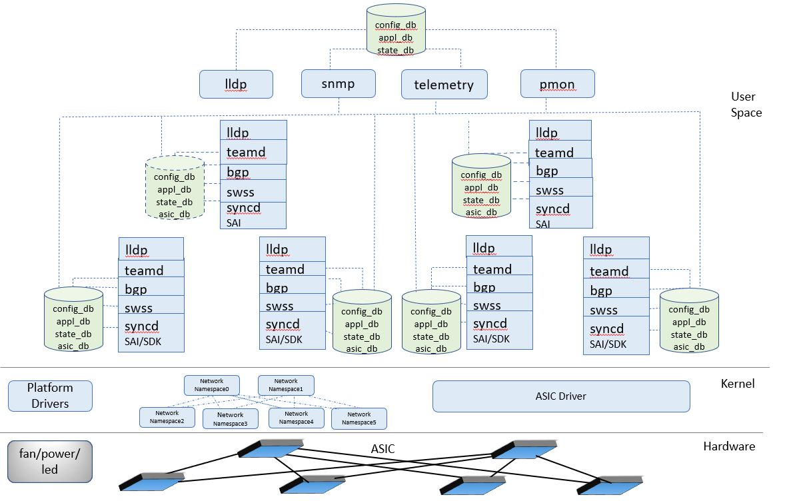

# 1. SONiC on Multi ASIC platforms

# 2. High Level Design Document

<!-- markdown-toc start - Don't edit this section. Run M-x markdown-toc-refresh-toc -->
**Table of Contents**

- [1. SONiC on Multi ASIC platforms](#1-sonic-on-multi-asic-platforms)
- [2. High Level Design Document](#2-high-level-design-document)
    - [2.1. Revision](#21-revision)
    - [2.2. About this Manual](#22-about-this-manual)
    - [2.3. Architecture](#23-architecture)
        - [2.3.1. ASIC roles](#231-asic-roles)
        - [2.3.2. Control Plane](#232-control-plane)
            - [2.3.2.1. BGP on backend ASICs](#2321-bgp-on-backend-asics)
            - [2.3.2.2. VLAN/Cross-connect on backend ASICs](#2322-vlancross-connect-on-backend-asics)
            - [2.3.2.3. Comparison of both approaches](#2323-comparison-of-both-approaches)
    - [2.4. Design](#24-design)
        - [2.4.1. Detecting a Multi ASIC system](#241-detecting-a-multi-asic-system)
        - [2.4.2. System initialization](#242-system-initialization)
            - [2.4.2.1. Systemd services](#2421-systemd-services)
            - [2.4.2.2. Platform files](#2422-platform-files)
            - [2.4.2.3. ASIC initialization](#2423-asic-initialization)
            - [2.4.2.4. Port initialization](#2424-port-initialization)
        - [2.4.3. Configuration](#243-configuration)
            - [2.4.3.1. Minigraph](#2431-minigraph)
            - [2.4.3.2. DEVICE_METADATA](#2432-devicemetadata)
            - [2.4.3.3. Router Mac](#2433-router-mac)
            - [2.4.3.4. Loopback address](#2434-loopback-address)
            - [2.4.3.5. Default Route](#2435-default-route)
            - [2.4.3.6. BGP configuration](#2436-bgp-configuration)
        - [2.4.4. Database Service](#244-database-service)
            - [2.4.4.1. Infrastructure changes](#2441-infrastructure-changes)
        - [2.4.5. Configuration CLIs](#245-configuration-clis)
        - [2.4.6. Platform Services](#246-platform-services)
        - [2.4.7. Monitoring/Troubleshooting](#247-monitoringtroubleshooting)
            - [2.4.7.1. SNMP](#2471-snmp)
            - [2.4.7.2. Telemetry](#2472-telemetry)
            - [2.4.7.3. LLDP](#2473-lldp)
            - [2.4.7.4. ACL](#2474-acl)
            - [2.4.7.5. Everflow](#2475-everflow)
            - [2.4.7.6. Syslog](#2476-syslog)
            - [2.4.7.7. Operational CLIs](#2477-operational-clis)

<!-- markdown-toc end -->


## 2.1. Revision

| Rev  |    Date    |                Author                 | Change Description |
| :--: | :--------: | :-----------------------------------: | ------------------ |
| 0.1  | 06/24/2020 |  Arvindsrinivasan Lakshminarasimhan, Rita Hui, Judy Joseph,  Suvarna Meenakshi, Abhishek Dosi     | Initial version    |


## 2.2. About this Manual

This document provides the high-level design for supporting multi ASIC platform in SONiC

## 2.3. Architecture
A platform with more than one ASIC present on it is defined as a multi ASIC platform.
SONiC so far supports platforms with single ASIC, we are enhancing SONiC to support multiple ASIC platforms.

The figure below depicts an example of multi ASIC platform. In this platform there are multiple ASICs interconnected with each other. 


Traditionally, a router or switch with multiple ASICs are often implemented with a closed software stack, as there is no need for multi-vendor interoperability.  As a result, proprietary or non-standard based protocols are often used for control and data plane among the ASICs inside a multi-ASIC router/switch.  In a data center where there are routers/switches from multiple vendors, network engineers would then need to understand the various protocols being used inside the box, for purpose of technical assessments and trouble-shooting needs.  It is also often difficult to reuse existing monitoring tools to monitor or diagnose inside the box. When there is a very high number of such routers deployed in data centers, lacking the ability to monitor and trouble-shoot inside the box in an automated fashion pose a big challenge to resources needed to maintain the network efficiently and reliably. 

To support a router/switch with multiple switch ASICs, a disaggregated design approach is used. 
The main idea is for the control/data plane related SONiC docker containers to be disaggregated per switch ASIC. 

The below sonic dockers are instantiated per each ASIC:

- lldp, teamd, bgp, syncd, swss, database

- Each instance is responsible for the programming of a single ASIC.
- Each ASIC is programmed and forwarding traffic independently
- Each ASIC has its own SAI library and SDK instance.

Below dockers are created for host and remain as single instance only:

  snmp, telemetry, pmon

- A separate database instance per ASIC
- Configuration is generated and stored per ASIC.

There is an additional database and lldp instance are running on the host


The ability to program and forward traffic independently on each ASIC also depends on the HW architecture of the ASIC.  Some ASICs used in a chassis or distributed system may not support completely independent programming/forwarding when traffic from one port to another spans multiple ASICs.
In this document, we will focus on a multi-ASIC system where ASICs can support completely independent programming/forwarding.  What this means is that traffic entering and leaving the ASIC will be in standard IP packet format, even within the router.  The ingress/egress pipeline to forward a packet is not separated into different ASICs and so there is no dependency of data-plane information shared among different ASICs in order to forward a packet from one port to another. 

A linux network namespace is created for every ASIC that's controlled by the same CPU.
This creates a separate linux network stack including routes and network devices for every ASIC.
The interfaces for a given ASIC is linked to its corresponding namespace.

In a multi-ASIC system, very commonly the ASICs are physically connected in a clos fabric topology. With sonic container dockers running as separate namespaces for each ASIC in a multi-ASIC system, we can model and configure the system as if there is a spine-leaf network topology within the box.


A high level software architectural view for a multi-asic system with 6 ASIC is shown as follows:





### 2.3.1. ASIC roles

On a multi ASIC system, each ASIC can act as 
 - Frontend ASIC, which connects to external devices. These ASICs have some ports as frontpanel ports and some as internal ports.
 - Backend ASIC, which have only internal links. These ASICs only connect to other Frontend ASICs.  In a chassis system, the fabric ASIC is considered as a Backend ASIC.

### 2.3.2. Control Plane
 Within a Multi ASIC SONiC system, internal control plane can be setup in following ways

#### 2.3.2.1. BGP on backend ASICs
 In this approach:
 - BGP instance is running on all the ASICs.
 - iBGP sessions are formed between each frontend and backend ASIC.
 - Route reflector is configured on the backend ASICs
 - All the ASICs have the same view of the network.


 In the above picture,

  - ASIC0 and ASIC1 have ibgp sessions established with the backend ASIC, ASIC2.
  - Router A and Router B establish eBGP sessions with ASIC0 and ASIC1 respectively
  - Let say a prefix, _192.168.199.193_, is learnt from Router A on ASIC0.
  ```
    root@sonic:/home/admin# ip -n asic0 route show  192.168.199.193
    192.168.199.193 proto 186 src 172.16.132.64 metric 20
        nexthop via 10.106.0.1  dev PortChannel1002 weight 1
  ```
  - ASIC0 advertises this prefix to ASIC2. On ASIC2 the nexthop is the interface connected to ASIC0
```
    root@sonic:/home/admin# ip -n asic2 route show  192.168.199.193
    192.168.199.193 proto 186 src 172.16.132.64 metric 20
        nexthop via 10.0.107.1  dev PortChannel4009 weight 1

```
- ASIC1 learns these routes from ASIC2 as route reflection is configured on ASIC2
```
    root@sonic:/home/admin# ip -n asic1 route show  192.168.199.193
    192.168.199.193 proto 186 src 172.16.132.64 metric 20
        nexthop via 10.0.107.12  dev PortChannel4007 weight 1
```
  - A packet with destination ip as 192.168.199.193
      - ingresses the device on ASIC1 and gets routed to ASIC2.
      - ASIC2 then routes the packet to ASIC0.
      - on ASIC0 it is routed and egresses out of the device.

  - In this approach, since the packets can traverse through multiple internal hops, the ttl decrement can be more than 1.

#### 2.3.2.2. VLAN/Cross-connect on backend ASICs
 In this method:
 - BGP is running only on the Frontend ASICs.
 - The backend ASICs will switch packets using vlans or vlan-crossconnect.
 - BGP sessions are formed between Frontend ASICs to form a mesh
 - A unique VLAN is used for communication between a pair of Frontend ASIC

 

 In the above diagram,
  - Vlan 10 is used for communication between the Frontend ASICs, ASIC0 and ASIC1.
    
    - The ip address are configured on the Vlan as shown in the diagram.
  -  The backend ASIC, ASIC4, can be configured in two ways
    - Configure Vlan 10 and add ports connecting ASIC0 and ASIC1 as tagged members
    - Configure Vlan cross-connect entries to switch packets from ASIC0 to ASIC1 and vice-versa.
  - ASIC1 and ASIC0 have a iBGP session established
  - The prefixes from an external Router are learnt on ASIC0  and are advertised to ASIC1 and vice-versa
  - A packet from external Routers ingressing on ASIC0 and egressing on ASIC1 is routed twice
  - For a device with N Frontend ASICs and M Backend ASICs, the number of BGP sessions and the number of vlans used for internal communications will be

    ```
    (( N * (N-1))/2) * M                                                                               
    ```
#### 2.3.2.3. Comparison of both approaches

| BGP at backend ASICs                                 | VLAN/Cross-connects at Backend ASICs                         |
| ---------------------------------------------------- | ------------------------------------------------------------ |
| More BGP instances running in the system             | Less BGP instances, static configuration at backend          |
| Packets routed with one  more hop in the system      | Packets have 1 less ttl decremented                          |
| More BGP configurations such as route reflector      | Route reflector not needed                                   |
| No fully meshed BGP sessions needed                  | Fully meshed BGP sessions are needed                         |
| Seamless support of monitoring tools at backend ASIC | As there is no routing support at backend ASIC, support of IP monitoring features like pingmesh or everflow is challenging for backend ASICs |
|                                                      | VLAN cross-connect feature is not currently supported in SONiC/SAI.  Alternatively, basic L2 VLAN can be used. |
|                                                      | Using simple cross-connect forwarding at backend ASICs is closer to VOQ-based systems with fabric  ASICs where IP forwarding may not be possible. |


Most of the design described in this document for multi ASIC SONiC is agnostic of the way the internal control plane is setup.  However, we have chosen the approach which runs BGP on backend ASICs for our implementation with reason that existing monitoring tooling can also be supported easily on backend ASICs.

---

## 2.4. Design

This section provides design details for a Multi ASIC system with a single CPU.

### 2.4.1. Detecting a Multi ASIC system
To detect if the system is a Single or Multi ASIC at run-time, a new configuration file, **asic.conf** is added.
   * The file ***asic.conf*** is present in the directory `/usr/share/sonic/device/<platform>/`. It has the following details
     * NUM_ASIC=n, where n is the number of asic's in this platform.
     * The device identifier is the pci device id of the ASIC. This is used to populate the "asic_id" field in DEVICE_METADATA of the config_db file for each namespace. The "asic_id" is passed as the SAI instance identifier during the creation of orchagent proces in each namespace.
       These entries are present for all the 'n' asic's.

    Sample asic.conf
     ```                                                                                                                                       
    NUM_ASIC=3
    DEV_ID_ASIC_0=03:00.0
    DEV_ID_ASIC_1=06:00.0
    DEV_ID_ASIC_2=11:00.0
    ```
  * A file ***platform_env.conf*** is introduced in the directory `/usr/share/sonic/device/<platform>/`. 
    It could have any platform specific settings used while loading the driver modules. One such usecase is in the file `platform/broadcom/saibcm-modules/debian/opennsl-modules.init`  where we parse this file to get the parameters like dmasize and usemsi used while loading linux kernel modules.

### 2.4.2. System initialization

#### 2.4.2.1. Systemd services

In SONiC, all containers are started by systemd services. Each container is associated with systemd service.

For multi asic platform, the bgp, lldp, teamd, swss, syncd and database dockers are replicated. The number of instances of these containers and services are identified during boot time. 
Systemd allows starting of multiple instances of a systemd service using service template. If foo@.service is a template service, we can start N number of foo service by starting foo@0.service, foo@1.service etc.
The instance number is passed to service template itself as a parameter %i which is used to identify the instance number that is being passed.

Example: `https://github.com/Azure/sonic-buildimage/blob/master/files/build_templates/per_namespace/teamd.service.j2 `

Each service file uses a start up script to start/stop corresponding docker. This script is updated to use the instance number. The changes are done so that the number of asics do not need to be defined during build-time and is identified during run-time.
Systemd-generator binary runs during boot-up, before systemd runs and identifies the number of asics by reading /usr/share/sonic/device/<platform>/asic.conf file. 
Based on the number of asics identified, systemd-generator will do the following:

- Identifies the multi-instance services by reading the /etc/sonic/generated-services.conf file.
- For any multi-instance service, creates a symlink in the /var/run/systemd/generator/*.wants directory to foo@.service. For example, if the number of asics is 3, /var/run/systemd/generator/*.wants, will have foo@0.service, foo@1.service and foo@2.service. For single-asic platform, symlink is created to foo.service.
- Update dependency for host services to reflect the multiple instance. For example if there is a host service depending on foo.service, this will updated to foo@0.service, foo@1.service and foo@2.service.
With the above changes, multi-instance services are brought up by systemd.

Boot up sequence for multi asic platform:
- Systemd generator starts up fixing the dependency.
- Systemd services are started.
- Host database is started.
- Multiple database dockers started with each docker in a separate network namespace.
- All other services are started in specific network namespace created by database docker.
- Host services are started in the host based on dependency.

#### 2.4.2.2. Platform files

The platform files are placed under <code>_/usr/share/sonic/device/**platform**/**hwsku**_</code>. 
For multi asic platform, there are sub-directories created under the hwsku directory for each asic. This directory name will be the ASIC_ID and it will have files required by the ASIC.

Example for ASIC0 the platform files will be in the directory   <code>_/usr/share/sonic/device/**platform/hwsku/0/**_</code>

#### 2.4.2.3. ASIC initialization

When orchagent initializes it fills in the SAI_SWITCH_ATTR_SWITCH_HARDWARE_INFO with the ASIC_ID and calls SAI create switch.
The SAI should parse the ASIC ID and initialize the ASIC with a specific device identifier.

The PCI device ID, stored in the asic.conf, is used as the ASIC_ID.  

***orchagent.sh*** has been updated to take a new option ***-i*** to pass the ASIC_ID as argument to orchagent.

The ASIC host-interface(knet) driver links the ports to namespace, where the swss/syncd is running for that ASIC instance, in the kernel.

#### 2.4.2.4. Port initialization
 In a multi ASIC system each ASIC will have its port_config.ini. The port_config.ini files are present in the directory `/usr/share/sonic/device/<platform>/<hwsku>/asic_index/`.
 The asic_index ranges from 0...n-1 for a platform with n asic's.

 Two new columns are added to the port_config.ini

  1. **asic_port_name** tells the ASIC internal port name, to which this SONiC port is mapped
     The asic_port_name has the port ***<ASIC_index><port_index>***
  2. **role** tells if the port is internal or external. This column can have values of ***Int*** or ***Ext***.
      ***Int*** indicates internal or backplane ports and ***Ext*** indicates external or front panel ports

The SONiC interface name is unique across the device.

This port_config.ini is used to generate the port configuration for every ASIC

Sample port_config.ini
 ```                                                                                                                                       
 # name          lanes          alias            asic_port_name   role
Ethernet0     33,34,35,36      Ethernet1/1      Eth0-ASIC0        Ext
Ethernet4     29,30,31,32      Ethernet1/2      Eth1-ASIC0        Ext
Ethernet8     41,42,43,44      Ethernet1/3      Eth2-ASIC0        Ext
Ethernet12    37,38,39,40      Ethernet1/4      Eth3-ASIC0        Ext
Ethernet-BP0  13,14,15,16      Ethernet-BP0     Eth4-ASIC0        Int
Ethernet-BP4  17,18,19,20      Ethernet-BP4     Eth5-ASIC0        Int
Ethernet-BP8  21,22,23,24      Ethernet-BP8     Eth6-ASIC0        Int
Ethernet-BP12 25,26,27,28      Ethernet-BP12    Eth7-ASIC0        Int
 ```

### 2.4.3. Configuration

#### 2.4.3.1. Minigraph 

minigraph.xml is used to generate the initial configuration of a multi asic platform. There is a single minigraph.xml consisting of internal ASIC connectivity view, where each ASIC is modelled as a device.

Main changes in minigraph.xml for a multi-asic fixed form platform:
- In PngDec, a new node “ChassisInternal” is added in “DeviceLinkBase” Node. “ChassisInternal” node is used to differentiate if a link is internal link or external link.  
- In “DeviceMetadata” sections,  DeviceProperty “SubRole” identifies whether the ASIC device is ‘Frontend’ or ‘Backend’.
- Introduced ASIC element type for device internal chip
- There is an internal view from the minigraph file.  It gives chipset, internal connections and internal routing logic setup for SONiC multi-asic devices.

 In a Multi ASIC platform, configuration is generated per ASIC.
 *sonic-cfggen* is modified to parse minigraph.xml to generate config_db for host and for each ASIC.

For a system with N ASICs, there is a total of N+1 config_db files:

- config_db.json is maintained for device or host specific configuration like syslog server, tacacs configuration
- config_db**X**.json files. *X* indicates the *ASIC_ID*.
  

#### 2.4.3.2. DEVICE_METADATA
 The following new attributes are added to DEVICE_METADATA
  - ASIC_ID: This indicates the pci_id of the asic. This is passed to the SAI upon switch create as SAI_SWITCH_ATTR_SWITCH_HARDWARE_INFO
  - ASIC_NAME: This field is the linux Namespace to which this ASIC belongs
  - SUB_ROLE: This field indicates if ASIC is Frontend or Backend

 These additional fields are not present on the device DEVICE_METADATA for single ASIC devices

#### 2.4.3.3. Router Mac
In a multi ASIC system, all the frontend ASICs will have the same router mac address. The frontend ASICs will use the system base mac as router mac.  
Each backend ASIC will have different router Mac address. The mac address of `eth0`  in the namespace will be used as the router mac on the backend ASIC.

#### 2.4.3.4. Loopback address
The system will have 2 Loopback Interfaces

Loopback0 has a globally unique IP address, which is advertised by the multi-ASIC device to its peers.
This way all the external devices will see this device as a single device.

Loopback4096 is assigned an IP address which has a scope within the device only. Each ASIC has a different ip address for Loopback4096. This ip address will be used as Router-Id by the bgp instance on multi ASIC devices.

#### 2.4.3.5. Default Route

For IPv4 there is default route added by docker when it comes in asic namespace which has higher priority over FRR/BGP learn default route because of BGP router does not get programmed. To overcome this
BGP docker when comes in asic namespace will remove the default docker route and add it back with lower priority(higher metric value)

For IPv6 sysctl.net.ipv6.conf.all.forwarding was 0 in asic namespace which makes default route learn on local link-address and not on global address. To overcome this and any other possible mismatch in sysctl.net.*
value between host and asic namespace common file having these values will be used and applied for both host and asic namespace. 

#### 2.4.3.6. BGP configuration
 When BGP is running at back-end ASICs, some more bgp configurations are required. They are:
  - Redistribution of connected routes are configured on frontend ASICs
  - Route reflector is configured on the backend ASICs.
  - All the internal neighbors are configured *next-hop-self self*
    
### 2.4.4. Database Service
There will be  **N+1** database containers running in a **N**-ASIC device with a single CPU. 

  -  The database container running in the linux host will be called _globalDB_ container in a multi asic platform. The database tables populated here will be system wide attributes like SYSLOG, AAA, TACACS, Mgmt interface and resources like fan, psu, thermal.
  -  The  ***database{n}*** container will be started in each namespace. _n_  here denotes the ASIC_ID, These databases will be used and updated by applications in that namespace.

Each database container will have it's own **"/var/run/redis{n}/"** directory which contains the database_config.json file, redis unix socket etc. The database_config.json will no longer be a static build time file.
The database_config.json files are dynamically rendered from the template database_config_json.j2. One database_config.json is generated per database container based on parameters like namespace_id <'', 0, 1, 2, ..n-1>. 

The system wide unique unix socket path is present in the database_config.json. This will be used by connector classes to access the db_tables in different namespaces.  
    
A new template file database_global.json.j2 is introduced which is used to generate dynamically a static database_global.json file in the system. This file has references to various database_config.json files used by database containers running on host and in the namespaces.

**Sample database_global.json for 3 ASIC device**

```
{
    "INCLUDES" : [
        {
            "include" : "../../redis/sonic-db/database_config.json"
        },
        {
            "namespace" : "asic0",
            "include" : "../../redis0/sonic-db/database_config.json"
        },
        {
            "namespace" : "asic1",
            "include" : "../../redis1/sonic-db/database_config.json"
        },
        {
            "namespace" : "asic2",
            "include" : "../../redis2/sonic-db/database_config.json"
        },
    ],
    "VERSION" : "1.0"
}

```
**Sample database_config.json for ASIC0**
```
{
    "INSTANCES": {
        "redis":{
            "hostname" : "127.0.0.1",
            "port" : 6379,
            "unix_socket_path" : "/var/run/redis0/redis.sock",
            "persistence_for_warm_boot" : "yes"
        }
    },
    "DATABASES" : {
        "APPL_DB" : {
            "id" : 0,
            "separator": ":",
            "instance" : "redis"
        },
        "ASIC_DB" : {
            "id" : 1,
            "separator": ":",
            "instance" : "redis"
        },
        "COUNTERS_DB" : {
            "id" : 2,
            "separator": ":",
            "instance" : "redis"
        },
        "LOGLEVEL_DB" : {
            "id" : 3,
            "separator": ":",
            "instance" : "redis"
        },
        "CONFIG_DB" : {
            "id" : 4,
            "separator": "|",
            "instance" : "redis"
        },
        "PFC_WD_DB" : {
            "id" : 5,
            "separator": ":",
            "instance" : "redis"
        },
        "FLEX_COUNTER_DB" : {
            "id" : 5,
            "separator": ":",
            "instance" : "redis"
        },
        "STATE_DB" : {
            "id" : 6,
            "separator": "|",
            "instance" : "redis"
        },
        "SNMP_OVERLAY_DB" : {
            "id" : 7,
            "separator": "|",
            "instance" : "redis"
        }
    },
    "VERSION" : "1.0"
}
```


#### 2.4.4.1. Infrastructure changes

The dbconnector classes present in the sonic-py-swsssdk submodule viz. SoncV2Connector, ConfigDBConnector is enhanced to accept the namespace parameter  to connect to the DB in a particular namesapce. The dbconnector in the sonic-swsscommon submodule viz DBConnector too will be enhanced to accept the namespace parameter.  
Please refer [multi namespace db instance implementation document](https://github.com/Azure/SONiC/blob/master/doc/database/multi_namespace_db_instances.md) for more details. 

### 2.4.5. Configuration CLIs

 The configuration commands are updated to support multi asic platforms. 

 * config save/load/reload : No additional namespace argument added to these commands. These commands perform the action using the list of config_db.json files either given by user as parameter or by using the default config_db files 
      /etc/sonic/config_db.json, /etc/sonic/config_db0.json, /etc/sonic/config_db1.json etc as there are number of asic/namespace needed in the platform.
 * config load_minigraph : No additional namespace argument added to this command. It parses the minigraph and populates the database instances present in different namesapces.
 * config bgp : No additional namespace argument added to bgp commands. The bgp startup/shutdown all commands are applied on the external bgp sessions ( where BGP neighbors are external routers ). The commands like bgp <startup/shutdown/remove>
      <neighbor_ip> applies to either internal/external BGP sessions as per the user input.
 * config interface : Added an optional argument to specify the namespace [ -n namespace ]. In Multi-ASIC devices the namespace could either be taken as a user input or if not provided will be derived based on the interface name. 
 * config vlan : Added an optional argument to specify the namespace [ -n namespace ]. In Multi-ASIC devices namespace parameter is mandatory for (add/del) of vlan and member interface.
 * config portchannel : Added an optional argument to specify the namespace [ -n namespace ]. In Multi-ASIC devices namesapce parameter is mandatory for (add/del) of portchannel and member interface.

### 2.4.6. Platform Services
The PMON container remains as a single instance service running in the linux host. The platform daemons viz psud, syseepromd, thermalctld, fancontrol updates tables viz. CHASSIS_INFO_TABLE, PSU_INFO_TABLE, EEPROM_TABLE, FAN_INFO_TABLE, TEMPER_INFO_TABLE which are in the _globalDB_ database container. 

The ledd daemon will be updated to listen for change events from PORT tables in APP DB present in all namespaces.   

The xcvrd daemon will get/set the data from interface related tables viz. TRANSCEIVER_INFO_TABLE, TRANSCEIVER_DOM_SENSOR_TABLE, TRANSCEIVER_STATUS_TABLE present in database containers running in different namespaces. It will continue to have three threads viz. main, dom_sensor_update, sfp_state_update as is there currently, but will use the enhanced DB access API's from the sonic-swsscommon submodule which accepts the namespace parameter to connect and update the tables in the respective namesapce DB tables. The interface name will be used to dynamically derive the right namespace database instance.


### 2.4.7. Monitoring/Troubleshooting

#### 2.4.7.1. SNMP
There is a single SNMP service and snmp container for the multi-asic system so that we get a unified view of all data.

Snmp docker has two main processes snmpd (master agent), snmp_ax_impl (sub-agent) providing data for some of the MIB tables.  Snmp_ax_impl  gets most of the data from redis database. 

For multi asic platform, changes are made so that snmp_ax_impl connects to  namespace redis databases and provide cumulative result for SNMP query. 

Below we will discuss data retrievals for MIBs whose data is not coming from redis DBs.
There are 2 tables that do not get information from redis db. They are **ARP table** and **BGP MIB**.

- ARP Table  
A python library is used to get arptable information. On multi asic platform, where SNMP is running on the host namespace, the arptable will return arp entries from host arp table and will not fetch from different namespaces. 
So on a multi ASIC device:
  - The host arp table information is retrieved from the kernel using python arptable library. This is mainly for the management port.
  - The NEIGH_TABLE in APP_DB from each namespace, will be used to get the ARP entries for the ASIC ports.

- BGP mib   
CiscoBgp4MIB, supported by snmp_ax_impl,  gets data from bgpd by connecting to vtysh socket. BGPd and other daemons in FRR can act as snmp sub-agents.  
In case of multi asic platform, there will be multiple BGP dockers, and bgpd running in each container will be able to connect to snmpd master agent. But, as each sub-agent provides data for same OID, there will be a conflict while registering the bgpd subagents with snmpd master agent. So, extending the current design for multi asic platform is not feasible.   
A new daemon will be added in BGP docker, which will populate STATE_DB with required information. This can be read from snmp_ax_impl.

There is also dependency on management interface related information. Currently, the Interfaces MIB has interface operational status information. This table currently shows operational status of management interface along with operational status of all front panel interfaces. SWSS updates the operational status in STATE_DB. As there is no swss running on the host namespace, this information will be retrieved from _/sys/class/net/**mgmt interface**/operstate._


Below are the list of MIBs suppored by snmp_ax_impl.

|OID |  | Name | Data source | 
|----|--|------|-------------|
|1.3.6.1.2.1.4.22.1.2 |  | ARP Table | python arptable on host and NEIGH_TABLE in APP_DB from all namespace|
|1.3.6.1.2.1.4.24.4 |  | Route Table | All namespace DBs|
|1.3.6.1.2.1.2 |  | Interface MIB | All namespace DBs|
|1.3.6.1.2.1.47.1.1 | PhysicalTableMIB | All namespace DBs|
|1.3.6.1.2.1.99.1.1 |  | PhysicalSensorTableMIB | All namespace DBs|
|1.3.6.1.2.1.17.7.1 |  | QBridgeMIBObjects | All namespace DBs|
|1.0.8802.1.1.2.1.3 |  | LLDPLocalSystemData | |
|1.0.8802.1.1.2.1.3.7 |  | LLDPLocPortTable | All namespace DBs|
|1.0.8802.1.1.2.1.3.8 |  | LLDPLocManAddrTable | Host DB|
|1.0.8802.1.1.2.1.4.1 |  | LLDPRemTable | All namespace DBs| 
|1.3.6.1.4.1.9.9.813.1.1 |  | cpfcIfTable | All namespace DBs|
|1.3.6.1.4.1.9.9.813.1.2 |  | cpfcIfPriorityTable | All namespace DBs|
|1.3.6.1.4.1.9.9.187 |  | CiscoBgp4MIB | All namespace DBs|
|1.3.6.1.4.1.9.9.580.1.5.5 |  | csqIfQosGroupStatsTable | All namespace DBs|
|1.3.6.1.4.1.9.9.117.1.1.2 |  | cefcFruPowerStatusTable | system data, no change for multi asic|
|1.3.6.1.4.1.6027.3.10.1.2.9 |  MIBMeta | system data, no change for multi asic|
|1.3.6.1.2.1.31.1 |  | InterfaceMIBObjects | All namespace DBs|
#### 2.4.7.2. Telemetry

There will be a single Telemetry service and telemetry docker for the multi asic platform which will pull needed data from the DB's of asic namespace.  More details will be provided in a separate document.

#### 2.4.7.3. LLDP

LLDP service/docker in multi-asic platforms will be running in both host and asic namespaces. For host namesapce LLDP is running on Management interface and per-asic namespace LLDP is running on both Frontend and Backend interfaces.  This enables visualizing internal links and internal devices information.

#### 2.4.7.4. ACL

Sonic supports three types of ACL's: Control, Data, and Everflow ACL's. 

For Control ACL's:
 - Iptables rules are currently programmed on the host as these rules are applied to traffic coming from management interface.
 - Iptable rules will also be programmed in each namespace which are applied from the traffic from frontend ports
  
  Data and Everflow ACLs are programed in all front-end asic's only and are bound to corresponding frontend interfaces only.  Backend asic's do not have any ACL's programmed and have no ACL rules bound to backend interfaces.

#### 2.4.7.5. Everflow

Everflow on Multi-ASIC platforms works conceptually the same as in single ASIC platform.  The difference being Everflow rules would match traffic and the corresponding mirror session configuration will be programmed in all frontend asic's in a multi-asic platform.  Each asic will derive its own monitor port (can be either frontend or backend interface/lag) based on where the mirror session destination IP is resolved. Incoming traffic will be matched on one of front-end asic and mirrored over IP GRE tunnel on the resolved monitor port. Once the traffic is encapsulated all the remaining ASIC if received this mirrored traffic will be routed on Outer IP of GRE Tunnel and forwarded accordingly. TTL of outer IP Header can be less than configured in mirror session config in case packet takes more than one hop (if egress via Backend asic)

Additionally, we can also enable everflow on backend ASICs if ip routing/forwarding is enabled on the chip so that packet capturing can be done at the backend, in cases where traffic drops or latency is suspected at a backend ASIC.

#### 2.4.7.6. Syslog

Rsyslog service is only running on the host. There is no rsyslog service running in each namespace. 
The rsyslog service on the host will be listening on the docker0 IP address instead of loopback address. The rsyslog.conf on the containers is modified to have omfwd target ip to be docker0 IP address instead of loopback IP address.

Sample logs:

```
Jul  1 19:13:55.799298 sonic INFO swss0#supervisord 2020-07-01 19:13:47,352 INFO spawned: 'orchagent' with pid 41
Jul  1 19:13:55.799375 sonic INFO swss0#supervisord 2020-07-01 19:13:48,356 INFO success: orchagent entered RUNNING state, process has stayed up for > than 1 seconds (startsecs)
Jul  1 19:13:55.995684 sonic INFO swss4#supervisord 2020-07-01 19:13:47,656 INFO spawned: 'orchagent' with pid 46
Jul  1 19:13:55.995764 sonic INFO swss4#supervisord 2020-07-01 19:13:48,659 INFO success: orchagent entered RUNNING state, process has stayed up for > than 1 seconds (startsecs)
Jul  1 19:13:56.111128 sonic INFO swss5#supervisord 2020-07-01 19:13:47,761 INFO spawned: 'orchagent' with pid 47
Jul  1 19:13:56.111173 sonic INFO swss5#supervisord 2020-07-01 19:13:48,775 INFO success: orchagent entered RUNNING state, process has stayed up for > than 1 seconds (startsecs)
Jul  1 19:13:56.186024 sonic INFO swss1#supervisord 2020-07-01 19:13:47,790 INFO spawned: 'orchagent' with pid 41
Jul  1 19:13:56.186079 sonic INFO swss1#supervisord 2020-07-01 19:13:48,795 INFO success: orchagent entered RUNNING state, process has stayed up for > than 1 seconds (startsecs)
Jul  1 19:13:56.704106 sonic INFO swss3#supervisord 2020-07-01 19:13:48,358 INFO spawned: 'orchagent' with pid 40
Jul  1 19:13:56.704182 sonic INFO swss3#supervisord 2020-07-01 19:13:49,362 INFO success: orchagent entered RUNNING state, process has stayed up for > than 1 seconds (startsecs)
Jul  1 19:13:57.023506 sonic INFO swss2#supervisord 2020-07-01 19:13:49,043 INFO spawned: 'orchagent' with pid 42
Jul  1 19:13:57.023586 sonic INFO swss2#supervisord 2020-07-01 19:13:50,046 INFO success: orchagent entered RUNNING state, process has stayed up for > than 1 seconds (startsecs)

```

orchagent Logs
```
root@sonic:/home/admin# grep -i swss /var/log/syslog.1 | grep "addNeighbor" | head -n 20
Jul  1 19:14:09.935067 sonic NOTICE swss5#orchagent: :- addNeighbor: Created neighbor 00:be:75:3a:ef:50 on PortChannel4013
Jul  1 19:14:10.944138 sonic NOTICE swss0#orchagent: :- addNeighbor: Created neighbor 02:42:f0:7f:01:05 on PortChannel4002
Jul  1 19:14:10.949429 sonic NOTICE swss0#orchagent: :- addNeighbor: Created neighbor 02:42:f0:7f:01:03 on PortChannel4001
Jul  1 19:14:11.167782 sonic NOTICE swss1#orchagent: :- addNeighbor: Created neighbor 02:42:f0:7f:01:03 on PortChannel4003
Jul  1 19:14:11.168289 sonic NOTICE swss4#orchagent: :- addNeighbor: Created neighbor 00:be:75:3a:ef:50 on PortChannel4010
Jul  1 19:14:11.179332 sonic NOTICE swss5#orchagent: :- addNeighbor: Created neighbor 00:be:75:3a:ef:50 on PortChannel4014
Jul  1 19:14:11.179773 sonic NOTICE swss1#orchagent: :- addNeighbor: Created neighbor 02:42:f0:7f:01:05 on PortChannel4004
Jul  1 19:14:11.434730 sonic NOTICE swss5#orchagent: :- addNeighbor: Created neighbor 00:be:75:3a:ef:50 on PortChannel4013
Jul  1 19:14:11.434786 sonic NOTICE swss0#orchagent: :- addNeighbor: Created neighbor 02:42:f0:7f:01:05 on PortChannel4002
Jul  1 19:14:11.673723 sonic NOTICE swss4#orchagent: :- addNeighbor: Created neighbor 00:be:75:3a:ef:50 on PortChannel4011
Jul  1 19:14:11.673808 sonic NOTICE swss5#orchagent: :- addNeighbor: Created neighbor 00:be:75:3a:ef:50 on PortChannel4015
Jul  1 19:14:11.674718 sonic NOTICE swss2#orchagent: :- addNeighbor: Created neighbor 02:42:f0:7f:01:03 on PortChannel4005
Jul  1 19:14:11.790493 sonic NOTICE swss4#orchagent: :- addNeighbor: Created neighbor 00:be:75:3a:ef:50 on PortChannel4012
Jul  1 19:14:11.791368 sonic NOTICE swss3#orchagent: :- addNeighbor: Created neighbor 02:42:f0:7f:01:03 on PortChannel4007
Jul  1 19:14:11.917837 sonic NOTICE swss3#orchagent: :- addNeighbor: Created neighbor 02:42:f0:7f:01:05 on PortChannel4008
Jul  1 19:14:11.918195 sonic NOTICE swss5#orchagent: :- addNeighbor: Created neighbor 00:be:75:3a:ef:50 on PortChannel4016
Jul  1 19:14:11.933912 sonic NOTICE swss0#orchagent: :- addNeighbor: Created neighbor 52:54:00:20:5b:89 on PortChannel1002
Jul  1 19:14:11.935566 sonic NOTICE swss0#orchagent: :- addNeighbor: Created neighbor 52:54:00:a4:28:66 on PortChannel1005
Jul  1 19:14:11.968300 sonic NOTICE swss4#orchagent: :- addNeighbor: Created neighbor 00:be:75:3a:ef:50 on PortChannel4009
Jul  1 19:14:12.394474 sonic NOTICE swss0#orchagent: :- addNeighbor: Created neighbor 02:42:f0:7f:01:03 on PortChannel4001
```
#### 2.4.7.7. Operational CLIs

For all SONiC show commands 2 new options will be added

1. [-n, --namespace] to allow user to display the information for given namespaces/ASIC
If this option is not present the information from all the namespaces will be displayed

2. [-d, --display] to allow user to display information related both internal and external interfaces
If this option is not present only external interfaces/neighbors will be display 

The default behavior of the commands will be display the external interfaces related information.
The above mentioned options can be used to filter or display additional internal information

These options will be ignored in single ASIC devices. 


**Help menu on multi ASIC platforms**
```
admin@sonic:~$ show interface status -h
Usage: show interface status [OPTIONS] [INTERFACENAME]

  Show Interface status information

Options:
  --verbose                       Enable verbose output
  **-d, --display [all|frontend]    Show internal interfaces  [default:
                                  frontend]
  -n, --namespace [asic0|asic1|asic2]**
                                  Namespace name or all
  -?, -h, --help                  Show this message and exit.
admin@sonic:~$ show interface status 
```
**Sample Interface Status**
```
admin@sonic:~$ show interface status 
      Interface        Lanes    Speed    MTU         Alias             Vlan    Oper    Admin    Type    Asym PFC
---------------  -----------  -------  -----  ------------  ---------------  ------  -------  ------  ----------
      Ethernet0  33,34,35,36      40G   9100   Ethernet1/1  PortChannel0002      up       up     N/A         off
      Ethernet4  29,30,31,32      40G   9100   Ethernet1/2  PortChannel0002      up       up     N/A         off
      Ethernet8  41,42,43,44      40G   9100   Ethernet1/3           routed    down     down     N/A         off
     Ethernet12  37,38,39,40      40G   9100   Ethernet1/4           routed    down     down     N/A         off
     Ethernet16  49,50,51,52      40G   9100   Ethernet1/5  PortChannel0005      up       up     N/A         off
     Ethernet20  45,46,47,48      40G   9100   Ethernet1/6  PortChannel0005      up       up     N/A         off
     Ethernet24  57,58,59,60      40G   9100   Ethernet1/7           routed    down     down     N/A         off
     Ethernet28  53,54,55,56      40G   9100   Ethernet1/8           routed    down     down     N/A         off
     Ethernet32  65,66,67,68      40G   9100   Ethernet1/9           routed    down     down     N/A         off
     Ethernet36  61,62,63,64      40G   9100  Ethernet1/10           routed    down     down     N/A         off
     Ethernet40  73,74,75,76      40G   9100  Ethernet1/11           routed    down     down     N/A         off
     Ethernet44  69,70,71,72      40G   9100  Ethernet1/12           routed    down     down     N/A         off
     Ethernet48  81,82,83,84      40G   9100  Ethernet1/13           routed    down     down     N/A         off
     Ethernet52  77,78,79,80      40G   9100  Ethernet1/14           routed    down     down     N/A         off
     Ethernet56  89,90,91,92      40G   9100  Ethernet1/15           routed    down     down     N/A         off
     Ethernet60  85,86,87,88      40G   9100  Ethernet1/16           routed    down     down     N/A         off
     Ethernet64  33,34,35,36      40G   9100  Ethernet1/17  PortChannel0008      up       up     N/A         off
     Ethernet68  29,30,31,32      40G   9100  Ethernet1/18  PortChannel0008      up       up     N/A         off
     Ethernet72  41,42,43,44      40G   9100  Ethernet1/19           routed    down     down     N/A         off
     Ethernet76  37,38,39,40      40G   9100  Ethernet1/20           routed    down     down     N/A         off
     Ethernet80  49,50,51,52      40G   9100  Ethernet1/21  PortChannel0011      up       up     N/A         off
     Ethernet84  45,46,47,48      40G   9100  Ethernet1/22  PortChannel0011      up       up     N/A         off
     Ethernet88  57,58,59,60      40G   9100  Ethernet1/23           routed    down     down     N/A         off
     Ethernet92  53,54,55,56      40G   9100  Ethernet1/24           routed    down     down     N/A         off
     Ethernet96  65,66,67,68      40G   9100  Ethernet1/25           routed    down     down     N/A         off
    Ethernet100  61,62,63,64      40G   9100  Ethernet1/26           routed    down     down     N/A         off
    Ethernet104  73,74,75,76      40G   9100  Ethernet1/27           routed    down     down     N/A         off
    Ethernet108  69,70,71,72      40G   9100  Ethernet1/28           routed    down     down     N/A         off
    Ethernet112  81,82,83,84      40G   9100  Ethernet1/29           routed    down     down     N/A         off
    Ethernet116  77,78,79,80      40G   9100  Ethernet1/30           routed    down     down     N/A         off
    Ethernet120  89,90,91,92      40G   9100  Ethernet1/31           routed    down     down     N/A         off
    Ethernet124  85,86,87,88      40G   9100  Ethernet1/32           routed    down     down     N/A         off
PortChannel0001          N/A      40G   9100           N/A           routed      up       up     N/A         N/A
PortChannel0002          N/A      80G   9100           N/A           routed      up       up     N/A         N/A
PortChannel0003          N/A      40G   9100           N/A           routed      up       up     N/A         N/A
PortChannel0004          N/A      40G   9100           N/A           routed      up       up     N/A         N/A
PortChannel0005          N/A      80G   9100           N/A           routed      up       up     N/A         N/A
PortChannel0006          N/A      40G   9100           N/A           routed      up       up     N/A         N/A
PortChannel0007          N/A      40G   9100           N/A           routed      up       up     N/A         N/A
PortChannel0008          N/A      80G   9100           N/A           routed      up       up     N/A         N/A
PortChannel0009          N/A      40G   9100           N/A           routed      up       up     N/A         N/A
PortChannel0010          N/A      40G   9100           N/A           routed      up       up     N/A         N/A
PortChannel0011          N/A      80G   9100           N/A           routed      up       up     N/A         N/A

```
**Sample output for specific ASIC**
```
admin@sonic:~$ show interface status -n asic1 
      Interface        Lanes    Speed    MTU         Alias             Vlan    Oper    Admin    Type    Asym PFC
---------------  -----------  -------  -----  ------------  ---------------  ------  -------  ------  ----------
     Ethernet64  33,34,35,36      40G   9100  Ethernet1/17  PortChannel0008      up       up     N/A         off
     Ethernet68  29,30,31,32      40G   9100  Ethernet1/18  PortChannel0008      up       up     N/A         off
     Ethernet72  41,42,43,44      40G   9100  Ethernet1/19           routed    down     down     N/A         off
     Ethernet76  37,38,39,40      40G   9100  Ethernet1/20           routed    down     down     N/A         off
     Ethernet80  49,50,51,52      40G   9100  Ethernet1/21  PortChannel0011      up       up     N/A         off
     Ethernet84  45,46,47,48      40G   9100  Ethernet1/22  PortChannel0011      up       up     N/A         off
     Ethernet88  57,58,59,60      40G   9100  Ethernet1/23           routed    down     down     N/A         off
     Ethernet92  53,54,55,56      40G   9100  Ethernet1/24           routed    down     down     N/A         off
     Ethernet96  65,66,67,68      40G   9100  Ethernet1/25           routed    down     down     N/A         off
    Ethernet100  61,62,63,64      40G   9100  Ethernet1/26           routed    down     down     N/A         off
    Ethernet104  73,74,75,76      40G   9100  Ethernet1/27           routed    down     down     N/A         off
    Ethernet108  69,70,71,72      40G   9100  Ethernet1/28           routed    down     down     N/A         off
    Ethernet112  81,82,83,84      40G   9100  Ethernet1/29           routed    down     down     N/A         off
    Ethernet116  77,78,79,80      40G   9100  Ethernet1/30           routed    down     down     N/A         off
    Ethernet120  89,90,91,92      40G   9100  Ethernet1/31           routed    down     down     N/A         off
    Ethernet124  85,86,87,88      40G   9100  Ethernet1/32           routed    down     down     N/A         off
PortChannel0008          N/A      80G   9100           N/A           routed      up       up     N/A         N/A
PortChannel0011          N/A      80G   9100           N/A           routed      up       up     N/A         N/A
```
 **Sample output of specific asic display internal and external interfaces**
```
admin@sonic:~$ show interface status -n asic1 -d all
      Interface            Lanes    Speed    MTU           Alias             Vlan    Oper    Admin    Type    Asym PFC
---------------  ---------------  -------  -----  --------------  ---------------  ------  -------  ------  ----------
     Ethernet64      33,34,35,36      40G   9100    Ethernet1/17  PortChannel0008      up       up     N/A         off
     Ethernet68      29,30,31,32      40G   9100    Ethernet1/18  PortChannel0008      up       up     N/A         off
     Ethernet72      41,42,43,44      40G   9100    Ethernet1/19           routed    down     down     N/A         off
     Ethernet76      37,38,39,40      40G   9100    Ethernet1/20           routed    down     down     N/A         off
     Ethernet80      49,50,51,52      40G   9100    Ethernet1/21  PortChannel0011      up       up     N/A         off
     Ethernet84      45,46,47,48      40G   9100    Ethernet1/22  PortChannel0011      up       up     N/A         off
     Ethernet88      57,58,59,60      40G   9100    Ethernet1/23           routed    down     down     N/A         off
     Ethernet92      53,54,55,56      40G   9100    Ethernet1/24           routed    down     down     N/A         off
     Ethernet96      65,66,67,68      40G   9100    Ethernet1/25           routed    down     down     N/A         off
    Ethernet100      61,62,63,64      40G   9100    Ethernet1/26           routed    down     down     N/A         off
    Ethernet104      73,74,75,76      40G   9100    Ethernet1/27           routed    down     down     N/A         off
    Ethernet108      69,70,71,72      40G   9100    Ethernet1/28           routed    down     down     N/A         off
    Ethernet112      81,82,83,84      40G   9100    Ethernet1/29           routed    down     down     N/A         off
    Ethernet116      77,78,79,80      40G   9100    Ethernet1/30           routed    down     down     N/A         off
    Ethernet120      89,90,91,92      40G   9100    Ethernet1/31           routed    down     down     N/A         off
    Ethernet124      85,86,87,88      40G   9100    Ethernet1/32           routed    down     down     N/A         off
  Ethernet-BP64  125,126,127,128      40G   9100   Ethernet-BP64  PortChannel4003      up       up     N/A         off
  Ethernet-BP68          1,2,3,4      40G   9100   Ethernet-BP68  PortChannel4003      up       up     N/A         off
  Ethernet-BP72          5,6,7,8      40G   9100   Ethernet-BP72  PortChannel4003      up       up     N/A         off
  Ethernet-BP76       9,10,11,12      40G   9100   Ethernet-BP76  PortChannel4003      up       up     N/A         off
  Ethernet-BP80      13,14,15,16      40G   9100   Ethernet-BP80  PortChannel4003      up       up     N/A         off
  Ethernet-BP84      17,18,19,20      40G   9100   Ethernet-BP84  PortChannel4003      up       up     N/A         off
  Ethernet-BP88      21,22,23,24      40G   9100   Ethernet-BP88  PortChannel4003      up       up     N/A         off
  Ethernet-BP92      25,26,27,28      40G   9100   Ethernet-BP92  PortChannel4003      up       up     N/A         off
  Ethernet-BP96      93,94,95,96      40G   9100   Ethernet-BP96  PortChannel4004      up       up     N/A         off
 Ethernet-BP100     97,98,99,100      40G   9100  Ethernet-BP100  PortChannel4004      up       up     N/A         off
 Ethernet-BP104  101,102,103,104      40G   9100  Ethernet-BP104  PortChannel4004      up       up     N/A         off
 Ethernet-BP108  105,106,107,108      40G   9100  Ethernet-BP108  PortChannel4004      up       up     N/A         off
 Ethernet-BP112  109,110,111,112      40G   9100  Ethernet-BP112  PortChannel4004      up       up     N/A         off
 Ethernet-BP116  113,114,115,116      40G   9100  Ethernet-BP116  PortChannel4004      up       up     N/A         off
 Ethernet-BP120  117,118,119,120      40G   9100  Ethernet-BP120  PortChannel4004      up       up     N/A         off
 Ethernet-BP124  121,122,123,124      40G   9100  Ethernet-BP124  PortChannel4004      up       up     N/A         off
PortChannel0008              N/A      80G   9100             N/A           routed      up       up     N/A         N/A
PortChannel0011              N/A      80G   9100             N/A           routed      up       up     N/A         N/A
PortChannel4003              N/A     320G   9100             N/A           routed      up       up     N/A         N/A
PortChannel4004              N/A     320G   9100             N/A           routed      up       up     N/A         N/A
```
**Sample output 'show ip bgp summary displaying only external sessions**
```
root@sonic# show ip bgp summary
IPv4 Unicast Summary:
asic0: BGP router identifier 10.0.107.16, local AS number 65100 vrf-id 0
BGP table version 28012
asic1: BGP router identifier 10.0.107.19, local AS number 65100 vrf-id 0
BGP table version 10040
Neighbhor       V     AS    MsgRcvd    MsgSent    TblVer    InQ    OutQ  Up/Down      State/PfxRcd  NeighborName
------------  ---  -----  ---------  ---------  --------  -----  ------  ---------  --------------  --------------
10.10.192.53    4  64011      87404      91254         0      0       0  3d00h49m                6  11T0
10.10.192.55    4  64012      87396      91254         0      0       0  3d00h49m                6  12T0
10.10.192.57    4  64013      87408      91254         0      0       0  3d00h49m                6  13T0
10.10.192.59    4  64014      87396      91254         0      0       0  3d00h49m                6  14T0
10.10.192.61    4  64015      87408      90646         0      0       0  3d00h49m                6  15T0
10.10.192.63    4  64016      87400      90646         0      0       0  3d00h49m                6  16T0
10.10.192.65    4  64017      87400      90642         0      0       0  3d00h49m                6  17T0
10.10.192.67    4  64018      87410      91254         0      0       0  3d00h49m                6  18T0
10.10.192.69    4  64019      87402      90642         0      0       0  3d00h49m                6  19T0
10.10.192.71    4  64020      87395      90641         0      0       0  3d00h49m                6  20T0
10.106.0.1      4  65200      90609      99339         0      0       0  3d00h49m             6402  01T2
10.106.0.5      4  65200      96092      97671         0      0       0  3d00h31m             6402  03T2

```


**Sample output displaying all bgp sessions**

```
root@sonic# show ip bgp summary  -d all
IPv4 Unicast Summary:
asic0: BGP router identifier 10.0.107.16, local AS number 65100 vrf-id 0
BGP table version 28012
asic1: BGP router identifier 10.0.107.19, local AS number 65100 vrf-id 0
BGP table version 13051
asic2: BGP router identifier 10.0.107.20, local AS number 65100 vrf-id 0
BGP table version 12977
Neighbhor       V     AS    MsgRcvd    MsgSent    TblVer    InQ    OutQ  Up/Down      State/PfxRcd  NeighborName
------------  ---  -----  ---------  ---------  --------  -----  ------  ---------  --------------  --------------
10.0.107.0      4  65100       6468      12038         0      0       0  3d00h32m             6564  ASIC2
10.0.107.1      4  65100      12038       6468         0      0       0  3d00h32m             6409  ASIC0
10.0.107.12     4  65100       6464         45         0      0       0  3d00h32m             6564  ASIC2
10.0.107.13     4  65100         45       6464         0      0       0  3d00h32m               74  ASIC1
10.10.192.53    4  64011      87141      90991         0      0       0  3d00h36m                6  11T0
10.10.192.55    4  64012      87134      90991         0      0       0  3d00h36m                6  12T0
10.10.192.57    4  64013      87145      90991         0      0       0  3d00h36m                6  13T0
10.10.192.59    4  64014      87134      90991         0      0       0  3d00h36m                6  14T0
10.10.192.61    4  64015      87145      90383         0      0       0  3d00h36m                6  15T0
10.10.192.63    4  64016      87138      90383         0      0       0  3d00h36m                6  16T0
10.10.192.65    4  64017      87137      90379         0      0       0  3d00h36m                6  17T0
10.10.192.67    4  64018      87148      90991         0      0       0  3d00h36m                6  18T0
10.10.192.69    4  64019      87139      90379         0      0       0  3d00h36m                6  19T0
10.10.192.71    4  64020      87133      90378         0      0       0  3d00h36m                6  20T0
10.106.0.1      4  65200      90202      98933         0      0       0  3d00h29m             6402  01T2
10.106.0.5      4  65200      95686      97265         0      0       0  3d00h10m             6402  03T2
```

**Sample output displaying all bgp sessions for each ASIC**

- ASIC0
```
root@sonic#  show ip bgp summary -n asic0  -d all
IPv4 Unicast Summary:
asic0: BGP router identifier 10.0.107.16, local AS number 65100 vrf-id 0
BGP table version 28012
RIB entries 13127, using 2415368 bytes of memory
Peers 4, using 83680 KiB of memory
Neighbhor      V     AS    MsgRcvd    MsgSent    TblVer    InQ    OutQ  Up/Down      State/PfxRcd  NeighborName
-----------  ---  -----  ---------  ---------  --------  -----  ------  ---------  --------------  --------------
10.0.107.0     4  65100       6468      12038         0      0       0  3d00h35m             6564  ASIC1
10.106.0.1     4  65200      90278      99008         0      0       0  3d00h33m             6402  01T2
10.106.0.5     4  65200      95761      97340         0      0       0  3d00h14m             6402  03T2


```
- ASIC2

```
root@sonic# show ip bgp summary -n asic2  -d all
IPv4 Unicast Summary:
asic2: BGP router identifier 10.0.107.20, local AS number 65100 vrf-id 0
BGP table version 12967
RIB entries 13125, using 2415000 bytes of memory
Peers 4, using 83680 KiB of memory
Neighbhor      V     AS    MsgRcvd    MsgSent    TblVer    InQ    OutQ  Up/Down      State/PfxRcd  NeighborName
-----------  ---  -----  ---------  ---------  --------  -----  ------  ---------  --------------  --------------
10.0.107.1     4  65100      12038       6468         0      0       0  3d00h36m             6409  ASIC0
10.0.107.13    4  65100         45       6464         0      0       0  3d00h36m               74  ASIC1
```
- ASIC 1

```
root@sonic# show ip bgp summary -n asic1  -d all
IPv4 Unicast Summary:
asic1: BGP router identifier 10.0.107.19, local AS number 65100 vrf-id 0
BGP table version 10040
RIB entries 13127, using 2415368 bytes of memory
Peers 12, using 251040 KiB of memory
Neighbhor       V     AS    MsgRcvd    MsgSent    TblVer    InQ    OutQ  Up/Down      State/PfxRcd  NeighborName
------------  ---  -----  ---------  ---------  --------  -----  ------  ---------  --------------  --------------
10.0.107.12     4  65100       6464         45         0      0       0  3d00h37m             6564  ASIC1
10.10.192.53    4  64011      87112      90962         0      0       0  3d00h35m                6  11T0
10.10.192.55    4  64012      87105      90962         0      0       0  3d00h35m                6  12T0
10.10.192.57    4  64013      87116      90962         0      0       0  3d00h35m                6  13T0
10.10.192.59    4  64014      87104      90962         0      0       0  3d00h35m                6  14T0
10.10.192.61    4  64015      87116      90354         0      0       0  3d00h35m                6  15T0
10.10.192.63    4  64016      87108      90354         0      0       0  3d00h35m                6  16T0
10.10.192.65    4  64017      87108      90350         0      0       0  3d00h35m                6  17T0
10.10.192.67    4  64018      87118      90962         0      0       0  3d00h35m                6  18T0
10.10.192.69    4  64019      87110      90350         0      0       0  3d00h35m                6  19T0
10.10.192.71    4  64020      87104      90349         0      0       0  3d00h35m                6  20T0

```

**Sample output for 'show interface counters'**
```
root@sonic# show interface counters
        IFACE    STATE    RX_OK      RX_BPS    RX_UTIL    RX_ERR    RX_DRP    RX_OVR    TX_OK      TX_BPS    TX_UTIL    TX_ERR    TX_DRP    TX_OVR
-------------  -------  -------  ----------  ---------  --------  --------  --------  -------  ----------  ---------  --------  --------  --------
    Ethernet0        U        2    9.91 B/s      0.00%         0         0         0       41  128.81 B/s      0.00%         0         0         0
    Ethernet4        U       41  125.98 B/s      0.00%         0         0         0        2   12.10 B/s      0.00%         0         0         0
    Ethernet8        X        0    0.00 B/s      0.00%         0         0         0        0    0.00 B/s      0.00%         0         0         0
   Ethernet12        X        0    0.00 B/s      0.00%         0         0         0        0    0.00 B/s      0.00%         0         0         0
   Ethernet16        U        2   10.11 B/s      0.00%         0         0         0       40  125.82 B/s      0.00%         0         0         0
   Ethernet20        U       40  122.56 B/s      0.00%         0         0         0        2   12.10 B/s      0.00%         0         0         0
   Ethernet24        X        0    0.00 B/s      0.00%         0         0         0        0    0.00 B/s      0.00%         0         0         0
   Ethernet28        X        0    0.00 B/s      0.00%         0         0         0        0    0.00 B/s      0.00%         0         0         0
   Ethernet32        X        0    0.00 B/s      0.00%         0         0         0        0    0.00 B/s      0.00%         0         0         0
   Ethernet36        X        0    0.00 B/s      0.00%         0         0         0        0    0.00 B/s      0.00%         0         0         0
   Ethernet40        X        0    0.00 B/s      0.00%         0         0         0        0    0.00 B/s      0.00%         0         0         0
   Ethernet44        X        0    0.00 B/s      0.00%         0         0         0        0    0.00 B/s      0.00%         0         0         0
   Ethernet48        X        0    0.00 B/s      0.00%         0         0         0        0    0.00 B/s      0.00%         0         0         0
   Ethernet52        X        0    0.00 B/s      0.00%         0         0         0        0    0.00 B/s      0.00%         0         0         0
   Ethernet56        X        0    0.00 B/s      0.00%         0         0         0        0    0.00 B/s      0.00%         0         0         0
   Ethernet60        X        0    0.00 B/s      0.00%         0         0         0        0    0.00 B/s      0.00%         0         0         0
   Ethernet64        U        2   10.12 B/s      0.00%         0         0         0        1    7.89 B/s      0.00%         0         0         0
   Ethernet64        U        2   10.12 B/s      0.00%         0         0         0        1    7.89 B/s      0.00%         0         0         0
   Ethernet68        U       39  119.71 B/s      0.00%         0         0         0       38  118.11 B/s      0.00%         0         0         0
   Ethernet72        X        0    0.00 B/s      0.00%         0         0         0        0    0.00 B/s      0.00%         0         0         0
   Ethernet76        X        0    0.00 B/s      0.00%         0         0         0        0    0.00 B/s      0.00%         0         0         0
   Ethernet80        U        2   10.12 B/s      0.00%         0         0         0        2   12.15 B/s      0.00%         0         0         0
   Ethernet84        U       39  119.71 B/s      0.00%         0         0         0       39  122.37 B/s      0.00%         0         0         0
   Ethernet88        X        0    0.00 B/s      0.00%         0         0         0        0    0.00 B/s      0.00%         0         0         0
   Ethernet92        X        0    0.00 B/s      0.00%         0         0         0        0    0.00 B/s      0.00%         0         0         0
   Ethernet96        X        0    0.00 B/s      0.00%         0         0         0        0    0.00 B/s      0.00%         0         0         0
   Ethernet100       X        0    0.00 B/s      0.00%         0         0         0        0    0.00 B/s      0.00%         0         0         0
   Ethernet104       X        0    0.00 B/s      0.00%         0         0         0        0    0.00 B/s      0.00%         0         0         0
   Ethernet108       X        0    0.00 B/s      0.00%         0         0         0        0    0.00 B/s      0.00%         0         0         0
   Ethernet112       X        0    0.00 B/s      0.00%         0         0         0        0    0.00 B/s      0.00%         0         0         0
   Ethernet116       X        0    0.00 B/s      0.00%         0         0         0        0    0.00 B/s      0.00%         0         0         0
   Ethernet120       X        0    0.00 B/s      0.00%         0         0         0        0    0.00 B/s      0.00%         0         0         0
   Ethernet124       X        0    0.00 B/s      0.00%         0         0         0        0    0.00 B/s      0.00%         0         0         0
```

**Sample output for  'show interface counters -d all -n asic1'. Display internal and external interfaces for ASIC1**
```
root@sonic# show interface counters -n asic1 -d all
        IFACE    STATE    RX_OK      RX_BPS    RX_UTIL    RX_ERR    RX_DRP    RX_OVR    TX_OK      TX_BPS    TX_UTIL    TX_ERR    TX_DRP    TX_OVR
--------------  -------  -------  ----------  ---------  --------  --------  --------  -------  ----------  ---------  --------  --------  --------
    Ethernet64        U        3   10.79 B/s      0.00%         0         0         0        3   12.31 B/s      0.00%         0         0         0
    Ethernet68        U       53  122.53 B/s      0.00%         0         0         0       53  124.05 B/s      0.00%         0         0         0
    Ethernet72        X        0    0.00 B/s      0.00%         0         0         0        0    0.00 B/s      0.00%         0         0         0
    Ethernet76        X        0    0.00 B/s      0.00%         0         0         0        0    0.00 B/s      0.00%         0         0         0
    Ethernet80        U        2    7.59 B/s      0.00%         0         0         0        3   12.31 B/s      0.00%         0         0         0
    Ethernet84        U       53  121.56 B/s      0.00%         0         0         0       54  125.80 B/s      0.00%         0         0         0
    Ethernet88        X        0    0.00 B/s      0.00%         0         0         0        0    0.00 B/s      0.00%         0         0         0
    Ethernet92        X        0    0.00 B/s      0.00%         0         0         0        0    0.00 B/s      0.00%         0         0         0
    Ethernet96        X        0    0.00 B/s      0.00%         0         0         0        0    0.00 B/s      0.00%         0         0         0
   Ethernet100        X        0    0.00 B/s      0.00%         0         0         0        0    0.00 B/s      0.00%         0         0         0
   Ethernet104        X        0    0.00 B/s      0.00%         0         0         0        0    0.00 B/s      0.00%         0         0         0
   Ethernet108        X        0    0.00 B/s      0.00%         0         0         0        0    0.00 B/s      0.00%         0         0         0
   Ethernet112        X        0    0.00 B/s      0.00%         0         0         0        0    0.00 B/s      0.00%         0         0         0
   Ethernet116        X        0    0.00 B/s      0.00%         0         0         0        0    0.00 B/s      0.00%         0         0         0
   Ethernet120        X        0    0.00 B/s      0.00%         0         0         0        0    0.00 B/s      0.00%         0         0         0
   Ethernet124        X        0    0.00 B/s      0.00%         0         0         0        0    0.00 B/s      0.00%         0         0         0
 Ethernet-BP64        U        2    8.99 B/s      0.00%         0         0         0        2    8.94 B/s      0.00%         0         0         0
 Ethernet-BP68        U        2    8.99 B/s      0.00%         0         0         0        2    8.94 B/s      0.00%         0         0         0
 Ethernet-BP72        U        2    8.99 B/s      0.00%         0         0         0        2    8.96 B/s      0.00%         0         0         0
 Ethernet-BP76        U        2    8.99 B/s      0.00%         0         0         0        2    8.96 B/s      0.00%         0         0         0
 Ethernet-BP80        U        2    8.99 B/s      0.00%         0         0         0        2    8.96 B/s      0.00%         0         0         0
 Ethernet-BP84        U        2    8.99 B/s      0.00%         0         0         0        2    8.96 B/s      0.00%         0         0         0
 Ethernet-BP88        U        2    8.99 B/s      0.00%         0         0         0        2    8.96 B/s      0.00%         0         0         0
 Ethernet-BP92        U        2    8.99 B/s      0.00%         0         0         0        2    8.96 B/s      0.00%         0         0         0
 Ethernet-BP96        U        2    8.99 B/s      0.00%         0         0         0        2    8.94 B/s      0.00%         0         0         0
Ethernet-BP100        U        2    8.99 B/s      0.00%         0         0         0        2    8.96 B/s      0.00%         0         0         0
Ethernet-BP104        U        2    8.99 B/s      0.00%         0         0         0        2    8.99 B/s      0.00%         0         0         0
Ethernet-BP108        U        2    8.99 B/s      0.00%         0         0         0        2    8.99 B/s      0.00%         0         0         0
Ethernet-BP112        U        2    8.99 B/s      0.00%         0         0         0        2    8.99 B/s      0.00%         0         0         0
Ethernet-BP116        U        2    8.99 B/s      0.00%         0         0         0        2    8.99 B/s      0.00%         0         0         0
Ethernet-BP120        U        2    8.99 B/s      0.00%         0         0         0        2    8.99 B/s      0.00%         0         0         0
Ethernet-BP124        U        2    8.99 B/s      0.00%         0         0         0        2    8.99 B/s      0.00%         0         0         0
```
