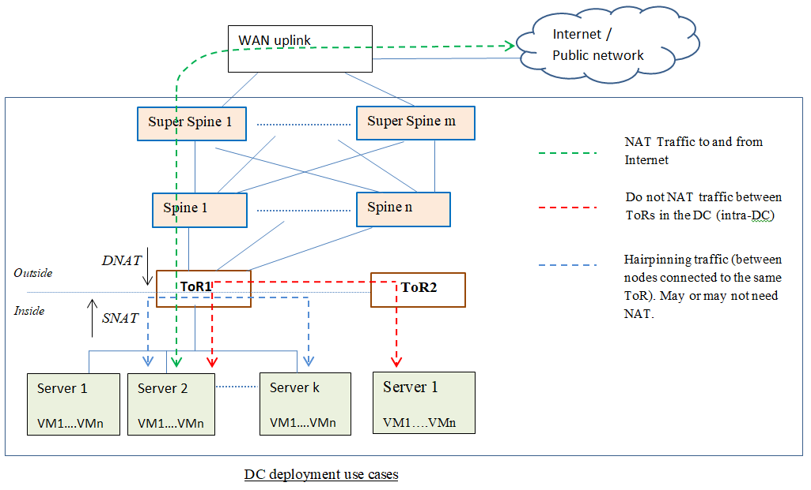
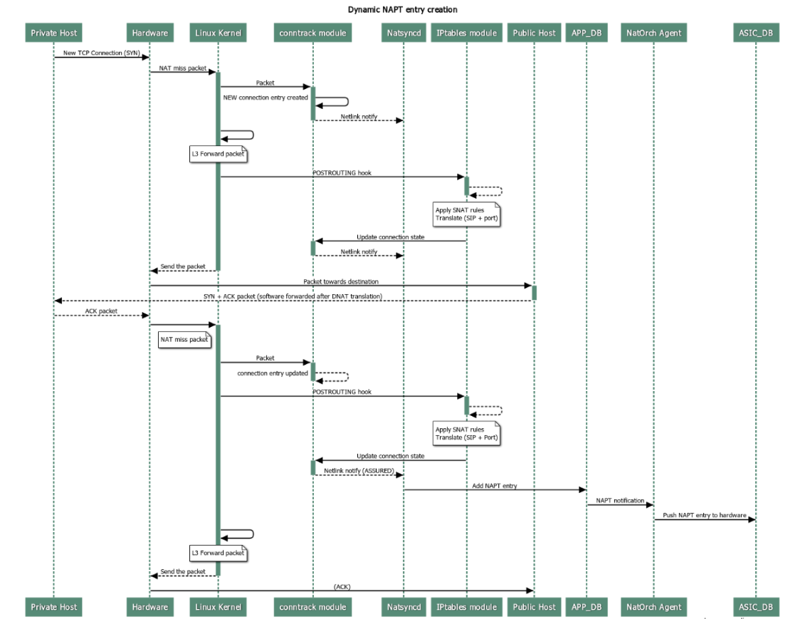
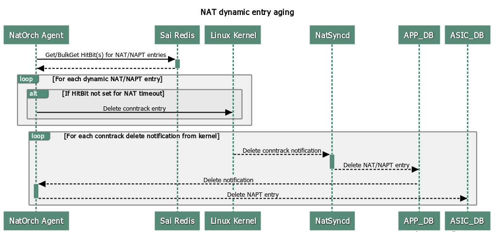

# NAT in SONiC
# High Level Design Document
#### Rev 0.1

# Table of Contents
  * [Revision](#revision)
  * [About this Manual](#about-this-manual)
  * [Scope](#scope)
  * [Definitions/Abbreviation](#definitions-abbreviation)
  * [1 Requirements Overview](#1-requirements-overview)
    * [1.1 Functional Requirements](#1-1-functional-requirements)
    * [1.2 Configuration and Management Requirement](#1-2-configuration-and-management-requirement)
    * [1.3 Scalability Requirements](#1-3-scalability-requirements)
  * [2 Functionality](#2-functionality)
    * [2.1 Target Deployment Use Cases](#2-1-target-deployment-use-cases)
    * [2.2 Functional Description](#2-2-functional-description)
      * [2.2.1 SNAT and DNAT](#2-2-1-snat-and-dnat)
      * [2.2.2 Static NAT/NAPT](#2-2-2-static-nat-napt)
      * [2.2.3 Dynamic NAT/NAPT](#2-2-3-dynamic-nat-napt)
      * [2.2.4 NAT zones](#2-2-4-nat-zones)
      * [2.2.5 Twice NAT/NAPT](#2-2-5-twice-nat-napt)
      * [2.2.6 VRF support](#2-2-7-vrf-support)
  * [3 Design](#3-design)
    * [3.1 Design overview](#3-1-design-overview)
    * [3.2 DB Changes](#3-2-db-changes)
      * [3.2.1 Config DB](#3-2-1-config-db)
      * [3.2.2 ConfigDB Schemas](#3-2-2-configdb-schemas)
      * [3.2.3 APP DB](#3-2-3-app-db)
      * [3.2.4 APP DB Schemas](#3-2-4-app-db-schemas)
      * [3.2.5 COUNTERS DB](#3-2-5-counters-db)
    * [3.3 Switch State Service Design](#3-3-switch-state-service-design)
      * [3.3.1 NatMgr daemon](#3-3-1-natmgr-daemon)
      * [3.3.2 Natsync daemon](#3-3-2-natsync-daemon)
      * [3.3.3 NatOrch Agent](#3-3-3-natorch-agent)
    * [3.4 Linux Integration](#3-4-linux-integration)
      * [3.4.1 Connection tracking](#3-4-1-connection-tracking)
      * [3.4.2 IPtables](#3-4-2-iptables)
      * [3.4.3 Interactions between Kernel and Natsyncd](#3-4-3-interactions-between-kernel-and-natsyncd)
    * [3.5 Docker for NAT](#3-5-docker-for-nat)
    * [3.6 SAI](#3-5-sai)
    * [3.7 Statistics](#3-6-statistics)
    * [3.8 CLI](#3-7-cli)
      * [3.8.1 Data Models](#3-8-1-data-models)
      * [3.8.2 Config CLI commands](#3-8-2-config-cli-commands)
      * [3.8.3 Show CLI commands](#3-8-3-show-cli-commands)
      * [3.8.4 Clear commands](#3-8-4-clear-commands)
      * [3.8.5 Debug commands](#3-8-5-debug-commands)
      * [3.8.6 REST API Support](#3-8-6-rest-api-support)
      * [3.8.7 Example configuration](#3-8-7-example-configuration)
  * [4 Flow Diagrams](#4-flow-diagrams)
    * [4.1 Static NAPT configuration flow](#4-1-static-napt-configuration-flow)
    * [4.2 Dynamic NAPT configuration flow](#4-2-dynamic-napt-configuration-flow)
    * [4.3 Dynamic NAPT entry aging flow](#4-3-dynamic-napt-entry-aging-flow)
  * [5 Serviceability and Debug](#5-serviceability-and-debug)
  * [6 Warm Boot Support](#6-warm-boot-support)
  * [7 Scalability](#7-scalability)
  * [8 Unit Test](#8-unit-test)
  * [9 Unsupported features](#9-unsupported-features)
  
# Revision

| Rev |     Date    |       Author       | Change Description                  |
|:---:|:-----------:|:-------------------|:-----------------------------------|
| 0.1 |  05/22/2019 | Kiran Kella, <br> Akhilesh Samineni       | Initial version                     |


# About this Manual
This document describes the design details of the Network Address Translation (NAT) feature.
NAT router enables private IP networks to communicate to the public networks (internet) by translating the private IP address to globally unique IP address. It also provides security by hiding the identity of the host in private network. For external hosts to be able to access the services hosted in the internal network, port address translation rules are added to map the incoming traffic to the internal hosts.

# Scope
This document describes the high level design details about how NAT works.

# Definitions/Abbreviation
###### Table 1: Abbreviations
| Abbreviation             | Full form                        |
|--------------------------|----------------------------------|
| NAT                      | Network Address Translation      |
| SNAT                     | Source NAT                       |
| DNAT                     | Destination NAT                  |
| PAT                      | Port Address Translation         |
| NAPT                     | Network Address Port Translation <br> NAPT and PAT mean the same and are used inter-changeably in this document. |
| DIP                      | Destination IP address           |
| SIP                      | Source IP address                |
| DC                       | Data Center                      |
| ToR                      | Top of the Rack                  |
| ACL                      | Access Control List              |

# 1 Requirements Overview
## 1.1 Functional Requirements
The requirements for NAT are: 

1.0 NAT/NAPT is a method by which many network addresses and their TCP/UDP ports are translated into a single/multiple network address(es) and TCP/UDP ports, deployed in Enterprise and Data Center scenarios. It can be viewed as a privacy mechanism since the actual identity of the private hosts is not visible to external hosts.

1.1 NAT is standardized through RFC 2633, RFC 3022, RFC 4787.

2.1.0 Provide the ability to create/delete Static Basic NAT entries (one-to-one IP address translation) mapping from public IP address to an internal host's IP address.

2.1.1 Provide the ability to create/delete Static NAPT (PAT) entries that map an L4 port on the Router's public IP address to an internal host's IP address + L4 port.

2.1.2 Provide ability to do dynamic NAT from internal host IP addresses to the available range of public IP addresses.

2.1.3 Provide ability to do dynamic NAPT (or PAT) from internal host IP addresses to the public IP address + L4 ports range.

2.1.4 PAT entries are configurable per IP protocol type. Allowed IP protocols are TCP and UDP.

2.1.5 Configure NAT pool that specifies the range of IP addresses and range of L4 ports to do dynamic network address translation to.

2.1.6 More than 1 NAT pool can be created, limited to a maximum number of 16 pools. Same applies to NAT bindings.

2.1.7 Access lists are used to define the set of hosts that are subjected to dynamic NAT/NAPT, by binding ACL and NAT pool together.

2.1.8 NAT pool binding with no associated ACL, allows all hosts to be subjected to dynamic NAT/NAPT.

2.1.9 Static NAT/NAPT entries are not timed out. They have to be unconfigured explicitly.

2.1.10 If Static NAPT entry is same as the dynamic NAPT entry, entry is retained as Static NAPT entry.

2.1.11 For the NAT/NAPT entries created statically or dynamically, bi-directional NAT translations can be performed.

2.1.12 Dynamic NAPT entry is timed out if it is inactive in the hardware for more than the configurable age timeout period.

2.1.13 Dynamic and Static NAT/NAPT entries should persist across warm reboot with no traffic disruption to the active flows.

2.2.0 Provide the ability for Twice NAT that translates both Source and Destination IP addresses when crossing the zones.

2.2.1 Provide the ability for Twice NAPT that translates both Source and Destination IP addresses and L4 ports when crossing the zones.

2.3.0 ICMP packets are translated via NAT or NAPT rules in the Linux kernel.

2.4.0 The hardware NAT table full condition is handled gracefully by logging error log message.

2.5.0 The SNAT or DNAT miss packets are rate limited to CPU.

2.5.1 The NAT miss packets are processed from a higher priority CPU COS Queue than the Broadcast/Unknown Multicast packets.

3.0 ACL and NAT pool binding is applicable on the valid L3 interfaces (VLAN, Ethernet, PortChannel) defined by the ACL TABLE entry.

3.1 The L3 ports on which the NAT ACL is applied are in a different NAT zone compared to the port on which the NAT Pool IP address is based on.

3.2 Provide configuration of zones on L3 interfaces.

4.0 Provide configurable age timeout interval for the inactive dynamic UDP NAT entries (in seconds). Default is 300 secs. Range is from 120 sec to 600 secs.

4.1 Provide configurable age timeout interval for the inactive dynamic TCP NAT entries (in seconds). Default is 86400 secs. Range is 300 sec to 432000 secs (5 days).

5.0 Should be able to ping from internal host to an outside host via NAPT.

5.1 Should be able to traceroute from internal host to an outside host via NAPT.

5.2 Provide support for translation statistics per zone and per NAT flow.

5.3 Ability to clear the NAT translation table entries.

5.4 Ability to clear the NAT translation statistics.

5.2 Ability to stop and start the NAT docker service.

5.3 Ability to enable the logging at different severity levels of the NAT module.

## 1.2 Configuration and Management Requirements
Configuration of the NAT feature can be done via:

- JSON config input
- Incremental CLI

## 1.3 Scalability Requirements
Ability to support the scale of up to 40K Bi-directional NAT entries, but this is SAI capability dependent.

# 2 Functionality
## 2.1 Target Deployment Use Cases
NAT feature is targeted for DC and Enterprise deployments.

In DC deployments, the ToR switch can enable NAT feature to translate the traffic from/to the attached Servers running in the private network and the public domain.


In Enterprise deployments, the Customer Edge switch or other Customer premises equipment implements the NAT firewall functionality for translating the traffic between the internal enterprise hosts and the public domain.


## 2.2 Functional Description
### 2.2.1 SNAT and DNAT
Source NAT translation involves translating the Source IP address (optionally along with L4 port) in the IP packets crossing from inside the private network to public network. Destination NAT translation involves translating the Destination IP address (optionally along with L4 port) in the IP packets crossing from public network to private network. The IP header checksum and the L4 header checksum are recalculated as the header contents are changed due to the NAT translation.

### 2.2.2 Static NAT/NAPT
User can configure a static binding of IP address + optional L4 port between different zones (like for eg., binding from a [Public IP address + optional L4 port] to a designated [Private host IP address + optional L4 port]). With no optional L4 port configuration, the translation is only from private IP to public IP and vice versa, which is referred as basic NAT. Any conflicts should be avoided  between the IP addresses in the Static NAT config and the Static NAPT config as there is no order or priority ensured in the processing of the conflicting rules. 

Static NAT/NAPT entries are not timed out from the translation table.

### 2.2.3 Dynamic NAT/NAPT
On the NAT router, when the public addresses are limited and less in number than the internal network addresses, the many-to-one mapping is needed from the [Private IP address + L4 port] to a [Public IP address + L4 port]. This is where  multiple internal IPs map to a single public IP by overloading with different L4 ports. When the internally originated outbound traffic hits the NAT router, if a matching SNAT entry exists it is translated. Else the packet is trapped to CPU so that a new SNAT mapping is allocated for the [Private IP address + L4 port].

NAT pool is configured by the user to specify the public IP address (optionally an IP address range) and the L4 port range to overload the private IP address + L4 port to.

ACL is configured to classify a set of hosts to apply the NAT translation on. ACL is bound to a NAT pool to NAT translate the ACL allowed hosts to the public IP + L4 port defined by the pool. Packets not matching the ACL are L3 forwarded in the regular fashion.

Dynamically created NAPT entries are timed out after a period of inactivity in the hardware. The inactivity timeout periods are independently configurable for TCP and UDP NAT entries.

The dynamic port allocation from the pool is done in a random manner. When the pool is exhausted, new incoming connections are no longer NAT'ted. Only when the inactive entries are released are the new connections dynamically mapped to the freed up ports.

#### 2.2.3.1 Full Cone NAT
When the first connection from a particular internal IP + L4 port is dynamically SNAT mapped to an external IP + L4 port, the SNAT and the corresponding DNAT entries are added for that mapping in the hardware.
Subsequently any new connections from the same internal IP + L4 port to new destination end points use the same mapping. As well, traffic sent by any external host to this external IP + L4 port is NAT'ted back to the same internal IP + L4 port. This behavior model is referred to as Full Cone NAT.

### 2.2.4 NAT zones
NAT zones refer to different network domains between which the NAT translation happens when the packet crosses between them. NAT zones are also referred to as NAT realms.
NAT zones are created by configuring zone-id per L3 interface. The L3 interface referred to for NAT purposes can be an Ethernet, VLAN or PortChannel interface that are configured with IP address(es).

In this document, the interface that is towards the private networks (private realm) on the NAT router is referred to as an inside interface.
And the interface that is towards the public network (public realm) on the NAT router is referred to as outside interface.
By default, L3 interface is in NAT zone 0 which we refer to as an inside interface.

NAT/NAPT is performed when packets matching the configured NAT ACLs cross between different zones.
The source zone of a packet is determined by the zone of the interface on which the packet came on. And the destination zone of the packet is determined by the zone of the L3 next-hop interface from the L3 route lookup of the destination.

Currently only 2 zones are supported, which correspond to the inside interface and the outside interface.

Any inbound traffic ingressing on the outside interface that is L3 forwarded on to the inside interface, is configured by user via Static NAT/NAPT entries to be DNAT translated.
Any outbound traffic ingressing on the inside interface is configured to be dynamically SNAT translated.

The public IP address of the interface deemed to be outside interface, is referred to in the NAT pool configuration.

The allowed range of configurable zone values is 0 to 3.

### 2.2.5 Twice NAT/NAPT
Twice NAT or Double NAT is a NAT variation where both the Source IP and the Destination IP addresses are modified as a packet crosses the address zones. It is typically used in  the communication between networks with overlapping private addresses.

The configuration for Twice NAT/NAPT is achieved in 2 ways:
- Putting two Static NAT/NAPT entries in the same Group ('twice_nat_id' value).
- Putting a Dynamic NAT/NAPT Binding and a Static DNAT type NAT/NAPT entry in the same Group ('twice_nat_id' value).
  When a host matching a dynamic NAT pool binding sends traffic to host with a matching DNAT Static NAT/NAPT entry in the same 'twice_nat_id' group, a bi-directional Twice NAT/NAPT entry is created for the traffic flow.

### 2.2.6 VRF support
NAT is supported in the default Virtual Routing and Forwarding (VRF) domain only. 
It is assumed that the Static or Dynamic NAT configurations do not include the interfaces in non-default VRFs.

# 3 Design
## 3.1 Design overview
The design overview at a high level is as below. The details are explained in the following subsections.
- Configuration tables and schema for provisioning the static and dynamic NAT/NAPT entries.
- Design is centered around the iptables and connection tracking modules in the kernel. 
- NAT applications configures the NAT configuration rules using iptables in the kernel.
- The iptables and connection tracking modules in the kernel are leveraged to handle the NAT miss packets to create the NAT/NAPT entries, that are added to the hardware.

## 3.2 DB Changes
### 3.2.1 Config DB
Following table changes are done in Config DB.

#### 3.2.1.1 STATIC_NAPT Table
```
STATIC_NAPT|{{global_ip}}|{{ip_protocol}}|{{global_l4_port}} 
    "local_ip": {{ip_address}}
    "local_port" :{{l4_port}}
    "nat_type"   :{{snat-or-dnat}}      (OPTIONAL)
    "twice_nat_id" :{{twice-nat-id}}    (OPTIONAL)
```

```
This config tells to do:
- If the "nat_type" is 'dnat':
  - DNAT translation of the DIP/DPORT in the IP packet from 'global_ip' address and 'global_port' to 'local_ip' address and 'local_l4_port' when the packet crosses the zones.
  - SNAT translation of the SIP/SPORT in the IP packet from 'local_ip' address and 'local_port'
  to 'global_ip' address and 'global_l4_port' when the packet crosses the zones.
- If the "nat_type" is 'snat':
  - SNAT translation of the SIP/SPORT in the IP packet from 'global_ip' address and 'global_port' to 'local_ip' address and 'local_l4_port' when the packet crosses the zones.
  - DNAT translation of the DIP/DPORT in the IP packet from 'local_ip' address and 'local_port'
  to 'global_ip' address and 'global_l4_port' when the packet crosses the zones.
- The default value of nat_type is 'dnat' if the option is not given.
```

#### 3.2.1.2 STATIC_NAT Table
```
STATIC_NAT|{{global_ip}} 
    "local_ip": {{ip_address}}
    "nat_type"   :{{snat-or-dnat}}      (OPTIONAL)
    "twice_nat_id" :{{twice-nat-id}}    (OPTIONAL)
```

```
This config tells to do:
- If the "nat_type" is 'dnat':
  - DNAT translation of the DIP in the IP packet from 'global_ip' address to 'local_ip' address when the packet crosses the zones.
  - SNAT translation of the SIP in the IP packet from 'local_ip' address to 'global_ip' address when the packet crosses the zones.
- If the "nat_type" is 'snat':
  - SNAT translation of the SIP in the IP packet from 'global_ip' address to 'local_ip' address when the packet crosses the zones.
  - DNAT translation of the DIP in the IP packet from 'local_ip' address to 'global_ip' address when the packet crosses the zones.
- The default value of nat_type is 'dnat' if the option is not given.
```
#### 3.2.1.3 NAT_GLOBAL Table
```
NAT_GLOBAL|Timeouts
    "nat_tcp_timeout": {{timeout_in_secs}}
    "nat_udp_timeout": {{timeout_in_secs}}
```

#### 3.2.1.4 NAT_POOL Table
```
NAT_POOL|{{pool_name}} 
    "nat_ip": {{ip_address}} (or) {{ip_addr_start}}-{{ip_addr_end}} 
    "nat_port": {{start_l4_port}}-{{end_l4_port}}  (OPTIONAL)
```

#### 3.2.1.5 ACL to Pool Bindings
```
NAT_BINDINGS|{{binding-name}}
    "nat_pool": {{pool-name}}
    "access_list": {{access-list-name}} (OPTIONAL) 
    "nat_type": {{snat-or-dnat}}		(OPTIONAL)
    "twice_nat_id" :{{twice-nat-id}}    (OPTIONAL)
```
```
This config tells to do:
- The hosts that are denied the NAT action by the ACL are not subjected to NAT but follow
  	the normal L3 forwarding.
- The hosts that are permitted by the ACL are subjected to dynamic NAT or NAPT as per the pool. If no ACL is provided, all hosts will be subjected to NAT.
- Based on the nat_type, dynamic source NAPT or dynamic destination NAPT is to be done for the hosts allowed by the ACL. Currently only 'snat' nat_type is supported, which means the NAT_BINDINGS is used to do the dynamic source NAPT translation only. Default nat_type is 'snat' if the attribute is not specified.
- NAT_BINDING entry and a STATIC NAT entry that are in the same twice_nat_id are used to create a double NAT entry.
```

#### 3.2.1.6 Zone configuration
```
VLAN|{{vlan-name}} 
    "nat_zone": {{zone-value}}

PORT|{{ethernet-name}} 
    "nat_zone": {{zone-value}}

PORTCHANNEL|{{portchannel-name}} 
    "nat_zone": {{zone-value}}
```

### 3.2.2 ConfigDB Schemas

```
; Defines schema for STATIC_NAPT configuration attributes
key                                = STATIC_NAPT:global_ip:ip_protocol:global_l4_port  ; Static NAPT mapping configuration
; field                            = value
LOCAL_IP                           = ipv4          ; Local private IP address
LOCAL_PORT                         = port_num      ; Local tcp/udp port number
NAT_TYPE                           = SNAT/DNAT     ; Type of NAT to be done
TWICE_NAT_ID                       = twice_nat_id  ; Group id used for twice napt 
; value annotations
ipv4          = dec-octet "." dec-octet "." dec-octet "." dec-octet     
dec-octet     = DIGIT                     ; 0-9  
                  / %x31-39 DIGIT         ; 10-99  
                  / "1" 2DIGIT            ; 100-199  
                  / "2" %x30-34 DIGIT     ; 200-249

port_num      = 1*5DIGIT   ; a number between 1 and 65535
twice_nat_id  = 1*4DIGIT   ; a number between 1 and 9999
```

```
; Defines schema for STATIC_NAT configuration attributes    ; Static NAT mapping configuration
key                         = STATIC_NAT:global_ip
; field                     = value
LOCAL_IP                    = ipv4           ; Local private IP address
NAT_TYPE                    = SNAT/DNAT      ; Type of NAT to be done
TWICE_NAT_ID                = twice_nat_id   ; Group Id used for twice nat 

; value annotations
ipv4          = dec-octet "." dec-octet "." dec-octet "." dec-octet     
dec-octet     = DIGIT                     ; 0-9  
                  / %x31-39 DIGIT         ; 10-99  
                  / "1" 2DIGIT            ; 100-199  
                  / "2" %x30-34 DIGIT     ; 200-249
twice_nat_id  = 1*4DIGIT   ; a number between 1 and 9999
```

```
; Defines schema for NAT_GLOBAL configuration attributes               ; Global attributes for NAT
key                            = Timeouts
; field                        = value
NAT_TCP_TIMEOUT                = 1*3DIGIT         ; Timeout in secs (Range: 120 sec - 600 sec)
NAT_UDP_TIMEOUT                = 1*6DIGIT         ; Timeout in secs (Range: 300 sec - 432000 sec)
```

```
; Defines schema for NAT_POOL table
key                            = NAT_POOL:pool_name         ; NAT Pool configuration 
; field                        = value
NAT_IP                         = ipv4 (or) ipv4_L - ipv4_H      ; range of IPv4 addresses
NAT_PORT                       = port_num_L - port_num_H 		; range of L4 port numbers

; value annotations
port_num_L      = 1*5DIGIT   ; a number between 1 and 65535
                             ; port_num_L < port_num_H
port_num_H      = 1*5DIGIT   ; a number between 1 and 65535
                             ; port_num_L < port_num_H
```
	
```
; Defines schema NAT Bindings configuration attributes
key                          = NAT_BINDINGS:bindings-name
; field                      = value
ACCESS_LIST                  = 1*64VCHAR          ; Name of the ACL
NAT_POOL                     = 1*64VCHAR          ; Name of the NAT pool
NAT_TYPE                     = SNAT/DNAT          ; Type of NAT to be done
TWICE_NAT_ID                 = 1*4DIGIT           ; a number between 1 and 9999 

```
```
; Defines schema for NAT zone configuration
key                          = VLAN:vlan-name
; field                      = value
NAT_ZONE                     = 1*1DIGIT          ; a number in the range 0-3

key                          = PORT:port-name
; field                      = value
NAT_ZONE                     = 1*1DIGIT          ; a number in the range 0-3

key                          = PORTCHANNEL:portchannel-name
; field                      = value
NAT_ZONE                     = 1*1DIGIT          ; a number in the range 0-3
```

Please refer to the [schema](https://github.com/Azure/sonic-swss/blob/master/doc/swss-schema.md) document for details on value annotations. 

### 3.2.3 APP DB
New table is introduced to specify NAT translation entries.

```
NAPT_TABLE:{{ip_protocol}}:{{ip}}:{{l4_port}}
    "translated_ip"     :{{ip-address}}
    "translated_l4_port":{{l4_port}}
    "nat_type"          :((snat-or-dnat}} 
    "entry_type"        :{{static_or_dynamic}}

NAT_TABLE:{{ip}}
    "translated_ip" :{{ip-address}}
    "nat_type"      :((snat-or-dnat}} 
    "entry_type"    :{{static_or_dynamic}}

NAPT_TWICE_TABLE:{{ip_protocol}}:{{src_ip}}:{{src_l4_port}}:{{dst_ip}}:{{dst_l4_port}}
    "translated_src_ip"     : {{ip-address}}
    "translated_src_l4_port": {{l4_port}}
    "translated_dst_ip"     : {{ip-address}}
    "translated_dst_l4_port": {{l4-port}}
    "entry_type"            : {{static_or_dynamic}}
     
NAT_GLOBAL_TABLE:Timeouts
    "nat_tcp_timeout": {{timeout_in_secs}}
    "nat_udp_timeout": {{timeout_in_secs}}
```

### 3.2.4 APP DB Schemas

```
; Defines schema for the NAPT translation entries
key                                   = NAPT_TABLE:ip_protocol:ip:l4_port     ; NAPT table
; field                               = value
TRANSLATED_IP                         = ipv4
TRANSLATED_L4_PORT                    = port_num
NAT_TYPE                              = "snat" / "dnat"
ENTRY_TYPE                            = "static" / "dynamic"

; value annotations
port_num      = 1*5DIGIT   ; a number between 1 and 65535
```

```
; Defines schema for the NAT translation entries
key                                   = NAT_TABLE:ip           ; NAT table
; field                               = value
TRANSLATED_IP                         = ipv4
NAT_TYPE                              = "snat" / "dnat"
ENTRY_TYPE                            = "static" / "dynamic"
```

```
; Defines schema for the Twice NAPT translation entries

key                                   = NAPT_TWICE_TABLE:ip_protocol:src_ip:src_l4_port:dst_ip:dst_l4_port
TRANSLATED_SRC_IP                     = ipv4
TRANSLATED_SRC_L4_PORT                = port_num
TRANSLATED_DST_IP                     = ipv4
TRANSLATED_DST_L4_PORT                = port_num
ENTRY_TYPE                            = "static" / "dynamic" 
```

```
; Defines schema for the NAT global table
key                                   = NAT_GLOBAL:Timeouts        ; NAT global table
; field                               = value
NAT_TCP_TIMEOUT                = 1*3DIGIT         ; Timeout in secs (Range: 120 sec - 600 sec)
NAT_UDP_TIMEOUT                = 1*6DIGIT         ; Timeout in secs (Range: 300 sec - 432000 sec)
```

### 3.2.5 COUNTERS DB
The following new counters are available per zone and per NAT entry:
```
"COUNTERS:oid:<nat_stats_oid>"
    SAI_NAT_DNAT_DISCARDS
    SAI_NAT_SNAT_DISCARDS
    SAI_NAT_DNAT_TRANSLATION_NEEDED
    SAI_NAT_SNAT_TRANSLATION_NEEDED
    SAI_NAT_DNAT_TRANSLATIONS
    SAI_NAT_SNAT_TRANSLATIONS

COUNTERS_NAT_STATS_NAME_MAP does the mapping from oid:<nat_stats_oid> to the zone or NAT entry name.

```

## 3.3 Switch State Service Design
Following changes are done in the orchagent. 

### 3.3.1 NatMgr daemon
 NatMgrd gets the STATIC_NAPT, STATIC_NAT, NAT_POOL, NAT_GLOBAL, NAT_BINDINGS config changes from CONFIG_DB.
 NatMgr is responsible for pushing the Static NAT/NAPT entries and the NAT_GLOBAL configuration into the APP_DB. It also programs the Static NAT/NAPT entries and the NAT_POOL to ACL binding configuration as iptable rules in the kernel.

Before acting upon the Static NAPT configuration, NatMgrd checks with the STATE_DB that the matching IP interface is configured in the system (state == ok). 

For a STATIC_NAPT entry and the interface configuration as below: 
```
STATIC_NAPT|65.55.42.1|TCP|1024 
    "local_ip": 20.0.0.1
    "local_port" :6000 
    "nat_type": "dnat"

INTERFACE|Ethernet15|65.55.42.1/24
...

PORT|Ethernet15
    "nat_zone": 1

```
the following iptable rules are added for inbound and outbound directions in the nat table as below:
```
iptables -t nat -A PREROUTING -i Ethernet15 -p tcp -j DNAT -d 65.55.42.1 --dport 1024 --to-destination 20.0.0.1:6000
iptables -t nat -A POSTROUTING -o Ethernet15 -p tcp -j SNAT -s 20.0.0.1 --sport 6000 --to-source 65.55.42.1:1024
```
They essentially tells the kernel to do the DNAT port translation for any incoming packets, and the SNAT port translation for the outgoing packets.

If there are any ACL to NAT pool bindings configured, the NatMgrd listens to the notifications from the ACL tables and the ACL Rule configuration tables. On start-up, the NatMgrd queries the ACL Configuration for the ACLs bound to NAT pools. Once the ACL rules are retrieved, they are updated as iptables filtering options for the SNAT configuration.

Before acting upon the Dynamic NAPT Pool configuration on an interface, NatMgrd checks with the STATE_DB that the matching outside IP interface is created in the system (state == ok).

For the NAT_POOL configuration as below that is configured to match an ACL,
```
NAT_POOL|pool1
    "nat_ip": 65.55.42.1 
    "nat_port": 1024-65535 

INTERFACE|Ethernet15|65.55.42.1/24
...

ACL_TABLE|10
    "stage": "INGRESS", 
    "type": "L3", 
    "policy_desc": "nat-acl", 
    "ports": "Vlan2000"

ACL_RULE|10|1
    "priority": "20", 
    "src_ip": "20.0.1.0/24",
    "packet_action": "do_not_nat"

ACL_RULE|10|2
    "priority": "10", 
    "src_ip": "20.0.0.0/16", 
    "packet_action": "forward"

NAT_BINDINGS|nat1    
    "access_list": "10"
    "nat_pool": "pool1
    "nat_type": "snat"

PORT|Ethernet15
    "nat_zone": 1
  
```
the following iptable rules for udp, tcp, icmp protocol types are added as SNAT rules in the nat table:
```
iptables -t nat -A POSTROUTING -p tcp -s 20.0.1.0/24 -j RETURN
iptables -t nat -A POSTROUTING -p udp -s 20.0.1.0/24 -j RETURN
iptables -t nat -A POSTROUTING -p icmp -s 20.0.1.0/24 -j RETURN

iptables -t nat -A POSTROUTING -p tcp -s 20.0.0.0/16 -j SNAT -o Ethernet15 --to-source 65.55.42.1:1024-65535 --random
iptables -t nat -A POSTROUTING -p udp -s 20.0.0.0/16 -j SNAT -o Ethernet15 --to-source 65.55.42.1:1024-65535 --random
iptables -t nat -A POSTROUTING -p icmp -s 20.0.0.0/16 -j SNAT -o Ethernet15 --to-source 65.55.42.1:1024-65535 --random
```
They tell the kernel to do the dynamic SNAT L4 port mapping or icmp query-id mapping dynamically for any incoming packets permitted by the ACL (20.0.0.0/16 subnet hosts excepting 20.0.1.0/24 subnet hosts), that are routed and before being sent out on the interface Ethernet15.

The above configured iptables rules in the kernel look like:
```
root@sonic:/home/admin# iptables -t nat -v -L
Chain PREROUTING (policy ACCEPT 0 packets, 0 bytes)
 pkts bytes target     prot opt in     out     source               destination         
    0     0 DNAT       tcp  --  Ethernet15 any     anywhere             65.55.42.1           tcp dpt:1024 to:20.0.0.1:6000

Chain POSTROUTING (policy ACCEPT 0 packets, 0 bytes)
 pkts bytes target     prot opt in     out     source               destination         
    0     0 SNAT       tcp  --  any    Ethernet15  20.0.0.1             anywhere             tcp spt:x11 to:65.55.42.1:1024
    0     0 RETURN     icmp --  any    Ethernet15  20.0.1.0/24             anywhere      
    0     0 RETURN     udp  --  any    Ethernet15  20.0.1.0/24             anywhere            
    0     0 RETURN     tcp  --  any    Ethernet15  20.0.1.0/24             anywhere             
    0     0 SNAT       icmp --  any    Ethernet15  20.0.0.0/16             anywhere             to:65.55.42.1:1024-65535
    0     0 SNAT       udp  --  any    Ethernet15  20.0.0.0/16             anywhere             to:65.55.42.1:1024-65535
    0     0 SNAT       tcp  --  any    Ethernet15  20.0.0.0/16             anywhere             to:65.55.42.1:1024-65535
```
In the NAT pool config, user can also give the NAT IP address range as below:
```
NAT_POOL|pool1
    "nat_ip": 65.55.42.1-65.55.42.3 
    "nat_port": 1024-65535
```
In which case, the Source NAPT translations are done to pick the outside SIP + L4 port from the given IP address range and the given L4 port range.
It is the responsibility of the administrator to ensure that the addresses in the IP address range are assigned on the outside IP interface.

#### 3.3.1.1 ACL usage
ACLs are installed in the hardware independently by the ACL OrchAgent module.

ACL rules are added with 'do-not-nat' action for the hosts for which the NAT is to be avoided, and with 'forward' action for the hosts for which the NAT is to be performed.

The action 'do-not-nat' tells the hardware to skip doing NAT zone checks and NAT processing for the packet, and instead the packet is L3 forwarded. For the rest of the permitted packets, the NAT processing is done in the hardware.
If a matching SNAT entry or DNAT entry does not exist in the hardware, the packets are trapped to CPU as NAT miss packets to be processed by the kernel software forwarding path.

Corresponding to the ACL, the equivalent deny and permit rules are added in the iptables so that the intended NAT miss packets are dynamically SNAT'ted in the kernel.

When the ACL that is bound to the NAT pool is deleted, the corresponding iptables SNAT rules are deleted in the kernel.
When the ACL rules are created or modified, the corresponding iptables SNAT rules are updated in the kernel.
Multiple ACLs can be bound to a single NAT pool. 1 ACL can be bound atmost to a single NAT pool.

If there is no matching ACL configured, it is treated as 'implicit permit all' and hence the corresponding NAT pool in the binding is applied on all the traffic.

Following match actions of the ACL are handled to match against the traffic for dynamic SNAT mapping:
- Source IP address or Subnet
- Destination IP address or Subnet
- Source L4 port or L4 port range
- Destination L4 port or L4 port range
- IP protocol

#### 3.3.1.2 IP Interface config events
When the IP on the outside NAT zone interface is deleted, for any matching NAT pool and the matching Static NAT/NAPT entries, the corresponding iptables SNAT rules and the Static DNAT rules are deleted in the kernel.
The conntrack entries in the kernel and the APP_DB entries are aged out eventually by the inactivity period timeouts since there will not be any NAT traffic crossing over the deleted IP interfaces.

#### 3.3.1.3 Interface link events
When the outside NAT zone interface's link goes down, the iptables NAT rules, the connctrack entries and the APP_DB dynamic entries are not removed immediately.

This is done for the reasons below:

	- The temporary link flap events happening on the NAT outside interface should not
	  affect the NAT translation entries (corresponding to the end to end TCP/UDP sessions).
	- To avoid performance issues during link flaps.
	- The dynamic entries are aged out eventually due to inactivity timeout in case
	  the NAT outside interface is link down for more than the timeout period.

#### 3.3.1.4 Clear command
Natmgrd handles the clear command issued by the administrator to clear the dynamic entries in the NAT translation table. Natmgrd flushes the conntrack table that in turn result in deleting the entries in the APP_DB by the Natsyncd daemon. 

### 3.3.2 Natsync daemon

NatSyncd listens to the conntrack netlink notification events from the kernel for the creation, update and removal events of the connections in the conntrack table.
Once the notifications for SNAT and DNAT entries are received, they are pushed into the NAT_TABLE/NAPT_TABLE/NAPT_TWICE_TABLE in the APP_DB to be consumed by the NatOrch Agent. More details in the section 3.4.

### 3.3.3 NatOrch Agent
NAT feature is enabled globally in the hardware by default by NatOrch Agent during startup.
The SNAT or DNAT miss packets are rate limited to CPU @ 600pps.

NatOrch is responsible for the following activities:

   - Listens on the notifications in the NAT, NAPT, NAPT_TWICE tables in the APP_DB, picks the notifications, translates them to SAI objects and pushes them to ASIC_DB to be consumed by Syncd. For every single NAT/NAPT entry, NatOrch pushes 1 SNAT entry and 1 DNAT entry (for inbound and outbound directions) to the ASIC_DB via sairedis.
   - Monitors the translation activity status every sampling period for each of the NAT/NAPT entries in the hardware. Sampling period is chosen to be a optimal value of 60 seconds. If the NAPT entry is inactive for the duration of the NAT timeout period, the entry is removed. Static NAT/NAPT entries are not monitored for the inactivity. They have to be unconfigured explicitly to be removed from the hardware.

### 3.3.3.1 Interaction with NeighOrch
NatOrch registers as observer with the NeighOrch so that the DNAT entry and the corresponding SNAT entry can be pushed to ASIC_DB by NatOrch, only if the corresponding inside zone neighbor's entry is created in NeighOrch.
When the Neighbor entry is deleted in NeighOrch, the corresponding DNAT and SNAT entries are removed from the hardware.
 
### 3.3.3.2 Aging inactive entries
Since the active data traffic for the TCP/UDP connections are not flowing through the kernel, the timing out of the connection tracking entries is the responsibility of the application.
In order to query the translation activity status for each NAT entry from the hardware, NatOrch agent maintains the internal cache of all the NAT entries that are received from the APP_DB.
NatOrch queries the translation activity status of each of the dynamic entries every sampling period. Static entries are not monitored for inactivity. If the dynamic entry is not active for 2 consecutive sampling periods, the entry is removed from the connection tracking table in the Kernel. Entries are removed from the kernel to keep the connections in the kernel in sync with the entries in the hardware. That will trigger the removal of the entries from APP_DB and ASIC_DB. 

### 3.3.3.3 Handling the failed NAT entries
NatOrch listens on the notifications of the failed NAT entries from the Syncd.
For the failed NAT entries, NatOrch removes the corresponding entries from the internal cache and from the conntrack table. That will remove the entry from the APP_DB.
 
The overall data block diagram for NAT in SONiC is captured below.
 

 
## 3.4 Linux Integration
### 3.4.1 Connection tracking
Connection tracking module in the kernel creates the connection entries and maintains their states as and when the packet traverses the forwarding path in the kernel. It keeps track of all the connections created in the system. IPtables module consults the connections tuples tracked in the system during NAT process and updates the connections.

Connections when added, deleted or updated in the connection tracking system are notified via netlink interface to interested listeners (natsyncd in our case).

### 3.4.2 IPtables
In SONiC, the core NAT logic which involves the (IP + port) translation dynamically is the iptables module in the kernel.
The iptables uses the Netfilter hooks in the kernel to execute its NAT'ting rules at different points in the packet forwarding path.

The important hooks that Iptables registers with Netfilter are the ones for PREROUTING and POSTROUTING. The DNAT rules if available are applied in the PREROUTING chain and SNAT rules if available are applied in the POSTROUTING chain.

The packets that are going from one zone to another zone in the hardware are trapped to CPU as NAT miss packets if there are no matching NAT entries in the hardware. Such packets are received by the KNET kernel module and passed on to the netdev interface (corresponding to the interface the packet came on) in the Network stack.

Before the L3 forwarding is done in the Kernel, the iptables rules in PREROUTING chain are applied. If there are any DNAT rules that the packets match against, translate the DIP and L4 port to the internal IP and L4 port as applicable. In this process, the DNAT state and DIP of the connection entry in the connection tracking table are updated.

After the L3 forwarding is done and before the packet is about to be sent out on the NAT outside interface, the rules in the POSTROUTING chain are applied which do the SNAT (translate the SIP + L4 port to the public IP + L4 port). In this process, the SNAT state and SIP of the connection entry in the connection tracking table are updated.

As long as the hardware entry is not installed, the NAT translation and forwarding is done in the Linux kernel.

### 3.4.3 Interactions between Kernel and Natsyncd
Following sections explain how the NAT entries corresponding to the connections originated from the private networks are created in the hardware.
 
#### 3.4.4.1 NAT entries for TCP traffic
For the TCP traffic initiated by the hosts in the private zone, when the TCP SYN packet reaches the NAT router, if there is no matching NAT entry, the NAT miss is reported and the packet is trapped to CPU. The connection entry is created in the conntrack table with NEW conntrack state. The packet is L3 forwarded if a matching route and the nexthop are found. Once the packet is forwarded and ready to be sent out on the NAT outside interface, the packet's SIP and L4 port are translated and the connection entry is updated. As well the connection's state is updated with SNAT and/or DNAT status flag.

Since the dynamic NAPT entry creation logic is driven by the kernel's iptables rules, we allow at least the first 2 TCP packets (SYN, SYN+ACK) to be NAT translated and software forwarded in the Linux kernel. Once the SYN+ACK packet is also received in the reverse direction, the conntrack status of the connection is set to ASSURED flag (meaning the connection entry will not be aged out).

Only the TCP connection entries that are marked as ASSURED in the conntrack table are considered by Natsyncd to be added in the APP_DB.This is done for the below reasons:
1. Since we do not want to use the NAT table space in the hardware to be filled up with any uni-directional SYN flood traffic.
2. So that the kernel does not timeout the unidirectional SYN-SENT connection state entries early (if only SYN packet is software forwarded in the kernel and the SYN+ACK packet is hardware forwarded).
3. To have the conntrack TCP entries and the hardware entries in sync.

NatSyncd checks that the TCP connection's parameters reported by the conntrack netlink event have the SNAT status and the ASSURED status set, before pushing the entry to the APP_DB.

The conntrack entry notified by the kernel has the SIP and DIP fields in both directions of the flow. If only SIP or DIP is different in both directions, it is a case of Single NAT/NAPT. If both the SIP and DIP are different in both directions, it is a case of Twice NAT/NAPT.

The conntrack netlink DESTROY events result in the deletion of the NAT entry from the APP_DB. The DESTROY events are received on the timeouts of the TCP connections (for eg., SYN-SENT state timeout) in the connection tracking table.

The TCP FIN flagged packets are not trapped to CPU. Hence the NAT entries for the closed TCP connections are not removed immediately from the hardware. They are timed out eventually based on the translation inactivity and removed.

#### 3.4.4.2 NAT entries for UDP traffic
Unlike TCP traffic, UDP traffic has no connection establishment phase.
The first UDP packet in a session originated in the private zone raises a NAT miss on reaching the NAT router. The UDP connection entry is created in the tracking table and SNAT translation is applied on the connection.
NatSyncd considers the UDP connections that have the conntrack entry state as SNAT and adds them to the APP_DB.
The timing out of the UDP connections in the conntrack table is the responsibility of the NatOrch.

#### 3.4.4.3 NAT entries for ICMP traffic
ICMP query messages and responses (like echo requests/responses) resulting in the NAT miss are also subjected to dynamic SNAT with a mapping to the overloaded ICMP identifier on the public IP from the local ICMP identifier and private IP.

ICMP traffic that needs to be NAT translated (crossing across different zones) is software forwarded in the Linux kernel. ICMP NAT/NAPT entries hence are not added to hardware.

Using tools like Ping and Traceroute from internal hosts destined to external public IP addresses should work with NAT translations.

The ICMP error messages received from the external public IP networks in response to the packets from internal hosts, are NAT/NAPT translated back to the internal hosts.
The NAT translation for the ICMP error messages is based on RFC 5508, Section 4.2, where the contents of the embedded ICMP payload's IP header and transport headers are inspected to do DNAT translation of the outer IP header and the embedded IP and transport headers.

The ICMP NAT session timeout is 30 seconds as maintained by the Kernel.

## 3.5 Docker for NAT
NatSyncd and NatMgrd daemons run in a separate docker named 'nat'. It can be stopped/started/restarted independently. When the NAT docker is stopped, all the iptables rules and the NAT/NAPT entries are removed from the APP_DB and ultimately from the hardware.

```
root@sonic:/home/admin# docker ps
CONTAINER ID        IMAGE                             COMMAND                  CREATED              STATUS              PORTS               NAMES
9ff843cc79fa        docker-syncd-brcm:latest          "/usr/bin/supervisord"   About a minute ago   Up About a minute                       syncd
042faedb7b4b        docker-dhcp-relay:latest          "/usr/bin/docker_iniâ¦"   About a minute ago   Up About a minute                       dhcp_relay
210f0ad0b776        docker-router-advertiser:latest   "/usr/bin/supervisord"   About a minute ago   Up About a minute                       radv
b45498e6e705        docker-orchagent-brcm:latest      "/usr/bin/supervisord"   About a minute ago   Up About a minute                       swss
a77dbe67649a        docker-nat:latest                 "/usr/bin/supervisord"   2 minutes ago        Up About a minute                       nat
0d3b86e300f9        docker-lldp-sv2:latest            "/usr/bin/supervisord"   2 minutes ago        Up About a minute                       lldp
f65865e90fd1        docker-platform-monitor:latest    "/usr/bin/supervisord"   2 minutes ago        Up About a minute                       pmon
4374ebb6e0e1        docker-teamd:latest               "/usr/bin/supervisord"   2 minutes ago        Up About a minute                       teamd
6244613730fb        docker-fpm-frr:latest             "/bin/sh -c '/usr/biâ¦"   2 minutes ago        Up About a minute                       bgp
9ba9d3e63426        docker-database:latest            "/usr/bin/supervisord"   2 minutes ago        Up 2 minutes                            database
```
## 3.6 SAI
Table shown below represents the SAI attributes which shall be used for NAT.

NOTE: NAT SAI Spec is not finalized at the time this spec is written, and is subject to change. The PR for the NAT SAI Spec is @ [NAT SAI Spec PR](https://github.com/opencomputeproject/SAI/pull/937)

###### Table 2: NAT table SAI attributes
| NAT component            | SAI attributes                                         |
|--------------------------|-------------------------------------------------------|
| NAT feature              | SAI_SWITCH_ATTR_NAT_ENABLE                            |
| NAT Entry                | SAI_NAT_ATTR_NAT_TYPE <br> SAI_NAT_ENTRY_ATTR_FROM_ZONE <br> SAI_NAT_ENTRY_ATTR_TO_ZONE <br> SAI_NAT_ENTRY_ATTR_SRC_IP <br> SAI_NAT_ENTRY_ATTR_TO_IP  <br> SAI_NAT_ENTRY_ATTR_L4_SRC_PORT <br> SAI_NAT_ENTRY_ATTR_ENABLE_PACKET_COUNT <br> SAI_NAT_ENTRY_ATTR_ENABLE_BYTE_COUNT                                            |
| NAT Counter              | SAI_NAT_ZONE_COUNTER_ATTR_NAT_TYPE <br> SAI_NAT_ZONE_COUNTER_ATTR_ZONE_ID <br> SAI_NAT_ZONE_COUNTER_ATTR_ENABLE_DISCARD <br> SAI_NAT_ZONE_COUNTER_ATTR_ENABLE_TRANSLATION_NEEDED <br> SAI_NAT_ZONE_COUNTER_ATTR_ENABLE_TRANSLATIONS                                            |
| NAT Hitbit               | SAI_NAT_ENTRY_ATTR_HIT_BIT                                            |

NAT feature can be enabled/disabled at the switch level. By default the NAT feature is enabled in SONiC.
SAI_SWITCH_ATTR_NAT_ENABLE attribute can be set in the switch attributes using __set_switch_attribute__ API.

The attribute SAI_ROUTER_INTERFACE_NAT_ZONE_ID is set in the sai_router_interface_attr_t using the __set_router_interface_attribute__ API to set the Zone ID value on the routing interface.
  
The traps SAI_HOSTIF_TRAP_TYPE_SNAT_MISS and SAI_HOSTIF_TRAP_TYPE_DNAT_MISS are enabled on the host interfaces to trap the NAT miss packets to the CPU:

For example, to create a bi-directional NAPT entry, NAT orchagent invokes the following SAI APIs with the necessary SAI attributes:

```
STATIC_NAPT|65.55.42.1|TCP|1024
    "local_ip"   : "20.0.0.1"
    "local_port" : "6000"
    "nat_type"   : "dnat"
```
```
/* Step 1: Create a Source NAPT Entry object:
 * ---------------------------------------- */
sai_attribute_t nat_entry_attr[10];
nat_entry_t snat_entry;

nat_entry_attr[0].id = SAI_NAT_ENTRY_ATTR_NAT_TYPE;
nat_entry_attr[0].value = SAI_NAT_TYPE_SOURCE_NAT;

nat_entry_attr[1].id = SAI_NAT_ENTRY_ATTR_SRC_IP;
nat_entry_attr[1].value.u32 = 65.55.42.1; /* Corresponding address value */

nat_entry_attr[2].id = SAI_NAT_ENTRY_ATTR_L4_SRC_PORT;
nat_entry_attr[2].value.u16 = 1024;

nat_entry_attr[3].id = SAI_NAT_ENTRY_ATTR_ENABLE_PACKET_COUNT;
nat_entry_attr[3].value.bool = true;

nat_entry_attr[4].id = SAI_NAT_ENTRY_ATTR_ENABLE_BYTE_COUNT;
nat_entry_attr[4].value.bool = true;

attr_count = 5;

memset(&snat_etnry, 0, sizeof(nat_etnry));

snat_entry.data.key.src_ip = 20.0.0.1;
snat_entry.data.mask.src_ip = 0xffffffff;
snat_entry.data.key.l4_src_port = 6000;
snat_entry.data.mask.l4_src_port = 0xffff;
snat_entry.data.key.proto = 17;  /* TCP */
snat_entry.data.mask.proto = 0xff;


create_nat_entry(&snat_entry, attr_count, nat_entry_attr);


/* Step 2: Create a Destination NAPT Entry object:
 * --------------------------------------------- */
sai_attribute_t nat_entry_attr[10];
nat_entry_t dnat_entry;

nat_entry_attr[0].id = SAI_NAT_ENTRY_ATTR_NAT_TYPE;
nat_entry_attr[0].value = SAI_NAT_TYPE_DESTINATION_NAT;

nat_entry_attr[1].id = SAI_NAT_ENTRY_ATTR_DST_IP;
nat_entry_attr[1].value.u32 = 20.0.0.1;  /* Corresponding address value */

nat_entry_attr[2].id = SAI_NAT_ENTRY_ATTR_L4_DST_PORT;
nat_entry_attr[2].value.u16 = 6000;

nat_entry_attr[3].id = SAI_NAT_ENTRY_ATTR_ENABLE_PACKET_COUNT;
nat_entry_attr[3].value.bool = true;

nat_entry_attr[4].id = SAI_NAT_ENTRY_ATTR_ENABLE_BYTE_COUNT;
nat_entry_attr[5].value.bool = true;

attr_count = 5;

memset(&dnat_etnry, 0, sizeof(nat_etnry));

dnat_entry.data.key.dst_ip = 65.55.42.1;
dnat_entry.data.mask.dst_ip = 0xffffffff;
dnat_entry.data.key.l4_dst_port = 1024;
dnat_entry.data.mask.l4_dst_port = 0xffff;
dnat_entry.data.key.proto = 17;  /* TCP */
dnat_entry.data.mask.proto = 0xff;

create_nat_entry(&dnat_entry, attr_count, nat_entry_attr);

```

For example, to create a Twice NAPT entry, NAT orchagent invokes the following SAI APIs with the necessary SAI attributes:

```
STATIC_NAPT|138.76.28.1|TCP|1024 
    "local_ip"    : "200.200.200.1"
    "local_port"  : "6000"
    "nat_type"    : "dnat" 
    “twice_nat_id”: "100"

STATIC_NAPT|200.200.200.100|TCP|3000 
    "local_ip"    : "172.16.1.100"
    "local_port"  : "5000"
    "nat_type"    : "snat" 
    “twice_nat_id”: "100"
```
```
/* Step 1: Create a Double NAPT entry in the forward direction:
* ----------------------------------------------------------- */
sai_attribute_t nat_entry_attr[10];
nat_entry_t dbl_nat_entry;

nat_entry_attr[0].id = SAI_NAT_ENTRY_ATTR_NAT_TYPE;
nat_entry_attr[0].value = SAI_NAT_TYPE_DOUBLE_NAT;

nat_entry_attr[1].id = SAI_NAT_ENTRY_ATTR_SRC_IP;
nat_entry_attr[1].value.u32 = 138.76.28.1;

nat_entry_attr[2].id = SAI_NAT_ENTRY_ATTR_L4_SRC_PORT;
nat_entry_attr[2].value.u16 = 1024;

nat_entry_attr[3].id = SAI_NAT_ENTRY_ATTR_DST_IP;
nat_entry_attr[3].value.u32 = 200.200.200.100;

nat_entry_attr[4].id = SAI_NAT_ENTRY_ATTR_L4_DST_PORT;
nat_entry_attr[4].value.u16 = 3000;

nat_entry_attr[5].id = SAI_NAT_ENTRY_ATTR_ENABLE_PACKET_COUNT;
nat_entry_attr[5].value.bool = true;

nat_entry_attr[6].id = SAI_NAT_ENTRY_ATTR_ENABLE_BYTE_COUNT;
nat_entry_attr[6].value.bool = true;

attr_count = 7;

memset(&dbl_nat_etnry, 0, sizeof(nat_etnry));

dbl_nat_entry.data.key.src_ip = 200.200.200.1;
dbl_nat_entry.data.mask.src_ip = 0xffffffff;
dbl_nat_entry.data.key.proto = 17;  /* TCP */
dbl_nat_entry.data.key.l4_src_port = 6000;
dbl_nat_entry.data.mask.l4_src_port = 0xffff;
dbl_nat_entry.data.key.dst_ip = 172.16.1.100;
dbl_nat_entry.data.mask.dst_ip = 0xffffffff;
dbl_nat_entry.data.key.l4_dst_port = 5000;
dbl_nat_entry.data.mask.l4_dst_port = 0xffff;

create_nat_entry(&dbl_nat_entry, attr_count, nat_entry_attr);

/* Step 2: Create a Double NAPT entry for the reverse direction:
* ------------------------------------------------------------ */
sai_attribute_t nat_entry_attr[10];
nat_entry_t dbl_nat_entry;

nat_entry_attr[0].id = SAI_NAT_ENTRY_ATTR_NAT_TYPE;
nat_entry_attr[0].value = SAI_NAT_TYPE_DOUBLE_NAT;

nat_entry_attr[1].id = SAI_NAT_ENTRY_ATTR_SRC_IP;
nat_entry_attr[1].value.u32 = 172.16.1.100;

nat_entry_attr[2].id = SAI_NAT_ENTRY_ATTR_L4_SRC_PORT;
nat_entry_attr[2].value.u16 = 5000;

nat_entry_attr[3].id = SAI_NAT_ENTRY_ATTR_DST_IP;
nat_entry_attr[3].value.u32 = 200.200.200.1;

nat_entry_attr[4].id = SAI_NAT_ENTRY_ATTR_L4_DST_PORT;
nat_entry_attr[4].value.u16 = 6000;

nat_entry_attr[5].id = SAI_NAT_ENTRY_ATTR_ENABLE_PACKET_COUNT;
nat_entry_attr[5].value.bool = true;

nat_entry_attr[6].id = SAI_NAT_ENTRY_ATTR_ENABLE_BYTE_COUNT;
nat_entry_attr[6].value.bool = true;

attr_count = 7;

memset(&dbl_nat_etnry, 0, sizeof(nat_etnry));

dbl_nat_entry.data.key.src_ip = 200.200.200.100;
dbl_nat_entry.data.mask.src_ip = 0xffffffff;
dbl_nat_entry.data.key.proto = 17;  /* TCP */
dbl_nat_entry.data.key.l4_src_port = 3000;
dbl_nat_entry.data.mask.l4_src_port = 0xffff;
dbl_nat_entry.data.key.dst_ip = 138.76.28.1;
dbl_nat_entry.data.mask.dst_ip = 0xffffffff;
dbl_nat_entry.data.key.l4_dst_port = 1024;
dbl_nat_entry.data.mask.l4_dst_port = 0xffff;

create_nat_entry(&dbl_nat_entry, attr_count, nat_entry_attr);

```
For example, to create a Counter entry per Zone per NAT type, NAT orchagent invokes the following SAI APIs with the necessary SAI attributes:

```
/* Step 1: Create a NAT Zone Counter Object for Source NAT Zone 1:
* ------------------------------------------------------------------- */
sai_attribute_t nat_zone_counter_attr[10];

nat_zone_counter_attr[0].id = SAI_NAT_ZONE_COUNTER_ATTR_NAT_TYPE;
nat_zone_counter _attr[0].value = SAI_NAT_TYPE_SOURCE_NAT;

nat_zone_counter_attr[1].id = SAI_NAT_ZONE_COUNTER_ATTR_ZONE_ID;
nat_zone_counter_attr[1].value.u32 = 1;

nat_zone_counter_attr[2].id = SAI_NAT_ZONE_COUNTER_ATTR_ENABLE_TRANSLATION_NEEDED;
nat_zone_counter_attr[2].value.bool = true;

nat_zone_counter_attr[3].id = SAI_NAT_ZONE_COUNTER_ATTR_ENABLE_DISCARD;
nat_zone_counter_attr[3].value.bool = true;

nat_zone_counter_attr[4].id = SAI_NAT_ZONE_COUNTER_ATTR_ENABLE_TRANSLATIONS;
nat_zone_counter_attr[4].value.bool = true;

attr_count = 5;

nat_zone100_counter_id = 
create_nat_zone_counter(switch_id, attr_count, nat_zone_counter_attr);
```
To read the hit-bit status for a given NAT entry, the following SAI API is called.
```
/* Step 1: Read SNAT entry hit bit:
* ----------------------------------------------------------- */

sai_attribute_t nat_entry_attr[10];

nat_entry_attr[0].id = SAI_NAT_ENTRY_ATTR_HIT_BIT;

attr_count = 1;

get_nat_entry_attributes(snat_entry, attr_count, nat_entry_attr);

```

## 3.7 Statistics
The following NAT counters are provided per zone:

DNAT_DISACARDS/SNAT_DISCARDS – If Packet is not TCP/UDP and/or is a fragmentated IP packet. 
DNAT_TRANSLATION_NEEDED/SNAT_TRANSLATION_NEEDED – If there is NAT table lookup miss for TCP/UDP packets..
DNAT_TRANSLATIONS/SNAT_TRANSLATIONS – If NAT table lookup is hit.

The Counters can be attached to per NAT entry as well. 

## 3.8 CLI

### 3.8.1 Data Models
N/A

### 3.8.2 Config CLI commands
|                                      Command                                                    |                     Description                                    |
|:------------------------------------------------------------------------------------------------|:-------------------------------------------------------------------|
| config nat add static basic {local-ip} {global-ip} -nat_type {snat/dnat} -twice_nat_id {value}                                      | Use this command to add basic static NAT entry                     |
| config nat remove static basic {local-ip} {global-ip}                                   | Use this command to remove basic static NAT entry                  |
| config nat add static {tcp \| udp} {local-ip} {local-port}  {global-ip} {global-port} -nat_type {snat/dnat} -twice_nat_id {value}    | Use this command to add a static NAPT entry                        |
| config nat remove static {tcp \| udp} {local-ip} {local-port}  {global-ip} {global-port} | Use this command to remove a static NAPT entry                     |
| config nat add pool {pool-name} {global-ip-range} {global-port-range}                          | Use this command to create a NAT pool                              |
| config nat remove pool {pool-name}                                                             | Use this command to remove a NAT pool                              |
| config nat add binding {binding-name} {pool-name} {acl-name} -nat_type {snat/dnat} -twice_nat_id {value}                                           | Create a binding between an ACL and a NAT pool                     |
| config nat remove binding {binding-name}                                        | Remove a binding between an ACL and a NAT pool                     |
| config nat add interface {interface-name} {-nat_zone {zone-value}}                      | Use this command to configure the NAT zone value on an interface   |
| config nat remove interface {interface-name}                                            | Use this command to remove the NAT configuration on the interface  |
| config nat udp-timeout {secs}                                                                  | Use this command to configure the UDP NAT entry aging timeout in seconds.    |
| config nat tcp-timeout {secs}                                                                  | Use this command to configure the TCP NAT entry aging timeout in seconds.    |

### 3.8.3 Show CLI commands
|     Command           |                Description                                 |
|:----------------------|:-----------------------------------------------------------|
| show nat translations | Use this command to show the NAT translations table        |
| show nat statistics   | Use this command to display the NAT translation statistics |

Example:
```
Router#show nat translations

Type     Protocol Source IP        Destination IP    Translated Source  Translated Destination
-----    -------- ---------        --------------    -----------------  ----------------------
Static   all      10.0.0.1         ---               65.55.42.2         ---
Static   all      10.0.0.2         ---               65.55.42.3         ---
Dynamic  tcp      20.0.0.1:4500    ---               65.55.42.1:2000    ---
Dynamic  udp      20.0.0.1:4000    ---               65.55.42.1:1030    ---
Dynamic  tcp      20.0.0.1:6000    ---               65.55.42.1:1024    ---
Dynamic  tcp      20.0.0.1:5000    65.55.42.1:2000   65.55.42.1:1025    20.0.0.1:4500
Dynamic  tcp      20.0.0.1:5500    65.55.42.1:2000   65.55.42.1:1026    20.0.0.1:4500
```
### 3.8.4 Clear commands


| Command                      | Description                                                               |
|:-----------------------------|:--------------------------------------------------------------------------|
| sonic-clear nat translations | Use this command to clear the NAT entries from the system.                |
| sonic-clear nat statistics   | Use this command to clear the statistics of NAT operations in the system. |

### 3.8.5 Debug commands
Debug commands will be available once the debug framework is ready.

Debug commands are needed to dump:

- Internal cache of NAT entries (with all state information) in the NatOrch.
- The pending queue of unprocessed events from APP_DB, in the NatOrch.
- Operational data in NatMgrd.

### 3.8.6 REST API Support
N/A

### 3.8.7 Example configuration

#### ConfigDB objects: 

```
{
    "STATIC_NAPT": {
        "65.55.42.2:1024": {
            "local_ip": "20.0.0.1"
            "local_port": 6000
            "nat_type": "dnat"
        }
    },
    "STATIC_NAT": {
        "65.55.42.3": {
            "local_ip": "20.0.0.3"
            "nat_type": "dnat"
        }
    },

    "ACL_TABLE": {
        "10": {
             "stage": "INGRESS", 
             "type": "L3", 
             "policy_desc": "nat-acl", 
             "ports": "Vlan2000"
        }
    }, 

    "ACL_RULE": {
        "10|1": {
             "PRIORITY": "20", 
             "SRC_IP": "20.0.1.0/24",
             "PACKET_ACTION": "do_not_nat"
        }, 
        "10|2": {
            "PRIORITY": "10", 
            "SRC_IP": "20.0.0.0/16", 
            "PACKET_ACTION": "forward"
        },
    },

    "NAT_POOL": {
        "pool1": {
            "nat_ip": "65.55.42.1",
            "nat_port": "1024-65535"
        }
    },

    "NAT_BINDINGS": {
        "nat1" : {
            “access_list”: “10”
            “nat_pool” : “pool1”
        }
    },

    "NAT_GLOBAL": {
        "Timeouts": { 
            "nat_tcp_timeout": 1200
            "nat_udp_timeout": 300
        }
    },
    
  
```
#### APPDB Objects: 

For single NAT entries
```
{ 
    "NAT_TABLE:TCP:65.55.42.3": { 
        "translated_ip": "20.0.0.3"
        "nat_type"     : "dnat"
        "entry_type"   : "static"
    }, 
    "NAPT_TABLE:TCP:65.55.42.1:1024": { 
        "translated_ip": "20.0.0.1"
        "translated_l4_port": "6000"
        "nat_type"     : "dnat"
        "entry_type"   : "static"
    }, 
    "NAPT_TABLE:TCP:20.0.0.4:6003": { 
        "translated_ip" : "65.55.42.1"
        "translated_l4_port" : "1026"
        "nat_type"     : "snat"
        "entry_type"   : "dynamic" 
    }
}
```
For twice NAT entries
```
{ 
    "NAPT_TWICE_TABLE:TCP:20.0.0.6:6004:65.55.42.1:1030": { 
        "translated_src_ip": "65.55.42.1"
        "translated_src_l4_port": "1031"
        "translated_dst_ip": "20.0.0.7"
        "translated_dst_l4_port": "6005"
        "entry_type": "dynamic"
    }
    "NAPT_TWICE_TABLE:TCP:20.0.0.8:6004:65.55.42.1:1032": { 
        "translated_src_ip": "65.55.42.1"
        "translated_src_l4_port": "1034"
        "translated_dst_ip": "20.0.0.9"
        "translated_dst_l4_port": "6006"
        "entry_type": "static"
    }

}

```

# 4 Flow Diagrams

## 4.1 Static NAPT configuration flow


## 4.2 Dynamic NAPT configuration flow



## 4.3 Dynamic NAPT entry aging flow



# 5 Serviceability and Debug
The logging utility swssloglevel is used to set the log level of the NAT daemons like NatMgrd, NatSyncd.
Logging enables dumping the traces for different events like:
- When NatMgrd receives configuration events from CONFIG_DB.
- When NatMgrd is programming the iptables rules in the Linux Kernel.
- When NatMgrd is pushing the Static NAT/NAPT entries into the APP_DB.
- When NatSyncd is receiving notifications from the Kernel via conntrack netlink.
- When NatSyncd is pushing the dynamic NAPT entries into the APP_DB.
- When NatOrch is receiving notifications from the APP_DB.
- When NatOrch is pushing the NAT/NAPT entries into the ASIC_DB.

# 6 Warm Boot Support
The traffic corresponding to the NAT translation sessions should not be disturbed during the warm reboot process. 
When a planned warm restart is initiated:
- All the dynamic NAT entries in the APP_DB are saved and restored in the APP_DB as part of warm reboot's Redis DB restore process.
- A python script 'restore_nat_entries.py' is started by the supervisord in the 'nat' docker startup after warm reboot. This script restores all the valid NAT entries (interface valid and other checks) from APP_DB into the Linux Kernel's conntrack table and sets the 'restored' flag in the NAT_RESTORE_TABLE of STATE_DB.
- Once the NAT_RESTORE_TABLE 'restored' flag is set, the Natsyncd repopulates the APP_DB from the netlink dump of the conntrack table into the internal cache map.
- Natsyncd starts the reconciliation (deleting stale NAT entries and adding new NAT entries) into the APP_DB.

Only if the L3 Route/Neighbor/Nexthop entries are restored properly during the warm restart, does the NAT warm restart work properly without traffic loss.

# 7 Scalability

###### Table 3: Scaling limits
|Name                      | Scaling value    |
|--------------------------|------------------|
| Number of NAT entries    |      1024        |
| Number of NAT bindings   |       16         |

# 8 Unit Test

The Unit test case one-liners are as below:

| S.No  | Test case summary                                                                                                                               |
|----|---------------------------------------------------------------------------------------------------------------------------------------------------------------------------------------------------------------------------------------|
| 1  | Verify that the STATIC_NAPT NAT_POOL NAT_BINDINGS configuration from CONFIG_DB are received by natmgrd.                                                                                                                               |
| 2  | Verify that the static DNAT entry creations and deletions done via incremental CLI are received by natmgrd.                                                                                                                           |
| 3  | Verify that the static DNAT entry from config is pushed by natmgrd to APP_DB.                                                                                                                                                         |
| 4  | Verify that the iptable rule for the static DNAT entry is pushed by natmgrd to the kernel.                                                                                                                                            |
| 5  | Verify that the iptable rules in the kernel are correctly populated for the 'ACL to NAT Pool' binding entries by the natmgrd.                                                                                                         |
| 6  | Verify that the Orchagent is receiving static NAT entry creation from APP_DB.                                                                                                                                                         |
| 7  | Verify that the Orchagent is pushing the NAT entries into ASIC_DB by checking the contents in the ASIC_DB.                                                                                                                            |
| 8  | Verify that Orchagent is removing the inactive dynamic entries from ASIC_DB.                                                                                                                                                          |
| 9  | Verify that Orchagent is removing the inactive dynamic entries from the connection tracking table in the kernel.                                                                                                                      |
| 10 | Verify that the NAT entries are programmed in the hardware.                                                                                                                                                             |
| 11 | Verify that the translation is happening the hardware for the entries programmed by sending the traffic.                                                                                                                              |
| 12 | Verify in the hardware that the NAT translation counters for translations and discards are incrementing properly.                                                                                                                           |
| 13 | Verify that the NAT misses are reported by the hardware by sending new source outbound traffic and check the hardware counters.                                                                                                       |
| 14 | Verify that a dynamic SNAT entry creation is notified via netlink to natsyncd when a new source outbound traffic                                                                                                                      |
| 15 | Verify that IP protocol type is matched in translation. For eg only the tcp traffic is port translated in the inbound direction by sending both udp and tcp flows when only static tcp nat is configured.                             |
| 16 | Verify that inactive NAT entry is timed out and Orchagent is removing the iptable entry and ASIC_DB entry correspondingly.                                                                                                            |
| 17 | Verify that the active NAT entries are not timed out by the Orchagent.                                                                                                                                                                |
| 18 | Verify that the static NAT entries are not timed out though they are inactive.                                                                                                                                                        |
| 19 | Verify the inactivity timeout with different configured timeouts.                                                                                                                                                                     |
| 20 | Verify that the NAT zone configuration (on Port and VLAN tables) on the outbound interfaces are picked up by NatMgrd and propagated to Kernel and to APP_DB.                                                                          |
| 21 | Verify the outbound NAT translations to be working with traffic on VLAN Ethernet Port Channel L3 interfaces.                                                                                                                          |
| 22 | Verify that the dynamic NAPT translations are applied only on the traffic permitted by the ACL in the binding and not applied on the traffic that are 'do-no-nat'.                                                                    |
| 23 | Verify that the static NAPT entries are successfuly created in CONFIG_DB                                                                                                                                                              |
| 24 | Verify that the NAT pool config and the ACL association of the pool are configured and added to CONFIG_DB                                                                                                                             |
| 25 | Verify that the twice NAT/NAPT entries are successfully created in the APP_DB                                                                                                                                                              |
| 26 | Verify that the traffic flows are double NAT'ted for the twice NAT/NAPT entries                                                                                                                                                              |
| 27 | Verify the NAT entries are displayed in 'show nat translations' command output.                                                                                                                                                       |
| 28 | Verify that the dynamic NAT entries are cleared in APP_DB conntrack tables in kernel and in ASIC_DB                                                                                                                                   |
| 29 | Verify that the statistics are displaying the NAT translations and                                                                                                                                                                    |
| 30 | Verify that the statistics are displaying the NAT translations and                                                                                                                                                                    |
| 31 | Verify that the statistics are cleared on issuing the 'sonic-clear nat statistics' command.                                                                                                                                           |
| 32 | Stop NAT docker and verify that the NAT entries are removed from the kernel APP_DB ASIC_DB.                                                                                                                                           |
| 33 | Start NAT docker and verify that the static NAT entries from CONFIG_DB are added in the kernel APP_DB ASIC_DB.                                                                                                                        |
| 34 | After the docker is restarted the dynamic entries (that used to exist before docker stop) are relearned when the traffic is reported as NAT misses again.                                                                             |
| 35 | Verify that the traffic flows that are NAT translated are not affected during warm restart. Zero packet loss and succesful reconcilation.                                                                                             |
| 36 | Verify that the dynamic NAT translations are restored to APP_DB and the kernel after warm reboot.                                                                                                                                     |
| 37 | Send upto 1024 outbound traffic flows that trigger creation of 1024 dynamic NAT entries.                                                                                                                                              |
| 38 | Send more than 1024 outbound traffic flows and check that the NAT entry creations beyond 1024 entries are failing as reported by SYNCD (with max resource usage reason). TD3 will scale to 16K.                                       |
| 39 | Verify that timed-out entries are creating space for new NAT entries and again limited to 1024 maximum entries. TD3 will scale to 8K.                                                                                                 |
| 40 | Verify scaling beyond table limits and ensure the 'Table full' condition is reported.                                                                                                                                     |
| 41 | Any dynamic memory allocation failures are handled gracefully (Return value of malloc() are checked and no crash happens). But if such an error happens the system is already in a problematic state                                  |
| 42 | NatMgrd handles errors while programming iptables rules in the kernel by logging the error log messages.                                                                                                                              |
| 43 | Error log when errors are seen in receiving netlink messages from conntrack by NatSyncd (for the dynamic NAPT entry notifications from the kernel).                                                                                   |
| 44 | Error messages are logged if NatMrgd gets errors writing to APP_DB                                                                                                                                                                    |
| 45 | Error messages are logged if NatOrch gets errors when writing to ASIC_DB                                                                                                                                                              |
| 46 | Error messages are logged if Syncd gets errors when writing to COUNTERS_DB                                                                                                                                                            |
| 47 | Verify that the received NAT source miss and destination miss packets are 'trapped' to CPU on the right COS queue (Queue 3?). The queue assignment should be lower than protocol queues and higher than broadcast packets             |
| 48 | Verify that the NAT source miss and destination miss packets are 'rate limited' to CPU (600pps?)                                                                                                                                      |
| 49 | Verify that dynamic NAT entries are learnt even during a BCAST/MCAST storm (at line rate).                                                                                                                                            |
| 50 | Verify the tracing of natmgrd at different log levels                                                                                                                                                                                 |
| 51 | Verify the tracing of natorch at different log levels                                                                                                                                                                                 |
| 52 | Execute the debug dump commands for dumping the internal operational data/state of NatOrch and NatMgrd.                                                                                                                               |

# 9 Unsupported features
Following features are not supported:
- Subnet based NAT
- Hairpinning traffic with NAT 
- Dynamic Destination NAT/NAPT based on the Pool and ACL bindings
- NAT64 to translate traffic between IPv6 and IPv4 hosts
- VRF aware NAT
- NAT on fragmented IP packets arriving at the NAT router
- Error handling of the failed NAT entries in the hardware.
