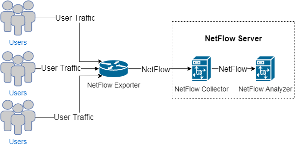
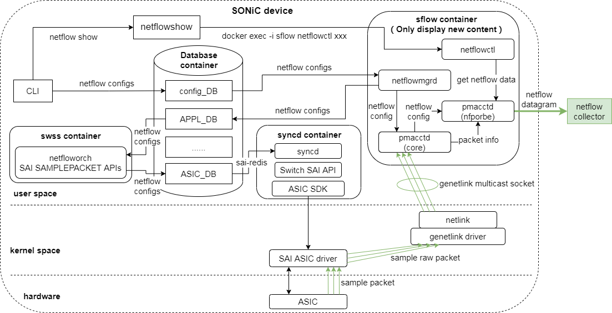
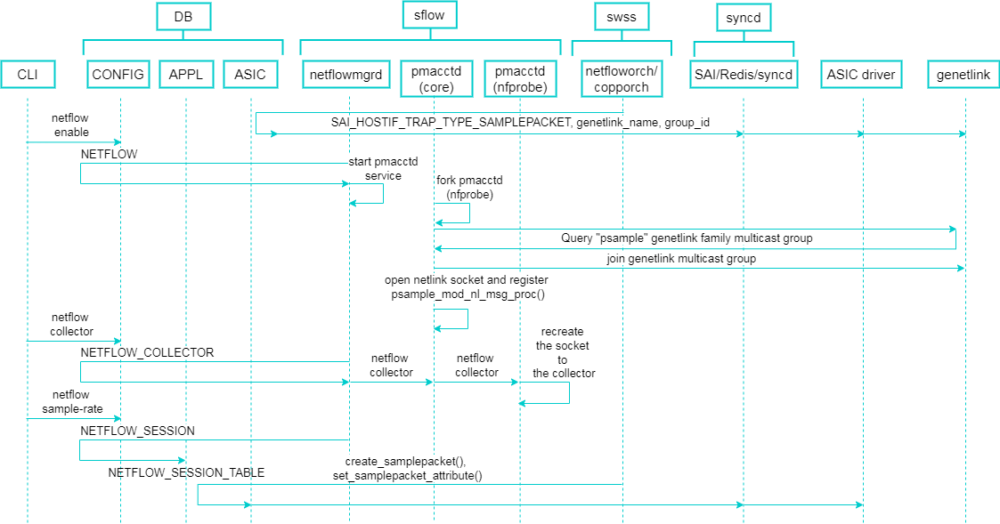
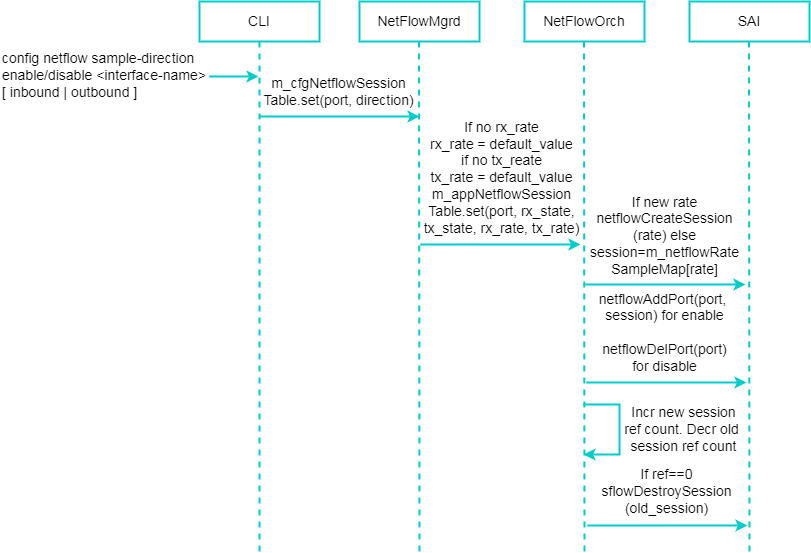
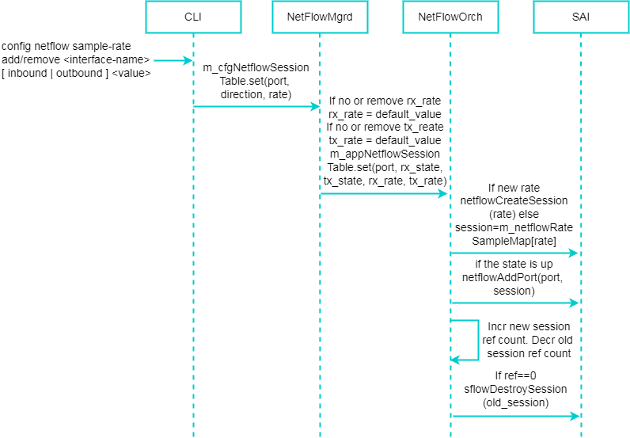
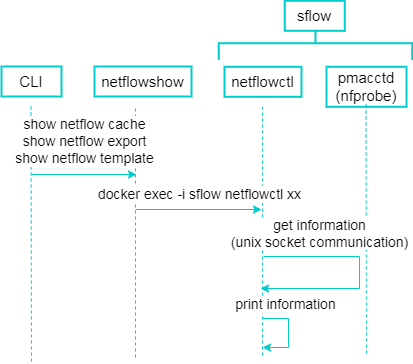
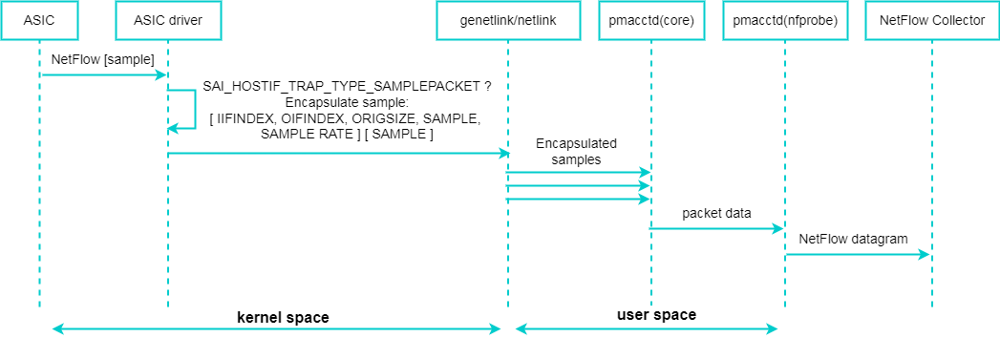
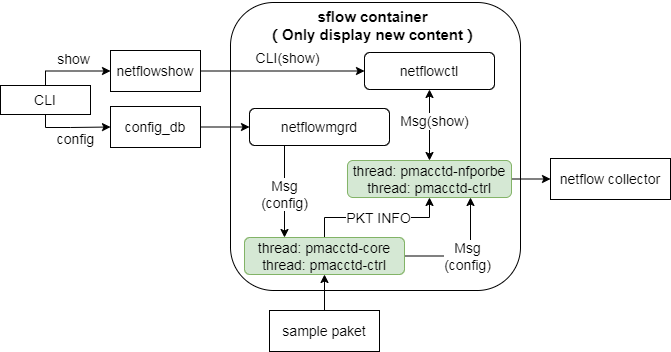

# NetFlow High Level Design

### Rev 0.1

## Table of Content

## 1. Revision

| Rev  | Rev Date   | Author          | Change Description |
| ---- | ---------- | --------------- | ------------------ |
| v0.1 | 08/16/2024 | Zhuyanguanzhong | Initial version    |

## 2. Scope

This document describes the high level design of NetFlow in SONiC.

## 3. Definitions/Abbreviations

| Definitions/Abbreviation | Description                  |
| ------------------------ | ---------------------------- |
| SAI                      | Switch Abstraction Interface |
| NOS                      | Network Operating System     |
| OID                      | OBject Identifier            |

## 4. Overview

NetFlow services provide network administrators with access to IP flow information from their data networks. Network elements (routers and switches) gather flow data and export it to collectors. The collected data provides fine-grained metering for highly flexible and detailed resource usage accounting.

A flow is defined as a unidirectional sequence of packets with some common properties that pass through a network device. These collected flows are exported to an external device, the NetFlow collector. Network flows are highly granular; for example, flow records include details such as IP addresses, packet and byte counts, timestamps, Type of Service (ToS), application ports, input and output interfaces, etc.

Exported NetFlow data is used for a variety of purposes, including enterprise accounting and departmental chargebacks, ISP billing, data warehousing, network monitoring, capacity planning, application monitoring and profiling, user monitoring and profiling, security analysis, and data mining for marketing purposes.

As shown in the diagram below, the main components of the NetFlow system include NetFlow Exporter, NetFlow Collector, and NetFlow Analyzer.

* NetFlow Exporter: Responsible for collecting and exporting flow records. Flow exporters are typically network devices (such as routers or switches) that monitor network traffic passing through them and generate flow data records based on specific rules.

* NetFlow Collector: Receives and stores flow records sent by flow exporters. The flow collector is specifically designed to accept and process flow records in a data storage system or server.

* NetFlow Analyzer: Analyze and report on flow data collected from flow collectors. Flow analyzers are typically software tools or platforms that provide user-friendly interfaces and graphical reports.

This HLD will mainly implement the functions of NetFlow Exporter and integrate it into the SONiC system. NetFlow Collector and NetFlow Analyzer are generally integrated into a NetFlow server, but are not within the scope of this HLD.

This chapter describes the content related to the reference document RFC3954 (for a more detailed introduction to NetFlow, please refer to: https://www.ietf.org/rfc/rfc3954.txt ), and will mainly be based on the implementation of NetFlow V9 for this feature.

## 5. Requirements

The requirements specification supported by NetFlow is as follows:

1. NetFlow should be supported on physical interfaces;
2. NetFlow should support 1 NetFlow collector;
3. NetFlow collector IP can be IPv4;
4. NetFlow should support configuring sampling rate and sampling direction on physical interfaces;
5. NetFlow should support configuring the source IP address of NetFlow packets (by configuring the export interface);
6. NetFlow should support parsing of inner and outer layers of VXLAN packets;
7. NetFlow should support parsing of inner and outer layers of GRE packets;
8. Support NetFlow related: 
   I. CLI show/config commands
   II. Support syslog records

## 6. Module Design

### 6.1 Overall design

The NetFlow module is planned to run in the sFlow container. In the SONiC system, the overall architecture design of the NetFlow module is as shown in the following diagram: 

The NetFlow feature will be based on the netflow function in the open source software pmacct, with some modifications and enhancements. These modifications and enhancements for the netflow function will be independent of pmacct's code, stored in the form of patches in the folder netflowd (sonic-buildimage/src/sflow/netflowd/patch), and merged into pmacct's local code during the SONiC compilation phase.

The CLI can configure and display NetFlow parameters by adding commands, including NetFlow collectors, export source interfaces, interface sampling directions and rates, as well as statistics for VXLAN and GRE traffic; it can also display NetFlow statistics and template data. Currently, NetFlow configuration commands only interact with CONFIG_DB to issue configurations, while NetFlow display commands will communicate with the netflowctl process in the sflow container through a python script called netflowshow to obtain and display the running data of the process (NetFlow statistics and template data).

The sflow container is enhanced to add the following component: 

* pmacctd (source code repository: https://github.com/pmacct/pmacct , introduction: https://github.com/pmacct/pmacct/blob/master/QUICKSTART ):  This process will start both the parent and child processes. The parent process (pmacctd-core) mainly handles packet reception and parsing, while the child process (pmacctd-nfprobe) is responsible for creating and maintaining NetFlow flow tables, maintaining NetFlow templates, and sending NetFlow templates and statistical packets. Each process has two threads, one for data processing and one for configuration synchronization.
* netflowctl: Interact mainly with the control thread of the pmacctd subprocess (nfprobe), and obtain and display NetFlow statistics and template data. It is a temporary process that only runs when called and stops running after the call ends.
* netflowmgrd: Subscribe to the NetFlow-related tables in the config_DB database, update the NetFlow configuration to the APPL_DB database, and synchronize the NetFlow configuration to the control thread of the pmacctd parent process (core).

The swss container is enhanced to add the following component: 

* netfloworch: which subscribes to the APPL_DB database and acts as southbound interface to SAI for programming the SAI_SAMPLEPACKET sessions.
* copporch: The copporch module is not modified, and the existing modifications using sFlow features are used.

The syncd container is not modified, and the existing modifications using sFlow features are used.

The ASIC drivers are not modified, and the existing modifications using sFlow features are used.

In order to support the NetFlow feature, detailed descriptions of modifications to existing components (including sflow containers) will be provided in the following sections.

### 6.2 Configuration and control flow

The configuration and control process of NetFlow are shown in the following diagram: 

1. Reuse the modification of sflow feature. The copporch (based on swssconfig/sample/00-copp.config.json) calls the SAI API to map SAI_HOSTIF_TRAP_TYPE_SAMPLEPACKET to a specific genetlink channel and multicast group. The SAI driver creates genetlink family and multicast group, which are ultimately used to transmit NetFlow sampling packets to the pmacctd (core) process. If the SAI implementation uses the psample kernel driver (https://github.com/torvalds/linux/blob/master/net/psample/psample.c ), then the "psample" genetlink family and "packets" multicast group created by the psample driver should be used.

2. Users can enable NetFlow features, configure NetFlow collectors, configure NetFlow packet export source interfaces, configure interface sampling direction and rate, enable the inner and outer layer parsing function of VXLAN and GRE packets through CLI. The CLI will write user configurations to the CONFIG DB.

3. The netflowmgrd daemon listens for changes in the entries of the NETFLOW table in the CONFIG DB, and starts the pmacctd (core) process as a service. After the pmacctd (core) process is started, it forks out the pmacctd (nfprobe) sub-process, and queries and joins the "packets" multicast group. Finally, it opens a netlink socket, registers the sampling packets reception interface psample_mod_nl_msg_proc(), and starts receiving sampling packets.

4. The netflowmgrd daemon listens for changes in the entries of the NETFLOW and NETFLOW_COLLECTOR tables in the CONFIG DB, and uses inter-process communication to send the configuration of NetFlow collectors, NetFlow packet export source interfaces, and the inner and outer layer parsing of VXLAN and GRE packets to the pmacctd (core) process. Subsequently, the pmacctd (core) process synchronizes the configuration to the pmacctd (nfprobe) process. Upon receiving the configuration of the NetFlow collector, the pmacctd (nfprobe) process rebuilds the socket with the remote NetFlow collector.

5. The netflowmgrd daemon listens for changes in the NETFLOW_SESSION table of the CONFIG DB and updates the changes to the NETFLOW_SESSION_TABLE table of the APPL DB. The netfloworch module listens for changes in the NETFLOW_SESSION_TABLE table of the APPL DB and uses the create_samplepacket() and set_samplepacket_attribute() interfaces to distribute configuration changes to hardware through the SAI interface.

The following diagrams will provide the interface sampling direction and interface sampling rate configuration, from the CLI to the SAI processing flow: 

Configure the sampling direction of the interface, which is also the switch to enable interface message sampling. If the interface sampling rate is not configured before configuring the interface sampling direction, or if the interface sampling rate is deleted after configuring the interface sampling direction, the interface sampling rate will use the default sampling rate.

### 6.3 Display command processing flow

NetFlow display command processing flow is shown in the figure below: 

1. The show command for NetFlow is called from the CLI to the python script netflowshow.

2. Use the command "docker exec -i sflow netflowctl xx" to pass the information that needs to be queried into the container through netflowshow.

3. The netflowctl process communicates with the pmacctd (nfprobe) process using a Unix socket to obtain operational data related to NetFlow from the pmacctd (nfprobe) process.

4. The netflowctl process formats and displays the operational data related to NetFlow after obtaining it.

### 6.4 NetFlow sampling path

The following diagram will show the processing flow of NetFlow sampling packets (similar to sFlow):

1. Sample a packet matching the NetFlow rule and report an interrupt to the ASIC driver.

2. Due to the NetFlow sampling function enabled on the interface, the ASIC driver will receive the forwarded packet after confirming that it is a sampled packet.

3. Check if the ASIC driver is associated with the specific genetlink channel SAI_HOSTIF_TRAP_TYPE_SAMPLEPACKET. Then, encapsulate the sampled packet into the cache of the genetlink structure, and add the following NetFlow attribute values to the cache: IIFINDEX, OIFINDEX, ORIGSIZE, SAMPLE, SAMPLE RATE. Send the genetlink cache through the genlmsg_multicast() interface.

4. The psample_mod_psample_proc() interface of the pmacctd (core) daemon is waiting to receive multicast messages from a specific genetlink family. Upon receiving the multicast message, it first parses and extracts the NetFlow attributes related to the sampling packet; then it parses the sampling packet, extracts different protocol fields according to user configuration; finally, it sends the related data of these packets to the pmacctd (nfprobe) process through shared memory.

5. The pmacctd (nfprobe) business process will create NetFlow flow tables based on the received packet-related data, and through the NetFlow flow table aging mechanism, construct UDP packets to send NetFlow template packets and NetFlow traffic statistics packets to the configured NetFlow collector.

### 6.5 CLI

#### NetFlow utility Interface

* { config | show } netflow ... [ options ] ...
  
  Provide NetFlow configuration commands to set up NetFlow related features, and provide NetFlow display commands to view NetFlow related operational data. Therefore, extend the SONiC CLI **show** and **config** commands to include these functionalities.

#### Config commands

* **config netflow < enable | disable >**
  
  This command is used to enable or disable the NetFlow feature. By default, it is disabled and is a global configuration command. When the NetFlow feature is enabled, the pmacctd daemon process will start as a service; when the NetFlow feature is disabled, the pmacctd daemon process will stop. The interface's packet sampling and NetFlow packet sending functions will only take effect after the NetFlow feature is enabled.
  
  Use restrictions: NetFlow can only be enabled when sFlow function is turned off. When sFlow function is turned on, it will prompt that sFlow is enabled and NetFlow cannot be enabled. The prompt message is: 
  
  NetFlow and sFlow function can't work together. Please close sFlow function firstly.

* **config netflow collector add < collector-name > < ipv4-address > < udp-port >**
  
  This command is used to add or modify the IPv4 address and UDP port number of the NetFlow collector. It is a global configuration command and can only configure one collector at most. If a collector has already been configured, this command can be executed multiple times using the same collector name to modify the collector's IP address and port number. If a new collector needs to be configured, the previously configured collector must be deleted first.
  
  collector-name: The name of the NetFlow collector. A string consisting of numbers, letters, and underscores, case-sensitive.
  
  ipv4-address: The IPv4 address of the NetFlow collector.
  
  udp-port: The UDP port number that the NetFlow collector listens on, ranging from 0 to 65535.

* **config netflow collector remove < collector-name >**
  
  This command is used to delete the added NetFlow collector.
  
  collector-name: The name of the NetFlow collector. A string consisting of numbers, letters, and underscores, case-sensitive.

* **config netflow export-source add < interface-name >**
  
  This command is used to configure the source interface for NetFlow traffic statistics packets and template packets. By default, the source interface IP address for NetFlow traffic statistics packets and template packets is the IP address of the egress interface. This is a global configuration command. After configuring this command, the source IP address for NetFlow traffic statistics packets and template packets will be set to the IP address of this interface.
  
  interface-name: Interface name.

* **config netflow export-source remove**
  
  This command is used to delete the configured source interface for NetFlow traffic statistics packets and template packets.

* **config netflow sample-direction enable < interface-name > [ inbound | outbound ]**
  
  This command is used to enable the sampling function of a specific interface, which is disabled by default. If not specified as inbound or outbound during configuration, both inbound and outbound directions will be enabled by default.
  
  interface-name: Interface name.
  
  inbound: Indicates sampling of packets in the inbound direction of the interface.
  
  outbound: Indicates sampling of packets in the outbound direction of the interface.

* **config netflow sample-direction disable < interface-name >**
  
  This command is used to disable the sampling function for specific interfaces.
  
  interface-name: Interface name.

* **config netflow sample-rate add < interface-name > [ inbound | outbound ] < value >**
  
  This command is used to set the sampling rate of a specific interface. When the sampling rate of the interface is not configured, the default NetFlow sampling rate is the interface speed divided by 106. For example, when the interface speed is 1G bits/sec, the default NetFlow sampling rate is 1000. When the inbound and outbound parameters are not specified, it means that the sampling rate is set for both inbound and outbound packets on the interface.
  
  interface-name: Interface name.
  
  inbound: Indicates the sampling rate setting for inbound packets on the interface.
  
  outbound: Indicates the sampling rate setting for outbound packets on the interface.
  
  value: Sampling rate. Sample one packet out of every "value" packets, with a value range of 256 to 8388608.

* **config netflow sample-rate remove < interface-name > [ inbound | outbound ]**
  
  This command is used to delete the sampling rate of a specific interface. When the configured sampling rate on the interface is deleted, the sampling rate on the interface will revert to the default sampling rate. When inbound and outbound parameters are not specified, it means that the sampling rate for both the interface input and output directions is deleted simultaneously.
  
  interface-name: Interface name.
  
  inbound: Indicates the sampling rate setting for inbound packets on the interface.
  
  outbound: Indicates the sampling rate setting for outbound packets on the interface.

* **config netflow vxlan udp-port add < port-number >**
  
  This command is used to enable the VXLAN packet statistics function of NetFlow and set the UDP port number used by the VXLAN protocol, which is disabled by default.
  
  port-number: UDP port number, range from 1 to 65535.

* **config netflow vxlan udp-port remove**
  
  This command is used to disable the VXLAN packet statistics function of NetFlow.

* **config netflow gre add inner-packet**
  
  This command is used to enable the GRE packet statistics function of NetFlow, which is disabled by default.
  
  Inner-packet: Collect the five-tuple (source IP address, destination IP address, protocol number, source port number, and destination port number) information of the inner packet encapsulated by GRE.

* **config netflow gre remove inner-packet**
  
  This command is used to disable the GRE packet statistics function of NetFlow.
  
  Inner-packet: Collect the five-tuple (source IP address, destination IP address, protocol number, source port number, and destination port number) information of the inner packet encapsulated by GRE.

#### Show commands

* **show netflow export**
  
  This command is used to display the flow table export information in the device.

* **show netflow template**
  
  This command is used to display the NetFlow template information configured in the device. It can only be used after enabling the NetFlow feature.

* **show netflow cache [ --interface interface-name ] [ --destination destination-ip | --destination-port destination-port ] [ --source source-ip | --source-port source-port ] [ --protocol protocol ] [ --time-range start-date start-time end-date end-time ] [ --verbose ]**
  
  This command is used to display the cached flow table information in the device. It can only be used after enabling the NetFlow function.
  
  interface interface-name: Display all flow table information for the specified interface.
  
  destination destination-ip: Display all flow table information for the specified destination IP address.
  
  destination-port destination-port: Display all flow table information for the specified destination port.
  
  source source-ip: Display all flow table information for the specified source IP address.
  
  source-port source-port: Display all flow table information for the specified source port.
  
  protocol protocol: Display all flow table information for the specified protocol.
  
  time-range start-date start-time end-date end-time: Display all flow table information that arrived within the specified time range.
  
  start-date: Specify the start date in the format YYYY-MM-DD, with MM ranging from 1 to 12 and DD depending on the month. YYYY must be greater than or equal to 1970, meaning the start date should be after January 1, 1970 (UTC).
  
  start-time: Specify the start time in the format HH:MM:SS, with HH ranging from 0 to 23 and MM and SS ranging from 0 to 59.
  
  end-date: Specify the end date in the format YYYY-MM-DD, with MM ranging from 1 to 12 and DD depending on the month. YYYY must be greater than or equal to 1970, meaning the end date should be after January 1, 1970 (UTC).
  
  end-time: Specify the end time in the format HH:MM:SS, with HH ranging from 0 to 23 and MM and SS ranging from 0 to 59.
  
  verbose: Display detailed information.

#### Example SONiC CLI configuration

\# sudo config netflow enable

\# sudo config netflow collector add collectorA 10.100.1.11 2055

\# sudo config netflow export-source add Loopback0

\# sudo config netflow sample-direction enable Ethernet0 inbound

\# sudo config netflow sample-rate add Ethernet0 inbound 8192

\# sudo config netflow vxlan udp-port add 4789

\# sudo config netflow gre add inner-packet

The storage status of the above command's configDB is as follows:

{

    “NETFLOW”: {

        "global": {

            "admin_state": "up",

            "source_intf": "Loopback0",

            "vxlan_udp_port": "4789",

            "gre_export_type": 3

        }

    }

    "NETFLOW_COLLECTOR": {

        "collectorA": {

            "collector_ip": "10.100.1.11",

            "collector_port": "2055"

        }

    }

    "NETFLOW_SESSION": {

        "Ethernet0": {

            "sample_direction": "rx",

            "inbound_sample_rate": "8192"

        }

    }

}

\# show netflow export

Display current configuration and running information, including NetFlow packet source interface, collector IP address and port number, number of flow information sent, number of UDP packets sent.

    IP export information:
     Flow source interface : eth0
     Flow destination IP address(UDP) : 10.10.0.10(30000)
     Version 9 exported flow number : 20
     Version 9 exported UDP datagram number(failed) : 2(0)

\# show netflow template

Display the NetFlow template information of the current device configuration.

     Flow template refresh frequency    : 18
     Active flow templates              : 2
    
    Protocol-port outbound template:
     Template ID                         : 3258
     Field count                         : 11
     Field type                            Field length (bytes)
    ---------------------------------------------------------------------------
     Out packets                           8
     Out bytes                             8
     First forwarded                       4
     Last forwarded                        4
     IPv4 source address                   4
     IPv4 destination address              4
     L4 source port                        2
     L4 destination port                   2
     Direction                             1
     Sampling algorithm                    1
     Sampling interval                     4
    
    Protocol-port inbound template:
     Template ID                         : 3257
     Field count                         : 11
     Field type                            Field length (bytes)
    ---------------------------------------------------------------------------
     In packets                            8
     In bytes                              8
     First forwarded                       4
     Last forwarded                        4
     IPv4 source address                   4
     IPv4 destination address              4
     L4 source port                        2
     L4 destination port                   2
     Direction                             1
     Sampling algorithm                    1
     Sampling interval                     4

\# show netflow cache interface Ethernet0 verbose

Display detailed flow table information related to interface Ethernet0 in the current operational data of the device: 

    IP netflow cache information:
      Active flow entries             : 1000
      Max lifetime of flow entries    : 60 min
      Interval of expiry              : 10 sec
      Total packets counted           : 3372
      Fragment packets counted        : 125
      Bad packets counted             : 10
      Flow entries expired            : 2556855
      Flow entries exported           : 2472588
      Flow entries dropped            : 84127
      Flow entries force expired      : 7315
      Packets sent                    : 372
      Max duration of flow entries    : 600 sec
      Min duration of flow entries    : 6 sec
      Mean duration of flow entries   : 132 sec
      Max octets of flow entries      : 800
      Min octets of flow entries      : 20
      Mean octets of flow entries     : 96
      Max packets of flow entries     : 193
      Min packets of flow entries     : 3
      Mean packets of flow entries    : 47
    
    Protocol       Total        Total       Total      Max duration    Min duration     Mean duration
                   flows        octets      packets       (sec)           (sec)            (sec)
    ----------------------------------------------------------------------------------------
    TCP          644736      93664475      200           165              4                64
    UDP          157422       3442520      120            72             10                35
    ICMP          57855       3772580       87            20              2                 4
    GRE            7530        434588       22            32              6                15
    IP-other       6412        406572       16            40             12                20
    
    Type     DstIP(port)           SrcIP(port)             Pro    ToS    If(Direct)    Pkts
    ----------------------------------------------------------------------------------------
    IP       11.1.1.1(1024)        11.1.1.2(21)             6     128    eth0(I)       42996
             Flow creation time: 7/2/2024, 14:10:03
             Last packet arrived: 7/2/2024, 14:21:03

### 6.6 DB and Schema changes

#### ConfigDB Table & Schema

Add a NETFLOW table to store the global configuration information of NetFlow: 

    NETFLOW:global
        "admin_state": {{ "up"/"down" }}
        "source_intf": {{ interface_name }} (OPTIONAL)
        "vxlan_udp_port": {{ uint16 }} (OPTIONAL)
        "gre_export_type": {{ "1" }} (OPTIONAL)
    
    ; Defines schema for NETFLOW table which holds global configurations
    key                = NETFLOW:global ; NetFlow global configurations
    ; field            = value
    admin_state        = "up"/"down" ; Enabled/Disabled NetFlow Function
    source_intf        = interface_name ; Interface name
    vxlan_udp_port     = uint16 ; VXLAN protocol port number, configuration scope: 1 - 65535
    gre_export_type    = "1" ; GRE protocol parsing mode, 1 for inner packet

Add a NETFLOW_COLLECTOR table to save NetFlow collector information: 

    NETFLOW_COLLECTOR:{{ collector_name }}
        "collector_ip": {{ ip_address }}
        "collector_port": {{ uint16 }}
    
    ; Defines schema for NetFlow collector configuration attributes
    key               = NETFLOW_COLLECTOR:{{ collector_name }} ; NetFlow collector configurations
    ; field           = value
    collector_ip      = IPv4address ; Ipv4 collector address
    collector_port    = uint16 ; Destination L4 port, configuration scope: 0 - 65535
    ; value annotations
    collector_name    = 1*16VCHAR

Add a NETFLOW_SESSION table to save the interface configuration information for NetFlow: 

    NETFLOW_SESSION:{{interface_name}}
        "inbound_sample_rate": {{ uint32 }}
        "outbound_sample_rate": {{ uint32 }}
        "sample_direction": {{ "rx"/"tx"/"rx/tx" }}
    
    ; Defines schema for NetFlow interface configuration attributes
    key                     = NETFLOW_SESSION:{{interface_name}} ; NetFlow interface configurations
    ; field                 = value
    inbound_sample_rate     = 1*7DIGIT ; average number of packets skipped before the sample is taken
    outbound_sample_rate    = 1*7DIGIT ; average number of packets skipped before the sample is taken
    sample_direction        = "rx"/"tx"/"rx/tx" ; enable/disable the interface sampling function according to the direction

#### ApplDB Table & Schema

Add a NETFLOW_SESSION_TABLE table to store the interface configuration information for NetFlow.

    NETFLOW_SESSION_TABLE:{{interface_name}}
        "rx_admin_state": {{ "up"/"down" }}
        "tx_admin_state": {{ "up"/"down"}}
        "rx_sample_rate": {{ uint32 }}
        "tx_sample_rate": {{ uint32 }}
    
    ; Defines schema for NetFlow interface configuration attributes
    key               = NETFLOW_SESSION_TABLE:{{interface_name}} ; NetFlow interface configurations
    ; field           = value
    rx_admin_state    = "up"/"down" ; enable/disable the interface inbound sampling function
    tx_admin_state    = "up"/"down" ; enable/disable the interface outbound sampling function
    rx_sample_rate    = 1*7DIGIT ; average number of packets skipped before the sample is taken
    tx_sample_rate    = 1*7DIGIT ; average number of packets skipped before the sample is taken

### 6.7 sflow container

Pmacct ([https://github.com/pmacct/pmacct](http://ai.h3c.com/redirect?target=https%3A%2F%2Fgithub.com%2Fpmacct%2Fpmacct "外部资源链接")) is currently one of the most comprehensive open-source software implementations of NetFlow functionality. It supports NetFlow v5 (Cisco custom protocol), v9 (https://www.ietf.org/rfc/rfc3954.txt ), and v10 (IPFIX: https://www.ietf.org/rfc/rfc7011.txt ) protocols. This plan will initially support its v9 version. pmacctd will run as a systemd service in the sFlow container.

**netflowmgrd**

First, the netflowmgrd process will listen to the NETFLOW table and NETFLOW_COLLECTOR table in the config DB, and synchronize the configuration data to the pmacctd (core) process, and then the pmacctd (core) process will synchronize the configuration data to the pmacctd (nfprobe) process.

Next, the netflowmgrd process also listens to the NETFLOW_SESSION table of the config DB, and updates the configuration data to the NETFLOW_SESSION_TABLE table of the Appl DB.

Finally, the netflowmgrd process also listens to the PORT table of the config DB to obtain changes in interface speed configuration, in order to update the default sampling rate of the interface.

**pmacctd service**

The pmacctd process actually consists of a parent-child process pair. The parent process is the pmacctd (core) process, mainly receiving sampling packets through the genetlink channel, parsing the sampling packets, and sending the parsed packet information to the child process through shared memory. The child process is the pmacctd (nfprobe) process, mainly receiving sampling packet information through shared memory, creating flow tables based on the packet information, and triggering the sending of NetFlow packets through flow table aging.

### 6.8 SWSS and syncd changes

**copporch**

This feature does not make modifications to copporch, but it will utilize the modifications made to copporch by the sFlow feature.

**netfloworch**

In orchagent, the netfloworch module is introduced to handle interface sampling rate related configuration requests. The netfloworch module creates sessions with different sampling rates through the SAI samplepacket API and sets sessions with different sampling rates to different interfaces through the SAI port API (different sampling rates can be set for inbound and outbound sessions).

### 6.9 SAI API changes

This feature will not modify or add to the SAI interface, but will use the sFlow feature to modify and add content to the SAI interface, using the same SAI interface as the sFlow feature.

### 6.10 Pmacct main modifications

This feature will be implemented as a patch to pmacct and dynamically loaded into the native code during compilation. To ensure compatibility with pmacct's original code logic, the main modifications will be compiled using the compilation macro WITH_SONIC_NETFLOW. The specific operation of pmacct is shown in the following figure:

The main modifications to pmacct are as follows:

1. Support inner layer parsing of VXLAN and GRE packets, and send corresponding NetFlow packets.

2. Support the dynamic modification of its running configuration through the command line while pmacctd is running. Therefore, it is necessary to add the pmacctd-ctrl control thread in the pmacctd (core) process and pmacctd (nfprobe) process to synchronize configuration information from the netflowmgrd process to the pmacctd (core) process and pmacctd (nfprobe) process.

3. Support the viewing of pamcctd's running configuration and flow table information in the running data through the show command. Therefore, it is necessary to add the netflowctl process to the sFlow container to interact with the pmacctd (nfprobe) process and obtain NetFlow running data. The netflowctl process is a temporary process that starts when netflowshow is called, retrieves and displays the running data, and then stops.

4. Support receiving sampling packets from the kernel through the genetlink channel.

5. The original pmacct NetFlow template fields have been expanded to include more useful protocol fields.

### 6.11 sFlow main modifications

1. Due to the fact that sFlow and NetFlow features cannot be used simultaneously, before processing the "config sflow enable" command in the CLI, add a judgment on whether the NetFlow feature is enabled. By checking the relevant entries in the config DB for NetFlow feature enablement, it can be determined whether the NetFlow feature is enabled.

2. Due to the NetFlow feature supporting packet sampling in both inbound and outbound directions, while the sFlow feature currently only supports packet sampling in the inbound direction, it is necessary to modify the VirtualSwitchSaiInterfacePort.cpp file in the vslib directory of the sonic-sairedis sub-repository to enable the VS to support packet sampling in both inbound and outbound directions.

## 7. CLI Yang Mode

Add file: src/sonic-yang-models/yang-models/sonic-netflow.yang, the new content is as follows:

    module sonic-netflow{
        yang-version 1.1;
        namespace "http://github.com/Azure/sonic-netflow";
        prefix netflow;
        
        import ietf-inet-types {
            prefix inet;
        }
        import sonic-types {
            prefix stypes;
        }
        import sonic-port {
            prefix port;
        }
        import sonic-portchannel {
            prefix lag;
        }
        import sonic-mgmt_port {
            prefix mgmt-port;
        }
        import sonic-loopback-interface {
            prefix loopback;
        }
        import sonic-vlan-sub-interface {
            prefix vlan-sub-interface;
        }
    
        description "NetFlow CONFIG YANG Module for SONiC OS";
    
        revision 2024-08-26 {
            description "First Revision";
            reference "RFC 7950: The YANG 1.1 Data Modeling Language";
        }
    
        container sonic-netflow {
            description "Container for all Netflow related configuration and state data";
    
            container NETFLOW_COLLECTOR {
                description "NETFLOW COLLECTOR part of config_db.json";
    
                list NETFLOW_COLLECTOR_LIST {
                    
                    key "name";
                    max-elements 1;
                    description "List of Netflow collectors";
    
                    leaf name {
                        type string {
                            length 1..16;
                        }
                        description "Name of the Netflow collector";
                    }
    
                    leaf collector_ip {
                        type inet:ip-address;
                        mandatory true;
                        description "IPv4/IPv6 address of the Netflow collector";
                    }
    
    
                    leaf collector_port {
                        type inet:port-number;
                        description "Destination L4 port of the Netflow collector";
                    }
    
                } /* end of list NETFLOW_COLLECTOR_LIST */
            } /* end of container NETFLOW_COLLECTOR */
    
            container NETFLOW_SESSION {
                description "NETFLOW SESSION part of config_db.json";
    
                list NETFLOW_SESSION_LIST {
                    
                    key "port";
                    description "List of Netflow sessions";
    
                    leaf port {
                        type leafref {
                            path "/port:sonic-port/port:PORT/port:PORT_LIST/port:name";
                        }
                        description "Sets netflow session table attributes for a specific Ethernet interface.";
                    }
    
                    leaf admin_state {
                        type stypes:admin_status;
                        default up;
                        description "Per port netflow admin state";
                    }
    
                    leaf sample_direction {
                        type enumeration {
                            enum rx {
                                description "Receive direction.";
                            }
                            enum tx {
                                description "Transmit direction.";
                            }
                            enum "rx/tx" {
                                description "Both receive and transmit directions.";
                            }
                        }
                        description "Sets the packet sampling direction";
                    }
    
                    leaf inbound_sample_rate {
                        type uint32 {
                            range "256..8388608" {
                                error-message "netFlow sample rate must be [256-8388608]";
                            }
                        }
                        description "Sets the packet inbound sampling rate.  The rate is expressed as an integer N, where the intended sampling rate is 1/N packets.";
                    }
    
                    leaf outbound_sample_rate {
                        type uint32 {
                            range "256..8388608" {
                                error-message "netFlow sample rate must be [256-8388608]";
                            }
                        }
                        description "Sets the packet outbound sampling rate.  The rate is expressed as an integer N, where the intended sampling rate is 1/N packets.";
                    }
                } /* end of list NETFLOW_SESSION_LIST */
            } /* end of container NETFLOW_SESSION */
    
            container NETFLOW {
                description "NETFLOW part of config_db.json";
    
                container global {
                    description "Global configuration of Netflow";
    
                    leaf admin_state {
                        type stypes:admin_status;
                        description "Global netflow admin state";
                    }
    
                    leaf source_intf {
                        type union {
                            type leafref {
                                path "/port:sonic-port/port:PORT/port:PORT_LIST/port:name";
                            }
                            type leafref {
                                path "/lag:sonic-portchannel/lag:PORTCHANNEL/lag:PORTCHANNEL_LIST/lag:name";
                            }
                            type leafref {
                                path "/mgmt-port:sonic-mgmt_port/mgmt-port:MGMT_PORT/mgmt-port:MGMT_PORT_LIST/mgmt-port:name";
                            }
                            type leafref {
                                path "/loopback:sonic-loopback-interface/loopback:LOOPBACK_INTERFACE/loopback:LOOPBACK_INTERFACE_LIST/loopback:name";
                            }
                            type leafref {
                                path "/vlan-sub-interface:sonic-vlan-sub-interface/vlan-sub-interface:VLAN_SUB_INTERFACE/vlan-sub-interface:VLAN_SUB_INTERFACE_LIST/vlan-sub-interface:name";
                            }
                            /*
                            type leafref {
                                path "/vlan:sonic-vlan/vlan:VLAN/vlan:VLAN_LIST/vlan:name";
                            }
                            */
                            type string {
                                pattern 'Vlan([0-9]{1,3}|[1-3][0-9]{3}|[4][0][0-8][0-9]|[4][0][9][0-4])';
                            }
                        }
                        description "Source interface name";
                    }
    
                    leaf vxlan_udp_port {
                        type uint16 {
                            range "1..65535" {
                                error-message "netFlow vxlan port number must be [1-65535]";
                            }
                        }
                        description "Vxlan UDP port";
                    }
    
                    leaf gre_export_type {
                        type uint32 {
                            range "0..1"{
                                error-message "GRE export type must be [0-1]";
                            }
                        }
                        description "GRE export type: 0-initial invalid value, 1-inner packet";
                    }
    
                } /* end of container global */
           } /* end of container NETFLOW */
    
        } /* end of container sonic-netflow */
    
    } /* end of module sonic-netflow */

## 8. Warmboot support

NetFlow packet sampling and other related functions should not be affected after warnboot.

## 9. Memory Consumption

When the NetFlow feature is not enabled, there is basically no memory consumption.

## 10. Restrictions/Limitations

NetFlow and sFlow features cannot be enabled at the same time.

## 11. Unit Test cases

To Be Added.

## 12. System Testcase

To Be Added.

## 13. Action items

Not Available.
