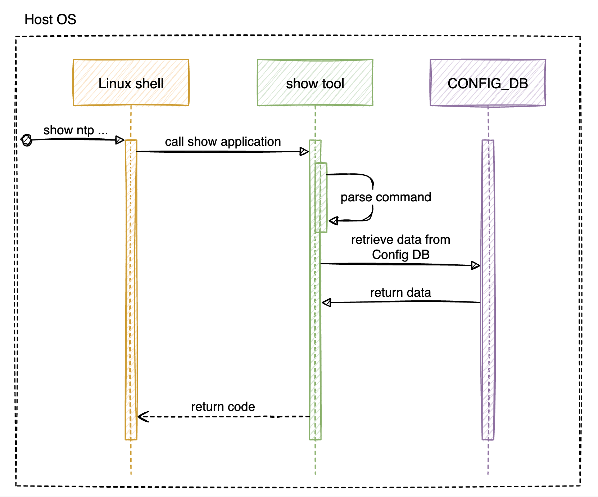

<!-- omit in toc -->
# SONiC Network Time Protocol (NTP) client configuration

## High Level Design document

## Table of contents
- [Revision](#revision)
- [About this manual](#about-this-manual)
- [Scope](#scope)
- [1 Introduction](#1-introduction)
  - [1.1 Feature overview](#11-feature-overview)
  - [1.2 Requirements](#12-requirements)
- [2 Design](#2-design)
  - [2.1 Overview](#21-overview)
  - [2.2 NTP daemon configuration](#22-ntp-daemon-configuration)
  - [2.3 Configuration agent](#23-configuration-agent)
  - [2.4 DB schema](#24-db-schema)
  - [2.5 Flows](#25-flows)
  - [2.6 CLI](#26-cli)
      - [2.6.2.1 Config command group](#2621-config-command-group)
      - [2.6.2.2 Show command group](#2622-show-command-group)
  - [2.7 YANG model](#27-yang-model)
  - [2.8 Warm/Fast boot](#28-warmfast-boot)
- [3 Test plan](#3-test-plan)
  - [3.1 Unit tests via VS](#31-unit-tests-via-vs)

# Revision
| Rev | Date       | Author            | Description     |
|:---:|:----------:|:-----------------:|:----------------|
| 0.1 | 01/02/2023 | Yevhen Fastiuk 🇺🇦  | Initial version |

# About this manual
This document provides general information about NTP implementation in SONiC and NTP CLI.
It describes high-level behavior, internal definition, design of the commands, syntax, and output definition.

# Scope
As part of the NTP feature, the next functionality is already available:
1. Add new NTP server (IP addr only)
2. Delete configured servers
3. Configure source interface (no CLI)
4. Configure VRF (no CLI)

This document describes the high level design of NTP client feature in SONiC.
The scope that document is to cover definition, design, and implementation of SONiC NTP, and NTP CLI.
That functionality is standard for ntpd so we can support it in SONiC.
The document covers the next CLI:
1. Show NTP state and configuration
2. Configure NTP client by adding NTP servers and pools
3. Enable NTP server
4. Configure NTP authentication

**In scope:**
- NTP client configuration (connect to NTP servers and/or pools).

**Out of scope:**
- NTP server role configuration (run a NTP server, be a peer).

<!-- omit in toc -->
## Abbreviations
| Term  | Meaning                                   |
|:------|:------------------------------------------|
| SONiC | Software for Open Networking in the Cloud |
| NTP   | Network Time Protocol                     |
| IP    | Internet Protocol                         |
| UDP   | User Datagram Protocol                    |
| TCP   | Transmission Control Protocol             |
| DB    | Database                                  |
| VRF   | Virtual Routing and Forwarding            |
| CLI   | Сommand-line Interface                    |
| YANG  | Yet Another Next Generation               |

<!-- omit in toc -->
## List of figures
- [Figure 1: NTP system chart diagram](#figure-1-ntp-system-chart-diagram)
- [Figure 2: NTP config flow](#figure-2-ntp-config-flow)
- [Figure 3: NTP show status sequence](#figure-3-ntp-status-sequence)
- [Figure 4: NTP show configuration](#figure-4-ntp-show-configuration)

<!-- omit in toc -->
## List of tables
- [Table 1: Event logging](#table-1-event-logging)
- [Table 2: NTP configuration](#table-2-ntp-daemon-configuration)
- [Table 3: NTP parameters](#table-3-ntp-parameters)

# 1 Introduction

## 1.1 Feature overview
NTP is a feature which allows user to synchronize system clock between computer systems over packet-switched.
NTP is intended to synchronize all participating computers to within a few milliseconds of Coordinated Universal Time (UTC).
That HLD presents the ability to configure NTP on SONiC systems.

As part of this feature, we would like to be able to configure NTP client using remote NTP servers, so we will be able to synchronize the time.
Also, we will be able to retrieve all information related to the NTP global configuration and it’s servers, such as ip address, state, authentication key, etc.

Here is the representation of SONiC platform using NTP feature:


<!-- omit in toc -->
###### Figure 1: NTP system chart diagram

## 1.2 Requirements

<!-- omit in toc -->
### 1.2.1 Functionality

**This feature will support the following functionality:**
1. Show NTP configuration
2. Enable/disable NTP functionality
3. Enable/disable NTP authentication
4. Enable/disable NTP DHCP client
5. Configure NTP VRF
6. Configure NTP servers
7. Configure per-server configuration
8. Manage NTP authentication keys

<!-- omit in toc -->
### 1.2.2 Command interface

**This feature will support the following commands:**
1. config: global NTP configuration
   1. Enable/disable NTP functionality
   2. Enable/disable NTP authentication
   3. Enable/disable NTP DHCP client
   4. Set NTP VRF
2. config: add/delete NTP server configuration
   1. Enable/disable server
   2. Configure server association type
   3. Modify server's NTP communication protocol version
   4. Assign authentication key
   5. Turn on/off aggressive mode (iburst)
3. config: NTP authentication keys management
   1. Change key type
   2. Trustiness enable/disable
4. show: display NTP status
5. show: display NTP configuration
6. show: display NTP authentication keys inventory

<!-- omit in toc -->
### 1.2.3 Error handling

**This feature will provide error handling for the next situations:**
1. Invalid object reference
2. Invalid options/parameters

<!-- omit in toc -->
### 1.2.4 Event logging

**This feature will provide event logging for the next situations:**
1. NTP state change
2. NTP authentication change
3. NTP DHCP client change
3. NTP server add/change config
4. Authentication keys management
5. Show NTP status

<!-- omit in toc -->
###### Table 1: Event logging

| Event                                   | Severity |
|:----------------------------------------|:--------:|
| NTP state change: success               | NOTICE   |
| NTP state change: failed                | ERROR    |
| NTP authentication change: success      | NOTICE   |
| NTP authentication change: failed       | ERROR    |
| NTP DHCP change: success                | NOTICE   |
| NTP DHCP change: failed                 | ERROR    |
| NTP add/change server: success          | NOTICE   |
| NTP add/change server: failed           | ERROR    |
| Authentication keys management: success | NOTICE   |
| Authentication keys management: failed  | ERROR    |
| Show NTP status: failed                 | ERROR    |

# 2 Design

## 2.1 Overview
As you can see on the [system chart](#figure-1-ntp-system-chart-diagram), we can configure feature by setting data through the SONiC database.
`hostcfgd` will listen for the configuration changes in corresponding table and will restart `ntp-config` service, which reads config from the database and configures the NTP by generating `ntp.conf` and `ntp.keys` file (if necessary).

## 2.2 NTP daemon configuration
The various modes are determined by the command keyword and the type of the required IP address.
Addresses are classed by type as (s) a remote server or peer (IPv4 class A, B and C), (b) the broadcast address of a local interface, (m) a multicast address (IPv4 class D), or (r) a reference clock address (127.127.x.x).

<!-- omit in toc -->
###### Table 2: NTP daemon configuration
| Parameter  | Default | Description |
|:-----------|:--------|:------------|
| server     | none    | For type s and r addresses, this command mobilizes a persistent client mode association with the specified remote server or local radio clock. In this mode the local clock can synchronized to the remote server, but the remote server can never be synchronized to the local clock. This command should not be used for type b or m addresses. |
| pool       | none    | For type s addresses, this command mobilizes a persistent client mode association with a number of remote servers. In this mode the local clock can synchronized to the remote server, but the remote server can never be synchronized to the local clock. |
| key (ntpd) | none    | All packets sent to and received from the server or peer are to include authentication fields encrypted using the specified key identifier with values from 1 to 65535, inclusive. The default is to include no encryption field. |
| version    | 4       | Specifies the version number to be used for outgoing NTP packets. Versions 1-4 are the choices, with version 4 the default. |
| iburst     | none    | When the server is unreachable, send a burst of eight packets instead of the usual one. The packet spacing is normally 2 s; however, the spacing between the first two packets can be changed with the calldelay command to allow additional time for a modem or ISDN call to complete. This is designed to speed the initial synchronization acquisition with the server command and s addresses and when ntpd is started with the -q option. |
| keys       | none    | Specifies the complete path and location of the key file containing the keys and key identifiers used by ntpd, ntpq and ntpdc when operating with symmetric key cryptography. This is the same operation as the -k command line option. |
| trustedkey | none    | Specifies the key identifiers which are trusted for the purposes of authenticating peers with symmetric key cryptography, as well as keys used by the ntpq and ntpdc programs. The authentication procedures require that both the local and remote servers share the same key and key identifier for this purpose, although different keys can be used with different servers. The key arguments are 32-bit unsigned integers with values from 1 to 65535. |
| keyno      | none    | Positive integer (between 1 and 65535). |
| type       | none    | Message digest or cipher algorithm. Supported types are md5, sha1, sha256, sha384, and sha512 |
| key (keys) | none    | The key itself. The key may be printable ASCII excluding "#" or hex encoded. Keys longer than 20 characters are assumed to be hex. The max length of a (de-hexified) key is 32 bytes. If you want to use an ASCII key longer than 20 bytes, you must hexify it. Note that the keys used by the ntpq(1) programs are checked against passwords entered by hand, so it is generally appropriate to specify these keys in ASCII format. |

**MAN page:**
[ntp.conf](
    https://manpages.debian.org/bullseye/ntp/ntp.conf.5.en.html
    "Network Time Protocol (NTP) daemon configuration file format"
)
[ntp_auth](
    https://linux.die.net/man/5/ntp_auth
    "NTP Authentication Options"
)

## 2.3 Configuration agent

<!-- omit in toc -->
### 2.3.1 Overview
Configuration management of `ntpd` is done by `ntp-config` service.
The service is triggered by CLI once data is validated and pushed to Config DB.

The `ntp-config` service performs the next actions:
1. Renders `ntp.conf.j2` and `ntp.keys.j2` templates with `sonic-cfggen` to generate a new `ntpd` config file
2. Restarts `ntp` service which triggers `ntpd` to load a new config file

<!-- omit in toc -->
### 2.3.2 NTP parameters

**NTP will have the next parameter mapping:**

<!-- omit in toc -->
###### Table 3: NTP parameters
| SONiC          | ntp.conf,<br>ntp.keys  | Config DB Schema                   |
|:---------------|:-----------------------|:-----------------------------------|
| state (global) | N/A                    | NTP\|global\|admin_state:\<val\>   |
| authentication | trustedkey, keys       | NTP\|global\|authentication:\<val\>|
| vrf            | N/A                    | NTP\|global\|vrf:\<val\>           |
| server         | server, pool           | NTP_SERVER\|\<key\>                |
| state (server) | N/A                    | NTP_SERVER\|\<key\>\|admin_state:\<val\> |
| type           | server, pool           | NTP_SERVER\|\<key\>\|association_type:\<val\> |
| version        | version                | NTP_SERVER\|\<key\>\|version:\<val\> |
| aggressive     | iburst                 | NTP_SERVER\|\<key\>\|iburst:\<val\>|
| key (server)   | key                    | NTP_SERVER\|\<key\>\|key:\<val\>   |
| key (auth)     | keyno                  | NTP_KEY\|\<key\>\|value:\<val\>    |
| type (auth)    | type                   | NTP_KEY\|\<key\>\|type:\<val\>     |
| trusted        | trustedkey             | NTP_KEY\|\<key\>\|trusted:\<val\>  |

<!-- omit in toc -->
### 2.3.3 NTP configuration
NTP global configuration offers `state`, `authentication`, `vrf` parameters for flexible configuration of NTP client.
For the server the next configuration options are supported: `state`, `type`, `version`, `key`.
And finally NTP key management supports the next options: `value`, `type`, `trusted`.

**Note:**
1. The destination might be not reachable over the specified `vrf`/`host`: no way to check - user's responsibility
2. Feature should handle automatically OOB VRF changes.

<!-- omit in toc -->
#### 2.3.3.1 Server configurations: `add/del/change`
Here is a part of `ntp.conf.j2` template that can be used to generate configured NTP servers:

**Example:**
```jinja
{# Getting NTP global configuration -#}
{/% set global = (NTP | d({})).get('global', {}) -/%}

{# Adding NTP servers. We need to know if we have some pools, to set proper
config -#}
{/% set is_pools = False /%}
{/% for server in NTP_SERVER if NTP_SERVER[server].admin_state != 'disabled' and
                               NTP_SERVER[server].resolve_as and
                               NTP_SERVER[server].association_type -/%}
    {/% set config = NTP_SERVER[server] -/%}
    {# Server options -#}
    {/% set soptions = '' -/%}
    {# Server access control options -#}
    {/% set aoptions = '' -/%}

    {# Authentication key -#}
    {/% if config.key -/%}
        {/% set soptions = soptions ~ ' key ' ~ config.key -/%}
    {/% endif -/%}

    {# Aggressive polling -#}
    {/% if config.iburst -/%}
        {/% set soptions = soptions ~ ' iburst' -/%}
    {/% endif -/%}

    {# Protocol version -#}
    {/% if config.version -/%}
        {/% set soptions = soptions ~ ' version ' ~ config.version -/%}
    {/% endif -/%}

    {# Check if there are any pool configured. BTW it doesn't matter what was
    configured as "resolve_as" for pools. If they were configured with FQDN they
    must remain like that -#}
    {/% set config_as = config.resolve_as -/%}
    {/% if config.association_type == 'pool' -/%}
        {/% set is_pools = True -/%}
        {/% set config_as = server -/%}
    {/% else -/%}
        {/% set aoptions = aoptions ~ ' nopeer' -/%}
    {/% endif -/%}

{{ config.association_type }} {{ config_as }}{{ soptions }}
    {/%- if global.server_role == 'disabled' +/%}
restrict {{ config_as }} kod limited nomodify notrap noquery{{ aoptions }}
    {/%- endif +/%}

{/% endfor -/%}
```

<!-- omit in toc -->
#### 2.3.3.2 Global config: `change`
The next part of `ntp.conf.j2` template can be used to manage ntp authentication:

**Example:**
```jinja
{/% set trusted_keys_arr = [] -/%}
{/% for key in NTP_KEY -/%}
    {/% set keydata = NTP_KEY[key] -/%}
    {/% if keydata.trusted == 'yes' -/%}
        {/% set trusted_keys_arr = trusted_keys_arr.append(key) -/%}
    {/% endif -/%}
{/% endfor /%}

{/% if global.authentication == 'enabled' /%}
keys /etc/ntp.keys
{/% if trusted_keys_arr != [] /%}
trustedkey {{ trusted_keys_arr|join(' ') }}
{/% endif /%}
{/% endif /%}
```

And for handling VRF, DHCP, and NTP feature state we need to modify `ntp-sytemd-wrapper`:
```bash
if [ -r /etc/default/ntp ]; then
        . /etc/default/ntp
fi

dhcp=$(/usr/local/bin/sonic-cfggen -d -v 'NTP["global"]["dhcp"]' 2> /dev/null)
if [ -e /run/ntp.conf.dhcp ] && [ "$dhcp" = "enabled" ]; then
        NTPD_OPTS="$NTPD_OPTS -c /run/ntp.conf.dhcp"
fi

ntpEnabled=$(/usr/local/bin/sonic-cfggen -d -v 'NTP["global"]["admin_state"]' 2> /dev/null)
if [ "$ntpEnabled" = "disabled" ]
then
        logger -p INFO -t "ntpd" "Stopping NTP daemon"
        start-stop-daemon --stop --quiet --oknodo --pidfile $PIDFILE
        exit 0
fi

# when mgmt vrf is configured, ntp starts in mgmt vrf by default unless user configures otherwise
vrfEnabled=$(/usr/local/bin/sonic-cfggen -d -v 'MGMT_VRF_CONFIG["vrf_global"]["mgmtVrfEnabled"]' 2> /dev/null)
vrfConfigured=$(/usr/local/bin/sonic-cfggen -d -v 'NTP["global"]["vrf"]' 2> /dev/null)
if [ "$vrfEnabled" = "true" ]
then
        if [ "$vrfConfigured" = "default" ]
        then
                    logger -p INFO -t "ntpd" "Starting NTP server in default-vrf for default set as NTP vrf" "ntpd"
                    start-stop-daemon --start --quiet --oknodo --pidfile $PIDFILE --startas $DAEMON -- -p $PIDFILE $NTPD_OPTS
        else
                    logger -p INFO -t "ntpd" "Starting NTP server in mgmt-vrf"
                    ip vrf exec mgmt start-stop-daemon --start --quiet --oknodo --pidfile $PIDFILE --startas $DAEMON -- -p $PIDFILE $NTPD_OPTS
        fi
else
        logger -p INFO -t "ntpd" "Starting NTP server in default-vrf"
        start-stop-daemon --start --quiet --oknodo --pidfile $PIDFILE --startas $DAEMON -- -p $PIDFILE $NTPD_OPTS
fi
```

<!-- omit in toc -->
#### 2.3.3.3 NTP authentication keys management: `add/del`
And finally authentication keys file `ntp.keys.j2` template is here:

```jinja
###############################################################################
# This file was AUTOMATICALLY GENERATED. DO NOT MODIFY.
# Controlled by ntp-config.service
###############################################################################

{# We can connect only to the servers we trust. Determine those servers -#}
{/% set trusted_arr = [] -/%}
{/% for server in NTP_SERVER if NTP_SERVER[server].trusted == 'yes' and 
                               NTP_SERVER[server].resolve_as -/%}
    {/% set _ = trusted_arr.append(NTP_SERVER[server].resolve_as) -/%}
{/% endfor -/%}

{# Define authentication keys inventory -#}
{/% set trusted_str = ' ' ~ trusted_arr|join(',') -/%}
{/% for keyid in NTP_KEY if NTP_KEY[keyid].type and NTP_KEY[keyid].value /%}
{/% set keyval = NTP_KEY[keyid].value | b64decode /%}
{{ keyid }} {{ NTP_KEY[keyid].type }} {{ keyval }}{{trusted_str}}
{/% endfor -/%}
```

## 2.4 DB schema

<!-- omit in toc -->
### 2.4.1 Config DB
To configure the feature we are going to use three Config DB tables:
- NTP
- NTP_SERVER
- NTP_KEY

`NTP` table is used to store NTP global configuration.

`NTP_SERVER` table contains configured remote NTP servers and theis approprite configuration.

`NTP_KEY` table holds NTP authentication keys inventory.
- Keys values must be `base64` encrypted before writing to DB.

<!-- omit in toc -->
### 2.4.2 Data sample

**Config DB:**
```
redis-cli -n 4 HGETALL 'NTP|global'
1) "admin_state"
2) "enabled"
3) "authentication"
4) "enabled"
5) "vrf"
6) "default"

redis-cli -n 4 HGETALL 'NTP_SERVER|1.1.1.1'
1) "admin_state"
2) "disabled"
3) "version"
4) "4"
5) "key"
6) "42"
5) "iburst"
6) "on"
7) "association_type"
8) "server"

redis-cli -n 4 HGETALL 'NTP_SERVER|somehost'
1) "admin_state"
2) "enabled"
3) "version"
4) "3"
5) "iburst"
6) "on"
7) "association_type"
8) "pool"

redis-cli -n 4 HGETALL 'NTP_KEY|1'
1) "type"
2) "md5"
3) "value"
4) "bXlwYXNzd29yZA=="
5) "trusted"
6) "yes"

redis-cli -n 4 HGETALL 'NTP|42'
1) "type"
2) "sha1"
3) "value"
4) "dGhlYW5zd2Vy"
5) "trusted"
6) "no"
```

<!-- omit in toc -->
### 2.4.3 Configuration sample

**NTP Config DB configuration:**
```json
{
    "NTP": {
        "global": {
            "admin_state": "enabled",
            "authentication": "enabled",
            "vrf": "mgmt"
        }
    },
    "NTP_SERVER": {
        "1.1.1.1": {
            "admin_state": "disabled",
            "version": "4",
            "key": "42",
            "iburst": "on",
            "association_type": "server"
        },
        "somehost": {
            "admin_state": "enabled",
            "version": "3",
            "iburst": "on",
            "association_type": "pool"
        }
    },
    "NTP_KEY": {
        "1": {
            "type": "md5",
            "value": "bXlwYXNzd29yZA==",
            "trusted": "yes"
        },
        "42": {
            "type": "sha1",
            "value": "dGhlYW5zd2Vy",
            "trusted": "no"
        }
    }
}
```

<!-- omit in toc -->
### 2.4.4 Full config example

<!-- omit in toc -->
#### 2.4.4.1 ConfigDB file configuration
`config_db.json`
```json
{
    "NTP": {
        "global": {
            "src_intf": "eth0",
            "dhcp": "disabled",
            "vrf": "default",
            "admin_state": "enabled",
            "authentication": "enabled",
            "server_role": "enabled"
        }
    },
    "NTP_SERVER": {
        "1.2.3.4": {
            "resolve_as": "1.2.3.4",
            "admin_state": "disabled",
            "key": "1",
            "trusted": "no",
            "version": "4",
            "association_type": "server",
            "iburst": "off"
        },
        "2.3.4.5": {
            "resolve_as": "2.3.4.5",
            "admin_state": "enabled",
            "key": "42",
            "trusted": "yes",
            "version": "4",
            "association_type": "server",
            "iburst": "off"
        },
        "time.google.com": {
            "resolve_as": "time.google.com",
            "admin_state": "enabled",
            "trusted": "yes",
            "version": "3",
            "association_type": "server",
            "iburst": "on"
        },
        "ua.pool.ntp.org": {
            "resolve_as": "ua.pool.ntp.org",
            "admin_state": "enabled",
            "trusted": "no",
            "association_type": "pool",
            "iburst": "on"
        },
        "pool.ntp.org": {
            "resolve_as": "pool.ntp.org",
            "admin_state": "enabled",
            "trusted": "no",
            "association_type": "pool",
            "iburst": "off"
        }
    },
    "NTP_KEY": {
        "1": {
            "type": "md5",
            "trusted": "yes",
            "value": "YmxhYmxh"
        },
        "42": {
            "type": "sha1",
            "trusted": "no",
            "value": "dGhlYW5zd2Vy"
        },
        "43": {
            "type": "md5",
            "trusted": "yes",
            "value": "c2Rma2RzW1sxMTE="
        },
        "44": {
            "type": "sha1",
            "trusted": "yes",
            "value": "bXlwYXNzd29yZA=="
        },
        "2": {
            "type": "md5",
            "trusted": "no",
            "value": "Ymxh"
        },
        "3": {
            "type": "md5",
            "trusted": "no",
            "value": "YmJibGE="
        }
    }
}
```

<!-- omit in toc -->
#### 2.4.4.2 Rendered config files
`ntp.conf`
```properties
###############################################################################
# This file was AUTOMATICALLY GENERATED. DO NOT MODIFY.
# Controlled by ntp-config.service
###############################################################################

# To avoid ntpd from panic and exit if the drift between new time and
# current system time is large.
tinker panic 0

driftfile /var/lib/ntp/ntp.drift

statistics loopstats peerstats clockstats
filegen loopstats file loopstats type day enable
filegen peerstats file peerstats type day enable
filegen clockstats file clockstats type day enable

server 2.3.4.5 key 42 iburst version 4

server 216.239.35.8

pool pool.ntp.org iburst

server time.google.com iburst version 3

pool ua.pool.ntp.org iburst


keys /etc/ntp.keys
trustedkey 1 43 44

interface ignore wildcard


interface listen eth0
interface listen 127.0.0.1


# Access control configuration
# By default, exchange time with everybody, but don't allow configuration.
restrict -4 default kod limited notrap nomodify noquery nopeer
restrict -6 default kod limited notrap nomodify noquery nopeer

# Local users may interrogate the ntp server more closely.
restrict 127.0.0.1
restrict ::1
```

`ntp.keys`
```properties
###############################################################################
# This file was AUTOMATICALLY GENERATED. DO NOT MODIFY.
# Controlled by ntp-config.service
###############################################################################

1 md5 blabla 2.3.4.5,time.google.com
2 md5 bla 2.3.4.5,time.google.com
3 md5 bbbla 2.3.4.5,time.google.com
42 sha1 theanswer 2.3.4.5,time.google.com
43 md5 sdfkds[[111 2.3.4.5,time.google.com
44 sha1 mypassword 2.3.4.5,time.google.com
```

<!-- omit in toc -->
### 2.4.5 Configuration migration
No special handling is required

## 2.5 Flows

<!-- omit in toc -->
### 2.5.1 NTP config flow

<!-- omit in toc -->
###### Figure 2: NTP config flow

<!-- omit in toc -->
### 2.5.2 NTP show status sequence

<!-- omit in toc -->
###### Figure 3: NTP show status sequence

<!-- omit in toc -->
### 2.5.2 NTP show configuration

<!-- omit in toc -->
###### Figure 4: NTP show configuration

## 2.6 CLI

<!-- omit in toc -->
### 2.6.1 Command structure

**User interface**:
```
config
\-- ntp
    |-- state <state>
    |-- authentication <auth>
    |-- dhcp <state>
    |-- vrf <vrf>
    |-- server
    |   |-- add <host> SRV_OPTS
    |   |-- del <host>
    |    \- <host> state <state>
     \- key
        |-- add <key_id> <key_value> KEY_OPTS
         \- del <key_id>

show
\-- ntp
    |-- global
    |-- server
     \- key
```

**Options:**

General:
1. `<state>`, `<auth>` - state string: `enum: enabled, disabled`
3. `<vrf>` - OOB VRF device: `enum: default, mgmt`
3. `<host>` - NTP server: `host: ipv4, ipv6, hostname`
4. `<key_id>` - Authentication key ID: `integer: 1-65535`

_SRV_OPTS_:
1. `-t|--type` - NTP server association type: `enum: server, pool`
2. `-k|--key` - NTP authentication key ID: `integer: 1-65535`
3. `-v|--version` - NTP protocol version `integer: 3-4`
4. `-a|--aggressive` - NTP enable aggresive polling

_KEY_OPTS_:
1. `-t|--type` - NTP key type: `enum: md5, sha1`
3. `-s|--trusted` - NTP key trustiness: `enum: yes, no`

<!-- omit in toc -->
### 2.6.2 Usage examples

#### 2.6.2.1 Config command group

**The following command enabled/disables NTP feature:**
```bash
config ntp state enabled
config ntp state disabled
```

**The following command enabled/disables NTP authentication:**
```bash
config ntp authentication enabled
config ntp authentication disabled
```

**The following command enabled/disables NTP DHCP client:**
```bash
config ntp dhcp enabled
config ntp dhcp disabled
```

**The following command configures NTP VRF:**
```bash
config ntp vrf default
config ntp vrf mgmt
```

**The following command adds/deletes NTP server:**
```bash
config ntp server add 0.ua.pool.ntp.org \
  --type server \
  --key 42 \
  --version 4
config ntp server del 0.ua.pool.ntp.org
```

**The following command enabled/disables specific NTP server:**
```bash
config ntp server 0.ua.pool.ntp.org state enabled
config ntp server 0.ua.pool.ntp.org state disabled
```

**The following command adds/removes NTP authentication key:**
```bash
config ntp key add 42 theanswer \
  --type sha1 \
  --trusted yes
config ntp key del 42
```

#### 2.6.2.2 Show command group

**The following command shows NTP state:**
```
root@sonic:/home/admin# show ntp
MGMT_VRF_CONFIG is not present.
synchronised to NTP server (10.10.10.2) at stratum 5
   time correct to within 287 ms
   polling server every 64 s
     remote           refid      st t when poll reach   delay   offset  jitter
==============================================================================
+10.10.10.1     162.159.200.123  4 u   53   64  377    0.134  +240.45  10.868
*10.10.10.2     162.159.200.123  4 u   43   64  377    0.110  +231.47   5.604
```

**The following command shows NTP global config:**
```
root@sonic:/home/admin# show ntp global
State: enabled
Authentication: enabled
VRF: default
```

**The following command shows NTP servers:**
```
root@sonic:/home/admin# show ntp server
SERVER               STATE     TYPE    KEY  VERSION
-------------------  --------  ------  ---  -------
time.cloudflare.com  enabled   server       4
2001:4860:4806::     enabled   server       3
216.239.35.4         disabled  server  42   4
pool.ntp.org         disabled  pool         4
```

**The following command shows NTP keys:**
```
root@sonic:/home/admin# show ntp key
KEY ID  TYPE  TRUSTED
------  ----  -------
1       md5   yes
2       sha1  no
42      md5   yes
```

## 2.7 YANG model
An existing YANG model `sonic-ntp.yang` will be extended in order to provide support for configuring global NTP and NTP servers.

**Skeleton code:**
module sonic-ntp {

    yang-version 1.1;

    namespace "http://github.com/sonic-net/sonic-system-ntp";
    prefix ntp;

    import ietf-inet-types {
        prefix inet;
    }

    import sonic-port {
        prefix port;
    }

    import sonic-mgmt_vrf {
        prefix mvrf;
    }

    import sonic-portchannel {
        prefix lag;
    }
    /* comment out sonic-vlan until related build issue is fixed
    import sonic-vlan {
        prefix vlan;
    }
    */
    import sonic-loopback-interface {
        prefix lo;
    }

    import sonic-mgmt_port {
        prefix mprt;
    }

    import sonic-types {
        prefix stypes;
    }

    description
        "NTP yang Module for SONiC OS";

    revision 2021-04-07 {
        description
            "First revision";
    }

    revision 2023-03-20 {
        description
            "Add extended configuration options";
    }

    typedef association-type {
        description "NTP server association type";
        type enumeration {
            enum server;
            enum pool;
        }
    }

    typedef key-type {
        description "NTP key encryption type";
        type enumeration {
            enum md5;
            enum sha1;
            enum sha256;
            enum sha384;
            enum sha512;
        }
    }

    typedef key-id {
        description "NTP key ID";
        type uint16 {
            range 1..65535 {
                error-message "Failed NTP key ID";
            }
        }
    }

    container sonic-ntp {

        container NTP {

            container global {

                description "Global NTP part of config_db.json";

                leaf-list src_intf {
                    type union {
                        type leafref {
                            path /port:sonic-port/port:PORT/port:PORT_LIST/port:name;
                        }
                        type leafref {
                            path /lag:sonic-portchannel/lag:PORTCHANNEL/lag:PORTCHANNEL_LIST/lag:name;
                        }
                        /*
                        type leafref {
                            path /vlan:sonic-vlan/vlan:VLAN/vlan:VLAN_LIST/vlan:name;
                        }
                        */
                        type leafref {
                            path /lo:sonic-loopback-interface/lo:LOOPBACK_INTERFACE/lo:LOOPBACK_INTERFACE_LIST/lo:name;
                        }
                        type leafref {
                            path /mprt:sonic-mgmt_port/mprt:MGMT_PORT/mprt:MGMT_PORT_LIST/mprt:name;
                        }
                    }

                    description
                        "This is the interface whose IP address is used as the source IP address for
                         generating NTP traffic. User is required to make sure that the NTP server 
                         is reachable via this IP address and the same IP address is reachable 
                         from the NTP server. The source interface should be in the same VRF as the 
                         VRF NTP is enabled in.";
                }

                leaf vrf {
                    must "(current() != 'mgmt') or (/mvrf:sonic-mgmt_vrf/mvrf:MGMT_VRF_CONFIG/mvrf:vrf_global/mvrf:mgmtVrfEnabled = 'true')" {
                        error-message "Must condition not satisfied. Try enable Management VRF.";
                    }

                    type string {
                        pattern "mgmt|default";
                    }

                    description
                        "NTP can be enabled only in one VRF at a time. In this revision, it is either
                         default VRF or Management VRF."; 
                }

                leaf authentication {
                    type stypes:state;
                    default disabled;
                    description "NTP authentication state";
                }

                leaf dhcp {
                    type stypes:state;
                    default enabled;
                    description "Use NTP servers distributed by DHCP";
                }

                leaf server_role {
                    type stypes:state;
                    default enabled;
                    description "NTP server functionality state";
                }

                leaf admin_state {
                    type stypes:state;
                    default enabled;
                    description "NTP feature state";
                }

            } /* end of container global */

        } /* end of container NTP */

        container NTP_SERVER {

            description "NTP SERVER part of config_db.json";

            list NTP_SERVER_LIST {
                max-elements 10;
                description
                    "Number of upstream NTP servers is discussed at
                     https://support.ntp.org/bin/view/Support/SelectingOffsiteNTPServers
                     (5.3.4. Excessive Number of Upstream Time Servers).";

                key "server_address";

                leaf server_address {
                    type inet:host;
                }

                leaf association_type {
                    type association-type;
                    default server;
                    description "NTP remote association type. Server, pool, or
                                 peer.";
                }

                leaf iburst {
                    type stypes:on-off;
                    default on;
                    description "NTP aggressive polling";
                }

                leaf key {
                    description "NTP server key ID";
                    type leafref {
                        path /ntp:sonic-ntp/ntp:NTP_KEY/ntp:NTP_KEYS_LIST/ntp:id;
                    }
                }

                leaf resolve_as {
                    type inet:host;
                    description "Server resolved IP address";
                }

                leaf admin_state {
                    type stypes:state;
                    default enabled;
                    description "NTP server state";
                }

                leaf trusted {
                    type stypes:yes-no;
                    default no;
                    description "Trust this server. It will force time
                                 synchronization only to this server when
                                 authentication is enabled";
                }

                leaf version {
                    type uint8 {
                        range "3..4" {
                            error-message "Failed NTP version";
                        }
                    }
                    default 4;
                    description "NTP proto version to communicate with NTP
                                 server";
                }

            } /* end of list NTP_SERVER_LIST */

        } /* end of container NTP_SERVER */

        container NTP_KEY {

            description "NTP authentication keys inventory";

            list NTP_KEYS_LIST {
                description "NTP authentication keys inventory";
                key "id";

                leaf id {
                    type key-id;
                    description "NTP key ID";
                }

                leaf trusted {
                    type stypes:yes-no;
                    default no;
                    description "Trust this NTP key";
                }

                leaf value {
                    type string {
                        length 1..64;
                    }
                    description "NTP encrypted authentication key";
                }

                leaf type {
                    type key-type;
                    default md5;
                    description "NTP authentication key type";
                }
            } /* end of list NTP_KEYS_LIST */

        } /* end of container NTP_KEY */

    } /* end of container  sonic-ntp */

} /* end of module sonic-ntp */
```

## 2.8 Warm/Fast boot
No special handling is required

# 3 Test plan

## 3.1 Unit tests via VS
NTP basic configuration test:
1. Verify ntp.conf after NTP server creation/removal or global configuration change.

NTP extended configuration test:
1. Disable NTP functionality
2. Change system time
3. Add new NTP server
4. Enable NTP functionality
5. Make sure system time was updated
