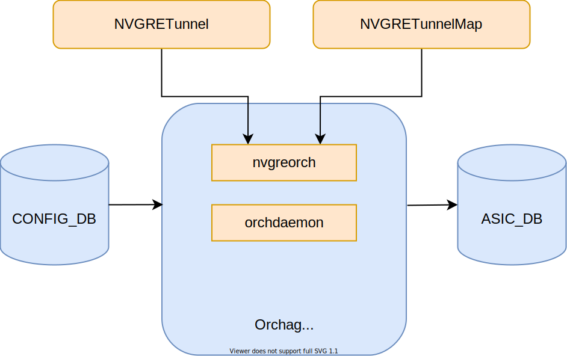
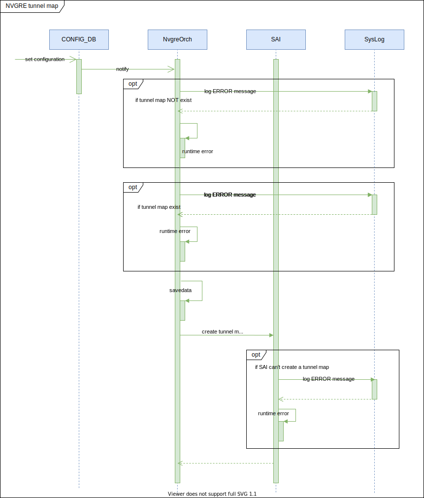
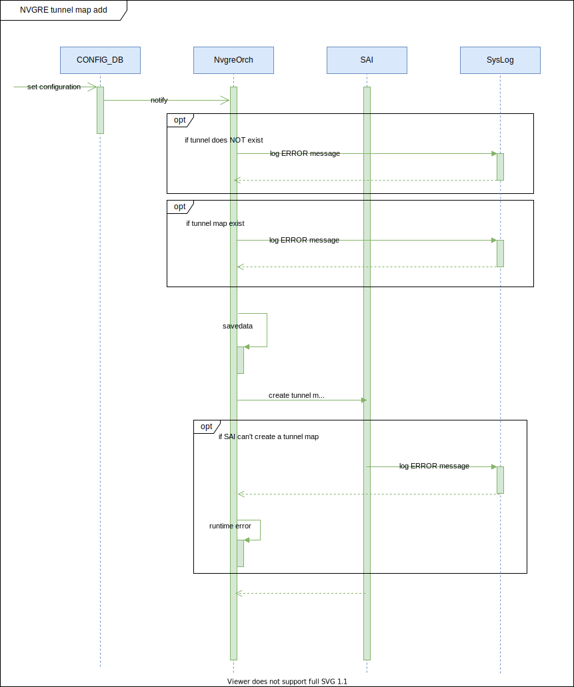
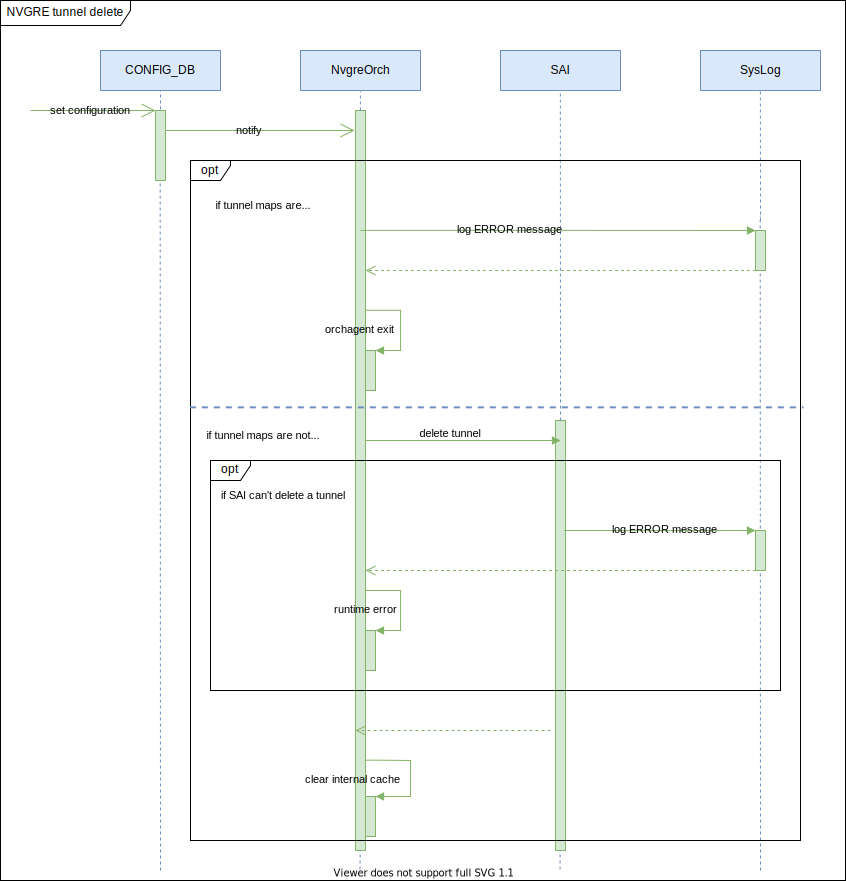
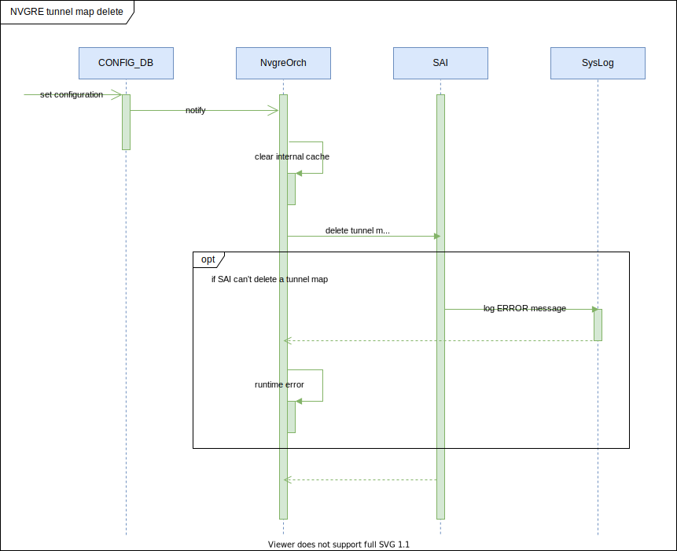
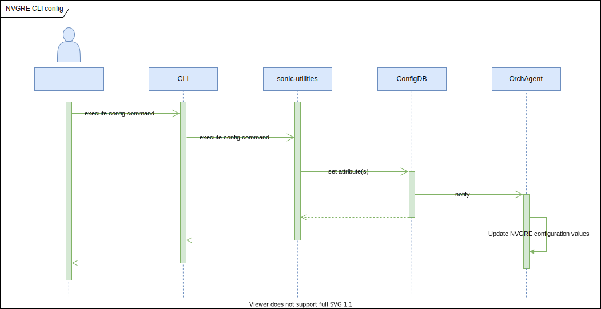
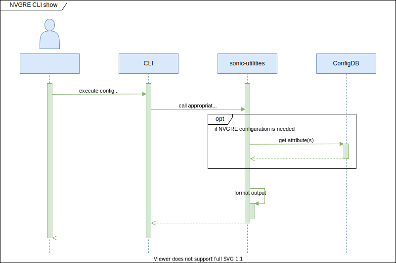

# NVGRE tunnel in SONIC #

## Table of Content 

- [Revision](#revision)
- [Scope](#scope)
- [Definitions/Abbreviations](#definitionsabbreviations)
- [Overview](#overview)
- [Requirements](#requirements)
- [Architecture Design](#architecture-design)
- [High-level design](#high-level-design)
- [SAI API](#sai-api)
- [CLI/YANG model Enhancements](#cli-yang-model-enhancements)
- [Warmboot and Fastboot Design Impact](#warmboot-and-fastboot-design-impact)
- [Restrictions Limitations](#restrictions-limitations)
- [Testing Requirements Design](#testing-requirements-design)
- [Open/Action items](#open-action-items)

### Revision  

|  Rev  |  Date   |      Author      | Change Description |
| :---: | :-----: | :--------------: | ------------------ |
|  1.0  | 09/2021 | Vadym Hlushko    | Phase 1 Design     |

### Scope  

This document provides general information about the NVGRE tunnel feature implementation in SONiC.

### Definitions/Abbreviations 

| Abbreviation | Definition                            |
|--------------|---------------------------------------|
| SONiC        | Software for Open Networking in Cloud |
| NVGRE        | Network Virtualization using Generic Routing Encapsulation |
| VxLAN        | Virtual Extensible LAN                | 
| VSID         | Virtual Subnet Identifier |
| DB           | Database                              |
| API          | Application Programming Interface     |
| SAI          | Switch Abstraction Interface          |
| YANG         | Yet Another Next Generation           |
| CLI          | Command-line interface                |

### Overview 

NVGRE is a network virtualization method that uses encapsulation and tunneling to create large numbers of virtual LANs (VLANs) for subnets that can extend across dispersed data centers and layer 2 (the data link layer) and  layer 3 (the network layer). The SONIC has no support of NVGRE tunnel feature and appropriate SAI implementation for it. 

From the architecture point of view the new orchagent daemon will be added to cover the NVGRE functionality. New daemon should handle the configuration taken from config DB, and call an appropriate SAI API, which will create tunnel and tunnel maps.

### Requirements

This section describes the SONiC requirements for NVGRE feature.

At a high level the following should be supported:

- User should be able to create NVGRE tunnel (L2 over L3 tunnel)
- User should be able to create VLAN to VSID mapper entries for the NVGRE tunnel
- Both VLAN and Bridge to VSID mappers should be supported by the NVGRE tunnel
- Only the decapsulation mappers supported
- YANG model should be created in order to auto-generate CLI by using the [SONiC CLI Auto-generation tool](https://github.com/sonic-net/SONiC/blob/master/doc/cli_auto_generation/cli_auto_generation.md).
- CLI for NVGRE tunnel

Counters for NVGRE Tunnel are out of scope of this design document.

### Architecture Design 

The new tables will be added to Config DB. Unless otherwise stated, the attributes are mandatory.

#### NVGRE configDB table

```
NVGRE_TUNNEL|{{tunnel_name}} 
    "src_ip": {{ip_address}} 

NVGRE_TUNNEL_MAP|{{tunnel_name}}|{{tunnel_map_name}}
    "vsid": {{vsid_id}}
    "vlan": {{vlan_id}}
```

#### ConfigDB schemas

```
; Defines schema for NVGRE Tunnel configuration attributes
key                                   = NVGRE_TUNNEL|tunnel_name      ; NVGRE tunnel configuration
; field                               = value
src_ip                                = ipv4 or ipv6                  ; IP source address

;value annotations
h16        = 1*4HEXDIG
ls32       = h16 ":" h16
dec-octet  = DIGIT                     ; 0-9
             / %x31-39 DIGIT           ; 10-99
             / "1" 2DIGIT              ; 100-199
             / "2" %x30-34 DIGIT       ; 200-249
ipv4       = dec-octet "." dec-octet "." dec-octet "." dec-octet
ipv6       = 6( h16 ":" ) ls32
             /                       "::" 5( h16 ":" ) ls32
             / [               h16 ] "::" 4( h16 ":" ) ls32
             / [ *1( h16 ":" ) h16 ] "::" 3( h16 ":" ) ls32
             / [ *2( h16 ":" ) h16 ] "::" 2( h16 ":" ) ls32
             / [ *3( h16 ":" ) h16 ] "::"    h16 ":"   ls32
             / [ *4( h16 ":" ) h16 ] "::"              ls32
             / [ *5( h16 ":" ) h16 ] "::"              h16
             / [ *6( h16 ":" ) h16 ] "::"
```

```
; Defines schema for NVGRE Tunnel map configuration attributes
key                                   = NVGRE_TUNNEL|tunnel_name|tunnel_map_name ; NVGRE tunnel configuration
; field                               = value
vsid                                  = DIGITS                             ; 1 to 16 million values
vlan                                  = 1\*4DIGIT                          ; 1 to 4094 Vlan id
```

#### Orchestration agent

The following orchestration agents will be added or modified. The flow diagrams are captured in a later section.

##### Figure 1. Orchestration agents

<p align=center>

</p>

#### NvgreOrch

`nvgreorch` - it is an orchestration agent that handles the configuration requests directly from ConfigDB. The `nvgreorch` is responsible for creating the tunnel and attaches encap and decap mappers. Both VLAN and Bridge tunnel maps are created for NVGRE tunnel by default, so it would be possible to apply both VLAN/VSID and Bridge/VSID map entries.

#### Orchdaemon

`orchdaemon` - it is the main orchestration agent, which handles all Redis DB's updates, then calls appropriate orchagent, the new `nvgreorch` should be registered inside an `orchdaemon`.

### High-Level Design 

The following sub-modules will be modified:
* [sonic-swss](https://github.com/sonic-net/sonic-swss) - will be extended with the new orchestration agent for NVGRE.
* [sonic-swss-common](https://github.com/sonic-net/sonic-swss-common) - will be extended with the new tables for ConfigDB.
* [sonic-utilities](https://github.com/sonic-net/sonic-utilities) - will be extened with the new CLI.

#### Sequence diagrams

##### Figure 2. NVGRE Tunnel creation flow

<p align=center>

</p>

##### Figure 3. NVGRE Tunnel Map creation flow

<p align=center>

</p>

##### Figure 4. NVGRE Tunnel delete flow

Note that deleting a tunnel requires the user to remove all the configuration that are associated with this tunnel, it will not be done for the user automatically.

<p align=center>

</p>

##### Figure 5. NVGRE Tunnel Map delete flow

<p align=center>

</p>

##### Figure 6. NVGRE Tunnel CLI config

<p align=center>

</p>

##### Figure 7. NVGRE Tunnel CLI show

<p align=center>

</p>

### SAI API 

The NVGRE Tunnel feature require at least `SAI 1.9` or above.

| NVGRE component | SAI attribute |
|--------------|---------------------------------------|
| NVGRE tunnel type | SAI_TUNNEL_TYPE_NVGRE |
| Decap mapper | SAI_TUNNEL_MAP_TYPE_VSID_TO_VLAN_ID |
| Decap mapper | SAI_TUNNEL_MAP_TYPE_VSID_TO_BRIDGE_IF |
| NVGRE tunnel termination entry type | SAI_TUNNEL_TERM_TABLE_ENTRY_TYPE_P2MP |


### CLI/YANG model Enhancements 

#### NVGRE Tunnel YANG model

```yang
module sonic-nvgre-tunnel {

    yang-version 1.1;

    namespace "http://github.com/Azure/sonic-nvgre-tunnel";
    prefix nvgre;

    import ietf-inet-types {
        prefix inet;
    }

    import sonic-vlan {
        prefix vlan;
    }

    description "NVGRE Tunnel YANG Module for SONiC OS";

    revision 2021-10-31 {
        description
            "First Revision";
    }

    container sonic-nvgre-tunnel {

        container NVGRE_TUNNEL {

            description "NVGRE_TUNNEL part of config_db.json";

            list NVGRE_TUNNEL_LIST {

                key "tunnel_name";

                leaf tunnel_name {
                    description "NVGRE Tunnel name";

                    type string {
                        length 1..255;
                    }
                }

                leaf src_ip {
                    description "Source IP address";

                    mandatory true;
                    type inet:ip-address;
                }

            }
            /* end of NVGRE_TUNNEL_LIST */

        }
        /* end of container NVGRE_TUNNEL */

        container NVGRE_TUNNEL_MAP {

            description "NVGRE_TUNNEL_MAP part of config_db.json";

            list NVGRE_TUNNEL_MAP_LIST {

                key "tunnel_name tunnel_map_name";

                leaf tunnel_name {
                    description "NVGRE Tunnel name";

                    type leafref {
                        path /nvgre:sonic-nvgre-tunnel/nvgre:NVGRE_TUNNEL/nvgre:NVGRE_TUNNEL_LIST/nvgre:tunnel_name;
                    }
                }

                leaf tunnel_map_name {
                    description "NVGRE Tunnel map name";

                    type string {
                        length 1..255;
                    }
                }

                leaf vlan_id {
                    description "VLAN identifier";

                    mandatory true;
                    type uint16 {
                        range 1..4094;
                    }
                }

                leaf vsid {
                    description "Virtual Subnet Identifier";

                    mandatory true;
                    type uint32 {
                        range 0..16777214;
                    }
                }

            }
            /* end of NVGRE_TUNNEL_MAP_LIST */

        }
        /* end of container NVGRE_TUNNEL_MAP */

    }
    /* end of container sonic-nvgre-tunnel */

}
/* end of module sonic-nvgre-tunnel */
```

#### CLI tree

Commands summary (Phase #2):

```
	- config nvgre-tunnel add/del <nvgre_tunnel_name> --src-ip <src_ip>
	- config nvgre-tunnel-map add/del <nvgre_tunnel_name> <tunnel_map_name> --vlan_id <vlan_id> --vsid <vsid_id>
	- show nvgre-tunnel
	- show nvgre-tunnel-map
```

##### Show CLI command

Show command should be extended in order to add "nvgre-tunnel" and "nvgre-tunnel-map" aliases:

```
admin@sonic:~$ show nvgre-tunnel
TUNNEL NAME    SRC IP
-------------  --------
tunnel1        10.0.0.1
tunnel2        2.2.2.2
tunnel3        3.3.3.3

=============================================

admin@sonic:~$ show nvgre-tunnel-map
TUNNEL NAME    TUNNEL MAP NAME    VLAN ID    VSID
-------------  -----------------  ---------  ------
tunnel_1       Vlan1000           1000       5000
```

##### Config CLI command

Config command should be extended in order to add "nvgre-tunnel" and "nvgre-tunnel-map" aliases:

```
admin@sonic:~$ config nvgre-tunnel --help
Usage: nvgre-tunnel [OPTIONS] COMMAND [ARGS]...

  NVGRE_TUNNEL part of config_db.json

Options:
  --help  Show this message and exit.

Commands:
  add     Add object in NVGRE_TUNNEL.
  delete  Delete object in NVGRE_TUNNEL.

=============================================

admin@sonic:~$ config nvgre-tunnel add --help
Usage: add [OPTIONS] TUNNEL_NAME

  Add object in NVGRE_TUNNEL.

Options:
  --src-ip  Source IP address[mandatory]
  --help    Show this message and exit.

=============================================

admin@sonic:~$ config nvgre-tunnel-map --help
Usage: nvgre-tunnel-map [OPTIONS] COMMAND [ARGS]...

  NVGRE_TUNNEL_MAP part of config_db.json

Options:
  --help  Show this message and exit.

Commands:
  add     Add object in NVGRE_TUNNEL_MAP.
  delete  Delete object in NVGRE_TUNNEL_MAP.

=============================================

admin@sonic:~$ config nvgre-tunnel-map add --help
Usage: add [OPTIONS] TUNNEL_NAME TUNNEL_MAP_NAME

  Add object in NVGRE_TUNNEL_MAP.

Options:
  --vlan-id  VLAN identifier[mandatory]
  --vsid     Virtual Subnet Identifier[mandatory]
  --help     Show this message and exit.
```

#### Config DB Enhancements

The ConfigDB will be extended with next objects:

```json
{
	"NVGRE_TUNNEL": {
		"tunnel1": {
			"src_ip": "2.2.2.2"
		}
	},
	"NVGRE_TUNNEL_MAP": {
		"tunnel1|Vlan2000": {
			"vlan_id": "2000",
			"vsid": "2000",
		}
	}
}
```

### Warmboot and Fastboot Design Impact  

No impact on Warmboot and Fastboot features.

### Restrictions/Limitations

The number of the tunnels are not limited by SONiC, but if ASIC vendor reach the max resources, the SAI will return an error, when the user will try to create a new tunnel or tunnel map and orchagent will abort.

### Testing Requirements/Design  

The tests will be implemented under the VS environment and will be placed - [sonic-swss/tests](https://github.com/sonic-net/sonic-swss/tree/master/tests) sub-module.

#### Unit Test cases

VS test cases:
- create NVGRE Tunnel
  - create a tunnel with invalid source IP address
  - create a tunnel with valid params
- remove NVGRE Tunnel
  - remove existing tunnel
  - remove unexisting tunnel
  - remove a tunel with which have associated with a tunel maps
- create NVGRE Tunnel Map
  - create a tunnel map with invalid VLAN identifier
  - create a tunnel map with invalid VSID number
  - create a tunnel map with unexisting NVGRE Tunnel name
  - create valid tunnel map
- remove NVGRE Tunnel Map
  - remove existing tunnel
  - remove unexisting tunnel

#### System Test cases

NVGRE decap:
- apply NVGRE config
- send encapsulated traffic
- validate if decapsulation processed correctly

### Open/Action items
