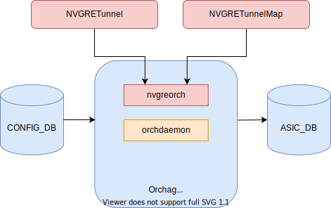
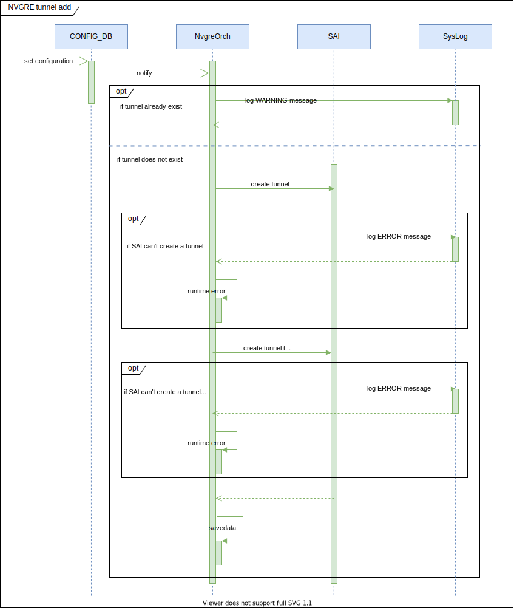
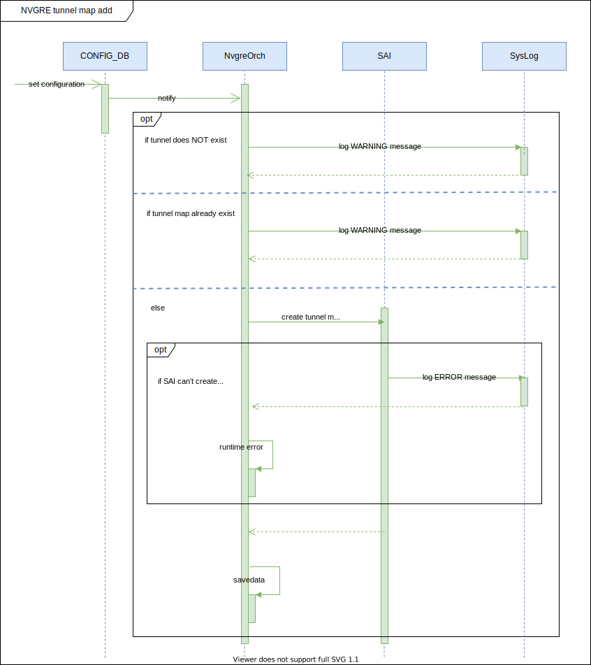
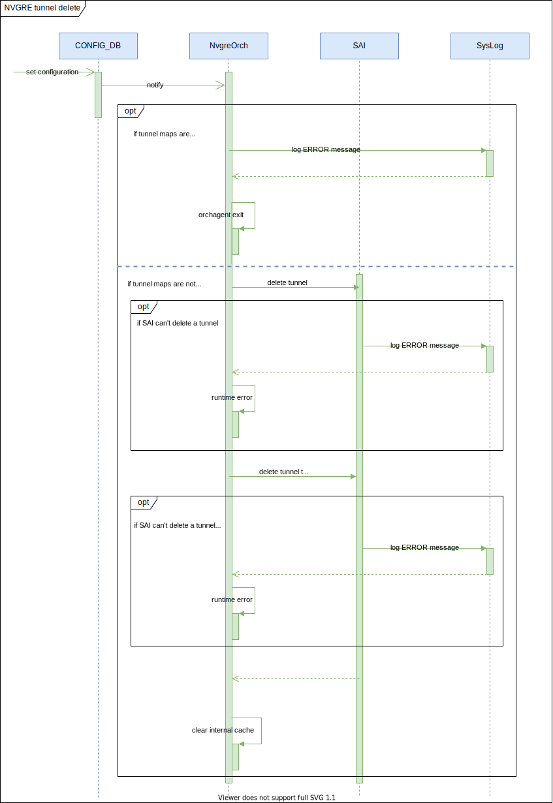
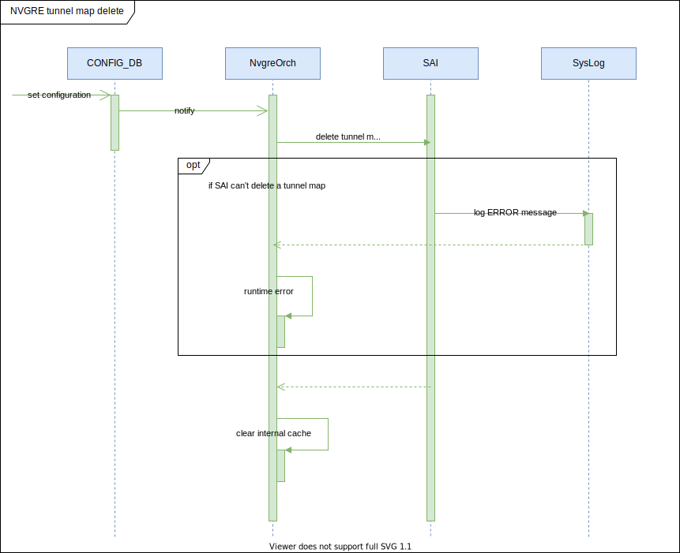
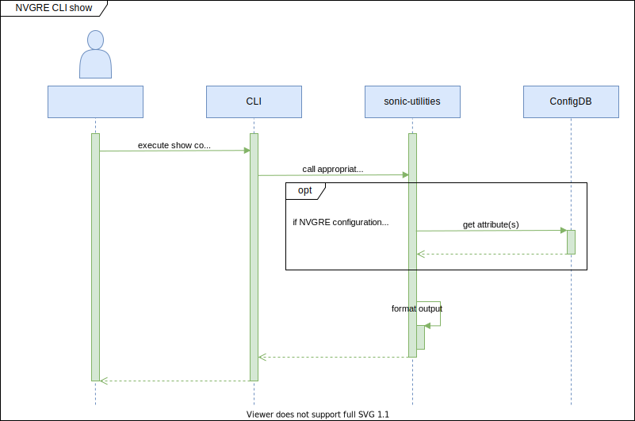

# NVGRE tunnel in SONIC #

## Table of Content 

- [Revision](#revision)
- [Scope](#scope)
- [Definitions/Abbreviations](#definitionsabbreviations)
- [Overview](#overview)
- [Requirements](#requirements)
- [Architecture Design](#architecture-design)
- [High-level design](#high-level-design)
- [SAI API](#sai-api)
- [CLI/YANG model Enhancements](#cli-yang-model-enhancements)
- [Warmboot and Fastboot Design Impact](#warmboot-and-fastboot-design-impact)
- [Restrictions Limitations](#restrictions-limitations)
- [Testing Requirements Design](#testing-requirements-design)
- [Open/Action items](#open-action-items)

### Revision  

|  Rev  |  Date   |      Author      | Change Description |
| :---: | :-----: | :--------------: | ------------------ |
|  1.0  | 09/2021 | Vadym Hlushko    | Phase 1 Design     |

### Scope  

This document provides general information about the NVGRE tunnel feature implementation in SONiC.

### Definitions/Abbreviations 

| Abbreviation | Definition                            |
|--------------|---------------------------------------|
| SONiC        | Software for Open Networking in Cloud |
| NVGRE        | Network Virtualization using Generic Routing Encapsulation |
| VxLAN        | Virtual Extensible LAN                | 
| VSID         | Virtual Subnet Identifier |
| DB           | Database                              |
| API          | Application Programming Interface     |
| SAI          | Switch Abstraction Interface          |
| YANG         | Yet Another Next Generation           |
| CLI          | Command-line interface                |

### Overview 

NVGRE is a network virtualization method that uses encapsulation and tunneling to create large numbers of virtual LANs (VLANs) for subnets that can extend across dispersed data centers and layer 2 (the data link layer) and  layer 3 (the network layer). The SONIC has no support of NVGRE tunnel feature and appropriate SAI implementation for it. 

From the architecture point of view the new orchagent daemon will be added to cover the NVGRE functionality. New daemon should handle the configuration taken from config DB, and call an appropriate SAI API, which will create tunnel and tunnel maps.

### Requirements

This section describes the SONiC requirements for NVGRE feature.

At a high level the following should be supported:

- Phase #1
  - User should be able to create NVGRE tunnel
  - User should be able to create VLAN to VSID mapper entries for the NVGRE tunnel
  - Both VLAN and Bridge to VSID mappers should be supported by the NVGRE tunnel
  - YANG model should be created in order to auto-generate CLI by using the [SONiC CLI Auto-generation tool](https://github.com/Azure/SONiC/blob/master/doc/cli_auto_generation/cli_auto_generation.md).
- Phase #2
  - CLI for NVGRE tunnel

### Architecture Design 

The new tables will be added to Config DB. Unless otherwise stated, the attributes are mandatory.

#### NVGRE configDB table

```
NVGRE_TUNNEL|{{tunnel_name}} 
    "src_ip": {{ip_address}} 

NVGRE_TUNNEL_MAP|{{tunnel_name}}|{{tunnel_map}}
    "vsid": {{vsid_id}}
    "vlan": {{vlan_id}}
```

#### ConfigDB schemas

```
; Defines schema for NVGRE Tunnel configuration attributes
key                                   = NVGRE_TUNNEL:name             ; NVGRE tunnel configuration
; field                               = value
SRC_IP                                = ipv4                          ; IPv4 source address

;value annotations
ipv4          = dec-octet "." dec-octet "." dec-octet "." dec-octet
dec-octet     = DIGIT                     ; 0-9  
                  / %x31-39 DIGIT         ; 10-99  
                  / "1" 2DIGIT            ; 100-199  
                  / "2" %x30-34 DIGIT     ; 200-249
```

```
; Defines schema for NVGRE Tunnel map configuration attributes
key                                   = NVGRE_TUNNEL:tunnel_name:name ; NVGRE tunnel configuration
; field                               = value
VSID                                  = DIGITS                        ; 1 to 16 million values
VLAN                                  = 1\*4DIGIT                     ; 1 to 4094 Vlan id
```

#### Orchestration agent

The following orchestration agents will be added or modified. The flow diagrams are captured in a later section.

##### Figure 1. Orchestration agents

<p align=center>

</p>

#### NvgreOrch

`nvgreorch` - it is an orchestration agent that handles the configuration requests directly from ConfigDB. The `nvgreorch` is responsible for creating the tunnel and attaches encap and decap mappers. Both VLAN and Bridge tunnel maps are created for NVGRE tunnel by default, so it would be possible to apply both VLAN/VSID and Bridge/VSID map entries.

#### Orchdaemon

`orchdaemon` - it is the main orchestration agent, which handles all Redis DB's updates, then calls appropriate orchagent, the new `nvgreorch` should be registered inside an `orchdaemon`.

### High-Level Design 

The following sub-modules will be modified:
* [sonic-swss](https://github.com/Azure/sonic-swss) - will be extended with the new orchestration agent for NVGRE.
* [sonic-swss-common](https://github.com/Azure/sonic-swss-common) - will be extended with the new tables for ConfigDB.
* [sonic-utilities](https://github.com/Azure/sonic-utilities) - will be extened with the new CLI.

#### Sequence diagrams

##### Figure 2. NVGRE Tunnel creation flow

<p align=center>

</p>

##### Figure 3. NVGRE Tunnel Map creation flow

<p align=center>

</p>

##### Figure 4. NVGRE Tunnel delete flow

<p align=center>

</p

##### Figure 5. NVGRE Tunnel Map delete flow

<p align=center>

</p

##### Figure 4. NVGRE Tunnel CLI config

<p align=center>

</p>

##### Figure 5. NVGRE Tunnel CLI show

<p align=center>

</p>

### SAI API 

| NVGRE component | SAI attribute |
|--------------|---------------------------------------|
| NVGRE tunnel type | SAI_TUNNEL_TYPE_NVGRE |
| Encap mapper | SAI_TUNNEL_MAP_TYPE_VLAN_ID_TO_VSID |
| Decap mapper | SAI_TUNNEL_MAP_TYPE_VSID_TO_VLAN_ID |
| Encap mapper | SAI_TUNNEL_MAP_TYPE_BRIDGE_IF_TO_VSID |
| Decap mapper | SAI_TUNNEL_MAP_TYPE_VSID_TO_BRIDGE_IF |

### CLI/YANG model Enhancements 

#### NVGRE Tunnel YANG model

```yang
module sonic-nvgre-tunnel {

    yang-version 1.1;

    namespace "http://github.com/Azure/sonic-nvgre-tunnel";
    prefix copp;

    import ietf-inet-types {
        prefix inet;
    }

    import sonic-vlan {
        prefix vlan;
    }

    description "NVGRE Tunnel YANG Module for SONiC OS";

    revision 2021-08-31 {
        description
            "First Revision";
    }

    container sonic-nvgre-tunnel {

        container NVGRE_TUNNEL {

            description "NVGRE_TUNNEL part of config_db.json";

            list NVGRE_TUNNEL_LIST {

                key "tunnel_name";

                leaf tunnel_name {
                    description "NVGRE Tunnel name";

                    type string {
                        length 1..255;
                    }
                }

                leaf src_ip {
                    mandatory true;
                    type inet:ip-address;
                }

            }
            /* end of NVGRE_TUNNEL_LIST */

        }
        /* end of container NVGRE_TUNNEL */

        container NVGRE_TUNNEL_MAP {

            description "NVGRE_TUNNEL part of config_db.json";

            list NVGRE_TUNNEL_MAP_LIST {

                key "tunnel_name vlan_name";

                leaf tunnel_name {
                    type leafref {
                        path /nvgre:sonic-nvgre-tunnel/nvgre:NVGRE_TUNNEL/nvgre:NVGRE_TUNNEL_LIST/nvgre:tunnel_name;
                    }
                }

                leaf vlan_name {
                    type leafref {
                        path /vlan:sonic-vlan/vlan:VLAN/vlan:VLAN_LIST/vlan:name;
                    }
                }

                leaf vlan_id {
                    type uint16 {
                        range 1..4094;
                    }
                }

                leaf vsid {
                    type uint24 {
                        range 4095..16777214;
                    }
                }

            }
            /* end of NVGRE_TUNNEL_MAP_LIST */

        }
        /* end of container NVGRE_TUNNEL_MAP */

    }
    /* end of container sonic-nvgre-tunnel */

}
/* end of module sonic-nvgre-tunnel */
```

#### CLI tree

Commands summary (Phase #2):

```
	- config nvgre tunnel add/del <nvgre_tunnel_name> --src-ip <src_ip>
	- config nvgre tunnel-map add/del <nvgre_tunnel_name> --vlan_id <vlan_id> --vsid <vsid_id>
	- show nvgre tunnel
	- show nvgre tunnel-map
```

##### Show CLI command

Show command should be extended in order to add "nvgre" alias:

```
admin@sonic:~$ show nvgre --help
Usage: show nvgre [OPTIONS] COMMAND [ARGS]...

Show nvgre related information

Options:
-?, -h, --help Show this message and exit.

Commands:
  tunnel     Show nvgre tunnel information.
  tunnel-map Show nvgre tunnel mappings.

=============================================

admin@sonic:~$ show nvgre tunnel
NVGRE TUNNEL NAME   SOURCE IP
------------------- -----------
tunnel2             2.2.2.2
tunnel3             3.3.3.3

=============================================

admin@sonic:~$ show nvgre tunnel-map
NVGRE TUNNEL NAME   VLAN        VNI
------------------- ----------- ------------
tunnel2             2000        2000
tunnel3             3000        3000
```

##### Config CLI command

Config command should be extended in order to add "nvgre" alias:

```
admin@sonic:~$ config nvgre --help
Usage: config nvgre [OPTIONS] COMMAND [ARGS]...

config nvgre tunnel

Options:
-?, -h, --help Show this message and exit.

Commands:
  tunnel      config nvgre tunnel.
  tunnel-map  config nvgre tunnel mappings.

=============================================

admin@sonic:~$ config nvgre tunnel --help
Usage: config nvgre tunnel [OPTIONS] COMMAND [ARGS]...

Config nvgre tunnel

Options:
  -?, -h, --help Show this message and exit.

Commands:
  add     Add configuration.
  del     Del configuration.

=============================================

admin@sonic:~$ config nvgre tunnel add --help
Usage: config nvgre tunnel add [OPTIONS] <tunnel_name>

Add nvgre tunnel

Options:
  -?, -h, --help Show this message and exit.
  --src-ip       Source IP address.

=============================================

admin@sonic:~$ config nvgre tunnel-map --help
Usage: config nvgre tunnel-map [OPTIONS] COMMAND [ARGS]...

Config nvgre tunnel mapping

Options:
  -?, -h, --help Show this message and exit.

Commands:
  add     Add configuration.
  del     Del configuration.

=============================================

admin@sonic:~$ config nvgre tunnel-map add --help
Usage: config nvgre tunnel-map add [OPTIONS] <tunnel_name> <vlan_name>

Add nvgre tunnel mapping

Options:
  -?, -h, --help Show this message and exit.
  --vlan_id  VLAN identifier.
  --vsid     Virtual Subnet Identifier.

```

#### Config DB Enhancements

The ConfigDB will be extended with next objects:

```json
{
	"NVGRE_TUNNEL": {
		"tunnel1": {
			"src_ip": "2.2.2.2"
		}
	},
	"NVGRE_TUNNEL_MAP": {
		"tunnel1|Vlan2000": {
			"vlan_id": "2000",
			"vsid": "2000",
		}
	}
}
```

### Warmboot and Fastboot Design Impact  

No impact on Warmboot and Fastboot features.

### Restrictions/Limitations  

### Testing Requirements/Design  

The tests will be implemented under the VS environment and will be placed - [sonic-swss/tests](https://github.com/Azure/sonic-swss/tree/master/tests) sub-module.

#### Unit Test cases

VS test cases:
- create NVGRE Tunnel
	- create tunnel with invalid source IP address
	- create tunnel with valid params
- remove NVGRE Tunnel
  - remove existing tunnel
  - remove unexisting tunnel
- create NVGRE Tunnel Map
  - create tunnel map with invalid VLAN identifier
  - create tunnel map with invalid VSID number
  - create tunnel map with unexisting NVGRE Tunnel name
- remove NVGRE Tunnel Map
  - remove existing tunnel
  - remove unexisting tunnel

#### System Test cases

### Open/Action items