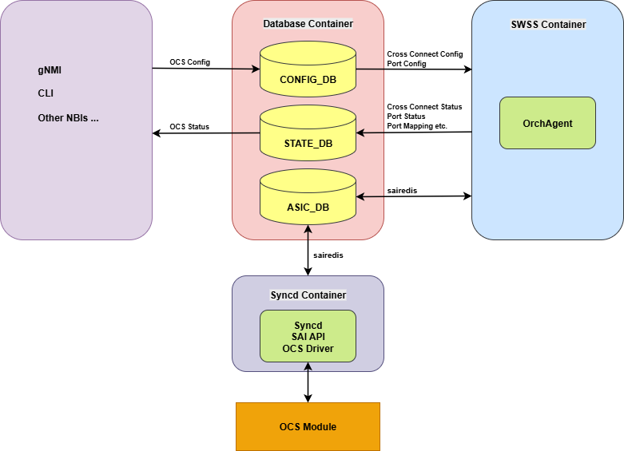
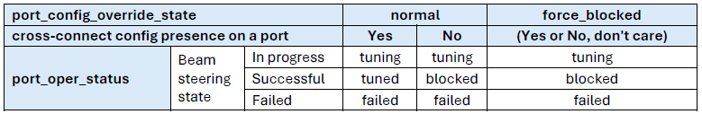
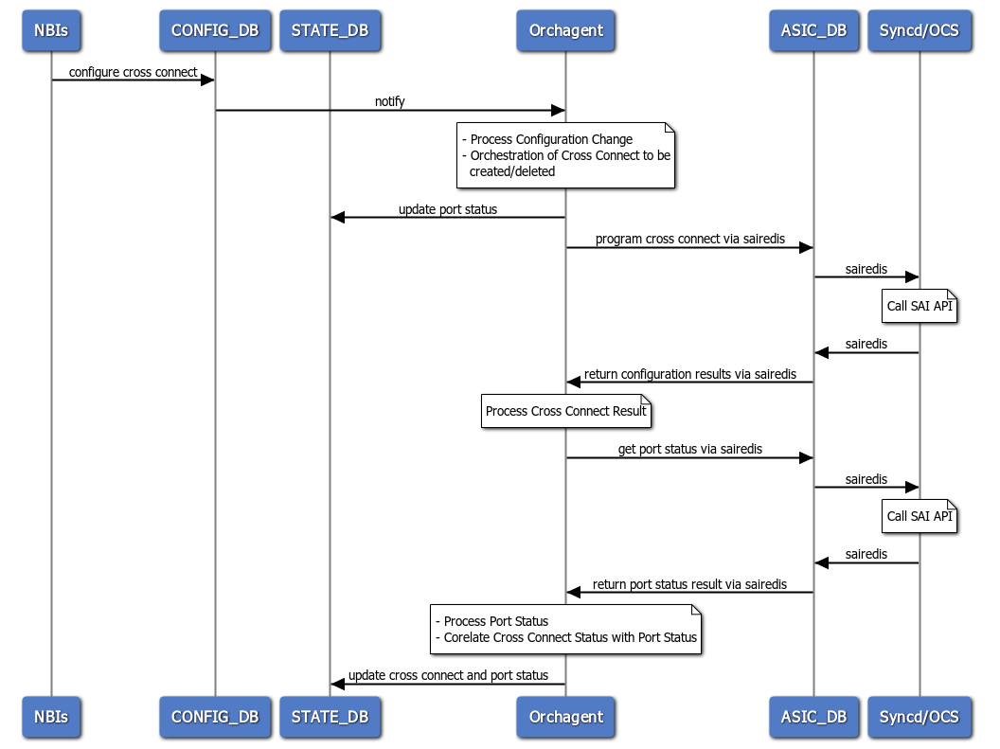

# OCS Support in SONiC

# High Level Design Document

# Table of Contents
<!-- code_chunk_output -->
- [OCS Support in SONiC](#ocs-support-in-sonic)
- [High Level Design Document](#high-level-design-document)
- [Table of Contents](#table-of-contents)
  - [1. Revision](#1-revision)
  - [2. Scope](#2-scope)
  - [3. Definitions](#3-definitions)
  - [4. Requirements](#4-requirements)
  - [5. Architecture Design](#5-architecture-design)
  - [6. High-Level Design](#6-high-level-design)
    - [6.1. Database Changes](#61-database-changes)
      - [6.1.1. CONFIG\_DB](#611-config_db)
      - [6.1.2. STATE\_DB](#612-state_db)
    - [6.2. Orchestration Agent](#62-orchestration-agent)
      - [6.2.1. Management of OCS Switch Capacity](#621-management-of-ocs-switch-capacity)
      - [6.2.2. Management of OCS cross-connect](#622-management-of-ocs-cross-connect)
      - [6.2.3. Management of OCS Port](#623-management-of-ocs-port)
      - [6.2.4. Sequence Diagrams](#624-sequence-diagrams)
    - [6.3. Syncd](#63-syncd)
  - [7. SAI](#7-sai)
    - [7.1. OCS SAI Object and Attributes](#71-ocs-sai-object-and-attributes)
    - [7.2. OCS SAI APIs](#72-ocs-sai-apis)
  - [Usage Example: Create OCS Ports](#usage-example-create-ocs-ports)
  - [Usage Example: Create OCS Cross-Connect](#usage-example-create-ocs-cross-connect)
    - [8. YANG Model](#8-yang-model)
    - [9. CLI](#9-cli)
    - [9.1. Configuration Commands](#91-configuration-commands)
      - [9.1.1. Create cross-connect](#911-create-cross-connect)
      - [9.1.2. Delete cross-connect](#912-delete-cross-connect)
      - [9.1.3. Set OCS Port Label and State](#913-set-ocs-port-label-and-state)
    - [9.2. Show Commands](#92-show-commands)
      - [9.2.1. Show OCS cross-connect](#921-show-ocs-cross-connect)
      - [9.2.2. Show OCS Port](#922-show-ocs-port)
      - [9.2.3. Show OCS port-mapping](#923-show-ocs-port-mapping)
      - [9.2.3. Show OCS factory-insertion-loss](#923-show-ocs-factory-insertion-loss)
  - [10. Serviceability and Debug](#10-serviceability-and-debug)
  - [11. Warm Boot Support](#11-warm-boot-support)
  - [12. Unit Test](#12-unit-test)
<!-- /code_chunk_output -->

&nbsp;
## 1. Revision
| Rev  | Date       | Author                              | Change Description                                      |
|:-----|:-----------|:------------------------------------|:--------------------------------------------------------|
| 0.1  | 10/10/2025 | Weiguo Ni, Meng Liu, Chen Wu        | Initial Version                                         |
| 0.2  | 03/10/2026 | Weiguo Ni, Meng Liu, Chen Wu        | Update with OCS SAI Proposal                            |
| 0.3  | 03/20/2026 | Weiguo Ni, Meng Liu, Chen Wu        | Add summary about main changes and the changed repos    |
| 0.4  | 03/27/2026 | Weiguo Ni, Meng Liu, Chen Wu        | Update orchagent solution description, repos table, questions for CLI |
| 0.5  | 04/20/2026 | Weiguo Ni, Meng Liu, Chen Wu        | Update description about syslog for alerting and flexibility on naming rule |

&nbsp;    
## 2. Scope

This document describes high level design details of OCS support in SONiC.

&nbsp;    
## 3. Definitions

| Abbreviation | Description                           |
| :----------  | :-----------------------------------  |
| OCS          | Optical Circuit Switch                |
| SAI          | Switch Abstraction Interface          |
| API          | Application Programming Interface     |
| NBI          | Northbound Interface                  |
| CLI          | Command Line Interface                |

&nbsp;    
## 4. Requirements
This section describes the requirements for the initial support OCS in SONiC infrastructure
* Support creation and deletion of OCS cross-connects, including both individual switching and simultaneous switching with multiple connections.
* Support batch processing on parallel cross-connect configuration for better performance.
* Support OCS ports operation, including the ability to assign a state to any specified group of ports.
* Support operational status of cross-connects and ports, also port status will be updated promptly in processing of any port state and cross-connect configuration change.
* Support the retrieval of current operational status on any OCS cross-connect or port.
* Support the retrieval of hardware-specific OCS module data, such as port mapping information and factory insertion loss values etc.
* Support all configuration and data retrieval capabilities through Northbound Interfaces (NBIs), such as gNMI and CLI etc.
* Support on-demand system warm restart.

&nbsp;    
## 5. Architecture Design
To support OCS, the following design and changes will be implemented across the existing SONiC solution and containers:    
* Database Tables
  - New tables will be added to CONFIG_DB (for configuration data) and STATE_DB (for operational status data).
* OCS Orch Implementation
  - A new OCS Orchestration application (OCS Orch) will be included within the existing SWSS container's Orchagent. Main functions of this new agent will be the following items:
    * Monitor Configuration: Register for Redis keyspace notifications on new OCS_PORT and OCS_CROSS_CONNECT tables in CONFIG_DB. This can be extended to database changes on other DB instances such as APPL_DB if needed for more scenarios, like dynamic case etc.  
    * Process Changes: Handle and apply configuration updates for OCS ports and cross-connects upon changed in CONFIG_DB.
    * Update Status: Reflect the current operational status of OCS ports and cross-connects by updating the data into STATE_DB.
    * Retrieve Module Data: Fetch operational data (e.g., port mapping information) from OCS module and update it into STATE_DB.
* OCS SAI Extension
  - New OCS SAI Definitions to make Orchagent to configure OCS module and retrieve its operational data via Switch Abstraction Interface (SAI).

The OCS orchagent operates independently from the L2/L3 data plane. To support this, applications in the swss Docker container can be customized so that the orchagent only includes OCS specific orchestrations, without starting any L2/L3 related orchestrations. Following approach which is similar to handling of "fabric" switch is used:
* For OCS platforms, the switch_type field in DEVICE_METADATA within CONFIG_DB is initialized to "ocs". 
* During startup, orchagent checks the switch_type, initializes the switch accordingly, and starts the appropriate orchestration agents.      
* In addition, other applications running in the SWSS Docker container are controlled via supervisord configuration that is customized based on the switch_type.
   



Main Changes    
| Code Directory  | Repo | Change Description |
| --- | --- | --- | 
| src/sonic-gnmi |sonic-gnmi  | Use batch commit (redis MULTI/EXEC) for OCS cross-connect configurations      | 
| src/sonic-sairedis/SAI | sai |  New OCS SAI definitions     | 
| src/sonic-swss | sonic-swss |  New OCS Orchagent     | 
| src/sonic-utilities | sonic-utilities |  New OCS CLI commands     | 
| src/sonic-mgmt-common | sonic-mgmt-common |  Update CVL for validation of OCS configuration (optional)  | 
| src/sonic-yang-models | sonic-buildimage |  New definitions of OCS configuration and operational status    | 
| src/sonic-yang-mgmt | sonic-buildimage |  Update tests for new OCS YANG definitions     | 
| platform | sonic-buildimage |  Code specific to vendor device, e.g. vendor OCS SAI library, etc.     | 
| device | sonic-buildimage |   Code specific to vendor device    | 

&nbsp;
## 6. High-Level Design
### 6.1. Database Changes
#### 6.1.1. CONFIG_DB
The following new tables are added to CONFIG_DB, based on OCS SONiC YANG defined from Microsoft:

**OCS_PORT**
```
; Description: List of all device ports and their configuration state.
; Key: simplex_port_id (e.g., "1A", "64B")
;
OCS_PORT:simplex_port_id
label                      = 1*VCHAR                    ; Label (string) for cable tracing, e.g., "router1_port1"
state                      = "normal" / "force_blocked" ; Configurable override state (enumeration)
```

**OCS_CROSS_CONNECT**
```
; Description: List of all provisioned cross-connects.
; Key: cross_connect_id (e.g., "1A-2B")
;
OCS_CROSS_CONNECT:cross_connect_id
a_side                     = 1VCHAR             ; Simplex port ID for side A (must match simplex_port_name pattern)
b_side                     = 1VCHAR             ; Simplex port ID for side B (must match simplex_port_name pattern)
```
#### 6.1.2. STATE_DB
The following new tables are added to STATE_DB, based on OCS SONiC YANG defined from Microsoft:

**OCS_PORT**
```
; Description: Operational and inventory data for all possible simplex ports.
; Key: simplex_port_id (e.g., "1A", "64B")
;
OCS_PORT:simplex_port_id
connector_type             = 1VCHAR              ; Connector type, e.g., Duplex LC, MPO/MTP
connector_pin              = 1VCHAR              ; Position of the fiber strand, e.g., "2"
target_simplex_port_id     = 1*VCHAR             ; Target port ID from cross-connect configuration status
status                     = "blocked" / "tuning" / "tuned" / "failed" ; Operational status of the port (enumeration)
```

**OCS_CROSS_CONNECT**
```
; Description: Operational data for currently connected cross-connects, including statuses.
; Key: cross_connect_id (e.g., "1A-2B")
;
OCS_CROSS_CONNECT:cross_connect_id
a_side                     = 1VCHAR             ; Simplex port ID for side A (reference to OCS_PORT)
b_side                     = 1VCHAR             ; Simplex port ID for side B (reference to OCS_PORT)
a_side_status              = 1VCHAR             ; Operational status of side A (reference to OCS_PORT:status)
b_side_status              = 1VCHAR             ; Operational status of side B (reference to OCS_PORT:status)
```

**OCS_CROSS_CONNECT_PHYSICAL_PATH**
```
; Description: Inventory data detailing the physical elements in the path of a cross-connect.
; Key: cross_connect_id (e.g., "1A-2B")
;
OCS_CROSS_CONNECT_PHYSICAL_PATH:cross_connect_id
physical_path              = LIST (1*VCHAR)      ; A sequence of physical elements (leaf-list mapping)
```

**OCS_FACTORY_INSERTION_LOSS**
```
; Description: Inventory data for factory insertion loss measurements. This table uses a composite key.
; Key: cross_connect_id|frequency_THz|temperature_C (e.g., "1A-2B|229.100|25.00")
;
OCS_FACTORY_INSERTION_LOSS:cross_connect_id|frequency_THz|temperature_C
loss_dB                    = DECIMAL (2)         ; Factory insertion loss in dB (2 fraction digits)
accuracy_dB                = DECIMAL (2)         ; Insertion loss measurement accuracy in dB (2 fraction digits)
```
### 6.2. Orchestration Agent 
OCS Orch is the core component for managing OCS configurations and updating corresponding operational status:    
* Manage OCS switch capacity
* Manage configuration and status of OCS ports
* Manage configuration and status of OCS cross-connects
* Manage operational data specific to OCS module

#### 6.2.1. Management of OCS Switch Capacity    
OCS device can have varying capacities from different hardware or module, defined as "number of A side ports" × "number of B side ports" (e.g., 64×64, 320×320, etc.). Cross-connects are provisioned between two ports.
During OCS Orch initialization, the following steps are taken:
* OCS capacity profile is parsed to determine the switch size.
* Ports are created using a new OCS SAI bulk API as the initial data.

#### 6.2.2. Management of OCS cross-connect    
OCS Orch registers DB change notifications on OCS cross-connect table and processes DB changes.

Performance Enhancement:    
In current SONiC implementation, configuration change is committed to CONFIG_DB separately for each entry, Redis keyspace notifications trigger a callback for each individual DB entry change, Orch processes this single change and applies configuration to ASIC via sairedis/Syncd/SAI as a single SAI object operation. Overall processing flow is per entry implementation.
 
To support high-performance on parallel/simultaneous configuration execution with full or multiple OCS cross-connects, a batch processing approach can be implemented with the following proposals:    
* Batch DB Commit: NBIs do batch commit to CONFIG_DB via Redis transaction.
* DB Change Processing: During callback handling, it compares cached entries against new CONFIG_DB entries then invokes bulk creation APIs for all CONFIG_DB cross-connect entries (via SAI error mode: SAI_BULK_OP_ERROR_MODE_IGNORE_ERROR). After this bulk remove is needed to delete SAI related objects from logical view, instead of operations to module or hardware.
* SAI Bulk APIs Applying: Based on this sequence, the vendor SAI library can consolidate configuration into a single call to apply updates to the OCS module as one-time access for better performance.
 
Both port and cross-connect are string definition and have the flexibility to support different scenarios. If multi modules scenario from physical layer still with non blocking switch on all ports, then, 1A..320A and 1B..320B are suitable on this case. If multi OCS slot/instance/module are independent switching domain, then, the naming can be extended, like 1-1A, 3-20B etc., the first number is about slot/instance/module from logic view. Vendor SDK can translate it into the physical layer information.    

_Questions:_  
* "Batch DB Commit, Batch DB Change Processing, SAI Bulk APIs Applying" as the solution for OCS specific scenario, especially "Batch DB Commit" implementation only for OCS_CROSS_CONNECT table. How about other scenarios or applications?  
* Potential enhancement on SAI Bulk APIs to support mixed scenarios, like mixed "create", "set", "remove" operations in one bulk API.    


#### 6.2.3. Management of OCS Port    
* OCS port can be manually configured to state, like "normal" or "force_blocked" etc. 
* OCS Orch registers on OCS_PORT table in CONFIG_DB and applies the port state configuration to Syncd/OCS module during callback. 
* Port operational status will be updated into STATE_DB with corelation between port and cross-connect configuration on the port. 

Following are rules for OCS port operational status:    



Port operational status can be updated via:
* Polling: Poll port operational status after a change to port configuration or OCS cross-connect configuration has been processed.
* Notification: Receive an asynchronous status change notification from Syncd/OCS module.   

#### 6.2.4. Sequence Diagrams
   
**OCS cross-connect Operation Processing Flow**    
The sequence for processing cross-connect configuration and updating status involves two status updates for the ports:    
* Initial Status Update: When cross-connect configuration is processed, the status of the involved ports will be in "tunning".
* Final Status Update: After cross-connects are successfully configured to Syncd/OCS module, the port status will be updated into STATE_DB.



### 6.3. Syncd
The existing Syncd implementation is reused for discovering and calling OCS SAI.    
Also, VendorSai.cpp is changed to support bulk operations on OCS_PORT and OCS_CROSS_CONNECT SAI objects.

&nbsp;    
## 7. SAI
New SAI header file saiocs.h is added to define OCS SAI and summary as below:  

### 7.1. OCS SAI Object and Attributes   
| SAI Object | SAI Attributes | SAI Data Type |
| ---- | ---- | ---- |
|SAI_OBJECT_TYPE_OCS_CROSS_CONNECT  | SAI_OCS_CROSS_CONNECT_ATTR_A_SIDE_PORT_ID | sai_object_id_t
| | SAI_OCS_CROSS_CONNECT_ATTR_B_SIDE_PORT_ID | sai_object_id_t
| SAI_OBJECT_TYPE_OCS_PORT   | SAI_OCS_PORT_ATTR_NAME | sai_u8_list_t
| | SAI_OCS_PORT_ATTR_OVERRIDE_STATE | sai_ocs_port_override_state_t
| | SAI_OCS_PORT_ATTR_OPER_STATUS | sai_ocs_port_status_t
| | SAI_OCS_PORT_ATTR_PHYSICAL_MAPPING | sai_u8_list_t
SAI_OBJECT_TYPE_OCS_CROSS_CONNECT_FACTORY_DATA | SAI_OCS_CROSS_CONNECT_FACTORY_DATA_ATTR_A_SIDE_PORT_NAME | sai_u8_list_t
| | SAI_OCS_CROSS_CONNECT_FACTORY_DATA_ATTR_B_SIDE_PORT_NAME | sai_u8_list_t
| | SAI_OCS_CROSS_CONNECT_FACTORY_DATA_ATTR_FREQUENCY_THZ | sai_s32_list_t
| | SAI_OCS_CROSS_CONNECT_FACTORY_DATA_ATTR_MEASURED_TEMPERATURE | sai_s32_list_t
| | SAI_OCS_CROSS_CONNECT_FACTORY_DATA_ATTR_INSERTION_LOSS_DB | sai_s32_list_t
| | SAI_OCS_CROSS_CONNECT_FACTORY_DATA_ATTR_INSERTION_LOSS_ACCURACY_DB | sai_s32_list_t 

Refer to OCS SAI header file for more details about the definitions.  

### 7.2. OCS SAI APIs     
```
**
 * @brief OCS methods table retrieved with sai_api_query()
 */
typedef struct _sai_ocs_api_t
{
    sai_create_ocs_port_fn                                     create_ocs_port;
    sai_remove_ocs_port_fn                                     remove_ocs_port;
    sai_set_ocs_port_attribute_fn                              set_ocs_port_attribute;
    sai_get_ocs_port_attribute_fn                              get_ocs_port_attribute;
    sai_bulk_object_create_fn                                  create_ocs_ports;
    sai_bulk_object_remove_fn                                  remove_ocs_ports;
    sai_bulk_object_set_attribute_fn                           set_ocs_ports_attribute;
    sai_bulk_object_get_attribute_fn                           get_ocs_ports_attribute;
    sai_create_ocs_cross_connect_fn                            create_ocs_cross_connect;
    sai_remove_ocs_cross_connect_fn                            remove_ocs_cross_connect;
    sai_set_ocs_cross_connect_attribute_fn                     set_ocs_cross_connect_attribute;
    sai_get_ocs_cross_connect_attribute_fn                     get_ocs_cross_connect_attribute;
    sai_bulk_object_create_fn                                  create_ocs_cross_connects;
    sai_bulk_object_remove_fn                                  remove_ocs_cross_connects;
    sai_bulk_object_set_attribute_fn                           set_ocs_cross_connects_attribute;
    sai_bulk_object_get_attribute_fn                           get_ocs_cross_connects_attribute;
    sai_create_ocs_cross_connect_factory_data_fn               create_ocs_cross_connect_factory_data;
    sai_remove_ocs_cross_connect_factory_data_fn               remove_ocs_cross_connect_factory_data;
    sai_set_ocs_cross_connect_factory_data_attribute_fn        set_ocs_cross_connect_factory_data_attribute;
    sai_get_ocs_cross_connect_factory_data_attribute_fn        get_ocs_cross_connect_factory_data_attribute;
    sai_bulk_object_create_fn                                  create_ocs_cross_connect_factory_datas;
    sai_bulk_object_remove_fn                                  remove_ocs_cross_connect_factory_datas;
    sai_bulk_object_set_attribute_fn                           set_ocs_cross_connect_factory_datas_attribute;
    sai_bulk_object_get_attribute_fn                           get_ocs_cross_connect_factory_datas_attribute;

} sai_ocs_api_t;
```
## Usage Example: Create OCS Ports   
The following example demonstrates how to create OCS ports by specifying port name and port override state.     
```cpp
    vector<string> keys = {"1A", "1B", "2A", "2B", "3A", "3B"};
    
    vector<std::vector<sai_attribute_t>> attr_data_list;
    vector<std::uint32_t> attr_count_list;
    vector<const sai_attribute_t*> attr_ptr_list;

    for (auto& key : keys)
    {
        sai_attribute_t attr;
        vector<sai_attribute_t> attrs;
        
        attr.id = SAI_OCS_PORT_ATTR_NAME;
        attr.value.u8list.count = (uint32_t)key.size();
        attr.value.u8list.list = (uint8_t*)const_cast<char*>(key.data());
        attrs.push_back(attr);
        
        attr.id = SAI_OCS_PORT_ATTR_OVERRIDE_STATE;
        attr.value.u32 = (uint32_t)SAI_OCS_PORT_OVERRIDE_STATE_NORMAL;
        attrs.push_back(attr);

        attr_data_list.push_back(attrs);
        attr_count_list.push_back(static_cast<std::uint32_t>(attr_data_list.back().size()));
        attr_ptr_list.push_back(attr_data_list.back().data());
    }

    auto cnt = keys.size();
    vector<sai_object_id_t> oid_list(cnt, SAI_NULL_OBJECT_ID);
    vector<sai_status_t> status_list(cnt, SAI_STATUS_SUCCESS);
    
    auto status = sai_ocs_api->create_ocs_ports(
        gSwitchId, (int32_t)cnt, attr_count_list.data(), attr_ptr_list.data(),
        SAI_BULK_OP_ERROR_MODE_STOP_ON_ERROR,
        oid_list.data(), status_list.data()
    );
```
## Usage Example: Create OCS Cross-Connect   
The following example demonstrates how to create multiple OCS cross connects.    
```cpp
    vector<std::vector<sai_attribute_t>> attr_data_list;
    vector<std::uint32_t> attr_count_list;
    vector<const sai_attribute_t*> attr_ptr_list;

    vector<pair<string, string> > conns = {make_pair("1A", "1B"), make_pair("2A", "2B"), make_pair("3A", "3B"), make_pair("4A", "4B")};

    for (auto& conn : conns)
    {
        sai_attribute_t attr;
        vector<sai_attribute_t> attrs;

        auto it_a = _port_key_to_saiobjid_map.find(conn.first);

        if (it_a == _port_key_to_saiobjid_map.end())
        {
            continue;
        }
        
        attr.id = SAI_OCS_CROSS_CONNECT_ATTR_A_SIDE_PORT_ID;
        attr.value.oid = it_a->second;                                                              
        attrs.push_back(attr);

         auto it_b = _port_key_to_saiobjid_map.find(conn.second);
         
         if (it_b == _port_key_to_saiobjid_map.end())
         {
             continue;
         }

         attr.id = SAI_OCS_CROSS_CONNECT_ATTR_B_SIDE_PORT_ID;
         attr.value.oid = it_b->second;
         attrs.push_back(attr);

        attr_data_list.push_back(attrs);
        attr_count_list.push_back(static_cast<std::uint32_t>(attr_data_list.back().size()));
        attr_ptr_list.push_back(attr_data_list.back().data());
    }

    auto conn_num = attr_data_list.size();
    vector<sai_object_id_t> oid_list(conn_num, SAI_NULL_OBJECT_ID);
    vector<sai_status_t> status_list(conn_num, SAI_STATUS_SUCCESS);
    
    auto status = sai_ocs_api->create_ocs_cross_connects(
        gSwitchId, (int32_t)conn_num, attr_count_list.data(), attr_ptr_list.data(),
        SAI_BULK_OP_ERROR_MODE_STOP_ON_ERROR,
        oid_list.data(), status_list.data()
    );
```

&nbsp;    
### 8. YANG Model
Microsoft defines SONiC YANG model for OCS and YANG tree is as below. Ports are categorized into two types: A-side and B-side.    
OCS cross-connects are only permitted between one A-side port and one B-side port.    
As a string definition in YANG model, it is flexible to extend the naming format for different scenarios.
```
module: sonic-ocs
  +--rw sonic-ocs
     +--rw OCS_PORT
     |  +--rw OCS_PORT_LIST* [simplex_port_id]
     |     +--rw simplex_port_id    simplex_port_name
     |     +--rw label?             string
     |     +--rw state?             port_config_override_state
     +--rw OCS_CROSS_CONNECT
        +--rw OCS_CROSS_CONNECT_LIST* [cross_connect_id]
           +--rw cross_connect_id    cross_connect_name
           +--rw a_side?             simplex_port_name
           +--rw b_side?             simplex_port_name

module: sonic-ocs-states
  +--rw sonic-ocs-states
     +--rw OCS_PORT
     |  +--rw OCS_PORT_LIST* [simplex_port_id]
     |     +--rw simplex_port_id           simplex_port_name
     |     +--rw connector_type?           string
     |     +--rw connector_pin?            string
     |     +--rw target_simplex_port_id?   simplex_port_name
     |     +--rw status?                   port_oper_status
     +--rw OCS_CROSS_CONNECT
     |  +--rw OCS_CROSS_CONNECT_LIST* [cross_connect_id]
     |     +--rw cross_connect_id    cross_connect_name
     |     +--rw a_side?             -> /sonic-ocs-states/OCS_PORT/OCS_PORT_LIST/simplex_port_id
     |     +--rw b_side?             -> /sonic-ocs-states/OCS_PORT/OCS_PORT_LIST/simplex_port_id
     |     +--rw a_side_status?      -> /sonic-ocs-states/OCS_PORT/OCS_PORT_LIST[simplex_port_id = current()/../a_side]/status
     |     +--rw b_side_status?      -> /sonic-ocs-states/OCS_PORT/OCS_PORT_LIST[simplex_port_id = current()/../b_side]/status
     +--rw OCS_CROSS_CONNECT_PHYSICAL_PATH
     |  +--rw OCS_CROSS_CONNECT_PHYSICAL_PATH_LIST* [cross_connect_id]
     |     +--rw cross_connect_id    cross_connect_name
     |     +--rw physical_path*      string
     +--rw OCS_FACTORY_INSERTION_LOSS
        +--rw OCS_FACTORY_INSERTION_LOSS_LIST* [cross_connect_id frequency_THz temperature_C]
           +--rw cross_connect_id    cross_connect_name
           +--rw temperature_C       decimal64
           +--rw frequency_THz       decimal64
           +--rw loss_dB?            decimal64
           +--rw accuracy_dB?        decimal64
```

&nbsp;    
### 9. CLI

### 9.1. Configuration Commands

* config ocs cross-connect add <port_name1 A side>-<port_name1 B side>[,<port_name2 A side>-<port_name2 B side>,] [update|safe|overwrite]
* config ocs cross-connect add <port_name1 A side>..<port_nameN A side>-<port_name1 B side>..<port_nameN B side> [update|safe|overwrite]

Descriptions of modes:    
* update (default): set cross-connect even if ports in the request are currently being used by another cross-connect.    
* safe: fail if any of ports in any of cross-connects are already used in another cross-connect.
* overwrite: wipe the existing cross-connects and set the newly requested ones.

#### 9.1.1. Create cross-connect
```
# create one cross-connect between port 1A and port 1B
sudo config ocs cross-connect add 1A-1B

# create cross-connects between port 1A and port 1B, port 2A and port 5B and port 12A and 32B
sudo config ocs cross-connect add 1A-1B,2A-5B,12A-32B

# create cross-connects between port 1A and port 11B, port 2A and port 12B ... till port 10A and port 20B
sudo config ocs cross-connect add 1A..10A-11B..20B
```
#### 9.1.2. Delete cross-connect
```
# delete one cross-connect between port 1A and port 1B
sudo config ocs cross-connect delete 1A-1B

# delete cross-connects between port 1A and port 1B, port 2A and port 5B and port 12A and 32B
sudo config ocs cross-connect delete 1A-1B,2A-5B,12A-32B

# delete cross-connects between port 1A and port 11B, port 2A and port 12B ... till port 10A and port 20B
sudo config ocs cross-connect delete 1A..10A-11B..20B
```
#### 9.1.3. Set OCS Port Label and State

* config ocs port label <port_name> <label_info>
* config ocs port state <port_name> <normal|force_blocked>

```
# change the port 1A label to Label_1A
sudo config ocs port label 1A  Label_1A

# change the port 1A state to force_blocked
sudo config ocs port state 1A  force_blocked
```

### 9.2. Show Commands

* show ocs cross-connect config|status
* show ocs port config|status
* show ocs port-mapping
* show ocs factory-insertion-loss

#### 9.2.1. Show OCS cross-connect
```
show ocs cross-connect config
id       a_side    b_side
-------  --------  --------
1A-1B    1A        1B
2A-5B    2A        5B
12A-32B  12A       32B
```
```
show ocs cross-connect status
id       a_side    b_side    a_side_status    b_side_status
-------  --------  --------  ---------------  ---------------
1A-1B    1A        1B        tuned            tuned
2A-5B    2A        5B        tuned            tuned
12A-32B  12A       32B       tuned            tuned
```
#### 9.2.2. Show OCS Port
```
# show OCS port config with port 1A label Label_1A and state force_blocked
show ocs port config
id    label     state
----  --------  -------
1A    Label_1A  force_blocked
1B              normal
2A              normal
2B              normal
...
64A             normal
64B             normal
```
```
# show OCS port status with OCS cross-connect 1A-1B,2A-5B,12A-32B
show ocs port status
id    connector_type    connector_pin    target_simplex_port_id    status
----  ----------------  ---------------  ------------------------  --------
1A    LC UPC            2                1B                        blocked
1B    LC UPC            1                1A                        blocked
2A    LC UPC            2                5B                        tuned
2B    LC UPC            1                                          blocked
...
5A    LC UPC            2                                          blocked
5B    LC UPC            1                2A                        tuned
...
12A   LC UPC            2                32B                       tuned
12B   LC UPC            1                                          blocked
...
32A   LC UPC            2                                          blocked
32B   LC UPC            1                12A                       tuned
...
64A   LC UPC            2                                          blocked
64B   LC UPC            1                                          blocked
```
#### 9.2.3. Show OCS port-mapping 
```
# show OCS module port and faceplate port mapping information
show ocs port-mapping 

Faceplate Port #   Engine Port #   Faceplate Port #   Engine Port #   Faceplate Port #   Engine Port #   Faceplate Port #   Engine Port #
64x64 Port #       84x84 Port #    64x64 Port #       84x84 Port #    64x64 Port #       84x84 Port #    64x64 Port #       84x84 Port #
-----------------  --------------  -----------------  --------------  -----------------  --------------  -----------------  --------------
1A                 A-1             33A                A-33            1B                 B-1             33B                B-33
2A                 A-2             34A                A-34            2B                 B-2             34B                B-34
3A                 A-3             35A                A-35            3B                 B-3             35B                B-35
4A                 A-4             36A                A-36            4B                 B-4             36B                B-36
5A                 A-5             37A                A-37            5B                 B-5             37B                B-37
6A                 A-6             38A                A-38            6B                 B-6             38B                B-38
7A                 A-7             39A                A-39            7B                 B-7             39B                B-39
8A                 A-8             40A                A-40            8B                 B-8             40B                B-40
9A                 A-9             41A                A-41            9B                 B-9             41B                B-41
10A                A-10            42A                A-42            10B                B-10            42B                B-42
11A                A-11            43A                A-43            11B                B-11            43B                B-43
12A                A-12            44A                A-44            12B                B-12            44B                B-44
13A                A-13            45A                A-45            13B                B-13            45B                B-45
14A                A-14            46A                A-46            14B                B-14            46B                B-46
15A                A-15            47A                A-47            15B                B-15            47B                B-47
16A                A-16            48A                A-48            16B                B-16            48B                B-48
17A                A-17            49A                A-49            17B                B-17            49B                B-49
18A                A-18            50A                A-50            18B                B-18            50B                B-50
19A                A-19            51A                A-51            19B                B-19            51B                B-51
20A                A-20            52A                A-52            20B                B-20            52B                B-52
21A                A-21            53A                A-53            21B                B-21            53B                B-53
22A                A-22            54A                A-54            22B                B-22            54B                B-54
23A                A-23            55A                A-55            23B                B-23            55B                B-55
24A                A-24            56A                A-56            24B                B-24            56B                B-56
25A                A-25            57A                A-57            25B                B-25            57B                B-57
26A                A-26            58A                A-58            26B                B-26            58B                B-58
27A                A-27            59A                A-59            27B                B-27            59B                B-59
28A                A-28            60A                A-60            28B                B-28            60B                B-60
29A                A-29            61A                A-61            29B                B-29            61B                B-61
30A                A-30            62A                A-62            30B                B-30            62B                B-62
31A                A-31            63A                A-63            31B                B-31            63B                B-63
32A                A-32            64A                A-64            32B                B-32            64B                B-64
```

#### 9.2.3. Show OCS factory-insertion-loss
```
# show OCS cross-connect factory insertion loss
show ocs factory-insertion-loss 
id         frequency_THz    temperature_C    loss_dB    accuracy_dB
-------  ---------------  ---------------  ---------  -------------
1A-1B             228.85               28       1.59            0.1
1A-2B             228.85               28       1.58            0.1
1A-3B             228.85               28       1.61            0.1
1A-4B             228.85               28       1.59            0.1
...
64A-61B           228.85               28       1.68            0.1
64A-62B           228.85               28       1.73            0.1
64A-63B           228.85               28       1.85            0.1
64A-64B           228.85               28       1.67            0.1
```

_Questions:_  
* Since L2/L3 data forwarding CLI commands are not required for the OCS platform, the corresponding CLI commands can be excluded. The following are some possible approaches:
- Conditionally register CLI commands based on the switch_type in DEVICE_METADATA within CONFIG_DB.
- Define L2/L3 as SONiC features and register the commands based on feature enable/disable.

&nbsp;    
## 10. Serviceability and Debug
All output generated by OCS Orch agent are logged to local syslog and default log level is NOTICE.   
Current SONiC uses structured syslog data for alerting and monitors different modules/components.

&nbsp;    
## 11. Warm Boot Support
Warm reboot is supported. OCS SDK performs a special initialization of OCS module after warm reboot. 

&nbsp;    
## 12. Unit Test
To be added.    


