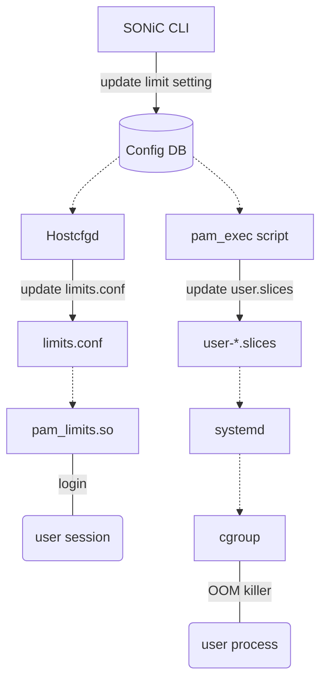
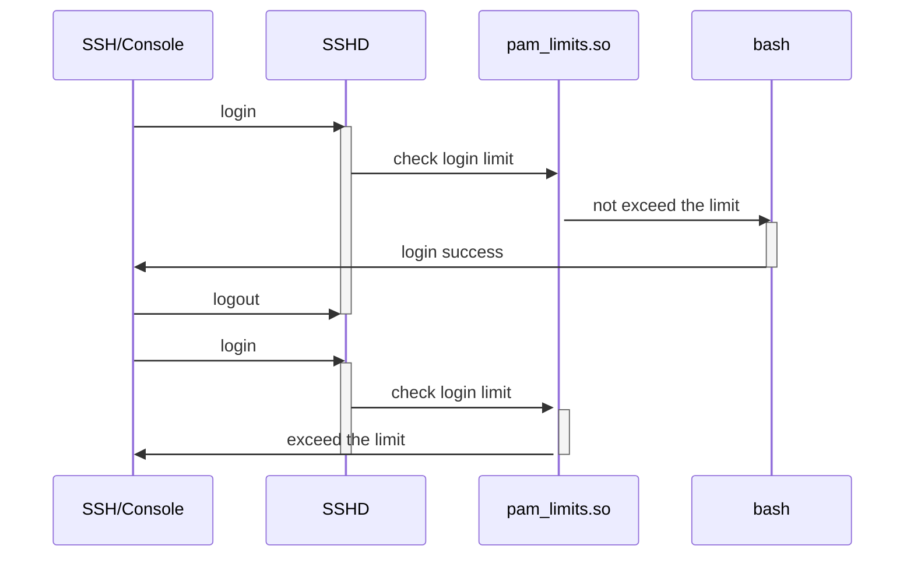
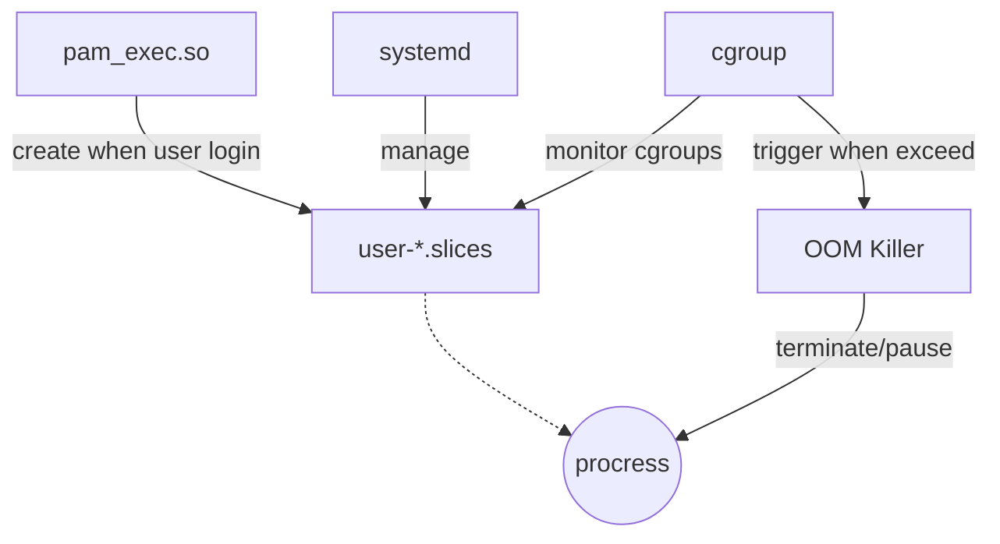

# SONiC Limit user session and memory

# Table of Contents
- [Table of Contents](#table-of-contents)
- [About this Manual](#about-this-manual)
- [1 Functional Requirements](#1-functional-requirement)
  * [1.1 Limit the number of logins per user/group/system](#11-limit-the-number-of-logins-per-user/group/system)
  * [1.2 Limit memory usage per user/group/system](#12-limit-memory-usage-per-user/group/system)
  * [1.3 Default limitation by memory size](#13-default-limitation-by-memory-size)
- [2 Configuration and Management Requirements](#2-configuration-and-management-requirements)
  * [2.1 SONiC CLI](#21-sonic-cli)
  * [2.2 Config DB](#22-config-db)
- [3 Design](#design)
  * [3.1 Login Limit Implementation](#31-login-limit-implementation)
  * [3.2 Memory Limit Implementation](#32-memory-limit-implementation)
  * [3.3 Default memory limitation Implementation](#33-default-memory-limitation-Implementation)
  * [3.4 ConfigDB Schema](#34-configdb-schema)
  * [3.5 CLI](#35-cli)
- [4 Error handling](#error-handling)
- [5 Serviceability and Debug](#serviceability-and-debug)
- [6 Unit Test](#unit-test)
- [8 References](#references)


# About this Manual
This document provides a detailed description on the new features for:
 - Limit the number of logins per user/group/system.
 - Limit memory usage per user/group membership.
 - Default limit user login session and memory by device information.

## SONiC memory issue sloved by this feature.
 - Currenly SONiC enabled OOM killer, and set 2 to /proc/sys/vm/panic_on_oom, which will trigger kernal panic when OOM. This is by design to protect SONiC key procress and container.
 - A typical switch device have 4 GB memory and sonic usually will use 1.5 GB for dockers, and 500 MB for system procress. so there will be 2 GB free memory for user. also sonic not enable swap for most device.
 - When user run some command trigger OOM, SONiC will kernal panic. for example:
   - Multiple user login to device, some service may create 10+ concurrent sesstion login to device.
   - Some user script/command take too much memory, currently 'show' command will take 60 MB memory.

# 1 Functional Requirement
## 1.1 Limit the login session per user/group/system
 - Can set max login session count per user/group/system.
 - When exceed maximum login count, login failed with error message.

## 1.2 Limit memory usage with user space OOM daemon
 - Can set max memory utilization.
 - Can set memory protect policy:
    - Can set user/group list, their process can be terminate safely.
    - Can set terminate policy, terminate user login session or only terminate the top memory consumption process to free enough memory. 
 - When exceed maximum memory utilization, terminate domain user process to free memory and protect device from OOM happen.

## 1.3 Default limitation by memory size
- Default login session by device hardware and software information.
- Default max memory utilization for OOM daemon.
- For customer, they may have pipelines to initialize device configuration, because this feature add new commands, the pipeline may need update. The default limitation is designed to cover most case to minimize the customer side change.

# 2 Configuration and Management Requirements
## 2.1 SONiC CLI
 - Manage login session or memory  limit settings
```
    config limit login { add | del } {user | group | global} <name> <number>
```
 - Show limit
```
    show limit {login | memory}
```

## 2.2 Config DB
 - Login limit and memory limit are fully configurable by config DB.

# 3 Design
 - Design diagram:



## 3.1 Login limit Implementation
 - Enable PAM plugin pam_limits.so to support login limit.
 - When login limit exceed, pam_limits.so will terminate login session with error message.


### Other solution for Linux login session limit

|                   | How                                                | Pros                                                         | Cons                       |
| ----------------- | -------------------------------------------------- | ------------------------------------------------------------ | -------------------------- |
| PAM limit         | Change PAM setting file: /etc/security/limits.conf | Support per-user/per-group/global limit. Only need change config file. |                            |
| Bash login script | Call script when user login                        |                                                              | Need develop new script.   |
| SSHD config       | Change SSHD setting file: /etc/sshd_config         |                                                              | Only support global limit. |

- SONiC will create new user when domain user login, PAM limit support config limit to a not existed user.


## 3.2 Memory limit Implementation
 - Memory limit managed by systemd user slices.
 - pam_exec.so plugin will create user slices when user login.
 - cgroup will monitor cgroups resource usage, and trigger OOM killer when exceeds limit.
 - OOM killer will terminate/pause procress.



### Other solution for Linux memory limit

|              | How                                           | Pros                                            | Cons                           | Per-user                    | Per-group member | per-group | Global |
| ------------ | --------------------------------------------- | ----------------------------------------------- | ------------------------------ | --------------------------- | ---------------- | --------- | ------ |
| rlimit       | PAM plugin                                    |                                                 | Only per-procress control.     | per-user per-group control. | NO               | NO        | NO     |
| cgroup-tools | daemon manage/migrate user process to cgroups | Cross procress control. Support user group.     | Not support domain user.       | Yes                         | NO               | Yes       |        |
| systemd      | Manage cgroups with systemd user.slices       | Cross procress control. Support slice template. | Not support per-group control. | Yes                         | Yes              | No        | Yes    |

- rlimit only support per-procress control.
- cgroup-tools not support domain user, this is because SONiC will create new user when domain user login, but cgroup-tools only support existed user.
- systemd have good support to domain user, but not support per-group limit.


## 3.3 Default memory limitation Implementation
- Max number of logins by memory size:
  - Max number of logins = memory size * factor / max memory per-user.
- Default factor by OS version, device type and vendor, which is based on history data of SONiC memory utilization:
  - Celestica:
    - M0: 0.4
    - T0 & T1: 0.6
  - Mellanox & Nexus:
    - T0 & T1: 0.6
  - Nokia:
    - M0: 0.6
  - Arista:
    - T0: 0.7
    - T1: 0.6
  - Dell & Firce10
    - T0 & T1: 0.7
  - For all other device, default factor is 0.4
- Max memory per-user is hardcode config. Default value is 200 MB, because 'show' command will take 70 MB memory, and we plan support user will run 3 commands concurrently.
  - If user want run a script/command which take more than 200MB memory and been blocked by this feature, user can modify the per-user limit with the config command.
- For customer, they may have pipelines to initialize device configuration, because this feature add new commands, the pipeline may need update. The default limitation is designed to cover most case to minimize the pipeline change.

## 3.4 ConfigDB Schema
 - Limit setting table.
```
; Key
limit_key              = 1*32VCHAR          ; setting name, format is resource type + limit scope + limit name
; Attributes
resource_type          = LIST(1*32VCHAR)   ; Limit resource type, now only support (login, memory)
scope                  = LIST(1*32VCHAR)   ; Limit scope, now only support (global, group, user)
value                  = Number  ; limit value, for login this is max login session count, for memory this is memory side in byte.
```

## 3.5 CLI
 - Add following command to set/remove limit setting.
```
    // set global login limit
    config limit login add global <max session count>

    // remove global login limit
    config limit login del global

    // add group login limit
    config limit login add group <group name> <max session count>

    // remove group login limit
    config limit login del group <group name>

    // add user login limit
    config limit login add user <user name> <max session count>

    // remove user login limit
    config limit login del user <user name>

    // add group membership memory limit
    config limit memory add group <group name> <memory side in byte>

    // remove group membership memory limit
    config limit memory del group <group name>

    // add user memory limit
    config limit memory add user <user name> <memory side in byte>

    // remove user memory limit
    config limit memory del user <user name>
    
    // set the 'memory factor' parameter for calculate default max login count
    config limit login parameter memoryfactor <number>

    // set the 'user memory' parameter for calculate default max login count
    config limit login parameter usermemory <number>
```

 - Add following command to show limit setting.
```
    // show login limit setting
    show limit login

    // show memory limit setting
    show limit memory
```

# 4 Error handling
 - pam_limits.so will return errors as per [PAM](#pam) respectively.

# 5 Serviceability and Debug
 - pam_limits.so can be debugged by enabling the debug flag in PAM config file.
 - cgroup cgrulesengd can be debugged by enabling the CGROUP_LOGLEVEL environment variable.

# 6 Unit Test

## 6.1 Default login session limit test

  - config memory factor and check the default login session limit config updated correctly:
  ```
      Verify the config in /set/security/limits.conf updated correctly.
      Verify the device can login with mutiple login sessions coording to the default limit. 
  ```

  - config memory factor to 0 and check the config command result:
  ```
      Verify the config config command failed with warning message.
      Verify the device can login with mutiple login sessions coording to the default limit. 
  ```

  - config max memory per-user setting and check the default login session limit config updated correctly:
  ```
      Verify the config in /set/security/limits.conf updated correctly.
      Verify the device can login with mutiple login sessions coording to the default limit. 
  ```

  - config max memory per-user to INT MAX and check the config command result:
  ```
      Verify the config config command failed with warning message.
      Verify the device can login with mutiple login sessions coording to the default limit. 
  ```

## 6.2 Login session limit test

  - Change the per-user/per-group/global login session limit setting:
  ```
      Verify the config in /set/security/limits.conf updated correctly.
      Verify the device can login with mutiple login sessions coording to the default limit. 
      Verify the setting can be delete by config command.
  ```

## 6.3 Memory limit test

  - Change the per-user/per-group/global memory limit setting:
  ```
      Verify the user.slices template updated correctly.
      Verify user command success when command memory consumption is smaller than the limit.
      Verify user command failed when memory consumption is bigger than the limit.
      Verify the setting can be delete by config command.
  ```

# 7 References
## pam_limits.so
https://man7.org/linux/man-pages/man8/pam_limits.8.html
## pam_exec.so
https://linux.die.net/man/8/pam_exec
## cgroup
https://man7.org/linux/man-pages/man7/cgroups.7.html
## user.slice
https://man7.org/linux/man-pages/man5/systemd.slice.5.html

