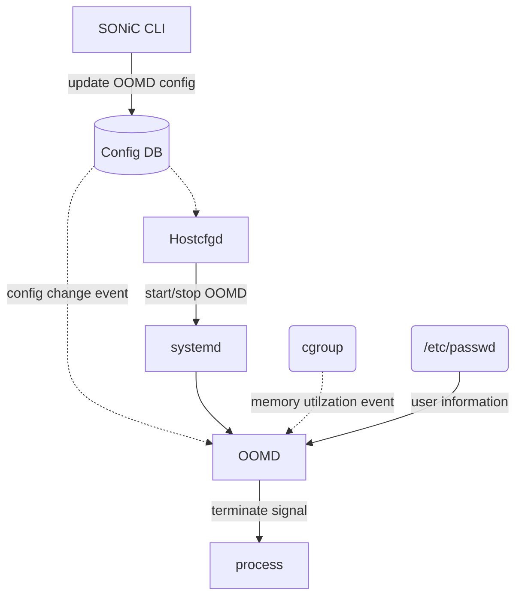
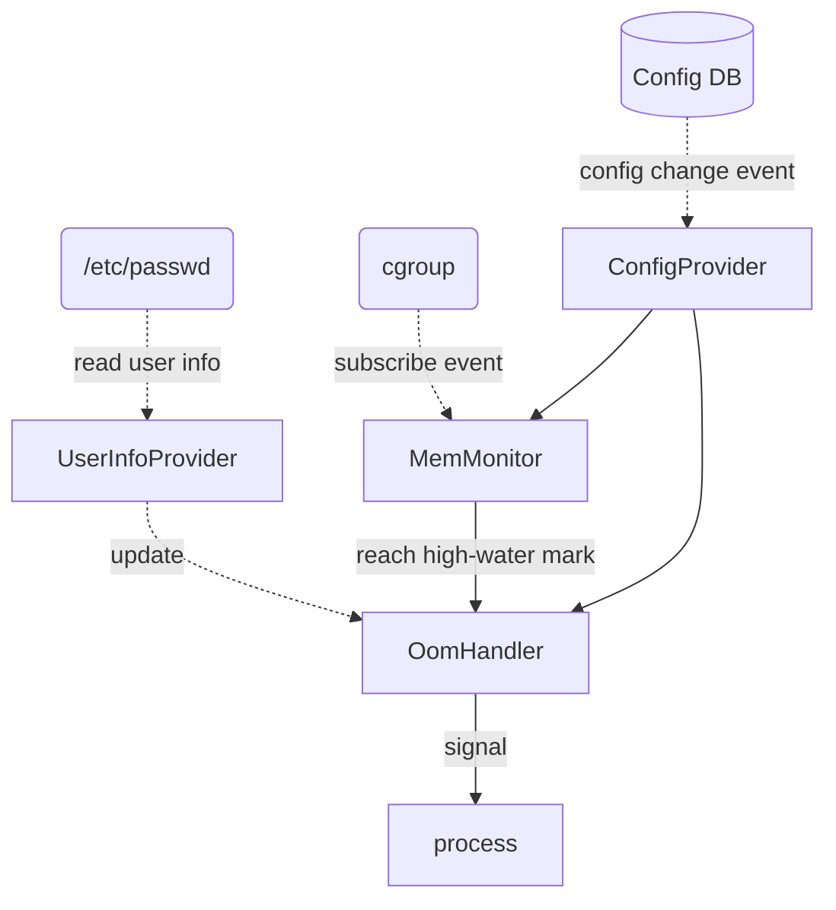

# SONiC OOM daemon

# Table of Contents
- [Table of Contents](#table-of-contents)
- [About this Manual](#about-this-manual)
- [1 Functional Requirements](#1-functional-requirement)
  * [1.1 Limit the number of logins per user/group/system](#11-limit-the-number-of-logins-per-user/group/system)
  * [1.2 Limit memory usage per user/group/system](#12-limit-memory-usage-per-user/group/system)
  * [1.3 Default limitation by memory size](#13-default-limitation-by-memory-size)
- [2 Configuration and Management Requirements](#2-configuration-and-management-requirements)
  * [2.1 SONiC CLI](#21-sonic-cli)
  * [2.2 Config DB](#22-config-db)
- [3 Design](#design)
  * [3.1 Login Limit Implementation](#31-login-limit-implementation)
  * [3.2 Memory Limit Implementation](#32-memory-limit-implementation)
  * [3.3 Default memory limitation Implementation](#33-default-memory-limitation-Implementation)
  * [3.4 ConfigDB Schema](#34-configdb-schema)
  * [3.5 CLI](#35-cli)
- [4 Error handling](#error-handling)
- [5 Serviceability and Debug](#serviceability-and-debug)
- [6 Unit Test](#unit-test)
- [8 References](#references)


# About this Manual
This document provides a detailed description on the new features for:
 - Protect SONiC system memory by OOM daemon.
 - OOM daemon config command.
 - OOM daemon high level design.
 - OOM daemon ConfigDB schema

## SONiC memory issue sloved by this feature.
 - Currently SONiC enabled OOM killer, and set /proc/sys/vm/panic_on_oom to 2, which will trigger kernal panic when OOM. This is by design to protect SONiC key process and container.
 - A typical switch device have 4 GB memory and sonic usually will use 1.5 GB for dockers, and 500 MB for system process. so there will be 2 GB free memory for user. 
 - sonic not enable swap for most device.
 - When user run some command trigger OOM, SONiC will kernel panic. for example:
   - Multiple user login to device, some service may create 10+ concurrent sessions login to device.
   - Some user script/command take too much memory, currently 'show' command will take 70 MB memory.
 - To fix this issue, we need 2 feature: login session limit and OOM daemon.

# 1 Functional Requirement
 - When exceed memory high-water mark, terminate user process to free memory and protect device from OOM happen.

 - Can set system memory high-water mark and low-water mark.
 - Can set memory protect policy:
    - User/group list, their process can be terminate safely.
    - Terminate policy: terminate user session or terminate user process.

- All process start by local user will not be terminate by OOMD, unless they add to user/group list.
- Provide default setting to minimize customer side change.
  - Customers may have pipelines to initialize device configuration, because this feature add new commands, the pipeline may need update. The default limitation is designed to cover most scenario to minimize the customer side change.

# 2 Configuration and Management Requirements
## 2.1 SONiC CLI
 - Manage login session or memory  limit settings
```
    # config OOMD enable/disable status
    config oomd { enable/disable}
    
    # config oomd policy
    config oomd policy { policyname } { add|del } <value>
```
 - Show oomd config
```
    show oomd policy
    show oomd status
```

## 2.2 Config DB
 - Login limit and memory limit are fully configurable by config DB.

# 3 Design
 - Design diagram:



## 3.1 OOMD Implementation
 - OOMD will be a service managed by systemd.
 - Get system memory information from /proc/meminfo.
 - Subscript cgroup memory utilization event from /sys/fs/cgroup/memory/memory.usage_in_bytes.
 - Get user information from /etc/passwd.
 - OOMD will send SIGKILL/SIGTERM to kill/terminate process.
 - OOMD can config to terminate user session, this is because when swap not enabled, Linux system may enters a livelocked state much more quickly and may prevent oomd from responding in a reasonable amount of time. 
 - The following diagram show how OOMD work:
    - UserInfoProvider will get user information from /etc/passwd
    - ConfigProvider will subscript config DB change event and update OOMD config.
    - MemMonitor will monitor cgroup event and trigger OomHandler.
    - When memory utilization reach high-water mark, OomHandler will terminate user process to prevent OOM happen. 


### Other solution for user space OOMD

|                      | Cons                                                         | URL                                                          |
| -------------------- | ------------------------------------------------------------ | ------------------------------------------------------------ |
| earlyoom             | Designed to free swap, SONiC not have swap.                  | [rfjakob/earlyoom: earlyoom - Early OOM Daemon for Linux (github.com)](https://github.com/rfjakob/earlyoom) |
| oomd                 | Developed by Facebook, Highly customizable by support plugin. Too heavy for SONiC. | [facebookincubator/oomd: A userspace out-of-memory killer (github.com)](https://github.com/facebookincubator/oomd) |
| systemd-oomd.service | Require cgroupv2, not scalable, can't customize to only termi. | [systemd-oomd.service(8) - Linux manual page (man7.org)](https://man7.org/linux/man-pages/man8/systemd-oomd.service.8.html) |


## 3.3 Default OOMD config
- OOMD will be enabled by default.
- Default high-water mark: 90
- Default low-water mark: 60
- Default user/group list is empty.
- Terminate domain user process by default.

## 3.4 ConfigDB Schema
 - OOMD enable/disable table.
```
; Key
oomd_key               = 1*32VCHAR           ; setting name, value is "oomd_enable"
; Attributes
enable                 = Boolean             ; Enable status, true for enable.
```
 - OOMD setting table.
```
; Key
setting_key              = 1*32VCHAR          ; setting key, format is "oomd_" + setting name + setting value
; Attributes
setting                  = LIST(1*32VCHAR)    ; setting name, now only support (highwatermark, lowwatermark, user, group, domainaccount, terminatescope)
value                    = LIST(1*128VCHAR)   ; setting value.
```
 - Yang model:
```
module sonic-system-oomd {
	namespace "http://github.com/Azure/sonic-oomd";
	prefix soomd;
	yang-version 1.1;

    revision 2022-01-18 {
        description "Initial revision.";
    }
    
    container sonic-system-oomd {
        container oomd {
            list oomd_enable_list {
                key "oomd_enable";

                leaf enable {
                    type boolean;
                    description "Enable status";
                    default true;
                }
            }
            
            list oomd_setting_list {
                key "setting_key";

                leaf setting {
                    type enumeration {
                        enum highwatermark;
                        enum lowwatermark;
                        enum user;
                        enum group;
                        enum domainaccount;
                        enum terminatescope;
                    }
                    description "Setting type.";
                }

                leaf value {
                    type string;
                    description "Setting value.";
                }
            }
        }
    }
}
```

## 3.5 CLI
 - Add following command to change OOMD setting.
```
    // config OOMD enable/disable status
    config oomd { enable/disable}
    
    // config OOMD high-water mark and low-water mark, number are memory utilzation percentage.
    config oomd policy { highwatermark|lowwatermark } <number>
    
    // config which user/group can be terminate
    config oomd policy { users|groups } { add|del } <name>
    
    // config if OOMD can terminate domain account process/session
    config oomd policy domainaccount { enable|disable }
    
    // config OOMD terminate user session or process
    config oomd policy terminatescope { session|process }
    
    // config OOMD log level
    config oomd policy loglevel { debug|standard }

```

 - Add following command to show OOMD setting.
```
    // show oomd setting
    show oomd policy

    // show oomd enable/disable status
    show oomd status
```

# 4 Error handling
 - OOMD will write errors to syslog.

# 5 Serviceability and Debug
 - OOMD  can be debugged by enabling the debug flag OOMD config.

# 6 Unit Test

## 6.1 Enable/disable OOMD test

  - Enable/disable OOMD and check the OOMD service status:
  ```
      Verify the OOMD service started when OOMD enabled.
      Verify the OOMD service stopped when OOMD disabled.
  ```

## 6.2 OOMD policy test

  - Change OOMD high-water/low-water mark and check the OOMD will be triggered correctly:
  ```
      Verify when system memory utilzation reach high-water mark OOMD triggered.
      Verify when OOMD triggered, procress been terminated to free enough memory to low-water mark.
      Verify when OOMD triggered, the system procress are healthy.
  ```

  - Change OOMD user/group config and check the OOMD terminate process correctly:

  ```
    Verify when OOMD triggered, the procresses run by target user been terminated correctly.
    Verify when OOMD triggered, the procresses not run by target user are healthy.
  ```

  - Change OOMD terminate domain account config and check the OOMD terminate process correctly:

  ```
    Verify when OOMD triggered, the procresses run by domain account been terminated correctly.
  ```

  - Change OOMD terminate process/session config and check the OOMD terminate process/session correctly:

  ```
    Verify when OOMD triggered, and config is terminate process, the user process been terminated correctly.
    Verify when OOMD triggered, and config is terminate session, the user session been terminated correctly.
  ```

  - Change OOMD log level config and check the OOMD write system log correctly:

  ```
    Verify when log level set to debug, syslog contains OOMD debug information.
    Verify when log level set to standard, syslog not contains OOMD debug information.
  ```


# 7 References
## Linux OOM
https://www.kernel.org/doc/gorman/html/understand/understand016.html

## cgroup
https://man7.org/linux/man-pages/man7/cgroups.7.html

