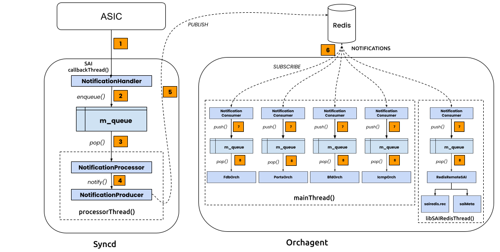

# Opt-in LRU-Dedup Queue Policy for swss::NotificationConsumer

## Table of Content
- [1. Revision](#1-revision)
- [2. Scope](#2-scope)
- [3. Definitions/Abbreviations](#3-definitionsabbreviations)
- [4. Overview](#4-overview)
- [5. Requirements](#5-requirements)
- [6. Architecture Design](#6-architecture-design)
  - [6.1. Existing design](#61-existing-design)
  - [6.2. Issues with the existing design](#62-issues-with-the-existing-design)
  - [6.3. New design overview](#63-new-design-overview)
  - [6.4. LRU Dedup Example](#64-lru-dedup-example)
    - [Scenario](#scenario)
    - [Notificaition message — exactly what dedup hashes](#notificaition-message--exactly-what-dedup-hashes)
    - [Queue state — first 6 publishes, FIFO vs LRU](#queue-state--first-6-publishes-fifo-vs-lru)
    - [End-state equivalence — drain at t=7](#end-state-equivalence--drain-at-t7)
  - [6.5. New design - Op-Allowlist Filter](#65-new-design---op-allowlist-filter)
- [7. High-Level Design](#7-high-level-design)
  - [7.1. NotificationQueueBase strategy interface](#71-notificationqueuebase-strategy-interface)
  - [7.2. FifoNotificationQueue](#72-fifonotificationqueue)
  - [7.3. LruDedupNotificationQueue](#73-lrudedupnotificationqueue)
  - [7.4. NotificationConsumer API](#74-notificationconsumer-api)
  - [7.5. Telemetry](#75-telemetry)
    - [Syslog — periodic stats (every 5 s per active consumer)](#syslog--periodic-stats-every-5-s-per-active-consumer)
    - [COUNTERS_DB — `NOTIFICATION_CONSUMER_STATS:<name>`](#counters_db--notification_consumer_statsname)
  - [7.6. Modules and repositories affected](#76-modules-and-repositories-affected)
  - [7.7 Future Enhancements](#77-future-enhancements)
- [8. SAI API](#8-sai-api)
- [9. Configuration and management](#9-configuration-and-management)
  - [9.1. CLI/YANG model Enhancements](#91-cliyangmodel-enhancements)
  - [9.2. Config DB Enhancements](#92-config-db-enhancements)
- [10. Warmboot and Fastboot Design Impact](#10-warmboot-and-fastboot-design-impact)
- [11. Memory Consumption](#11-memory-consumption)
- [12. Restrictions/Limitations](#12-restrictionslimitations)
- [13. Testing Requirements/Design](#13-testing-requirementsdesign)
  - [13.1. Unit Test cases](#131-unit-test-cases)
  - [13.2. System Test cases](#132-system-test-cases)
- [14. Open/Action items](#14-openaction-items)

## 1. Revision

| Rev | Date | Author | Change Description |
|-----|------|--------|--------------------|
| 0.1 | 2026-05-14 | Senthil Krishnamurthy | Initial version |

## 2. Scope

This document describes an opt-in queue policy mechanism for
`swss::NotificationConsumer` in `sonic-swss-common`, and the initial
opt-in by `FdbOrch` and `PortsOrch` in `sonic-swss`. The change is
internal to swss-common's NotificationConsumer and adds no new CLI,
YANG, or Config DB surfaces.

## 3. Definitions/Abbreviations

| Term | Definition |
|------|------------|
| FDB  | Forwarding Database (MAC address table) |
| LRU  | Least Recently Used |
| MAC move | A MAC address learned on a new port after being learned on a different port |
| `NotificationConsumer` | swss-common class that subscribes to a redis pub/sub channel and buffers received messages in an in-process queue |
| `FdbOrch` | The orch in orchagent that consumes FDB notifications from syncd |
| `PortsOrch` | The orch in orchagent that consumes port-state and port-host-tx-ready notifications from syncd |

## 4. Overview

`swss::NotificationConsumer` buffers incoming pub/sub messages in an
unbounded `std::queue<std::string>` until the owning orch drains them
on its main-loop iteration. When the producer rate (syncd publishing
into the channel) exceeds the consumer drain rate, the queue grows
without bound, eventually OOM-killing orchagent.

This is hit most visibly during sustained FDB-flap or link-flap storms
on the `NOTIFICATIONS` and `PORT_STATE_NOTIFICATIONS` channels. The
common observation is orchagent RSS climbing into multiple-GB range
under a continuous storm and the kernel OOM-killing the process.

This HLD introduces an opt-in **LRU-dedup** queue policy for
`NotificationConsumer`. Channels carrying end-state-idempotent events
can opt in; their queue depth becomes bounded by the universe of
distinct payloads rather than by event rate. Channels that haven't
opted in keep strict FIFO semantics with no behavior change.

## 5. Requirements

- Provide a queue policy that bounds memory usage of
  `NotificationConsumer` under a sustained producer/consumer rate
  imbalance.
- The new policy must be **opt-in per consumer**. Existing call sites
  must compile and run unchanged.
- Preserve `libswsscommon` ABI: existing consumers (including
  `python3-swsscommon`'s `_swsscommon.so` and other linked components)
  must not need rebuilding.
- Opt the following storming-prone consumers into the new policy:
  - `FdbOrch::m_fdbNotificationConsumer` on `NOTIFICATIONS`.
  - `PortsOrch::m_portStatusNotificationConsumer` on
    `NOTIFICATIONS`.
  - `PortsOrch::m_portHostTxReadyNotificationConsumer` on
    `NOTIFICATIONS`.
  - `RedisChannel::m_notificationConsumer` on `NOTIFICATIONS`.

## 6. Architecture Design

### 6.1. Existing design



1. SAI Notifications for mac_move / link_flap / macsec etc
2. enqueue() to NotificationQueue(). m_queue is bounded:
   1. limit = 300,000
   2. on reaching limit AND 1000 consecutive messages with same key, start dropping
   3. NO drop message propagation - syslog or counters
3. pop in FIFO order, RID-to-VID translate, ASIC_DB update
4. sendNotification() triggers a Redis PUBLISH to NOTIFICATIONS channel
5. redis pubsub, unbounded: client-output-buffer-limit pubsub 0 0 0
6. SUBSCRIBE to NOTIFICATIONS channel, unbounded
7. multiple consumers, push to m_queue in parellel, unbounded
8. pop in FIFO order, doTask() process, update STATE_DB

`NotificationConsumer` holds the internal queue as a value member:

```cpp
class NotificationConsumer : public Selectable {
    ...
    std::queue<std::string> m_queue;
};
```

`readData()` calls `m_queue.push(msg)` for each pub/sub message
received from the subscribed channel. `pop()` and `pops()` drain in
strict FIFO order.

### 6.2. Issues with the existing design

1. **Unbounded growth under producer/consumer rate imbalance.** Every
   message arriving at the consumer is queued unconditionally. There
   is no upper bound on `m_queue`'s size and no backpressure to the
   producer.

```
Total: 2102.1 MB
  2100.7  99.9%  99.9%   2100.7  99.9% malloc_usable_size
     0.0   0.0%  99.9%   2099.9  99.9% __libc_start_main@GLIBC_2.2.5
     0.0   0.0%  99.9%   2099.9  99.9% std::__throw_regex_error
     0.0   0.0%  99.9%   2098.7  99.8% __libc_init_first@@GLIBC_2.2.5
     0.0   0.0%  99.9%   2078.5  98.9% std::__detail::_Compiler::_M_assertion
     0.0   0.0%  99.9%   2057.4  97.9% swss::NotificationConsumer::processReply
     0.0   0.0%  99.9%   2057.4  97.9% swss::NotificationConsumer::readData
     0.0   0.0%  99.9%   2057.4  97.9% swss::Select::poll_descriptors
     0.0   0.0%  99.9%   2057.4  97.9% swss::Select::select
     0.0   0.0%  99.9%   1860.1  88.5% swss::NotificationConsumer::getFd
     0.0   0.0%  99.9%    310.6  14.8% std::deque::_M_push_back_aux
     0.0   0.0%  99.9%     32.1   1.5% swss::ZmqServer::bind
```

2. **Workload-shape sensitivity.** For end-state-idempotent channels
   (FDB events, port-state events), the *meaningful* state is the
   latest payload per logical key (e.g. `(vlan, mac)` or `port_id`).
   A storm typically cycles through a small set of distinct payloads
   many times; each repeat is kept in the queue and re-processed.

3. **No mechanism to express per-channel policy.** All consumers
   share the same FIFO semantics, even though correctness requirements
   differ across channels.

4. **No telemetry/visibility on notifications storm.** Syncd has protection
   for tail dropping notifications, and raises syslog, but these are rate-limited.

```
m_queueSizeLimit  = 300,000
m_thresholdLimit  = 1,000
m_dropCount       = 5,708,756   (sample 1) -> 5,708,824   (sample 2)
m_lastEventCount  = 6,786,589   (sample 1) -> 6,786,885   (sample 2)
m_lastEvent       = "fdb_event"

2026 May 14 05:36:34.996024 gold210 INFO syncd#rsyslogd: imuxsock[pid: 51, name: /usr/bin/syncd] from <gold210:syncd>: begin to drop messages due to rate-limiting
2026 May 14 05:37:26.307660 gold210 INFO swss#rsyslogd: imuxsock[pid: 57, name: /usr/bin/orchagent] from <sonic:orchagent>: begin to drop messages due to rate-limiting
2026 May 14 05:41:28.000183 gold210 INFO syncd#rsyslogd: imuxsock[pid: 51, name: /usr/bin/syncd]: 48814808 messages lost due to rate-limiting (20000 allowed within 300 seconds)
2026 May 14 05:41:28.000249 gold210 INFO swss#rsyslogd: imuxsock[pid: 57, name: /usr/bin/orchagent]: 1024472 messages lost due to rate-limiting (20000 allowed within 300 seconds)
```

### 6.3. New design overview

Replace the concrete `std::queue<std::string>` member with a pointer
to an abstract `NotificationQueueBase` strategy. Provide two concrete
strategies:

- `FifoNotificationQueue` — preserves existing behavior, default.
- `LruDedupNotificationQueue` — opt-in; collapses duplicate payloads
  on enqueue.

Add a new constructor overload that takes an `NotificationQueuePolicy` enum.
Existing 4-argument constructors keep their original mangled symbol
and select `Fifo` automatically.

```
+----------------------------------+
| NotificationConsumer             |
|   m_queue: unique_ptr<NQBase>    |
+----------------------------------+
                |
                v   (strategy selected at construction)
    +-----------+-----------+
    |                       |
+---v-------------+   +-----v---------------------+
| Fifo            |   | LruDedup                  |
|   std::queue    |   |   std::list +             |
|                 |   |   unordered_map<str,iter> |
+-----------------+   +---------------------------+
```

Existing call sites: unchanged. Opt-in is one extra constructor argument:
```
// FdbOrch
m_fdbNotificationConsumer = new NotificationConsumer(
    db, "NOTIFICATIONS", 100, DEFAULT_NC_POP_BATCH_SIZE,
    NotificationQueuePolicy::LruDedup);

// PortsOrch port-state consumer
m_portStatusNotificationConsumer = new NotificationConsumer(
    db, "PORT_STATE_NOTIFICATIONS", 100, DEFAULT_NC_POP_BATCH_SIZE,
    NotificationQueuePolicy::LruDedup);

// libsairedis RedisChannel consume
m_notificationConsumer  = std::make_shared<swss::NotificationConsumer>(
    m_dbNtf.get(), REDIS_TABLE_NOTIFICATIONS_PER_DB(dbAsic), 100, swss::DEFAULT_NC_POP_BATCH_SIZE,
    swss::NotificationQueuePolicy::LruDedup);

```

Each opt-in is one line right after the consumer is constructed. The allowlist is mechanically derived from that orch's `doTask(NotificationConsumer&)`:
```
// fdborch.cpp
m_fdbNotificationConsumer->setOpAllowList({"fdb_event"});
m_flushNotificationsConsumer->setOpAllowList(
    {"ALL", "PORT", "VLAN", "PORTVLAN"});

// portsorch.cpp
m_portStatusNotificationConsumer->setOpAllowList({"port_state_change"});
m_portHostTxReadyNotificationConsumer->setOpAllowList({"port_host_tx_ready"});

// bfdorch.cpp
m_bfdStateNotificationConsumer->setOpAllowList({"bfd_session_state_change"});

// icmporch.cpp
m_icmpStateNotificationConsumer->setOpAllowList({"icmp_echo_session_state_change"});

// twamporch.cpp
m_twampNotificationConsumer->setOpAllowList({"twamp_session_event"});

// p4orch/p4orch.cpp
m_portStatusNotificationConsumer->setOpAllowList({"port_state_change"});
```

### 6.4. LRU Dedup Example

This section spells out exactly what the dedup operates on and why the end state in STATE_DB matches the un-deduplicated case.

#### Scenario

A single MAC `08:00:27:11:22:33` in VLAN 100 (`bv_id=oid:0x26000000000064`)
flapping between two ports on a switch
(`switch_id=oid:0x21000000000000`):

- Port A = `Ethernet0`, `bridge_port_id=oid:0x3a000000000001`
- Port B = `Ethernet4`, `bridge_port_id=oid:0x3a000000000002`

ASIC sends `fdb_event` notifications at line rate, alternating LEARNED
and AGED between A and B.

#### Notificaition message — exactly what dedup hashes

`NotificationProducer::send(op, data, values)` produces a flat JSON
array of strings. An example message sent to the channel:

**LEARNED on port A**
```
["fdb_event","[{\"fdb_entry\":{\"switch_id\":\"oid:0x21000000000000\",\"bv_id\":\"oid:0x26000000000064\",\"mac\":\"08:00:27:11:22:33\"},\"fdb_event\":\"SAI_FDB_EVENT_LEARNED\",\"list\":[{\"id\":\"SAI_FDB_ENTRY_ATTR_BRIDGE_PORT_ID\",\"value\":{\"oid\":\"oid:0x3a000000000001\"}},{\"id\":\"SAI_FDB_ENTRY_ATTR_TYPE\",\"value\":\"SAI_FDB_ENTRY_TYPE_DYNAMIC\"}]}]"]
```

#### Queue state — first 7 publishes, FIFO vs LRU

- **Msg A — LEARNED on port A**
- **Msg B — AGED on port A**
- **Msg C — LEARNED on port B**
- **Msg D — AGED on port B**

Suppose the main thread is busy and doesn't `pop` for the first 7
publishes. Arrival order: A, B, C, D, A, B, C

| t  | publish | FIFO queue (front → back) | LRU queue (front → back) |
|----|---------|----------------------------|----------------------------|
| 1  | A | `[A]`                                  | `[A]`              |
| 2  | B | `[A,B]`                                | `[A,B]`            |
| 3  | C | `[A,B,C]`                              | `[A,B,C]`          |
| 4  | D | `[A,B,C,D]`                            | `[A,B,C,D]`        |
| 5  | A | `[A,B,C,D,A]`                          | A in idx → erase, append → **`[B,C,D,A]`** |
| 6  | B | `[A,B,C,D,A,B]`                        | B in idx → erase, append → **`[C,D,A,B]`** |
| 7  | C | `[A,B,C,D,A,B,C]`                      | C in idx → erase, append → **`[D,A,B,C]`** |

FIFO grows linearly with arrival rate. LRU caps at 4 entries (the
distinct-payload count). The LRU ordering is **least-recently-seen
first** — that's the invariant on which drain correctness depends.

#### End-state equivalence — drain at t=7

FIFO drain order = `[A, B, C, D, A, B, C]` (7 ops)

LRU drain order = `[D, A, B, C]`: (4 ops)

Drain:

| pop | msg | effect |
|-----|-----|--------|
| 1 | D | AGED on port B → row didn't exist yet → skip |
| 2 | A | LEARNED port A → insert |
| 3 | B | AGED on port A → remove |
| 4 | C | LEARNED port B → insert |
| **end** | | **FDB entry: MAC on port B** ✓ matches ASIC |

### 6.5. New design - Op-Allowlist Filter

Redis pub/sub delivers a full copy of every PUBLISH to every SUBSCRIBE. A 
single fdb_event from syncd therefore enters the queue of every one of these 
consumers. Each consumer's doTask only acts on the match and silently 
discards the rest — but the discard happens after the message has been 
popped off the queue, not before it was pushed in.

```
syncd PUBLISH ["fdb_event", ...] on "NOTIFICATIONS"
                  |
                  | Redis fanout
                  v
       +----------------------------+
       | BfdOrch::                  |
       |   m_bfdStateNotification-  |
       |   Consumer (FIFO)          |
       |                            |
       |   processReply(msg)        |   <-- peekOp(msg) == "bfd_..."; else DROP
       |                            |              
       |                            | 
       |   m_queue.push(msg)        |
       +----------------------------+
                  |
                  | (main thread, eventually)
                  | doTask(consumer)
                  v
       +----------------------------+
       |   consumer.pop(op,data,..) |   <-- parses JSON
       |                            |                          
       +----------------------------+
```
## 7. High-Level Design

### 7.1. NotificationQueueBase strategy interface

```cpp
class NotificationQueueBase {
public:
    virtual ~NotificationQueueBase() = default;
    virtual void               push(const std::string& msg) = 0;
    virtual const std::string& front() const                = 0;
    virtual void               pop()                        = 0;
    virtual bool               empty() const                = 0;
    virtual size_t             size()  const                = 0;
};
```

Single-threaded; no locking. The owning `NotificationConsumer` already
guarantees single-threaded access via its main-loop usage pattern.

### 7.2. FifoNotificationQueue

A thin wrapper that delegates every method to `std::queue<std::string>`.
Functionally identical to the pre-change member. This is the default
strategy and the one selected by every existing call site that doesn't
pass an `NotificationQueuePolicy`.

### 7.3. LruDedupNotificationQueue

Backed by a `std::list<std::string>` and an
`std::unordered_map<std::string, list_iterator>`:

- **push(msg)**: if `msg` is already present in the index, erase its
  current position from the list. Append `msg` at the tail and update
  the index.
- **pop()**: remove the head of the list and erase the corresponding
  index entry.

Result:
- The list never contains duplicate payloads.
- Drain order is "least-recently-pushed unique payload first."
- Memory is bounded by `count(distinct payloads ever in flight)`.

Both `push` and `pop` are O(1) amortized.

### 7.4. NotificationConsumer API

Add a new constructor overload (the original 4-arg form is preserved
verbatim — see [7.6](#76-abi-compatibility)):

```cpp
enum class NotificationQueuePolicy {
    Fifo,       // default
    LruDedup    // opt-in
};

class NotificationConsumer : public Selectable {
public:
    // Original 4-arg form, defaulted args, ABI-preserving.
    NotificationConsumer(DBConnector *db,
                         const std::string &channel,
                         int pri = 100,
                         size_t popBatchSize = DEFAULT_NC_POP_BATCH_SIZE);

    // New 5-arg form with explicit policy.
    NotificationConsumer(DBConnector *db,
                         const std::string &channel,
                         int pri,
                         size_t popBatchSize,
                         NotificationQueuePolicy policy);
    ...
};
```

The public `pop()`, `pops()`, `peek()`, `hasData()`, `hasCachedData()`,
`getFd()`, `readData()` API is unchanged.

### 7.5. Telemetry

Storm: 1000 MACs flapping between two ports, sustained at
~50 K `fdb_event`/sec from syncd.

#### Syslog — periodic stats (every 5 s per active consumer)

```
NOTICE swss#orchagent: LruDedupNotificationQueue[FdbOrch:fdb_event]:
   stats pushed=15176725 dedup_hits=14049124 dedup_ratio=92.57%
   depth=3999 hwm=4000 (dedup=on)

NOTICE swss#orchagent: LruDedupNotificationQueue[libsairedis:RedisChannel:NOTIFICATIONS]:
   stats pushed=15176717 dedup_hits=4959602 dedup_ratio=32.68%
   depth=1 hwm=4000 (dedup=on)

NOTICE swss#orchagent: NotificationConsumer[FdbOrch:fdb_event]:
   stats received=15176727 dropped_allowlist=2 admit_ratio=100.00% allowlist_entries=1

NOTICE swss#orchagent: NotificationConsumer[libsairedis:RedisChannel:NOTIFICATIONS]:
   stats received=15176717 dropped_allowlist=0 admit_ratio=100.00% allowlist_entries=0

NOTICE swss#orchagent: NotificationConsumer[P4Orch:port_state_change]:
   stats received=15176727 dropped_allowlist=15176725 admit_ratio=0.00% allowlist_entries=1

NOTICE swss#orchagent: NotificationConsumer[BfdOrch:bfd_session_state_change]:
   stats received=15176727 dropped_allowlist=15176727 admit_ratio=0.00% allowlist_entries=1

NOTICE swss#orchagent: NotificationConsumer[PortsOrch:port_state_change]:
   stats received=15176727 dropped_allowlist=15176725 admit_ratio=0.00% allowlist_entries=1
```

#### COUNTERS_DB — `NOTIFICATION_CONSUMER_STATS:<name>`

Snapshot via `redis-cli -n 2 hgetall NOTIFICATION_CONSUMER_STATS:<k>`:

| Consumer | policy | allowlist | received | dropped@adm | admitted | admit % | lru_pushed | lru_dedup_hits | lru_dedup % | depth | HWM |
|---|---|---|---:|---:|---:|---:|---:|---:|---:|---:|---:|
| `FdbOrch:fdb_event` | LruDedup | `{fdb_event}` | 9,386,892 | 2 | 9,386,890 | 99.999979 | 9,386,890 | 8,719,102 | **92.89 %** | **4000** | **4000** |
| `PortsOrch:port_state_change` | LruDedup | `{port_state_change}` | 9,386,893 | 9,386,891 | 2 | 0.000021 | 2 | 0 | 0 | 0 | 1 |
| `P4Orch:port_state_change` | Fifo | `{port_state_change}` | 9,386,891 | 9,386,889 | 2 | 0.000021 | — | — | — | — | — |
| `BfdOrch:bfd_session_state_change` | Fifo | `{bfd_session_state_change}` | 9,386,892 | 9,386,892 | 0 | 0 | — | — | — | — | — |
| `FdbOrch:flush` | Fifo | `{ALL,PORT,VLAN,PORTVLAN}` | 2 | 0 | 2 | 100 | — | — | — | — | — |
| `libsairedis:RedisChannel:NOTIFICATIONS` *(syslog-only)* | LruDedup | *(none)* | 15,176,717 | 0 | 15,176,717 | 100 | 15,176,717 | 4,959,602 | 32.68 % | 1 | 4000 |


### 7.6. Modules and repositories affected

| Repo | File | Change |
|------|------|--------|
| `sonic-swss-common` | `common/notificationconsumer.{h,cpp}` | Add `NotificationQueueBase`, `FifoNotificationQueue`, `LruDedupNotificationQueue`, `NotificationQueuePolicy`, new constructor overload |
| `sonic-swss-common` | `tests/notification_queue_ut.cpp` | New unit tests for both queue strategies |
| `sonic-swss` | `orchagent/fdborch.cpp` | Opt `m_fdbNotificationConsumer` into `LruDedup` |
| `sonic-swss` | `orchagent/portsorch.cpp` | Opt `m_portStatusNotificationConsumer` and `m_portHostTxReadyNotificationConsumer` into `LruDedup` |

### 7.7 Future Enhancements

The following are **explicitly out of scope** for this HLD; they will
be addressed in a follow-on (Phase 2) HLD covering the producer side
of the same notification pipeline:

- **Producer-side queue policy in `sonic-sairedis/syncd`.**
  `syncd::NotificationQueue` (`sonic-sairedis/syncd/NotificationQueue.h`)
  today uses a destructive FIFO + drop-on-full policy. When syncd's
  internal queue fills up (default 300,000 entries), all subsequent
  FDB events are unconditionally discarded at enqueue, biasing
  toward stale state.

- **SAI/ASIC-level rate limiting or station-move suppression.**
  Some SAI implementations expose per-MAC station-move detection or
  FDB-learn-rate caps that bound the producer rate at hardware. Phase 2
  may recommend enabling these where available; this HLD does not
  require them.

- **Redis pubsub backpressure / `client-output-buffer-limit`.**
  In observed SONiC configurations the redis pubsub output buffer
  is unbounded (`pubsub 0 0 0`), which is a separate system-wide
  reliability concern. Tightening it requires coordinated changes to
  consumer reconnect-and-resync logic, which is its own work item
  and is out of scope here.

- **Per-channel telemetry counters in `COUNTERS_DB`.**
  Operator-facing dashboards for "how often is dedup collapsing
  duplicates" / "what is the queue high watermark" are useful follow-ons
  but are not required for the correctness of this change. The
  in-process `m_high_watermark` counter and the existing
  `SWSS_LOG_NOTICE`-on-new-max are debug-grade only.

## 8. SAI API

No SAI API changes.

## 9. Configuration and management

### 9.1. CLI/YANG model Enhancements

No CLI or YANG changes. The policy is selected at compile time by the
owning orch, not exposed as a runtime configuration knob.

### 9.2. Config DB Enhancements

No Config DB schema changes.

## 10. Warmboot and Fastboot Design Impact

None. The change is internal to in-process queue management and does
not affect any persisted state or warmboot/fastboot handoff.

## 11. Memory Consumption

For an opted-in consumer under a sustained storm, peak `m_queue`
memory is bounded by `count(distinct payloads) × bytes(payload)`.
For typical FDB and port-state storms this is on the order of
hundreds of entries × ~500 bytes ≈ a few hundred kilobytes. Prior to
this change the same workload could drive `m_queue` into the millions
of entries.

Consumers that don't opt in retain the existing `std::queue<std::string>`
memory profile.

## 12. Restrictions/Limitations

- LRU-dedup applies only to channels whose downstream consumers are
  **end-state-idempotent** — i.e. only the most-recent payload per
  logical key needs to be acted on. Channels with order-sensitive or
  cumulative semantics (e.g. `FLUSHFDBREQUEST`, sequence-numbered
  commands) must remain `Fifo` and are not opted in by this change.
- Drain order under `LruDedup` is not strict arrival order; it is
  last-seen-time per unique payload. Opt-in callers are responsible
  for verifying their downstream logic tolerates this re-ordering.
  For `FdbOrch::update()` and the relevant `PortsOrch` handlers,
  audit has confirmed this is safe: each event independently encodes
  current state, and the existing implicit-move detection in
  `FdbOrch` correctly handles cases where the consumer-side queue
  collapses `AGED+LEARNED` pairs.
- The dedup key is the entire serialized payload string. If a future
  notification format embeds a per-event nonce (timestamp, sequence
  number) into the payload, dedup will not collapse otherwise-
  equivalent events. No such field exists today in the affected
  channels.
- This design addresses the consumer side only. It does not bound
  producer-side queue growth in syncd. A separate producer-side
  policy is the subject of a follow-on HLD.

## 13. Testing Requirements/Design

### 13.1. Unit Test cases

`sonic-swss-common/tests/notification_queue_ut.cpp` covers, without
requiring a redis instance:

- `FifoNotificationQueue` preserves arrival order across mixed
  push/pop sequences.
- `LruDedupNotificationQueue` collapses byte-identical pushes:
  `push("a"); push("b"); push("a")` → `size()==2`, drain yields
  `["b", "a"]`.
- `LruDedupNotificationQueue` is robust to many repeated identical
  pushes (size remains 1).
- `LruDedupNotificationQueue.pop()` on an empty queue is a no-op.

### 13.2. System Test cases

- FDB-flap reproduction: inject a MAC-move storm involving multiple
  distinct source MACs across two ports; verify orchagent RSS stays
  bounded over a sustained run, and that STATE_DB FDB_TABLE settles
  to the correct final state once the storm ends.
- Port-flap reproduction: simulate a flapping transceiver (rapid
  link up/down on the same port); verify orchagent RSS stays bounded
  and STATE_DB PORT_TABLE oper-status reflects the final state.
- Soak test: run the storm workload for ≥ 24 hours and verify no
  RSS growth attributable to `m_queue`.

## 14. Open/Action items

- A separate producer-side queue policy in `sonic-sairedis/syncd`
  (`syncd::NotificationQueue`) will be proposed in a follow-on HLD.
  The producer side currently uses a destructive drop-on-full policy
  that biases toward stale state; a non-destructive opt-in coalescer
  there would close the remaining gap.
- Telemetry surface (per-channel push/collapse counters published to
  `COUNTERS_DB`) is left as a follow-on. Operators can use existing
  process-memory metrics and syslog patterns to monitor in the
  interim.
