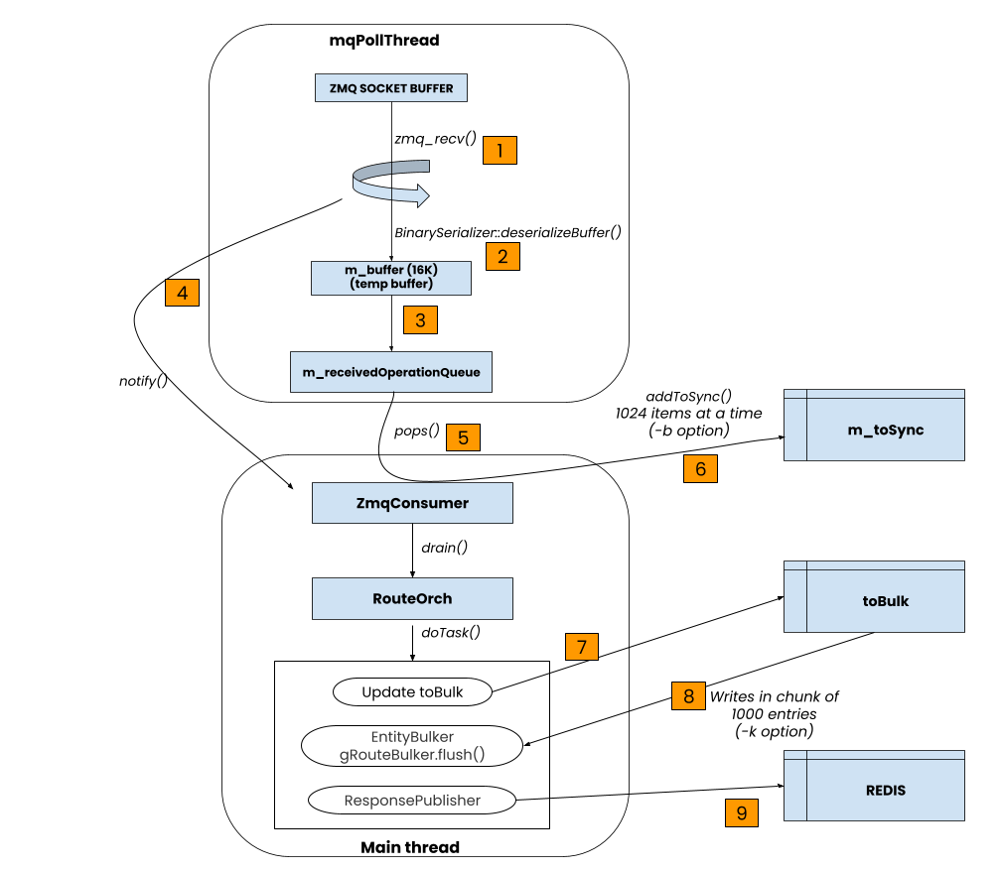
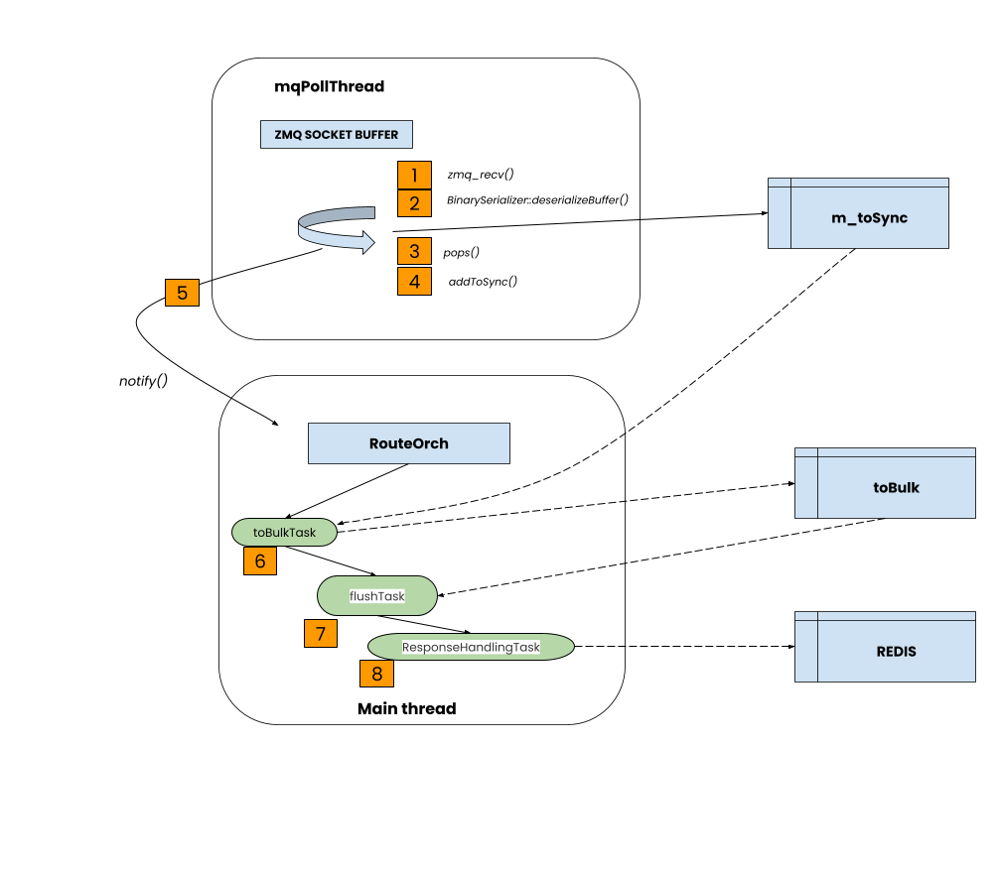

# Improve Resiliency of Orchagent Route Programming 

## Table of Content

- [Table of Content](#table-of-content)
  - [1. Revision](#1-revision)
  - [2. Scope](#2-scope)
  - [3. Definitions/Abbreviations](#3-definitionsabbreviations)
  - [4. Overview](#4-overview)
  - [5. Requirements](#5-requirements)
  - [6. Architecture Design](#6-architecture-design)
    - [6.1. Existing design](#61-existing-design)
    - [6.2. Issues with the existing design](#62-issues-with-the-existing-design)
    - [6.3. New design overview](#63-new-design-overview)
  - [7. High-Level Design](#7-high-level-design)
    - [7.1. Change `m_toSync` data structure](#71-change-m_tosync-data-structure)
    - [7.2. Update `m_toSync` from `mqPollThread` directly](#72-update-m_tosync-from-mqpollthread-directly)
    - [7.3. Split `drain()` into 3 independent operations](#73-split-drain-into-3-independent-operations)
    - [7.4. Enable the 3 tasks to be capable of yield/resume](#74-enable-the-3-tasks-to-be-capable-of-yieldresume)
    - [7.5. Task processing adheres to time quanta](#75-task-processing-adheres-to-time-quanta)
    - [7.6. Asynchronous route state publish](#76-asynchronous-route-state-publish)
    - [7.7. Per task instrumentation in Orchdaemon](#77-per-task-instrumentation-in-orchdaemon)
    - [7.8. Modules and repositories affected](#78-modules-and-repositories-affected)
    - [7.9. SWSS / Syncd changes](#79-swss--syncd-changes)
    - [7.10. DB and schema changes](#710-db-and-schema-changes)
    - [7.11. Scalability and performance](#711-scalability-and-performance)
    - [7.12. Serviceability and debug](#712-serviceability-and-debug)
    - [7.13. Platform dependency](#713-platform-dependency)
  - [8. SAI API](#8-sai-api)
  - [9. Configuration and management](#9-configuration-and-management)
    - [9.1. Manifest (if the feature is an Application Extension)](#91-manifest-if-the-feature-is-an-application-extension)
    - [9.2. CLI/YANG model Enhancements](#92-cliyang-model-enhancements)
    - [9.3. Config DB Enhancements](#93-config-db-enhancements)
  - [10. Warmboot and Fastboot Design Impact](#10-warmboot-and-fastboot-design-impact)
    - [Warmboot and Fastboot Performance Impact](#warmboot-and-fastboot-performance-impact)
  - [11. Memory Consumption](#11-memory-consumption)
  - [12. Restrictions/Limitations](#12-restrictionslimitations)
  - [13. Testing Requirements/Design](#13-testing-requirementsdesign)
    - [13.1. Unit Test cases](#131-unit-test-cases)
    - [13.2. System Test cases](#132-system-test-cases)
  - [14. Open/Action items](#14-openaction-items)

## 1. Revision

| Rev | Date       | Author                  | Change Description |
|-----|------------|-------------------------|--------------------|
| 0.1 | 2026-05-12 | Venkit Kasiviswanathan  | Initial version    |

## 2. Scope

This document describes an improvement of the route programming hot path in
`orchagent` to improve resiliency. The scope is limited to how `RouteOrch` and related orch agents
consume route updates from `fpmsyncd` over ZMQ, accumulate them, and program
them into syncd. The goals are to:

- Eliminate non-coalescing intermediate queues between the ZMQ ingress and
  `m_toSync`.
- Bound the CPU time consumed by route programming per main-loop iteration so
  other orch agents continue to make progress.
- Make the response-handling path asynchronous to avoid blocking the hot path
  on REDIS publishes.

Tracked under upstream issue
[sonic-buildimage#27098](https://github.com/sonic-net/sonic-buildimage/issues/27098).

## 3. Definitions/Abbreviations

| Term            | Definition |
|-----------------|------------|
| ZMQ             | ZeroMQ messaging library used between `fpmsyncd` and `orchagent`. |
| `m_toSync`      | Coalescing data structure inside an orch agent holding pending updates keyed by entity. |
| `mqPollThread`  | Thread inside the orch ZMQ consumer that reads from the ZMQ socket. |
| `drain()`       | Routine that processes pending entries from `m_toSync` and programs them. |
| `toBulk`        | Local accumulator inside `drain()` used to batch updates to the bulker. |
| `EntityBulker` / `gRouteBulker` | SAI bulk-API helpers in SWSS. |
| `doTask()`      | Per-orch entry point invoked by orchdaemon to do pending work. |
| RAII            | Resource Acquisition Is Initialization (C++ idiom used for the task timer). |
| IQR             | Inter-quartile range; used for outlier classification in task stats. |

## 4. Overview

`orchagent` today receives route updates from `fpmsyncd` over ZMQ. The
`mqPollThread` deserializes incoming buffers into a non-coalescing queue. The
main thread then drains that queue into the coalescing `m_toSync` map, runs
`doTask()` to build a bulk request, flushes the bulk to syncd, and finally
publishes the response back to REDIS. All of these steps run serially in the
main thread, which holds up every other orch agent and lets intermediate
queues and ZMQ socket buffers back up under load.

This HLD proposes to:

1. Move the addToSync work into `mqPollThread` so tuples flow directly into
   the coalescing `m_toSync`, removing the intermediate non-coalescing queues.
2. Split `drain()` into three independent stages (build bulk, flush, handle
   response) and run each under a bounded time quantum with yield/resume
   semantics.
3. Make the response publish asynchronous so the hot path is not blocked on
   REDIS.
4. Add per-task instrumentation in orchdaemon and corresponding CLI to
   inspect/clear the stats.

## 5. Requirements

- Keep draining from ZMQ and updating the coalescing state continuously, so
  that ZMQ socket buffers do not overrun and non-coalescing queues do not
  build up. Only the latest update for a key should be processed when
  orchagent gets around to it.
- The drain operation must not block ingress into `m_toSync`. The slower the
  drain, the more coalescing benefit is realized.
- The three activities inside `drain()` must be independent of updating
  `m_toSync`, so they do not hold up the coalescing path.
- Each of the three activities must yield the CPU after a bounded time
  duration and resume later, so other orch agents get a chance to run.
- Provide observability (per-task run time, scheduling latency, outliers) and
  a way to clear the counters.

## 6. Architecture Design

The change is internal to `orchagent`. The overall SONiC architecture
(`fpmsyncd` → ZMQ → `orchagent` → syncd → ASIC, with REDIS state publish) is
unchanged. What changes is the threading model and data flow inside
`orchagent` between the ZMQ consumer and `RouteOrch`.

### 6.1. Existing design



1. `zmq_recv()` reads from the ZMQ socket buffer into `m_buffer`.
2. `BinarySerializer::deserializeBuffer()` is called.
3. Data is written into `m_receivedOperationQueue`.
4. Notify the main thread.
5. The main thread issues `pops()` and reads 1024 items.
6. Data is written to `m_toSync`. This coalesces previous writes.
7. `doTask()` runs on **all the items** present in `m_toSync`. It populates a
   local `toBulk` data structure.
8. `EntityBulker.flush()` is called. It flushes in chunks of 1000 entries in
   the following order:
   1. Delete entries are written first.
   2. New entries are written next.
   3. Change entries are written last.
9. Wait for the response from syncd and call `ResponsePublish` to publish into
   REDIS.
   1. This step can be made asynchronous to save time in the hot path.

### 6.2. Issues with the existing design

- **Non-coalescing nature of the intermediate queues**
  - All queues maintained in the `mqPollThread` are non-coalescing. If the
    same route churns multiple times, multiple entries exist in those queues.
  - The only coalescing data structure is `m_toSync`.
  - If the main thread takes more time to process, these non-coalescing queues
    start building up and consume a lot of memory and CPU.
  - If `mqPollThread` is slower, the ZMQ socket buffers fill up and the sender
    (`fpmsyncd`) is forced to retry and stall.
  - The following operations happen serially: `pops()`, `addToSync()`,
    `drain()`. While `drain()` is running, the queue in the previous stage is
    growing.
- **Unbounded CPU utilization**
  - Because the three operations happen serially in the main thread, no other
    orch agents can run while route programming is in progress.
- **Synchronous nature of `drain()`**
  - `drain()` is comprised of three different activities:
    1. Accumulate a bulk of updates in `toBulk`.
    2. Flush the accumulated bulk to syncd.
    3. Process the response, handle errors, and update REDIS.
  - All of these happen synchronously without yielding the CPU.

### 6.3. New design overview



- Move `addToSync` work off the main thread. The merge logic now runs in
  `mqPollThread`.
- Eliminate the intermediate queues. Tuples flow from `mqPollThread` →
  `m_toSync` directly.
- Wake the main loop at most once per "real" burst. Use a 2-tier poll timeout
  to coalesce notifications.
- Split `drain()` into three independent tasks (`toBulkTask`, `flushTask`,
  `responseHandlingTask`) that each adhere to a time quantum and support
  yield/resume.

## 7. High-Level Design

### 7.1. Change `m_toSync` data structure

- After [sonic-swss#3872](https://github.com/sonic-net/sonic-swss/pull/3872) was
  merged, `m_toSync` no longer needs to be a `std::multimap` (holding
  multiple values for the same key). Currently it holds:
  - Just `SET`
  - Just `DEL`
  - Or `DEL` followed by `SET`
- This allowed coalescing of multiple fields for a key.
- With the above PR, this is no longer a requirement.
- `m_toSync` can be converted to a simple `unordered_map`. Any update simply
  overwrites the existing entry's value.

### 7.2. Update `m_toSync` from `mqPollThread` directly

PRs implementing this:

- [sonic-swss-common#1187](https://github.com/sonic-net/sonic-swss-common/pull/1187)
- [sonic-swss#4564](https://github.com/sonic-net/sonic-swss/pull/4564)

- Eliminate the intermediate non-coalescing queues described above and update
  the coalescing `m_toSync` directly from `mqPollThread`.
- This ensures ZMQ socket buffers are drained on time.
- More coalescing happens when `drain()` is slower.
- The following operations are performed inside `mqPollThread`:
  - `pops()`
  - `addToSync()`
- Locks protect concurrent access to `m_toSync`.
- The change is implemented incrementally. The initial implementation still
  holds the lock for the entire duration when `drain()` is operating, which
  is no different from today.
- In subsequent PRs the code incrementally reads/writes `m_toSync` only when
  required, allowing `mqPollThread` to update it even while `drain()` is
  operating.

### 7.3. Split `drain()` into 3 independent operations

- Split `drain()` into the following independent operations / functions:
  1. `toBulkTask`: update `toBulk`.
  2. `flushTask`: `gRouteBulker.flush()`.
  3. `responseHandlingTask`: response handling.
- `doTask()` has 3 states depending on what part of the processing is being
  handled:
  1. `toBulkTask` state
  2. `flushTask` state
  3. `responseHandlingTask` state
- For incremental implementation, initial PRs can focus on splitting the
  `doTask()` code into independent functions and calling them serially.

### 7.4. Enable the 3 tasks to be capable of yield/resume

- Once the 3 tasks are separated as described above, each function is
  refactored to yield after a specified duration of operation.
- The code stores the state it was in (`toBulkTask`, `flushTask`, or
  `responseHandlingTask`).
- It also stores any additional checkpoint information so the task can resume
  where it left off.
- It gets rescheduled by posting a notification event to self.
- When the Selectable is scheduled again, `doTask()` looks at the previous
  state and calls the appropriate function. The checkpoint information helps
  it start from where it left off.

### 7.5. Task processing adheres to time quanta

- To keep `m_toSync` independent and allow `mqPollThread` to keep updating
  (and coalescing) it, `toBulkTask` consults `m_toSync` in a manner that
  allows concurrent access.
- `toBulkTask` does not walk through the entire `m_toSync` collection like it
  does today. It walks some bounded number of entries (until a fixed time
  quantum is over).
- While walking, it removes those items from `m_toSync` and updates the
  `toBulk` data structure.
- `flushTask` does not need access to `m_toSync` at all.
- `responseHandlingTask` normally does not need access to `m_toSync` if there
  are no failures. If there is a failure, it does the following:
  - Write the entry back to `m_toSync`, if the key does not exist there.
  - If the key exists in `m_toSync`, drop the failed entry because there is a
    more recent update.

### 7.6. Asynchronous route state publish

- [sonic-swss#4437](https://github.com/sonic-net/sonic-swss/pull/4437) turns
  this on. Existing code can publish into REDIS from a separate thread.
- This makes `responseHandlingTask` much faster and lets it handle more work
  in a given time quantum.

### 7.7. Per task instrumentation in Orchdaemon

Show commands display task stats and a clear command resets them.

- [sonic-utilities#4536](https://github.com/sonic-net/sonic-utilities/pull/4536)
- [sonic-swss#4563](https://github.com/sonic-net/sonic-swss/pull/4563)

Example output:

```
show orchagent tasks

TASK                              RUN TIME                          RUNS    OUTLIERS  SCHED LATENCY                       TOTAL
                                  median/q1/q3/max                                    median/q1/q3/max                    run/sched
                                  (in msec)                                           (in msec)                           (in msec)
ROUTE_TABLE                       1293.32/314.13/1368.40/1569.05      27           0  2.02/0.22/14.52/204.94              27755.02/618.12
ASIC_SENSORS_POLL_TIMER           204.31/156.05/204.31/208.18          4           0  9930.07/9930.07/10861.90/10861.90   724.40/30323.27
WM_TELEMETRY_TIMER                79.75/79.75/79.75/79.75              1           0  -                                   79.75/-
NEIGH_TABLE                       0.28/0.19/0.28/11.62                 4           0  1380.30/1380.30/11540.49/11540.49   12.18/14217.58
flush                             0.20/0.16/0.21/0.31                 26           0  1322.48/1305.44/1403.67/2098.98     5.21/33617.53
FABRIC_POLL                       0.11/0.11/0.11/0.11                  1           0  -                                   0.11/-
PFC_WD_COUNTERS_POLL              0.00/0.00/0.00/0.00                 28           0  1319.41/1060.10/1375.67/2099.29     0.03/33999.72
UPDATE_MAPS_TIMER                 0.00/0.00/0.00/0.00                 28           0  1314.26/1056.07/1367.65/1992.78     0.02/33884.63
P4_ACL_COUNTERS_STATS_POLL_TIMER  0.00/0.00/0.00/0.00                  3           0  10180.80/9538.98/10180.80/10180.80  0.00/19719.79
P4_EXT_COUNTERS_STATS_POLL_TIMER  0.00/0.00/0.00/0.00                  3           0  10180.82/9538.97/10180.82/10180.82  0.00/19719.79
ACL_TABLE                         -                                    0           0  -                                   -/-
ASIC_SENSORS                      -                                    0           0  -                                   -/-
```

A companion `sonic-clear orchagent tasks` command resets the counters.

The implementation wraps every `Executor::execute()` (as well as `flush` and
`logRotate`) in a small RAII `TaskTimer`. The per-`Executor` results land in an
`ExecutorStat` structure and report:

- Run time (median, 25%, 75%, max)
- Runs
- Scheduling latency (median, 25%, 75%, max)
- Total run time and total scheduling latency
- Outliers (> 1.5 × IQR)

### 7.8. Modules and repositories affected

| Repository           | Modules / files                                                  | Nature of change                                                |
|----------------------|------------------------------------------------------------------|-----------------------------------------------------------------|
| `sonic-swss-common`  | ZMQ consumer / producer plumbing                                 | Allow direct updates of coalescing state from poll thread       |
| `sonic-swss`         | `orchagent` (`RouteOrch`, `Orch`, `Orchdaemon`, ZMQ consumer)    | Data structure change, split `drain()`, yield/resume, async publish, per-task instrumentation |
| `sonic-utilities`    | `show`/`sonic-clear` commands                                    | New `show orchagent tasks` and `sonic-clear orchagent tasks`    |

This is a built-in SONiC feature, not a SONiC Application Extension.

### 7.9. SWSS / Syncd changes

- Inside SWSS, the largest changes are in the ZMQ consumer path and
  `RouteOrch`. The change replaces a non-coalescing intermediate queue with
  direct updates into the coalescing `m_toSync` map (protected by a lock),
  and breaks `drain()` into three independently schedulable stages with
  yield/resume semantics and per-stage time quanta.
- Syncd is not modified by this design. The SAI bulk API usage and
  flush-ordering semantics (deletes first, adds next, changes last) are
  preserved.

### 7.10. DB and schema changes

There are no schema changes to `APP_DB`, `ASIC_DB`, `COUNTERS_DB`,
`LOGLEVEL_DB`, `CONFIG_DB`, or `STATE_DB`. The publish into REDIS uses the
existing route state mechanism; the only change is that it now happens
asynchronously from a separate thread.

### 7.11. Scalability and performance

- ZMQ socket buffers no longer back up under bursty churn because
  `mqPollThread` drains them directly into the coalescing `m_toSync`.
- Higher churn rates increase the amount of coalescing, reducing the number
  of SAI operations that ultimately reach syncd.
- Bounded time quanta on `toBulkTask`, `flushTask`, and
  `responseHandlingTask` ensure that other orch agents get scheduled in a
  timely manner. This bounds the worst-case scheduling latency of other
  agents (visible through the `show orchagent tasks` output).

### 7.12. Serviceability and debug

- `show orchagent tasks` exposes per-Executor run-time and scheduling-latency
  statistics (median, q1, q3, max, total) along with outlier counts based on
  the 1.5 × IQR rule.
- `sonic-clear orchagent tasks` resets the counters.
- Existing syslog logging in `RouteOrch` and the ZMQ consumer paths is
  retained.

### 7.13. Platform dependency

None. The change is internal to `orchagent` and does not require any SAI or
platform vendor changes.

## 8. SAI API

No new or modified SAI APIs are introduced by this design. The existing
`SAI_OBJECT_TYPE_ROUTE_ENTRY` bulk APIs are used unchanged.

## 9. Configuration and management

### 9.1. Manifest (if the feature is an Application Extension)

Not applicable. This is a built-in SONiC feature.

### 9.2. CLI/YANG model Enhancements

Two new commands are added. There are no YANG model changes.

| Command                          | Description                                                              |
|----------------------------------|--------------------------------------------------------------------------|
| `show orchagent tasks`           | Display per-Executor run time, runs, outliers, and scheduling latency.   |
| `sonic-clear orchagent tasks`    | Reset the per-Executor counters.                                         |

Both are additive, do not change any existing CLI, and are downward
compatible. The corresponding entries in
[sonic-utilities Command-Reference.md](https://github.com/sonic-net/sonic-utilities/blob/master/doc/Command-Reference.md)
will be updated alongside the CLI PR.

### 9.3. Config DB Enhancements

No `CONFIG_DB` changes.

## 10. Warmboot and Fastboot Design Impact

This feature does not change the warmboot or fastboot contract. `orchagent`
continues to use the same APP_DB / ASIC_DB / STATE_DB interactions and the
same SAI bulk-flush ordering. Existing warmboot/fastboot guarantees
(including data-plane disruption budgets) are preserved.

### Warmboot and Fastboot Performance Impact

- No additional stalls, sleeps, or I/O operations are introduced into the
  boot critical chain.
- No additional CPU-heavy processing (e.g., Jinja template rendering) is
  added in the boot path.
- No third-party dependency updates are required.
- The feature is part of `orchagent`; it is not a separate docker or service
  that could be delayed.
- Because the change reduces the worst-case time the main thread spends
  inside `drain()`, the expected effect on warmboot route-convergence time is
  neutral to positive.

## 11. Memory Consumption

- Eliminating the intermediate non-coalescing queues reduces steady-state
  memory consumption under churn; in the existing design, those queues can
  grow unbounded when the main thread is slower than the producer.
- The new `m_toSync` is a single `unordered_map` instead of a `multimap`,
  which slightly reduces per-entry overhead.
- The per-Executor statistics structure adds a small fixed amount of memory
  per Executor; no growth proportional to traffic.
- No memory consumption growth is expected when the feature is disabled via
  configuration; the instrumentation has negligible cost when disabled.

## 12. Restrictions/Limitations

- The incremental rollout still holds the `m_toSync` lock for the entire
  duration of `drain()` in the initial PRs. Full concurrent access is gated
  on subsequent PRs that read/write `m_toSync` only when required.
- The yield/resume scheme relies on each stage being able to checkpoint its
  progress. Stages that, in the future, perform indivisible work larger than
  the time quantum will still run to completion before yielding.

## 13. Testing Requirements/Design

### 13.1. Unit Test cases

- `m_toSync` as `unordered_map`: SET-then-SET coalesces, DEL-then-SET
  overwrites, SET-then-DEL overwrites.
- `mqPollThread` writes directly into `m_toSync` with the correct lock
  discipline.
- `toBulkTask`, `flushTask`, `responseHandlingTask` each respect the
  configured time quantum and correctly checkpoint/resume.
- `responseHandlingTask` failure handling: write back to `m_toSync` only when
  the key is absent; drop when a newer update is present.
- `TaskTimer` records run time and scheduling latency correctly, and
  outliers are classified using the 1.5 × IQR rule.
- `sonic-clear orchagent tasks` resets all counters.

### 13.2. System Test cases

- Sustained route churn from `fpmsyncd` at rates that previously caused ZMQ
  socket-buffer back-pressure: verify no ZMQ retries/stalls and that
  `show orchagent tasks` shows bounded run times per stage.
- Bursty churn: verify coalescing increases as `drain()` time grows,
  resulting in fewer SAI operations than discrete updates produced.
- Co-scheduling: verify that other orch agents (e.g., NEIGH, ACL) make
  forward progress while `RouteOrch` is processing a heavy churn burst,
  visible as bounded scheduling latency in `show orchagent tasks`.
- Warmboot with active route churn: verify route convergence time is not
  regressed.

## 14. Open/Action items

- Throttle writes in `fpmsyncd` by handling soft back-pressure in the form
  of ZMQ socket buffers being full. This will require `fpmsyncd` to maintain
  local state of the items it writes into ZMQ.
- Convert other agents in `orchagent` to the yield/resume pattern when each
  run takes a specified quantum of time. This ensures the main thread of
  `orchagent` runs within bounds and is able to schedule every task in a
  reasonable time.
