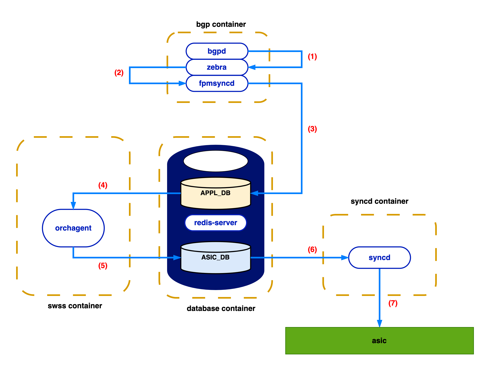

# Improve Orchagent Route performance

### Revision

| Rev |     Date    |       Author       | Change Description                |
|:---:|:-----------:|:------------------:|-----------------------------------|
| 1.1 | Mar  4 2024 |   Hua Liu          | Improve route performance         |

## Table of Contents

- [Goal \& Scope](#goal--scope)
- [Definitions \& Abbreviations](#definitions--abbreviations)
- [Overview](#overview)
- [BGP route performance issue](#bgp-route-performance-issue)
- [The performance of various feature combinations](#the-performance-of-various-feature-combinations)
- [WarmRestart scenario](#warmrestart-scenario)
- [Ring Buffer](#ring-buffer)
- [Multiple DB](#multiple-db)
- [Ring Buffer](#ring-buffer)
- [Error recovery](#error-recovery)
- [References](#references)

## Goal & Scope

The goal of this project is improve route operation performance between fpmsyncd and orchagent.

This document will test and compare performance improvement of following feature:
1. Enable ZMQ between fpmsyncd and orchanget.
2. Enable Ring Buffer for route table, this feature develop by Alibaba.
3. Enable multiple-db support.

## Definitions & Abbreviations

| Definitions/Abbreviation | Description                             |
| ------------------------ | --------------------------------------- |
| BGP                      | Border Gateway Protocol                 |
| FPM                      | Forwarding Plane Manager                |
| ZMQ                      | ZeroMQ                                  |

## Overview
SONiC BGP loading/withdrawing workflow is shown in the figure below:
<figure align="center">
    
    <figcaption>SONiC BGP loading/withdrawing workflow</figcaption>
</figure>

1. `bgpd` parses the packets received on the socket, notifies `zebra`
2. `zebra` delivers this route to `fpmsyncd`
3. `fpmsyncd` uses redis pipeline to flush routes to `APPL_DB`
4. `orchagent` consumes `APPL_DB`
5. `orchagent` calls `sairedis` APIs to write into `ASIC_DB`
6. `syncd` consumes `ASIC_DB`
7. `syncd` invokes `SAI` SDK APIs to inject routing data to the hardware asic.

## BGP route performance issue
Alibaba analyze and identify performance issues with this document:
 - BGP Loading Optimization for SONiC: https://github.com/a114j0y/SONiC/blob/master/doc/bgp_loading_optimization/bgp-loading-optimization-hld.md

Issue:
 - Orchagent consumer execute workflow is single-threaded
    - Alibaba add async ringbuffer to router consumer:
    https://github.com/sonic-net/sonic-swss/pull/3242
 - Syncd is too strictly locked, It also has a single-threaded workflow to pop data from the upstream redis tables.
 - Redundant APPL_DB I/O traffic: producerstatetable publishes every command and fpmsyncd flushes on every select event, APPL_DB does redundant housekeeping.
 - Slow Routes decode and kernel thread overhead in zebra
 - Synchronous sairedis API usage

## The performance of various feature combinations

Performance test on Mellanox 4600 T1 device with 'sudo config bgp startup all':
```
Neighbhor      V     AS    MsgRcvd    MsgSent    TblVer    InQ    OutQ  Up/Down      State/PfxRcd  NeighborName
-----------  ---  -----  ---------  ---------  --------  -----  ------  ---------  --------------  --------------
10.0.0.1       4  65200       3204       3225     19923      0       0  00:00:43             6370  ARISTA01T2
10.0.0.5       4  65200       3204       3225     19923      0       0  00:00:42             6370  ARISTA03T2
10.0.0.9       4  65200       3204       3225     19923      0       0  00:00:42             6370  ARISTA05T2
10.0.0.13      4  65200       3204       3225     19923      0       0  00:00:43             6370  ARISTA07T2
10.0.0.33      4  64001         20       3225     19923      0       0  00:00:43                3  ARISTA01T0
10.0.0.35      4  64002         20       3225     19923      0       0  00:00:43                3  ARISTA02T0
10.0.0.37      4  64003         21       3225     19923      0       0  00:00:43                4  ARISTA03T0
10.0.0.39      4  64004         20       3225     19923      0       0  00:00:42                3  ARISTA04T0
10.0.0.41      4  64005         21       3225     19923      0       0  00:00:42                4  ARISTA05T0
10.0.0.43      4  64006         20       3225     19923      0       0  00:00:42                3  ARISTA06T0
10.0.0.45      4  64007         20       3225     19923      0       0  00:00:42                3  ARISTA07T0
10.0.0.47      4  64008         20       3225     19923      0       0  00:00:42                3  ARISTA08T0
10.0.0.49      4  64009         20       3225     19923      0       0  00:00:42                3  ARISTA09T0
10.0.0.51      4  64010         20       3225     19923      0       0  00:00:42                3  ARISTA10T0
10.0.0.53      4  64011         20       3225     19923      0       0  00:00:42                3  ARISTA11T0
10.0.0.55      4  64012         20       3225     19923      0       0  00:00:42                3  ARISTA12T0
10.0.0.57      4  64013         20       3225     19923      0       0  00:00:42                3  ARISTA13T0
10.0.0.59      4  64014         20       3225     19923      0       0  00:00:42                3  ARISTA14T0
10.0.0.61      4  64015         20       3225     19923      0       0  00:00:42                3  ARISTA15T0
10.0.0.63      4  64016         20       3225     19923      0       0  00:00:42                3  ARISTA16T0
10.0.0.65      4  64017         19       3225     19923      0       0  00:00:42                1  ARISTA17T0
10.0.0.67      4  64018         19       3225     19923      0       0  00:00:42                1  ARISTA18T0
10.0.0.69      4  64019         19       3225     19923      0       0  00:00:42                1  ARISTA19T0
10.0.0.71      4  64020         19       3225     19923      0       0  00:00:42                1  ARISTA20T0
```

```
$ sonic-db-cli ASIC_DB eval "return #redis.call('keys', 'ASIC_STATE:SAI_OBJECT_TYPE_ROUTE_ENTRY*')" 0
12951
```

Example:

Before, 14 seconds:
```
2025 Mar 13 03:12:11.047897 bjw2-can-4600c-3 DEBUG bgp#bgpcfgd: Received message : '('10.0.0.1', 'SET', (('admin_status', 'up'), ('asn', '65200'), ('holdtime', '10'), ('keepalive', '3'), ('local_addr', '10.0.0.0'), ('name', 'ARISTA01T2'), ('nhopself', '0'), ('rrclient', '0')))'
...
2025 Mar 13 02:38:27.857735 DEVICENAME ERR swss#orchagent: :- doTask: [TEST] RouteOrch::doTask, gRouteBulker.flush: 615 - 108 - 0
2025 Mar 13 02:38:27.988419 DEVICENAME ERR swss#orchagent: :- doTask: [TEST] RouteOrch::doTask, gRouteBulker.flush end
```

After, 7 seconds:
```
2025 Mar 13 02:16:14.436029 DEVICENAME DEBUG bgp#bgpcfgd: Received message : '('10.0.0.1', 'SET', (('admin_status', 'up'), ('asn', '65200'), ('holdtime', '10'), ('keepalive', '3'), ('local_addr', '10.0.0.0'), ('name', 'ARISTA01T2'), ('nhopself', '0'), ('rrclient', '0')))'
...
2025 Mar 13 03:12:23.794588 bjw2-can-4600c-3 ERR swss#orchagent: :- doTask: [TEST] RouteOrch::doTask, gRouteBulker.flush: 90 - 12 - 0
2025 Mar 13 03:12:23.854000 bjw2-can-4600c-3 ERR swss#orchagent: :- doTask: [TEST] RouteOrch::doTask, gRouteBulker.flush end
```

<!-- <style>
table{
  margin:auto;
}
</style> -->
| Combination                     |  Time (seconds)    |
| ------------------------------- | -------------------|
| Without any feature             |  14                |
| Multiple DB                     |  8                 |
| Ring buffer                     |  14                |
| ZMQ                             |  6                 |
| Multiple DB + Ring buffer       |  12                |
| Multiple DB + Ring buffer + ZMQ |  7                 |

## The performance on chassis

Performance test on Cisco 8800 chassis device with 'sudo config bgp startup all':
```
$ show ip bgp summary
IPv4 Unicast Summary:
asic0: BGP router identifier 3.3.3.9, local AS number 65100 vrf-id 0
BGP table version 103312
asic1: BGP router identifier 3.3.3.10, local AS number 65100 vrf-id 0
BGP table version 85519
asic2: BGP router identifier 3.3.3.11, local AS number 65100 vrf-id 0
BGP table version 119695
RIB entries 308037, using 69000288 bytes of memory
Peers 48, using 35614848 KiB of memory
Peer groups 18, using 1152 bytes of memory

Neighbhor      V     AS    MsgRcvd    MsgSent    TblVer    InQ    OutQ  Up/Down      State/PfxRcd  NeighborName
-----------  ---  -----  ---------  ---------  --------  -----  ------  ---------  --------------  --------------
10.0.0.1       4  65200        277         12         0      0       0  00:03:52                1  ARISTA01T3
10.0.0.5       4  65200        297         12         0      0       0  00:04:29                1  ARISTA03T3
10.0.0.9       4  65200        275          8         0      0       0  00:03:56                1  ARISTA05T3
10.0.0.13      4  65200        277         10         0      0       0  00:03:54            33793  ARISTA07T3
10.0.0.17      4  65200        275          8         0      0       0  00:03:52                1  ARISTA09T3
10.0.0.21      4  65200        275          8         0      0       0  00:03:57                1  ARISTA11T3
10.0.0.25      4  65200        275          8         0      0       0  00:03:50            33793  ARISTA18T3
10.0.0.29      4  65200        275          8         0      0       0  00:03:59                1  ARISTA15T3
10.0.0.33      4  65200        276          9         0      0       0  00:04:07                1  ARISTA13T3
10.0.0.35      4  65200        276          9         0      0       0  00:04:04                1  ARISTA17T3
10.0.0.37      4  65200        276          9         0      0       0  00:04:05            33793  ARISTA19T3
10.0.0.39      4  65200        275          8         0      0       0  00:03:57            33793  ARISTA20T3
10.0.0.41      4  65200        275          8         0      0       0  00:03:47            33793  ARISTA21T3
10.0.0.43      4  65200        276          9         0      0       0  00:04:06            33793  ARISTA22T3
10.0.0.45      4  65200        275          8         0      0       0  00:03:58            33793  ARISTA23T3
10.0.0.47      4  65200        276          9         0      0       0  00:04:06            33793  ARISTA24T3
10.0.0.49      4  65200        275          8         0      0       0  00:04:00                1  ARISTA25T3
10.0.0.51      4  65200        276          9         0      0       0  00:04:01                1  ARISTA26T3
10.0.0.53      4  65200        276          9         0      0       0  00:04:01                1  ARISTA27T3
10.0.0.55      4  65200        275          8         0      0       0  00:03:47                1  ARISTA28T3
10.0.0.57      4  65200        275          8         0      0       0  00:03:51            33793  ARISTA29T3
10.0.0.59      4  65200        275          8         0      0       0  00:03:53            33793  ARISTA30T3
10.0.0.61      4  65200        275          8         0      0       0  00:04:00            33793  ARISTA31T3
10.0.0.63      4  65200        275          8         0      0       0  00:03:56            33793  ARISTA32T3
```

<!-- <style>
table{
  margin:auto;
}
</style> -->
| Combination                     |  Time (seconds)    |
| ------------------------------- | -------------------|
| Without any feature             |  115               |
| Multiple DB                     |  80                |
| ZMQ                             |  50                |

## Pros and Cons


<!-- <style>
table{
  margin:auto;
}
</style> -->
| Feature     |  Pros                                                            |  Cons                                                       |
| ----------- | -----------------------------------------------------------------|-------------------------------------------------------------|
| Multiple DB | No code change, performance improve 40%, on single asic device from 14s improved to 8s, on multi-asic device from 120s improved to 80s.     | Increase 50% CPU and memory utilzation.                     |
| Ring buffer | Still using Redis, feature is ready, only enable a feature flag. | Poor performance, almost no improvement.                    |
| ZMQ         | Best performance, performance improve 60%, on single asic device from 14s improved to 6s, on multi-asic device from 120s improved to 50s.                                     | Need code change in multiple daemon. using TCP connection. Introduce a depency between orchagent and fpmsyncd, as ZMQ server side, orchagent must start before fpmsyncd. |

## Ring Buffer
 - Ring buffer feature enable/disable flag in CONFIG_DB:
 
```json
        container DEVICE_METADATA {
            container localhost{
                leaf ring_thread_enabled {
                    type boolean;
                    description "Enable gRingMode of OrchDaemon, which would set up its ring thread to accelerate task execution.";
                    default "false";
                }

            }
        }
```

 - Ring buffer design doc: https://github.com/sonic-net/SONiC/pull/1521

 - Ring buffer performance improve:
 The table below compares the loading speed of fpmsyncd and orchagent before and after optimization, tested with loading 2M routes on the Alibaba SONiC based eSR platform:

<!-- <style>
table{
  margin:auto;
}
</style> -->
| Module                   |  Original Speed(routes/s)    | Optimized Speed (routes/s) |
| ------------------------ | -----------------------------| -----------------------------|
| Fpmsyncd                 |  <center>17K                 | <center>25.4K                 |
| Orchagent                |  <center>9.7K               | <center>13.9K            |

## Multiple DB
 - Today SONiC by default only has one redis database instance created and all the databases use this unique database instance, like APPL_DB, ASIC_DB, CONF_DB and so on. when there are huge writes operations during a short time period (like huge routes created), this only database instance is very busy.

 - By enable multiple-db, the huge write operation will be separate into different database instances. According to design doc, test result shows the performance (time) improved 20-30%.

 - Multiple-db example:
```
admin@DEVICE:~$ cat /var/run/redis/sonic-db/database_config.json
{
    "INSTANCES": {
        "redis": {
            "hostname": "127.0.0.1",
            "port": 6379,
            "unix_socket_path": "/var/run/redis/redis.sock",
            "persistence_for_warm_boot": "yes"
        },
        "redis1": {
            "hostname": "127.0.0.1",
            "port": 6378,
            "unix_socket_path": "/var/run/redis/redis1.sock",
            "persistence_for_warm_boot": "yes"
        },
        "redis2": {
            "hostname": "127.0.0.1",
            "port": 6377,
            "unix_socket_path": "/var/run/redis/redis2.sock",
            "persistence_for_warm_boot": "yes"
        },
        "redis3": {
            "hostname": "127.0.0.1",
            "port": 6376,
            "unix_socket_path": "/var/run/redis/redis3.sock",
            "persistence_for_warm_boot": "yes"
        },
        "redis4": {
            "hostname": "127.0.0.1",
            "port": 6375,
            "unix_socket_path": "/var/run/redis/redis4.sock",
            "persistence_for_warm_boot": "yes"
        },
        ...
    },
    "DATABASES": {
        "APPL_DB": {
            "id": 0,
            "separator": ":",
            "instance": "redis1"
        },
        "ASIC_DB": {
            "id": 1,
            "separator": ":",
            "instance": "redis2"
        },
        "COUNTERS_DB": {
            "id": 2,
            "separator": ":",
            "instance": "redis3"
        },
        ...
        "CONFIG_DB": {
            "id": 4,
            "separator": "|",
            "instance": "redis"
        },
        ...
```
 - Multiple-db feature need enabled with build-time flag: 
```
 ## Enable MULTIDB

sudo touch $FILESYSTEM_ROOT_ETC_SONIC/enable_multidb

```

 - Multiple-db design doc: https://github.com/sonic-net/SONiC/blob/master/doc/database/multi_database_instances.md

 - Compare of enable/disable Multiple-db
     - Disable
```
d50451ae9424   database       7.44%     104.1MiB / 7.648GiB   1.33%     0B / 0B   0B / 0B     20

redis         42  7.3  0.3  93696 26204 pts/0    Sl   07:52   0:09 /usr/bin/redis-server 127.0.0.1:6379
redis         43  0.1  0.2  61952 16304 pts/0    Sl   07:52   0:00 /usr/bin/redis-server 127.0.0.1:6400
```

    - Enable
```
3d6af74c6202   database         10.16%    157.2MiB / 7.648GiB   2.01%     0B / 0B   0B / 0B     40

redis         60  1.5  0.2  80384 21740 pts/0    Sl   07:43   0:05 /usr/bin/redis-server 127.0.0.1:6379
redis         61  2.9  0.3  75264 24628 pts/0    Sl   07:43   0:10 /usr/bin/redis-server 127.0.0.1:6378
redis         62  1.2  0.2  71168 23144 pts/0    Sl   07:43   0:04 /usr/bin/redis-server 127.0.0.1:6377
redis         65  4.1  0.2  67584 21768 pts/0    Sl   07:43   0:13 /usr/bin/redis-server 127.0.0.1:6376
redis         67  0.1  0.2  64512 18076 pts/0    Sl   07:43   0:00 /usr/bin/redis-server 127.0.0.1:6375
redis         71  0.1  0.2  64512 17940 pts/0    Sl   07:43   0:00 /usr/bin/redis-server 127.0.0.1:6400
```

 - Compare of enable/disable Multiple-db on chassis
     - Disable
```
0780122b63db   database2   3.48%     64.57MiB / 30.52GiB   0.21%     4.1MB / 12.2MB   0B / 0B     13
87715b509b4b   database0   4.10%     67.9MiB / 30.52GiB    0.22%     4.17MB / 13MB    0B / 0B     13
39da62270557   database1   3.81%     66.1MiB / 30.52GiB    0.21%     4.18MB / 13MB    0B / 0B     13
7c70e507008c   database    0.16%     92.07MiB / 30.52GiB   0.29%     0B / 0B          0B / 0B     13

uuidd       1896  0.5  0.0  71168 18588 pts/0    Sl   06:36   0:03 /usr/bin/redis-server 127.0.0.1:6379
uuidd       2674  3.7  0.0  93696 26200 pts/0    Sl   06:37   0:20 /usr/bin/redis-server 127.0.0.1:6379
uuidd       2684  3.6  0.0  93696 26048 pts/0    Sl   06:37   0:20 /usr/bin/redis-server 127.0.0.1:6379
uuidd       2689  3.7  0.0  93696 26112 pts/0    Sl   06:37   0:21 /usr/bin/redis-server 127.0.0.1:6379
```

    - Enable
```
ce282d50da16   database1   1.73%     93.11MiB / 30.52GiB   0.30%     1.35MB / 5.48MB   0B / 0B     35
8030e1db9371   database0   1.53%     95MiB / 30.52GiB      0.30%     1.41MB / 5.65MB   0B / 0B     35
d150671bf18d   database2   1.66%     94.96MiB / 30.52GiB   0.30%     1.34MB / 5.42MB   0B / 0B     35
b8bd66d579be   database    0.93%     120.6MiB / 30.52GiB   0.39%     0B / 0B           0B / 0B     35

uuidd       1615  0.5  0.0  64512 17848 pts/0    Sl   06:28   0:00 /usr/bin/redis-server 127.0.0.1:6379
uuidd       1616  0.1  0.0  64512 17452 pts/0    Sl   06:28   0:00 /usr/bin/redis-server 127.0.0.1:6378
uuidd       1617  0.1  0.0  64512 17956 pts/0    Sl   06:28   0:00 /usr/bin/redis-server 127.0.0.1:6377
uuidd       1618  0.1  0.0  64512 17676 pts/0    Sl   06:28   0:00 /usr/bin/redis-server 127.0.0.1:6376
uuidd       1621  0.1  0.0  64512 17480 pts/0    Sl   06:28   0:00 /usr/bin/redis-server 127.0.0.1:6375
uuidd       2489  1.0  0.0  80384 21708 pts/0    Sl   06:28   0:01 /usr/bin/redis-server 127.0.0.1:6379
uuidd       2490  0.2  0.0  71168 18692 pts/0    Sl   06:28   0:00 /usr/bin/redis-server 127.0.0.1:6378
uuidd       2491  0.8  0.0  64512 19108 pts/0    Sl   06:28   0:01 /usr/bin/redis-server 127.0.0.1:6377
uuidd       2493  0.1  0.0  67584 18580 pts/0    Sl   06:28   0:00 /usr/bin/redis-server 127.0.0.1:6376
uuidd       2495  0.1  0.0  64512 16804 pts/0    Sl   06:28   0:00 /usr/bin/redis-server 127.0.0.1:6375
uuidd       2498  1.0  0.0  80384 20984 pts/0    Sl   06:28   0:01 /usr/bin/redis-server 127.0.0.1:6379
uuidd       2502  0.2  0.0  71168 18992 pts/0    Sl   06:28   0:00 /usr/bin/redis-server 127.0.0.1:6378
uuidd       2505  0.8  0.0  64512 19168 pts/0    Sl   06:28   0:01 /usr/bin/redis-server 127.0.0.1:6377
uuidd       2508  0.1  0.0  67584 18452 pts/0    Sl   06:28   0:00 /usr/bin/redis-server 127.0.0.1:6376
uuidd       2511  0.1  0.0  64512 16396 pts/0    Sl   06:28   0:00 /usr/bin/redis-server 127.0.0.1:6375
uuidd       2559  1.0  0.0  80384 22080 pts/0    Sl   06:28   0:01 /usr/bin/redis-server 127.0.0.1:6379
uuidd       2560  0.3  0.0  71168 19004 pts/0    Sl   06:28   0:00 /usr/bin/redis-server 127.0.0.1:6378
uuidd       2561  0.8  0.0  64512 19304 pts/0    Sl   06:28   0:01 /usr/bin/redis-server 127.0.0.1:6377
uuidd       2562  0.1  0.0  67584 18604 pts/0    Sl   06:28   0:00 /usr/bin/redis-server 127.0.0.1:6376
uuidd       2564  0.1  0.0  64512 16832 pts/0    Sl   06:28   0:00 /usr/bin/redis-server 127.0.0.1:6375
```

## ZMQ
 - The route operation performance between fpmsyncd and orchagent can be improved by switch to ZMQ producer/consumer table.
 - The ZMQ producer/consumer table is 15 times faster than Redis based tables.
 - After change to ZMQ, the performance bottleneck become SAI API.
 - Improve route performance with ZMQ: https://github.com/sonic-net/SONiC/blob/master/doc/orchagent_zmq/Improve_route_performance_with_zmq.md

## References
 - BGP Loading Optimization for SONiC: https://github.com/a114j0y/SONiC/blob/eruan-new/doc/bgp_loading_optimization/bgp-loading-optimization-hld.md
 - Multiple-db design doc: https://github.com/sonic-net/SONiC/blob/master/doc/database/multi_database_instances.md
 - ZMQ producer/consumer state table design: https://github.com/sonic-net/SONiC/blob/master/doc/sonic-swss-common/ZMQ%20producer-consumer%20state%20table%20design.md
 - ZMQ: https://zguide.zeromq.org/docs/
 - Improve route performance with ZMQ: https://github.com/sonic-net/SONiC/blob/master/doc/orchagent_zmq/Improve_route_performance_with_zmq.md
