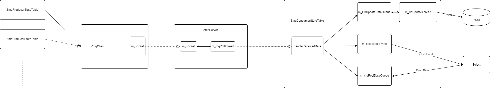

# Improve Orchagent Route performance with ZMQ

### Revision

| Rev |     Date    |       Author       | Change Description                |
|:---:|:-----------:|:------------------:|-----------------------------------|
| 1.1 | Mar  4 2024 |   Hua Liu          | Improve Orchagent with ZMQ        |

## Table of Contents

- [Goal \& Scope](#goal--scope)
- [Definitions \& Abbreviations](#definitions--abbreviations)
- [High-Level Proposal](#high-level-proposal)
- [Low-Level Implementation](#low-level-implementation)
  - [Fpmsyncd](#fpmsyncd)
  - [Orchagent](#orchagent)
  - [Multi-namespace](#multi-namespace)
  - [ConfigDB Schema](#configdb-schema)
- [WarmRestart scenario](#warmrestart-scenario)
- [Debugability](#debugability)
- [Performance improve result](#performance-improve-result)
- [References](#references)

## Goal & Scope

The goal of this project is improve route operation performance between fpmsyncd and orchagent.
Based on alibaba's team analyze result: "BGP Loading Optimization for SONiC", the route operation performance between fpmsyncd and orchagent can be improved by switch to ZMQ producer/consumer table.

<!-- <style>
table{
  margin:auto;
}
</style> -->
| Module                   |  Original Speed(routes/s)    | Optimized Speed (routes/s) |
| ------------------------ | -----------------------------| -----------------------------|
| Zebra / Fpmsyncd         |  <center>17K                 | <center>25.4K                 |
| Orchagent                |  <center>10.5K               | <center>30.7K                 |

## Definitions & Abbreviations

| Definitions/Abbreviation | Description                             |
| ------------------------ | --------------------------------------- |
| BGP                      | Border Gateway Protocol                 |
| FPM                      | Forwarding Plane Manager                |
| ZMQ                      | ZeroMQ                                  |

## High-Level Proposal

This HLD aims to enhance the performance between fpmsyncd and orchagent by replace Redis based channel to ZMQ based channel.

Orchagent subscribe data with redis based ConsumerStateTable, sonic-swss-common has ZMQ based ZmqConsumerStateTable, here are compare with redis based tables:


Orchagent already integrated with ZMQ:
1. ZmqConsumer inherited from ConsumerBase.
2. ZmqConsumer support warm-reboot.
3. All ZmqConsumer share same ZMQ connection.


Pros:
1. 30 times faster than Redis based table, ZMQ table can transfer 100K route entry per-second, redis table can only transfer 3.7K route entry per-second.
2. Fully compatible with ProducerStateTable/ConsumerStateTable.
3. Asynchronous update redis DB with background thread.

Cons:
1. Performance depends on network bandwidth.
2. Server side need start before client side. Client side need handle server side crash issue.

### Low-Level Implementation

#### Fpmsyncd

Change from ProducerStateTable to ZmqProducerStateTable:

```c++

class RouteSync : public NetMsg
{
...
private:
    /* regular route table */
    unique_ptr<ProducerStateTable> m_routeTable;
    /* label route table */
    unique_ptr<ProducerStateTable> m_label_routeTable;
...

RouteSync::RouteSync(RedisPipeline *pipeline, ZmqClient *zmqClient) :
    m_vnet_routeTable(pipeline, APP_VNET_RT_TABLE_NAME, true),
    m_vnet_tunnelTable(pipeline, APP_VNET_RT_TUNNEL_TABLE_NAME, true),
    m_nl_sock(NULL), m_link_cache(NULL)
{
    if (zmqClient != nullptr) {
        m_routeTable = unique_ptr<ProducerStateTable>(new ZmqProducerStateTable(pipeline, APP_ROUTE_TABLE_NAME, *zmqClient, true));
        m_label_routeTable = unique_ptr<ProducerStateTable>(new ZmqProducerStateTable(pipeline, APP_LABEL_ROUTE_TABLE_NAME, *zmqClient, true));
    }
    else {
        m_routeTable = make_unique<ProducerStateTable>(pipeline, APP_ROUTE_TABLE_NAME, true);
        m_label_routeTable = make_unique<ProducerStateTable>(pipeline, APP_LABEL_ROUTE_TABLE_NAME, true);
    }
    
...
}
```

#### Orchagent

Change RouteOrch inherit from ZmqOrch:

```c++
class RouteOrch : public ZmqOrch, public Subject
{
public:
    RouteOrch(DBConnector *db, vector<table_name_with_pri_t> &tableNames, SwitchOrch *switchOrch, NeighOrch *neighOrch, IntfsOrch *intfsOrch, VRFOrch *vrfOrch, FgNhgOrch *fgNhgOrch, Srv6Orch *srv6Orch, swss::ZmqServer *zmqServer = nullptr);

...
```

- ZmqOrch class inherit from Orch class.
- When zmqServer is not nullptr, ZmqOrch will create consumer with ZmqConsumerStateTable
- ZmqConsumerStateTable will create background thread for async APPL_DB update

ZmqOrch and ZmqConsumer provide ZMQ support:
```c++
class ZmqOrch : public Orch
{
public:
    ZmqOrch(swss::DBConnector *db, const std::vector<std::string> &tableNames, swss::ZmqServer *zmqServer);
    ZmqOrch(swss::DBConnector *db, const std::vector<table_name_with_pri_t> &tableNames_with_pri, swss::ZmqServer *zmqServer);

    virtual void doTask(ConsumerBase &consumer) { };
    void doTask(Consumer &consumer) override;

private:
    void addConsumer(swss::DBConnector *db, std::string tableName, int pri, swss::ZmqServer *zmqServer);
};

class ZmqConsumer : public ConsumerBase {
public:
    ZmqConsumer(swss::ZmqConsumerStateTable *select, Orch *orch, const std::string &name)
        : ConsumerBase(select, orch, name)
    {
    }

    swss::TableBase *getConsumerTable() const override
    {
        // ZmqConsumerStateTable is a subclass of TableBase
        return static_cast<swss::ZmqConsumerStateTable *>(getSelectable());
    }

    void execute() override;
    void drain() override;
};
```

#### Multi-namespace
For multiple namespace device, there are multiple orchagent/fpmsyncd instance running on device.

Each orchagent should listen on a unique ZMQ port, which configured on database_config{asic_id}.json
```json
{
    "INSTANCES": {
        "redis":{
            "hostname" : "127.0.0.1",
            "port": 6379,
            "unix_socket_path": "/var/run/redis0/redis.sock"
        },
        "zmq":{
            "hostname" : "127.0.0.1",
            "port": 8101
        }
    },
    "DATABASES" : {
```

The ZMQ port for default namespace is '8100'
For each asic namespace, the ZMQ port is '8100 + asic_index'

#### ConfigDB Schema
 - Feature flag in DEVICE_METADATA table:
```
    container DEVICE_METADATA {

        description "DEVICE_METADATA part of config_db.json";

        container localhost{
        ...
            leaf route_zmq_enabled {
                type boolean;
                description "Enable ZMQ for ROUTE_TABLE.";
                default "false";
            }
        ...
```

## WarmRestart scenario
Orchagent support warm-reboot by ConsumerBase::refillToSync() method. ZmqConsumer inherit from ConsumerBase, so switch to ZmqOrch and ZmqConsumer will support warm-reboot.

## Performance improve result

Performance test on Mellanox 4600 T1 device with 'sudo config bgp startup all':
```
Neighbhor      V     AS    MsgRcvd    MsgSent    TblVer    InQ    OutQ  Up/Down      State/PfxRcd  NeighborName
-----------  ---  -----  ---------  ---------  --------  -----  ------  ---------  --------------  --------------
10.0.0.1       4  65200       3204       3225     19923      0       0  00:00:43             6370  ARISTA01T2
10.0.0.5       4  65200       3204       3225     19923      0       0  00:00:42             6370  ARISTA03T2
10.0.0.9       4  65200       3204       3225     19923      0       0  00:00:42             6370  ARISTA05T2
10.0.0.13      4  65200       3204       3225     19923      0       0  00:00:43             6370  ARISTA07T2
10.0.0.33      4  64001         20       3225     19923      0       0  00:00:43                3  ARISTA01T0
10.0.0.35      4  64002         20       3225     19923      0       0  00:00:43                3  ARISTA02T0
10.0.0.37      4  64003         21       3225     19923      0       0  00:00:43                4  ARISTA03T0
10.0.0.39      4  64004         20       3225     19923      0       0  00:00:42                3  ARISTA04T0
10.0.0.41      4  64005         21       3225     19923      0       0  00:00:42                4  ARISTA05T0
10.0.0.43      4  64006         20       3225     19923      0       0  00:00:42                3  ARISTA06T0
10.0.0.45      4  64007         20       3225     19923      0       0  00:00:42                3  ARISTA07T0
10.0.0.47      4  64008         20       3225     19923      0       0  00:00:42                3  ARISTA08T0
10.0.0.49      4  64009         20       3225     19923      0       0  00:00:42                3  ARISTA09T0
10.0.0.51      4  64010         20       3225     19923      0       0  00:00:42                3  ARISTA10T0
10.0.0.53      4  64011         20       3225     19923      0       0  00:00:42                3  ARISTA11T0
10.0.0.55      4  64012         20       3225     19923      0       0  00:00:42                3  ARISTA12T0
10.0.0.57      4  64013         20       3225     19923      0       0  00:00:42                3  ARISTA13T0
10.0.0.59      4  64014         20       3225     19923      0       0  00:00:42                3  ARISTA14T0
10.0.0.61      4  64015         20       3225     19923      0       0  00:00:42                3  ARISTA15T0
10.0.0.63      4  64016         20       3225     19923      0       0  00:00:42                3  ARISTA16T0
10.0.0.65      4  64017         19       3225     19923      0       0  00:00:42                1  ARISTA17T0
10.0.0.67      4  64018         19       3225     19923      0       0  00:00:42                1  ARISTA18T0
10.0.0.69      4  64019         19       3225     19923      0       0  00:00:42                1  ARISTA19T0
10.0.0.71      4  64020         19       3225     19923      0       0  00:00:42                1  ARISTA20T0
```

```
$ sonic-db-cli ASIC_DB eval "return #redis.call('keys', 'ASIC_STATE:SAI_OBJECT_TYPE_ROUTE_ENTRY*')" 0
12951
```

Before, 14 seconds:
```
2025 Mar 13 03:12:11.047897 bjw2-can-4600c-3 DEBUG bgp#bgpcfgd: Received message : '('10.0.0.1', 'SET', (('admin_status', 'up'), ('asn', '65200'), ('holdtime', '10'), ('keepalive', '3'), ('local_addr', '10.0.0.0'), ('name', 'ARISTA01T2'), ('nhopself', '0'), ('rrclient', '0')))'
...
2025 Mar 13 02:38:27.857735 DEVICENAME ERR swss#orchagent: :- doTask: [TEST] RouteOrch::doTask, gRouteBulker.flush: 615 - 108 - 0
2025 Mar 13 02:38:27.988419 DEVICENAME ERR swss#orchagent: :- doTask: [TEST] RouteOrch::doTask, gRouteBulker.flush end
```

After, 7 seconds:
```
2025 Mar 13 02:16:14.436029 DEVICENAME DEBUG bgp#bgpcfgd: Received message : '('10.0.0.1', 'SET', (('admin_status', 'up'), ('asn', '65200'), ('holdtime', '10'), ('keepalive', '3'), ('local_addr', '10.0.0.0'), ('name', 'ARISTA01T2'), ('nhopself', '0'), ('rrclient', '0')))'
...
2025 Mar 13 03:12:23.794588 bjw2-can-4600c-3 ERR swss#orchagent: :- doTask: [TEST] RouteOrch::doTask, gRouteBulker.flush: 90 - 12 - 0
2025 Mar 13 03:12:23.854000 bjw2-can-4600c-3 ERR swss#orchagent: :- doTask: [TEST] RouteOrch::doTask, gRouteBulker.flush end
```

## Debuggability
ZMQ can be debug with TCP dump:
https://github.com/whitequark/zmtp-wireshark

## References
 - BGP Loading Optimization for SONiC: https://github.com/a114j0y/SONiC/blob/eruan-new/doc/bgp_loading_optimization/bgp-loading-optimization-hld.md
 - ZMQ producer/consumer state table design: https://github.com/sonic-net/SONiC/blob/master/doc/sonic-swss-common/ZMQ%20producer-consumer%20state%20table%20design.md
 - ZMQ: https://zguide.zeromq.org/docs/
 - Multiple-db design doc: https://github.com/sonic-net/SONiC/blob/master/doc/database/multi_database_instances.md