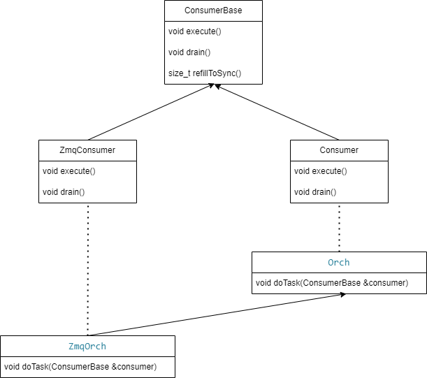

# Improve Orchagent Route performance with ZMQ

### Revision

| Rev |     Date    |       Author       | Change Description                |
|:---:|:-----------:|:------------------:|-----------------------------------|
| 1.1 | Mar  4 2024 |   Hua Liu          | Improve Orchagent with ZMQ        |

## Table of Contents

- [Goal \& Scope](#goal--scope)
- [Definitions \& Abbreviations](#definitions--abbreviations)
- [High-Level Proposal](#high-level-proposal)
- [Low-Level Implementation](#low-level-implementation)
  - [Fpmsyncd](#fpmsyncd)
  - [Orchagent](#orchagent)
- [WarmRestart scenario](#warmrestart-scenario)
- [Debugability](#debugability)
- [Error recovery](#error-recovery)
- [References](#references)
  * [BGP Loading Optimization for SONiC](#bgp-loading-optimization-for-sonic)
  * [ZMQ producer/consumer state table design](#zmq-producer/consumer-state-table-design)
  * [ZMQ](#zmq)

## Goal & Scope

The goal of this project is improve route operation performance between fpmsyncd and orchagent.
Based on alibaba's team analyze result: "BGP Loading Optimization for SONiC", the route operation performance between fpmsyncd and orchagent can be improved by switch to ZMQ producer/consumer table.

<!-- <style>
table{
  margin:auto;
}
</style> -->
| Module                   |  Original Speed(routes/s)    | Optimized Speed (routes/s) |
| ------------------------ | -----------------------------| -----------------------------|
| Zebra / Fpmsyncd         |  <center>17K                 | <center>25.4K                 |
| Orchagent                |  <center>10.5K               | <center>30.7K                 |

## Definitions & Abbreviations

| Definitions/Abbreviation | Description                             |
| ------------------------ | --------------------------------------- |
| BGP                      | Border Gateway Protocol                 |
| FPM                      | Forwarding Plane Manager                |
| ZMQ                      | ZeroMQ                                  |


## High-Level Proposal

Orchagent subscribe data with redis based ConsumerStateTable, sonic-swss-common has ZMQ based ZmqProducerStateTable/ZmqConsumerStateTable, here are compare with redis based tables:


Orchagent already integrated with ZMQ:
1. ZmqConsumer inherited from ConsumerBase.
2. ZmqConsumer support warm-reboot.
3. All ZmqConsumer share same ZMQ connection.


Pros:
1. 200+ times faster than redis based table, ZMQ table can transfer 100K route entry per-second, redis table can only transfer 3.7K route entry per-second.
2. Fully compatible with ProducerStateTable/ConsumerStateTable.
3. Asynchronous update redis DB with background thread.

Cons:
1. Performance depends on network bandwidth.
2. Server side need start before client side. If server side crash, client side need handle retry failed.

## Low-Level Implementation

### Fpmsyncd

Change from ProducerStateTable to ZmqProducerStateTable:

```c++

class RouteSync : public NetMsg
{
...
private:
    /* regular route table */
    unique_ptr<ProducerStateTable> m_routeTable;
    /* label route table */
    unique_ptr<ProducerStateTable> m_label_routeTable;
...

RouteSync::RouteSync(RedisPipeline *pipeline, ZmqClient *zmqClient) :
    m_vnet_routeTable(pipeline, APP_VNET_RT_TABLE_NAME, true),
    m_vnet_tunnelTable(pipeline, APP_VNET_RT_TUNNEL_TABLE_NAME, true),
    m_nl_sock(NULL), m_link_cache(NULL)
{
    if (zmqClient != nullptr) {
        m_routeTable = unique_ptr<ProducerStateTable>(new ZmqProducerStateTable(pipeline, APP_ROUTE_TABLE_NAME, *zmqClient, true));
        m_label_routeTable = unique_ptr<ProducerStateTable>(new ZmqProducerStateTable(pipeline, APP_LABEL_ROUTE_TABLE_NAME, *zmqClient, true));
    }
    else {
        m_routeTable = make_unique<ProducerStateTable>(pipeline, APP_ROUTE_TABLE_NAME, true);
        m_label_routeTable = make_unique<ProducerStateTable>(pipeline, APP_LABEL_ROUTE_TABLE_NAME, true);
    }
    
...
}
```

### Orchagent

Change RouteOrch inherit from ZmqOrch:

```c++
class RouteOrch : public ZmqOrch, public Subject
{
public:
    RouteOrch(DBConnector *db, vector<table_name_with_pri_t> &tableNames, SwitchOrch *switchOrch, NeighOrch *neighOrch, IntfsOrch *intfsOrch, VRFOrch *vrfOrch, FgNhgOrch *fgNhgOrch, Srv6Orch *srv6Orch, swss::ZmqServer *zmqServer = nullptr);

...
```

- ZmqOrch class inherit from Orch class.
- When zmqServer is not nullptr, ZmqOrch will create consumer with ZmqConsumerStateTable
- ZmqConsumerStateTable will create background thread for async APPL_DB update

ZmqOrch and ZmqConsumer provide ZMQ support:
```c++
class ZmqOrch : public Orch
{
public:
    ZmqOrch(swss::DBConnector *db, const std::vector<std::string> &tableNames, swss::ZmqServer *zmqServer);
    ZmqOrch(swss::DBConnector *db, const std::vector<table_name_with_pri_t> &tableNames_with_pri, swss::ZmqServer *zmqServer);

    virtual void doTask(ConsumerBase &consumer) { };
    void doTask(Consumer &consumer) override;

private:
    void addConsumer(swss::DBConnector *db, std::string tableName, int pri, swss::ZmqServer *zmqServer);
};

class ZmqConsumer : public ConsumerBase {
public:
    ZmqConsumer(swss::ZmqConsumerStateTable *select, Orch *orch, const std::string &name)
        : ConsumerBase(select, orch, name)
    {
    }

    swss::TableBase *getConsumerTable() const override
    {
        // ZmqConsumerStateTable is a subclass of TableBase
        return static_cast<swss::ZmqConsumerStateTable *>(getSelectable());
    }

    void execute() override;
    void drain() override;
};
```

## WarmRestart scenario
Orchagent support warm-reboot by ConsumerBase::refillToSync() method. ZmqConsumer inherit from ConsumerBase, so switch to ZmqOrch and ZmqConsumer will support warm-reboot.

## Debuggability
ZMQ can be debug with TCP dump:
https://github.com/whitequark/zmtp-wireshark

## References
 - BGP Loading Optimization for SONiC: https://github.com/a114j0y/SONiC/blob/eruan-new/doc/bgp_loading_optimization/bgp-loading-optimization-hld.md
 - ZMQ producer/consumer state table design: https://github.com/sonic-net/SONiC/blob/master/doc/sonic-swss-common/ZMQ%20producer-consumer%20state%20table%20design.md
 - ZMQ: https://zguide.zeromq.org/docs/
