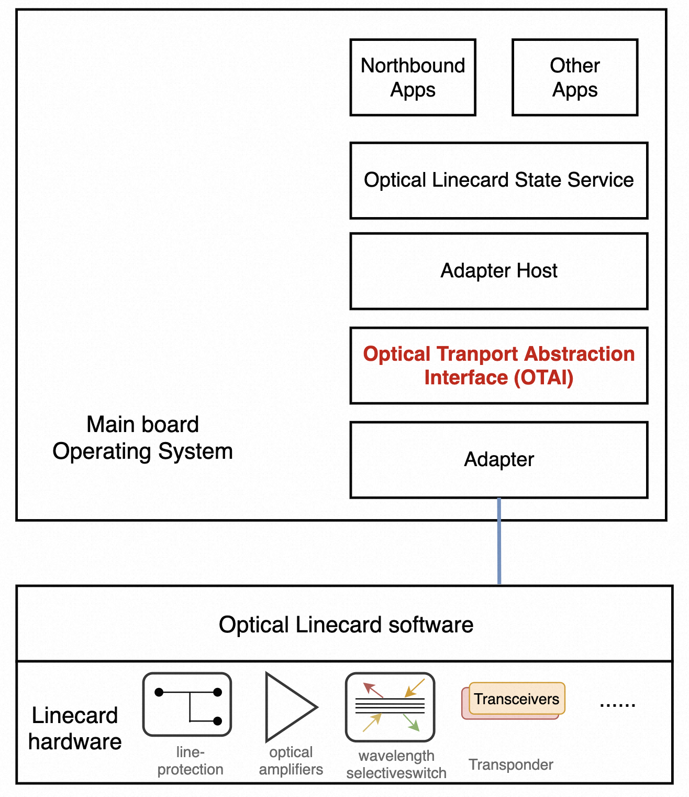
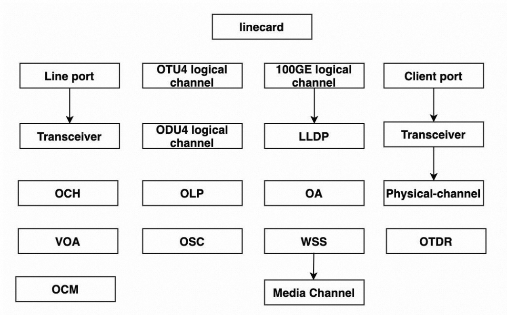

# Optical Transport Abstraction Interface (OTAI) V0.0.1

## Authors
Alibaba : Weitang Zheng, Xiaodong Gui   
Microsoft:  
Molex:  
Accelink:  
Infinera:  

## List of Changes
| Version | Changes | Name | Date |
| :-----| :---- | :----- | :----- |
| V0.0.1 | Initial Draft | Weitang Zheng | 2023-7-11 |

## License
All of the user-space code in OTAI is licensed under the Apache License, Version 2.0 (the “License”). You may obtain a copy of this license at (http://www.apache.org/licenses/LICENSE-2.0)

## Introduction  
To grow networks at scale to meet unprecedented network traffic demand, optical transport networks (OTNs) are shifting from closed and proprietary systems to open and disaggregated systems, especially for hyperscale data center operators. In open and disaggregated optical networks, modular hardware equipment with standardized interfaces and data models are used, which not only gives network operators more freedom to choose equipment from different vendors according to their own business need, but also helps accelerate their network optimization and automation. 
   
However, in today’s open and disaggregated optical networks, network equipment is still gray boxes, using proprietary Network Operating Systems (NOS) and hardware modules from equipment vendors. Any bug fix and feature upgrade have to be done by equipment vendors, which slows down technical iteration speed and may not be suitable for today’s network requirements. To solve this problem, we started a white box OTN equipment project and extended SONiC to OTN as an open source NOS for white box OTN equipment. We have launched a new workstream in SONiC community, [SONiC-OTN](https://lists.sonicfoundation.dev/g/sonic-wg-otn) workgroup, to drive the innovation. The initial goal of the workgroup is to extend SONiC to OTN equipment, including transponders/muxponders, optical amplifiers (OAs), optical line protection (OLP), wavelength selective switch (WSS), etc. Optical transport abstraction interfaces (OTAI) are introduced to create a unified and vendor neutral abstraction layer for different optical components.   
  
Benefitted from SONiC’s disaggregated containerized architecture and rapidly growing ecosystem of hardware and software partners, we foresee the OTAI will accelerate optical hardware innovation, and SONiC-OTN modular design with containers will accelerate software evolution. Many cloud operators, hardware vendors and optic module supplies will benefit from SONiC-OTN work.  

This specification defines an abstraction interface for optical transport linecards with different optical components. The interface is designed to provide a vendor independent way of controlling optical transport components like optical amplifiers, transceivers, automatic protection switches, wavelength selective switch, etc. in a uniform manner. This specification also allows exposing vendor specific functionalities and extensions to existing features.

## Intended audience  
This document is intended primarily for the programmers who plan to use OTAI API or develop OTAI extensions.

## High-Level design notes  
A typical optical transport equipment contains one or two main units and several optical linecards. There are different kinds of optical transport linecards in optical networks, and different venders have their private ways to control their optical modules on the linecard hardware. there are different optical components (OP, WSS, OLP, OTDR) and logical components (OCH, OTN, Logical channels, interfaces, LLDP, etc) on different optical linecards. In a disaggregated optical transport whitebox, the challenge is how to abstract these optical linecards into a unified and standard model. OTAI defines the vendor independent APIs to control and monitoring all kinds of optical linecards in a uniform manner.  

OTAI is based upon the Switch Abstraction Interface or [SAI](https://github.com/opencomputeproject/SAI), which includes C Application Programming Interfaces (APIs) and C headers for different optical modules. 
  
Adapter is a shared software library, supplied by an optical linecard vendor, that implements OTAI Specification. It sets up a vendor-specific communication channel with the software that runs upon a linecard.  Adapters are expected to be as simple as possible, ideally simple wrappers around vendor’s SDKs. Our design strives to push the bookkeeping complexity from adapter into the adapter host wherever possible.
  
The adapter module is loaded into a hosting process (“adapter host”) and then initialized. During
initialization the adapter initiates discovery process of the specified instance of a optical linecard entity. The optical linecard entity is a top-level object in OTAI.
  
Adapter host is a component that loads Adapter and exposes its functionalities to the Optical Transport State Service (OTSS) module. There would be multiple Adapter Hosts running at the same time, each optical linecard has one Adapter host. Each Adapter Host is responsible for managing a portion of functions within the optical linecard. For example, there is a OLP linecard on slot 1, the adapter host for slot 1 is responsible for manage the OLP linecard.
  
OTSS is a collection of software that provides a database interface for communication between northbound interface and optical linecard. 

Key assumptions, design decisions and API semantic clarifications:
- CRUD (Create/Read/Update/Delete) based API to manage the OTAI objects.
- Adapter is not the source of the critical persisted state. It can crash or be shut down and the above stack will be able to recover from such an event.

## API description  
Proposed interface is a local interface between the Adapter Host and Adapter. Optical linecard functionality is exposed to the rest of the system by the Adapter Host through other mechanisms, which are not part of this specification.  

The API is designed to be platform-agnostic(*nix/Windows/etc...). The API is a collection of C-style interfaces exposed from the adapter. The OTAI objects include a group of optical components and logical objects, which are compatible with [OpenConfig](https://www.openconfig.net/).  

The OTAI objects includes:
| Object | Description | File Name |
| :------| :---------- | :-------- |
| [Linecard](#optical-transport-linecard-functionality-otailinecardh) | Optical Transport Linecard | [otailinecard.h](https://github.com/sonic-otn/OTAI/blob/main/inc/otailinecard.h) |
| [Transceiver](#transceiver-functionality-otaitransceiverh) | Optical Transceiver | [otaitransceiver.h](https://github.com/sonic-otn/OTAI/blob/main/inc/otaitransceiver.h) |
| [Port](#optical-transport-port-functionality-otaiporth) | Optical transport port | [otaiport.h](https://github.com/sonic-otn/OTAI/blob/main/inc/otaiport.h) |
| [Physical Channel](#physical-channel-functionality-otaiphysicalchannelh) | Physical Channel | [otaiphysicalchannel.h](https://github.com/sonic-otn/OTAI/blob/main/inc/otaiphysicalchannel.h) |
| [Logical Channel](#optical-logical-channel-otailogicalchannelh) | Optical Logical Channel | [otailogicalchannel.h](https://github.com/sonic-otn/OTAI/blob/main/inc/otailogicalchannel.h) |
| [Ethernet](#ethernet-functionality-otaietherneth) | Ethernet | [otaiethernet.h](https://github.com/sonic-otn/OTAI/blob/main/inc/otaiethernet.h) |
| [Assignment](#opctial-assignment-functionality-otaiassignmenth) | Opctial Assignment | [otaiassignment.h](https://github.com/sonic-otn/OTAI/blob/main/inc/otaiassignment.h) |
| [OTN](#otn-protocol-functionality-otaiotnh) | OTN protocol | [otaiotn.h](https://github.com/sonic-otn/OTAI/blob/main/inc/otaiotn.h) |
| [OCH](#optical-channel-functionality-otaiochh) | Optical Channel | [otaioch.h](https://github.com/sonic-otn/OTAI/blob/main/inc/otaioch.h) |
| [OA](#optical-amplifier-functionality-otaioah) | Optical Amplifier | [otaioa.h](https://github.com/sonic-otn/OTAI/blob/main/inc/otaioa.h) |
| [WSS](#wavelength-selective-switch-functionality-otaiwssh) | Wavelength Selective Switch | [otaiwss.h](https://github.com/sonic-otn/OTAI/blob/main/inc/otaiwss.h) |
| [OMC](#optical-media-channel-functionality-otaimediachannelh) | Optical Media Channel | [otaimediachannel.h](https://github.com/sonic-otn/OTAI/blob/main/inc/otaimediachannel.h) |
| [OSC](#optical-supervisory-channel-functionality-otaiosch) | Optical Supervisory Channel | [otaiosc.h](https://github.com/sonic-otn/OTAI/blob/main/inc/otaiosc.h) |
| [Interface](#interface-functionality-otaiinterfaceh) | Interface | [otaiinterface.h](https://github.com/sonic-otn/OTAI/blob/main/inc/otaiinterface.h) |
| [LLDP](#link-layer-discovery-protocol-functionality-otailldph) | Link Layer Discovery Protocol | [otailldp.h](https://github.com/sonic-otn/OTAI/blob/main/inc/otailldp.h) |
| [OTDR](#optical-time-domain-reflectometer-functionality-otaiotdrh) | Optical Time Domain Reflectometer | [otaiotdr.h](https://github.com/sonic-otn/OTAI/blob/main/inc/otaiotdr.h) |
| [OCM](#optical-channel-monitor-functionality-otaiocmh) | Optical Channel Monitor | [otaiocm.h](https://github.com/sonic-otn/OTAI/blob/main/inc/otaiocm.h) |
| [VOA](#optical-attenuator-functionality-otaiattenuatorh) | Optical Attenuator | [otaiattenuator.h](https://github.com/sonic-otn/OTAI/blob/main/inc/otaiattenuator.h) |
| [APS](#automatic-protection-switch-functionality-otaiapsh) | Automatic Protection Switch | [otaiaps.h](https://github.com/sonic-otn/OTAI/blob/main/inc/otaiaps.h) |
| [APS Port](#automatic-protection-switch-port-functionality-otaiapsporth) | Automatic Protection Switch Port | [otaiapsport.h](https://github.com/sonic-otn/OTAI/blob/main/inc/otaiapsport.h) |

Here are OTAI objects and hierarchy, the top-level object is the optical linecard object, which could be a real hardware on multi linecard device, or a logical system on a pizza box. The linecard may contains a set of optical components and logical objects. For instance, an optical transponder and muxponder linecard includes Ports(client and line port), transceivers, and logical objects (logical channels, physical channels, ethernet, OTN, OCH, LLDP, etc). An optical linecard in the line system, it may includes OA, OSC, APS, Attenuators, WSS, Media Channel, OCM, OTDR, Ports, etc.  

Each OTAI objects owns a unique object ID (OID) which is assigned by OTAI library. Each OTAI object has a set of attributes and statistics which are compatible with OpenConfig definitions, and a set of CRUD (Create/Read/Update/Delete) APIs. With these standard OTAI APIs and unique OID, the adapter host can manage all kinds of optical transport components from different vendors.

## Adapter startup/shutdown sequence  
Adapter Host has to load the information about OTAI adapter module during startup. After adapter module load, adapter host acquire three well-known functions addresses: otai_api_initialize(), otai_api_query() and otai_api_uninitialize().  

After the otai_api_initialize() is called, the function is supplied with method table of services provided by the adapter host to adapter module. These services allow the adapter to initialize any data, control structures that may be necessary during subsequent OTAI operations. Note: SDK initialization should NOT be performed here. This function is just take care of any platform-specific difference related to module loading, and generally should be very simple.  

After initialization, otai_api_query()can be used for retrieval of various methods tables for OTAI functionalities. Once all the functionalities being retrieved, adapter host has all OTAI objects CRUD APIs.
For example, the first method that Adapter hosts is `otai_create_linecard_fn` which create the top otai object and return the linecard object ID to the Adapter host. Then Adapter host can create all the other sub-components (Ports, OAs, OLP, VOA, etc) in this linecard with the same linecard object ID. 
Once the linecard and its sub-components are created, Adapter host be able to retrieve all the statistic and status with the API `otai_get_**_attribute_fn` and `otai_get_**_stats_fn`, set these optical components' attributes with the API `otai_set_**_attribute_fn`.  

## Data Types (otaitypes.h)  
OTAI defines a group of basic data types for different kinds attributes data type.
|  |  | 
| :-----| :----  |
| otai_uint64_t  | otai_int64_t | 
| otai_uint32_t  | otai_int32_t | 
| otai_uint16_t  | otai_int16_t | 
| otai_uint8_t   | otai_int8_t  | 
| otai_double_t  | otai_float_t  | 
| otai_size_t    | otai_object_id_t  | 
| otai_pointer_t |   | 

OTAI also defines some OTN specific structure and enumeration types.
|  |  | 
| :-----| :----  |
| otai_spectrum_power_t  | the spectrum power for a optical channel, it includes the lower frequency, upper frequency and optical power | 
| otai_oper_status_t  | defines the operational status of a module or a port | 
| otai_admin_status_t  | defines the administrative status of a module or a port |
| otai_port_type_t  | defines different kinds of port types. an optical module's port is unidirectional, it includes the input port and output port.  |
| otai_otdr_event_type_t  | defines different kinds of OTDR event types.  |
| otai_otdr_event_t  | defines the OTDR event information which includes event distance, loss, refection, etc.  |
| otai_otdr_scanning_profile_t  | defines the OTDR scanning profile information which includes scan time, distance range, pulse width, average time, output frequency etc.  |
| otai_alarm_type_t  | defines all the alarms create by an optical component or modules. |
| otai_alarm_status_t  | defines the alarm status, including active, inactive, transient |
| otai_alarm_severity_t  | defines the alarm severity, including minor, warning, major, critical, cleared, not_report, not_alarmed |

## Status Types (otaistatus.h)  
List of status codes returned from the OTAI methods. In case the CRUD APIs call fails due to errors, such as invalid attribute, unsupported attributes, otaistatus.h allows the return code to convey the error. 

## Optical Transport Linecard functionality (otailinecard.h)  
Linecard is the top module in OTAI. It defines a group of attributes and some statistics. In these attributes, it includes the inventory information (PN, SN, Versions, etc), temperature threshold, LED state, software upgrading attributes, and notification callback functions: 
* OTAI_LINECARD_ATTR_LINECARD_ALARM_NOTIFY, it will notify the adapter host there was an alarm created or cleared
* OTAI_LINECARD_ATTR_LINECARD_OCM_SPECTRUM_POWER_NOTIFY, it will notify the adapter host that the OCM scanning is done
* OTAI_LINECARD_ATTR_LINECARD_OTDR_RESULT_NOTIFY, it will notify the adapter host that the OTDR scanning is done
* OTAI_LINECARD_ATTR_LINECARD_STATE_CHANGE_NOTIFY, it will notify the adapter host that the linecard state is changed, for example, the linecard start initialization, state is ready, start to reboot.

Once a linecard is created, the adapter returns this linecard's OID. Adapter host can get linecard attributes and statistics  and create the other submodules in the linecard with this OID. You can find the input attribute `linecard_id` from the other submodules' create APIs. 

The R/W column indicates an attribute is READABLE, WRITABLE and CREATE_ONLY. If an attribute is CREATE_ONLY, it can assign value in the create API. Adapter host can set an attribute if it is WRITABLE. 

There are two types for a statistic, gauge and counter. If an statistic PM type is gauge, the adapter host can use this annotation to distinguish different type of statistic, and apply different PM accumulation rules.

|Object|Attribute|Type|R/W|Precision|Unit|PM-Type|
|:----|:----|:----|:----|:----|:----|:----|
|linecard|OTAI_LINECARD_ATTR_LINECARD_TYPE|char|RW| | | |
| |OTAI_LINECARD_ATTR_ADMIN_STATE|otai_admin_state_t|RW| | | |
| |OTAI_LINECARD_ATTR_BOARD_MODE|char|RW| | | |
| |OTAI_LINECARD_ATTR_OPER_STATUS|otai_oper_status_t|R| | | |
| |OTAI_LINECARD_ATTR_RELAY|bool|RW| | | |
| |OTAI_LINECARD_ATTR_EMPTY|bool|R| | | |
| |OTAI_LINECARD_ATTR_REMOVABLE|bool|R| | | |
| |OTAI_LINECARD_ATTR_RESET|otai_linecard_reset_t|W| | | |
| |OTAI_LINECARD_ATTR_POWER_ADMIN_STATE|otai_linecard_power_admin_state_t|RW| | | |
| |OTAI_LINECARD_ATTR_HOSTNAME|char|RW| | | |
| |OTAI_LINECARD_ATTR_SERIAL_NO|char|R| | | |
| |OTAI_LINECARD_ATTR_PART_NO|char|R| | | |
| |OTAI_LINECARD_ATTR_HARDWARE_VERSION|char|R| | | |
| |OTAI_LINECARD_ATTR_SOFTWARE_VERSION|char|R| | | |
| |OTAI_LINECARD_ATTR_CPLD_VERSION|char|R| | | |
| |OTAI_LINECARD_ATTR_SCRIPT_VERSION|char|R| | | |
| |OTAI_LINECARD_ATTR_MFG_DATE|char|R| | | |
| |OTAI_LINECARD_ATTR_MFG_NAME|char|R| | | |
| |OTAI_LINECARD_ATTR_INIT_LINECARD|bool|CREATE_ONLY| | | |
| |OTAI_LINECARD_ATTR_LINECARD_ALARM_NOTIFY|otai_pointer_t otai_linecard_alarm_notification_fn|CREATE_ONLY| | | |
| |OTAI_LINECARD_ATTR_LINECARD_OCM_SPECTRUM_POWER_NOTIFY|otai_pointer_t otai_linecard_ocm_spectrum_power_notification_fn|CREATE_ONLY| | | |
| |OTAI_LINECARD_ATTR_LINECARD_OTDR_RESULT_NOTIFY|otai_pointer_t otai_linecard_otdr_result_notification_fn|CREATE_ONLY| | | |
| |OTAI_LINECARD_ATTR_COLLECT_LINECARD_ALARM|bool|W| | | |
| |OTAI_LINECARD_ATTR_COLLECT_LINECARD_LOG|bool|W| | | |
| |OTAI_LINECARD_ATTR_LINECARD_STATE_CHANGE_NOTIFY|otai_pointer_t otai_linecard_state_change_notification_fn|CREATE_ONLY| | | |
| |OTAI_LINECARD_ATTR_LED_MODE|otai_led_mode_t|RW| | | |
| |OTAI_LINECARD_ATTR_LED_FLASH_INTERVAL|otai_uint16_t|RW| | | |
| |OTAI_LINECARD_ATTR_LED_COLOR|otai_led_color_t|R| | | |
| |OTAI_LINECARD_ATTR_BAUD_RATE|otai_linecard_baud_rate_t|RW| | | |
| |OTAI_LINECARD_ATTR_HOST_IP|otai_uint32_t|W| | | |
| |OTAI_LINECARD_ATTR_USER_NAME|char|W| | | |
| |OTAI_LINECARD_ATTR_USER_PASSWORD|char|W| | | |
| |OTAI_LINECARD_ATTR_UPGRADE_FILE_NAME|char|W| | | |
| |OTAI_LINECARD_ATTR_UPGRADE_FILE_PATH|char|W| | | |
| |OTAI_LINECARD_ATTR_UPGRADE_DOWNLOAD|bool|W| | | |
| |OTAI_LINECARD_ATTR_UPGRADE_COMMIT|bool|W| | | |
| |OTAI_LINECARD_ATTR_UPGRADE_COMMIT_PAUSE|bool|W| | | |
| |OTAI_LINECARD_ATTR_UPGRADE_COMMIT_RESUME|bool|W| | | |
| |OTAI_LINECARD_ATTR_UPGRADE_ROLLBACK|bool|W| | | |
| |OTAI_LINECARD_ATTR_UPGRADE_REBOOT|bool|W| | | |
| |OTAI_LINECARD_ATTR_UPGRADE_AUTO|bool|W| | | |
| |OTAI_LINECARD_ATTR_UPGRADE_STATE|otai_linecard_upgrade_state_t|R| | | |
| |OTAI_LINECARD_ATTR_FPGA_VERSION|char|R| | | |
| |OTAI_LINECARD_ATTR_UCD_VERSION|char|R| | | |
| |OTAI_LINECARD_ATTR_TEMP_HIGH_ALARM_THRESHOLD|otai_double_t|RW| | | |
| |OTAI_LINECARD_ATTR_TEMP_HIGH_WARN_THRESHOLD|otai_double_t|RW| | | |
| |OTAI_LINECARD_ATTR_TEMP_LOW_ALARM_THRESHOLD|otai_double_t|RW| | | |
| |OTAI_LINECARD_ATTR_TEMP_LOW_WARN_THRESHOLD|otai_double_t|RW| | | |
| |OTAI_LINECARD_ATTR_SLOT_ID|otai_int32_t|R| | | |
| |OTAI_LINECARD_ATTR_EQUIPMENT_FAILURE|bool|R| | | |
| |OTAI_LINECARD_ATTR_EQUIPMENT_MISMATCH|bool|R| | | |
| |OTAI_LINECARD_ATTR_START_PRE_CONFIGURATION|bool|W| | | |
| |OTAI_LINECARD_ATTR_STOP_PRE_CONFIGURATION|bool|W| | | |
| |OTAI_LINECARD_ATTR_LED_NAME|char|RW| | | |
| |OTAI_LINECARD_STAT_MEMORY_AVAILABLE|otai_uint64_t|R| | |gauge|
| |OTAI_LINECARD_STAT_MEMORY_UTILIZED|otai_uint64_t|R| | |gauge|
| |OTAI_LINECARD_STAT_CPU_UTILIZATION|otai_uint32_t|R| | |gauge|
| |OTAI_LINECARD_STAT_TEMPERATURE|otai_double_t|R|precision2| |gauge|

## Wavelength Selective Switch functionality (otaiwss.h)  
Wavelength Selective Switch is a submodule in a linecard. OTAI defines the inventory information for a WSS module. The media channel in a WSS is defined in the [OMC](#optical-media-channel-functionality-otaimediachannelh).

|Object|Attribute|Type|R/W|Precision|Unit|PM-Type|
|:----|:----|:----|:----|:----|:----|:----|
|wss|OTAI_WSS_ATTR_ID|otai_uint32_t|CREATE_ONLY| | | |
| |OTAI_WSS_ATTR_SERIAL_NO|char|R| | | |
| |OTAI_WSS_ATTR_PART_NO|char|R| | | |
| |OTAI_WSS_ATTR_MFG_NAME|char|R| | | |
| |OTAI_WSS_ATTR_MFG_DATE|char|R| | | |
| |OTAI_WSS_ATTR_HARDWARE_VERSION|char|R| | | |
| |OTAI_WSS_ATTR_OPER_STATUS|otai_oper_status_t|R| | | |
| |OTAI_WSS_ATTR_EMPTY|bool|R| | | |
| |OTAI_WSS_ATTR_REMOVABLE|bool|R| | | |
| |OTAI_WSS_ATTR_SOFTWARE_VERSION|char|R| | | |

## Transceiver functionality (otaitransceiver.h)  
Transceiver is a submodule in a linecard. OTAI defines the inventory information, statistics, alarm thresholds, upgrading attributes, etc.

|Object|Attribute|Type|R/W|Precision|Unit|PM-Type|
|:----|:----|:----|:----|:----|:----|:----|
|transceiver|OTAI_TRANSCEIVER_ATTR_PORT_TYPE|otai_port_type_t|CREATE_ONLY| | | |
| |OTAI_TRANSCEIVER_ATTR_PORT_ID|otai_uint32_t|CREATE_ONLY| | | |
| |OTAI_TRANSCEIVER_ATTR_ENABLED|bool|RW| | | |
| |OTAI_TRANSCEIVER_ATTR_OPER_STATUS|otai_oper_status_t|R| | | |
| |OTAI_TRANSCEIVER_ATTR_FEC_MODE|otai_transceiver_fec_mode_t|RW| | | |
| |OTAI_TRANSCEIVER_ATTR_PRESENT|otai_transceiver_present_t|R| | | |
| |OTAI_TRANSCEIVER_ATTR_FORM_FACTOR|otai_transceiver_form_factor_t|R| | | |
| |OTAI_TRANSCEIVER_ATTR_VENDOR_EXPECT|char|RW| | | |
| |OTAI_TRANSCEIVER_ATTR_VENDOR|char|R| | | |
| |OTAI_TRANSCEIVER_ATTR_VENDOR_PART|char|R| | | |
| |OTAI_TRANSCEIVER_ATTR_PART_NO|char|R| | | |
| |OTAI_TRANSCEIVER_ATTR_VENDOR_REV|char|R| | | |
| |OTAI_TRANSCEIVER_ATTR_DATE_CODE|char|R| | | |
| |OTAI_TRANSCEIVER_ATTR_MFG_NAME|char|R| | | |
| |OTAI_TRANSCEIVER_ATTR_MFG_DATE|char|R| | | |
| |OTAI_TRANSCEIVER_ATTR_HARDWARE_VERSION|char|R| | | |
| |OTAI_TRANSCEIVER_ATTR_FIRMWARE_VERSION|char|R| | | |
| |OTAI_TRANSCEIVER_ATTR_ETHERNET_PMD|otai_transceiver_ethernet_pmd_t|R| | | |
| |OTAI_TRANSCEIVER_ATTR_ETHERNET_PMD_PRECONF|otai_transceiver_ethernet_pmd_t|RW| | | |
| |OTAI_TRANSCEIVER_ATTR_FAULT_CONDITION|bool|R| | | |
| |OTAI_TRANSCEIVER_ATTR_REMOVABLE|bool|R| | | |
| |OTAI_TRANSCEIVER_ATTR_CONNECTOR_TYPE|otai_transceiver_connector_type_t|R| | | |
| |OTAI_TRANSCEIVER_ATTR_SERIAL_NO|char|R| | | |
| |OTAI_TRANSCEIVER_ATTR_POWER_MODE|otai_transceiver_power_mode_t|RW| | | |
| |OTAI_TRANSCEIVER_ATTR_RESET|bool|W| | | |
| |OTAI_TRANSCEIVER_ATTR_NUM_OF_LANE|otai_uint32_t|R| | | |
| |OTAI_TRANSCEIVER_ATTR_UPGRADE_DOWNLOAD|bool|W| | | |
| |OTAI_TRANSCEIVER_ATTR_SWITCH_FLASH_PARTITION|otai_transceiver_flash_partition_t|W| | | |
| |OTAI_TRANSCEIVER_ATTR_BACKUP_FLASH_PARTITION|otai_transceiver_flash_partition_t|W| | | |
| |OTAI_TRANSCEIVER_ATTR_UPGRADE_STATE|otai_transceiver_upgrade_state_t|R| | | |
| |OTAI_TRANSCEIVER_ATTR_LASER_AGE|otai_int32_t|R| | | |
| |OTAI_TRANSCEIVER_ATTR_OPERATE_TIME|otai_int32_t|R| | | |
| |OTAI_TRANSCEIVER_ATTR_LOT_CODE|char|R| | | |
| |OTAI_TRANSCEIVER_ATTR_CLEI_CODE|char|R| | | |
| |OTAI_TRANSCEIVER_ATTR_POWER_CLASS|otai_transceiver_power_class_t|R| | | |
| |OTAI_TRANSCEIVER_ATTR_NEWWORK_BIT_RATE|otai_double_t|R| | | |
| |OTAI_TRANSCEIVER_ATTR_HOST_BIT_RATE|otai_double_t|R| | | |
| |OTAI_TRANSCEIVER_ATTR_SM_FIBER_LEN|otai_double_t|R| | | |
| |OTAI_TRANSCEIVER_ATTR_MM_FIBER_LEN|otai_double_t|R| | | |
| |OTAI_TRANSCEIVER_ATTR_COPPER_CABLE_LEN|otai_double_t|R| | | |
| |OTAI_TRANSCEIVER_ATTR_MAX_WAVELENGTH|otai_double_t|R| | | |
| |OTAI_TRANSCEIVER_ATTR_MIN_WAVELENGTH|otai_double_t|R| | | |
| |OTAI_TRANSCEIVER_ATTR_MAX_TX_POWER|otai_double_t|R| | | |
| |OTAI_TRANSCEIVER_ATTR_MAX_RX_POWER|otai_double_t|R| | | |
| |OTAI_TRANSCEIVER_ATTR_MAX_OPER_TEMP|otai_double_t|R| | | |
| |OTAI_TRANSCEIVER_ATTR_MIN_OPER_TEMP|otai_double_t|R| | | |
| |OTAI_TRANSCEIVER_ATTR_VCC_HIGH_ALARM_THRESHOLD|otai_double_t|R| | | |
| |OTAI_TRANSCEIVER_ATTR_VCC_HIGH_WARN_THRESHOLD|otai_double_t|R| | | |
| |OTAI_TRANSCEIVER_ATTR_VCC_LOW_ALARM_THRESHOLD|otai_double_t|R| | | |
| |OTAI_TRANSCEIVER_ATTR_VCC_LOW_WARN_THRESHOLD|otai_double_t|R| | | |
| |OTAI_TRANSCEIVER_ATTR_RX_TOTAL_POWER_HIGH_ALARM_THRESHOLD|otai_double_t|R| | | |
| |OTAI_TRANSCEIVER_ATTR_RX_TOTAL_POWER_HIGH_WARN_THRESHOLD|otai_double_t|R| | | |
| |OTAI_TRANSCEIVER_ATTR_RX_TOTAL_POWER_LOW_ALARM_THRESHOLD|otai_double_t|R| | | |
| |OTAI_TRANSCEIVER_ATTR_RX_TOTAL_POWER_LOW_WARN_THRESHOLD|otai_double_t|R| | | |
| |OTAI_TRANSCEIVER_ATTR_OA_PUMP_CURRENT_HIGH_ALARM_THRESHOLD|otai_double_t|R| | | |
| |OTAI_TRANSCEIVER_ATTR_OA_PUMP_CURRENT_HIGH_WARN_THRESHOLD|otai_double_t|R| | | |
| |OTAI_TRANSCEIVER_ATTR_OA_PUMP_CURRENT_LOW_ALARM_THRESHOLD|otai_double_t|R| | | |
| |OTAI_TRANSCEIVER_ATTR_OA_PUMP_CURRENT_LOW_WARN_THRESHOLD|otai_double_t|R| | | |
| |OTAI_TRANSCEIVER_ATTR_TX_BAIS_HIGH_ALARM_THRESHOLD|otai_double_t|R| | | |
| |OTAI_TRANSCEIVER_ATTR_TX_BAIS_HIGH_WARN_THRESHOLD|otai_double_t|R| | | |
| |OTAI_TRANSCEIVER_ATTR_TX_BAIS_LOW_ALARM_THRESHOLD|otai_double_t|R| | | |
| |OTAI_TRANSCEIVER_ATTR_TX_BAIS_LOW_WARN_THRESHOLD|otai_double_t|R| | | |
| |OTAI_TRANSCEIVER_ATTR_EXTEND_MODULE_CODE|otai_transceiver_extend_module_code_t|R| | | |
| |OTAI_TRANSCEIVER_ATTR_DATA_STATUS|otai_transceiver_data_status_t|R| | | |
| |OTAI_TRANSCEIVER_ATTR_ENCODE|otai_transceiver_encode_t|R| | | |
| |OTAI_TRANSCEIVER_ATTR_BITRATE|otai_double_t|R| | | |
| |OTAI_TRANSCEIVER_ATTR_EXTEND_BIT_RATE|otai_double_t|R| | | |
| |OTAI_TRANSCEIVER_ATTR_WAVELENGTH|otai_double_t|R| | | |
| |OTAI_TRANSCEIVER_ATTR_WAVELENGTH_TOLERANCE|otai_double_t|R| | | |
| |OTAI_TRANSCEIVER_ATTR_OUI|char|R| | | |
| |OTAI_TRANSCEIVER_ATTR_RN|char|R| | | |
| |OTAI_TRANSCEIVER_ATTR_IDENTIFIER|char|R| | | |
| |OTAI_TRANSCEIVER_ATTR_CMIS_REVISION|char|R| | | |
| |OTAI_TRANSCEIVER_ATTR_TX_POWER_HIGH_ALARM_THRESHOLD|otai_double_t|R| | | |
| |OTAI_TRANSCEIVER_ATTR_TX_POWER_LOW_ALARM_THRESHOLD|otai_double_t|R| | | |
| |OTAI_TRANSCEIVER_ATTR_TX_POWER_HIGH_WARN_THRESHOLD|otai_double_t|R| | | |
| |OTAI_TRANSCEIVER_ATTR_TX_POWER_LOW_WARN_THRESHOLD|otai_double_t|R| | | |
| |OTAI_TRANSCEIVER_ATTR_FREQUENCY_RANGE|char|RW| | | |
| |OTAI_TRANSCEIVER_ATTR_TEMP_HIGH_ALARM_THRESHOLD|otai_double_t|RW| | | |
| |OTAI_TRANSCEIVER_ATTR_TEMP_HIGH_WARN_THRESHOLD|otai_double_t|RW| | | |
| |OTAI_TRANSCEIVER_ATTR_TEMP_LOW_ALARM_THRESHOLD|otai_double_t|RW| | | |
| |OTAI_TRANSCEIVER_ATTR_TEMP_LOW_WARN_THRESHOLD|otai_double_t|RW| | | |
| |OTAI_TRANSCEIVER_STAT_FEC_UNCORRECTABLE_WORDS|otai_uint64_t|R| | |counter|
| |OTAI_TRANSCEIVER_STAT_INPUT_POWER|otai_double_t|R|precision2|dBm|gauge|
| |OTAI_TRANSCEIVER_STAT_OUTPUT_POWER|otai_double_t|R|precision2|dBm|gauge|
| |OTAI_TRANSCEIVER_STAT_LASER_BIAS_CURRENT|otai_double_t|R|precision2| |gauge|
| |OTAI_TRANSCEIVER_STAT_TEMPERATURE|otai_double_t|R|precision1| |gauge|
| |OTAI_TRANSCEIVER_STAT_PRE_FEC_BER|otai_double_t|R|precision18| |gauge|
| |OTAI_TRANSCEIVER_STAT_POST_FEC_BER|otai_double_t|R|precision18| |gauge|
| |OTAI_TRANSCEIVER_STAT_EDFA_BIAS_CURRENT|otai_double_t|R|precision2| |gauge|
| |OTAI_TRANSCEIVER_STAT_LASER_BIAS_VOLTAGE|otai_double_t|R|precision2| |gauge|
| |OTAI_TRANSCEIVER_STAT_CASE_TEMPERATURE|otai_double_t|R|precision1| |gauge|
| |OTAI_TRANSCEIVER_STAT_POWER_CONSUMPTION|otai_double_t|R|precision2| |gauge|
| |OTAI_TRANSCEIVER_STAT_TX_MOD_BIAS_XI|otai_double_t|R|precision2| |gauge|
| |OTAI_TRANSCEIVER_STAT_TX_MOD_BIAS_XQ|otai_double_t|R|precision2| |gauge|
| |OTAI_TRANSCEIVER_STAT_TX_MOD_BIAS_YI|otai_double_t|R|precision2| |gauge|
| |OTAI_TRANSCEIVER_STAT_TX_MOD_BIAS_YQ|otai_double_t|R|precision2| |gauge|
| |OTAI_TRANSCEIVER_STAT_TX_MOD_BIAS_XPH|otai_double_t|R|precision2| |gauge|
| |OTAI_TRANSCEIVER_STAT_TX_MOD_BIAS_YPH|otai_double_t|R|precision2| |gauge|
| |OTAI_TRANSCEIVER_STAT_LOSS_TIME|otai_uint64_t|R| | |counter|

## Optical transport port functionality (otaiport.h)  
Optical transport port is a submodule in a linecard, it could be an port on the front panel (Client port, line port) or an internel port (EDFA_IN, OLP_COMMON_IN, etc). OTAI defines the inventory information, statistics, alarm thresholds etc.

|Object|Attribute|Type|R/W|Precision|Unit|PM-Type|
|:----|:----|:----|:----|:----|:----|:----|
|port|OTAI_PORT_ATTR_PORT_TYPE|otai_port_type_t|CREATE_ONLY| | | |
| |OTAI_PORT_ATTR_PORT_ID|otai_uint32_t|CREATE_ONLY| | | |
| |OTAI_PORT_ATTR_OPER_STATUS|otai_oper_status_t|R| | | |
| |OTAI_PORT_ATTR_ADMIN_STATE|otai_admin_state_t|RW| | | |
| |OTAI_PORT_ATTR_RX_CD_RANGE|otai_s32_range_t|RW| | | |
| |OTAI_PORT_ATTR_ROLL_OFF|otai_uint32_t|RW| | | |
| |OTAI_PORT_ATTR_LED_MODE|otai_led_mode_t|RW| | | |
| |OTAI_PORT_ATTR_LED_FLASH_INTERVAL|otai_uint16_t|RW| | | |
| |OTAI_PORT_ATTR_LED_COLOR|otai_led_color_t|R| | | |
| |OTAI_PORT_ATTR_LOS_THRESHOLD|otai_double_t|RW| | | |
| |OTAI_PORT_ATTR_OPTICAL_PORT_TYPE|otai_port_optical_port_type_t|R| | | |
| |OTAI_PORT_ATTR_EMPTY|bool|R| | | |
| |OTAI_PORT_ATTR_REMOVABLE|bool|R| | | |
| |OTAI_PORT_ATTR_EQUIPMENT_FAILURE|bool|R| | | |
| |OTAI_PORT_ATTR_EQUIPMENT_MISMATCH|bool|R| | | |
| |OTAI_PORT_ATTR_LOW_THRESHOLD|otai_double_t|RW| | | |
| |OTAI_PORT_ATTR_HIGH_THRESHOLD|otai_double_t|RW| | | |
| |OTAI_PORT_ATTR_INPUT_OFFSET|otai_double_t|R| | | |
| |OTAI_PORT_ATTR_OUTPUT_OFFSET|otai_double_t|R| | | |
| |OTAI_PORT_ATTR_LED_NAME|char|RW| | | |
| |OTAI_PORT_STAT_INPUT_POWER|otai_double_t|R|precision2|dBm|gauge|
| |OTAI_PORT_STAT_OUTPUT_POWER|otai_double_t|R|precision2|dBm|gauge|
| |OTAI_PORT_STAT_OSC_INPUT_POWER|otai_double_t|R|precision2|dBm|gauge|
| |OTAI_PORT_STAT_OSC_OUTPUT_POWER|otai_double_t|R|precision2|dBm|gauge|

## Physical Channel functionality (otaiphysicalchannel.h) 
Physical channel is a physical lane or channel in the physical client port.  Each physical client port has 1 or more channels. An example is 100GBASE-LR4 client physical port having 4x25G channels. OTAI defines the tx-laser, output frequency, output power, inport power and laser bias-current.

|Object|Attribute|Type|R/W|Precision|Unit|PM-Type|
|:----|:----|:----|:----|:----|:----|:----|
|physicalchannel|OTAI_PHYSICALCHANNEL_ATTR_PORT_TYPE|otai_port_type_t|CREATE_ONLY| | | |
| |OTAI_PHYSICALCHANNEL_ATTR_PORT_ID|otai_uint32_t|CREATE_ONLY| | | |
| |OTAI_PHYSICALCHANNEL_ATTR_LANE_ID|otai_uint32_t|CREATE_ONLY| | | |
| |OTAI_PHYSICALCHANNEL_ATTR_TX_LASER|bool|R| | | |
| |OTAI_PHYSICALCHANNEL_ATTR_OUTPUT_FREQUENCY|otai_uint64_t|R| | | |
| |OTAI_PHYSICALCHANNEL_STAT_OUTPUT_POWER|otai_double_t|R|precision2|dBm|gauge|
| |OTAI_PHYSICALCHANNEL_STAT_INPUT_POWER|otai_double_t|R|precision2|dBm|gauge|
| |OTAI_PHYSICALCHANNEL_STAT_LASER_BIAS_CURRENT|otai_double_t|R|precision2| |gauge|

## OTN protocol functionality (otaiotn.h) 
OTN is the definition for data related to OTN protocol framing when logical channel framing is using OTU protocal. OTAI defines OTN's attributes and statictics.

|Object|Attribute|Type|R/W|Precision|Unit|PM-Type|
|:----|:----|:----|:----|:----|:----|:----|
|otn|OTAI_OTN_ATTR_CHANNEL_ID|otai_uint32_t|CREATE_ONLY| | | |
| |OTAI_OTN_ATTR_TTI_MSG_TRANSMIT|char|RW| | | |
| |OTAI_OTN_ATTR_TTI_MSG_EXPECTED|char|RW| | | |
| |OTAI_OTN_ATTR_TTI_MSG_RECV|char|R| | | |
| |OTAI_OTN_ATTR_RDI_MSG|char|R| | | |
| |OTAI_OTN_ATTR_TTI_MSG_AUTO|bool|RW| | | |
| |OTAI_OTN_ATTR_DELAY_MEASUREMENT_ENABLED|bool|RW| | | |
| |OTAI_OTN_ATTR_DELAY_MEASUREMENT_MODE|otai_otn_delay_measurement_mode_t|RW| | | |
| |OTAI_OTN_ATTR_MAINTENANCE|otai_otn_maintenance_t|RW| | | |
| |OTAI_OTN_STAT_ERRORED_SECONDS|otai_uint64_t|R| | |counter|
| |OTAI_OTN_STAT_SEVERELY_ERRORED_SECONDS|otai_uint64_t|R| | |counter|
| |OTAI_OTN_STAT_UNAVAILABLE_SECONDS|otai_uint64_t|R| | |counter|
| |OTAI_OTN_STAT_ERRORED_BLOCKS|otai_uint64_t|R| | |counter|
| |OTAI_OTN_STAT_FEC_UNCORRECTABLE_BLOCKS|otai_uint64_t|R| | |counter|
| |OTAI_OTN_STAT_FEC_CORRECTED_BYTES|otai_uint64_t|R| | |counter|
| |OTAI_OTN_STAT_FEC_CORRECTED_BITS|otai_uint64_t|R| | |counter|
| |OTAI_OTN_STAT_BACKGROUND_BLOCK_ERRORS|otai_uint64_t|R| | |counter|
| |OTAI_OTN_STAT_ESNR|otai_double_t|R|precision2|dB|gauge|
| |OTAI_OTN_STAT_PRE_FEC_BER|otai_double_t|R|precision18| |gauge|
| |OTAI_OTN_STAT_Q_VALUE|otai_double_t|R|precision2|dB|gauge|
| |OTAI_OTN_STAT_POST_FEC_BER|otai_double_t|R|precision18| |gauge|
| |OTAI_OTN_STAT_DELAY|otai_uint64_t|R| | |gauge|
| |OTAI_OTN_STAT_SM_BIP8|otai_uint64_t|R| | |counter|
| |OTAI_OTN_STAT_SM_BEI|otai_uint64_t|R| | |counter|
| |OTAI_OTN_STAT_Q_MARGIN|otai_double_t|R|precision2|dB|gauge|
| |OTAI_OTN_STAT_INPUT_FEC_CORRECTED_BITS|otai_uint64_t|R| | |counter|
| |OTAI_OTN_STAT_INPUT_FEC_UNCORRECTABLE_BLOCKS|otai_uint64_t|R| | |counter|
| |OTAI_OTN_STAT_INPUT_SM_BIP8|otai_uint64_t|R| | |counter|
| |OTAI_OTN_STAT_INPUT_SM_BEI|otai_uint64_t|R| | |counter|
| |OTAI_OTN_STAT_CODE_VIOLATIONS|otai_uint64_t|R| | |counter|

## Optical Time Domain Reflectometer functionality (otaiotdr.h)  
OTDR is a submodule in a linecard, OTAI defines the inventory information, scaning profile, threshold, etc.

|Object|Attribute|Type|R/W|Precision|Unit|PM-Type|
|:----|:----|:----|:----|:----|:----|:----|
|otdr|OTAI_OTDR_ATTR_ID|otai_uint32_t|CREATE_ONLY| | | |
| |OTAI_OTDR_ATTR_REFRACTIVE_INDEX|otai_double_t|RW| | | |
| |OTAI_OTDR_ATTR_BACKSCATTER_INDEX|otai_double_t|RW| | | |
| |OTAI_OTDR_ATTR_REFLECTION_THRESHOLD|otai_double_t|RW| | | |
| |OTAI_OTDR_ATTR_SPLICE_LOSS_THRESHOLD|otai_double_t|RW| | | |
| |OTAI_OTDR_ATTR_END_OF_FIBER_THRESHOLD|otai_double_t|RW| | | |
| |OTAI_OTDR_ATTR_DISTANCE_RANGE|otai_uint32_t|RW| | | |
| |OTAI_OTDR_ATTR_PULSE_WIDTH|otai_uint32_t|RW| | | |
| |OTAI_OTDR_ATTR_AVERAGE_TIME|otai_uint32_t|RW| | | |
| |OTAI_OTDR_ATTR_OUTPUT_FREQUENCY|otai_uint64_t|RW| | | |
| |OTAI_OTDR_ATTR_ENABLED|bool|RW| | | |
| |OTAI_OTDR_ATTR_SCAN|bool|W| | | |
| |OTAI_OTDR_ATTR_START_TIME|char|RW| | | |
| |OTAI_OTDR_ATTR_PERIOD|otai_uint32_t|RW| | | |
| |OTAI_OTDR_ATTR_DYNAMIC_RANGE|otai_uint32_t|R| | | |
| |OTAI_OTDR_ATTR_DISTANCE_ACCURACY|otai_double_t|R| | | |
| |OTAI_OTDR_ATTR_SAMPLING_RESOLUTION|otai_double_t|R| | | |
| |OTAI_OTDR_ATTR_LOSS_DEAD_ZONE|otai_double_t|R| | | |
| |OTAI_OTDR_ATTR_REFLECTION_DEAD_ZONE|otai_double_t|R| | | |
| |OTAI_OTDR_ATTR_SCANNING_STATUS|otai_scanning_status_t|R| | | |
| |OTAI_OTDR_ATTR_SERIAL_NO|char|R| | | |
| |OTAI_OTDR_ATTR_PART_NO|char|R| | | |
| |OTAI_OTDR_ATTR_MFG_NAME|char|R| | | |
| |OTAI_OTDR_ATTR_MFG_DATE|char|R| | | |
| |OTAI_OTDR_ATTR_HARDWARE_VERSION|char|R| | | |
| |OTAI_OTDR_ATTR_OPER_STATUS|otai_oper_status_t|R| | | |
| |OTAI_OTDR_ATTR_EMPTY|bool|R| | | |
| |OTAI_OTDR_ATTR_REMOVABLE|bool|R| | | |
| |OTAI_OTDR_ATTR_SOFTWARE_VERSION|char|R| | | |
| |OTAI_OTDR_ATTR_FIRMWARE_VERSION|char|R| | | |

## Optical Supervisory channel  functionality (otaiosc.h)  
OSC is a submodule in a linecard, OTAI defines the inventory information, alarm threshold, statistics etc.

|Object|Attribute|Type|R/W|Precision|Unit|PM-Type|
|:----|:----|:----|:----|:----|:----|:----|
|osc|OTAI_OSC_ATTR_ID|otai_uint32_t|CREATE_ONLY| | | |
| |OTAI_OSC_ATTR_REMOVABLE|bool|R| | | |
| |OTAI_OSC_ATTR_SERIAL_NO|char|R| | | |
| |OTAI_OSC_ATTR_EQUIPMENT_FAILURE|bool|R| | | |
| |OTAI_OSC_ATTR_EQUIPMENT_MISMATCH|bool|R| | | |
| |OTAI_OSC_ATTR_LOCATION|char|R| | | |
| |OTAI_OSC_ATTR_HARDWARE_VERSION|char|R| | | |
| |OTAI_OSC_ATTR_ADMIN_STATE|otai_admin_state_t|R| | | |
| |OTAI_OSC_ATTR_OPER_STATUS|otai_oper_status_t|R| | | |
| |OTAI_OSC_ATTR_PART_NO|char|R| | | |
| |OTAI_OSC_ATTR_MFG_NAME|char|R| | | |
| |OTAI_OSC_ATTR_MFG_DATE|char|R| | | |
| |OTAI_OSC_ATTR_EMPTY|bool|R| | | |
| |OTAI_OSC_ATTR_SOFTWARE_VERSION|char|R| | | |
| |OTAI_OSC_ATTR_FIRMWARE_VERSION|char|R| | | |
| |OTAI_OSC_ATTR_OUTPUT_FREQUENCY|otai_uint64_t|R| | | |
| |OTAI_OSC_ATTR_ENABLED|bool|RW| | | |
| |OTAI_OSC_ATTR_RX_LOW_THRESHOLD|otai_double_t|RW| | | |
| |OTAI_OSC_ATTR_RX_HIGH_THRESHOLD|otai_double_t|RW| | | |
| |OTAI_OSC_ATTR_TX_LOW_THRESHOLD|otai_double_t|RW| | | |
| |OTAI_OSC_STAT_INPUT_POWER|otai_double_t|R|precision2|dBm|gauge|
| |OTAI_OSC_STAT_TEMPERATURE|otai_double_t|R|precision1| |gauge|
| |OTAI_OSC_STAT_OUTPUT_POWER|otai_double_t|R|precision2|dBm|gauge|
| |OTAI_OSC_STAT_INPUT_OFFSET_LINEP_RX|otai_double_t|R|precision2| |gauge|
| |OTAI_OSC_STAT_OUTPUT_OFFSET_LINEP_TX|otai_double_t|R|precision2| |gauge|
| |OTAI_OSC_STAT_INPUT_OFFSET_LINES_RX|otai_double_t|R|precision2| |gauge|
| |OTAI_OSC_STAT_OUTPUT_OFFSET_LINES_TX|otai_double_t|R|precision2| |gauge|
| |OTAI_OSC_STAT_LASER_BIAS_CURRENT|otai_double_t|R|precision2| |gauge|
| |OTAI_OSC_STAT_PANEL_INPUT_POWER_LINEP_RX|otai_double_t|R|precision2|dBm|gauge|
| |OTAI_OSC_STAT_PANEL_OUTPUT_POWER_LINEP_TX|otai_double_t|R|precision2|dBm|gauge|
| |OTAI_OSC_STAT_PANEL_INPUT_POWER_LINES_RX|otai_double_t|R|precision2|dBm|gauge|
| |OTAI_OSC_STAT_PANEL_OUTPUT_POWER_LINES_TX|otai_double_t|R|precision2|dBm|gauge|

## Optical Channel Monitor functionality (otaiocm.h)  
OCM is a submodule in a linecard, OTAI defines the inventory information, frequency grid, scan trigger, insertion loss to the panel etc.

|Object|Attribute|Type|R/W|Precision|Unit|PM-Type|
|:----|:----|:----|:----|:----|:----|:----|
|ocm|OTAI_OCM_ATTR_ID|otai_uint32_t|CREATE_ONLY| | | |
| |OTAI_OCM_ATTR_SCAN|bool|W| | | |
| |OTAI_OCM_ATTR_FREQUENCY_GRANULARITY|otai_uint64_t|RW| | | |
| |OTAI_OCM_ATTR_SERIAL_NO|char|R| | | |
| |OTAI_OCM_ATTR_PART_NO|char|R| | | |
| |OTAI_OCM_ATTR_MFG_NAME|char|R| | | |
| |OTAI_OCM_ATTR_MFG_DATE|char|R| | | |
| |OTAI_OCM_ATTR_HARDWARE_VERSION|char|R| | | |
| |OTAI_OCM_ATTR_OPER_STATUS|otai_oper_status_t|R| | | |
| |OTAI_OCM_ATTR_EMPTY|bool|R| | | |
| |OTAI_OCM_ATTR_REMOVABLE|bool|R| | | |
| |OTAI_OCM_ATTR_SOFTWARE_VERSION|char|R| | | |
| |OTAI_OCM_ATTR_FIRMWARE_VERSION|char|R| | | |
| |OTAI_OCM_ATTR_INSERTION_LOSS_TO_PANEL_PORT|otai_double_t|R| | | |

## Optical Channel functionality (otaioch.h)  
Optical Channel is a submodule in a linecard, OTAI defines the optical channel's frequency, target power attributes and statistics, such as the OSNR, SOP, output power, frequency, etc.

|Object|Attribute|Type|R/W|Precision|Unit|PM-Type|
|:----|:----|:----|:----|:----|:----|:----|
|och|OTAI_OCH_ATTR_PORT_TYPE|otai_port_type_t|CREATE_ONLY| | | |
| |OTAI_OCH_ATTR_PORT_ID|otai_uint32_t|CREATE_ONLY| | | |
| |OTAI_OCH_ATTR_FREQUENCY|otai_uint64_t|RW| | | |
| |OTAI_OCH_ATTR_TARGET_OUTPUT_POWER|otai_double_t|RW| | | |
| |OTAI_OCH_ATTR_OPERATIONAL_MODE|char|RW| | | |
| |OTAI_OCH_ATTR_OPER_STATUS|otai_oper_status_t|R| | | |
| |OTAI_OCH_STAT_GROUP_DELAY|otai_double_t|R|precision2| |gauge|
| |OTAI_OCH_STAT_INPUT_POWER|otai_double_t|R|precision2|dBm|gauge|
| |OTAI_OCH_STAT_CHROMATIC_DISPERSION|otai_double_t|R|precision2| |gauge|
| |OTAI_OCH_STAT_OUTPUT_POWER|otai_double_t|R|precision2|dBm|gauge|
| |OTAI_OCH_STAT_LASER_BIAS_CURRENT|otai_double_t|R|precision2| |gauge|
| |OTAI_OCH_STAT_SECOND_ORDER_POLARIZATION_MODE_DISPERSION|otai_double_t|R|precision2| |gauge|
| |OTAI_OCH_STAT_POLARIZATION_MODE_DISPERSION|otai_double_t|R|precision2| |gauge|
| |OTAI_OCH_STAT_OSNR|otai_double_t|R|precision2|dB|gauge|
| |OTAI_OCH_STAT_SOP_VECTOR_S1|otai_double_t|R|precision2| |gauge|
| |OTAI_OCH_STAT_SOP_VECTOR_S2|otai_double_t|R|precision2| |gauge|
| |OTAI_OCH_STAT_SOP_VECTOR_S3|otai_double_t|R|precision2| |gauge|
| |OTAI_OCH_STAT_SOP_CHANGE_RATE|otai_uint32_t|R| | |gauge|
| |OTAI_OCH_STAT_TX_LASER_AGE|otai_uint32_t|R| | |gauge|
| |OTAI_OCH_STAT_POLARIZATION_DEPENDENT_LOSS|otai_double_t|R|precision2|dB|gauge|
| |OTAI_OCH_STAT_INPUT_SIGNAL_POWER|otai_double_t|R|precision2|dBm|gauge|
| |OTAI_OCH_STAT_EDFA_BIAS_CURRENT|otai_double_t|R|precision2| |gauge|
| |OTAI_OCH_STAT_ACTUAL_FREQUENCY_OFFSET|otai_int32_t|R| | |gauge|

## Optical Amplifier functionality (otaioa.h)  
Optical amplifier is a submodule in a linecard, OTAI defines amplifier's inventory information, gain, tilt, APR (Automatic Power Reduction) attributes, alarm thresholds, and statistics, such as the input and output power, etc.

|Object|Attribute|Type|R/W|Precision|Unit|PM-Type|
|:---:|:---:|:---:|:---:|:---:|:---:|:---:|
|oa|OTAI_OA_ATTR_ID|otai_uint32_t|CREATE_ONLY| | | |
| |OTAI_OA_ATTR_EMPTY|bool|R| | | |
| |OTAI_OA_ATTR_REMOVABLE|bool|R| | | |
| |OTAI_OA_ATTR_SERIAL_NO|char|R| | | |
| |OTAI_OA_ATTR_EQUIPMENT_FAILURE|bool|R| | | |
| |OTAI_OA_ATTR_EQUIPMENT_MISMATCH|bool|R| | | |
| |OTAI_OA_ATTR_HARDWARE_VERSION|char|R| | | |
| |OTAI_OA_ATTR_ADMIN_STATE|otai_admin_state_t|R| | | |
| |OTAI_OA_ATTR_OPER_STATUS|otai_oper_status_t|R| | | |
| |OTAI_OA_ATTR_PART_NO|char|R| | | |
| |OTAI_OA_ATTR_MFG_NAME|char|R| | | |
| |OTAI_OA_ATTR_MFG_DATE|char|R| | | |
| |OTAI_OA_ATTR_TYPE|otai_oa_type_t|R| | | |
| |OTAI_OA_ATTR_SOFTWARE_VERSION|char|R| | | |
| |OTAI_OA_ATTR_FIRMWARE_VERSION|char|R| | | |
| |OTAI_OA_ATTR_TARGET_GAIN|otai_double_t|RW| | | |
| |OTAI_OA_ATTR_MIN_GAIN|otai_double_t|R| | | |
| |OTAI_OA_ATTR_MAX_GAIN|otai_double_t|R| | | |
| |OTAI_OA_ATTR_TARGET_GAIN_TILT|otai_double_t|RW| | | |
| |OTAI_OA_ATTR_GAIN_RANGE|otai_oa_gain_range_t|RW| | | |
| |OTAI_OA_ATTR_AMP_MODE|otai_oa_amp_mode_t|RW| | | |
| |OTAI_OA_ATTR_TARGET_OUTPUT_POWER|otai_double_t|RW| | | |
| |OTAI_OA_ATTR_MAX_OUTPUT_POWER|otai_double_t|RW| | | |
| |OTAI_OA_ATTR_ENABLED|bool|RW| | | |
| |OTAI_OA_ATTR_FIBER_TYPE_PROFILE|otai_oa_fiber_type_profile_t|RW| | | |
| |OTAI_OA_ATTR_INGRESS_PORT|char|R| | | |
| |OTAI_OA_ATTR_EGRESS_PORT|char|R| | | |
| |OTAI_OA_ATTR_WORKING_STATE|otai_oa_working_state_t|RW| | | |
| |OTAI_OA_ATTR_INPUT_LOS_THRESHOLD|otai_double_t|RW| | | |
| |OTAI_OA_ATTR_INPUT_LOS_HYSTERESIS|otai_double_t|RW| | | |
| |OTAI_OA_ATTR_OUTPUT_LOS_THRESHOLD|otai_double_t|RW| | | |
| |OTAI_OA_ATTR_OUTPUT_LOS_HYSTERESIS|otai_double_t|RW| | | |
| |OTAI_OA_ATTR_GAIN_LOW_THRESHOLD|otai_double_t|RW| | | |
| |OTAI_OA_ATTR_GAIN_LOW_HYSTERESIS|otai_double_t|RW| | | |
| |OTAI_OA_ATTR_INPUT_LOW_THRESHOLD|otai_double_t|RW| | | |
| |OTAI_OA_ATTR_OUTPUT_LOW_THRESHOLD|otai_double_t|RW| | | |
| |OTAI_OA_ATTR_LOS_ASE_DELAY|otai_int32_t|RW| | | |
| |OTAI_OA_ATTR_INPUT_OFFSET_LINEP_RX|otai_double_t|R| | | |
| |OTAI_OA_ATTR_OUTPUT_OFFSET_LINEP_TX|otai_double_t|R| | | |
| |OTAI_OA_ATTR_INPUT_OFFSET_LINES_RX|otai_double_t|R| | | |
| |OTAI_OA_ATTR_OUTPUT_OFFSET_LINES_TX|otai_double_t|R| | | |
| |OTAI_OA_ATTR_APR_NODE_ENABLE|bool|RW| | | |
| |OTAI_OA_ATTR_APR_NODE_REFLECTION_THRESHOLD|otai_double_t|RW| | | |
| |OTAI_OA_ATTR_APR_LINE_ENABLE|bool|RW| | | |
| |OTAI_OA_ATTR_APR_LINE_VALID_LLDP|bool|RW| | | |
| |OTAI_OA_STAT_TEMPERATURE|otai_double_t|R|precision1| |gauge|
| |OTAI_OA_STAT_ACTUAL_GAIN|otai_double_t|R|precision2|dBm|gauge|
| |OTAI_OA_STAT_ACTUAL_GAIN_TILT|otai_double_t|R|precision2|dBm|gauge|
| |OTAI_OA_STAT_INPUT_POWER_TOTAL|otai_double_t|R|precision2|dBm|gauge|
| |OTAI_OA_STAT_INPUT_POWER_C_BAND|otai_double_t|R|precision2|dBm|gauge|
| |OTAI_OA_STAT_INPUT_POWER_L_BAND|otai_double_t|R|precision2|dBm|gauge|
| |OTAI_OA_STAT_OUTPUT_POWER_TOTAL|otai_double_t|R|precision2|dBm|gauge|
| |OTAI_OA_STAT_OUTPUT_POWER_C_BAND|otai_double_t|R|precision2|dBm|gauge|
| |OTAI_OA_STAT_OUTPUT_POWER_L_BAND|otai_double_t|R|precision2|dBm|gauge|
| |OTAI_OA_STAT_LASER_BIAS_CURRENT|otai_double_t|R|precision2| |gauge|
| |OTAI_OA_STAT_OPTICAL_RETURN_LOSS|otai_double_t|R|precision2|dBm|gauge|
| |OTAI_OA_STAT_LASER_TEMPERATURE|otai_double_t|R|precision2| |gauge|
| |OTAI_OA_STAT_PANEL_INPUT_POWER_LINEP_RX|otai_double_t|R|precision2|dBm|gauge|
| |OTAI_OA_STAT_PANEL_OUTPUT_POWER_LINEP_TX|otai_double_t|R|precision2|dBm|gauge|
| |OTAI_OA_STAT_PANEL_INPUT_POWER_LINES_RX|otai_double_t|R|precision2|dBm|gauge|
| |OTAI_OA_STAT_PANEL_OUTPUT_POWER_LINES_TX|otai_double_t|R|precision2|dBm|gauge|
| |OTAI_OA_STAT_LASER_TEC_CURRENT|otai_double_t|R|precision2| |gauge|
| |OTAI_OA_STAT_INGRESS_VOA_ATTEN|otai_double_t|R|precision2|dB|gauge|
| |OTAI_OA_STAT_MON_OUTPUT_POWER|otai_double_t|R|precision2|dBm|gauge|

## Optical Media Channel functionality (otaimediachannel.h)  
Optical Media Channel is a submodule in a linecard, OTAI defines media channel's frequency, control mode, source port and destination port, attenuation value, input and output power, etc.

|Object|Attribute|Type|R/W|Precision|Unit|PM-Type|
|:----|:----|:----|:----|:----|:----|:----|
|mediachannel|OTAI_MEDIACHANNEL_ATTR_ID|otai_uint32_t|CREATE_ONLY| | | |
| |OTAI_MEDIACHANNEL_ATTR_LOWER_FREQUENCY|otai_uint64_t|RW| | | |
| |OTAI_MEDIACHANNEL_ATTR_UPPER_FREQUENCY|otai_uint64_t|RW| | | |
| |OTAI_MEDIACHANNEL_ATTR_ADMIN_STATUS|otai_admin_status_t|RW| | | |
| |OTAI_MEDIACHANNEL_ATTR_SUPER_CHANNEL|bool|RW| | | |
| |OTAI_MEDIACHANNEL_ATTR_SUPER_CHANNEL_PARENT|otai_uint32_t|RW| | | |
| |OTAI_MEDIACHANNEL_ATTR_ATTENUATION_CONTROL_MODE|otai_mediachannel_attenuation_control_mode_t|RW| | | |
| |OTAI_MEDIACHANNEL_ATTR_SOURCE_PORT_NAME|char|RW| | | |
| |OTAI_MEDIACHANNEL_ATTR_DEST_PORT_NAME|char|RW| | | |
| |OTAI_MEDIACHANNEL_ATTR_OPER_STATUS|otai_oper_status_t|R| | | |
| |OTAI_MEDIACHANNEL_ATTR_ATTENUATION_VALUE|otai_double_t|RW| | | |
| |OTAI_MEDIACHANNEL_ATTR_WAIT_TO_RESTORE_TIME|otai_uint32_t|RW| | | |
| |OTAI_MEDIACHANNEL_ATTR_TARGET_POWER|otai_double_t|RW| | | |
| |OTAI_MEDIACHANNEL_STAT_ACTUAL_ATTENUATION|otai_double_t|R|precision2|dB|gauge|
| |OTAI_MEDIACHANNEL_STAT_INPUT_POWER|otai_double_t|R|precision2|dBm|gauge|
| |OTAI_MEDIACHANNEL_STAT_OUTPUT_POWER|otai_double_t|R|precision2|dBm|gauge|

## Optical Logical Channel (otailogicalchannel.h)  
Optical Logical Channel is a submodule in a linecard, it represents a logical grouping of logical grooming elements, for example, an ODU/OTU logical packing of the client data on the line side. OTAI defines the loopback mode, test signals, link up delay and link down delay attributes for an optical logical channel. 

|Object|Attribute|Type|R/W|Precision|Unit|PM-Type|
|:----|:----|:----|:----|:----|:----|:----|
|logicalchannel|OTAI_LOGICALCHANNEL_ATTR_CHANNEL_ID|otai_uint32_t|CREATE_ONLY| | | |
| |OTAI_LOGICALCHANNEL_ATTR_LOGICAL_CHANNEL_TYPE|otai_logicalchannel_type_t|RW| | | |
| |OTAI_LOGICALCHANNEL_ATTR_LOOPBACK_MODE|otai_logicalchannel_loopback_mode_t|RW| | | |
| |OTAI_LOGICALCHANNEL_ATTR_RATE_CLASS|otai_logicalchannel_rate_class_t|RW| | | |
| |OTAI_LOGICALCHANNEL_ATTR_TRIB_PROTOCOL|otai_logicalchannel_trib_protocol_t|RW| | | |
| |OTAI_LOGICALCHANNEL_ATTR_TEST_SIGNAL|bool|RW| | | |
| |OTAI_LOGICALCHANNEL_ATTR_ADMIN_STATE|otai_admin_state_t|RW| | | |
| |OTAI_LOGICALCHANNEL_ATTR_LINK_STATE|otai_logicalchannel_link_state_t|RW| | | |
| |OTAI_LOGICALCHANNEL_ATTR_LINK_DOWN_DELAY_MODE|bool|RW| | | |
| |OTAI_LOGICALCHANNEL_ATTR_LINK_DOWN_DELAY_HOLD_OFF|otai_uint32_t|RW| | | |
| |OTAI_LOGICALCHANNEL_ATTR_TEST_SIGNAL_PATTERN|otai_logicalchannel_test_signal_pattern_t|RW| | | |
| |OTAI_LOGICALCHANNEL_ATTR_TX_TEST_SIGNAL_PATTERN|otai_logicalchannel_test_signal_pattern_t|RW| | | |
| |OTAI_LOGICALCHANNEL_ATTR_RX_TEST_SIGNAL_PATTERN|otai_logicalchannel_test_signal_pattern_t|RW| | | |
| |OTAI_LOGICALCHANNEL_ATTR_LINK_UP_DELAY_MODE|bool|RW| | | |
| |OTAI_LOGICALCHANNEL_ATTR_LINK_UP_DELAY_HOLD_OFF|otai_uint32_t|RW| | | |
| |OTAI_LOGICALCHANNEL_ATTR_LINK_UP_DELAY_ACTIVE_THRESHOLD|otai_uint32_t|RW| | | |

## Link Layer Discovery Protocol functionality (otailldp.h)  
LLDP is a submodule in a linecard, OTAI defines the neighbor information and the LLDP configurations. 

|Object|Attribute|Type|R/W|Precision|Unit|PM-Type|
|:----|:----|:----|:----|:----|:----|:----|
|lldp|OTAI_LLDP_ATTR_CHANNEL_ID|otai_uint32_t|CREATE_ONLY| | | |
| |OTAI_LLDP_ATTR_ENABLED|bool|RW| | | |
| |OTAI_LLDP_ATTR_SNOOPING|bool|RW| | | |
| |OTAI_LLDP_ATTR_NEIGHBOR_SYSTEM_NAME|char|R| | | |
| |OTAI_LLDP_ATTR_NEIGHBOR_SYSTEM_DESCRIPTION|char|R| | | |
| |OTAI_LLDP_ATTR_NEIGHBOR_CHASSIS_ID|char|R| | | |
| |OTAI_LLDP_ATTR_NEIGHBOR_CHASSIS_ID_TYPE|otai_lldp_chassis_id_type_t|R| | | |
| |OTAI_LLDP_ATTR_NEIGHBOR_ID|char|R| | | |
| |OTAI_LLDP_ATTR_NEIGHBOR_LAST_UPDATE|otai_int64_t|R| | | |
| |OTAI_LLDP_ATTR_NEIGHBOR_PORT_ID|char|R| | | |
| |OTAI_LLDP_ATTR_NEIGHBOR_PORT_ID_TYPE|otai_lldp_port_id_type_t|R| | | |
| |OTAI_LLDP_ATTR_NEIGHBOR_PORT_DESCRIPTION|char|R| | | |
| |OTAI_LLDP_ATTR_NEIGHBOR_MANAGEMENT_ADDRESS|char|R| | | |
| |OTAI_LLDP_ATTR_NEIGHBOR_MANAGEMENT_ADDRESS_TYPE|char|R| | | |

## Interface functionality (otaiinterface.h)  
Interface is a submodule in a linecard, it represents an network interface and subinterface, for example, the OSC interface. OTAI defines the interface information and the interface packet statistics.

|Object|Attribute|Type|R/W|Precision|Unit|PM-Type|
|:----|:----|:----|:----|:----|:----|:----|
|interface|OTAI_INTERFACE_ATTR_INTERFACE_TYPE|otai_interface_type_t|CREATE_ONLY| | | |
| |OTAI_INTERFACE_ATTR_INTERFACE_ID|otai_uint32_t|CREATE_ONLY| | | |
| |OTAI_INTERFACE_ATTR_TRANSCEIVER|char|R| | | |
| |OTAI_INTERFACE_ATTR_HARDWARE_PORT|char|R| | | |
| |OTAI_INTERFACE_STAT_OUT_MULTICAST_PKTS|otai_uint64_t|R| | |counter|
| |OTAI_INTERFACE_STAT_IN_OCTETS|otai_uint64_t|R| | |counter|
| |OTAI_INTERFACE_STAT_OUT_PKTS|otai_uint64_t|R| | |counter|
| |OTAI_INTERFACE_STAT_OUT_BROADCAST_PKTS|otai_uint64_t|R| | |counter|
| |OTAI_INTERFACE_STAT_OUT_OCTETS|otai_uint64_t|R| | |counter|
| |OTAI_INTERFACE_STAT_LAST_CLEAR|otai_uint64_t|R| | |counter|
| |OTAI_INTERFACE_STAT_IN_PKTS|otai_uint64_t|R| | |counter|
| |OTAI_INTERFACE_STAT_IN_MULTICAST_PKTS|otai_uint64_t|R| | |counter|
| |OTAI_INTERFACE_STAT_IN_ERRORS|otai_uint64_t|R| | |counter|
| |OTAI_INTERFACE_STAT_IN_BROADCAST_PKTS|otai_uint64_t|R| | |counter|
| |OTAI_INTERFACE_STAT_OUT_ERRORS|otai_uint64_t|R| | |counter|
| |OTAI_INTERFACE_STAT_IN_CRC_ERRORS|otai_uint64_t|R| | |counter|
| |OTAI_INTERFACE_STAT_IN_UNDERSIZE_FRAMES|otai_uint64_t|R| | |counter|
| |OTAI_INTERFACE_STAT_IN_FRAMES_1024_1518_OCTETS|otai_uint64_t|R| | |counter|
| |OTAI_INTERFACE_STAT_IN_FRAMES_256_511_OCTETS|otai_uint64_t|R| | |counter|
| |OTAI_INTERFACE_STAT_IN_FRAMES_65_127_OCTETS|otai_uint64_t|R| | |counter|
| |OTAI_INTERFACE_STAT_IN_FRAMES_128_255_OCTETS|otai_uint64_t|R| | |counter|
| |OTAI_INTERFACE_STAT_IN_FRAMES_512_1023_OCTETS|otai_uint64_t|R| | |counter|
| |OTAI_INTERFACE_STAT_IN_FRAMES_64_OCTETS|otai_uint64_t|R| | |counter|
| |OTAI_INTERFACE_STAT_IN_OVERSIZE_FRAMES|otai_uint64_t|R| | |counter|
| |OTAI_INTERFACE_STAT_IN_JABBER_FRAMES|otai_uint64_t|R| | |counter|
| |OTAI_INTERFACE_STAT_CARRIER_TRANSITIONS|otai_uint64_t|R| | |counter|
| |OTAI_INTERFACE_STAT_IN_8021Q_FRAMES|otai_uint64_t|R| | |counter|
| |OTAI_INTERFACE_STAT_IN_BLOCK_ERRORS|otai_uint64_t|R| | |counter|
| |OTAI_INTERFACE_STAT_IN_CARRIER_ERRORS|otai_uint64_t|R| | |counter|
| |OTAI_INTERFACE_STAT_IN_DISCARDS|otai_uint64_t|R| | |counter|
| |OTAI_INTERFACE_STAT_IN_FCS_ERRORS|otai_uint64_t|R| | |counter|
| |OTAI_INTERFACE_STAT_IN_FRAGMENT_FRAMES|otai_uint64_t|R| | |counter|
| |OTAI_INTERFACE_STAT_IN_INTERRUPTED_TX|otai_uint64_t|R| | |counter|
| |OTAI_INTERFACE_STAT_IN_LATE_COLLISION|otai_uint64_t|R| | |counter|
| |OTAI_INTERFACE_STAT_IN_MAC_CONTROL_FRAMES|otai_uint64_t|R| | |counter|
| |OTAI_INTERFACE_STAT_IN_MAC_ERRORS_RX|otai_uint64_t|R| | |counter|
| |OTAI_INTERFACE_STAT_IN_MAC_PAUSE_FRAMES|otai_uint64_t|R| | |counter|
| |OTAI_INTERFACE_STAT_IN_MAXSIZE_EXCEEDED|otai_uint64_t|R| | |counter|
| |OTAI_INTERFACE_STAT_IN_SINGLE_COLLISION|otai_uint64_t|R| | |counter|
| |OTAI_INTERFACE_STAT_IN_SYMBOL_ERROR|otai_uint64_t|R| | |counter|
| |OTAI_INTERFACE_STAT_IN_UNICAST_PKTS|otai_uint64_t|R| | |counter|
| |OTAI_INTERFACE_STAT_IN_UNKNOWN_PROTOS|otai_uint64_t|R| | |counter|
| |OTAI_INTERFACE_STAT_OUT_8021Q_FRAMES|otai_uint64_t|R| | |counter|
| |OTAI_INTERFACE_STAT_OUT_DISCARDS|otai_uint64_t|R| | |counter|
| |OTAI_INTERFACE_STAT_OUT_MAC_CONTROL_FRAMES|otai_uint64_t|R| | |counter|
| |OTAI_INTERFACE_STAT_OUT_MAC_ERRORS_TX|otai_uint64_t|R| | |counter|
| |OTAI_INTERFACE_STAT_OUT_MAC_PAUSE_FRAMES|otai_uint64_t|R| | |counter|
| |OTAI_INTERFACE_STAT_OUT_UNICAST_PKTS|otai_uint64_t|R| | |counter|

## Ethernet functionality (otaiethernet.h)  
Ethernet is a submodule in a linecard, it represents an ethernet interfaces, for example, the client ethernet interface on transponder's client port. OTAI defines the ethernet information and frames statistics.

|Object|Attribute|Type|R/W|Precision|Unit|PM-Type|
|:----|:----|:----|:----|:----|:----|:----|
|ethernet|OTAI_ETHERNET_ATTR_CHANNEL_ID|otai_uint32_t|CREATE_ONLY| | | |
| |OTAI_ETHERNET_ATTR_CLIENT_ALS|otai_ethernet_client_als_t|RW| | | |
| |OTAI_ETHERNET_ATTR_ALS_DELAY|otai_uint64_t|RW| | | |
| |OTAI_ETHERNET_ATTR_MAINTENANCE|otai_ethernet_maintenance_t|RW| | | |
| |OTAI_ETHERNET_ATTR_CLIENT_RX_ALS|otai_ethernet_client_als_t|RW| | | |
| |OTAI_ETHERNET_ATTR_CLIENT_RX_ALS_DELAY|otai_uint64_t|RW| | | |
| |OTAI_ETHERNET_ATTR_CLEAR_RMON|bool|W| | | |
| |OTAI_ETHERNET_STAT_IN_MAC_CONTROL_FRAMES|otai_uint64_t|R| | |counter|
| |OTAI_ETHERNET_STAT_IN_MAC_PAUSE_FRAMES|otai_uint64_t|R| | |counter|
| |OTAI_ETHERNET_STAT_IN_OVERSIZE_FRAMES|otai_uint64_t|R| | |counter|
| |OTAI_ETHERNET_STAT_IN_UNDERSIZE_FRAMES|otai_uint64_t|R| | |counter|
| |OTAI_ETHERNET_STAT_IN_JABBER_FRAMES|otai_uint64_t|R| | |counter|
| |OTAI_ETHERNET_STAT_IN_FRAGMENT_FRAMES|otai_uint64_t|R| | |counter|
| |OTAI_ETHERNET_STAT_IN_8021Q_FRAMES|otai_uint64_t|R| | |counter|
| |OTAI_ETHERNET_STAT_IN_CRC_ERRORS|otai_uint64_t|R| | |counter|
| |OTAI_ETHERNET_STAT_IN_BLOCK_ERRORS|otai_uint64_t|R| | |counter|
| |OTAI_ETHERNET_STAT_OUT_MAC_CONTROL_FRAMES|otai_uint64_t|R| | |counter|
| |OTAI_ETHERNET_STAT_OUT_MAC_PAUSE_FRAMES|otai_uint64_t|R| | |counter|
| |OTAI_ETHERNET_STAT_OUT_8021Q_FRAMES|otai_uint64_t|R| | |counter|
| |OTAI_ETHERNET_STAT_IN_PCS_BIP_ERRORS|otai_uint64_t|R| | |counter|
| |OTAI_ETHERNET_STAT_IN_PCS_ERRORED_SECONDS|otai_uint64_t|R| | |counter|
| |OTAI_ETHERNET_STAT_IN_PCS_SEVERELY_ERRORED_SECONDS|otai_uint64_t|R| | |counter|
| |OTAI_ETHERNET_STAT_IN_PCS_UNAVAILABLE_SECONDS|otai_uint64_t|R| | |counter|
| |OTAI_ETHERNET_STAT_OUT_PCS_BIP_ERRORS|otai_uint64_t|R| | |counter|
| |OTAI_ETHERNET_STAT_OUT_CRC_ERRORS|otai_uint64_t|R| | |counter|
| |OTAI_ETHERNET_STAT_OUT_BLOCK_ERRORS|otai_uint64_t|R| | |counter|
| |OTAI_ETHERNET_STAT_TX_GOOD_FRAME|otai_uint64_t|R| | |counter|
| |OTAI_ETHERNET_STAT_TX_GOOD_OCTETS|otai_uint64_t|R| | |counter|
| |OTAI_ETHERNET_STAT_TX_GOOD_MULTICAST|otai_uint64_t|R| | |counter|
| |OTAI_ETHERNET_STAT_TX_GOOD_BROADCAST|otai_uint64_t|R| | |counter|
| |OTAI_ETHERNET_STAT_TX_GOOD_64B|otai_uint64_t|R| | |counter|
| |OTAI_ETHERNET_STAT_TX_GOOD_65B_127B|otai_uint64_t|R| | |counter|
| |OTAI_ETHERNET_STAT_TX_GOOD_128B_255B|otai_uint64_t|R| | |counter|
| |OTAI_ETHERNET_STAT_TX_GOOD_256B_511B|otai_uint64_t|R| | |counter|
| |OTAI_ETHERNET_STAT_TX_GOOD_512B_1023B|otai_uint64_t|R| | |counter|
| |OTAI_ETHERNET_STAT_TX_GOOD_1024B_1518B|otai_uint64_t|R| | |counter|
| |OTAI_ETHERNET_STAT_TX_GOOD_1519B_LTJ|otai_uint64_t|R| | |counter|
| |OTAI_ETHERNET_STAT_TX_GOOD_JUMBO|otai_uint64_t|R| | |counter|
| |OTAI_ETHERNET_STAT_TX_BAD_FRAME|otai_uint64_t|R| | |counter|
| |OTAI_ETHERNET_STAT_TX_BAD_OCTETS|otai_uint64_t|R| | |counter|
| |OTAI_ETHERNET_STAT_TX_BAD_MULTICAST|otai_uint64_t|R| | |counter|
| |OTAI_ETHERNET_STAT_TX_BAD_BROADCAST|otai_uint64_t|R| | |counter|
| |OTAI_ETHERNET_STAT_TX_BAD_LT_64B|otai_uint64_t|R| | |counter|
| |OTAI_ETHERNET_STAT_TX_BAD_64B|otai_uint64_t|R| | |counter|
| |OTAI_ETHERNET_STAT_TX_BAD_65B_127B|otai_uint64_t|R| | |counter|
| |OTAI_ETHERNET_STAT_TX_BAD_128B_255B|otai_uint64_t|R| | |counter|
| |OTAI_ETHERNET_STAT_TX_BAD_256B_511B|otai_uint64_t|R| | |counter|
| |OTAI_ETHERNET_STAT_TX_BAD_512B_1023B|otai_uint64_t|R| | |counter|
| |OTAI_ETHERNET_STAT_TX_BAD_1024B_1518B|otai_uint64_t|R| | |counter|
| |OTAI_ETHERNET_STAT_TX_BAD_1519B_LTJ|otai_uint64_t|R| | |counter|
| |OTAI_ETHERNET_STAT_TX_BAD_JUMBO|otai_uint64_t|R| | |counter|
| |OTAI_ETHERNET_STAT_TX_OCTETS|otai_uint64_t|R| | |counter|
| |OTAI_ETHERNET_STAT_TX_FRAME|otai_uint64_t|R| | |counter|
| |OTAI_ETHERNET_STAT_TX_BROADCAST|otai_uint64_t|R| | |counter|
| |OTAI_ETHERNET_STAT_TX_MULTICAST|otai_uint64_t|R| | |counter|
| |OTAI_ETHERNET_STAT_TX_CRC_ALIGN|otai_uint64_t|R| | |counter|
| |OTAI_ETHERNET_STAT_TX_UNDER_SIZE|otai_uint64_t|R| | |counter|
| |OTAI_ETHERNET_STAT_TX_OVER_SIZE|otai_uint64_t|R| | |counter|
| |OTAI_ETHERNET_STAT_TX_FRAGMENT|otai_uint64_t|R| | |counter|
| |OTAI_ETHERNET_STAT_TX_JABBER|otai_uint64_t|R| | |counter|
| |OTAI_ETHERNET_STAT_TX_64B|otai_uint64_t|R| | |counter|
| |OTAI_ETHERNET_STAT_TX_65B_127B|otai_uint64_t|R| | |counter|
| |OTAI_ETHERNET_STAT_TX_128B_255B|otai_uint64_t|R| | |counter|
| |OTAI_ETHERNET_STAT_TX_256B_511B|otai_uint64_t|R| | |counter|
| |OTAI_ETHERNET_STAT_TX_512B_1023B|otai_uint64_t|R| | |counter|
| |OTAI_ETHERNET_STAT_TX_1024B_1518B|otai_uint64_t|R| | |counter|
| |OTAI_ETHERNET_STAT_TX_1519B_MAX|otai_uint64_t|R| | |counter|
| |OTAI_ETHERNET_STAT_RX_GOOD_FRAME|otai_uint64_t|R| | |counter|
| |OTAI_ETHERNET_STAT_RX_GOOD_OCTETS|otai_uint64_t|R| | |counter|
| |OTAI_ETHERNET_STAT_RX_GOOD_MULTICAST|otai_uint64_t|R| | |counter|
| |OTAI_ETHERNET_STAT_RX_GOOD_BROADCAST|otai_uint64_t|R| | |counter|
| |OTAI_ETHERNET_STAT_RX_GOOD_64B|otai_uint64_t|R| | |counter|
| |OTAI_ETHERNET_STAT_RX_GOOD_65B_127B|otai_uint64_t|R| | |counter|
| |OTAI_ETHERNET_STAT_RX_GOOD_128B_255B|otai_uint64_t|R| | |counter|
| |OTAI_ETHERNET_STAT_RX_GOOD_256B_511B|otai_uint64_t|R| | |counter|
| |OTAI_ETHERNET_STAT_RX_GOOD_512B_1023B|otai_uint64_t|R| | |counter|
| |OTAI_ETHERNET_STAT_RX_GOOD_1024B_1518B|otai_uint64_t|R| | |counter|
| |OTAI_ETHERNET_STAT_RX_GOOD_1519B_LTJ|otai_uint64_t|R| | |counter|
| |OTAI_ETHERNET_STAT_RX_GOOD_JUMBO|otai_uint64_t|R| | |counter|
| |OTAI_ETHERNET_STAT_RX_BAD_FRAME|otai_uint64_t|R| | |counter|
| |OTAI_ETHERNET_STAT_RX_BAD_OCTETS|otai_uint64_t|R| | |counter|
| |OTAI_ETHERNET_STAT_RX_BAD_MULTICAST|otai_uint64_t|R| | |counter|
| |OTAI_ETHERNET_STAT_RX_BAD_BROADCAST|otai_uint64_t|R| | |counter|
| |OTAI_ETHERNET_STAT_RX_BAD_LT_64B|otai_uint64_t|R| | |counter|
| |OTAI_ETHERNET_STAT_RX_BAD_64B|otai_uint64_t|R| | |counter|
| |OTAI_ETHERNET_STAT_RX_BAD_65B_127B|otai_uint64_t|R| | |counter|
| |OTAI_ETHERNET_STAT_RX_BAD_128B_255B|otai_uint64_t|R| | |counter|
| |OTAI_ETHERNET_STAT_RX_BAD_256B_511B|otai_uint64_t|R| | |counter|
| |OTAI_ETHERNET_STAT_RX_BAD_512B_1023B|otai_uint64_t|R| | |counter|
| |OTAI_ETHERNET_STAT_RX_BAD_1024B_1518B|otai_uint64_t|R| | |counter|
| |OTAI_ETHERNET_STAT_RX_BAD_1519B_LTJ|otai_uint64_t|R| | |counter|
| |OTAI_ETHERNET_STAT_RX_BAD_JUMBO|otai_uint64_t|R| | |counter|
| |OTAI_ETHERNET_STAT_RX_OCTETS|otai_uint64_t|R| | |counter|
| |OTAI_ETHERNET_STAT_RX_FRAME|otai_uint64_t|R| | |counter|
| |OTAI_ETHERNET_STAT_RX_BROADCAST|otai_uint64_t|R| | |counter|
| |OTAI_ETHERNET_STAT_RX_MULTICAST|otai_uint64_t|R| | |counter|
| |OTAI_ETHERNET_STAT_RX_CRC_ALIGN|otai_uint64_t|R| | |counter|
| |OTAI_ETHERNET_STAT_RX_64B|otai_uint64_t|R| | |counter|
| |OTAI_ETHERNET_STAT_RX_65B_127B|otai_uint64_t|R| | |counter|
| |OTAI_ETHERNET_STAT_RX_128B_255B|otai_uint64_t|R| | |counter|
| |OTAI_ETHERNET_STAT_RX_256B_511B|otai_uint64_t|R| | |counter|
| |OTAI_ETHERNET_STAT_RX_512B_1023B|otai_uint64_t|R| | |counter|
| |OTAI_ETHERNET_STAT_RX_1024B_1518B|otai_uint64_t|R| | |counter|
| |OTAI_ETHERNET_STAT_RX_1519B_MAX|otai_uint64_t|R| | |counter|
| |OTAI_ETHERNET_STAT_LAST_CLEAN_UP|otai_uint64_t|R| | |counter|

## Optical Attenuator functionality (otaiattenuator.h)  
Optical Attenuator is a submodule in a linecard, OTAI defines a VOA's configurations, status, and statistics. 

|Object|Attribute|Type|R/W|Precision|Unit|PM-Type|
|:----|:----|:----|:----|:----|:----|:----|
|attenuator|OTAI_ATTENUATOR_ATTR_ID|otai_uint32_t|CREATE_ONLY| | | |
| |OTAI_ATTENUATOR_ATTR_ATTENUATION_MODE|otai_attenuator_attenuation_mode_t|RW| | | |
| |OTAI_ATTENUATOR_ATTR_TARGET_OUTPUT_POWER|otai_double_t|RW| | | |
| |OTAI_ATTENUATOR_ATTR_ATTENUATION|otai_double_t|RW| | | |
| |OTAI_ATTENUATOR_ATTR_ENABLED|bool|RW| | | |
| |OTAI_ATTENUATOR_ATTR_INGRESS_PORT|char|R| | | |
| |OTAI_ATTENUATOR_ATTR_EGRESS_PORT|char|R| | | |
| |OTAI_ATTENUATOR_ATTR_FIX_ATTENUATION|otai_double_t|R| | | |
| |OTAI_ATTENUATOR_STAT_ACTUAL_ATTENUATION|otai_double_t|R|precision2|dB|gauge|
| |OTAI_ATTENUATOR_STAT_OUTPUT_POWER_TOTAL|otai_double_t|R|precision2|dBm|gauge|
| |OTAI_ATTENUATOR_STAT_OPTICAL_RETURN_LOSS|otai_double_t|R|precision2|dBm|gauge| | |

## Opctial Assignment functionality (otaiassignment.h)  
Optical Assignment is a submodule in a linecard, the assignment consists of a pointer to logical channel in the next stage, or to an optical channel. OTAI defines an assignment's status. 

|Object|Attribute|Type|R/W|Precision|Unit|PM-Type|
|:----|:----|:----|:----|:----|:----|:----|
|assignment|OTAI_ASSIGNMENT_ATTR_CHANNEL_ID|otai_uint32_t|CREATE_ONLY| | | |
| |OTAI_ASSIGNMENT_ATTR_ID|otai_uint32_t|CREATE_ONLY| | | |
| |OTAI_ASSIGNMENT_ATTR_DESCRIPTION|char|R| | | |
| |OTAI_ASSIGNMENT_ATTR_ASSIGNMENT_TYPE|otai_assignment_type_t|R| | | |
| |OTAI_ASSIGNMENT_ATTR_OPTICAL_CHANNEL|char|R| | | |
| |OTAI_ASSIGNMENT_ATTR_LOGICAL_CHANNEL|otai_uint32_t|R| | | |
| |OTAI_ASSIGNMENT_ATTR_ALLOCATION|otai_double_t|R| | | |
| |OTAI_ASSIGNMENT_ATTR_TRIBUTARY_SLOT_INDEX|otai_int32_t|R| | | |
| |OTAI_ASSIGNMENT_ATTR_MAPPING|otai_assignment_mapping_t|R| | | |

## Automatic Protection Switch functionality (otaiaps.h)  
Automatic Protection Switch (APS) is a submodule in a linecard, OTAI defines a APS's inventory information and status. 

|Object|Attribute|Type|R/W|Precision|Unit|PM-Type|
|:---|:---|:---|:---|:---|:---|:---|
|aps|OTAI_APS_ATTR_ID|otai_uint32_t|CREATE_ONLY| | | |
| |OTAI_APS_ATTR_EMPTY|bool|R| | | |
| |OTAI_APS_ATTR_REMOVABLE|bool|R| | | |
| |OTAI_APS_ATTR_SERIAL_NO|char|R| | | |
| |OTAI_APS_ATTR_EQUIPMENT_FAILURE|bool|R| | | |
| |OTAI_APS_ATTR_EQUIPMENT_MISMATCH|bool|R| | | |
| |OTAI_APS_ATTR_HARDWARE_VERSION|char|R| | | |
| |OTAI_APS_ATTR_ADMIN_STATE|otai_admin_state_t|R| | | |
| |OTAI_APS_ATTR_OPER_STATUS|otai_oper_status_t|R| | | |
| |OTAI_APS_ATTR_PART_NO|char|R| | | |
| |OTAI_APS_ATTR_MFG_NAME|char|R| | | |
| |OTAI_APS_ATTR_MFG_DATE|char|R| | | |
| |OTAI_APS_ATTR_SOFTWARE_VERSION|char|R| | | |
| |OTAI_APS_ATTR_FIRMWARE_VERSION|char|R| | | |

## Automatic Protection Switch Port functionality (otaiapsport.h)  
Automatic Protection Switch Port(APS port) is a submodule in a linecard, OTAI defines a APS port's confiurations, status and statistics. 

|Object|Attribute|Type|R/W|Precision|Unit|PM-Type|
|:---|:---|:---|:---|:---|:---|:---|
|apsport|OTAI_APSPORT_ATTR_ID|otai_uint32_t|CREATE_ONLY| | | |
| |OTAI_APSPORT_ATTR_PORT_TYPE|otai_apsport_port_type_t|CREATE_ONLY| | | |
| |OTAI_APSPORT_ATTR_POWER_LOS_THRESHOLD|otai_double_t|R| | | |
| |OTAI_APSPORT_ATTR_POWER_LOW_THRESHOLD|otai_double_t|RW| | | |
| |OTAI_APSPORT_ATTR_ENABLED|bool|RW| | | |
| |OTAI_APSPORT_ATTR_TARGET_ATTENUATION|otai_double_t|RW| | | |
| |OTAI_APSPORT_STAT_OPTICAL_POWER|otai_double_t|R|precision2|dBm|gauge|
| |OTAI_APSPORT_STAT_ATTENUATION|otai_double_t|R|precision2|dB|gauge|

