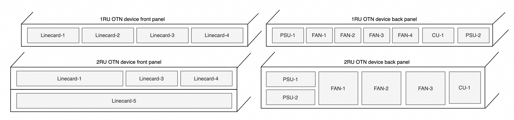
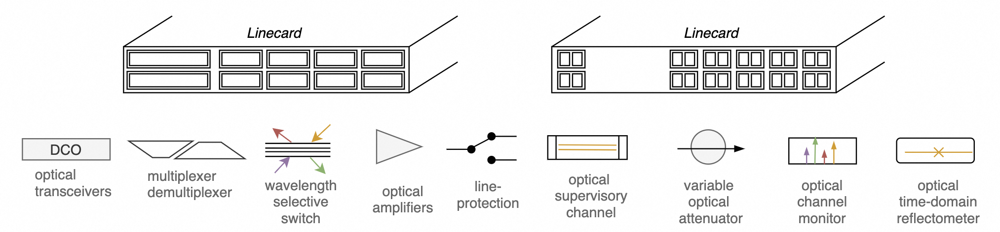

# SAI for optical transport network (OTN)

## Authors
The SONiC-OTN workgroup and members are: Alibaba, Microsoft, Molex, Nokia,Accelink.


### Definitions and abbreviations 

Definitions/Abbreviation|Description
------------------------|-----------
OTSS| Optical Transport State Service
OTAI| Optcial Transport Abstraction Interface
OTN| Optical Transport Network
CRUD| CREATE, READ, UPDATE and DELETE
OA| Optical Amplifier
OSC| Optical Supervisory Channel
OLP| Optical Line Protection
VOA|Optical Attenuator
OTDR| Optical Time Domain Reflectometer

### 1. SONiC for optical network introduction
In recent years, optical transport networks (OTNs) for data center interconnects (DCI) have been emerged to provide high-speed, low-latency, and reliable interconnects between data centers. OTNs have transformed to openness and disaggregation, due to the advent of digital coherent technology, the practices of software-defined networking (SDN), and the large demand of DCI networks. Modular OTN equipment with standardized northbound interfaces and data models are widely deployed in the DCI industry.

However the network operating systems (NOSes) running on these open and disaggregated optical network devices are still proprietary NOS and vary among different OTN equipment vendors. These proprietary NOSes offer diverse performance and alarms functionalities, CLI capabilities, and security features with different release schedules, which increase the Capital expenditures (CapEx) and operating expenses (OpEx) in a large scale DCI network. 

To overcome this, SONiC for OTN project is proposed to expand SONiC to support optical transport networks. Thus SONiC can be deployed to the end to end packet and optical network. It can support optical transponders and muxponders, optical line systems such as optical line protection (OLP) switches, optical amplifiers (OA), wavelength selective switches (WSSes), which can provide optical interconnects between IP switches and routers.


### 2. optical transport network device introduction
The optical transport network devices provides high-speed, reliable and efficient data transmission over optical fibers. For DCI, an optical transport network device is typically 1RU (Rack Unit) or 2RU chassis with multiple optical linecards, FANs, PSUs and control units. All these optical linecards are pluggable and provide different functionalities.



Although these optical linecards provide different functionalities and are diverse among different OTN device vendors, they consist of only a few basic optical component units. These optical components offer the common optical transmission functionalities such as:
* Transponders and Transceivers: Convert electrical signals from servers and network equipment into optical signals for transmission over optical fibers.
* Multiplexer (Mux): combine multiple optical signals of different wavelengths onto a single optical fiber for transmission.
* Demultiplexer (Demux): separate multiple optical signals of different wavelengths from a single optical fiber.
* Optical Line Protection (OLP) switch: automatically switching traffic from a primary optical path to a secondary path when a fault is detected.
* Optical Amplifier (OA): amplify an optical signal to a higher power level to increase the transmission distance over optical fibers.
* Wavelength Selective Switch (WSS): dynamically route specific wavelengths of light to different directions.
* Optical Supervisory Channel (OSC): channel used for transmitting management, control information alongside payload channels.
* Variable Optical Attenuator (VOA): attenuate optical signal power level with a changable attenuation value.
* Optical Channel Monitor (OCM): monitor and analyze the optical spectrum of optical signals.
* Optical Time-Domain Reflectometer (OTDR): measure distributed attenuation and reflection losses along the fiber.



### 3. Expand SAI for optical transport network (OTN)
SAI (Switch Abstraction Interface) is a standard interface for network equipment to provide a common programming model for network equipment. SAI is designed to be vendor-independent and provides a common programming model for network equipment. 

Instead of introducing a new OTAI (Optical Transport Abstraction Interface), SONiC community has decided to expand SAI to support OTN. Here is the hierarchy of SAI with OTN objects:


The switch SAI object is the root object for all other OTN objects. The switch object could be a real optical linecard on multiple linecard device, or a logical optical linecard on a pizza box. The switch may contains a set of optical components and logical objects. 

These OTN objects includes:
| Object | Description | SAI File Name | OpenConfig |
| :------| :---------- | :------------ | :--------- |
| Optical Port | Optical transport port | [saiopticalport.h](https://github.com/Weitang-Zheng/SAI/blob/test-merge/inc/saiopticalport.h) | [openconfig-transport-line-common.yang](https://github.com/openconfig/public/tree/master/release/models/optical-transport/openconfig-transport-line-common.yang)
| Physical Channel | Physical Channel | [saiphysicalchannel.h](https://github.com/Weitang-Zheng/SAI/blob/test-merge/inc/saiphysicalchannel.h) | [openconfig-platform-transceiver.yang](https://github.com/openconfig/public/tree/master/release/models/platform/openconfig-platform-transceiver.yang)
| Logical Channel | Optical Logical Channel | [sailogicalchannel.h](https://github.com/Weitang-Zheng/SAI/blob/test-merge/inc/sailogicalchannel.h) | [openconfig-terminal-device.yang](https://github.com/openconfig/public/tree/master/release/models/optical-transport/openconfig-terminal-device.yang)
| Ethernet | Ethernet | [saiethernet.h](https://github.com/Weitang-Zheng/SAI/blob/test-merge/inc/saiethernet.h) | [openconfig-if-ethernet.yang](https://github.com/openconfig/public/tree/master/release/models/interfaces/openconfig-if-ethernet.yang)
| Assignment | Opctial Assignment | [saiassignment.h](https://github.com/Weitang-Zheng/SAI/blob/test-merge/inc/saiassignment.h) | [openconfig-terminal-device.yang](https://github.com/openconfig/public/tree/master/release/models/optical-transport/openconfig-terminal-device.yang)
| OTN | OTN protocol | [saiotn.h](https://github.com/Weitang-Zheng/SAI/blob/test-merge/inc/saiotn.h) | [openconfig-terminal-device.yang](https://github.com/openconfig/public/tree/master/release/models/optical-transport/openconfig-terminal-device.yang)
| OCH | Optical Channel | [saioch.h](https://github.com/Weitang-Zheng/SAI/blob/test-merge/inc/saioch.h) | [openconfig-terminal-device.yang](https://github.com/openconfig/public/tree/master/release/models/optical-transport/openconfig-terminal-device.yang)
| OA | Optical Amplifier | [saioa.h](https://github.com/Weitang-Zheng/SAI/blob/test-merge/inc/saioa.h) | [openconfig-optical-amplifier.yang](https://github.com/openconfig/public/tree/master/release/models/optical-transport/openconfig-optical-amplifier.yang)
| WSS | Wavelength Selective Switch | [saiwss.h](https://github.com/Weitang-Zheng/SAI/blob/test-merge/inc/saiwss.h) | [openconfig-wavelength-router.yang](https://github.com/openconfig/public/tree/master/release/models/optical-transport/openconfig-wavelength-router.yang)
| OMC | Optical Media Channel | [saimediachannel.h](https://github.com/Weitang-Zheng/SAI/blob/test-merge/inc/saimediachannel.h) | [openconfig-wavelength-router.yang](https://github.com/openconfig/public/tree/master/release/models/optical-transport/openconfig-wavelength-router.yang)
| OSC | Optical Supervisory Channel | [saiosc.h](https://github.com/Weitang-Zheng/SAI/blob/test-merge/inc/saiosc.h) | [openconfig-optical-amplifier.yang](https://github.com/openconfig/public/tree/master/release/models/optical-transport/openconfig-optical-amplifier.yang)
| Interface | Interface | [saiinterface.h](https://github.com/Weitang-Zheng/SAI/blob/test-merge/inc/saiinterface.h) | [openconfig-interfaces.yang](https://github.com/openconfig/public/tree/master/release/models/interfaces/openconfig-interfaces.yang)
| OTDR | Optical Time Domain Reflectometer | [saiotdr.h](https://github.com/Weitang-Zheng/SAI/blob/test-merge/inc/saiotdr.h) | Not Defined Yet
| OCM | Optical Channel Monitor | [saiocm.h](https://github.com/Weitang-Zheng/SAI/blob/test-merge/inc/saiocm.h) | [openconfig-channel-monitor.yang](https://github.com/openconfig/public/tree/master/release/models/optical-transport/openconfig-channel-monitor.yang)
| VOA | Optical Attenuator | [saiattenuator.h](https://github.com/Weitang-Zheng/SAI/blob/test-merge/inc/saiattenuator.h) | [openconfig-optical-attenuator.yang](https://github.com/openconfig/public/tree/master/release/models/optical-transport/openconfig-optical-attenuator.yang)
| APS | Automatic Protection Switch | [saiaps.h](https://github.com/Weitang-Zheng/SAI/blob/test-merge/inc/saiaps.h) | [openconfig-transport-line-protection.yang](https://github.com/openconfig/public/tree/master/release/models/optical-transport/openconfig-transport-line-protection.yang)
| APS Port | Automatic Protection Switch Port | [saiapsport.h](https://github.com/Weitang-Zheng/SAI/blob/test-merge/inc/saiapsport.h) | [openconfig-transport-line-protection.yang](https://github.com/openconfig/public/tree/master/release/models/optical-transport/openconfig-transport-line-protection.yang)


For instance, an optical transponder and muxponder linecard includes optical ports(client and line port), and logical objects (logical channels, physical channels, ethernet, OTN, OCH, etc). 

The switch can present the optical line system, it includes OA, OSC, APS, Attenuators, WSS, Media Channel, OCM, OTDR, Ports, etc.

#### 3.1 New Tags introduced in OTN objects
##### 3.1.1 precision tag
Because the OTN objects contains many float values, for example, optical power, attenuation, and Bit error rate before forward error correction (Pre-FEC-BER). These float values need to support different precisions, optical power can have 2 decimal places, Pre-FEC-BER can have up to 18 decimal places.

Now SAI can support `uint64_t` statistics values and attributes, but haven't supported float values. In order to extend SAI to support float values and minimize the impact on existing SAI, we propose to introduce new tags `@precision ` to represent float values with different precisions.
```
/**
* @brief Output power
*
* @type sai_uint64_t
* @precision 2
*/
SAI_OPTICAL_PORT_STAT_OUTPUT_POWER,

/**
* @brief Los threshold
*
* @type sai_uint64_t
* @flags CREATE_AND_SET
* @precision 2
*/
SAI_OPTICAL_PORT_ATTR_LOS_THRESHOLD,
```
```
/**
* @brief Bit error rate before forward error correction
*
* @type sai_uint64_t
* @precision 18
*/
SAI_OTN_STAT_PRE_FEC_BER,
```

##### 3.1.2 isaction tag
The OTN objects can operate kinds of actions, for example, the APS object can switch the optical path from the primary to the secondary path, the OCM object can scan all the spectrum of the optical line, and the OTDR object can scan the reflection losses along the optical fiber.

These operations can be triggered by the upper layer applications, for example the Syncd application, and get the result form the SAI. In order to minimize the impact on existing SAI, we propose to introduce new tags `@isaction` to SAI objects' attributes.

Upper layer application (Syncd) can trigger the action by setting the attribute and verify the result of setting the attribute. If the attribute has `@isaction` tag, the attribute value should not be save to the ASIC database, because the action is a one-time operation.

```
/**
* @brief Scan
*
* @type bool
* @flags CREATE_AND_SET
* @isaction true
*/
SAI_OCM_ATTR_SCAN,
```
```
/**
    * @brief Active path
    *
    * @type sai_aps_active_path_t
    * @flags CREATE_AND_SET
    * @isaction true
    */
SAI_APS_ATTR_ACTIVE_PATH,
```

#### 3.2 SAI metadata modifications
In order to support the `@precision ` and `@isaction` tags, we need to modify the SAI metadata.

First, we introduce the new structure `sai_attr_metadata_t` for SAI statistics. The precision field is define in the `sai_attr_metadata_t` structure. 
For all existing SAI statistics, the precision field is set to 0 decimal places.
For these OTN defined SAI statistics with `@precision `, the precision field is set to the decimal places specified in the `@precision ` tag. The serializer and deserializer will use the precision field to convert the `uint64_t` value to/from float string.
```
typedef struct _sai_stat_metadata_t
{
    /**
     * @brief Specifies valid SAI object type.
     */
    sai_object_type_t                           objecttype;

    /**
     * @brief Specifies valid statistics id for this object type.
     */
    sai_stat_id_t                               statid;

    /**
     * @brief Specifies valid statistics id name for this object type.
     */
    const char* const                           statidname;

    /**
     * @brief Specifies valid statistics id name of kebab case naming style.
     */
    const char* const                           statidkebabname;

    /**
     * @brief Specifies valid statistics id name of camel case naming style.
     */
    const char* const                           statidcamelname;

    /**
     * @brief Specifies value decimal precision for this statistics.
     */
    sai_value_precision_t                       valueprecision;
} sai_stat_metadata_t;
```

Secondly, we introduce two new fields `isaction` and `precision` in the `sai_attr_metadata_t` structure.

```
typedef struct _sai_attr_metadata_t
{
    ......
    /**
     * @brief Indicates whether attribute is an action.
     *
     * If true, when calling SET API successfully, the value will NOT be saved in local
     * db for warm-reboot (or cold-reboot) flow to recover this configuration.
     */
    bool                                        isaction;

    /**
     * @brief Specifies value decimal precision for this attribute.
     */
    sai_value_precision_t                       valueprecision;
} sai_attr_metadata_t;
```

### 4. The PR with all the OTN changes

Here is an experimental PR for OTN changes: https://github.com/Weitang-Zheng/SAI/pull/1

The SONiC-OTN workgroup and Kamil Cudnik had reviewed the PR.

### 5. Open Questions
1. Should we define these OTN objects as SAI experimental entries? Or we can define them as SAI standard entries?

2. If we can define these OTN objects as SAI standard entries, should we need to define these objects in one folder named `otn`?

3. What's the next step if we want SAI to adopt these OTN modifications?


