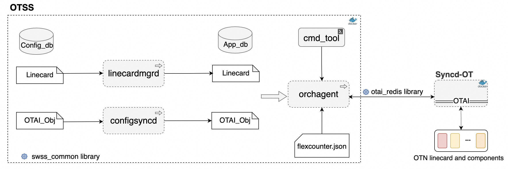
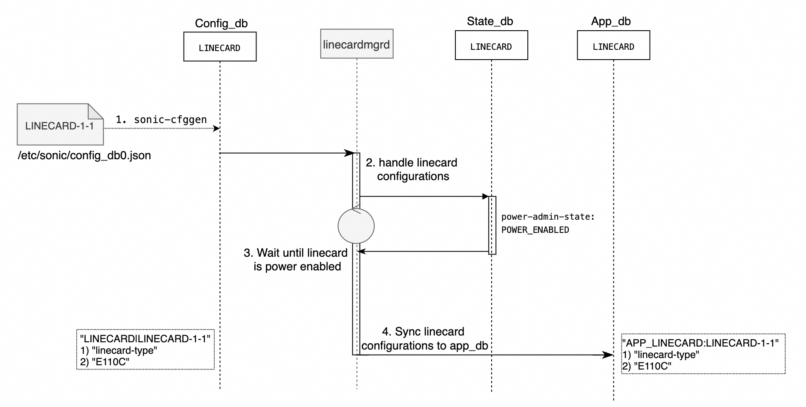
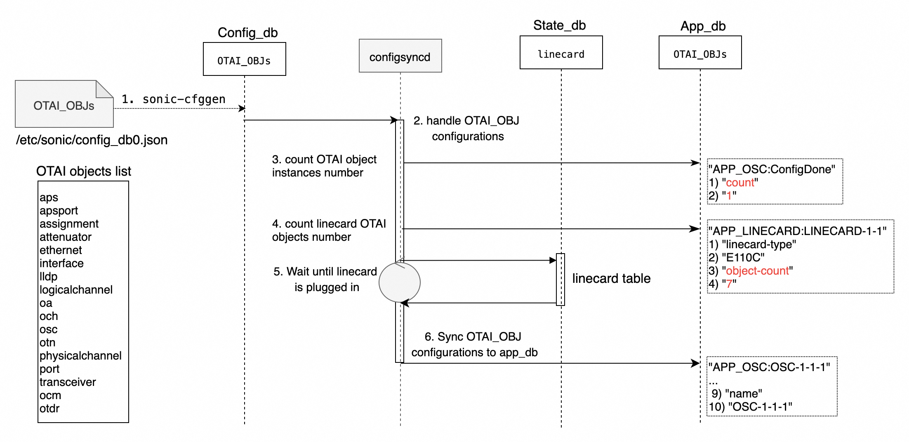
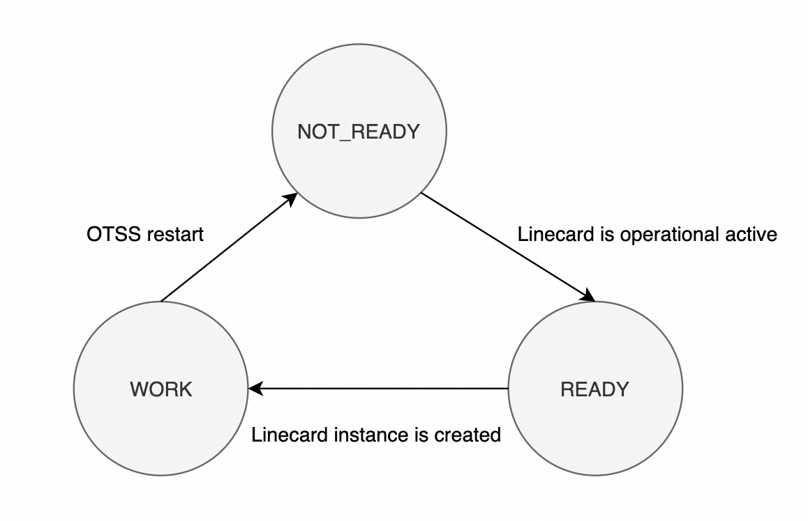
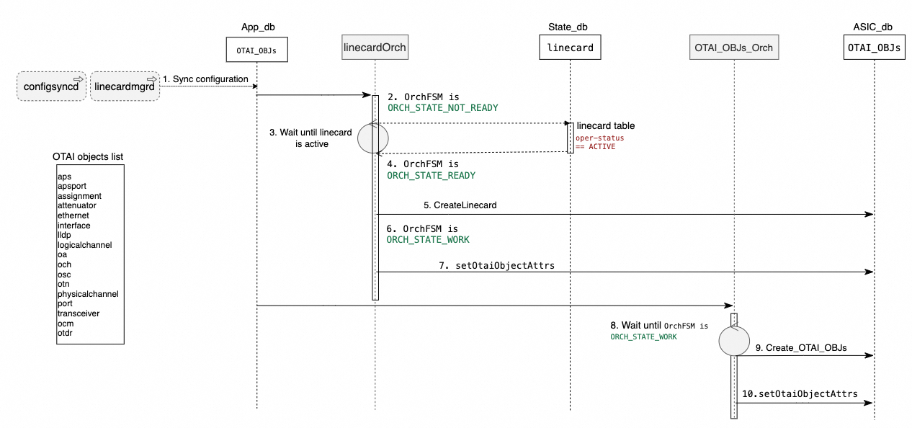
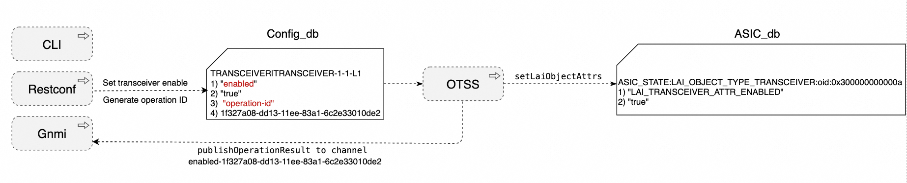
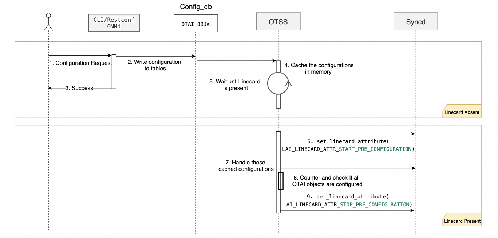
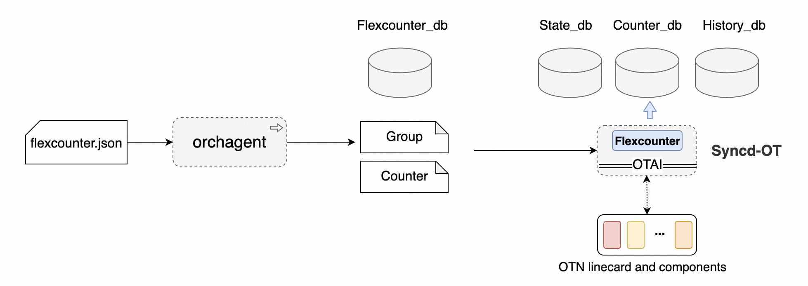

# Optical Transport State Service (OTSS) High Level Design #

## Table of Content 

### Revision  
Rev | Rev	Date	| Author	| Change Description
---------|--------------|-----------|-------------------
|v0.1 |05/03/2024  |Weitang Zheng | Initial version

### Scope  

This document describes the high level design of OTSS in SONiC

### Definitions/Abbreviations 

Definitions/Abbreviation|Description
------------------------|-----------
OTSS| Optical Transport State Service
OTAI| Optcial Transport Abstraction Interface
SWSS| Switch State Service
OTN| Optical Transport Network
CRUD| CREATE, READ, UPDATE and DELETE
OA| Optical Amplifier
OSC| Optical Supervisory Channel
OLP| Optical Line Protection
VOA|Optical Attenuator
OTDR| Optical Time Domain Reflectometer
PM| Performance Monitoring
FSM| Finite-State Machine
UUID| Universally Unique IDentifier

### Overview 

OTSS is a SONiC user space docker application, which provides a database interface for communication with and state representation of optical network applications and optical transport component hardware. OTSS is in parallel with the SWSS in the SONiC switch.

### 1 Requirements

The OTSS provides these functionalities:
 * Supports Multi ASIC architecture. In a SONiC-OTN device, each OTN linecard is handled as an ASIC.
 * Manages all OTAI components and objects with OTAI redis CRUD APIs. 
 * Configures Syncd PM and status sampling based on users flexcounter configuration file.
 * Supports OTN linecard pre-configuration
 * Supports warm and cold reboot optical linecard, optical linecard software upgrade and transceivers firmware upgrade.
 * Supports OTN linecard and transceivers hot plugging. 

### 2 Architecture Design 

OTSS and Syncd-OT interact with each other to manage kinds of OTN linecards and components. There are three applications and one command tool in the OTSS docker container.
* linecardmgrd  
  linecardmgrd application loads OTN linecard configurations from the redis config_db to app_db, when the linecard is provisioned and plugged in the slot.
* configsyncd  
  configsyncd application loads OTN linecard's OTAI object configurations from the redis config_db to app_db. All the OTAI objects (Transceivers, OA, OSC, OLP, VOA, etc) are handled in the same way. 
* orchagent  
  orchagent application manages the OTN linecard and OTAI objects. It creates and initializes the linecard OTAI object instance, then the other OTAI object instances within the linecard. It loads the linecard flexCounter configuration to set-up the PM and status sampling in the Syncd-OT.  
  > FlexCounter is a representation of flex counter group which supports querying multiple types of statistic/attributes in the syncd.  

  `swss_common` and `otai_redis` libraries are employed to access the redis database and interact with syncd-ot.
* cmd_tool  
  cmd_tool is an OTSS command tool to execute OTAI operations, such as reboot the linecard, trigger an OTDR scan, upgrade transceiver firmware, etc.
 

#### 2.1 Linecardmgrd Design 

In an OTN device, it contains multiple pluggable optical linecards. End-user can provision different linecards, and each linecard contains different optical components. Once a linecard is inserted into a slot and powered on, linecardmgrd application loads the OTN linecard configurations from config_db to the app_db. The orchagent application will handle these linecard data in app_db later.  
	

Because the OTSS supports the multi-ASIC architecture, there are multiple OTSS instances in a multi-slots OTN device. In this flow, it illustrates the linecard in the slot 1 as an example. By default, there is no linecard data in the state_db, so the linecardmgrd keeps looping the linecard `power-admin-state` in state_db until it changes to `POWER_ENABLED`. If a linecard is inserted into a slot, the PMON container has to generate the linecard data in the state_db and update the `power-admin-state` to `POWER_ENABLED` when the linecard is powered on.
1. User provision the linecard type, the sonic-cfggen can generate the target linecard default configurations and load these configurations into config_db
2. The linecardmgrd subscribe the linecard tables in config_db, it starts to handle these linecard configurations
3. The linecardmgrd keeps waiting until the linecard status in state_db is power enabled.
4. linecardmgrd synchronizes linecard configurations from config_db to the app_db

#### 2.2 Configsyncd Design 

configsyncd application synchronizes all the other OTAI objects' configurations from the redis config_db to app_db. It counts how many kinds of OTAI objects in the linecard, and saves the number in app_db linecard table. And it counts how many OTAI objects instances for each OTAI object type. For example, the linecard type E110C contains 1 OSC instance, 2 amplifier instances and 7 kinds of OTAI objects in total. These counting numbers are used to check whether the pre-configuration process is finished or not in Orchagent application.
Here is the configsyncd work flow:		

There are more than 15 kinds of OTAI objects are defined. These objects' configurations are synchronized by configsyncd in the same way. The synchronization process is triggered when it detects the linecard is plugged in the slot.
1. User provision the linecard type, the sonic-cfggen can generate the target linecard default configurations and load these configurations into config_db
2. The configsyncd subscribes all the other OTAI objects tables in config_db, it starts to handle these OTAI object configurations
3. For each OTAI objects, it counts the number of OTAI object instances. For instance, 1 OSC, 2 Amplifiers, 3 VOAs, etc. 
4. It counts how many kinds of OTAI objects in the linecard.
5. The configsyncd keeps waiting until the linecard table is created by PMON
6. configsyncd synchronizes OTAI objects configurations from config_db to the app_db

#### 2.3 Orchagent Design 

The Orchagent application orchestrates and manages an OTN linecard and its OTAI objects. It employs `otai_redis` library to CRUD OTAI objects in the AISC database, and employs `swss_common` library to call these SWSS common utilities. The Orchagent provides these key features:
* Linecard and OTAI objects management 
* Synchronized Set Operation
* Pre-configuration
* Flexcounter configuration
* Pluggable components handling

##### 2.3.1 Linecard and OTAI objects management 
Once a linecard is powered on and operational active, the `LinecardOrch` module in the Orchagent application creates the linecard objects in the ASIC_db first. Then all the other OTAI object orchestration modules, `OaOrch` for instance, start to create all the OA objects and configure OA's OTAI attributes.

There is a Finite-State Machine (FSM) in `orchagent` application, it makes sure that OTAI objects are created after linecard instance. The FSM is in `ORCH_STATE_NOT_READY` state after initialization. Once the linecard operational status changes to `active`, the FSM changes to `ORCH_STATE_READY` and the `linecardOrch` starts to create the linecard OTAI object based on the attributes in the app_db. After the linecard OTAI object is created successfully, the FSM changes to `ORCH_STATE_WORK`.

Once the FSM is `ORCH_STATE_WORK`, the other OTAI object orchestration modules start to create these linecard internal OTAI objects and handle the configurations requests. 

1. configsyncd and linecardmgrd synchronized linecard and other optical objects configurations to app_db.
2. The orchagent FSM state is `ORCH_STATE_NOT_READY` by default.
3. LinecardOrch keeps waiting until the linecard status change to active.
4. The orchagent FSM state changes to `ORCH_STATE_READY`.
5. LinecardOrch create linecard OTAI object instance
6. The orchagent FSM state changes to `ORCH_STATE_WORK`.
7. LinecardOrch configures linecard attributes to linecard instance
8. The other OTAI objects orchestration modules keep waiting until orchagent FSM state is `ORCH_STATE_WORK`
9. OTAI objects orchestration modules create these OTAI object instances.
10. OTAI objects orchestration modules configures OTAI attributes.
    

##### 2.3.2 Synchronized Setting Operation
In OTN device, the northbound interfaces (CLI, Restconf, GNMi) do synchronized configurations. The end-user expects the realtime response from the hardware, so the upper layer applications can persist succeed configurations and rollback failed configurations.

The CLI and Restconf application can configure each OTAI objects by setting the attributes in the config_db, and provide an operation-id in the config_db. The linecardOrch and the other OTAI object orchestration modules handle these configuration attributes by calling OTAI `setOtaiObjectAttrs`, then publish the result to the upper layer applications through redis channel with the operation-id. The UUID is adopted as the default operational id.

Here is an example, the northbound applications enable a transceiver by setting the attribute `enabled` and generating the operation-id. When the OTSS handles the configuration, it publishes the configuration result to the channel with the attributes and operation-id, the upper application can subscribe this channel and get response on time.

##### 2.3.3 Pre-configuration 
Pre-configuration allows OTN device operators provision linecards on day 1 without real linecard hardware ready. When the real linecard hardware is plugged-in on day 2, all the pre-configured setting are programed to the hardware. Pre-configuration make networking planning and operation more convenient.

1. User configure these optical components via CLI/Restconf/GNMi request.
2. CLI/Restconf/GNMi daemons write the configurations to the tables in the config_db.
3. If the target linecard is absent, CLI/Restconf/GNMi daemons return success response to the user. In pre-configuration flow, CLI/Restconf/GNMi daemons don't subscribe the message channel to receive the response from hardware.
4. OTSS save these pre-configured configurations in the memory.
5. OTSS keeps waiting until the linecard is present.
6. Once the linecard is present and operational ready, it starts the pre-configuration by setting `OTAI_LINECARD_ATTR_START_PRE_CONFIGURATION` to Syncd.
7. OTSS configure all the other linecard and OTAI objects configurations to Syncd. 
8. OTSS keeps counting and checking if all OTAI objects are created and configured, with these instance numbers and OTAI objects types number generated by Configsyncd
9. When all OTAI objects are configured, it stops the pre-configuration by setting `OTAI_LINECARD_ATTR_STOP_PRE_CONFIGURATION` to Syncd.

##### 2.3.4 Flexcounter configuration
FlexCounter is a representation of flex counter group which supports querying multiple types of statistic/attributes in the syncd. OTSS enhanced the FlexCounter functionalities to support OTN device, there are 2 enhancements in OTSS
1. Load flexcounter configurations from configuration file.
Because there are various kinds of OTN linecards, they have different statistics and attributes. OTSS supports load default linecard flexcounter configurations for each device.

2. Start and stop flexcounter at runtime.
Because the OTN linecards are pluggable, once a linecard is plugged out, its statistics and attributes flexcounters are stopped.  

OTSS configures the syncd flexcounter by setting the flexcounter group tables and  counter tables in flexcounter database. The group tables contain the sampling interval, enable/disable configurations. The counter tables contain all the statistics and attributes IDs.

The flexcounter module in Syncd-OT subscribes the group and counter tables in flexcounter database, it samples all the attributes and statistics with OTAI APIs. These attributes sample data are saved in the state_db, the performance monitoring (PM) data are saved in the counter_db, the historical PM data are saved in the history_db.

##### 2.3.5 Pluggable components handling
There are pluggable linecards, transceivers, etc in the OTN device. If these pluggable components are plugged out, OTSS has to flush the status and PM data in the redis database, and stop the flexcounter for these pluggable components.

OTSS keeps monitoring the status of pluggable components status, if any components is absent, OTSS will disable the flexcounter for this components and its sub-components, and flush the status and PM data in the database.

### 2.4 OTSS command tool
The OTSS command tool provides the utilities to call OTAI APIs in the OTSS. In below cases, use want to trigger operations without writing configurations to config_db.
* reset RMON counting in Syncd
* warm reset, cold reset linecard
* flashing the LEDs on the linecard
* Force the APS switching to primary or secondary path
* Upgrade linecard software and transceiver firmware

The OTSS command tool builds message channels with linecard and other OTAI object orchestration modules. These orchestration modules in OTSS can handle the request form command tool, then call the OTAI APIs and send out the response to the command tool.

### 3 Tests
#### 3.1 Test cases
1. Verify that OTSS can support multi-ASIC architecture, each OTSS manages one linecard and all data are isolated.
2. When linecard is powered off in state_db, verify that LinecardMgrd cannot synchronize the linecard configuration from CONFIG_DB to APP_DB.
3. When linecard is powered on in state_db, verify that linecardMgrd cannot synchronize the linecard configuration from CONFIG_DB to APP_DB.
4. Verify that ConfigSyncd can count the object types and save `object-count` field in APP_DB linecard table.
5. Verify that ConfigSyncd can count each OTAI object instance number and save the number in the `count` field in APP_DB `APP_<OTAI_OBJ>:ConfigDone` table. 
6. When linecard table is not in state_db, verify that ConfigSyncd cannot synchronize each OTAI object configuration from CONFIG_DB to APP_DB.
7. When linecard table is in state_db，verify that ConfigSyncd can synchronize each OTAI object configuration from CONFIG_DB to APP_DB
8. When linecard's operation status is inactive, verify that linecardOrch cannot call the otai library `createlinecard` API.
9. When linecard's operation status is inactive, verify that the other OTAIOrch cannot create OTAI objects. 
10. When linecard's operation status is active, verify that linecardOrch can call the otai library `createlinecard` API.
11. Verify that linecardOrch call the linecard `setOtaiObjectAttrs` after the creation API.
12. After linecardOrch create the linecard object, verify that linecardOrch set the `OTAI_LINECARD_ATTR_COLLECT_LINECARD_ALARM` attribute to collect linecard alarms.
13. Verify that the other OTAIOrch can create OTAI objects after linecard creation.
14. Verify that the other OTAIorch can set OTAI objects attributes after creation.
15. Change one OTAI object configuration in the CONFIG_DB, and provide an `operation-id` in the CONFIG_DB, Verify a succeed response is published to the operation channel if the operation is successful.
16. Change one OTAI object configuration in the CONFIG_DB, and provide an `operation-id` in the CONFIG_DB, Verify a failure response is published to the operation channel if the operation is failed.
17. Verify linecardOrch can set the `OTAI_LINECARD_ATTR_START_PRE_CONFIGURATION` attribute after linecard is created.
18. Verify linecardOrch can set the `OTAI_LINECARD_ATTR_STOP_PRE_CONFIGURATION` attribute after all the other internal OTAI objects are created.
19. Verify that OTSS can load user's flexcounter.json into flexcounter database.
20. Verify that the groups in flexcounter database are status, counter and gauge group, the attributes match user's flexcounter.json.
21. Verify that each OTAI objects' counter ids in the flexcounter database match user's flexcounter.json.
22. Verify each OTAI objects OID in flexcounter database is matched with the OID in the ASIC_DB.
23. When the transceiver is not present, verify the transceiver's PM and status data are flushed in the database.
24. When the transceiver is present, verify the transceiver's PM and status data are saved in the database.
25. Verify the OTSS command tool can call otai_redis API to reset RMON counting.
26. Verify the OTSS command tool can call otai_redis API to warm reset linecard.
27. Verify the OTSS command tool can call otai_redis API to flash the LEDs on the linecard.
28. Verify the OTSS command tool can call otai_redis API to force the APS switching to primary or secondary path.
29. Verify the OTSS command tool can call otai_redis API to upgrade linecard software and transceiver firmware.
30. Verify the user can restart OTSS docker container, and all data in app_db, config_db, state_db, flexcounter_db are still there.
