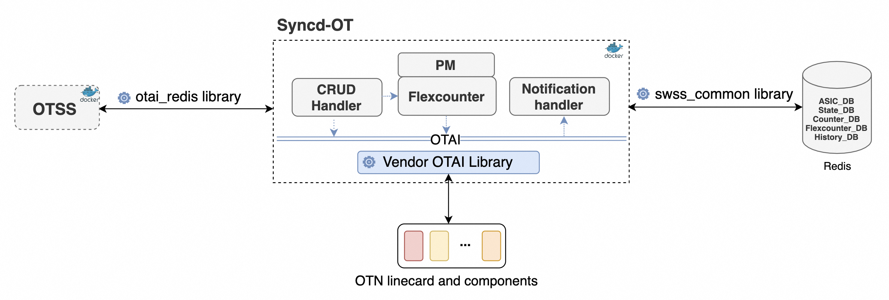

# Optical Transport Syncd (Syncd-OT) High Level Design #

## Table of Content 

### Revision  
Rev | Rev	Date	| Author	| Change Description
---------|--------------|-----------|-------------------
|v0.1 |28/03/2024  |Weitang Zheng | Initial version

### Scope  

This document describes the high level design of Syncd-OT in SONiC

### Definitions/Abbreviations 

Definitions/Abbreviation|Description
------------------------|-----------
OTSS| Optical Transport State Service
OTAI| Optcial Transport Abstraction Interface
OTN| Optical Transport Network
CRUD| CREATE, READ, UPDATE and DELETE
OA| Optical Amplifier
OSC| Optical Supervisory Channel
OLP| Optical Line Protection
VOA|Optical Attenuator
OTDR| Optical Time Domain Reflectometer


### Overview 

Syncd-OT provides a mechanism to allow the synchronization of the optical transport network state with actual optical transport components and hardware. It includes the initialization, the configuration, the PM collections and the alarms of the optical components.

### 1 Requirements

The Syncd-OT provides these functionalities:
 * Optical components initialization and configuration.
 * Synchronize optical components hardware status to redis database. 
 * Performance monitoring (PM), with 15 minutes and 1 day statistics and historical counters .
 * Supports alarms notification and OCM, OTDR, OLP data reporting notifications
 * Supports linecard, syncd-ot container restart. 

### 2 Architecture Design 

Syncd-OT interacts with OTSS to manage OTN linecard and components, and synchronizes real hardware status, PMs, alarms to the redis database. There are 4 modules in the syncd-OT application.
* CRUD handler  
  CRUD handler processes all the CRUD request message from OTSS, calls the vendor's OTAI library to manage the optical components.

* Flexcounter and PM  
  Flexcounter keeps polling the optical components status and statistics with the settings which are configured by OTSS. The PM module accumulates the Flexcounter result with 15 minutes and 1 day interval. Historical PM data is saved in History database as well.

* Notification handler  
  Notification handler defines the callbacks for OTAI notifications. For instance, the alarm notifications, the OCM spectrum data reporting notification, the OTDR scanning data reporting notification, etc.  

* linecard and Syncd-OT re-initialization.  
  After optical linecard or Syncd-OT rebooting, Syncd-OT needs to re-initialize the optical linecard's configuration.
 


#### 2.1 CRUD handler 

OTSS sends optical linecard and components CRUD request to Syncd-OT. Syncd-OT handles these requests by calling the vendor OTAI library, and saves these OTAI objects and attributes in the ASIC_DB.  


1. Syncd-OT application subscribes the redis communication channel with OTSS during the initialization process.
2. Syncd-OT enter into the main loop process, which keep receiving and handling the CRUD requests from OTSS.
3. OTSS sends the CRUD requests to redis communication channel when it calls these four APIs, `createOtaiObject`,  `setOtaiObjectAttrs`, `getOtaiObjectAttrs` and `getOtaiObjectAttrs`
4. Once Syncd-OT received the CRUD request from the redis communication channel, the `ProcessEvent` function starts to handle these request.
5. Based on the CRUD request type, these request are dispatched to different handler functions, `processOidCreate`,`processOidSet`,`processOidGet` and `processOidRemove`.
6. these handler functions call vendor's OTAI library APIs to create, set, get and remove optical components attributes and objects.
7. These message handler send the CRUD response to OTSS.
8. For create, set and remove message handler, it will create, set and remove ASIC objects and attributes, then save these modifications to ASIC_DB.

#### 2.2 FlexCounter and PM
FlexCounter in Syncd-OT keeps polling the optical components' status and PM statistics, the PM module accumulates these sampled data within 15 minutes and 24 hours interval. The sampled status are saved to state_db, the accumulated PM data are saved to counter_db and history_db.


The `flexcounter.json` contains the FlexCounter configurations per optical linecard. It defines the three kinds of FlexCounter groups, Vendor and users can change the FlexCounter group's configuration, for example, the sampling interval.
1. STAT_STATUS, the counter for optical components status sampling.
2. STAT_GAUGE, the counter for optical components analog data sampling.
3. STAT_COUNTER, the counter for optical components counter data sampling.

The `flexcounter.json` contains the counter IDs for each target optical objects. Here is an example of linecard gauge configuration, it includes four gauge counter IDs, memory available, memory utilized, cpu utilization and temperature. The Flexcounter module in Syncd-OT can sample these user assigned counter IDs. User can customize these list to enable different sampling groups and OTAI attributes. Vendor can customize all amplifiers's status sampling attributes in the `OA_COUNTER_ID_LIST_STATUS` group, and customize interface package counters attributes for an OSC interface in `INTERFACE_COUNTER_ID_LIST_COUNTER`.

```json
"LINECARD_COUNTER_ID_LIST_GAUGE": {
"attr1": "OTAI_LINECARD_STAT_MEMORY_AVAILABLE",
"attr2": "OTAI_LINECARD_STAT_MEMORY_UTILIZED",
"attr3": "OTAI_LINECARD_STAT_CPU_UTILIZATION",
"attr4": "OTAI_LINECARD_STAT_TEMPERATURE"
},
"OA_COUNTER_ID_LIST_STATUS": {
"attr1": "OTAI_OA_ATTR_OPER_STATUS",
"attr2": "OTAI_OA_ATTR_TARGET_GAIN",
"attr3": "OTAI_OA_ATTR_TARGET_GAIN_TILT",
"attr4": "OTAI_OA_ATTR_GAIN_RANGE"
},
"INTERFACE_COUNTER_ID_LIST_COUNTER": {
"attr1": "OTAI_INTERFACE_STAT_OUT_PKTS",
"attr2": "OTAI_INTERFACE_STAT_IN_PKTS"
},
```

The `FlexCounterOrch` module in OTSS loads the `flexcounter.json` file, and save these FlexCounter Groups and Counter IDs in the FlexCounter database.  

The FlexCounter module in Syncd-OT subscribes the FlexCounter database, and initializes the FlexCounter module based on these configurations. It starts threads to sample all these Counter IDs by calling the OTAI library, the sampled status data is saved in state_db.

The PM module accumulates these sampled gauge and counter data within 15 minutes and 24 hours interval, and saves these current PM data to counter_db. When the timer reached 15 minutes and 24 hours window, these PM data are saved to the history_db as well.

#### 2.3 Notification handler
The notification handler provides a mechanism to register and handle the events from an optical linecard. For instance, the alarm notification, the OCM spectrum data reporting notification, the OTDR scanning data reporting notification, etc.  

OTAI defines multiple notification API functions:
* OTAI_LINECARD_ATTR_LINECARD_ALARM_NOTIFY
* OTAI_LINECARD_ATTR_LINECARD_OCM_SPECTRUM_POWER_NOTIFY
* OTAI_LINECARD_ATTR_LINECARD_OTDR_RESULT_NOTIFY
* OTAI_LINECARD_ATTR_LINECARD_STATE_CHANGE_NOTIFY

When Syncd-OT handles the linecard creation request message in CRUD module, it assigns these notification API's callback functions to vendor's OTAI library. Once the target events are triggered in optical linecard, vendor's OTAI library can call these notification callback functions to handle these events. For example, bellow flow illustrates the alarm notification handling process.


1. Syncd-OT registers all linecard notification callbacks during linecard creation.
2. When the linecard or optical components generates an alarm, vendor's OTAI library can catch the alarm notification
3. Vendor's OTAI library call the registered callback function `onLinecardAlarm`
4. In the callback function `onLinecardAlarm`, it saves the generated alarm to state_db with the table name `CURALARM`
5. When the linecard or optical components clears an alarm, vendor's OTAI library can catch the alarm cleared notification
6. Vendor's OTAI library call the registered callback function `onLinecardAlarm`
7. In the callback function `onLinecardAlarm` delete the alarm in state_db, then save the cleared alarm in the history_db with table name `HISALARM`

#### 2.4 linecard and Syncd-OT re-initialization
In the OTN system, user can restart the optical linecard and the Syncd-OT docker container, then the OTN system needs to re-initialize the Syncd-OT container and the optical linecard. For instance, recreate and configure all the optical components with the attributes in the ASIC_db, re-initialize the Flexcounter based on the configurations in FlexCounter database. 

If the Syncd-OT container restart, the Syncd-OT calls the `HardReiniter` function to re-initialize all the OTAI objects and Flexcounter module. 

If the linecard reboot, vendor's OTAI library can detect the heartbeat with optical linecard and trigger the `OTAI_LINECARD_NOTIFICATION_NAME_LINECARD_STATE_CHANGE` notification. When the linecard boot-up and status ready, OTAI library triggers the optical linecard state changing notification again. Once the status is ready, then Syncd-OT call the `SoftReniniter` functions to re-initialize all the OTAI objects and Flexcounter module. 


1. After Syncd-OT reboot, it waits for the OTAI library status is operational ready.  
2. Syncd-OT calls the `HardReiniter` function to re-initialize OTAI objects and Flexcounter. It reads the ASIC state  from the ASIC_DB.  
3. It re-initialize the linecard first by calling the `processLinecards` function.  
4. In the `processLinecards` function, it recreates the linecard object based on the attributes in AISC_db.  
5. Once the linecard object is created, it calls vendor's OTAI library to set the other attributes.  
6. Then Syncd-OT starts to re-initialize the other OTAI objects in `processOids`  
7. In the `processOids` function, it loops all OTAI objects and calls vendor's OTAI library to recreate these OTAI objects.  
8. After all the other OTAI objects are created, it calls vendor's OTAI library to set the other attributes.  
9. Syncd-OT starts to reinitialize Flexcounter, it the Flexcounter groups and counter_ids from Flexcounter database  
10. Based on these configurations in Flexcounter database, it calls the FlexCounterManager to add plugins and counters.  


### 3 Vendor OTAI Library
Vendor OTAI library implements these OTAI APIs and provides Syncd-OT the ability to manage the linecard and its internal optical components. There are four sections of the OTAI APIs.
* Initialization and unInitialization APIs  
    OTAI library implements these APIs to initialize and uninitialize the OTAI library.
* CRUD APIs  
    OTAI library implements these APIs to create, update, set and delete OTAI objects;
* Notification APIs  
    OTAI library calls these notification callbacks to notify Syncd-OT for the status, alarms and data updates.
* Utility APIs  
    OTAI API utilities are used to get OTAI object type, capabilities, and change OTAI module log level.


1. `otai_api_initialize()`, this function allows the Syncd to initialize any data structure that may be necessary during the subsequent OTAI operations. For example, the vendor OTAI library can get the linecard slot number with the callback function provided by `otai_api_initialize`.

2. `otai_api_query()`, Syncd-OT retrieves a pointer to the C-style method table for desired OTAI functionality as specified by the given otai_api_id. Syncd-OT loops all the OTAI objects and keeps these pointers for CRUD and PM module.

3. `otai_link_check()`, check whether OTAI library is linked with the target hardware. For example, if the linecard is powered off, then the link up status should be `false`. If the linecard and OTAI library communication is recovered, the link status should be `true`.


4. `otai_create_<otai_obj>_fn()`, create a new OTAI object.
5. `otai_set_<otai_obj>_attribute_fn()`, set OTAI object attribute.
6. `otai_get_<otai_obj>_attribute_fn()`, get OTAI object attributes.
7. `otai_remove_<otai_obj>_fn()`, remove an OTAI object.
8. `otai_get_<otai_obj>_stats_fn()`, get OTAI object statistics
9. `otai_clear_<otai_obj>_stats_fn()`, clear OTAI object statistics counters.
    
10. `otai_linecard_state_change_notification_fn()`, the callback function when linecard state is changed.
11. `otai_linecard_alarm_notification_fn()`, the callback function when linecard alarm is generated or cleared.
12. `otai_linecard_ocm_spectrum_power_notification_fn()`, the callback function when the OCM module finish spectrum power scanning and report the data.
13. `otai_linecard_otdr_result_notification_fn()`, the callback function when the OTDR module finish fiber scanning and report the data.
14. `otai_aps_report_switch_info_fn()`, this is a vendor extension to report the optical power during the OLP switch between different path.
15. `otai_api_uninitialize()`, uninitialize OTAI APIs.

Here are the utility APIs.  
a. `objectTypeQuery()`, return the OTAI object type if the otai_object_id is valid, otherwise return NULL.  
b. `otai_query_attribute_capability()`, query an attribute capability.  
c. `otai_query_attribute_enum_values_capability()`, query an enum attribute list of implemented enum values.  
d. `otai_object_type_get_availability()`, query an OTAI object's attributes availability.  
e. `otai_log_set()`, set log level for an OTAI API module 


### 4 Tests
#### 4.1 Test cases
1. Verify that Syncd-OT can support multi-ASIC architecture, each Syncd-OT manages one linecard and all data are isolated.
2. When vendor OTAI library is not linked with linecard, verify that Syncd-OT cannot handle the CRUD request from OTSS.
3. When vendor OTAI library is linked with linecard, verify that Syncd-OT handle the CRUD request from OTSS.
4. Verify that Syncd-OT can handle the create request message from OTSS, it calls vendor OTAI library create API and save data to ASIC_DB.
5. Verify that Syncd-OT can handle the update request message from OTSS, it calls vendor OTAI library set API and update data in ASIC_DB.
6. Verify that Syncd-OT can handle the retrieve request message from OTSS, it calls vendor OTAI library get API.
7. Verify that Syncd-OT can handle the delete request message from OTSS, it calls vendor OTAI library remove API.
8. Verify that Syncd-OT can sample the status, gauge and counter data with the configuration in Flexcounter database. 
9. Verify that Syncd-OT can sample all the OTAI attributes defined in COUNTER_IDs in Flexcounter database.
10. Verify that Syncd-OT can skip the OTAI attributes if the OTAI API returns error for this attributes at first time.
11. Verify that Syncd-OT can accumulate the gauge and counter data within the 15 minutes and 1 day interval.
12. Verify that Syncd-OT can calculate the average values for different gauge data, such as optical power and attenuation.
13. Verify that the accumulate PM data validity is incomplete when the 15 minutes and 1 day window is not expired.
14. Verify that the accumulate PM data validity is complete when the 15 minutes and 1 day window is expired.
15. Verify that the accumulate PM data validity is invalid when any sampled data is invalid during the the 15 minutes and 1 day window.
16. Verify that the historical PM data is saved in history database when the 15 minutes and 1 day is up.
17. Verify that the current, 15 minutes and 1 day PM data is saved in the counter database.
18. Verify that all the OTAI object status are sampled and update in the state_db.
19. When linecard status changes form active to inactive, verify all the PM sampling are disabled, PM and status data are flushed.
20. When linecard status changes form active to inactive, verify all linecard current alarm are removed except the communication failure alarm.
21. When linecard status changes from inactive to inactive, verify all linecard and OTAI objects are created and configured again based on the data in ASIC_DB.
22. When linecard status changes from inactive to active, verify Syncd-OT can set the `OTAI_LINECARD_ATTR_START_PRE_CONFIGURATION` attribute after linecard is created.
23. When linecard status changes from inactive to active, verify Syncd-OT can set the `OTAI_LINECARD_ATTR_STOP_PRE_CONFIGURATION` attribute after all the other internal OTAI objects are created.
24. After Syncd-OT create the linecard object, verify that Syncd-OT set the `OTAI_LINECARD_ATTR_COLLECT_LINECARD_ALARM` attribute to collect linecard alarms.
25. Verify that Syncd-OT alarm notification callback is invoked when linecard alarm is generated or cleared.
26. Verify that Syncd-OT OCM spectrum power scanning notification callback is invoked when OCM reports the spectrum power.
27. Verify that Syncd-OT OTDR result scanning notification callback is invoked when OTDR reports the fiber scanning result.
28. Verify that Syncd-OT OLP switch notification callback is invoked when OLP switch between different path.
29. After restart the Syncd-OT docker container, verify all linecard and OTAI objects are created and configured again based on the data in ASIC_DB.
30. After restart the Syncd-OT docker container, verify Syncd-OT can set the `OTAI_LINECARD_ATTR_START_PRE_CONFIGURATION` attribute after linecard is created.
31. After restart the Syncd-OT docker container, verify Syncd-OT can set the `OTAI_LINECARD_ATTR_STOP_PRE_CONFIGURATION` attribute after all the other internal OTAI objects are created.
32. After restart the Syncd-OT docker container, verify that Syncd-OT set the `OTAI_LINECARD_ATTR_COLLECT_LINECARD_ALARM` attribute to collect linecard alarms.

