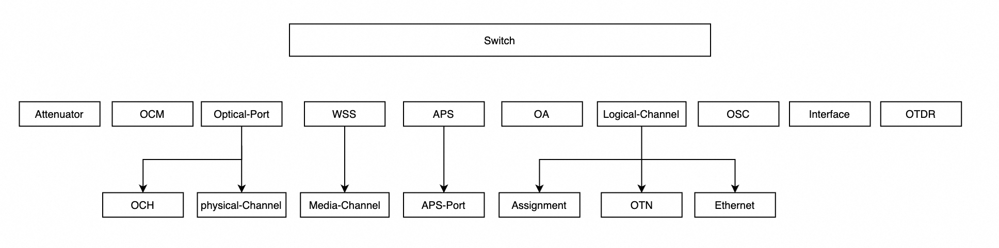

# SAI for Optical Transport Network (OTN)

## Authors
The SONiC-OTN workgroup members: Alibaba, Microsoft, Molex, Nokia, Cisco and Accelink.

### Definitions and Abbreviations

| Abbreviation | Description |
|--------------|-------------|
| OTN | Optical Transport Network |
| DCI | Data Center Interconnect |
| CRUD | CREATE, READ, UPDATE, and DELETE |
| OA | Optical Amplifier |
| OSC | Optical Supervisory Channel |
| OLP | Optical Line Protection |
| VOA | Optical Attenuator |
| OTDR | Optical Time Domain Reflectometer |

---
### 1. Scope
This document defines the draft technical specifications for the API in Open Compute Project Switch Abstraction Interface (SAI) used to support the management of optical components in the Optical Transport Network (OTN) device.

### 2. Why SONiC for OTN
OTN devices are deployed for Data Center Interconnects (DCIs), serving as the optical transport layer that connects the ports of switches and routers between geographically dispersed data centers. This enables high-speed, low-latency, and reliable optical connections across long distances. 

OTN devices typically run vendor-specific, proprietary Network Operating Systems (NOSs). This lack of standardization across NOS capabilities and features increases both Capital Expenditure (CapEx) and Operational Expenditure (OpEx) in large-scale DCI networks.

The **SONiC for OTN project** proposes extending SONiC to support optical transport networks, enabling end-to-end deployment across both packet and optical layers. 

For hyperscale network user and service provider, by introducing optical support in SONiC, end-to-end network infrastructure can be managed consistently, from the IP layer (switches and routers) through the optical transport layer (OTN devices). This significantly simplifies the network management tools and controllers. Furthermore, it provides the potential of single SDN controller infrastructure across all layers and moving into an open and converged multi-payer network management solution.

For optical device vendor, all exiting SONiC NOS infrastructure and generic feature, such as, user management, security, and management network modules can be re-used. This reduces time to market, improves software quality, and lowers development costs. Joining SONiC ecosystem also allows vendors and users to work closely using SONIC open source community as a collaboration platform.


---

#### 2.1 OTN device and components overview
OTN devices typically employ 1RU or 2RU chassis housing multiple optical linecards, fans, power supply units (PSUs), and control modules. Most optical linecards are pluggable and support diverse functions.


These optical linecards are built on a common set of optical component units that provide core transmission functionalities:

* **Variable Optical Attenuator (VOA)** – Adjusts optical signal power levels.
* **Optical Amplifier (OA)** – Boosts optical signals to extend transmission distance.
* **Optical Line Protection (OLP) Switch** – Automatically switches traffic to a backup path when a fault occurs.
* **Optical Supervisory Channel (OSC)** – Transports management and control information.
* **Wavelength Selective Switch (WSS)** – Dynamically routes specific wavelengths in different directions.
* **Optical Channel Monitor (OCM)** – Analyzes the optical spectrum.
* **Optical Time-Domain Reflectometer (OTDR)** – Measures attenuation and reflection losses along fibers.
* **Transponders and Transceivers** – Convert electrical signals into optical signals for fiber transmission.

---

### 3. SAI for OTN
The OTN SAI definition provides the following core functions:
* Creation and removal of OTN components
* Retrieval of current operational status of OTN components
* Notification handling for failures and hardware data reporting
* Execution of hardware-specific operations, such as optical path switching and triggering optical measurements

All OTN objects are subobjects of the switch root element, with no collaboration with existing SAI objects.
Below is the hierarchy of SAI with OTN objects:



*The switch object is the root for all OTN objects. It can represent either a physical optical linecard in a multi-linecard system, or optical components in a pizza box.*

#### 3.1 Experimental OTN Objects

All OTN object definitions are based on OpenConfig models and are designated as experimental objects in SAI. There is no overlap or interaction between IP and OTN objects. This approach is consistent with the DASH and OCS projects and minimizes the impact of OTN changes on SONiC packet switch functionality.

SAI support for OTN objects will be introduced in three phases:

**Phase 1**: Initial OTN support, introducing a minimal set of new objects (OA and VOA) for the simplest optical devices.

**Phase 2**: Incremental support for a complete optical line system, including OCM, OTDR, WSS, APS, and related components.

**Phase 3**: Full OTN support, including transponder objects (logical channels).

In Phase 1, we submitted SAI support for OA and VOA to demonstrate the evaluation and expansion methodology for OTN object support. The corresponding pull request is available here: PR 2217(https://github.com/opencomputeproject/SAI/pull/2217)

In subsequent phases 2 and 3, we plan to submit additional SAI OTN objects.

Note:  
To minimize disruption to the SAI workgroup due to detailed OTN definitions, we propose the following process: the SONiC-OTN workgroup will first review the changes internally, after which the SAI team will review and approve them.


Below is the list of OTN objects that will be added to SAI:
| Object | Description | SAI File | OpenConfig Reference |
|--------|-------------|----------|----------------------|
| OA | Optical amplifier | [saiexperimentalotnoa.h](https://github.com/sonic-otn/SAI/blob/master/experimental/saiexperimentalotnoa.h) | [openconfig-optical-amplifier.yang](https://github.com/openconfig/public/tree/master/release/models/optical-transport/openconfig-optical-amplifier.yang) |
| VOA | Optical attenuator | [saiexperimentalotnattenuator.h](https://github.com/sonic-otn/SAI/blob/master/experimental/saiexperimentalotnattenuator.h) | [openconfig-optical-attenuator.yang](https://github.com/openconfig/public/tree/master/release/models/optical-transport/openconfig-optical-attenuator.yang) |
| Optical Port | Optical transport port | TBD | [openconfig-transport-line-common.yang](https://github.com/openconfig/public/tree/master/release/models/optical-transport/openconfig-transport-line-common.yang) |
| OCH | Optical channel | TBD | [openconfig-terminal-device.yang](https://github.com/openconfig/public/tree/master/release/models/optical-transport/openconfig-terminal-device.yang) |
| WSS | Wavelength selective switch | TBD | [openconfig-wavelength-router.yang](https://github.com/openconfig/public/tree/master/release/models/optical-transport/openconfig-wavelength-router.yang) |
| OMC | Optical media channel | TBD | [openconfig-wavelength-router.yang](https://github.com/openconfig/public/tree/master/release/models/optical-transport/openconfig-wavelength-router.yang) |
| OSC | Optical supervisory channel |  [saiexperimentalotnosc.h](https://github.com/sonic-otn/SAI/blob/master/experimental/saiexperimentalotnosc.h) | [openconfig-optical-amplifier.yang](https://github.com/openconfig/public/tree/master/release/models/optical-transport/openconfig-optical-amplifier.yang) |
| OTDR | Optical time-domain reflectometer | TBD | Not defined yet |
| OCM | Optical channel monitor |  [saiexperimentalotnocm.h](https://github.com/sonic-otn/SAI/blob/master/experimental/saiexperimentalotnocm.h)| [openconfig-channel-monitor.yang](https://github.com/openconfig/public/tree/master/release/models/optical-transport/openconfig-channel-monitor.yang) |
| APS | Automatic protection switch | TBD | [openconfig-transport-line-protection.yang](https://github.com/openconfig/public/tree/master/release/models/optical-transport/openconfig-transport-line-protection.yang) |
| APS Port | Automatic protection switch port | TBD | [openconfig-transport-line-protection.yang](https://github.com/openconfig/public/tree/master/release/models/optical-transport/openconfig-transport-line-protection.yang) |
| Logical Channel | Logical channel | TBD | [openconfig-terminal-device.yang](https://github.com/openconfig/public/tree/master/release/models/optical-transport/openconfig-terminal-device.yang) |

---

##### 3.1.1 SAI otnoa object
The file `saiexperimentalotnoa.h` defines the SAI otnoa object, which represents an optical amplifier (OA). OA components amplify optical signals to increase their power and enable long-distance optical transmission.

It supports creation and removal of OA components, configuration of OA components, and retrieval of current operational status of OA components.   

**otnoa APIs**
```cpp
/**
 * @brief Routing interface methods table retrieved with sai_api_query()
 */
typedef struct _sai_otn_oa_api_t
{
    sai_create_otn_oa_fn                create_otn_oa;
    sai_remove_otn_oa_fn                remove_otn_oa;
    sai_set_otn_oa_attribute_fn         set_otn_oa_attribute;
    sai_get_otn_oa_attribute_fn         get_otn_oa_attribute;
} sai_otn_oa_api_t;
```

**SAI otnoa object attributes**
| SAI Object | SAI Attributes | SAI Data Type | create/get/set |
| ---- | ---- | ---- | ---- |
|SAI_OBJECT_TYPE_OTN_OA  | SAI_OTN_OA_ATTR_TYPE | sai_otn_oa_type_t | CREATE_AND_SET |
| | SAI_OTN_OA_ATTR_TARGET_GAIN | sai_uint32_t  | CREATE_AND_SET |
| | SAI_OTN_OA_ATTR_MIN_GAIN | sai_uint32_t  | CREATE_AND_SET |
| | SAI_OTN_OA_ATTR_MAX_GAIN | sai_uint32_t  | CREATE_AND_SET |
| | SAI_OTN_OA_ATTR_TARGET_GAIN_TILT | sai_uint32_t  | CREATE_AND_SET |
| | SAI_OTN_OA_ATTR_GAIN_RANGE | sai_otn_oa_gain_range_t  | CREATE_AND_SET |
| | SAI_OTN_OA_ATTR_AMP_MODE | sai_otn_oa_amp_mode_t  | CREATE_AND_SET |
| | SAI_OTN_OA_ATTR_TARGET_OUTPUT_POWER | sai_int32_t  | CREATE_AND_SET |
| | SAI_OTN_OA_ATTR_MAX_OUTPUT_POWER | sai_int32_t  | CREATE_AND_SET |
| | SAI_OTN_OA_ATTR_ENABLED | bool  | CREATE_AND_SET |
| | SAI_OTN_OA_ATTR_FIBER_TYPE_PROFILE | sai_otn_oa_fiber_type_profile_t  |CREATE_AND_SET  |
| | SAI_OTN_OA_ATTR_INGRESS_PORT | char  | READ_ONLY |
| | SAI_OTN_OA_ATTR_EGRESS_PORT | char  | READ_ONLY |
| | SAI_OTN_OA_ATTR_ACTUAL_GAIN | sai_int32_t  | READ_ONLY |
| | SAI_OTN_OA_ATTR_ACTUAL_GAIN_TILT | sai_int32_t  | READ_ONLY |
| | SAI_OTN_OA_ATTR_INPUT_POWER_TOTAL | sai_int32_t  | READ_ONLY |
| | SAI_OTN_OA_ATTR_INPUT_POWER_C_BAND | sai_int32_t  | READ_ONLY |
| | SAI_OTN_OA_ATTR_INPUT_POWER_L_BAND | sai_int32_t  | READ_ONLY |
| | SAI_OTN_OA_ATTR_OUTPUT_POWER_TOTAL | sai_int32_t  | READ_ONLY |
| | SAI_OTN_OA_ATTR_OUTPUT_POWER_C_BAND | sai_int32_t  | READ_ONLY |
| | SAI_OTN_OA_ATTR_OUTPUT_POWER_L_BAND | sai_int32_t  | READ_ONLY |
| | SAI_OTN_OA_ATTR_LASER_BIAS_CURRENT | sai_int32_t  | READ_ONLY |
| | SAI_OTN_OA_ATTR_OPTICAL_RETURN_LOSS | sai_int32_t  | READ_ONLY |
------

**otnoa Notification**  
Not required

##### 3.1.2 SAI otnattenuator object
The file `saiexperimentalotnattenuator.h` defines the SAI otnattenuator object, which represents an optical attenuator (VOA). VOA components educes optical signal power to maintain proper signal levels and prevent receiver saturation.

It supports creation and removal of VOA components, configuration of VOA components, and retrieval of current operational status of VOA components.   

**otnattenuator APIs**
```cpp
/**
 * @brief Routing interface methods table retrieved with sai_api_query()
 */
typedef struct _sai_otn_attenuator_api_t
{
    sai_create_otn_attenuator_fn                create_otn_attenuator;
    sai_remove_otn_attenuator_fn                remove_otn_attenuator;
    sai_set_otn_attenuator_attribute_fn         set_otn_attenuator_attribute;
    sai_get_otn_attenuator_attribute_fn         get_otn_attenuator_attribute;
} sai_otn_attenuator_api_t;
```

**SAI otnattenuator object attributes**
| SAI Object | SAI Attributes | SAI Data Type | create/get/set |
| ---- | ---- | ---- | ---- |
|SAI_API_OTN_ATTENUATOR  | SAI_OTN_ATTENUATOR_ATTR_ATTENUATION_MODE | sai_otn_attenuator_mode_t | CREATE_AND_SET |
| | SAI_OTN_ATTENUATOR_ATTR_TARGET_OUTPUT_POWER | sai_uint32_t  | CREATE_AND_SET |
| | SAI_OTN_ATTENUATOR_ATTR_ATTENUATION | sai_uint32_t  | CREATE_AND_SET |
| | SAI_OTN_ATTENUATOR_ATTR_ENABLED | sai_uint32_t  | CREATE_AND_SET |
| | SAI_OTN_ATTENUATOR_ATTR_MAX_OUTPUT_POWER | sai_int32_t  | CREATE_AND_SET |
| | SAI_OTN_ATTENUATOR_ATTR_MAX_OUTPUT_POWER_THRESHOLD | sai_int32_t  | CREATE_AND_SET |
| | SAI_OTN_ATTENUATOR_ATTR_INGRESS_PORT | char  | READ_ONLY |
| | SAI_OTN_ATTENUATOR_ATTR_EGRESS_PORT | char  | READ_ONLY |
| | SAI_OTN_ATTENUATOR_ATTR_SYSTEM_DERIVED_TARGET_OUTPUT_POWER | sai_int32_t  | READ_ONLY |
| | SAI_OTN_ATTENUATOR_ATTR_ACTUAL_ATTENUATION | sai_int32_t  | READ_ONLY |
| | SAI_OTN_ATTENUATOR_ATTR_OUTPUT_POWER_TOTAL | sai_int32_t  | READ_ONLY |
| | SAI_OTN_ATTENUATOR_ATTR_OPTICAL_RETURN_LOSS | sai_int32_t  | READ_ONLY |

------

**otnoa Notification**  
Not required

#### 3.2 New Tags in SAI OTN Objects

##### 3.2.1 Precision Tag for floating point values
**Precision Tag**  
Many OTN objects include floating-point values (e.g., optical power, attenuation, Pre-FEC BER). These values require different levels of precision — optical power may need two decimal places, while Pre-FEC BER may require up to 18.

Currently, SAI supports only `uint64_t` statistics, without float support. To enable floats without breaking compatibility, we propose introducing the `@precision` tag, allowing attributes and statistics to specify required precision. Here are examples:

```
    /**
     * @brief Positive gain applied by the amplifier in units of 0.01dB.
     * This is used when the amp-mode is in CONSTANT_GAIN or DYNAMIC_GAIN
     * mode to set the target gain that the amplifier should achieve.
     *
     * @type sai_uint32_t
     * @flags CREATE_AND_SET
     * @default 2000
     * @precision 2
     */
    SAI_OTN_OA_ATTR_TARGET_GAIN,
```
In the SAI meta data, the `valueprecision` field in `attrInfo` is used to represent the precision.

---

### 4. How to Manage OTN objects in Syncd
**Code physical separation**

`FlexCounter` managed configuration of CounterDB for SAI object monitoring. Separate files of `FlexCounterOtn` are created for managing the OTN SAI object attributes in COUNT DB. This eliminates the contention of code change among the OTN project and rest of SONiC development.

```Diff
   --- syncd
    |--- FlexCounter.(h|cpp)
+   |--- FlexcounterOtn.(h|cpp)
```

Similarly, SAI Object (de)serialization is also implemented in separate files `meta/sai_serialize_otn` from the main file `sai-serialize`.

**Run time logical flow isolation**

Also, processing OTN SAI objects and APIs added on the the existing Syncd infrastructure/framework seamlessly with clear isolation from the exiting logic. This is done by putting the OTN objects processing at the end of current logic, so that the OTN logic would be in the code path of any packet switch code. The code snip for add counter plugin for OTN is shown:

```Diff
FlexCounter.cpp

void FlexCounter::addCounterPlugin {
    ....
    {
            else
            {
+               if (m_flexCounterOtn ->addCounterPlugin(field, shaStrings))
+               {
+                    continue;
+               }

                SWSS_LOG_ERROR("Field is not supported %s", field.c_str());
            }
    }

    // notify thread to start polling
    notifyPoll();
}

void FlexCounter::removeCounter {
    ......
    else
    {
+       if (m_flexCounterOtn->removeCounter(vid, objectType))
+       {
+           return;
+       }

        SWSS_LOG_ERROR("Object type for removal not supported, %s",
                sai_serialize_object_type(objectType).c_str());
    }
}

void FlexCounter::addCounter {
    ...
        else
        {
+           if (m_flexCounterOtn->addCounter(vid, rid, objectType, field, idStrings))
+           {
+               continue;
+           }

            SWSS_LOG_ERROR("Object type and field combination is not supported, object type %s, field %s",
                    sai_serialize_object_type(objectType).c_str(),
                    field.c_str());
        }
    }

```

### 5. How to manage OTN objects in SWSS

The same design of Syncd is adopted to reuse SWSS infrastructure while keeping the OTN objects relatively isolated from existing packet switching objects.

**Code physical separation**

For ConfigMgr module, which listening the CONFIG DB changes, a separate daemon is created for processing OTN devices config changes. Upon any config changes in OTN tables in CONFIG DB, OTN configMgr copies the config changes to APP DB.

```Diff
   --- cfgmgr
    |--- intfmgr.(h|cpp)
    |--- intfmgrd.cpp
    |--- ....
+   |--- otnmgr.(h|cpp)
+   |--- otnmgrd.cpp
```

For orchagent, which processing the changes in APP DB, a separate folder is created to contains the code for processing OTN objects in APP DB.

```Diff
   --- orchagent
    |--- switch
    |--- ....
    |--- dash
+   |--- otn
+      |--- objectorch.(h|cpp) - generic for all objects
+      |--- attenuatorch.(h|cpp)
+      |--- oaorch (h|cpp)
+      |--- ocmorch (h|cpp)
+      |--- ....
+      |--- otnorchdaemon.(h.cpp) - process
```

**Run time logical flow isolation**

In orchagent `main.cpp`, a new switch type for OTN is used to decide what kind of orchagent daemon should be lunched. Switch type is configure in the DEVICE_META table.

```Diff
    shared_ptr<OrchDaemon> orchDaemon;
+   if(gMySwitchType == SWITCH_TYPE_OTN)
+   {
+       orchDaemon = make_shared<OtnOrchDaemon>(&appl_db, &config_db, &state_db, chassis_app_db.get(), zmq_server.get());
+   }
    else if (gMySwitchType != "fabric")
    {
        orchDaemon = make_shared<OrchDaemon>(&appl_db, &config_db, &state_db, chassis_app_db.get(), zmq_server.get());
        if (gMySwitchType == "voq")
        {
            orchDaemon->setFabricEnabled(true);
            orchDaemon->setFabricPortStatEnabled(true);
            orchDaemon->setFabricQueueStatEnabled(false);
        }
    }
    else
    {
        orchDaemon = make_shared<FabricOrchDaemon>(&a ppl_db, &config_db, &state_db, chassis_app_db.get(), zmq_server.get());
    }

```
