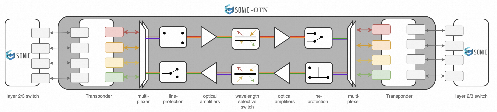
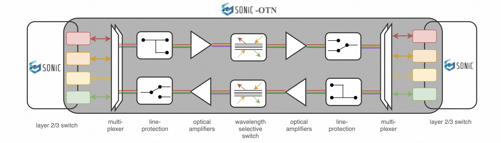
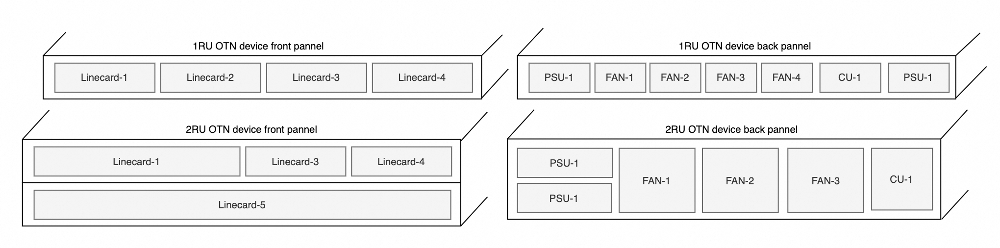
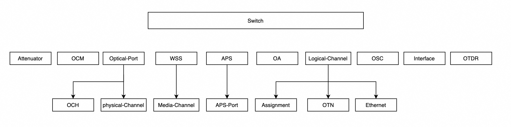

# SAI for Optical Transport Network (OTN)

## Authors

The SONiC-OTN workgroup members: Alibaba, Microsoft, Molex, Nokia, Cisco and Accelink.

### Definitions and Abbreviations


| Abbreviation | Description                       |
| ------------ | --------------------------------- |
| OTN          | Optical Transport Network         |
| DCI          | Data Center Interconnect          |
| CRUD         | CREATE, READ, UPDATE, and DELETE  |
| OA           | Optical Amplifier                 |
| OSC          | Optical Supervisory Channel       |
| OLP          | Optical Line Protection           |
| VOA          | Optical Attenuator                |
| OTDR         | Optical Time Domain Reflectometer |


---

### 1. Scope

This document defines the draft technical specifications for the API in Open Compute Project Switch Abstraction Interface (SAI) used to support the management of optical components on Optical Transport Network (OTN) devices.

### 2. Why SONiC for OTN

OTN devices are deployed for Data Center Interconnects (DCIs), serving as the optical transport layer that connects the ports of switches and routers between geographically dispersed data centers. This enables high-speed, low-latency, and reliable optical connections across long distances. 

OTN devices typically run vendor-specific, proprietary Network Operating Systems (NOSs). This lack of standardization across NOS capabilities and features increases both Capital Expenditure (CapEx) and Operational Expenditure (OpEx) in large-scale DCI networks.

The **SONiC for OTN project** proposes extending SONiC to support optical transport networks, enabling end-to-end deployment across both packet and optical layers. 

For hyperscale network users and service providers, by introducing optical support in SONiC, end-to-end network infrastructure can be managed consistently, from the IP layer (switches and routers) through the optical transport layer (OTN devices). This significantly simplifies network management tools and controllers. Furthermore, it enables a single SDN controller infrastructure across all layers and progress toward an open, converged multi-layer network management solution.

For optical device vendors, existing SONiC NOS infrastructure and generic features, such as user management, security, and management network modules, can be reused. This reduces time to market, improves software quality, and lowers development costs. Joining the SONiC ecosystem also allows vendors and users to work closely through the SONiC open source community as a collaboration platform.





#### 2.1 OTN device and components overview

OTN devices typically employ 1RU or 2RU chassis housing multiple optical line cards, fans, power supply units (PSUs), and control modules. Most optical line cards are pluggable and support diverse functions.



These optical line cards are built on a common set of optical component units that provide core transmission functionality:

- **Variable Optical Attenuator (VOA)** – Adjusts optical signal power levels.
- **Optical Amplifier (OA)** – Boosts optical signals to extend transmission distance.
- **Optical Line Protection (OLP) Switch** – Automatically switches traffic to a backup path when a fault occurs.
- **Optical Supervisory Channel (OSC)** – Transports management and control information.
- **Wavelength Selective Switch (WSS)** – Dynamically routes specific wavelengths in different directions.
- **Optical Channel Monitor (OCM)** – Analyzes the optical spectrum.
- **Optical Time-Domain Reflectometer (OTDR)** – Measures attenuation and reflection losses along fibers.
- **Transponders and Transceivers** – Convert electrical signals into optical signals for fiber transmission.

### 3. SAI for OTN

The OTN SAI definition provides the following core functions:

- Creation and removal of OTN components
- Retrieval of current operational status of OTN components
- Notification handling for failures and hardware data reporting
- Execution of hardware-specific operations, such as optical path switching and triggering optical measurements

All OTN objects are subobjects of the switch root element and do not associate with or interact with existing non-OTN SAI objects.
Below is the hierarchy of SAI with OTN objects:



*The switch object is the root for all OTN objects. It can represent either a physical optical linecard in a multi-linecard system, or the entire optical device (vendor dependent).*

#### 3.1 Experimental OTN Objects

All OTN object definitions are based on OpenConfig models and are designated as experimental objects in SAI. There is no overlap or interaction between IP and OTN objects. This approach is consistent with the DASH and OCS projects and minimizes the impact of OTN changes on SONiC packet switch functionality.

SAI support for OTN objects will be introduced in three phases:

**Phase 1**: Initial OTN support, introducing a minimal set of new objects (OA and VOA) for the simplest optical devices.

**Phase 2**: Incremental support for a complete optical line system, including OCM, OTDR, WSS, APS, and related components.

**Phase 3**: Full OTN support, including transponder objects (logical channels).

In Phase 1, we submitted SAI support for OA and VOA to demonstrate the evaluation and expansion methodology for OTN object support. The corresponding pull request is [PR #2217](https://github.com/opencomputeproject/SAI/pull/2217).

In Phases 2 and 3, we plan to submit additional SAI OTN objects.

Note:  
To minimize disruption to the SAI workgroup due to detailed OTN definitions, we propose the following process: the SONiC-OTN workgroup will first review the changes internally, after which the SAI team will review and approve them.

Below is the list of OTN objects that will be added to SAI:


| Object          | Description                       | SAI File                                                                                                                   | OpenConfig Reference                                                                                                                                                     |
| --------------- | --------------------------------- | -------------------------------------------------------------------------------------------------------------------------- | ------------------------------------------------------------------------------------------------------------------------------------------------------------------------ |
| OA              | Optical amplifier                 | [saiexperimentalotnoa.h](https://github.com/sonic-otn/SAI/blob/master/experimental/saiexperimentalotnoa.h)                 | [openconfig-optical-amplifier.yang](https://github.com/openconfig/public/tree/master/release/models/optical-transport/openconfig-optical-amplifier.yang)                 |
| VOA             | Optical attenuator                | [saiexperimentalotnattenuator.h](https://github.com/sonic-otn/SAI/blob/master/experimental/saiexperimentalotnattenuator.h) | [openconfig-optical-attenuator.yang](https://github.com/openconfig/public/tree/master/release/models/optical-transport/openconfig-optical-attenuator.yang)               |
| Optical Port    | Optical transport port            | TBD                                                                                                                        | [openconfig-transport-line-common.yang](https://github.com/openconfig/public/tree/master/release/models/optical-transport/openconfig-transport-line-common.yang)         |
| OCH             | Optical channel                   | TBD                                                                                                                        | [openconfig-terminal-device.yang](https://github.com/openconfig/public/tree/master/release/models/optical-transport/openconfig-terminal-device.yang)                     |
| WSS             | Wavelength selective switch       | TBD                                                                                                                        | [openconfig-wavelength-router.yang](https://github.com/openconfig/public/tree/master/release/models/optical-transport/openconfig-wavelength-router.yang)                 |
| OMC             | Optical media channel             | TBD                                                                                                                        | [openconfig-wavelength-router.yang](https://github.com/openconfig/public/tree/master/release/models/optical-transport/openconfig-wavelength-router.yang)                 |
| OSC             | Optical supervisory channel       | [saiexperimentalotnosc.h](https://github.com/sonic-otn/SAI/blob/master/experimental/saiexperimentalotnosc.h)               | [openconfig-optical-amplifier.yang](https://github.com/openconfig/public/tree/master/release/models/optical-transport/openconfig-optical-amplifier.yang)                 |
| OTDR            | Optical time-domain reflectometer | TBD                                                                                                                        | Not defined yet                                                                                                                                                          |
| OCM             | Optical channel monitor           | [saiexperimentalotnocm.h](https://github.com/sonic-otn/SAI/blob/master/experimental/saiexperimentalotnocm.h)               | [openconfig-channel-monitor.yang](https://github.com/openconfig/public/tree/master/release/models/optical-transport/openconfig-channel-monitor.yang)                     |
| APS             | Automatic protection switch       | TBD                                                                                                                        | [openconfig-transport-line-protection.yang](https://github.com/openconfig/public/tree/master/release/models/optical-transport/openconfig-transport-line-protection.yang) |
| APS Port        | Automatic protection switch port  | TBD                                                                                                                        | [openconfig-transport-line-protection.yang](https://github.com/openconfig/public/tree/master/release/models/optical-transport/openconfig-transport-line-protection.yang) |
| Logical Channel | Logical channel                   | TBD                                                                                                                        | [openconfig-terminal-device.yang](https://github.com/openconfig/public/tree/master/release/models/optical-transport/openconfig-terminal-device.yang)                     |


---

##### 3.1.1 SAI otnoa object

The file `saiexperimentalotnoa.h` defines the SAI otnoa object, which represents an optical amplifier (OA). OA components amplify optical signals to increase their power and enable long-distance optical transmission.

The OA object supports creation and removal of OA components, configuration of OA components, and retrieval of current operational status.

**otnoa APIs**

```cpp
/**
 * @brief Routing interface methods table retrieved with sai_api_query()
 */
typedef struct _sai_otn_oa_api_t
{
    sai_create_otn_oa_fn                create_otn_oa;
    sai_remove_otn_oa_fn                remove_otn_oa;
    sai_set_otn_oa_attribute_fn         set_otn_oa_attribute;
    sai_get_otn_oa_attribute_fn         get_otn_oa_attribute;
} sai_otn_oa_api_t;
```

**SAI otnoa object attributes**


| SAI Object             | SAI Attributes                      | SAI Data Type                   | create/get/set |
| ---------------------- | ----------------------------------- | ------------------------------- | -------------- |
| SAI_OBJECT_TYPE_OTN_OA | SAI_OTN_OA_ATTR_TYPE                | sai_otn_oa_type_t               | CREATE_AND_SET |
|                        | SAI_OTN_OA_ATTR_TARGET_GAIN         | sai_uint32_t                    | CREATE_AND_SET |
|                        | SAI_OTN_OA_ATTR_MIN_GAIN            | sai_uint32_t                    | CREATE_AND_SET |
|                        | SAI_OTN_OA_ATTR_MAX_GAIN            | sai_uint32_t                    | CREATE_AND_SET |
|                        | SAI_OTN_OA_ATTR_TARGET_GAIN_TILT    | sai_uint32_t                    | CREATE_AND_SET |
|                        | SAI_OTN_OA_ATTR_GAIN_RANGE          | sai_otn_oa_gain_range_t         | CREATE_AND_SET |
|                        | SAI_OTN_OA_ATTR_AMP_MODE            | sai_otn_oa_amp_mode_t           | CREATE_AND_SET |
|                        | SAI_OTN_OA_ATTR_TARGET_OUTPUT_POWER | sai_int32_t                     | CREATE_AND_SET |
|                        | SAI_OTN_OA_ATTR_MAX_OUTPUT_POWER    | sai_int32_t                     | CREATE_AND_SET |
|                        | SAI_OTN_OA_ATTR_ENABLED             | bool                            | CREATE_AND_SET |
|                        | SAI_OTN_OA_ATTR_FIBER_TYPE_PROFILE  | sai_otn_oa_fiber_type_profile_t | CREATE_AND_SET |
|                        | SAI_OTN_OA_ATTR_INGRESS_PORT        | char                            | READ_ONLY      |
|                        | SAI_OTN_OA_ATTR_EGRESS_PORT         | char                            | READ_ONLY      |
|                        | SAI_OTN_OA_ATTR_ACTUAL_GAIN         | sai_int32_t                     | READ_ONLY      |
|                        | SAI_OTN_OA_ATTR_ACTUAL_GAIN_TILT    | sai_int32_t                     | READ_ONLY      |
|                        | SAI_OTN_OA_ATTR_INPUT_POWER_TOTAL   | sai_int32_t                     | READ_ONLY      |
|                        | SAI_OTN_OA_ATTR_INPUT_POWER_C_BAND  | sai_int32_t                     | READ_ONLY      |
|                        | SAI_OTN_OA_ATTR_INPUT_POWER_L_BAND  | sai_int32_t                     | READ_ONLY      |
|                        | SAI_OTN_OA_ATTR_OUTPUT_POWER_TOTAL  | sai_int32_t                     | READ_ONLY      |
|                        | SAI_OTN_OA_ATTR_OUTPUT_POWER_C_BAND | sai_int32_t                     | READ_ONLY      |
|                        | SAI_OTN_OA_ATTR_OUTPUT_POWER_L_BAND | sai_int32_t                     | READ_ONLY      |
|                        | SAI_OTN_OA_ATTR_LASER_BIAS_CURRENT  | sai_int32_t                     | READ_ONLY      |
|                        | SAI_OTN_OA_ATTR_OPTICAL_RETURN_LOSS | sai_int32_t                     | READ_ONLY      |


---

##### 3.1.2 SAI otnattenuator object

The file `saiexperimentalotnattenuator.h` defines the SAI otnattenuator object, which represents an optical attenuator (VOA). VOA components reduce optical signal power to maintain proper signal levels and prevent receiver saturation.

The VOA object supports creation and removal of VOA components, configuration of VOA components, and retrieval of current operational status.

**otnattenuator APIs**

```cpp
/**
 * @brief Routing interface methods table retrieved with sai_api_query()
 */
typedef struct _sai_otn_attenuator_api_t
{
    sai_create_otn_attenuator_fn                create_otn_attenuator;
    sai_remove_otn_attenuator_fn                remove_otn_attenuator;
    sai_set_otn_attenuator_attribute_fn         set_otn_attenuator_attribute;
    sai_get_otn_attenuator_attribute_fn         get_otn_attenuator_attribute;
} sai_otn_attenuator_api_t;
```

**SAI otnattenuator object attributes**


| SAI Object                | SAI Attributes                                             | SAI Data Type             | create/get/set |
| ------------------------- | ---------------------------------------------------------- | ------------------------- | -------------- |
| SAI_OBJECT_OTN_ATTENUATOR | SAI_OTN_ATTENUATOR_ATTR_ATTENUATION_MODE                   | sai_otn_attenuator_mode_t | CREATE_AND_SET |
|                           | SAI_OTN_ATTENUATOR_ATTR_TARGET_OUTPUT_POWER                | sai_uint32_t              | CREATE_AND_SET |
|                           | SAI_OTN_ATTENUATOR_ATTR_ATTENUATION                        | sai_uint32_t              | CREATE_AND_SET |
|                           | SAI_OTN_ATTENUATOR_ATTR_ENABLED                            | sai_uint32_t              | CREATE_AND_SET |
|                           | SAI_OTN_ATTENUATOR_ATTR_MAX_OUTPUT_POWER                   | sai_int32_t               | CREATE_AND_SET |
|                           | SAI_OTN_ATTENUATOR_ATTR_MAX_OUTPUT_POWER_THRESHOLD         | sai_int32_t               | CREATE_AND_SET |
|                           | SAI_OTN_ATTENUATOR_ATTR_INGRESS_PORT                       | char                      | READ_ONLY      |
|                           | SAI_OTN_ATTENUATOR_ATTR_EGRESS_PORT                        | char                      | READ_ONLY      |
|                           | SAI_OTN_ATTENUATOR_ATTR_SYSTEM_DERIVED_TARGET_OUTPUT_POWER | sai_int32_t               | READ_ONLY      |
|                           | SAI_OTN_ATTENUATOR_ATTR_ACTUAL_ATTENUATION                 | sai_int32_t               | READ_ONLY      |
|                           | SAI_OTN_ATTENUATOR_ATTR_OUTPUT_POWER_TOTAL                 | sai_int32_t               | READ_ONLY      |
|                           | SAI_OTN_ATTENUATOR_ATTR_OPTICAL_RETURN_LOSS                | sai_int32_t               | READ_ONLY      |


---

#### 3.2 New Tags in SAI OTN Objects

**Precision Tag**  
Many OTN objects include floating-point values (e.g., optical power, attenuation, Pre-FEC BER). These values require different levels of precision — optical power may need two decimal places, while Pre-FEC BER may require up to 18.

Currently, SAI supports only `uint64_t` statistics, without float support. To enable floats without breaking compatibility, we propose introducing the `@precision` tag, allowing attributes and statistics to specify required precision. Here are examples:

```
    /**
     * @brief Positive gain applied by the amplifier in units of 0.01dB.
     * This is used when the amp-mode is in CONSTANT_GAIN or DYNAMIC_GAIN
     * mode to set the target gain that the amplifier should achieve.
     *
     * @type sai_uint32_t
     * @flags CREATE_AND_SET
     * @default 2000
     * @precision 2
     */
    SAI_OTN_OA_ATTR_TARGET_GAIN,
```

In the SAI metadata, the `valueprecision` field in `attrInfo` is used to represent the precision.

#### 3.3 SAI OTN Notification

SONiC has a notification mechanism supporting notifications from Vendor SAI (driver) to SWSS. Currently the notification is only supported by the root SAI object (switch), in which all notification callback attributes and prototypes are defined in `saiswitch.h`.

In order to separate OTN notification code from the existing switch code, a notification attribute for OTN is declared in SAI extension `saiswitchextensions.h`. 

```c

/**
 * @brief OTN alarm event notification
 *
 * @count data[count]
 *
 * @param[in] count Number of notifications
 * @param[in] data Array of OTN alarm events
 */
typedef void (*sai_otn_alarm_event_notification_fn)(
        _In_ uint32_t count,
        _In_ const sai_otn_alarm_event_data_t *data);

/**
 * @brief SAI switch attribute extensions.
 *
 * @flags free
 */
typedef enum _sai_switch_attr_extensions_t
{
     ....
     /**
     * @brief OTN alarm event notification callback function passed to the adapter.
     *
     * Use sai_otn_alarm_event_notification_fn as notification function.
     *
     * @type sai_pointer_t sai_otn_alarm_event_notification_fn
     * @flags CREATE_AND_SET
     * @default NULL
     */
    SAI_SWITCH_ATTR_OTN_ALARM_EVENT_NOTIFY,

    SAI_SWITCH_ATTR_EXTENSIONS_RANGE_END

} sai_switch_attr_extensions_t;

```

### 4. How to Manage OTN objects in Syncd

Syncd provides a bridging function between the common control module SWSS and the vendor-specific SAI driver/SDK. It is mostly transparent to the business logic.

**Code physical separation**

`FlexCounter` manages configuration of Counter DB for SAI object monitoring. Separate `FlexCounterOtn` files are created for managing OTN SAI object attributes in Counter DB. This reduces code-change contention between the OTN project and the rest of SONiC development.

```Diff
   --- syncd
    |--- FlexCounter.(h|cpp)
+   |--- FlexCounterOtn.(h|cpp)
```

Similarly, SAI object (de)serialization is also implemented in separate files `meta/sai_serialize_otn` from the main file `sai-serialize`.

**Runtime logical flow isolation**

Processing for OTN SAI objects and APIs is added to the existing Syncd infrastructure with clear isolation from existing logic. This is done by placing OTN object processing at the end of current logic so that OTN logic is not in the packet-switching code path. The following snippet shows adding the counter plugin for OTN:

```Diff
FlexCounter.cpp

void FlexCounter::addCounter {
    ...
        else
        {
+           if (m_flexCounterOtn->addCounter(vid, rid, objectType, field, idStrings))
+           {
+               continue;
+           }

            SWSS_LOG_ERROR("Object type and field combination is not supported, object type %s, field %s",
                    sai_serialize_object_type(objectType).c_str(),
                    field.c_str());
        }
    }

//same changes for the following functions
void FlexCounter::addCounterPlugin {}
void FlexCounter::removeCounter {}

```

### 5. How to manage OTN objects in SWSS

The same design of Syncd is adopted to reuse SWSS infrastructure while keeping the OTN objects relatively isolated from existing packet switching objects.

**Code physical separation**

For the ConfigMgr module, which listens for Config DB changes, a separate daemon is created to process OTN device configuration changes. Upon any change to OTN tables in Config DB, OTN ConfigMgr updates APP DB with the new configuration accordingly.

```Diff
   --- cfgmgr
    |--- intfmgr.(h|cpp)
    |--- intfmgrd.cpp
    |--- ....
+   |--- otnmgr.(h|cpp)
+   |--- otnmgrd.cpp
```

For orchagent, which processes changes in APP DB, a separate folder is created to hold the code for processing OTN objects in APP DB.

```Diff
   --- orchagent
    |--- switch
    |--- ....
    |--- dash
+   |--- otn
+      |--- objectorch.(h|cpp) - generic for all objects
+      |--- attenuatorch.(h|cpp)
+      |--- oaorch.(h|cpp)
+      |--- ocmorch.(h|cpp)
+      |--- ....
+      |--- otnorchdaemon.(h|cpp)
```

**Runtime logical flow isolation**

In orchagent `main.cpp`, a new switch type for OTN is used to decide which orchagent daemon should be launched. Switch type is configured in the DEVICE_METADATA table.

```Diff
    shared_ptr<OrchDaemon> orchDaemon;
+   if(gMySwitchType == SWITCH_TYPE_OTN)
+   {
+       orchDaemon = make_shared<OtnOrchDaemon>(&appl_db, &config_db, &state_db, chassis_app_db.get(), zmq_server.get());
+   }
    else if (gMySwitchType != "fabric")
    {
        orchDaemon = make_shared<OrchDaemon>(&appl_db, &config_db, &state_db, chassis_app_db.get(), zmq_server.get());
        if (gMySwitchType == "voq")
        {
            orchDaemon->setFabricEnabled(true);
            orchDaemon->setFabricPortStatEnabled(true);
            orchDaemon->setFabricQueueStatEnabled(false);
        }
    }
    else
    {
        orchDaemon = make_shared<FabricOrchDaemon>(&appl_db, &config_db, &state_db, chassis_app_db.get(), zmq_server.get());
    }

```

### 6. Summary

Value proposition of SONiC OTN support:

- A unified open source NOS for packet switches and optical devices in hyper-scale networks, enabling a consistent multi-layer (L0–L4) network orchestration solution.
- Optical vendors can leverage the SONiC OTN common codebase and community resources for optical NOS evolution.
- Increased SONiC community influence in the optical networking domain.

The design objective is to reuse existing infrastructure and features while keeping OTN changes isolated, with no regression on packet switches.