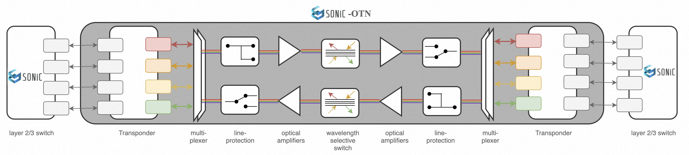

# SAI for Optical Transport Network (OTN)

## Authors
The SONiC-OTN workgroup members: Alibaba, Microsoft, Molex, Nokia, Cisco and Accelink.

### Definitions and Abbreviations

| Abbreviation | Description |
|--------------|-------------|
| OTSS | Optical Transport State Service |
| OTAI | Optical Transport Abstraction Interface |
| OTN | Optical Transport Network |
| CRUD | CREATE, READ, UPDATE, and DELETE |
| OA | Optical Amplifier |
| OSC | Optical Supervisory Channel |
| OLP | Optical Line Protection |
| VOA | Optical Attenuator |
| OTDR | Optical Time Domain Reflectometer |

---

### 1. Introduction to SONiC for Optical Networks
In recent years, Optical Transport Networks (OTNs) have been increasingly deployed for Data Center Interconnects (DCIs), enabling high-speed, low-latency, and reliable connections between data centers. With the advent of digital coherent technology, the adoption of software-defined networking (SDN), and the growing demand for large-scale DCIs, OTNs have evolved toward openness and disaggregation. As a result, modular OTN equipment with standardized northbound interfaces and data models has become widely used.

However, the Network Operating Systems (NOSes) running on these open and disaggregated optical devices are still proprietary and vary across OTN vendors. These proprietary NOSes differ in performance, alarm handling, CLI capabilities, and security features, often following independent release schedules. This lack of standardization increases both Capital Expenditures (CapEx) and Operational Expenditures (OpEx) in large-scale DCI networks.

To address this, the **SONiC for OTN project** proposes extending SONiC to support optical transport networks. This would enable end-to-end deployment of SONiC across packet and optical layers. The solution would support optical transponders and muxponders, as well as optical line systems such as OLP switches, OAs, and Wavelength Selective Switches (WSSes), providing optical interconnects between IP switches and routers.




---

### 2. Introduction to Optical Transport Network Devices
OTN devices deliver high-speed, reliable, and efficient data transmission over optical fibers. For DCI use cases, these devices typically use 1RU or 2RU chassis that house multiple optical linecards, fans, power supply units (PSUs), and control modules. The optical linecards are pluggable and support a variety of functions.


Despite functional differences among vendors, these linecards are built on a common set of optical component units that provide core transmission functionalities:

* **Transponders and Transceivers** – Convert electrical signals into optical signals for fiber transmission.
* **Multiplexer (Mux)** – Combines multiple wavelengths onto a single fiber.
* **Demultiplexer (Demux)** – Separates multiple wavelengths from a single fiber.
* **Optical Line Protection (OLP) Switch** – Automatically switches traffic to a backup path when a fault occurs.
* **Optical Amplifier (OA)** – Boosts optical signals to extend transmission distance.
* **Wavelength Selective Switch (WSS)** – Dynamically routes specific wavelengths in different directions.
* **Optical Supervisory Channel (OSC)** – Transports management and control information.
* **Variable Optical Attenuator (VOA)** – Adjusts optical signal power levels.
* **Optical Channel Monitor (OCM)** – Analyzes the optical spectrum.
* **Optical Time-Domain Reflectometer (OTDR)** – Measures attenuation and reflection losses along fibers.


---

### 3. Expanding SAI for Optical Transport Networks
The Switch Abstraction Interface (SAI) is a vendor-independent programming model for network equipment. Instead of introducing a new OTAI, the SONiC community has decided to **extend SAI to support OTN**.

Below is the hierarchy of SAI with OTN objects:


*The switch object is the root for all OTN objects. It can represent either a physical optical linecard in a multi-linecard system or optical components in a pizza box. The switch object may contain both real optical components and logical objects.*

#### 3.1 OTN Objects

All these OTN objects definitions are based on OpenConfig models.

| Object | Description | SAI File | OpenConfig Reference |
|--------|-------------|----------|----------------------|
| Optical Port | Optical transport port | [saiopticalport.h](https://github.com/Weitang-Zheng/SAI/blob/test-merge/inc/saiopticalport.h) | [openconfig-transport-line-common.yang](https://github.com/openconfig/public/tree/master/release/models/optical-transport/openconfig-transport-line-common.yang) |
| Physical Channel | Physical channel | [saiphysicalchannel.h](https://github.com/Weitang-Zheng/SAI/blob/test-merge/inc/saiphysicalchannel.h) | [openconfig-platform-transceiver.yang](https://github.com/openconfig/public/tree/master/release/models/platform/openconfig-platform-transceiver.yang) |
| Logical Channel | Logical channel | [sailogicalchannel.h](https://github.com/Weitang-Zheng/SAI/blob/test-merge/inc/sailogicalchannel.h) | [openconfig-terminal-device.yang](https://github.com/openconfig/public/tree/master/release/models/optical-transport/openconfig-terminal-device.yang) |
| Ethernet | Ethernet | [saiethernet.h](https://github.com/Weitang-Zheng/SAI/blob/test-merge/inc/saiethernet.h) | [openconfig-if-ethernet.yang](https://github.com/openconfig/public/tree/master/release/models/interfaces/openconfig-if-ethernet.yang) |
| Assignment | Optical assignment | [saiassignment.h](https://github.com/Weitang-Zheng/SAI/blob/test-merge/inc/saiassignment.h) | [openconfig-terminal-device.yang](https://github.com/openconfig/public/tree/master/release/models/optical-transport/openconfig-terminal-device.yang) |
| OTN | OTN protocol | [saiotn.h](https://github.com/Weitang-Zheng/SAI/blob/test-merge/inc/saiotn.h) | [openconfig-terminal-device.yang](https://github.com/openconfig/public/tree/master/release/models/optical-transport/openconfig-terminal-device.yang) |
| OCH | Optical channel | [saioch.h](https://github.com/Weitang-Zheng/SAI/blob/test-merge/inc/saioch.h) | [openconfig-terminal-device.yang](https://github.com/openconfig/public/tree/master/release/models/optical-transport/openconfig-terminal-device.yang) |
| OA | Optical amplifier | [saioa.h](https://github.com/Weitang-Zheng/SAI/blob/test-merge/inc/saioa.h) | [openconfig-optical-amplifier.yang](https://github.com/openconfig/public/tree/master/release/models/optical-transport/openconfig-optical-amplifier.yang) |
| WSS | Wavelength selective switch | [saiwss.h](https://github.com/Weitang-Zheng/SAI/blob/test-merge/inc/saiwss.h) | [openconfig-wavelength-router.yang](https://github.com/openconfig/public/tree/master/release/models/optical-transport/openconfig-wavelength-router.yang) |
| OMC | Optical media channel | [saimediachannel.h](https://github.com/Weitang-Zheng/SAI/blob/test-merge/inc/saimediachannel.h) | [openconfig-wavelength-router.yang](https://github.com/openconfig/public/tree/master/release/models/optical-transport/openconfig-wavelength-router.yang) |
| OSC | Optical supervisory channel | [saiosc.h](https://github.com/Weitang-Zheng/SAI/blob/test-merge/inc/saiosc.h) | [openconfig-optical-amplifier.yang](https://github.com/openconfig/public/tree/master/release/models/optical-transport/openconfig-optical-amplifier.yang) |
| Interface | Interface | [saiinterface.h](https://github.com/Weitang-Zheng/SAI/blob/test-merge/inc/saiinterface.h) | [openconfig-interfaces.yang](https://github.com/openconfig/public/tree/master/release/models/interfaces/openconfig-interfaces.yang) |
| OTDR | Optical time-domain reflectometer | [saiotdr.h](https://github.com/Weitang-Zheng/SAI/blob/test-merge/inc/saiotdr.h) | Not defined yet |
| OCM | Optical channel monitor | [saiocm.h](https://github.com/Weitang-Zheng/SAI/blob/test-merge/inc/saiocm.h) | [openconfig-channel-monitor.yang](https://github.com/openconfig/public/tree/master/release/models/optical-transport/openconfig-channel-monitor.yang) |
| VOA | Optical attenuator | [saiattenuator.h](https://github.com/Weitang-Zheng/SAI/blob/test-merge/inc/saiattenuator.h) | [openconfig-optical-attenuator.yang](https://github.com/openconfig/public/tree/master/release/models/optical-transport/openconfig-optical-attenuator.yang) |
| APS | Automatic protection switch | [saiaps.h](https://github.com/Weitang-Zheng/SAI/blob/test-merge/inc/saiaps.h) | [openconfig-transport-line-protection.yang](https://github.com/openconfig/public/tree/master/release/models/optical-transport/openconfig-transport-line-protection.yang) |
| APS Port | Automatic protection switch port | [saiapsport.h](https://github.com/Weitang-Zheng/SAI/blob/test-merge/inc/saiapsport.h) | [openconfig-transport-line-protection.yang](https://github.com/openconfig/public/tree/master/release/models/optical-transport/openconfig-transport-line-protection.yang) |

---

#### 3.2 New Tags in OTN Objects

**Precision Tag**  
Many OTN objects include floating-point values (e.g., optical power, attenuation, Pre-FEC BER). These values require different levels of precision — optical power may need two decimal places, while Pre-FEC BER may require up to 18.

Currently, SAI supports only `uint64_t` statistics, without float support. To enable floats without breaking compatibility, we propose introducing the `@precision` tag, allowing attributes and statistics to specify required precision. Here are examples:

```
/**
* @brief Output power
*
* @type sai_int64_t
* @precision 2
*/
SAI_OPTICAL_PORT_STAT_OUTPUT_POWER,

/**
* @brief Los threshold
*
* @type sai_int64_t
* @flags CREATE_AND_SET
* @precision 2
*/
SAI_OPTICAL_PORT_ATTR_LOS_THRESHOLD,
```
```
/**
* @brief Bit error rate before forward error correction
*
* @type sai_uint64_t
* @precision 18
*/
SAI_OTN_STAT_PRE_FEC_BER,
```

**Action Tag**  
Some OTN objects perform actions (e.g., APS switching paths, OCM scanning spectrum, OTDR scanning reflection losses). These actions are triggered by upper-layer applications such as Syncd. To support this, we propose an `@isaction` tag for attributes that represent one-time actions. These values would not be stored in the ASIC database.

```
/**
* @brief Scan
*
* @type bool
* @flags CREATE_AND_SET
* @isaction true
*/
SAI_OCM_ATTR_SCAN,
```
```
/**
* @brief Active path
*
* @type sai_aps_active_path_t
* @flags CREATE_AND_SET
* @isaction true
*/
SAI_APS_ATTR_ACTIVE_PATH,
```

---

#### 3.3 Metadata Modifications
To support `@precision` and `@isaction`, modifications to SAI metadata are required. Specifically:
- Introduce `sai_stat_metadata_t` with a precision field for statistics.
```  
typedef struct _sai_stat_metadata_t
{
    /**
     * @brief Specifies valid SAI object type.
     */
    sai_object_type_t                           objecttype;

    /**
     * @brief Specifies valid statistics id for this object type.
     */
    sai_stat_id_t                               statid;

    /**
     * @brief Specifies valid statistics id name for this object type.
     */
    const char* const                           statidname;

    /**
     * @brief Specifies valid statistics id name of kebab case naming style.
     */
    const char* const                           statidkebabname;

    /**
     * @brief Specifies valid statistics id name of camel case naming style.
     */
    const char* const                           statidcamelname;

    /**
     * @brief Specifies value decimal precision for this statistics.
     */
    sai_value_precision_t                       valueprecision;
} sai_stat_metadata_t;
```

- Extend `sai_attr_metadata_t` with `isaction` and `precision` fields.

```
typedef struct _sai_attr_metadata_t
{
    ......
    /**
     * @brief Indicates whether attribute is an action.
     *
     * If true, when calling SET API successfully, the value will NOT be saved in local
     * db for warm-reboot (or cold-reboot) flow to recover this configuration.
     */
    bool                                        isaction;

    /**
     * @brief Specifies value decimal precision for this attribute.
     */
    sai_value_precision_t                       valueprecision;
} sai_attr_metadata_t;
```
---

### 4. OTN Experimental PR
An experimental PR with all OTN-related changes is available: [GitHub PR](https://github.com/Weitang-Zheng/SAI/pull/1).  

This PR has been reviewed by the SONiC-OTN workgroup and Kamil Cudnik.

---

### 5. Design and Merge Considerations
1. During the meeting with SAI subgroup on 8/21/2025, it is agreed that new OTN objects be defined using SAI [experimental extension mechanism](https://github.com/opencomputeproject/SAI/tree/master/experimental), same as DASH project. This would eliminate the impact of OTN changes on SONIC packet switch side.
  
2. New SAI object for OTN device will be introduced to upstream in multiple PRs for easy review and approval by SAI team. PRs will be based on changes mentioned in section 4 with modifications incorporating the feedbacks from SAI/SONiC community. The PRs will be submitted in the following phases:
- Minimum set of new objects (OA and VOA) for simplest optical device.
- Incremental support for complete optical line system (OCM, OTDR, WSS and APS etc.)
- Transponder support (Logical/physical channel, OTN protocol, OCH and OMC etc.)
