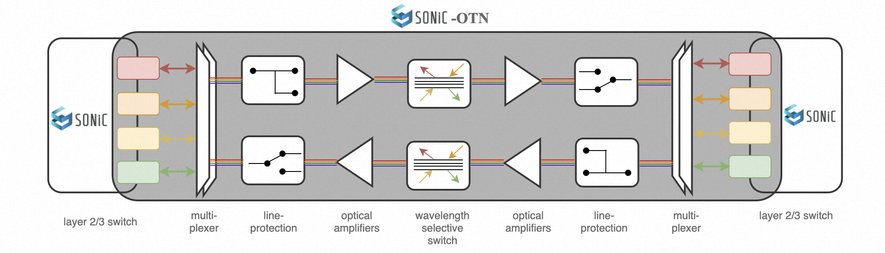
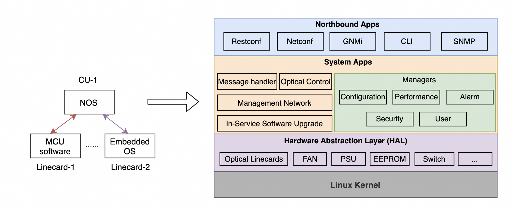
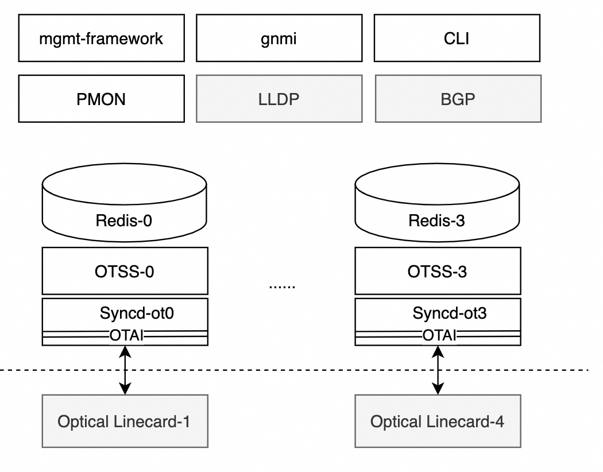

## Authors
Alibaba : Weitang Zheng

## List of Changes
| Version | Changes | Name | Date |
| :-----| :---- | :----- | :----- |
| V0.0.1 | Initial Draft | Weitang Zheng | 2024-6-18 |


### 1. SONiC for optical network introduction
In recent years, the optical transport network (OTN) for data center interconnection (DCI) has been emerged to provide high-speed, low-latency, and reliable interconnections between data centers. The OTN network has transformed to openness and disaggregation, due to the advent of digital coherent technology, the practices of software-defined networking (SDN), and the large demand of DCI networks. Modular OTN equipment with standardized northbound interfaces and data models are widely deployed in the DCI industry.

However the network operating systems (NOSes) running on these open and disaggregated optical network device are remain proprietary OS and vary among different equipment vendors. These proprietary NOSes offer diverse performances and alarms functionalities, CLI capabilities, and security features with different release schedules, which increase the Capital expenditures (CapEx) and operating expenses (OpEx) in a large scale DCI network. 

To overcome this, SONiC for OTN project is proposed to expand SONiC to support the optical transport network. Then SONiC can be deployed to the end to end packet and optical network, it can support optical transponders and muxponders, optical line equipment such as optical amplifiers, wavelength selective switches, which can provide optical interconnections between IP switch and routers.




### 2. optical transport network device introduction
The optical transport network device provides high-speed, reliable and efficient data transmission over optical fibers. For DCI, the optical transport network device is typically 1RU (Rack Unit) and 2RU chassis with multiple optical linecard, FAN, PSU and control units. All these linecard are pluggable and provide different functionalities.


Although these optical linecard provide different functionalities and diverse between different OTN device vendors, but these optical linecard are composed by the same basic optical component units. These optical components offers the common optical transmission functionalities such as:
* Transponders and Transceivers: Convert electrical signals from servers and network equipment into optical signals for transmission over fiber optics
* Multiplexer (Mux): combine multiple optical signals of different wavelengths onto a single optical fiber for transmission.
* Demultiplexer (Demux): separate multiple optical signals of different wavelengths from a single optical fiber.
* Optical Line Protection (OLP): automatically switching traffic from a primary optical path to a backup path when a fault is detected.
* Optical Amplifier (OA): amplify the optical signal to a higher power level to increase the transmission distance over optical fiber.
* Wavelength Selective Switch (WSS): dynamically route specific wavelengths of light to different directions.
* Optical Supervisory Channel (OSC): channel used for transmitting management, control information alongside the payload channels.
* Variable Optical Attenuator (VOA): attenuate optical signal power level
* Optical Channel Monitor (OCM): OCM is used to monitor and analyze the optical spectrum of optical signals
* Optical Time-Domain Reflectometer (OTDR): OTDR is used to measure the attenuation and reflection losses along the fiber.


The control unit (CU) is the main control plane component of the optical transport network device. The OTN device's NOS runs on the CU, and interacts with optical linecar's autonomous systems which are MUC software or embedded operating system. A typical optical NOS architecture on CU has four layers:
* Northbound applications layer: provides Restconf, Netconf, GNMi, CLI and SNMP interfaces
* System applications layer: provides message handler, optical control, management network, in-service software upgrade, managers etc.
* Hardware Abstraction layer (HAL): provides hardware abstraction layer for optical linecard, FAN, PSU, EEPROM, etc.
* Linux kernel layer: provides Linux kernel and network stack
  


### 3. SONiC for OTN architecture
In order to expand SONiC to support OTN, multiple OTN services and enhancements are introduced to fulfill OTN product requirements. The OTN system maximally reuses the existing SONiC architecture and features, and minimizes the impact on the existing SONiC architecture and features. 

For an OTN device, user can compile the target binary with the following command, and run the binary on the target OTN device.
```
make configure PLATFORM=[OTN_PLATFORMS] PLATFORM_ARCH=arm64
OTN_PLATFORMS = [ot-accelink, ot-molex, ot-infinera, ot-vs]
make target/sonic-OTN_PLATFORMS.bin
```

The prefix 'ot-' stands for the optical transport platform, which is used to distinguish whether the target platform is optical transport or not. The SONiC system can initialize the target services and module features based on the platform type.
The following new features for optical transport device are proposed:
1. Enhance the mgmt-framework to support OTN features
   Multiple Optical Openconfig YANG models are supported; Support Multi ASIC architecture and query and set data from and to multiple optical linecards.

2. Enhance the gnmi module to support subscribe an URL without a key specified.

3. Enhance the PMON module to support performance monitoring (PM) and alarm monitoring for peripheral devices.

4. Introduce OTN cli commands in sonic-utilities，and auto generated CLI commands based on Openconfig Yang models.

5. Introduce Optical Transport State Service (OTSS), Syncd for optical transport (Syncd-OT), and optical transport abstraction interface (OTAI)

6. Introduce optical transport platforms and device in sonic-buildimage repository, enable OTSS, Syncd-OT and OTAI on optical transport platform.

The following diagram shows the SONiC for OTN architecture. The platform type is used as the feature toggle of the SONiC system. When the platform type start with "ot-", the SONiC system will enable all OTN features and disable unnecessary IP layer features.


There are three modifications to the SONiC system.
1. Add OTN platforms and devices in sonic-buildimage repository.
2. Customize feature and service based on the OTN platform type
   * Disable IP layer and unnecessary features, including dhcp-relay container, snmp container, teamd container, etc.
   * Disable SWSS container and Syncd container.
   * Keep the LLDP container and BGP container, but enable only one global instance without per-asic-scope instances.
   * Add and enable OTSS and Syncd-OT instance per-asic-scope.
3. Add OTN required enhancement in sonic-mgmt-common module and sonic-utilities module.

Here is an example of running docker images on the `virtual-ot` platform with 4 ASICs (optical linecard). It contains 4 instances of Syncd-ot and otss, 5 instances of redis database, 1 global instance of pmon, lldp, gnmi, bgp and eventd.
```
admin@sonic:~$ docker ps
CONTAINER ID   IMAGE                                COMMAND                  CREATED         STATUS              PORTS     NAMES
dfeeb018a154   docker-syncd-ot-vs:latest            "/usr/local/bin/supe…"   4 minutes ago   Up 4 minutes                  syncd-ot2
82de24801ef4   docker-syncd-ot-vs:latest            "/usr/local/bin/supe…"   4 minutes ago   Up 4 minutes                  syncd-ot3
0670ff941482   docker-orchagent-ot:latest           "/usr/bin/docker-ini…"   6 minutes ago   Up 6 minutes                  otss2
c77ac1b8964c   docker-orchagent-ot:latest           "/usr/bin/docker-ini…"   6 minutes ago   Up 6 minutes                  otss3
b71da3b963e9   docker-orchagent-ot:latest           "/usr/bin/docker-ini…"   5 weeks ago     Up 6 minutes                  otss1
0e210df99993   docker-syncd-ot-vs:latest            "/usr/local/bin/supe…"   5 weeks ago     Up 4 minutes                  syncd-ot1
3f1db908acf3   docker-orchagent-ot:latest           "/usr/bin/docker-ini…"   5 weeks ago     Up 6 minutes                  otss0
fa1a131a2681   docker-syncd-ot-vs:latest            "/usr/local/bin/supe…"   5 weeks ago     Up 4 minutes                  syncd-ot0
9a9790c8f9cf   docker-platform-monitor:latest       "/usr/bin/docker_ini…"   5 weeks ago     Up About a minute             pmon
6e4f1ac3bb0b   docker-sonic-mgmt-framework:latest   "/usr/local/bin/supe…"   5 weeks ago     Up About a minute             mgmt-framework
3e1a822c8156   docker-lldp:latest                   "/usr/bin/docker-lld…"   5 weeks ago     Up About a minute             lldp
2b4014c5bcad   docker-sonic-gnmi:latest             "/usr/local/bin/supe…"   5 weeks ago     Up About a minute             gnmi
445c9515ae9e   docker-fpm-frr:latest                "/usr/bin/docker_ini…"   5 weeks ago     Up 4 minutes                  bgp
99df879bc10f   docker-eventd:latest                 "/usr/local/bin/supe…"   5 weeks ago     Up 6 minutes                  eventd
4d8e139ed7cd   docker-database:latest               "/usr/local/bin/dock…"   5 weeks ago     Up 6 minutes                  database0
27f7ea8cf95d   docker-database:latest               "/usr/local/bin/dock…"   5 weeks ago     Up 6 minutes                  database3
47b2f2a37d0c   docker-database:latest               "/usr/local/bin/dock…"   5 weeks ago     Up 6 minutes                  database1
f11c2a50d535   docker-database:latest               "/usr/local/bin/dock…"   5 weeks ago     Up 6 minutes                  database2
db6a10516000   docker-database:latest               "/usr/local/bin/dock…"   5 weeks ago     Up 6 minutes                  database
admin@sonic:~$
```

### 4. How to implement these OTN features
#### 4.1 How to add OTN platforms and devices
Add multiple new otn platforms types in `sonic-buildimage/platform` folder, the optical platforms include the prefix 'ot-' in the platform name. The optical platform folder contains an optical platform specific target files for syncd-ot, ONIE, OTAI library, etc.

```
sonic-buildimage/platform
├── ot-accelink
├── ot-cisco
├── ot-infinera
├── ot-molex
├── ot-vs
│   ├── docker-syncd-ot-vs
│   │   ├── Dockerfile.j2
│   │   ├── critical_processes
│   │   └── supervisord.conf
│   ├── docker-syncd-ot-vs.dep
│   ├── docker-syncd-ot-vs.mk
│   ├── kvm-image.dep
│   ├── kvm-image.mk
│   ├── one-image.dep
│   ├── one-image.mk
│   ├── onie.dep
│   ├── onie.mk
│   ├── platform.conf
│   ├── rules.dep
│   ├── rules.mk
│   ├── sonic-version.dep
│   ├── sonic-version.mk
│   ├── syncd-ot-vs.dep
│   └── syncd-ot-vs.mk
```
Then adds multiple otn device in the device folder. This folder contains an OTN device specific configuration files for ASIC, PMON, SKU, default linecard configuration templates and flexcounter configurations, etc. For an OTN platform, the platform_asic should start with "ot-" prefix, the ASIC number stands for the number of optical linecards in the system.
```
sonic-buildimage/device/
├── virtual-ot
│   └── x86_64-ot_kvm_x86_64_4_asic-r0
│       ├── asic.conf
│       ├── default_sku
│       ├── installer.conf
│       ├── linecards
│       │   ├── e110c
│       │   │   ├── config_db.json.j2
│       │   │   └── flexcounter.json
│       │   └── p230c
│       │       ├── L1_400G_CA_100GE
│       │       ├── config_db.json.j2
│       │       └── flexcounter.json
│       ├── platform_asic
│       ├── plugins
│       │   └── eeprom.py
│       └── pmon_daemon_control.json
```

#### 4.2 How to customize feature and service
SONiC provides two mechanisms to customize feature and services. 
* In "rules/config", multiple IP layer features can be disabled on the OTN platform.
* In the "files/build_templates/init_cfg.json.j2", if the platform type start with "ot-", 
  1. the WSS, Syncd, dhcp_relay, and snmp services are disabled.
  2. the OTSS and Syncd-OT services are enabled per-asic-scope.
  3. the LLDP and BPG services are enabled with only one global instance, without per-asic-scope instances.
```

    
    
    
    
    
    
    

```

### 4.3 The OTAI, Synd-OT and OTSS service
[Optical Transport Abstraction Interface (OTAI)](./OTAI-v0.0.1-specification.md) is a standard interface for managing and controlling the optical transport components.
OTAI provides CRUD APIs for all OTN components and objects, notifications for OTN status change and data reporting. All attributes defined in OTAI are compatible with the OpenConfig model.

[Syncd-OT](./otn_sycd_hld.md) provides a mechanism to allow the synchronization of the optical transport network state with actual optical transport components and hardware. It includes the initialization, the configuration, the PM collections and the alarms of the optical components.

[The Optical Transport State Service (OTSS)](./otn_otss_hld.md) is a collection of software that provides a database interface for communication with and state representation of optical network applications and optical transport component hardware.

The OTSS and Syncd-OT services are enabled on the OTN platform, and support Multi-ASIC architecture. On OTN platform, one optical linecard is an ASIC, so one OTSS instance, one Syncd-OT instance and one database instance are assigned to manage one optical linecard.




#### 4.4 Add OTN required enhancement
##### 4.4.1 In mgmt-common module, three new enhancements are added. 
1. Supports multi-ASIC architecture. The mgmt-common module interacts with multiple database instances in Multi-ASIC architecture. The applications in mgmt-common dispatch RESTCONF requests to the correct database instance based on the request URL.
For instance, the following URLs accesses the optical amplifier instance `AMPLIFIER-1-1-1`'s `enable` status, the `AMPLIFIER-1-1-1` stands for the optical amplifier in chassis `1`, slot `1` and component `1`. All optical components with slot `1` are mapped to ASIC ID `1`.
```
/restconf/data/openconfig-optical-amplifier:optical-amplifier/amplifiers/amplifier=AMPLIFIER-1-1-1/config/enabled
``` 

2. Supports following OpenConfig optical YANG modules. 
   * openconfig-optical-amplifier.yang
   * openconfig-terminal-device.yang
   * openconfig-channel-monitor.yang
   * openconfig-transport-line-protection.yang
   * openconfig-optical-attenuator.yang
   * openconfig-wavelength-router.yang
   * openconfig-telemetry.yang
   * openconfig-interfaces.yang
   * openconfig-lldp.yang
   * openconfig-system.yang
   * openconfig-platform.yang

3. Support query all instance data without a key specified in mgmt-framework and mgmt-common. In GNMI docker, user can subscribe to a path without a key specified. For example,the gnmi module subscribe all existing logical channels in all optical transponders with the single path `/openconfig-terminal-device:terminal-device/logical-channels/channel/otn/state`. Here are the other paths examples.
```
/openconfig-terminal-device:terminal-device/logical-channels/channel/otn/state
/openconfig-system:system/alarms/alarm/state
/openconfig-platform:components/component/openconfig-terminal-device:optical-channel/state
/openconfig-platform:components/component/state
......
```

##### 4.4.2 Add OTN CLI commands in the SONiC-utilities and auto-generated CLI commands based on Openconfig Yang models.
TBD

#### 4.4.3 Support peripheral devices PM monitoring and alarms
TBD


### 6. Key OTN requirements for SONiC
#### 6.1 RESTCONF
* Support multi-ASIC architecture and manage multiple optical linecard.
* Support Synchronized create and set RESTCONF request.
* Support openconfig-platform model with components such as chassis, main control units, fans, power supplies, linecard, OSC, OCM, OTDR, optical transceivers, OLP, WSS, OA, panel ports, VOA, etc.  
* Support openconfig-system model with hostname, timezone, and NTP, along with alarm reporting and system reset RPC functions.  
* Support openconfig-terminal-device model with logical-channels, otn, ethernet, lldp, assignments operational-modes.  
* Support openconfig-interfaces model with interface and ethernet nodes.  
* Support openconfig-lldp model for OSC and transponder client-side ethernet .  
* Support openconfig-telemetry model with sensor-groups, destination-groups.
* Support openconfig-optical-amplifier model with amplifier, supervisory-channels.  
* Support openconfig-channel-monitor model with channel-monitors, channels.  
* Support openconfig-transport-line-protection model with aps-module, ports.
* Support openconfig-optical-attenuator model with attenuators.  
* Support openconfig-wavelength-router model with media-channels. 

#### 6.2 GNMI
* Support OTN Openconfig Yang models in GNMI dial-out and dial-in mode.
* Support subscribing an URL path without a key specified.
* Support configuring multiple Telemetry data collection servers.  
* Support alarm notifications when the Telemetry collector is unreachable.  

### 6.3 CLI
* Support quering running configuration, current and historical performance and alarm; 
* Support clearing historical alarms and resetting current performance statistics.  
* Support in-service software upgrades for chassis and optical linecard.
* Support warm and cold reset functions for chassis and optical linecard.  
* Support quering chassis current configurations.
* Support backup and restore configurations, reset configurations to factory default.  
* Support quering all telemetry sensor-group, destination-group, and subscription.  
* Support configuration the IP address of dual management and OSC interfaces.  
* Support OSPF protocol over OSC interfaces and dual mamagement interfaces.  
* Support showing version for chassis, main control units, linecards and OTAI interfaces.   
* Support configure and query all optical components (transceivers, OA, VOA, OSC, OLP, panel ports, OCMs, OTDRs, and WSS on optical linecards) status and parameters defined in OTAI.  
* Support quering LLDP neighbor information over OSC interface.  
 
### 6.4 Performance Management (PM)
* Support current and historical performance statistics with 15-minute and 24-hour periods.  
* Retain historical PM data for 7 days.
* PM data must contain a VALID field to indicate data's validity within the period.  
* Device's analog performance statistics must include maximum value, time of maximum value occurrence, minimum value, time of minimum value occurrence, and average value.  
* Device must not lose historical performance data after cold or warm resets.  

### 6.5 Alarm Management
* The device must support alarm reporting with Openconfig alarm definitions 
* The optical alarm types must be defined in OTAI alarm types;   
* Device must support historical alarm queries and clearance, 
* Retain historical alarm data for 7 days; 
* Device must not lose historical alarm data after cold or warm resets. 
* Device must support alarm suppression, where higher business impact alarms will suppress lower business impact alarms.


