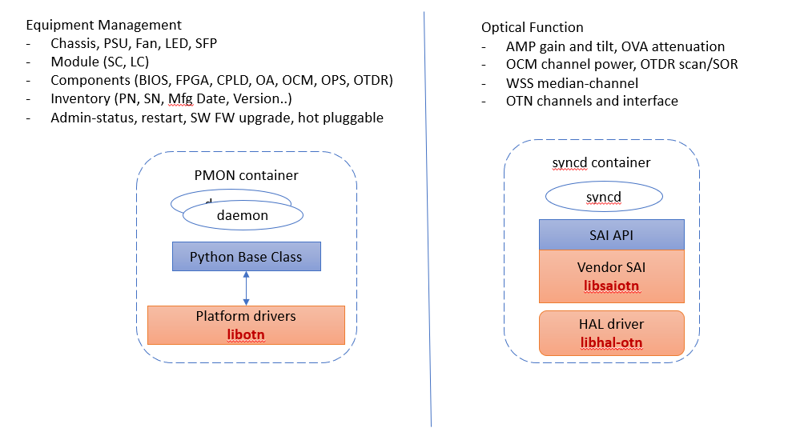
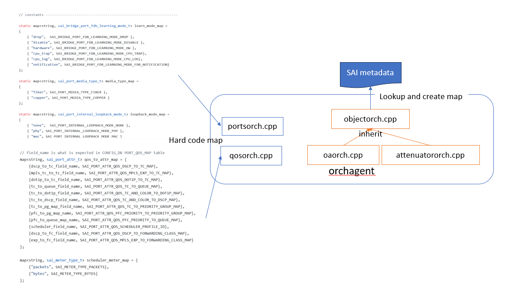
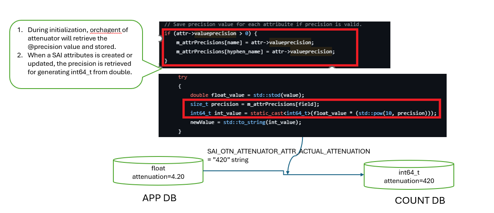
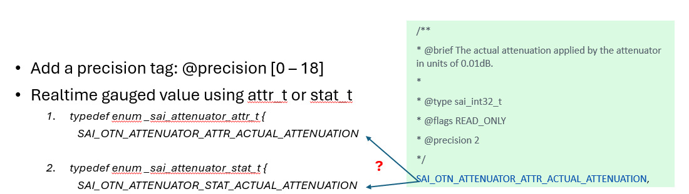

# SONiC-OTN HLD

This document complies with the [SONiC HLD Template](https://github.com/sonic-net/SONiC/blob/master/doc/guidelines/hld_template.md).

- Here is the ongoing prototype of [OTN kvm](https://github.com/sonic-otn/sonic-buildimage/tree/202411_otn).
- The build and run instructions for OTN kvm are described in the [README.md](https://github.com/sonic-otn/sonic-buildimage/blob/202411_otn/platform/otn-kvm/README.md).

## Table of Contents

- [SONiC-OTN HLD](#sonic-otn-hld)
  - [Table of Contents](#table-of-contents)
  - [1 Revision](#1-revision)
  - [2 Scope](#2-scope)
  - [3 Definitions/Abbreviations](#3-definitionsabbreviations)
    - [Table 1: Abbreviations](#table-1-abbreviations)
  - [4 Overview](#4-overview)
    - [4.1 OTN device and components overview](#41-otn-device-and-components-overview)
    - [4.2 Why SONiC for OTN](#42-why-sonic-for-otn)
  - [5 Requirements](#5-requirements)
    - [5.1 Functional requirements](#51-functional-requirements)
    - [5.2 Scaling requirements](#52-scaling-requirements)
    - [5.3 Alarm](#53-alarm)
    - [5.4 PM Counter](#54-pm-counter)
    - [5.5 Telemetry](#55-telemetry)
  - [6 Architecture Design](#6-architecture-design)
    - [6.1 Design Principles](#61-design-principles)
    - [6.2 SONiC Extension Points for OTN Support](#62-sonic-extension-points-for-otn-support)
  - [7. SAI API](#7-sai-api)
    - [7.1 Functional Scope of SAI for OTN Device](#71-functional-scope-of-sai-for-otn-device)
    - [7.2 SAI Experimental Extension Mechanism](#72-sai-experimental-extension-mechanism)
    - [7.3 OTN Extension To SAI](#73-otn-extension-to-sai)
  - [8 SONiC Container Extension for OTN](#8-sonic-container-extension-for-otn)
    - [8.1 OTN Device Metadata](#81-otn-device-metadata)
    - [8.2 SWSS Extension for OTN Optical Features](#82-swss-extension-for-otn-optical-features)
      - [8.2.1 SWSS Config Manager](#821-swss-config-manager)
      - [8.2.2 SWSS orchagent](#822-swss-orchagent)
        - [Switch Object and SAI initialization](#switch-object-and-sai-initialization)
        - [OrchDaemon for OTN](#orchdaemon-for-otn)
      - [8.2.3 Generic OrchAgent Class (**A generic enhancement to be proposed to SONiC community**)](#823-generic-orchagent-class-a-generic-enhancement-to-be-proposed-to-sonic-community)
    - [8.3 OTN State and PM Statistics Support](#83-otn-state-and-pm-statistics-support)
      - [8.3.1 SONiC SWSS Redis plug-in script](#831-sonic-swss-redis-plug-in-script)
      - [8.3.2 State DB and PM counter update](#832-state-db-and-pm-counter-update)
      - [8.3.3 Device specific lua scripts (**a generic enhancement to be proposed to SONiC community**)](#833-device-specific-lua-scripts-a-generic-enhancement-to-be-proposed-to-sonic-community)
    - [8.4 SyncD Extension](#84-syncd-extension)
    - [8.5 PMON](#85-pmon)
      - [8.5.1 PMON Base Class](#851-pmon-base-class)
      - [8.5.2  Device specific platform config and driver](#852--device-specific-platform-config-and-driver)
      - [8.5.3 Linecard Hot-pluggable (**Enhancement**)](#853-linecard-hot-pluggable-enhancement)
        - [SONiC xxxSyncd Mechanism](#sonic-xxxsyncd-mechanism)
      - [8.5.4 Firmware Upgrade](#854-firmware-upgrade)
    - [8.6 SONiC host containers](#86-sonic-host-containers)
  - [9. Device Configuration and Management](#9-device-configuration-and-management)
    - [9.1. Manifest (if the feature is an Application Extension)](#91-manifest-if-the-feature-is-an-application-extension)
    - [9.2. OTN YANG Model](#92-otn-yang-model)
      - [9.2.1 OpenConfig Optical Transport Yang Model](#921-openconfig-optical-transport-yang-model)
      - [9.2.2 Generic Translation and Mapping](#922-generic-translation-and-mapping)
      - [9.2.3 REST](#923-rest)
      - [9.2.4 gNMI and Telemetry](#924-gnmi-and-telemetry)
      - [9.2.5 CLI](#925-cli)
    - [9.3. Config DB Enhancements](#93-config-db-enhancements)
    - [9.4 Event and Alarm Support](#94-event-and-alarm-support)
    - [9.5 Reuse SONiC Existing Features](#95-reuse-sonic-existing-features)
      - [9.5.1 Management and Loopback Interface](#951-management-and-loopback-interface)
      - [9.5.2 TACACS+ AAA](#952-tacacs-aaa)
      - [9.5.3 Syslog](#953-syslog)
      - [9.5.4 NTP](#954-ntp)
      - [9.5.7 SONiC upgrade](#957-sonic-upgrade)
  - [10. Warmboot and Fastboot Design Impact](#10-warmboot-and-fastboot-design-impact)
  - [11. Memory Consumption](#11-memory-consumption)
  - [12. Restrictions/Limitations](#12-restrictionslimitations)
  - [13. Testing Requirements/Design  (**TBD**)](#13-testing-requirementsdesign--tbd)
    - [13.1. Unit Test cases](#131-unit-test-cases)
    - [13.2. System Test cases](#132-system-test-cases)
  - [14. Open/Action items - if any](#14-openaction-items---if-any)

## 1 Revision

|  Rev  |    Date    |       Author        | Change Description                        |
| :---: | :--------: | :-----------------: | :---------------------------------------- |
|  0.1  | 02/20/2026 |[sonic-otn-wp](https://lists.sonicfoundation.dev/g/sonic-wg-otn): Alibaba, Microsoft, Molex, Nokia, Cisco and Accelink.   | Initial version |


## 2 Scope

This document describes the architecture and high level design for extending SONiC to support optical transport network (OTN) device.

## 3 Definitions/Abbreviations

### Table 1: Abbreviations

|       |                                                    |
| ----- | --------------------------------------------------- |
|OTN   | Optical circuit switch         |
|NOS   | Network operating system           |
|SA    | Service affect     |
|NSA   | Non service affect    |
|PM    | Performance management   |
|CRUD  | CREATE, READ, UPDATE and DELETE |
|OA    | Optical Amplifier |
|OSC   | Optical Supervisory Channel |
|OLP   | Optical Line Protection |
|VOA   | Variable Optical Attenuator |
|WSS   | Wavelength Selective Switch |
|DGE   | Dynamic Gain Equalization |
|OTDR  | Optical Time Domain Reflectometer |
|DCI   | Inter data center connection  |


### 4. Overview
OTN devices are deployed for Data Center Interconnects (DCIs), serving as the optical transport layer that connects the ports of switches and routers between geographically dispersed data centers. This enables high-speed, low-latency, and reliable optical connections across long distances. 

#### 4.1 OTN device and components overview
OTN devices typically employ 1RU or 2RU chassis housing multiple optical line cards, fans, power supply units (PSUs), and control modules. Most optical line cards are pluggable and support diverse functions.


These optical linecards are built on a common set of optical component units that provide core transmission functionalities:

* **Variable Optical Attenuator (VOA)** – Adjusts optical signal power levels.
* **Optical Amplifier (OA)** – Boosts optical signals to extend transmission distance.
* **Optical Line Protection (OLP) Switch** – Automatically switches traffic to a backup path when a fault occurs.
* **Optical Supervisory Channel (OSC)** – Transports management and control information.
* **Wavelength Selective Switch (WSS)** – Dynamically routes specific wavelengths in different directions.
* **Optical Channel Monitor (OCM)** – Analyzes the optical spectrum.
* **Optical Time-Domain Reflectometer (OTDR)** – Measures attenuation and reflection losses along fibers.
* **Transponders and Transceivers** – Convert electrical signals into optical signals for fiber transmission.

#### 4.2 Why SONiC for OTN
The **SONiC for OTN project** proposes extending SONiC to support optical transport networks, enabling end-to-end deployment across both packet and optical layers. 

For hyperscale network users and service providers, introducing optical support in SONiC enables consistent end-to-end infrastructure management from the IP layer (switches and routers) to the optical transport layer (OTN devices). This significantly simplifies network management tools and controllers. It also creates the potential for a single SDN controller infrastructure across all layers and enables movement toward an open, converged multi-layer network management solution.

For optical device vendors, existing SONiC NOS infrastructure and generic features, such as user management, security, and management network modules, can be reused. This reduces time to market, improves software quality, and lowers development costs. Joining the SONiC ecosystem also allows vendors and users to collaborate more effectively through the SONiC open-source community.


This document provides a high-level design for extending SONiC to support OTN devices, including YANG models, SAI APIs, orchestration agent changes, syncd updates, Config DB and APP DB schemas, and other SONiC changes required to bring up a SONiC image on an OTN device.

## 5 Requirements

### 5.1 Functional requirements

At a high level the following should be supported:

- Bring up SONiC image for a new platform, `otn-kvm`, and DEVICE_METADATA type - `OtnOls`
- Bring up swss/syncd containers for switch_type - `otn`
- Able to manage OTN device configured via REST, gRPC client and CLI
- Device Management functions including:
  - Configuration - system, OTN port and OTN cross-connect.
  - State report - system, OTN port and OTN cross-connect.
  - Operations: restart (warm, cold and power-on), SW/FW upgrade
  - Telemetry: Data streaming for time sensitive state.
  - Alarm notification for system faults.
  - PM statistics counters for important performance parameters.


### 5.2 Scaling requirements

Following are the scaling requirements: [*TBD*]

| Item                          | Expected Max value            |
| ----------------------------- | ----------------------------- |
| Line Cards                    | 16                            |
| Optical Ports                 | 64                            |

### 5.3 Alarm

Alarms listed in the following table should be supported: **[TBD]**

| Alarm name                          | Severity                |  
| ----------------------------- |-----------------------------------|
| OA Loss of Signal                | SA                         |
| PUS Failed                    | NAS        |

### 5.4 PM Counter

Network equipment performance management counters are metrics that monitor and provide insights into the performance of network devices. They help identify potential issues, bottlenecks, and areas for optimization, enabling network administrators to proactively manage and troubleshoot their infrastructure:

For each PM parameter, the following statistics should be available:

- 96 (32) buckets of 15-minute counters including min, max and average.
- 7 bucket of 24-hour counters with min, max and average.

PM parameters listed in the following table should be supported: **[TBD]**

| PM name                          | Data Type                |  
| ----------------------------- |-----------------------------------|
| Chassis Temperature                   | decimal2                         |
| OA1-1 Input Power                | decimal2        |
| Fan-0 Speed                     | uint32        |

### 5.5 Telemetry

OTN should support telemetry features. Both [dial-in](https://github.com/sonic-net/sonic-telemetry/blob/master/doc/grpc_telemetry.md) and [dial-out](https://github.com/sonic-net/sonic-telemetry/blob/master/doc/dialout.md) modes should be supported. Telemetry should support the following features:

- STREAM (Streaming Telemetry): Continuously sends updates as data changes. It includes three sub-modes:
   - ON_CHANGE: Sends updates only when the value of the data changes.
   - SAMPLE (Cadence-based): Sends data at a configured periodic interval.

- ONCE: Retrieves the current state of data exactly once and then terminates the subscription.
- POLL: The collector sends a request, and the target sends the current value in response, allowing on-demand data retrieval

## 6 Architecture Design

This section describes the overall changes needed for supporting OTN devices.

### 6.1 Design Principles

While SONiC is a packet-switch NOS, its modular design and built-in extensibility infrastructure allow developers to add functionality beyond the packet-switching domain.

The following guidelines should be followed while developing a SONiC-based NOS for OTN.

- Fully utilize SONiC's rich extension mechanisms to make changes as seamless as possible, so OTN support becomes an organic part of SONiC.

- Reuse SONiC generic system features as-is, including NBI (REST, CLI, gNMI), telemetry, user management, syslog notifications, SW/FW upgrade, and chassis/PSU/LED/FAN/temperature management.

- Changes for OTN support should be modular and relatively isolated from packet-switching logic, with minimal impact on existing packet-switching functions.

- For major feature gaps, such as PM, alarms, and hot-plug support, enhancements should be designed and implemented generically, not only for OTN.

- All changes should be compatible with the upstream SONiC codebase and ready to merge. The final goal is for all OTN vendors to pull official SONiC code and build SONiC OTN images for their devices.

### 6.2 SONiC Extension Points for OTN Support

The following diagram shows the main changes and SONiC extension points required to support OTN devices:

  

1. NBI: Add OTN yang models and support REST API and CLI. OpenConfig [optical transport yang model](https://github.com/openconfig/public/tree/master/release/models/optical-transport) is adopted. 

2. Redis DB: Add new CONFIG, STATE and APP tables for OTN device.

3. SWSS: Add Config manager and Orchagent for OTN device.

4. PMON Drivers: Add user and kernel drivers for Fan, PSU, LED and temperature sensors, FPGA.

5. SAI: Extend SAI to support OTN using SAI experimental extension mechanism.

6. SyncD: SyncD driver supporting extended OTN SAI attributes.

7. Optical Control: Introduce a new application container, optical-control, contains multiple daemons for span and wavelength control loop.

8. ONIE: Create ONIE image for installing SONiC image on OTN devices, support secure boot.

## 7. SAI API

This section covers the changes made or new API added in SAI API for implementing this feature.

In SONiC architecture, SAI (Switch Abstraction Interface) is a core interface layer that decouples SONiC control software from vendor-specific hardware implementations. Upper-layer SONiC components (such as Orchagent via the sairedis/syncd path) use standardized SAI object models and APIs, while each vendor provides its own SAI implementation to map those APIs to device SDK/driver operations.

By using SAI as the hardware abstraction boundary, SONiC can keep most control-plane logic hardware-agnostic, improve portability across different platforms, and reduce vendor-specific changes in the SONiC core.

### 7.1 Functional Scope of SAI for OTN Device

Following the existing SONiC design, SAI is extended to support optical features while generic system functionality remains in the PMON container. This functional division is shown in the following diagram:



Most OTN devices are chassis-based with control cards and line cards. PMON will be enhanced to support the line card hot-pluggable feature described below.

### 7.2 SAI Experimental Extension Mechanism

While SAI APIs support core packet-switching features, they also include built-in extension mechanisms that allow developers to add new objects and APIs. Here is the [SAI experimental extension design](https://github.com/opencomputeproject/SAI/blob/master/doc/SAI-Extensions.md). The SAI extension mechanism provides:

- Add new attributes, ex., add new attributes in saiswitchextensions.h.
- Add new API types in saiextension.h.
- Add new object types in saitypesextensions.h.
- Cannot modify existing SAI.
- Add new attributes, ex., add new attributes in for the new APIs.

### 7.3 OTN Extension To SAI

The SAI extension for OTN devices is proposed [here](./sai_otn_proposal.md).

## 8 SONiC Container Extension for OTN

This section describes changes at SONiC container level to support OTN devices.

### 8.1 OTN Device Metadata

In the DEVICE metadata table, a new type, `OtnOls`, and a new `switch_type`, `otn`, are added:

``` JSON
"DEVICE_METADATA": {
    "localhost": {
        "type": "OtnOls",
        "switch_type": "otn",
     }
}
```
### 8.2 SWSS Extension for OTN Optical Features

Two SONiC built-in containers, swss and syncd, are at the core of data-path control and monitoring, as shown in the following diagram:


This section describes the SWSS and Syncd to support OTN features.

#### 8.2.1 SWSS Config Manager

In SWSS container, a new config manager daemon, [`otnmgrd`](https://github.com/sonic-otn/sonic-swss/blob/202411_otn/cfgmgr/otnmgrd.cpp), is created to subscribe the changes in OTN tables in config DB. When config change is notified, OTN config manager update the corresponding tables in APP DB.

[**TBD**] How the failure is handled, if the config change does not pass the business logic validation? SONiC configuration is managed asynchronously, i.e., the config will be accepted and stored in config DB, even the low level/HW processing fails.

#### 8.2.2 SWSS orchagent

Orchagent is extended with a [separate folder](https://github.com/sonic-otn/sonic-swss/tree/202411_otn/orchagent/otn) to support OTN devices.

##### Switch Object and SAI initialization

`switch` is the root object for all other SAI objects and must be created during initialization. OrchAgent initializes SAI objects based on switch type. SAI initialization is split by switch type: OTN uses the OTN API, while everything else uses the standard SAI API:
- OTN: initOtnApi().
- Non-OTN: existing initSaiApi().

```c++
main.cpp

    if (gMySwitchType == SWITCH_TYPE_OTN) {
        SWSS_LOG_NOTICE("OTN platform detected, initializing OTN API");
        initOtnApi();
    } else {
        initSaiApi();
    }
```

##### OrchDaemon for OTN

Currently, SONiC supports two types of Orch Daemon based on `switchType`: orchDaemon and fabricOrchDaemon. A new type, OTNOrchDaemon, is added to support OTN devices. At runtime, `switchType == otn` is used to determine whether [OtnOrchDaemon](https://github.com/sonic-otn/sonic-swss/blob/202411_otn/orchagent/otn/otnorchdaemon.cpp) should be created. Please see the [code here](https://github.com/sonic-otn/sonic-swss/blob/202411_otn/orchagent/main.cpp).

``` c++
    if(gMySwitchType == "otn")
    {
        create orchDaemon = make_shared<OtnOrchDaemon>;
    }
    else if (switchType != "fabric")
    {
        orchDaemon = make_shared<OrchDaemon>();
    }
    else
    {
        orchDaemon = make_shared<FabricOrchDaemon>();
    }
```

Creating a new type of OrchDaemon isolates OTN support from the existing logic, resulting in no impact on existing packet features.

#### 8.2.3 OrchAgent Super Class (**Generic SONiC code optimization**)

OrchAgent performs CRUD operations on SAI objects triggered by APP DB changes. Currently, each SONiC object has its own OrchAgent class, which hard-codes APP DB object-to-SAI attribute mapping in a static table.

For OTN devices, a generic superclass, [objectorch](https://github.com/sonic-otn/sonic-swss/blob/202411_otn/orchagent/otn/objectorch.cpp), is defined to support CRUD operations and FlexCounter DB integration. OrchAgent classes corresponding to each SAI object can reuse generic methods in `objectorch` for State DB and FlexCounter DB access.

The following `translateObjectAttr(field, value, attr)` resolves the attribute ID from the maps above, normalizes enums and precision-based numbers, and then uses `sai_deserialize_attr_value` with attribute metadata.

```c++
objectorch.cpp

bool ObjectOrch::translateObjectAttr(
    _In_ const std::string &field,
    _In_ const std::string &value,
    _Out_ sai_attribute_t &attr)
{
    if (m_createandsetAttrs.find(field) != ...) attr.id = m_createandsetAttrs[field];
    else if (m_createonlyAttrs.find(field) != ...) attr.id = m_createonlyAttrs[field];
    ...
    auto meta = sai_metadata_get_attr_metadata(m_objectType, attr.id);
    ...
    /* enum map, precision-based float→int, then */
    sai_deserialize_attr_value(newValue, *meta, attr);
    return true;
```

ObjectOrch provides generic Redis-to-SAI object mapping by driving behavior from SAI object/attribute metadata and existing serialize/deserialize helpers. Instead of hard-coding attribute mappings, OTN OrchAgent classes, such as OA, OCM, and VOA, inherit `ObjectOrch` for State DB and FlexCounter DB operations. This mechanism eliminates redundant, error-prone mapping code in each individual class. If special handling is needed, individual subclasses can still override superclass functions.



Summary (to be proposed to SONiC community):
- An OrchAgent superclass (`ObjectOrch`) is created for generic translation from Redis strings to SAI attributes using SAI metadata, instead of hard-coded mapping tables.
- All OrchAgent classes should inherit from `ObjectOrch` and override functions when needed.

### 8.3 OTN State and PM Statistics Support

This section describes how to support OTN state update in STATE DB and PM statistics counters.

Current SONiC does not support traditional telecom performance management (PM) historical counters.

- 96 (32) buckets of 15-minute counters including min, max and average.
- 7 bucket of 24-hour counters with min, max and average.

Tables in State DB to be updated continuously, so that NBI (CLI/REST API) can read the OTN objects state, both discrete values (on/off and enabled/disabled, etc.) and gauged values (gain, attenuation and optical power, etc.) from State DB directly via openconfig yang models.

#### 8.3.1 SONiC SWSS Redis plug-in script

SWSS utilizes Lua scripts for certain operations, particularly within its Producer/Consumer Table framework. These scripts help in atomically writing and reading messages to and from Redis databases.
Examples of Lua scripts within the SWSS can be found in the sonic-swss repository. One notable example is [pfc_restore.](https://github.com/sonic-net/sonic-swss/blob/master/orchagent/pfc_restore.lua), which uses Redis commands to handle PFC (Priority Flow Control) restoration.

#### 8.3.2 State DB and PM counter update

It is proposed to use SWSS Lua scripts to support State DB updates and PM statistics counters with the following benefits:

- Use the existing counter DB as-is; no new SONiC code is required for basic PM support.
- SONiC counter DB is designed for storing raw hardware data. Syncd updates counters specified in the FlexCounter DB. Both State and PM counters can be derived from counter DB tables.
- Use the existing SWSS OrchAgent mechanism to install Lua scripts, similar to stored procedures in traditional database systems. These scripts run inside the Redis container and can be invoked whenever counter DB is updated.
- These Lua scripts can be device-specific, so each vendor can provide customized scripts as part of device data. This provides maximum flexibility and keeps status updates and PM support generic.

The following diagram shows the workflow of the Redis plug-in script in SONiC.


- First, OrchAgent installs the script and stores its SHA.
- When Syncd adds the counter attribute, it also adds the plug-in SHA.
- When vendor SAI updates counters, it also sends a request to Redis DB to run the script.

#### 8.3.3 Device specific lua scripts (**Generic SONiC code optimization**)

Currently, some vendor-specific Lua scripts are placed in the SWSS [orchagent](https://github.com/sonic-net/sonic-swss/blob/master/orchagent), which is not ideal:
- Vendor/device-specific scripts are included in the SWSS common codebase.
- Script installation is hard-coded. Only Lua scripts explicitly requested by running code are installed; other files in `/usr/share/swss` are not loaded unless a component is written to load them.

```c++
pfcwdorch.cpp:

    if (this->m_platform == CISCO_8000_PLATFORM_SUBSTRING) {
        restorePluginName = "pfc_restore_" + this->m_platform + ".lua";
    } else {
        restorePluginName = "pfc_restore.lua";
    }
```

For OTN, the script path is under `/usr/share/sonic/platform/<script_path>` (e.g., `otn_oa_plugin.lua`). During SONiC installation, ONIE installs only the scripts for that device. In OrchAgent, `loadRedisScript` is used to install all scripts generically into `COUNTERS_DB`, and the returned SHA is passed into the FlexCounter manager.

```c++
objectorch.cpp
    if (!script_path.empty())
    {
        try
        {
            std::string path("/usr/share/sonic/platform/");
            path += script_path;
            std::string att_script = swss::readTextFile(path);
            std::string att_sha = swss::loadRedisScript(m_countersDb.get(), att_script);
            fv_stat = FieldValueTuple(plugin_field, att_sha);
        }
```

Lua scripts are included as part of device configuration; see [example](https://github.com/sonic-otn/sonic-buildimage/tree/202411_otn/device/molex/x86_64-otn-kvm_x86_64-r0).

Summary:
- Device/vendor Lua scripts should be removed from SWSS common code.
- Device/vendor Lua scripts should be part of device configuration.

### 8.4 SyncD Extension

In the syncd container, SONiC starts the syncd service at startup, which loads the SAI component (driver) present in the system. This component is provided by various vendors, who implement the SAI interfaces based on their hardware platforms, allowing SONiC to use a unified upper-layer logic to control various hardware platforms. Syncd is responsible for communicating with the Redis database, loading SAI implementation, and interacting with it to handle ASIC initialization, configuration, status reporting, and so on.

For OTN devices, Syncd behavior is similar. However, instead of managing an ASIC, each vendor implements SAI OTN extension APIs to control and monitor OTN objects. Notification handlers are also registered to process events from hardware. OTN support is added by extending logic to process new SAI APIs for OTN objects.

#### 8.4.1 FlexCounter Extension
When a SAI object is created, the corresponding FlexCounter is set up to collect object status in Counter DB. For better code maintainability, instead of modifying the existing [FlexCounter](https://github.com/sonic-net/sonic-sairedis/blob/master/syncd/FlexCounter.cpp), a new file, [`FlexCounterOtn.cpp`](https://github.com/sonic-otn/sonic-sairedis/blob/202411_otn/syncd/FlexCounterOtn.cpp), is created for OTN support to isolate code maintenance.

`FlexCounter` manages Counter DB configuration for SAI object monitoring. Separate `FlexCounterOtn` files are created for managing OTN SAI object attributes in Counter DB. This reduces code-change contention between the OTN project and the rest of SONiC development.

```Diff
   --- syncd
    |--- FlexCounter.(h|cpp)
+   |--- FlexcounterOtn.(h|cpp)
```

Similarly, SAI Object (de)serialization is also implemented in separate files `meta/sai_serialize_otn` from the main file `sai-serialize`.

**Run time logical flow isolation**

Processing for OTN SAI objects and APIs is added to existing Syncd infrastructure with clear isolation from existing logic. This is done by placing OTN object processing at the end of current logic, so OTN logic is not in packet-switch code paths. The code snippet for adding the OTN counter plugin is shown below (similar for add/remove counters):

```Diff
FlexCounter.cpp

void FlexCounter::addCounterPlugin {
    ....
    {
            else
            {
+               if (m_flexCounterOtn ->addCounterPlugin(field, shaStrings))
+               {
+                    continue;
+               }

                SWSS_LOG_ERROR("Field is not supported %s", field.c_str());
            }
    }

    // notify thread to start polling
    notifyPoll();
}

```

#### 8.4.2 OTN Gauged Value Modeling 

OTN devices need to support continuously changing analog/gauged values, such as optical power, gain, and attenuation (while switches mostly deal with digital values and counters):

**SAI add @precision [0-18] tag**
```c
    /**
     * @brief The actual attenuation applied by the attenuator in units of 0.01dB.
     *
     * @type sai_int32_t
     * @flags READ_ONLY
     * @precision 2
     */
    SAI_OTN_ATTENUATOR_ATTR_ACTUAL_ATTENUATION,
```
See the following diagram for double to int conversion:



Another design issue is whether to model real-time gauged values in SAI `stat_t` or SAI `attr_t`, as shown in the following figure:



Based on the following analysis, defining read-only gauged values in `enum_xx_attr_t` seems preferable:
  - `stat_t` in current SONiC is all counters (enum), not tagged attributes. Supporting tagged attributes in `stat_t` would require looping through all tags in `SAI/meta/parse.pl`. This introduces major changes and duplicated handling for `stat_t` and `attr_t`.
  - Using attr_t for gauged value requires no change to existing SAI parse infrastructure.
  - Read-only SAI attributes can be stored in state DB, which is updated by registered lua script with a device specific interval (1s).

### 8.5 PMON

SONiC PMON (platform monitor) manages generic hardware independent of device function. PMON infrastructure is implemented in two repositories, [sonic-platform-common](https://github.com/sonic-net/sonic-platform-common) and [sonic-platform-daemon](https://github.com/sonic-net/sonic-platform-daemons), described in [this doc](https://github.com/sonic-net/SONiC/blob/master/doc/platform_api/new_platform_api.md). Vendor platform modules reside under `sonic-buildimage/platform` for each device type.

#### 8.5.1 PMON Base Class

Python classes are implemented to model the generic hardware structure and operations on the hardware. Here is the example of a typical device structure in python classes:

- Chassis
  - System EEPROM info
  - Reboot cause
  - Environment sensors
  - Front panel/status LEDs
  - Power supply unit[0 .. p-1]
  - Fan[0 .. f-1]
  - Module[0 .. m-1] (Line card, supervisor card, etc.)
    - Environment sensors
    - Front-panel/status LEDs
    - SFP cage[0 .. s-1]
    - Components[0 .. n-1] (CPLD, FPGA, MCU, ASIC etc.)
      - name
      - description
      - firmware

#### 8.5.2  Device specific platform config and driver

The JSON file [code here](https://github.com/sonic-otn/sonic-buildimage/blob/202411_otn/device/molex/x86_64-otn-kvm_x86_64-r0/platform.json) is to define the OTN device HW hierarchy described above. This config file is device specific for a particular OTN device.

An example of driver of PMON is [implemented here](https://github.com/sonic-otn/sonic-buildimage/tree/202411_otn/platform/otn-kvm/sonic-platform-modules-otn-kvm/ols-v).

#### 8.5.3 Linecard Hot-pluggable (**Enhancement**)

Currently, SONiC supports two chassis types:

- Pizza box without pluggable supervisor/control card and line cards
- Multi-ASIC, in which each line card runs an independent SONiC

An OTN device may not fit either architecture above. A typical chassis-based OTN device hosts a control card (supervisor card) and multiple line cards containing various optical modules. When a line card is removed or inserted, OrchAgent should be notified so affected objects are removed from or added to the Syncd monitoring thread. Optical component status should also be updated in State DB.

##### SONiC xxxSyncd Mechanism

In SWSS and other application containers (for example, BGP and LLDP), various `sync` daemons synchronize state from external sources into Redis (mainly APPL_DB, sometimes STATE_DB). OrchAgent (and other SWSS components) then reacts to that state. In this model, sync daemons publish kernel/config/FPM/peer state to Redis so OrchAgent can program the switch.

For OTN devices, line card status changes can be handled in the same way, as shown below:


As shown in the diagram above, new line card sync logic is added to `chassisd` in the PMON container.

The following diagram shows the steps for handling line card insertion or remove/fail events. Note that `linecardsyncd` is implemented as a Python library for each device.


**Line card un-plug/failed**

1. `chassisd` in PMON detects a removed line card by polling.
2. It changes the line card status from online to `empty/fault`.
3. The linecardsyncd API (implemented at device level) removes all the optical components on the line card. 
4. OrchAgent is triggered to remove corresponding SAI objects and associated FlexCounter entries.
5. Syncd stops monitoring removed resources for these optical modules.
6. Objects in State DB should also be removed. NBI queries for these components should return empty results.

**Line card insert/recover**

1. PMON detects a line card is back to online (LC communication is OK). 
2. It changes the line card status back to online.
3. `linecardsyncd` APIs add optical components for the line card by restoring configuration from Config DB.
4. OrchAgent is triggered to create corresponding SAI objects and associated FlexCounter entries.
5. Syncd starts monitoring the resources. State DB should also be updated with current component state.

#### 8.5.4 Firmware Upgrade

SONiC provides a generic mechanism to install/upgrade firmware, [fwutil.md](https://github.com/sonic-net/SONiC/blob/master/doc/fwutil/fwutil.md).

OTN vendors need to implement the Python component APIs defined in the base class [`component_base.py`](https://github.com/sonic-net/sonic-platform-common/blob/master/sonic_platform_base/component_base.py):

### 8.6 SONiC host containers

The following containers shall be enabled in SONiC and included in the image. Switch-specific containers shall be disabled for images built for OTN devices. The SONiC build [rule/config](https://github.com/sonic-net/sonic-buildimage/blob/master/rules/config) must be updated accordingly.
  
| Container/Feature Name | Is Enabled? |
| ---------------------- | ----------- |
| SNMP                   | Yes         |
| Telemetry              | Yes         |
| LLDP                   | Yes         |
| Syncd                  | Yes         |
| Swss                   | Yes         |
| Database               | Yes         |
| BGP                    | Yes         |
| Teamd                  | No          |
| Pmon                   | Yes         |
| Nat                    | No          |
| Sflow                  | No          |
| DHCP Relay             | No          |
| Radv                   | No          |
| Macsec                 | No          |
| Resttapi               | Yes         |
| gNMI                   | Yes         |

## 9. Device Configuration and Management

This section contains subsections for all configuration and management-related design topics. Subsections for CLI and Config DB are included below, along with subsections for data models (YANG, REST, gNMI, etc.).

### 9.1. Manifest (if the feature is an Application Extension)

N/A

### 9.2. OTN YANG Model

#### 9.2.1 OpenConfig Optical Transport Yang Model
The OTN project adopts the standard OpenConfig YANG model for [optical transport](https://github.com/openconfig/public/tree/master/release/models/optical-transport).

| Object | Description | OpenConfig Reference |
|--------|-------------|----------------------|
| OA | Optical amplifier | openconfig-optical-amplifier.yang|
| VOA | Optical attenuator | openconfig-optical-attenuator.yang |
| Optical Port | Optical transport port | openconfig-transport-line-common.yang
| OCH | Optical channel | openconfig-terminal-device.yang|
| WSS | Wavelength selective switch | openconfig-wavelength-router.yang |
| OMC | Optical media channel | openconfig-wavelength-router.yang|
| OSC | Optical supervisory channel | openconfig-optical-amplifier.yang|
| OTDR | Optical time-domain reflectometer | Not defined yet |
| OCM | Optical channel monitor | openconfig-channel-monitor.yang |
| APS | Automatic protection switch |openconfig-transport-line-protection.yang|
| APS Port | Automatic protection switch port | openconfig-transport-line-protection.yang |
| Logical Channel | Logical channel | openconfig-terminal-device.yang|

All Northbound APIs (RESTCONF and gNMI) are based on the above YANG model, as described in the sections below.

#### 9.2.2 Generic Translation and Mapping

As SONiC DBs are implemented using [Redis](https://redis.io/), OpenConfig-based NBIs need to be translated and mapped to/from the Redis DB schema. SONiC management framework infrastructure's Translib converts the data models exposed to management clients into the Redis ABNF schema format. See the HLD [here](https://github.com/sonic-net/SONiC/blob/master/doc/mgmt/Management%20Framework.md).

To support an OpenConfig YANG model:

- Generate the annotation template file:
```bash
goyang --format=annotate --path=/path/to/yang/models openconfig-optical-attenuator.yang > annot/openconfig-optical-attenuator-annot.yang
```
- Annotate YANG extensions to define translation hints. [An example here](https://github.com/sonic-otn/sonic-mgmt-common/blob/202411_otn/models/yang/annotations/openconfig-optical-attenuator-annot.yang).

- Add corresponding sonic yang for CVL (configuration verification layer) purpose. [An example](https://github.com/sonic-otn/sonic-mgmt-common/blob/202411_otn/models/yang/sonic/sonic-optical-attenuator.yang).

- Add the list of Openconfig YANG modules and annotation files to the transformer manifest file, $(SONIC_MGMT_FRAMEWORK)/config/transformer/models_list.

- Implement the overload methods if you need translate data with special handling. See the OTN transformer [here](https://github.com/sonic-otn/sonic-mgmt-common/blob/202411_otn/translib/transformer/xfmr_otn_openconfig.go).

See this [developer guide](https://github.com/project-arlo/sonic-mgmt-framework/wiki/Transformer-Developer-Guide) for details.

#### 9.2.3 REST 

After the translation and mapping are implemented, the SONiC management framework supports the REST API accordingly. The REST API specification can be auto-generated using the [OpenAPI tool](https://github.com/OpenAPITools/openapi-generator).

OTN REST request examples:


```bash
## Get all Amplifiers
curl -k -X GET\
   "https://127.0.0.1/restconf/data/openconfig-optical-amplifier:optical-amplifier/amplifiers" \
   -H "accept: application/yang-data+json" | jq

# Get one VOA object
curl -k -X GET \
   "https://127.0.0.1/restconf/data/openconfig-optical-attenuator:optical-attenuator/attenuators/attenuator=VOA0-0" \
   -H "accept: application/yang-data+json" | jq

## Get from Redis Table directly
curl -k -X GET\
  "https://127.0.0.1/restconf/data/sonic-optical-amplifier:sonic-optical-amplifier/OTN_OA/OTN_OA_LIST" \
  -H "accept: application/yang-data+json" | jq

## Set EDFA gain
curl -k  -X PUT \
    -H "Content-Type: application/yang-data+json" \
    -H "Accept: application/yang-data+json" \
    "https://127.0.0.1/restconf/data/openconfig-optical-amplifier:optical-amplifier/amplifiers/amplifier=OA0-0/config/target-gain" \
    -d '{"openconfig-optical-amplifier:target-gain": "5.0"}' | jq

## Get a leaf node in a nested list
admin@sonic:~$   curl -k -X GET\
   "https://127.0.0.1/restconf/data/openconfig-channel-monitor:channel-monitors/channel-monitor=OCM0-0/channels/channel=196062500,196137500/state/power" \
   -H "accept: application/yang-data+json" | jq
```
```json
{
  "openconfig-channel-monitor:channel": [
    {
      "state": {
        "target-power": "1.5",
      },
    }
  ]
}

```

#### 9.2.4 gNMI and Telemetry

gNMI set/get/telemetry is supported by [gNMI Server](https://github.com/sonic-net/sonic-gnmi). Design doc is [here](https://github.com/sonic-net/SONiC/blob/master/doc/mgmt/gnmi/SONiC_GNMI_Server_Interface_Design).

Again, SONiC has a generic gNMI server implementation to support YANG models backed by Redis DB.

Examples:

```bash
## get on the full attenuator tree
    gnmic -a 127.0.0.1:8080 -u admin -p YourPaSsWoRd --insecure \
       get --path openconfig-optical-attenuator:optical-attenuator/attenuators

## get on a specific attenuator
    gnmic -a 127.0.0.1:8080 -u admin -p YourPaSsWoRd --insecure \
       get --path openconfig-optical-attenuator:optical-attenuator/attenuators/attenuator[name=VOA0-0]

## gNMI set on an OTN resource
gnmic -a 127.0.0.1:8080 \
   -u admin -p YourPaSsWoRd --insecure \
   set \
   --update `openconfig-optical-attenuator:/optical-attenuator/attenuators/attenuator[name=VOA0-0]/   config:::json_ietf:::{
     "openconfig-optical-attenuator:config": {
       "attenuation": "6.0" }
   }`
```
One of the most useful gNMI capabilities is subscription support in the following modes:
- once
- polling 
- streaming (sample, on change)

Wildcard in the path is also supported.

```bash
## Sample mode wildcard support:
## 1. In this mode, the client sends a stream subscription request and the server pushes updates at the default server rate. NOTE: the default stream sample rate is 20 seconds.
## 2. Entry Wildcards ([name=*]) You can subscribe to all entries in a list by using the * wildcard in the key field. This triggers the Key Transformer to scan the appropriate database—STATE_DB for dynamic data or CONFIG_DB for settings—and return every discovered instance.

gnmic   --address 127.0.0.1:8080   --username admin   --password YourPaSsWoRd   --insecure   subscribe   --print-request   --mode stream   --stream-mode sample   --target OC-YANG   --path 'openconfig-optical-attenuator:optical-attenuator/attenuators/attenuator[name=*]/state'

## Path Wildcards (Leaf node discovery) By subscribing to a parent container, the Table Transformer recursively discovers all underlying list members. This is useful for fetching the entire hierarchy of a device in one stream.
 gnmic --address 127.0.0.1:8080   --username admin   --password YourPaSsWoRd   --insecure   subscribe --mode stream  --stream-mode sample  --target OC-YANG  --path 'openconfig-channel-monitor:channel-monitors/channel-monitor[name=OCM0-0]/channels'

```

#### 9.2.5 CLI

Most SONiC CLI is implemented in sonic-utility based on the [Python click library](https://click.palletsprojects.com/en/8.1.x/). These CLIs are supported in [sonic-utilities](https://github.com/sonic-net/sonic-utilities). It is preferred that OTN CLI adopt auto-generation instead of hard-coded Python for better maintenance and consistency.

Automatically generates click based Python CLI code from SONiC yang, using [SONiC CLI auto-generation tool](https://github.com/sonic-net/SONiC/blob/master/doc/cli_auto_generation/cli_auto_generation.md).

TBD

### 9.3. Config DB Enhancements  

New Config DB and State DB tables are introduced to support OTN devices. The new DB tables are added in [`schema.h`](https://github.com/sonic-otn/sonic-swss-common/blob/202411_otn/common/schema.h) in `sonic-swss-comm`. Potentially, OTN tables can be defined in a separate file (**TBD**).

Config DB and State DB schemas are strictly mapped from OpenConfig YANG models. The following new DB tables are defined for optical amplifiers and variable optical attenuators as examples:

```
CONFIG_DB
=========

OTN_ATTENUATOR
;/openconfig-optical-attenuator:optical-attenuators/attenuator/config
;revision "2019-07-19" {reference "0.1.0"}
key                 = ATTENUATOR|VOA<slot>-<num> ; string, numbers are 0 based.
;field              = value
attenuation-mode    = STRING                 ; identityref    
target-output-power = float64                ; yang decimal64, json Number
attenuation         = float64               
enabled             = "true" / "false"       ; boolean    

OTN_OA
;/openconfig-optical-amplifier:optical-amplifiers/amplifier/config
;revision "2019-12-06" {reference "0.5.0"}
key                 = OTN_OA|OA<slot>-<num>  ; string
;field              = value
type                = STRING                 ; identityref
target-gain         = float64                ; yang decimal64, json Number
max-gain            = float64                ; yang decimal64, json Number
min-gain            = float64                ; yang decimal64, json Number
target-gain-tilt    = float64
gain-range          = STRING                 ; identityref
amp-mode            = STRING                 ; identityref
target-output-power = float64                ; yang decimal64, json Number
max-output-power    = float64                ; yang decimal64, json Number
enabled             = "true" / "false"       ; boolean
fiber-type-profile  = STRING                 ; identityref
autolos             = "true" / "false"       ; oplink extension, APSD
apr-enabled         = "true" / "false"       ; oplink extension 

STATE_DB:
=========
OTN_ATTENUATOR_TABLE
;/openconfig-optical-attenuator:optical-attenuators/attenuator/state
key                 = OTN_ATTENUATOR_TABLE|VOS<slot>-<num>  ; string
;field              = value
attenuation-mode    = STRING                 ; identityref
target-output-power = float64                ; yang decimal64, json Number
attenuation         = float64
enabled             = "true" / "false"       ; boolean

component           = STRING                 ; ref to platform component
ingress-port        = STRING                 ; ref to platform component
egress-port         = STRING                 ; ref to platform component
actual-attenuation  = float64                ; instant value only
output-power-total  = float64
optical-return-loss  = float64

OTN_OA_TABLE
;/openconfig-optical-amplifier:optical-amplifiers/amplifier/state
key                 = OTN_OA_TABLE|OA<slot>-<num>  ; string
;field              = value
type                = STRING                 ; identityref
target-gain         = float64                ; yang decimal64, json Number
max-gain            = float64                ; yang decimal64, json Number
min-gain            = float64                ; yang decimal64, json Number
target-gain-tilt    = float64
gain-range          = STRING                 ; identityref
amp-mode            = STRING                 ; identityref
target-output-power = float64                ; yang decimal64, json Number
max-output-power    = float64                ; yang decimal64, json Number
enabled             = "true" / "false"       ; boolean
fiber-type-profile  = STRING                 ; identityref
autolos             = "true" / "false"       ; oplink extension, APSD
apr-enabled         = "true" / "false"       ; oplink extension

component           = STRING                 ; ref to platform component
ingress-port        = STRING                 ; ref to platform component
egress-port         = STRING                 ; ref to platform component
actual-gain         = float64                ; instant value only
actual-gain-tilt    = float64
input-power-total   = float64
input-power-c-band  = float64
input-power-l-band  = float64
output-power-total   = float64
output-power-c-band = float64
output-power-l-band = float64
laser-bias-current  = float64
optical-return-loss  = float64
```
### 9.4 Event and Alarm Support

In progress.

### 9.5 Reuse SONiC Existing Features

SONiC is a mature NOS, which provides most system management features. These features can be used for OTN devices as-is without any changes.

#### 9.5.1 Management and Loopback Interface

OTN devices support at least one DCN interface for device management (NBI).

There are a few alternative ways to configure a static IP address for the management interface.

- Use Click CLI:

```
admin@OTN001:~$ config interface ip add eth0 <ip_addr> <default gateway IP>
```

- Use config_db.json and configure the MGMT_INTERFACE key with the appropriate values. See the config of management interface [here](https://github.com/sonic-net/SONiC/wiki/Configuration#management-interface).

- The same method can be used to configure the Loopback interface address.
  - /sbin/ifconfig lo Linux command shall be used. OR,
  - Add the key LOOPBACK_INTERFACE and value in config_db.json and load it.

Additionally, the management interfaces should support L3 routing protocols, OSPF, and BGP.

#### 9.5.2 TACACS+ AAA

 Please see [here](https://github.com/sonic-net/SONiC/blob/master/doc/aaa/TACACS%2B%20Authentication.md).

#### 9.5.3 Syslog

Please see [here](https://github.com/sonic-net/SONiC/blob/master/doc/syslog/syslog-design.md).

#### 9.5.4 NTP

Please see [here](https://github.com/sonic-net/SONiC/blob/master/doc/ntp/ntp-design.md).


#### 9.5.7 SONiC upgrade

Please see [here](https://github.com/sonic-net/SONiC/wiki/SONiC-to-SONiC-update).

## 10. Warmboot and Fastboot Design Impact  

OTN support does not depend on or affect current SONiC warmboot and fastboot behavior. Warm reboot should remain a non-service-affecting (NSA) operation.

## 11. Memory Consumption

In an OTN device, most packet features are not enabled in SWSS (configMgr and Orchagent). Therefore, memory consumption is lower than in a packet switch.

## 12. Restrictions/Limitations  

N/A

## 13. Testing Requirements/Design  (**TBD**)

Explain what kind of unit testing, system testing, regression testing, warmboot/fastboot testing, etc.,
Ensure that the existing warmboot/fastboot requirements are met. For example, if the current warmboot feature expects maximum of 1 second or zero second data disruption, the same should be met even after the new feature/enhancement is implemented. Explain the same here.
Example sub-sections for unit test cases and system test cases are given below.

### 13.1. Unit Test cases  

### 13.2. System Test cases

## 14. Open/Action items - if any

NOTE: All the sections and sub-sections given above are mandatory in the design document. Users can add additional sections/sub-sections if required.
