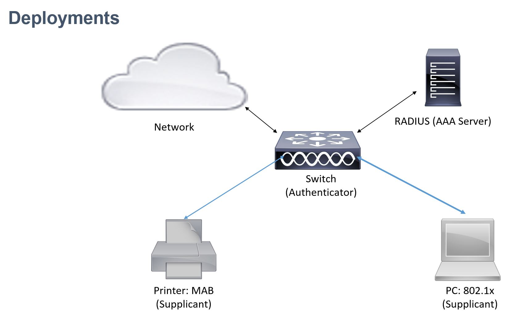
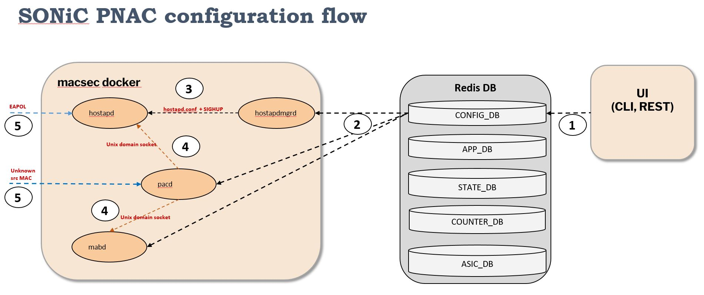
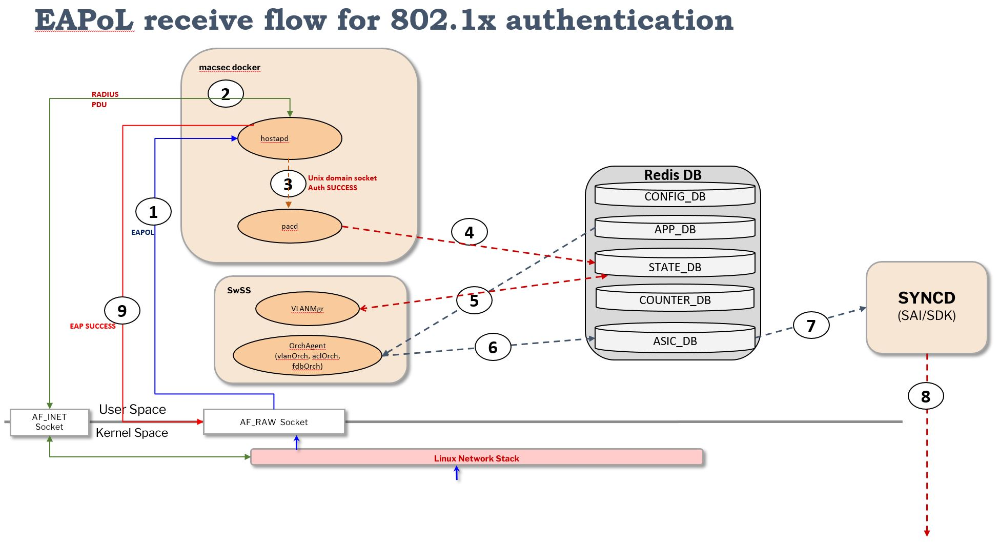


# Port Access Control in SONiC

# Table of Contents
- **[List of Tables](#list-of-tables)**
- **[Revision](#revision)**
- **[About this Manual](#about-this-manual)**
- **[Definitions and Abbreviations](#definitions-and-abbreviations)**
- **[1 Feature Overview](#1-feature-overview)**
  - [1.1 Port Access Control](#11-port-access-control)
  - [1.2 Requirements](#12-requirements)
    - [1.2.1 Functional Requirements](#121-functional-requirements)
    - [1.2.2 Configuration and Management Requirements](#122-configuration-and-management-requirements)
    - [1.2.3 Scalability Requirements](#123-scalability-requirements)
    - [1.2.4 Warm Boot Requirements](#124-warm-boot-requirements)
  - [1.3 Design Overview](#13-design-overview)
    - [1.3.1 Container](#131-container)
    - [1.3.2 SAI Support](#132-sai-support)
- **[2 Functionality](#2-functionality)**
  - [2.1 Target Deployment Use Cases](#21-target-deployment-use-cases)
  - [2.2 Functional Description](#22-functional-description)
    - [2.2.1 802.1x](#221-802.1x)
    - [2.2.2 MAC Authentication Bypass](#222-mac-authentication-bypass)
    - [2.2.3 RADIUS](#223-radius)
    - [2.2.4 PAC Interface Host Modes](#224-pac-interface-host-modes)
    - [2.2.5 VLAN](#225-vlan)
    - [2.2.6 MAC move](#226-mac-move)
    - [2.2.7 Warmboot](#227-warmboot)
- **[3 Design](#3-design)**
  - [3.1 Overview](#31-overview)
    - [3.1.1 Configuration flow](#311-configuration-flow)
    - [3.1.2 EAPoL Receive flow](#312-eapol-receive-flow)
    - [3.1.3 MAB Packet receive flow](#313-mab-packet-receive-flow)
    - [3.1.4 RADIUS](#314-radius)
  - [3.2 DB Changes](#32-db-changes)
    - [3.2.1 Config DB](#321-config-db)
    - [3.2.2 App DB](#322-app-db)
    - [3.2.3 ASIC DB](#323-asic-db)
    - [3.2.4 Counter DB](#324-counter-db)
    - [3.2.5 State DB](#325-state-db)
  - [3.3 Switch State Service Design](#33-switch-state-service-design)
    - [3.3.1 Orchestration Agent](#331-orchestration-agent)
  - [3.4 PAC Modules](#34-pac-modules)
    - [3.4.1 Authentication Manager](#341-authentication-manager)
    - [3.4.2 mabd](#342-mabd)
    - [3.4.3 hostapd](#343-hostapd)
    - [3.4.4 hostapdmgrd](#344-hostapdmgrd)
    - [3.4.5 Interaction between modules](#345-interaction-between-modules)
  - [3.5 SyncD](#35-syncd)
  - [3.6 SAI](#36-sai)
    - [3.6.1 Host Interface Traps](#361-host-interface-traps)
    - [3.6.2 Bridge port learning modes](#362-bridge-port-learning-modes)
    - [3.6.3 FDB](#363-fdb)
    - [3.6.4 VLAN](#363-vlan)
  - [3.7 Manageability](#37-manageability)
    - [3.7.1 Yang Model](#371-yang-model)
    - [3.7.2 Configuration Commands](#372-configuration-commands)
    - [3.7.3 Show Commands](#373-show-commands)
    - [3.7.4 Clear Commands](#373-clear-commands)
- **[4 Scalability](#4-scalability)**
- **[5 Appendix: Sample configuration](#5-appendix-sample-configuration)**
- **[6 Future Enhancements](#6-future-enhancements)**

# List of Tables
[Table 1 Abbreviations](#table-1-abbreviations)

# Revision
| Rev  | Date       | Author                                   | Change Description |
| ---- | ---------- | ---------------------------------------- | ------------------ |
| 0.1  | 04/05/2023 | Amitabha Sen, Vijaya Abbaraju, Shirisha Dasari, Anil Kumar Pandey | Initial version 
   | 0.2  | 04/02/2024 | Vijaya Abbaraju | Updated the CLI config, show and clear commands. 
   0.3  | 04/10/2024 | Vijaya Abbaraju | Updated  the docker used for PAC and code PRs. 
|


# About this Manual

This document describes the design details of the Port Access Control (PAC) feature in SONiC. 


# Definitions and Abbreviations

| **Term**      | **Meaning**                              |
| ------------- | ---------------------------------------- |
| Authenticator | An entity that enforces authentication on a port before allowing access to services available on that port |
| CoPP          | Control Plane Policing                   |
| 802.1x        | IEEE 802.1x standard                     |
| EAPoL         | Extensible Authentication Protocol over LAN |
| MAB           | MAC Authentication Bypass                |
| PAC           | Port Access Control                      |
| PAE           | Port Access Entity                       |
| RADIUS        | Remote Authentication Dial In User service |
| Supplicant    | A client that attempts to access services offered by the Authenticator |
| AAA           | Authentication, Authorization, Accounting |

# 1 Feature Overview

## 1.1 Port Access Control
Port Access Control (PAC) provides a means of preventing unauthorized access by users to the services offered by a Network. 

An entity (Port Access Entity) can adopt one of two distinct roles within an access control interaction:   

1. Authenticator: An entity that enforces authentication on a port before allowing access to services available on that port.
2. Supplicant: A client that attempts to access services offered by the Authenticator.   

Additionally, there exists a third role:   

3. Authentication Server: Performs the authentication function necessary to check the credentials of the Supplicant on behalf of the Authenticator.  

Port access control is achieved by enforcing authentication of Supplicants that are attached to an Authenticator's controlled Ports. The result of the authentication process determines whether the Supplicant is authorized to access services on that controlled port.   

All three roles are required in order to complete an authentication exchange. A Switch needs to support the Authenticator role, as is supported by PAC. The Authenticator PAE is responsible for communicating with the Supplicant, submitting the information received from the Supplicant to the Authentication Server in order for the credentials to be checked. The Authenticator PAE controls the authorized/unauthorized state of the clients on the controlled port depending on the outcome of the authentication process.


## 1.2 Requirements

### 1.2.1 Functional Requirements

***PAC***   
The following are the requirements for Port Access Control feature:
1. PAC should be supported on physical interfaces only.

2. PAC should enforce access control for clients on switch ports using the following authentication mechanisms:
   - 802.1x
   - MAB (MAC Authentication Bypass).

3. It should be possible to enable both 802.1x and MAB on a port together. Their relative order and priority should be configurable.

4. The following Host modes should be supported

   - Multiple Hosts mode: only one client can be authenticated on a port and after that access is granted to all clients connected to the port
   - Single-Host mode: one client can be authenticated on a port and is granted access to the port at a given time.
   - Multiple Authentication mode: multiple clients can be authenticated on a port and these clients are then granted access. All clients are authorized on the same VLAN.

5. The following PAC port modes should be supported: 
  - Auto : Authentication is enforced on the port. Traffic is only allowed for authenticated clients
  - Force Authorized : All traffic is allowed.
  - Force Unauthorized : All traffic is blocked.

6. Reauthentication of clients is supported.


***802.1x***   

PAC should support 802.1x Authenticator functionality.

***MAB***   

PAC should support MAB for authentication, primarily to support clients that do not support 802.1x.

***RADIUS***   
1. PAC should support RADIUS client functionality to be able to authenticate clients using RADIUS.
2. PAC 802.1x should support multiple EAP authentication methods like EAP-MD5, EAP-PEAP, EAP-TLS, etc.
3. PAC MAB should support the EAP authentication methods EAP-MD5, EAP-PAP and EAP-CHAP.
4. The following Authorization attributes from RADIUS should be supported:
   - VLAN
   - Session-Timeout
   - Session-Termination-Action
5. RADIUS authentication should be tested/qualified with the following RADIUS Servers:   
  - FreeRADIUS
  - ClearPass
  - Cisco ISE.


### 1.2.2 Configuration and Management Requirements
PAC should support configuration using CLI and JSON based input.

List of configuration shall include the following:   
- configuring the port control mode of an interface.
- configuring the host mode of an interface.
- configuring the PAE role of an interface.
- enabling the 802.1x authentication support on the switch.
- enabling MAC Authentication Bypass (MAB) on an interface.
- enabling the authentication method of MAC Authentication Bypass (MAB) on an interface.
- configuring the maximum number of clients supported on an interface when multi-authentication host mode is enabled on the port.
- enabling periodic reauthentication of the supplicant on an interface.
- enabling periodic reauthentication timer configuration of the supplicant on an interface.
- configuring the order of authentication methods used on a port.
- configuring the priority for the authentication methods used on a port.

### 1.2.3 Scalability Requirements
16 authenticated clients per port with a maximum of 128 authenticated clients per switch should be supported.

## 1.3 Design Overview

### 1.3.1 Container
The "pac" docker holds all the port security applications. Code changes are also made to the SWSS docker.

### 1.3.2 SAI Support
No changes to SAI spec for supporting PAC.

# 2 Functionality

## 2.1 Target Deployment Use Cases

The following figure illustrates how clients like PCs and printers are authenticated and authorized for accessing the network.   




**Figure 1 : PAC target deployment use cases**   

## 2.2 Functional Description

PAC uses authentication methods 802.1x and MAB for client authentication. These methods in turn use RADIUS for client credential verification and receive the authorization attributes like VLANs, for the authenticated clients. 

### 2.2.1 802.1x

PAC leverages the IEEE 802.1X-2004 for 802.1x standard as available in the "hostapd" implementation in the sonic-wpa-supplicant folder. It is an IEEE Standard for Port Access Control that provides an authentication mechanism to devices wishing to attach to a LAN. The standard defines Extensible Authentication Protocol over LAN (EAPoL), which is an encapsulation technique to carry EAP packets between the Supplicant and the Authenticator. The standard describes an architectural framework within which authentication and consequent actions take place. It also establishes the requirements for a protocol between the Authenticator and the Supplicant, as well as between the Authenticator and the Authentication server. 

### 2.2.2 MAC Authentication Bypass

PAC makes use of MAC Authentication Bypass (MAB) feature to authenticate devices like cameras or printers which do not support 802.1x. MAB makes use of the device MAC address to authenticate the client.

### 2.2.3 RADIUS 
***Authentication***

PAC (Authenticator) uses an external RADIUS server for client authentication. It determines the authorization status of the clients based on RADIUS Access-Accept or Access-Reject frames as per the RADIUS RFC 2865. 

PAC as a PAE Authenticator for 802.1x is essentially a passthrough for client Authentication exchange messages. Hence different EAP authentication methods like EAP-MD5, EAP-PEAP, EAP-TLS, etc. are supported. These are essentially the 802.1x Supplicant and RADIUS server functionalities.

PAC as a PAE Authenticator for MAB mimics the Supplicant role for MAB clients. Authentication methods EAP-MD5, EAP-PAP and EAP-CHAP are supported.

***Authorization***

Once a client is authenticated, authorization parameters from RADIUS can be sent for the client. The Authenticator switch processes these RADIUS attributes to apply to the client session. Following attributes are supported.

- *VLAN Id*: This is the VLAN ID sent by a RADIUS server for the authenticated client. This VLAN should be a pre-created VLAN on the switch. 
- *Session Timeout*: This is the timeout attribute of the authenticated client session.
- *Session Termination Action*: Upon session timeout, the Session Termination Action determines the action on the client session. The following actions are defined:
  - *Default*: The client session is torn down and authentication needs to be restarted for the client.
  - *RADIUS*: Re-authentication is initiated for the client.

### 2.2.4 PAC Interface Host Modes

PAC works with port learning modes and FDB entries to block or allow traffic for authenticated clients as needed. 

- **Multiple Host mode**: A single client can be authenticated on the port. With no client authenticated on the port, the learning mode is set to DROP or CPU_TRAP (if MAB is enabled on the port). Once a client is authenticated on a port, the learning mode is set to HW. All clients connected to the port are allowed access and FDB entries are populated dynamically.

- **Single Host and Multiple Authentication Modes**: All clients on the port need to authenticate. The learning mode of the port is always set to CPU_TRAP. Once a client starts the authentication process, the client is no longer unknown to PAC. PAC installs a static FDB entry to mark the client known so that the incoming traffic does not flood the CPU. The entry is installed with discard bits set to prevent client traffic from being forwarded. In effect, the packets are not flooded to the CPU nor forwarded to other ports during the authentication process. When the client is authenticated, the discard bits of the installed FDB entry are reset to allow client traffic. 

  ​

### 2.2.5 VLAN
1. PAC associates authenticated clients to a VLAN on the port.
2. If RADIUS assigns a VLAN to a client, the port's configured untagged VLAN membership is reverted and the RADIUS assigned VLAN is used to authorize the client. The RADIUS assigned VLAN is operationally configured as the untagged VLAN of the port.  All incoming untagged client traffic is assigned to this VLAN. Any incoming client's tagged traffic will be allowed or dropped based on if it matches the port's configured untagged VLAN or not.
3. If RADIUS does not assign a VLAN to a client, the port's configured untagged VLAN is used to authorize the client. The port's untagged VLAN configuration is retained and all incoming untagged client traffic is assigned to this VLAN. Any incoming client's tagged traffic will be allowed or dropped based on if it matches the port's configured untagged VLAN or not.
4. All clients on a port are always associated with a single VLAN.
5. The RADIUS assigned VLAN configured is reverted to the port's configured untagged VLAN once the last authenticated client on the port logs off.
6. When PAC is disabled on the port, the operationally added untagged VLAN, if present, is removed from the port and the user configured untagged VLAN is assigned back to the port.
7. If clients are authorized on the port's configured untagged VLAN and the VLAN configuration is modified, all the authenticated clients on the port are removed.
8. If clients are authorized on RADIUS assigned VLAN, any updates on the port's configured untagged VLAN does not affect the clients. The configuration is updated in the CONFIG_DB but not propagated to the port.


### 2.2.6 MAC move

If a client that is authorized on one port moves to another port controlled by PAC, the existing client session is torn down and the authentication is attempted again on the new port.

### 2.2.7 Warmboot

After a Warm Boot, the authenticated client sessions are torn down and they need to authenticate again.

# 3 Design

## 3.1 Overview

[Figure 2](#configuration-flow) shows the high level design overview of PAC services in SONiC. The "pac" docker is used for this functionality. 

PAC is composed of multiple sub-modules. 

1. pacd: PAC daemon is the main module that controls client authentication. It is the central repository of PAC clients. It makes use of hostapd and mabd daemons to authenticate clients via 802.1x and MAB respectively.

2. hostapd: This 802.1x module is an opensource Linux application that is available in the SONiC sonic-wpa-supplicant folder. It uses hostapd.conf as its config file. 

3. mabd: This is the MAB authentication module.

4. hostapdmgrd: This is the hostapd manager module. It listens to 802.1x specific configurations from CONFIG_DB and translates them to respective hostapd.conf file config entries and commands to hostapd.


### 3.1.1 Configuration flow



**Figure 2: PAC service daemon and configuration flow**

1. Mgmt interfaces like CLI write the user provided configuration to CONFIG_DB.
2. The pacd, mabd and hostapdmgrd gets notified about their respective configurations.
3. hostapd being a standard Linux application gets its configuration from a hostapd.conf file. hostapdmgrd  generates the hostapd.conf file based on the relevant CONFIG_DB tables. hostapdmgrd informs hostapd about the list of ports it needs to run on. This port list is dynamic as it depends of port link/admin state, port configuration etc. hostapdmgrd  keeps hostapd updated about these changes. 
4. These modules communicate amongst themselves via socket messages.
5. hostapd listens to EAPoL PDUs on the provided interface list. When it receives a PDU, it consults pacd and proceeds to authenticate the client. pacd also listens to "unknown src MAC" and triggers MAB, if configured on the port, to authenticate the client.


### 3.1.2 EAPoL receive flow




**Figure 3: EAPoL receive flow**

1. EAPoL packet is received by hardware on a front panel interface and trapped to the CPU by COPP rules for EAP. The packet gets delivered to the hostapd socket listening on EtherType 0x888E.
2. In a multi-step process, hostapd runs the 802.1x state machine to Authenticate the client via RADIUS.
3. On successful authentication of a client, hostapd sends a "Client Authenticated" message to pacd with all the authorization parameters like VLAN, Session-Timeout, etc.
4. pacd proceeds to authorize the client. RADIUS authorization parameters like client VLAN membership, is communicated to relevant modules (VLAN, FDB) by writing on their tables on STATE_DB.  Authenticated clients are updated in PAC_AUTHENTICATED_CLIENT_OPER table in STATE_DB.
5. VLAN, FDB further process these STATE_DB updates from PAC and write into their STATE_DB and APPL_DB tables.
6. Orchagent in SWSS docker gets notified about changes in APPL_DB and responds by translating the APPL_DB changes to respective sairedis calls.
7. Sairedis APIs write into ASIC_DB.
8. Syncd gets notified of changes to ASIC_DB and in turn calls respective SAI calls. The SAI calls translate to respective SDK calls to program hardware.
9. EAP Success message (EAPoL PDU) is sent to the client.


### 3.1.3 MAB packet receive flow


**Figure 4: MAB PDU receive flow**

1. Unknown source MAC packets are received by hardware on a front panel interface and trapped to CPU. The packets gets delivered to a pacd socket.
2. pacd sends a "Client Authenticate" message along with the received packet MAC to mabd.
3. mabd interacts with RADIUS server to authenticate the given client based on the MAC.
4. On successful authentication of a client, mabd sends an "Client Authenticated" message to pacd with all the authorization parameters like VLAN, Session-Timeout, etc.
5. pacd proceeds to authorize the client. RADIUS authorization parameters like client VLAN membership, is communicated to relevant modules (VLAN, FDB) by writing on their tables on STATE_DB.  Authenticated clients are updated in PAC_AUTHENTICATED_CLIENT_OPER table in STATE_DB.
6. VLAN, FDB further process these STATE_DB updates from PAC and write into their STATE_DB and APPL_DB tables.
7. Orchagent in SWSS docker gets notified about changes in APPL_DB and responds by translating the APPL_DB changes to respective sairedis calls.
8. Sairedis APIs write into ASIC_DB.
9. Syncd gets notified of changes to ASIC_DB and in turn calls respective SAI calls. The SAI calls translate to respective SDK calls to program hardware.
10. EAP success message (EAPoL PDU) is sent to the client.


### 3.1.4 RADIUS

PAC uses the RADIUS client from hostapd. 

PAC supports only 1 RADIUS server. The highest priority server will be picked up for authentication. 


## 3.2 DB Changes

### 3.2.1 Config DB

**PAC_PORT_CONFIG**   
```   
"PAC_PORT_CONFIG": {
  "Ethernet1": {
    "method_list": [
      "dot1x",
      "mab"
    ],
    "priority_list": [
      "dot1x",
      "mab"
    ],
    "port_pae_role": "authenticator",
    "port_control_mode": "auto",
    "host_control_mode": "multi_auth",
    "reauth_period": 60,
    "reauth_enable": "true",
    "max_users_per_port": 16,
  }
}


key                       =      PAC_PORT_CONFIG:port     ;Physical port
     
;field                    =      value
     
method_list               =      "dot1x"/"mab"                  ;List of methods to be used for authentication
     
priority_list             =      "dot1x"/"mab"                  ;Relative priority of methods to be used for authentication
     
port_pae_role             =      "none"/"authenticator"         ;"none": PAC is disabled on the port
                                                                "authenticator": PAC is enabled on the port

port_control_mode         =      "auto"/"force_authorized"/     ;"auto": authentication enforced on port
                                "force_unauthorized" ;          "force_authorized": authentication not enforced on port
                                                                "force_unauthorized": authentication not enforced on port but port is blocked for all traffic
     
host_control_mode         =      "multi-host"/                  ;"multi-host": One data client can be authenticated on the port. Rest of the
                                "multi-auth"/"single-auth"      clients tailgate once the first client is authenticated.
                                                                "multi-auth": Multiple data client and one voice client can be authenticated on the port.
                                                                "single-auth": One data client or one voice client can be authenticated on the port.
     
reauth_period             =      1*10DIGIT                      ;The initial value of the timer that defines the period after which the will
                                                                 reauthenticate the Supplicant. Range is 1 - 65535 seconds.

reauth_enable             =     "true"/"false"                  ;Indicates whether Reauthentication is enabled on the port.
     
max_users_per_port        =     1*2DIGIT                        ;Maximum number of clients that can be authenticated on the port. This is applicable
                                                                 only for "multi-auth" host mode. Range is 1 - 16 clients.

```

**HOSTAPD_GLOBAL_CONFIG**   
```
"HOSTAPD_GLOBAL_CONFIG": {
  "global": {
    "dot1x_system_auth_control": "enable"
  }
}


;field = value 
dot1x_system_auth_control "true"/"false" ; Indicates whether 802.1x is enabled in the system.
```

**MAB_PORT_CONFIG**   
```   
"PAC_PORT_CONFIG": {
  "Ethernet1": {
    "mab": "enable",
    "mab_auth_type": "eap-md5",
  }
}


key                       =      PAC_PORT_CONFIG:port     ;Physical port
     
;field                    =      value
     
mab                       =      "enable"/"disable"              ;Indicates whether MAB is enabled on the port.
     
mab_auth_type             =      "eap-md5"/"pap"/"chap'          ;MAB authentication type


```

### 3.2.2 App DB

```
"VLAN_MEMBER_TABLE: {
    "Vlan10:Ethernet1": {
      "dynamic": "yes",
      "tagging_mode": "untagged"
    }
}
  
key                       =    VLAN_MEMBER_TABLE:Vlan:Port           ;Vlan and Physical port

;field                    =    value

dynamic                   =     "yes"/"no"                           ;"yes" = configured, "no" = assigned by RADIUS
tagging_mode              =     "untagged"/"tagged"                  ;Vlan tagging mode

```

```
"PORT_TABLE: {
  "Ethernet1": {
      "learn_mode": "drop",
      "pvid": "10"
  }
},
  
```
### 3.2.3 ASIC DB

None

### 3.2.4 Counter DB

None


### 3.2.5 State DB

**PAC_PORT_OPER**   

```   
"PAC_PORT_OPER": {
  "Ethernet1": {
    "enabled_method_list": [
      "dot1x",
      "mab"
    ],
    "enabled_priority_list": [
      "dot1x",
      "mab"
    ]
  }
}


key                     =    PAC_PORT_OPER:port               ;Physical port

;field                  =    value

enabled_method_list       =     "dot1x"/"mab"                       ;List of methods to be used for authentication
enabled_priority_list     =     "dot1x"/"mab"                       ;Relative priority of methods to be used for authentication

```


**PAC_AUTHENTICATED_CLIENT_OPER**   
```

"PAC_AUTHENTICATED_CLIENT_OPER": {
  "Ethernet1": [
    {
      "00:00:00:11:02:33": {
        "authenticated_method": "dot1x",
        "session_timeout": 60,
        "user_name": "sonic_user",
        "termination_action": 0,
        "vlan_id": 194,
        "session_time": 511,
      }
    },
    {
      "00:00:00:21:00:30": {
        "authenticated_method": "dot1x",
        "session_timeout": 60,
        "user_name": "sonic_user1",
        "termination_action": 0,
        "vlan_id": 194,
        "session_time": 51,
      }
    }
  ]
}


key = PAC_AUTHENTICATED_CLIENTS_OPER: mac ; Client MAC address
;field               = value ;
authenticated_method = "dot1x"/'mab" ; Method used to authenticate the client
session_timeout      = 1*10DIGIT ; Client session timeout
user_name            = 1*255VCHARS ; Client user name
termination_action   = 1DIGIT ; Client action on session timeout:
                            ;0: Terminate the client
                            ;1: Reauthenticate the client
vlan_id              = 1*4DIGIT ; VLAN associated with the authorized client
session_time        = 1*10DIGIT ; Client session time.

```


***PAC_GLOBAL_OPER***
```
"PAC_GLOBAL_OPER": {
  "global": {
    "num_clients_authenticated": 10
  }
}
;field                       =    value

num_clients_auth             =    1*10DIGIT                      ;number of clients authenticated
```

***STATE_OPER_PORT***
```
"STATE_OPER_PORT": {
  {
    "Ethernet0": {  
      "learn_mode": "cpu_trap",
      "acquired": "true",
    }
  }
}

;field   =    value
learn_mode     =    1*255VCHARS	;  learn mode
acquired     =    1*255VCHARS	;  whether the port is acquired by PAC

```

***STATE_OPER_VLAN***
```
"STATE_OPER_VLAN_MEMBER": {
  "Vlan10": [
    {
      "Ethernet0": {  
        "tagging_mode": "untagged",
      }
    }
  ]
}

;field          =    value
tagging_mode     =    1*255VCHARS	;  tagging mode                      

```

***STATE_OPER_FDB***
```
"STATE_OPER_FDB": {
  "Vlan10": [
    {
      "00:00:00:00:00:01": {  
        "port": "Ethernet0",
        "type": "static",
      }
    }
  ]
}

;field   =    value
port     =    1*255VCHARS	;  port
type     =    1*255VCHARS	;  FDB entry type

```


## 3.3 Switch State Service Design

### 3.3.1 Vlan Manager

VLAN Manager processes updates from "pacd" through STATE DB updates and propagates the Port learning mode, Port PVID and VLAN member updates to APP DB for further processing by OA. 

### 3.3.2 Orchestration Agent

OA processes updates from APP DB for setting the Port learning mode, VLAN membership and PVID and passes down the same to SAI Redis library for updating the ASIC DB.


## 3.4 PAC Modules
### **3.4.1 Authentication Manager**   

Authentication Manager is the central component of the pacd process. 

Authentication Manager enables configuring various Port Modes, Authentication Host Modes. These modes determine the number of clients and the type of clients that can be authenticated and authorized on the ports. 

Authentication Manager also enables configuring the authentication methods to be used for authenticating clients on a port. By default the configured authentication methods are tried in order for that port. The below authentication methods can be configured for each port.  
- 802.1X
- MAB

In the event that a port is configured for 802.1X and MAB in this sequence, the port will first attempt to authenticate the user through 802.1X. If 802.1X authentication times out, the switch will attempt MAB. The automatic sequencing of authentication methods allows the network administrator to apply the same configuration to every access port without having to know in advance what kind of device (employee or guest, printer or PC, IEEE 802.1X capable or not, etc.) will be attached to it.   

Authentication Manager allows configuring priority for each authentication method on the port. If the client is already authenticated using MAB and 802.1X happens to have higher priority than MAB, if a 802.1X frame is received, then the existing authenticated client will be authenticated again with 802.1x. However if 802.1X is configured at a lower priority than the authenticated method, then the 802.1X frames will be ignored.   

After successful authentication, the authentication method returns the Authorization parameters for the client. Authentication Manager uses these parameters for configuring the switch for allowing traffic for authenticated clients. If Authentication Manager cannot apply any of the authorization attributes for a client, client authentication will fail.

Client reauthentication is also managed by this module.

If RADIUS sends a Session timeout attribute with Termination action RADIUS (reauthenticate) or Default (clear client session), this module manages the client session timers for reauthentication or client cleanup.


### 3.4.2 mabd
mabd provides the MAC Authentication Bypass (MAB) functionality. MAB is intended to provide 802.1x unaware clients controlled access to the network using the devices’ MAC address as an identifier. This requires that the known and allowable MAC address and corresponding access rights be pre-populated in the authentication server.  

PAC supported authentication methods for MAB are as given below:
- CHAP
- EAP-MD5
- PAP

### 3.4.3 hostapd
Hostapd is an open source implementation of 802.1x standard and the Linux application is supplied with wpa_suplicant package. The wired driver module of hostapd is adapted to communicate with pacd via socket interface

. hostapd gets its configuration from the hostapd.conf file generated by hostapdmgrd.

### 3.4.4 hostapdmgrd
hostapdmgr reads hostapd specific configuration from SONiC DBs and populates the hostapd.conf. It further notifies the hostapd to re-read the configuration file.

### 3.4.5 Interaction between modules

*hostapd(802.1X)*   

hostapd comes to know of an 802.1x client attempting authentication via an EAP exchange. It informs pacd of this client by conveying the client MAC. If the authentication method selected by pacd is 802.1X, pacd sends an event to hostapd for authenticating the user. The client is however authenticated via MAB If the authentication method selected here is MAB.

hostapd informs pacd about the result of the authentication. hostapd also passes all the authorization parameters it receives from the RADIUS Server to the pacd. These are used for configuring the switch to allow authenticated client traffic.

*mabd(MAB)*   

When user or client tries to authenticate and the method selected is MAB, the pacd sends an event to mabd for authenticating the user. The client’s MAC address is sent to mabd for the same. 

pacd learns client’s MAC address through an hardware rule to Trap-to-CPU the packets from unknown source MAC addresses.

mabd informs pacd about the result of the authentication. mabd also passes all the authorization parameters it receives from the RADIUS Server to the pacd. These are used for configuring the NAS to allow authenticated client traffic.


## 3.5 SyncD

No specific changes are needed in syncd for PAC.

## 3.6 SAI

Existing SAI attributes are used for this implementation and there is no new SAI attribute requirement.

### 3.6.1 Host interface traps

Leveraged **SAI_HOSTIF_TRAP_TYPE_EAPOL** to trap EAP packets (Ethertype - 0x888E) to the CPU.   


### 3.6.2 Bridge port learning modes
PAC uses the following bridge port learning modes to drop/trap all unknown source MAC packets.   
- SAI_BRIDGE_PORT_FDB_LEARNING_MODE_DROP
- SAI_BRIDGE_PORT_FDB_LEARNING_MODE_HW
- SAI_BRIDGE_PORT_FDB_LEARNING_MODE_CPU_TRAP


### 3.6.3 FDB
PAC uses **SAI_FDB_ENTRY_ATTR_PACKET_ACTION** with **SAI_PACKET_ACTION_DROP** to put the static FDB entry in discard state.   
**SAI_PACKET_ACTION_FORWARD** is used to put the static FDB entry into forwarding state post successful client authentication.   


## 3.7 Manageability

### 3.7.1 Yang Model
Yang Models are available for managing PAC, hostapd and MAB modules. SONiC YANG is added as part of this contribution.

### 3.7.2 Configuration Commands

The following commands are used to configure PAC.  

| CLI Command                              | Description                              |
| :--------------------------------------- | :--------------------------------------- |
| config interface authentication port-control  <interface\> <auto \| force-authorized \| force-unauthorized \>   | This command configures the authentication mode to use on the specified interface. Default is force-authorized. |
| config interface dot1x pae <interface\> <authenticator \| none\>  | This command sets the PAC role on the port. Default is none. Role authenticator enables PAC on the port. |
| config interface authentication host-mode <interface\> <multi-auth \|  multi-host \| single-host \>  | This command configures the host mode on the specified interface. Default is multi-host. |
| config dot1x system-auth-control <enable\|disable\> | This command configures 802.1x globally. Default is disabled. |
| config interface authentication max-users <interface\> <max-users\> | This command configures max users on the specified interface. The count is applicable only in the multiple authentication host mode. Default is 16. |
| config interface mab  <interface\> <enable\|disable\> \[ auth-type <pap \| eap-md5 \| chap \>\] | This command configures MAB on the specified interface with the specified MAB authentication type. MAB is disabled by default. Default auth-type is eap-md5. |
| config interface authentication periodic <interface\> <enable\|disable> | This command enables periodic reauthentication of the supplicants on the specified interface. Default is disabled. |
| config interface authentication reauth-period <interface\> <seconds \| server\> | This command configures the reauthentication period of supplicants on the specified interface. The 'server' option is used to fetch this period from the RADIUS server. The 'seconds' option is used to configure the period locally. Default is 'server'. |
| config interface authentication order <interface\> <dot1x \[ mab \] \| mab \[ dot1x \]> | This command is used to set the order of authentication methods used on a port. Default order is 802.1x,mab. |
| config interface authentication priority <interface\> <dot1x \[ mab \] \| mab \[ dot1x \]> | This command is used to set the priority of authentication methods used on a port. Default priority is 802.1x,mab. |


### 3.7.3 Show Commands

**show authentication interface** 

This command displays the authentication manager information for the enabled interfaces

root@sonic:/home/admin# 
root@sonic:/home/admin# show authentication interface 

Interface    Port-Control    Host-Mode    Pae-Role         Max-Users  Reauth      Reauth-Period  Reauth-from-Serer    config-methods    config-priority    enabled-methods    enabled-priority
-----------  --------------  -----------  -------------  -----------  --------  ---------------  -------------------  ----------------  -----------------  -----------------  ------------------
Ethernet0    auto            multi-auth   authenticator           16  disabled               60  False                dot1x             dot1x,mab          dot1x,undefined    dot1x,undefined
root@sonic:/home/admin# 

**show authentication interface -i Ethernet0** 

This command displays the authentication manager information for the specified interface
```
root@sonic:/home/admin# show authentication interface -i Ethernet0

Interface    Port-Control    Host-Mode    Pae-Role       Max-Users    Reauth      Reauth-Period  Reauth-from-Serer    config-methods    config-priority    enabled-methods    enabled-priority
-----------  --------------  -----------  -------------  -----------  --------  ---------------  -------------------  ----------------  -----------------  -----------------  ------------------
Ethernet0    auto            multi-auth   authenticator           16  disabled               60  False                dot1x             dot1x,mab          dot1x,undefined    dot1x,undefined
root@sonic:/home/admin# 
```
**show authentication interface -i Ethernet0** 

This command displays the details authenticated clients.
```
root@sonic:/home/admin# show authentication clients 
Authenticated Clients : 1

Interface       mac-addr        user-name     vlan
-----------  ----------------- -----------   ------
Ethernet0    00:11:01:00:00:01  usr1          20
root@sonic:/home/admin# 
```
**show authentication interface -i Ethernet0** 

This command displays the details authenticated clients on specified interface.
```
root@sonic:/home/admin# show authentication clients -i Ethernet0
Authenticated Clients : 1

Interface    mac-addr           user-name      vlan
-----------  -----------------  -----------  ------
Ethernet0    00:11:01:00:00:01  usr1          20
root@sonic:/home/admin# 
```
**show mab <cr | interface\>**

This command is used to show a summary of the global mab configuration and summary information of the mab configuration for all ports. 
```
root@sonic:/home/admin# show mab interface

Interface    MAB Enabled    auth-type
-----------  -------------  -----------
Ethernet1    True           pap
root@sonic:/home/admin# 
```
**show mab <cr | interface\> -i Ethernet1**
This command also provides the detailed mab configuration for a specified port
root@sonic:/home/admin# show mab interface -i Ethernet1
```
Interface    MAB Enabled    auth-type
-----------  -------------  -----------
Ethernet1    True           pap
root@sonic:/home/admin# 
```
**show dot1x**

This command is used to show a summary of the global 802.1x configuration.
```
root@sonic:/home/admin# show dot1x
802.1X admin mode : Enabled
root@sonic:/home/admin# 
```
### 3.7.4 Clear Commands

**sonic-clear authenticaton sessions**

This command clears information for all Auth Manager sessions. All the authenticated clients are re-initialized and forced to authenticate again.
```
root@sonic:/home/admin# sonic-clear authentication sessions
```
**sonic-clear authenticaton sessions -i \<interface\>**
This command clears information for all Auth Manager sessions on the specified interface.
```
root@sonic:/home/admin# sonic-clear authentication sessions -i Ethernet0
```

**sonic-clear authenticaton sessions -m \<mac-addr\>**
This command clears information for specified client.
```
root@sonic:/home/admin# sonic-clear authentication sessions -m 00:00:00:11:22:33
```


# 4 Scalability

The following scale is supported:

| Configuration / Resource                 | Scale |
| ---------------------------------------- | ----- |
| Total number of authenticated clients on a port configured in Multiple Authentication host mode | 16    |
| Total number of authenticated clients supported by the switch | 128   |


# 5 Appendix: Sample configuration

```
config interface startup Ethernet0
config vlan add 10
config vlan member add 10 Ethernet0 -u
config radius add 10.10.10.1
config radius passkey mypasskey
config dot1x system-auth-control enable
config interface authentication port-control Ethernet0 auto
config interface authentication host-mode Ethernet0 multi-auth
config interface authentication order Ethernet0 dot1x
config interface authentication priority Ethernet0 dot1x
config interface dot1x pae Ethernet0 authenticator
config interface authentication periodic Ethernet1 enable
config interface authentication reauth-period Ethernet1 120
config interface authentication max-users Ethernet1 6
config interface mab Ethernet1 enable -a pap

```


# 6 Future Enhancements

1. Add configurability support for 802.1x and MAB timers.
2. Add support for fallback VLANs like Guest, Unauth etc. VLAN. These are used to authorize clients if they fail authentication under various circumstances.
3. Add support for RADIUS Authorization attributes like ACLs.
4. Add support for multiple RADIUS servers.

# 7 Code PRs

| Repo | Title |    PR   |
|--|--|   --|
| sonic-wpa-supplicant |sonic-wpasupplicant changes for PAC  | https://github.com/sonic-net/sonic-wpa-supplicant/pull/88   |
| sonic-wpa-supplicant |Changes to support PAC and 802.1X interaction | https://github.com/sonic-net/sonic-wpa-supplicant/pull/89  |
| sonic-wpa-supplicant |Changes in HOSTAPD to Support PAC | https://github.com/sonic-net/sonic-wpa-supplicant/pull/90   |
| sonic-wpa-supplicant |HOSTPAD driver changes for PAC | https://github.com/sonic-net/sonic-wpa-supplicant/pull/91   |
| sonic-utilities |CLI support for PAC | https://github.com/sonic-net/sonic-utilities/pull/3265   |
| sonic-buildimage |Docker and Makefile changes for PAC |  https://github.com/sonic-net/sonic-buildimage/pull/18616   |
| sonic-buildimage |Changes to handle PAC operational info |  https://github.com/sonic-net/sonic-buildimage/pull/18618  |
| sonic-buildimage |Changes to Handle PAC Mgr updates |  https://github.com/sonic-net/sonic-buildimage/pull/18619 |
| sonic-buildimage |PAC changes to receive config updates |  https://github.com/sonic-net/sonic-buildimage/pull/18620 |
| sonic-buildimage |Hostapd mgr changes for PAC |  https://github.com/sonic-net/sonic-buildimage/pull/18621 |
| sonic-buildimage |JSON lib changes to support PAC |  https://github.com/sonic-net/sonic-buildimage/pull/18622 |
| sonic-buildimage |MAB mgr changes for PAC |  https://github.com/sonic-net/sonic-buildimage/pull/18623 |
| sonic-buildimage |Makefile changes for PAC |  https://github.com/sonic-net/sonic-buildimage/pull/18624 |
| sonic-buildimage |MAB makefile and common header files |  https://github.com/sonic-net/sonic-buildimage/pull/18625 |
| sonic-buildimage |MAB common header files |  https://github.com/sonic-net/sonic-buildimage/pull/18626 |
| sonic-buildimage |MAB generic files |  https://github.com/sonic-net/sonic-buildimage/pull/18627 |
| sonic-buildimage |MAB control function changes |  https://github.com/sonic-net/sonic-buildimage/pull/18628 |
| sonic-buildimage |MAB protocol related header files |  https://github.com/sonic-net/sonic-buildimage/pull/18629 |
| sonic-buildimage |MAB protocol related changes |  https://github.com/sonic-net/sonic-buildimage/pull/18630 |
| sonic-buildimage |Auth mgr Makefile and common header files |  https://github.com/sonic-net/sonic-buildimage/pull/18631 |
| sonic-buildimage |Auth mgr generic header files |  https://github.com/sonic-net/sonic-buildimage/pull/18632 |
| sonic-buildimage |Authmgr event handling and other functionality|  https://github.com/sonic-net/sonic-buildimage/pull/18633 |
| sonic-buildimage |Auth mgr API interface functions|  https://github.com/sonic-net/sonic-buildimage/pull/18634 |
| sonic-buildimage |Authmgr include files for authentication functionality |  https://github.com/sonic-net/sonic-buildimage/pull/18635 |
| sonic-buildimage |Auth mgr functionality changes |  https://github.com/sonic-net/sonic-buildimage/pull/18636 |
| sonic-buildimage |PAC infra Makefile changes |  https://github.com/sonic-net/sonic-buildimage/pull/18637 |
| sonic-buildimage |PAC infra sonic interface files |  https://github.com/sonic-net/sonic-buildimage/pull/18638 |
| sonic-buildimage |PAC infra header files|  https://github.com/sonic-net/sonic-buildimage/pull/18639 |
| sonic-buildimage |PAC infra files|  https://github.com/sonic-net/sonic-buildimage/pull/18640 |
| sonic-buildimage |PAC infra util changes for logging|  https://github.com/sonic-net/sonic-buildimage/pull/18641 |
| sonic-buildimage |PAC infra utils changes for sim|  https://github.com/sonic-net/sonic-buildimage/pull/18642 |
| sonic-buildimage |PAC infra utilities|  https://github.com/sonic-net/sonic-buildimage/pull/18643 |
| sonic-buildimage |PAC libinfra tool|  https://github.com/sonic-net/sonic-buildimage/pull/18644 |
| sonic-buildimage |PAC Infra OS abstraction files|  https://github.com/sonic-net/sonic-buildimage/pull/18645 |
| sonic-buildimage |PAC Infra sysapi files|  https://github.com/sonic-net/sonic-buildimage/pull/18646 |

