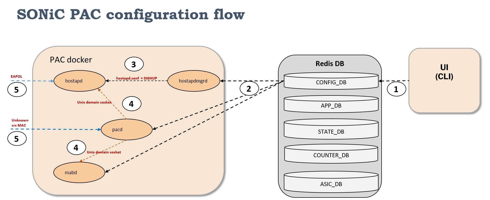
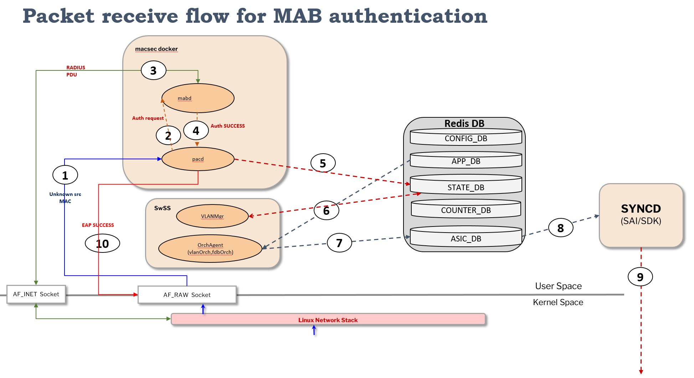

# Port Access Control in SONiC

# Table of Contents
- **[List of Tables](#list-of-tables)**
- **[Revision](#revision)**
- **[About this Manual](#about-this-manual)**
- **[Definitions and Abbreviations](#definitions-and-abbreviations)**
- **[1 Feature Overview](#1-feature-overview)**
  - [1.1 Port Access Control](#11-port-access-control)
  - [1.2 Requirements](#12-requirements)
    - [1.2.1 Functional Requirements](#121-functional-requirements)
    - [1.2.2 Configuration and Management Requirements](#122-configuration-and-management-requirements)
    - [1.2.3 Scalability Requirements](#123-scalability-requirements)
    - [1.2.4 Warm Boot Requirements](#124-warm-boot-requirements)
  - [1.3 Design Overview](#13-design-overview)
    - [1.3.1 Container](#131-container)
    - [1.3.2 SAI Support](#132-sai-support)
- **[2 Functionality](#2-functionality)**
  - [2.1 Target Deployment Use Cases](#21-target-deployment-use-cases)
  - [2.2 Functional Description](#22-functional-description)
    - [2.2.1 802.1x](#221-802.1x)
    - [2.2.2 MAC Authentication Bypass](#222-mac-authentication-bypass)
    - [2.2.3 RADIUS](#223-radius)
    - [2.2.4 PAC Interface Host Modes](#224-pac-interface-host-modes)
    - [2.2.5 VLAN](#225-vlan)
    - [2.2.6 Warmboot](#226-warmboot)
- **[3 Design](#3-design)**
  - [3.1 Overview](#31-overview)
    - [3.1.1 Configuration flow](#311-configuration-flow)
    - [3.1.2 EAPoL Receive flow](#312-eapol-receive-flow)
    - [3.1.3 MAB Packet receive flow](#313-mab-packet-receive-flow)
    - [3.1.4 RADIUS](#314-radius)
  - [3.2 DB Changes](#32-db-changes)
    - [3.2.1 Config DB](#321-config-db)
    - [3.2.2 App DB](#322-app-db)
    - [3.2.3 ASIC DB](#323-asic-db)
    - [3.2.4 Counter DB](#324-counter-db)
    - [3.2.5 State DB](#325-state-db)
  - [3.3 Switch State Service Design](#33-switch-state-service-design)
    - [3.3.1 Orchestration Agent](#331-orchestration-agent)
  - [3.4 PAC Modules](#34-pac-modules)
    - [3.4.1 Authentication Manager](#341-authentication-manager)
    - [3.4.2 mabd](#342-mabd)
    - [3.4.3 hostapd](#343-hostapd)
    - [3.4.4 hostapdmgrd](#344-hostapdmgrd)
    - [3.4.5 Interaction between modules](#345-interaction-between-modules)
  - [3.5 SyncD](#35-syncd)
  - [3.6 SAI](#36-sai)
    - [3.6.1 Host Interface Traps](#361-host-interface-traps)
    - [3.6.2 Bridge port learning modes](#362-bridge-port-learning-modes)
    - [3.6.3 FDB](#363-fdb)
    - [3.6.4 VLAN](#363-vlan)
  - [3.7 Manageability](#37-manageability)
    - [3.7.1 Yang Model](#371-yang-model)
    - [3.7.2 Configuration Commands](#372-configuration-commands)
    - [3.7.3 Show Commands](#373-show-commands)
    - [3.7.4 Clear Commands](#373-clear-commands)
- **[4 Scalability](#4-scalability)**
- **[5 Unit Test](#5-unit-test)**
- **[6 Appendix: Sample configuration](#6-appendix-sample-configuration)**
- **[7 Future Enhancements](#7-future-enhancements)**

# List of Tables
[Table 1 Abbreviations](#table-1-abbreviations)

# Revision
| Rev  | Date       | Author                                   | Change Description |
| ---- | ---------- | ---------------------------------------- | ------------------ |
| 0.1  | 04/05/2023 | Amitabha Sen, Vijaya Abbaraju, Shirisha Dasari, Anil Kumar Pandey | Initial version    |


# About this Manual

This document describes the design details of the Port Access Control (PAC) feature in SONiC. 


# Definitions and Abbreviations

| **Term**      | **Meaning**                              |
| ------------- | ---------------------------------------- |
| Authenticator | An entity that enforces authentication on a port before allowing access to services available on that port |
| CoPP          | Control Plane Policing                   |
| 802.1x        | IEEE 802.1x standard                     |
| EAPoL         | Extensible Authentication Protocol over LAN |
| MAB           | Mac-based Authentication Bypass          |
| PAC          | Port Access Control        |
| PAE           | Port Access Entity                       |
| RADIUS        | Remote Authentication Dial In User service |
| Supplicant    | A client that attempts to access services offered by the Authenticator |
| AAA           | Authentication, Authorization, Accounting |

# 1 Feature Overview

## 1.1 Port Access Control
Port Access Control (PAC) provides a means of preventing unauthorized access by users to the services offered by a Network. 

An entity (Port Access Entity) can adopt one of two distinct roles within an access control interaction:   

1. Authenticator: An entity that enforces authentication on a port before allowing access to services available on that port.
2. Supplicant: A client that attempts to access services offered by the Authenticator.   

Additionally, there exists a third role:   

1. Authentication Server: Performs the authentication function necessary to check the credentials of the Supplicant on behalf of the Authenticator.  

Port access control is achieved by enforcing authentication of Supplicants that are attached to an Authenticator's controlled Ports. The result of the authentication process determines whether the Supplicant is authorized to access services on that controlled port.   

All three roles are required in order to complete an authentication exchange. PAC supports the Authenticator role only, in which the PAE is responsible for communicating with the Supplicant. The Authenticator PAE is responsible for submitting the information received from the Supplicant to the Authentication Server in order for the credentials to be checked. The Authenticator PAE controls the authorized/unauthorized state of the clients on the controlled port depending on the outcome of the authentication process.


## 1.2 Requirements

### 1.2.1 Functional Requirements

***PAC***   
The following are the requirements for Port Access Control feature:
1. PAC should be supported on physical interfaces only.
   - The interfaces should not be part of a port-channel / LAG.
   - PAC should not supported on Out-of-band ports.

2. PAC should enforce access control for clients on switch ports using the following authentication mechanisms:
   - 802.1x
   - MAB (MAC Authentication Bypass).

3. It should be possible to enable both 802.1x and MAB on a port together. Their relative order and priority should be configurable.

4. The following Host modes should be supported

   - Single-Host mode: one client can be authenticated on a port and is granted access to the port at a given time.
   - Multiple Hosts mode: only one client can be authenticated on a port and after that access is granted to all clients connected to the port
   - Multiple Authentication mode: multiple clients can be authenticated on a port and these clients are then granted access. All clients are authorized on the same VLAN.

5. The following PAC port modes should be supported: 
  - Auto : Authentication is enforced on the port. Traffic is only allowed for authenticated clients
  - Force Authorized : All traffic is allowed.
  - Force Unauthorized : All traffic is blocked.

6. Reauthentication of clients is supported.


***802.1x***   

PAC should support 802.1x Authenticator functionality.

***MAB***   

PAC should support MAB for authentication, primarily to support clients that do not support 802.1x.

***RADIUS***   
1. PAC should support RADIUS client functionality to be able to authenticate clients using RADIUS.
2. PAC should support multiple EAP authentication methods like EAP-MD5, EAP-PEAP, EAP-TLS, etc.
3. The following Authorization attributes from RADIUS should be supported:
   - VLAN
   - Session-Timeout
   - Session-Termination-Action
4. RADIUS authentication should be tested/qualified with the following RADIUS Servers:   
  - FreeRADIUS
  - ClearPass
  - Cisco ISE.


### 1.2.2 Configuration and Management Requirements
PAC should support configuration using CLI and JSON based input.

List of configuration shall include the following:   
- configuring the port control mode of an interface.
- configuring the host mode of an interface.
- configuring the PAE role of an interface.
- enabling the 802.1x authentication support on the switch.
- enabling MAC Authentication Bypass (MAB) on an interface.
- enabling the authentication method of MAC Authentication Bypass (MAB) on an interface.
- configuring the maximum number of clients supported on an interface when multi-authentication host mode is enabled on the port.
- enabling periodic reauthentication of the supplicant on an interface.
- enabling periodic reauthentication timer configuration of the supplicant on an interface.
- configuring the order of authentication methods used on a port.
- configuring the priority for the authentication methods used on a port.

### 1.2.3 Scalability Requirements
16 authenticated clients per port with a maximum of 128 authenticated clients per switch should be supported.

## 1.3 Design Overview

### 1.3.1 Container
The existing "macsec" docker holds all the port security applications. Code changes are also made to the SWSS docker.

### 1.3.2 SAI Support
No changes to SAI spec for supporting PAC.

# 2 Functionality

## 2.1 Target Deployment Use Cases

The following figure illustrates how clients like PCs and printers are authenticated and authorized for accessing the network.   


**Figure 1 : PAC target deployment use cases**   

## 2.2 Functional Description

PAC uses authentication methods like 802.1x and MAB for client authentication. These methods in turn use RADIUS for client credential verification and receive the authorization attributes like VLANs, for the authenticated clients. 

### 2.2.1 802.1x

PAC leverages the IEEE 802.1X-2004 for 802.1x standard as available in the "hostapd" implementation in the "macsec" docker. It is an IEEE Standard for Port Access Control that provides an authentication mechanism to devices wishing to attach to a LAN. The standard defines Extensible Authentication Protocol over LAN (EAPoL), which is an encapsulation technique to carry EAP packets between the Supplicant and the Authenticator. The standard describes an architectural framework within which authentication and consequent actions take place. It also establishes the requirements for a protocol between the Authenticator and the Supplicant, as well as between the Authenticator and the Authentication server. 

### 2.2.2 MAC Authentication Bypass

PAC makes use of MAC Authentication Bypass (MAB) feature to authenticate devices like cameras or printers which do not support 802.1x. MAB makes use of the device MAC address to authenticate the client.

### 2.2.3 RADIUS 
***Authentication***

PAC (Authenticator) uses external RADIUS servers for client authentication. It determines the authorization status of the clients based on RADIUS Access-Accept or Access-Reject frames as per the RADIUS RFC 2865. 

PAC as a PAE Authenticator is essentially a passthrough for client Authentication. Hence different EAP authentication methods like EAP-MD5, EAP-PEAP, EAP-TLS, etc. are supported. These are essentially the Supplicant and RADIUS server functionalities.

***Authorization***

Once a client is authenticated, authorization parameters from RADIUS can be sent for the client. The Authenticator switch process these RADIUS attributes to apply to the client session. Following attributes are supported.

- *VLAN Id*: This is the VLAN ID sent by a RADIUS server for the authenticated client. This VLAN should be a pre-created VLAN on the switch. 
- *Session Timeout*: This is the timeout attribute of the authenticated client session.
- *Session Termination Action*: Upon session timeout, the Session Termination Action determines the action on the client session. The following actions are defined:
  - *Default*: The client session is torn down and authentication needs to be restarted for the client.
  - *RADIUS*: Re-authentication is initiated for the client.

### 2.2.4 PAC Interface Host Modes

PAC works with port learning modes and FDB entries to block or allow traffic for authenticated clients as needed. 

- **Single Host and Multiple Authentication Modes**: The learning mode of the port is always set to CPU_TRAP. Once a client starts the authentication process, the client is no longer unknown to PAC. PAC installs a static FDB entry to mark the client known so that the incoming traffic does not flood the CPU. The entry is installed with discard bits set to prevent client traffic from being forwarded. In effect, the packets are not flooded to the CPU nor forwarded to other ports during the authentication process. When the client is authenticated, the discard bits of the installed FDB entry are reset to allow client traffic. 
- **Multiple Host mode**: With no client authenticated on the port, the learning mode is set to DROP or CPU_TRAP (if MAB is enabled on the port). Once a client is authenticated on a port, the learning mode is set to HW. All clients connected to the port are allowed access and FDB entries are populated dynamically.

### 2.2.5 VLAN
1. PAC associates authenticated clients to a VLAN on the port.
2. If RADIUS assigns a VLAN to a client, the port's configured untagged VLAN membership is reverted and the RADIUS assigned VLAN is used to authorize the client. The RADIUS assigned VLAN is operationally configured as the untagged VLAN of the port.  All incoming untagged client traffic is assigned to this VLAN. Any incoming client's tagged traffic will be allowed or dropped based on if it matches the port's configured untagged VLAN or not.
3. If RADIUS does not assign a VLAN to a client, the port's configured untagged VLAN is used to authorize the client. The port's untagged VLAN configuration is retained and all incoming untagged client traffic is assigned to this VLAN. Any incoming client's tagged traffic will be allowed or dropped based on if it matches the port's configured untagged VLAN or not.
4. The RADIUS assigned VLAN configured is reverted to the port's configured untagged VLAN once the last authenticated client on the port logs off.
5. When PAC is disabled on the port, the operationally added untagged VLAN, if present, is removed from the port and the user configured untagged VLAN is assigned back to the port.
6. If clients are authorized on the port's configured untagged VLAN and the VLAN configuration is modified, all the authenticated clients on the port are removed.
7. If clients are authorized on RADIUS assigned VLAN, any updates on the port's untagged VLAN configuration does not affect the clients. The configuration is updated in the CONFIG_DB but not propagated to the port.


### 2.2.6 Warmboot

After a Warm Boot, the authenticated client sessions are torn down and they need to authenticate again.

# 3 Design

## 3.1 Overview

[Figure 2](#configuration-flow) shows the high level design overview of PAC services in SONiC. The existing "macsec" docker is leveraged. 

PAC is composed of multiple sub-modules. 

1. pacd: PAC daemon is the main module that controls client authentication. It is the central repository of PAC clients. It makes use of hostapd and mabd daemons to authenticate clients via 802.1x and MAB respectively.

2. hostapd: This 802.1x module is an opensource Linux application that is available in the SONiC "macsec" docker. It uses hostapd.conf as its config file. 

3. mabd: This is the MAB authentication module.

4. hostapdmgrd: This is the hostapd manager module. It listens to 802.1x specific configurations from CONFIG_DB and translates them to respective hostapd.conf file config entries and commands to hostapd.


### 3.1.1 Configuration flow



**Figure 2: PAC service daemon and configuration flow**

1. Mgmt interfaces like CLI and REST write the user provided configuration to CONFIG_DB.
2. The pacd, mabd and hostapdmgrd gets notified about their respective configurations.
3. hostapd being a standard Linux application gets its configuration from a hostapd.conf file. hostapdmgrd  generates the hostapd.conf file based on the relevant CONFIG_DB tables. hostapdmgrd informs hostapd about the list of ports it needs to run on. This port list is dynamic as it depends of port link/admin state, port configuration etc. hostapdmgrd  keeps hostapd updated about these changes. 
4. These modules communicate amongst themselves via Unix domain socket messages.
5. hostapd listens to EAPOL PDUs on the provided interface list. When it receives a PDU, it consults pacd and proceeds to authenticate the client. pacd also listens to "unknown src MAC" and triggers MAB, if configured on the port, to authenticate the client.


### 3.1.2 EAPoL receive flow


**Figure 3: EAPOL receive flow**

1. EAPOL packet is received by hardware on a front panel interface and trapped to the CPU by COPP rules for EAP. The packet gets through the KNET driver and Linux Network Stack and eventually gets delivered to hostapd socket listening on EtherType 0x888E on the kernel interface associated with the given front panel interface.
2. In a multi-step process, hostapd runs the 802.1x state machine to Authenticate the client via RADIUS.
3. On successful authentication of a client, hostapd sends a "Client Authenticated" Unix domain socket message to pacd with all the authorization parameters like VLAN, Session-Timeout, etc.
4. pacd proceeds to authorize the client. RADIUS authorization parameters like client VLAN membership, is communicated to relevant modules (VLAN, FDB) by writing on their tables on STATE_DB.  Authenticated clients are updated in PAC_AUTHENTICATED_CLIENT_OPER table in STATE_DB.
5. VLAN, FDB further process these STATE_DB updates from PAC and write into their STATE_DB and APPL_DB tables.
6. Orchagent in SWSS docker gets notified about changes in APPL_DB and responds by translating the APPL_DB changes to respective sairedis calls.
7. Sairedis APIs write into ASIC_DB.
8. Syncd gets notified of changes to ASIC_DB and in turn calls respective SAI calls. The SAI calls translate to respective SDK calls to program hardware.
9. EAP Success message (EAPOL PDU) is sent to the client.


### 3.1.3 MAB packet receive flow




**Figure 4: MAB PDU receive flow**

1. Unknown source MAC packets are received by hardware on a front panel interface and trapped to CPU. The packets gets through the KNET driver and Linux Network Stack and eventually gets delivered to pacd socket listening on the kernel interface associated with the given front panel interface.
2. pacd sends a "Client Authenticate" Unix domain socket message along with the received packet MAC to mabd.
3. mabd interacts with RADIUS server to authenticate the given client based on the MAC.
4. On successful authentication of a client, mabd sends an "Client Authenticated" Unix domain socket message to pacd with all the authorization parameters like VLAN, Session-Timeout, etc.
5. pacd proceeds to authorize the client. RADIUS authorization parameters like client VLAN membership, is communicated to relevant modules (VLAN, FDB) by writing on their tables on STATE_DB.  Authenticated clients are updated in PAC_AUTHENTICATED_CLIENT_OPER table in STATE_DB.
6. VLAN, FDB further process these STATE_DB updates from PAC and write into their STATE_DB and APPL_DB tables.
7. Orchagent in SWSS docker gets notified about changes in APPL_DB and responds by translating the APPL_DB changes to respective sairedis calls.
8. Sairedis APIs write into ASIC_DB.
9. Syncd gets notified of changes to ASIC_DB and in turn calls respective SAI calls. The SAI calls translate to respective SDK calls to program hardware.
10. EAP success message (EAPOL PDU) is sent to the client.


### 3.1.4 RADIUS

PAC uses the RADIUS client from hostapd. This RADIUS client is also used as a library by mabd. 

Existing RADIUS configuration provided in SONiC is used to configure the RADIUS client in PAC. The supported configuration parameters are Server identification (DNS Name, IPv4/IPv6 address), Server key, Server priority and Management VRF. 

PAC supports only 1 RADIUS server. The highest priority server will be picked up for authentication. 


## 3.2 DB Changes

### 3.2.1 Config DB

**PAC_PORT_CONFIG**   
```   
"PAC_PORT_CONFIG": {
  "Ethernet1": {
    "method_list": [
      "802.1x",
      "mab"
    ],
    "priority_list": [
      "802.1x",
      "mab"
    ],
    "port_pae_role": "authenticator",
    "port_control_mode": "auto",
    "host_control_mode": "multi_auth",
    "reauth_period": 60,
    "reauth_enable": "true",
    "max_users_per_port": 16,
  }
}


key                       =      PAC_PORT_CONFIG:port     ;Physical port
     
;field                    =      value
     
method_list               =      "802.1x"/"mab"                  ;List of methods to be used for authentication
     
priority_list             =      "802.1x"/"mab"                  ;Relative priority of methods to be used for authentication
     
port_pae_role             =      "none"/"authenticator"         ;"none": PAC is disabled on the port
                                                                "authenticator": PAC is enabled on the port

port_control_mode         =      "auto"/"force_authorized"/     ;"auto": authentication enforced on port
                                "force_unauthorized" ;          "force_authorized": authentication not enforced on port
                                                                "force_unauthorized": authentication not enforced on port but port is blocked for all traffic
     
host_control_mode         =      "multi-host"/                  ;"multi-host": One data client can be authenticated on the port. Rest of the
                                "multi-auth"/"single-auth"      clients tailgate once the first client is authenticated.
                                                                "multi-auth": Multiple data client and one voice client can be authenticated on the port.
                                                                "single-auth": One data client or one voice client can be authenticated on the port.
     
reauth_period             =      1*10DIGIT                      ;The initial value of the timer that defines the period after which the will
                                                                 reauthenticate the Supplicant. Range is 1 - 65535 seconds.

reauth_enable             =     "true"/"false"                  ;Indicates whether Reauthentication is enabled on the port.
     
max_users_per_port        =     1*2DIGIT                        ;Maximum number of clients that can be authenticated on the port. This is applicable
                                                                 only for "multi-auth" host mode. Range is 1 - 16 clients.

port_pae_role             =     "none"/"authenticator"          ;Port pae role
                                                                 none": PAC is disabled on the port.
                                                                 authenticator": PAC is enabled on the port

```

**HOSTAPD_GLOBAL_CONFIG**   
```
"HOSTAPD_GLOBAL_CONFIG": {
  "global": {
    "802.1x_system_auth_control": "enable"
  }
}


;field = value 
802.1x_system_auth_control "true"/"false" ; Indicates whether 802.1x is enabled in the system.
```

**MAB_PORT_CONFIG**   
```   
"PAC_PORT_CONFIG": {
  "Ethernet1": {
    "mab": "enable",
    "mab_auth_type": "eap-md5",
  }
}


key                       =      PAC_PORT_CONFIG:port     ;Physical port
     
;field                    =      value
     
mab                       =      "enable"/"disable"              ;Indicates whether MAB is enabled on the port.
     
mab_auth_type             =      "eap-md5"/"pap"/"chap'          ;MAB authentication type


```

### 3.2.2 App DB

```
"VLAN_MEMBER_TABLE: {
    "Vlan10:Ethernet1": {
      "dynamic": "yes",
      "tagging_mode": "untagged"
    }
}
  
key                       =    VLAN_MEMBER_TABLE:Vlan:Port           ;Vlan and Physical port

;field                    =    value

dynamic                   =     "yes"/"no"                           ;"yes" = configured, "no" = assigned by RADIUS
tagging_mode              =     "untagged"/"tagged"                  ;Vlan tagging mode

```

```
"PORT_TABLE: {
  "Ethernet1": {
      "learn_mode": "drop",
      "pvid": "10"
  }
},
  
```
### 3.2.3 ASIC DB

None

### 3.2.4 Counter DB

None


### 3.2.5 State DB

**PAC_PORT_OPER**   

```   
"PAC_PORT_OPER": {
  "Ethernet1": {
    "enabled_method_list": [
      "802.1x",
      "mab"
    ],
    "enabled_priority_list": [
      "802.1x",
      "mab"
    ]
  }
}


key                     =    PAC_PORT_OPER:port               ;Physical port

;field                  =    value

enabled_method_list       =     "802.1x"/"mab"                       ;List of methods to be used for authentication
enabled_priority_list     =     "802.1x"/"mab"                       ;Relative priority of methods to be used for authentication

```


**PAC_AUTHENTICATED_CLIENT_OPER**   
```

"PAC_AUTHENTICATED_CLIENT_OPER": {
  "Ethernet1": [
    {
      "00:00:00:11:02:33": {
        "authenticated_method": "802.1X",
        "session_timeout": 60,
        "user_name": "sonic_user",
        "termination_action": 0,
        "vlan_id": 194,
        "session_time": 511,
      }
    },
    {
      "00:00:00:21:00:30": {
        "authenticated_method": "802.1X",
        "session_timeout": 60,
        "user_name": "sonic_user1",
        "termination_action": 0,
        "vlan_id": 194,
        "session_time": 51,
      }
    }
  ]
}


key = PAC_AUTHENTICATED_CLIENTS_OPER: mac ; Client MAC address
;field               = value ;
authenticated_method = "802.1x"/'mab" ; Method used to authenticate the client
session_timeout      = 1*10DIGIT ; Client session timeout
user_name            = 1*255VCHARS ; Client user name
termination_action   = 1DIGIT ; Client action on session timeout:
                            ;0: Terminate the client
                            ;1: Reauthenticate the client
vlan_id              = 1*4DIGIT ; VLAN associated with the authorized client
session_time        = 1*10DIGIT ; Client session time.

```


***PAC_GLOBAL_OPER***
```
"PAC_GLOBAL_OPER": {
  "global": {
    "num_clients_authenticated": 10
  }
}
;field                       =    value

num_clients_auth             =    1*10DIGIT                      ;number of clients authenticated
```

***STATE_OPER_VLAN***
```
"STATE_OPER_VLAN_MEMBER": {
  "Vlan10": [
    {
      "Ethernet0": {  
        "tagging_mode": "untagged",
      }
    }
  ]
}

;field          =    value
tagging_mode     =    1*255VCHARS	;  tagging mode                      

```

## 3.3 Switch State Service Design

### 3.3.1 Vlan Manager

VLAN Manager processes updates from "pacd" through STATE DB updates and propagates the Port learning mode, Port PVID and VLAN member updates to APP DB for further processing by OA. 

### 3.3.2 Orchestration Agent

OA processes updates from APP DB for setting the Port learning mode, VLAN membership and PVID and passes down the same to SAI Redis library for updating the ASIC DB.
For VLAN membership, port PVID will not be set until PVID update is received separately for the port. 


## 3.4 PAC Modules
### **3.4.1 Authentication Manager**   

Authentication Manager is the central component of the pacd process. 

Authentication Manager enables configuring various Port Modes, Authentication Host Modes. These modes determine the number of clients and the type of clients that can be authenticated and authorized on the ports. 

Authentication Manager also enables configuring the authentication methods to be used for authenticating clients on a port. By default the configured authentication methods are tried in order for that port. The below authentication methods can be configured for each port.  
- 802.1X
- MAB

In the event that a port is configured for 802.1X and MAB in this sequence, the port will first attempt to authenticate the user through 802.1X. If 802.1X authentication times out, the switch will attempt MAB. The automatic sequencing of authentication methods allows the network administrator to apply the same configuration to every access port without having to know in advance what kind of device (employee or guest, printer or PC, IEEE 802.1X capable or not, etc.) will be attached to it.   

Authentication Manager allows configuring priority for each authentication method on the port. If the client is already authenticated using MAB and 802.1X happens to have higher priority than MAB, if a 802.1X frame is received, then the existing authenticated client will be authenticated again with 802.1x. However if 802.1X is configured at a lower priority than the authenticated method, then the 802.1X frames will be ignored.   

After successful authentication, the authentication method returns the Authorization parameters for the client. Authentication Manager uses these parameters for configuring the switch for allowing traffic for authenticated clients. If Authentication Manager cannot apply any of the authorization attributes for a client, client authentication will fail.

Client reauthentication is also managed by this module.


### 3.4.2 mabd
mabd provides the MAC Authentication Bypass (MAB) functionality. MAB is intended to provide 802.1x unaware clients controlled access to the network using the devices’ MAC address as an identifier. This requires that the known and allowable MAC address and corresponding access rights be pre-populated in the authentication server.  

PAC supported authentication methods for MAB are as given below:
- CHAP
- EAP-MD5
- PAP

### 3.4.3 hostapd
Hostapd is an open source implementation of 802.1x standard and the Linux application is supplied with wpa_suplicant package. The wired driver module of hostapd is adapted to communicate with pacd via socket interface instead of directly controlling the interfaces. hostapd gets its configuration from the hostapd.conf file generated by hostapdmgrd.

### 3.4.4 hostapdmgrd
hostapdmgr reads hostapd specific configuration from SONiC DBs and populates the hostapd.conf. It further notifies the hostapd to re-read the configuration file.

### 3.4.5 Interaction between modules

*hostapd(802.1X)*   

hostapd comes to know of an 802.1x client attempting authentication via an EAP exchange. It informs pacd of this client by conveying the client MAC. If the authentication method selected by pacd is 802.1X, pacd sends an event to hostapd for authenticating the user. The client is however authenticated via MAB If the authentication method selected here is MAB.

hostapd informs pacd about the result of the authentication. hostapd also passes all the authorization parameters it receives from the RADIUS Server to the pacd. These are used for configuring the switch to allow authenticated client traffic.

*mabd(MAB)*   

When user or client tries to authenticate and the method selected is MAB, the pacd sends an event to mabd for authenticating the user. The client’s MAC address is sent to mabd for the same. 

pacd learns client’s MAC address through an hardware rule to copy-to-CPU the packets from unknown source MAC addresses.

mabd informs pacd about the result of the authentication. mabd also passes all the authorization parameters it receives from the RADIUS Server to the pacd. These are used for configuring the NAS to allow authenticated client traffic.


## 3.5 SyncD

No specific changes are needed in syncd for PAC.

## 3.6 SAI

### 3.6.1 Host interface traps
Leveraged **SAI_HOSTIF_TRAP_TYPE_EAPOL** to trap EAP packets (Ethertype - 0x888E) to the CPU.   


### 3.6.2 Bridge port learning modes
PAC uses the following bridge port learning modes to drop/trap all unknown source MAC packets.   
- SAI_BRIDGE_PORT_FDB_LEARNING_MODE_DROP
- SAI_BRIDGE_PORT_FDB_LEARNING_MODE_HW
- SAI_BRIDGE_PORT_FDB_LEARNING_MODE_CPU_TRAP


### 3.6.3 FDB
PAC uses **SAI_FDB_ENTRY_ATTR_PACKET_ACTION** with **SAI_PACKET_ACTION_DROP** to put the static FDB entry in discard state.   
**SAI_PACKET_ACTION_FORWARD** is used to put the static FDB entry into forwarding state post successful client authentication.   


## 3.7 Manageability

### 3.7.1 Yang Model
```
sonic-pac.yang:

module sonic-pac {
    namespace "http://github.com/sonic-net/sonic-pac";
    prefix spac;
    yang-version 1.1;

    import sonic-port {
        prefix prt;
    }

    description
        "SONiC PAC";

    revision 2023-03-28 {
        description "Initial revision.";
    }


    container sonic-pac {
        description "PAC top level container.";

        container PAC_PORT_CONFIG {
             description
                   "Container for port config table.";

             list PAC_PORT_CONFIG_TABLE_LIST {
                key "port";

                leaf port {
                   type leafref {
                        path "/prt:sonic-port/prt:PORT/prt:PORT_LIST/prt:name";
                   }
                   description
                        "Name of the interface on which port control mode gets applied.";
                 }

                leaf port_control_mode {
                   type enumeration {
                        enum auto {
                           description
                                "Enable auto port control mode on a port.";
                        }
                        enum force-authorized {
                           description
                                "Enable force authorized port control mode on a port.";
                        }
                        enum force-unauthorized {
                           description
                                "Enable force unauthorized port control mode on a port.";
                        }
                   }
                   description
                        "Enable 802.1X port control on an interface.";
                }

                leaf host_control_mode {
                   type enumeration {
                        enum single-host {
                           description
                                "One data client or one voice client can be authenticated on the port.";
                        }
                        enum multi-auth {
                           description
                                "Multiple data client and one voice client can be authenticated on the port.";
                        }
                        enum multi-host {
                           description
                                "One data client can be authenticated on the port. Rest of the 
                                clients tailgate once the first client is authenticated.";
                        }
                   }
                   description
                         "Allow for single or multiple hosts to communicate through
                         an 802.1X controlled port.";
                }

                leaf reauth_enable {
                   type boolean;
                   description
                        "Indicates whether Reauthentication is enabled on
                        the port.";
                }

                leaf reauth_period {
                   type uint32 {
                        range 1..65535 {
                            error-message "reauth period value must be in range of 1-65535.";
                            error-app-tag reauth-period-invalid;
                        }
                   }
                   units seconds;
                   description
                        "The initial value of the timer that defines the period
                        after which the Authenticator will reauthenticate the Supplicant.";
                }

                leaf max_users_per_port {
                   type uint8 {
                        range 1..16 {
                            error-message "max users per port value must be in range of 1-48.";
                            error-app-tag max-users-per-port-invalid;
                        }
                   }
                   description
                        "Maximum number of clients that can be authenticated
                        on the port. This is applicable only for multi-auth host mode.";
                }

                leaf-list method_list {
                   type enumeration {
                        enum dot1x {
                           description
                                "Configure authmgr authentication order as dot1x";
                        }
                        enum mab {
                           description
                                "Configure authmgr authentication order as mab";
                        }
                   }
                   description
                        "Enables configuration of authmgr authentication order.";
                }

                leaf-list priority_list {
                   type enumeration {
                        enum dot1x {
                           description
                                "Configure authmgr authentication priority as dot1x";
                        }
                        enum mab {
                           description
                                "Configure authmgr authentication priority as mab";
                        }
                   }
                   description
                        "Enables configuration of authmgr authentication priority.";
                }

                leaf port_pae_role
                {
                   type enumeration {
                        enum authenticator {
                           description
                                "Allows config of dot1x port's pae role as authenticator.";
                        }
                        enum none {
                           description
                                "Allows config of dot1x port's pae role as none.";
                        }
                   }
                   description
                        "Enables configuration of dot1x port's pae role.
                        Note: Enabling PAC on the port will revert all switchport configurations on the port,
                        if port control mode is auto/force-unauthorized and port pae role is authenticator.";
                }
             }
        }
    }
}


Sonic-hostapd.yang:

module sonic-hostapd {
    namespace "http://github.com/sonic-net/sonic-hostapd";
    prefix shostapd;
    yang-version 1.1;

    description
        "SONiC HOSTAPD";

    revision 2023-03-28 {
        description "Initial revision.";
    }


    container sonic-hostapd {
        description "HOSTAPD top level container.";

        container HOSTAPD_GLOBAL_CONFIG {
             description
                   "Container for hostapd global config.";

             list HOSTAPD_GLOBAL_CONFIG_LIST {
                key "global";

               leaf global {
                    type enumeration {
                       enum GLOBAL;
                    }
                    description
                       "Configure dot1x/hostapd global configuration.";
               }

               leaf dot1x_system_auth_control {
                  type boolean;
                  description
                     "Indicates whether dot1x/hostapd is enabled/disabled on the switch.";
               }
             }
        }
    }
}

module sonic-mab {
    namespace "http://github.com/Azure/sonic-mab";
    prefix mab;
    yang-version 1.1;
 
    import sonic-port {
        prefix prt;
    }
 
    organization
        "SONiC";
 
    contact
        "SONiC";
 
    description
        "This module allows configuration of MAC Authentication Bypass (MAB) on an interface.";
 
    revision 2023-03-28 {
        description
            "Initial revision.";
 
    }
 
    typedef mab_auth_type_enumeration {
        type enumeration {
            enum pap;
            enum chap;
            enum eap-md5;
        }
    }
 
    container sonic-mab {
        container MAB_PORT_CONFIG {
 
             description
                "Configuration of MAC Authentication Bypass (MAB) on an interface.";
 
             list MAB_PORT_CONFIG_LIST {
                key "port";
 
                leaf port {
                   type leafref {
                        path "/prt:sonic-port/prt:PORT/prt:PORT_LIST/prt:name";
                   }
                   description
                        "Name of the interface on which MAB config gets applied.";
                 }
 
                leaf mab {
                    type boolean;
                    description
                        "MAB status Enabled / Disabled.";
                }
 
                leaf mab_auth_type {
                    type mab_auth_type_enumeration;
                    default eap-md5;
                }
             }
          }
     }
}
```


​	


### 3.7.2 Configuration Commands

The following commands are used to configure PAC.  

| CLI Command                              | Description                              |
| :--------------------------------------- | :--------------------------------------- |
| config authentication port-control interface <auto \| force-authorized \| force-unauthorized \>  <interface> | This command configures the authentication mode to use on the specified interface. Default is force-authorized. |
| config 802.1x pae interface  <authenticator \| none> <interface> | This command sets the PAC role on the port. Default is none. |
| config authentication host-mode interface <multi-auth \|  multi-host \| single-host \> <interface> | This command configures the host mode on the specified interface. Default is multi-host. |
| config 802.1x system-auth-control <enable\|disable> | This command configures 802.1x globally. Default is disabled. |
| config authentication max-users interface <max-users> <interface> | This command configures max users on the specified interface. The count is applicable only in the multiple authentication host mode. Default is 48. |
| config mab interface <enable\|disable> <interface> \[ auth-type <pap \| eap-md5> \| chap \] | This command configures MAB on the specified interface with the specified MAB authentication type. MAB is disabled by default. Default auth-type is eap-md5. |
| config authentication periodic interface <enable\|disable> <interface> | This command enables periodic reauthentication of the supplicants on the specified interface. Default is disabled. |
| config authentication timer reauthenticate interface <seconds \| server> <interface> | This command configures the reauthentication period of supplicants on the specified interface. The 'server' option is used to fetch this period from the RADIUS server. The 'seconds' option is used to configure the period locally. Default is 'server'. |
| config authentication order interface <802.1x \[ mab \] \| mab \[ 802.1x \]> <interface> | This command is used to set the order of authentication methods used on a port. Default order is 802.1x,mab. |
| config authentication priority interface <802.1x \[ mab \] \| mab \[ 802.1x \]> <interface> | This command is used to set the priority of authentication methods used on a port. Default priority is 802.1x,mab. |


### 3.7.3 Show Commands

**show authentication interface** **<all| <interface>>**

This command displays the authentication manager information for the interface

| Field                      | Description                              |
| -------------------------- | ---------------------------------------- |
| Interface                  | The interface for which authentication configuration information is being displayed. |
| Port Control Mode          | The configured control mode for this port. Possible values are force-unauthorized |
| Host Mode                  | The authentication host mode configured on the interface. |
| Configured method order    | The order of authentication methods used on the interface. |
| Enabled method order       | The order of authentication methods used on the interface. |
| Configured method priority | The priority for the authentication methods used on the interface. |
| Enabled method priority    | The priority for the authentication methods used on the interface. |
| Reauthentication Period    | The period after which all clients on the interface will be reauthenticated. |
| Reauthentication Enabled   | Indicates whether reauthentication is enabled on the interface. |
| Maximum Users              | The maximum number of clients that can be authenticated on the interface if the interface is configured as multi-auth host mode. |
| PAE role                   | Indicates the configured PAE role as authenticator or none. |


**show authentication**

This command displays the number of authenticated clients.

| Field                           | Description                              |
| ------------------------------- | ---------------------------------------- |
| Number of Authenticated clients | The total number of clients authenticated on the switch |


**show authentication clients <all | <interface>>**

This command displays the details authenticated clients.


| Field                                    | Description                              |
| ---------------------------------------- | ---------------------------------------- |
| Interface                                | The interface for which authentication configuration information is being displayed. |
| Mac Address                              | The MAC address of the client.           |
| User Name                                | The user name associated with the client. |
| VLAN                                     | The VLAN associated with the client.     |
| Host Mode                                | The authentication host mode configured on the interface. The possible values are multi-auth, multi-host and single-host. |
| Method                                   | The method used to authenticate the client on the interface. The possible values are 802.1x or MAB. |
| Session Time                             | The amount of time the client session has been active. |
| Session Timeout                          | This value indicates the time for which the given session is valid. The time period in seconds is returned by the RADIUS server on authentication of the port. |
| Time left for Session Termination Action | This value indicates the time left for the session termination action to occur. This field is valid only when the “authentication periodic” is configured. |
| Session Termination Action               | This value indicates the action to be taken once the session timeout expires. Possible values are Default and Radius-Request. If the value is Default, the session is terminated and client details are cleared. If the value is Radius-Request, then a reauthentication of the client is performed. |


**show mab \<\<cr\> \| \<interface\>>**

This command is used to show a summary of the global mab configuration and summary information of the mab configuration for all ports. This command also provides the detailed mab configuration for a specified port

| Field         | Description                              |
| ------------- | ---------------------------------------- |
| Interface     | Given interface                          |
| Admin Mode    | MAB admin mode on the given interface    |
| MAB auth type | MAB authentication type (EAP_MD5, PAP, CHAP) |


**show 802.1x**

This command is used to show a summary of the global 802.1x configuration.

| Field               | Description                              |
| ------------------- | ---------------------------------------- |
| Administrative Mode | Indicates whether 802.1x is enabled or disabled. |


show 802.1x detail \<all \| <interface>>

This command is used to show details of 802.1x configuration on an interface.

| Field            | Description                              |
| ---------------- | ---------------------------------------- |
| Interface        | Given Interface                          |
| PAE Capabilities | The Port Access entity (PAE) functionality of this port. Possible values are Authenticator or None |


### 3.7.4 Clear Commands

**sonic-clear authentication sessions <<interface <all\<interface>>> | mac>**

This command clears information for all Auth Manager sessions. All the authenticated clients are re-initialized and forced to authenticate again.


# 4 Scalability

The following scale is supported:

| Configuration / Resource                 | Scale |
| ---------------------------------------- | ----- |
| Total number of authenticated clients on a port configured in Multiple Authentication host mode | 16    |
| Total number of authenticated clients supported by the switch | 128   |


# 5 Unit Test

1. Port-pae-role:-none:   

    - Verify that the port allows all traffic that it is expected to allow as per its non PAC configuration.  
2. Port-pae-role:-Authenticator / Port-control-mode:-Force Authorized:    

    - Verify that the port allows all traffic that it is expected to allow as per its non PAC configuration.   
3. Port-pae-role:-Authenticator / Port-control-mode:-Force Unauthorized:   

    - Verify that the port does not allow any traffic.   
4. Port-pae-role:-Authenticator / Port-control-mode:-Auto / Port-host-mode:-Any / No client is authorized on port:  

    - Verify that the port does not allow any traffic.   
5. Port-pae-role:-Authenticator / Port-control-mode:-Auto / Port-host-mode:-MultiHost / Radius assigns a VLAN to client:   

    - Verify that client is able to authenticate and send traffic and the traffic is classified on the RADIUS assigned VLAN as it egresses out of the DUT on the uplink.   
    - Verify that any other device connected to the port is able to send traffic and it is classified on the RADIUS assigned VLAN as it egresses out of the DUT on the uplink.   
    - Verify that client is able to receive traffic on the port.   
    - Verify that any other device connected to the port is able to receive traffic on the port.   
6. Port-pae-role:-Authenticator / Port-control-mode:-Auto / Port-host-mode:-MultiAuth / Radius assigns a VLAN to client:   

    - Verify that multiple clients are able to authenticate individually and send traffic and their traffic is classified on their RADIUS assigned VLANs as it egresses out of the DUT.   
    - Verify that clients are able to receive traffic on the port.   
7. Port-pae-role:-Authenticator / Port-control-mode:-Auto / Port-host-mode:-SingleAuth / Radius assigns a VLAN to client:     

    - Verify that only one client is able to authenticate and send traffic and the traffic is classified on the RADIUS assigned VLAN as it egresses out of the DUT.   
    - Verify that the client is able to receive traffic on the port.   
8. Port-pae-role:-Authenticator / Port-control-mode:-Auto / Port-host-mode:-Any:   

    - Verify that if an authentication fails, the client is not authorized on the port and is not able to send or receive any traffic.   
9. Port-pae-role:-Authenticator / Port-control-mode:-Auto / Port-host-mode:-Any / Radius does not assign a VLAN to client:   

    - Verify that client is able to authenticate and send traffic and the traffic is classified on the port's configured Untagged VLAN as it egresses out of the DUT on the uplink.   
10. Port-pae-role:-Authenticator / Port-control-mode:-Auto / Port-host-mode:-Any / Reauthentication configured on the port:   

  - Verify that client is able to authenticate and is reauthenticated as per the configuration.   
  - Verify that client is able to send traffic after reauthentication and the traffic is classified on the assigned VLAN as it egresses out of the DUT on the uplink.   
11. All client authentication tests above need to be done with both 802.1x and MAB   
12. Port-pae-role:-Authenticator / Port-control-mode:-Auto / Port-host-mode:-Any / Authentication order: 802.1x-MAB

    - Verify that 802.1x is attempted before MAB. If 802.1x fails or times out, MAB is attempted.
13. Port-pae-role:-Authenticator / Port-control-mode:-Auto / Port-host-mode:-Any / Authentication order: MAB-802.1x

    - Verify that MAB is attempted before 802.1x. If MAB fails or times out, 802.1x is attempted.
14. Port-pae-role:-Authenticator / Port-control-mode:-Auto / Port-host-mode:-Any / Authentication priority: 802.1x-MAB

    - Verify that if the client is authenticated by MAB and a EAPoL-Start is seen from the client, the client will be authenticated using 802.1x. The existing MAB session will be switched to 802.1x only if the authentication succeeds. 


15. ​Port-pae-role:-Authenticator / Port-control-mode:-Auto / Port-host-mode:-Any / MAB Auth type: EAP-MD5

    - Verify that MAB authentication succeeds.

16. ​Port-pae-role:-Authenticator / Port-control-mode:-Auto / Port-host-mode:-Any / MAB Auth type: PAP

    - Verify that MAB authentication succeeds.

17. ​Port-pae-role:-Authenticator / Port-control-mode:-Auto / Port-host-mode:-Any / MAB Auth type: CHAP

    - Verify that MAB authentication succeeds.

18. ​Port-pae-role:-Authenticator / Port-control-mode:-Auto / Port-host-mode:-MultiAuth / Configure port max-users

    - Verify that the number of authenticated clients that are allowed adhere to the max-users configuration on the port.

19. ​Port-pae-role:-Authenticator / Port-control-mode:-Auto / Port-host-mode:-Any / Port Shut and No Shut

    - Authenticate a client and shut the port down. Verify that all clients are removed.

20. ​Port-pae-role:-Authenticator / Port-control-mode:-Auto / Port-host-mode:-Any / Config reload

    - Verify that after a config reload, PAC comes back up with all the saved configuration.

21. ​Port-pae-role:-Authenticator / Port-control-mode:-Auto / Port-host-mode:-Any / Config save reload

    - Verify that after a config save and reload, PAC comes back up with all the saved configuration.

# 6 Appendix: Sample configuration

```
config authentication port contol interface auto Ethernet10
config authentication dot1x pae interface authenticator Ethernet10
config authentication host-mode interface multi-auth Ethernet10
config authentication interface max-users 10 Ethernet10
config mab interface enable pap
config 802.1x system-auth-control enable
config authentication periodic interface Ethernet10
config authentication timer reauthenticate interface 600 Ethernet10
```


# 7 Future Enhancements

1. Add configurability support for 802.1x and MAB timers.
2. Add support for fallback VLANs like Guest, Unauth etc. VLAN. These are used to authorize clients if they fail authentication under various circumstances.
3. Add support for RADIUS Authorization attributes like ACLs.
4. Add support for multiple RADIUS servers.

```

```