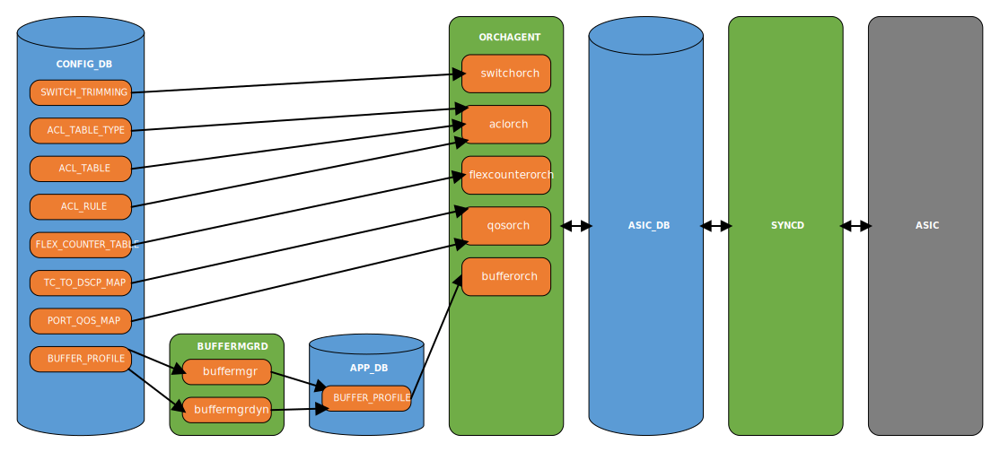
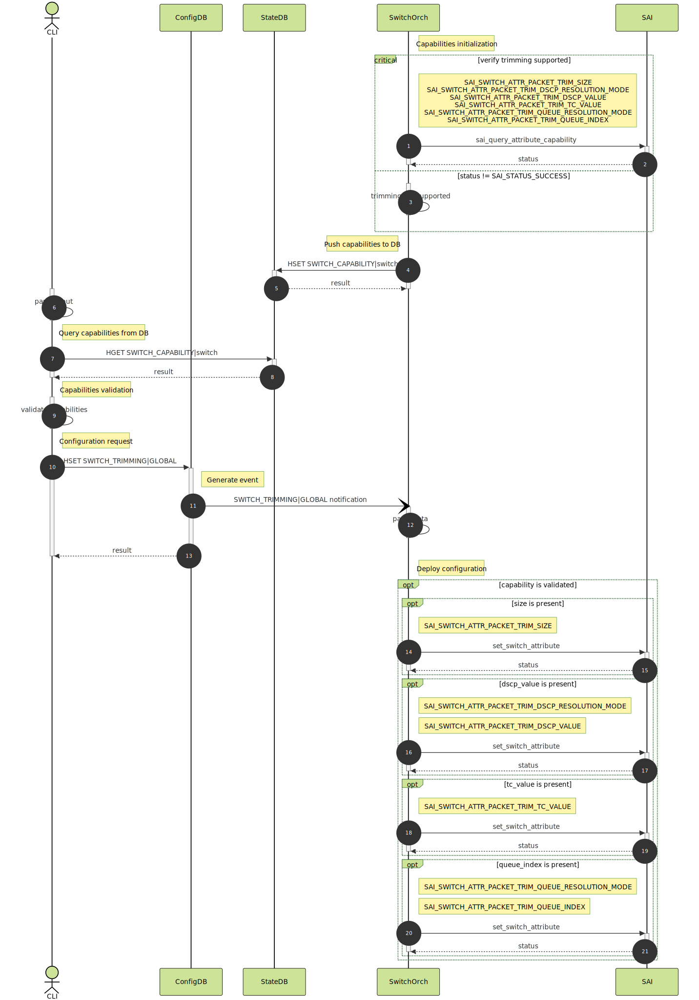
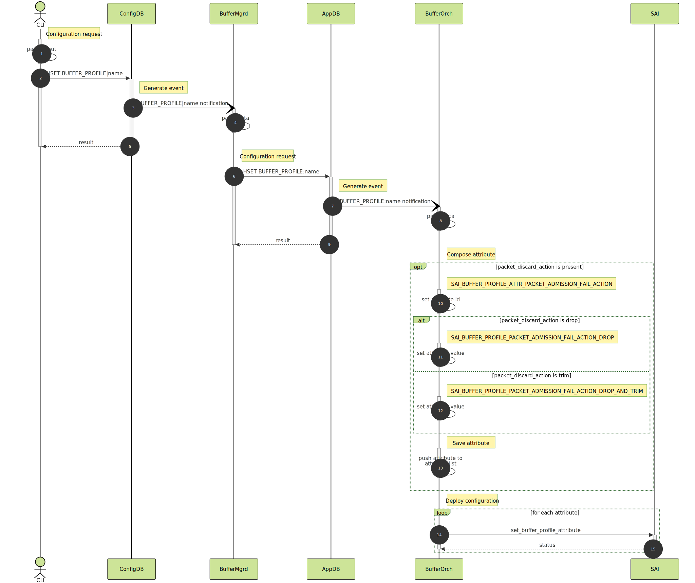

# SONiC Packet Trimming

## High Level Design document

## Table of contents

- [Revision](#revision)
- [About this manual](#about-this-manual)
- [Scope](#scope)
- [Abbreviations](#abbreviations)
- [1 Introduction](#1-introduction)
    - [1.1 Feature overview](#11-feature-overview)
    - [1.2 Requirements](#12-requirements)
        - [1.2.1 Functionality](#121-functionality)
        - [1.2.2 Command interface](#122-command-interface)
        - [1.2.3 Error handling](#123-error-handling)
        - [1.2.4 Event logging](#124-event-logging)
- [2 Design](#2-design)
    - [2.1 Overview](#21-overview)
    - [2.2 Symmetric DSCP](#22-symmetric-dscp)
    - [2.3 Asymmetric DSCP](#23-asymmetric-dscp)
    - [2.4 SAI API](#24-sai-api)
    - [2.5 Orchestration agent](#25-orchestration-agent)
        - [2.5.1 Overview](#251-overview)
        - [2.5.2 Switch orch](#252-switch-orch)
        - [2.5.3 Buffer orch](#253-buffer-orch)
        - [2.5.4 QoS orch](#254-qos-orch)
        - [2.5.5 ACL orch](#255-acl-orch)
        - [2.5.6 Flexcounter orch](#256-flexcounter-orch)
    - [2.6 DB schema](#26-db-schema)
        - [2.6.1 Config DB](#261-config-db)
            - [2.6.1.1 Switch OA](#2611-switch-oa)
            - [2.6.1.2 Buffer OA](#2612-buffer-oa)
            - [2.6.1.3 ACL OA](#2613-acl-oa)
        - [2.6.2 State DB](#262-state-db)
            - [2.6.2.1 Switch trimming capabilities](#2621-switch-trimming-capabilities)
        - [2.6.3 Data sample](#263-data-sample)
        - [2.6.4 Configuration sample](#264-configuration-sample)
        - [2.6.5 Initial configuration](#265-initial-configuration)
        - [2.6.6 Configuration migration](#266-configuration-migration)
    - [2.7 Flows](#27-flows)
        - [2.7.1 Config section](#271-config-section)
            - [2.7.1.1 Switch trimming update](#2711-switch-trimming-update)
            - [2.7.1.2 Buffer profile update](#2712-buffer-profile-update)
        - [2.7.2 Show section](#272-show-section)
            - [2.7.2.1 Switch trimming show](#2721-switch-trimming-show)
    - [2.8 CLI](#28-cli)
        - [2.8.1 Command structure](#281-command-structure)
        - [2.8.2 Usage examples](#282-usage-examples)
            - [2.8.2.1 Config command group](#2821-config-command-group)
            - [2.8.2.2 Show command group](#2822-show-command-group)
    - [2.9 YANG model](#29-yang-model)
    - [2.10 Warm/Fast boot](#210-warmfast-boot)
- [3 Test plan](#3-test-plan)
    - [3.1 Unit tests via VS](#31-unit-tests-via-vs)
    - [3.2 Data plane tests via PTF](#32-data-plane-tests-via-ptf)

## Revision

| Rev | Date       | Author         | Description     |
|:---:|:----------:|:--------------:|:----------------|
| 0.1 | 11/01/2024 | Nazarii Hnydyn | Initial version |
| 0.2 | 04/07/2025 | Nazarii Hnydyn | Asymmetric DSCP |
| 0.3 | 06/23/2025 | Nazarii Hnydyn | Drop counters   |

## About this manual

This document provides general information about PT implementation in SONiC

## Scope

This document describes the high level design of PT feature in SONiC

**In scope:**  
1. Global PT configuration with per buffer profile control
2. Fine-grained PT control via ACL disable trimming action

## Abbreviations

| Term  | Meaning                                   |
|:------|:------------------------------------------|
| SONiC | Software for Open Networking in the Cloud |
| PT    | Packet trimming                           |
| ACL   | Access Control List                       |
| OA    | Orchestration agent                       |
| DSCP  | Differentiated Services Code Point        |
| NIC   | Network Interface Card                    |
| TC    | Traffic Class                             |
| QoS   | Quality of Service                        |
| API   | Application Programming Interface         |
| ASIC  | Application-Specific Integrated Circuit   |
| SAI   | Switch Abstraction Interface              |
| DB    | Database                                  |
| MMU   | Memory Management Unit                    |
| CLI   | Сommand-line Interface                    |
| JSON  | JavaScript Object Notation   |            |
| YANG  | Yet Another Next Generation               |
| VS    | Virtual Switch                            |
| PTF   | Packet Test Framework                     |

## List of figures

[Figure 1: PT symmetric DSCP design](#figure-1-pt-symmetric-dscp-design)  
[Figure 2: PT asymmetric DSCP design](#figure-2-pt-asymmetric-dscp-design)  
[Figure 3: PT OA design](#figure-3-pt-oa-design)  
[Figure 4: PT switch update flow](#figure-4-switch-trimming-update-flow)  
[Figure 5: PT buffer update flow](#figure-5-buffer-profile-update-flow)  
[Figure 6: PT switch show flow](#figure-6-switch-trimming-show-flow)  

## List of tables

[Table 1: Frontend event logging](#table-1-frontend-event-logging)  
[Table 2: Backend event logging](#table-2-backend-event-logging)

# 1 Introduction

## 1.1 Feature overview

When the lossy queue exceeds a buffer threshold, it drops packets without any notification to the destination host.

When a packet is lost, it can be recovered through fast retransmission or by using timeouts.  
Retransmission triggered by timeouts typically incurs significant latency.

To help the host recover data more quickly and accurately, packet trimming is introduced.  
This feature upon a failed packet admission to a shared buffer, will trim a packet to a configured size,  
and try sending it on a different queue to deliver a packet drop notification to an end host.

## 1.2 Requirements

### 1.2.1 Functionality

**This feature will support the following functionality:**
1. Global switch trimming configuration with per buffer profile control
2. Trimming size management
3. Symmetric/Asymmetric DSCP remapping
4. Static/Dynamic queue resolution
5. ACL disable trimming control policy
6. Switch/Port/Queue trimming statistics

### 1.2.2 Command interface

**This feature will support the following commands:**
1. config section
    * set switch trimming global configuration
    * set buffer profile packet trimming eligibility configuration
2. show section
    * display switch trimming global configuration
    * display buffer profile packet trimming eligibility configuration

### 1.2.3 Error handling

#### 1.2.3.1 Frontend

**This feature will provide error handling for the next situations:**
1. Missing parameters
2. Invalid parameter value

#### 1.2.3.2 Backend

**This feature will provide error handling for the next situations:**
1. Missing parameters
2. Invalid parameter value
3. Parameter removal
4. Configuration removal

### 1.2.4 Event logging

#### 1.2.4.1 Frontend

**This feature will provide event logging for the next situations:**
1. Switch trimming update

###### Table 1: Frontend event logging

| Event                           | Severity |
|:--------------------------------|:---------|
| Switch trimming update: success | NOTICE   |
| Switch trimming update: error   | ERROR    |

#### 1.2.4.2 Backend

**This feature will provide event logging for the next situations:**
1. Missing parameters
2. Invalid parameter value
3. Parameter removal
4. Configuration removal
5. Switch trimming update
6. Buffer profile trimming update

###### Table 2: Backend event logging

| Event                                   | Severity |
|:----------------------------------------|:---------|
| Missing parameters                      | ERROR    |
| Invalid parameter value                 | ERROR    |
| Parameter removal                       | ERROR    |
| Configuration removal                   | ERROR    |
| Switch trimming update: success         | NOTICE   |
| Switch trimming update: error           | ERROR    |
| Buffer profile trimming update: success | NOTICE   |
| Buffer profile trimming update: error   | ERROR    |

# 2 Design

## 2.1 Overview

Eligibility for trimming will be defined in the Buffer Profile and applied to a Queue associated  
with this Buffer Profile. It means that packets sent via these Queues are eligible for trimming  
when they are dropped on admission to Shared Buffer.

The packet will be trimmed to the configured size (default is 128 bytes). After trimming the packet will be set  
with the configured DSCP and sent via the configured Queue (usually high-priority queue to ensure it's delivery  
to the receiver for fast response to the originator's NIC). If the Queue index to send a trimmed packet out  
is not configured, the expectation is that new DSCP value will be mapped to TC and then to Queue  
according to the configured QoS mapping.

The feature will use SAI Switch/Buffer/ACL API to configure desired behavior to ASIC.  
Fine-grained PT control can be achieved using ACL rules with disable trimming action.  
Trimmed packets statistics will be displayed at Switch/Port/Queue levels.

## 2.2 Symmetric DSCP


###### Figure 1: PT symmetric DSCP design

Symmetric DSCP allows having a single DSCP value for a trimmed packets sent out via different ports.  
This mode stands for basic trimming configuration. In this case receiver cannot identify the source  
of congestion due to lack of information.

## 2.3 Asymmetric DSCP


###### Figure 2: PT asymmetric DSCP design

Asymmetric DSCP allows having a different DSCP value for a trimmed packets sent out via different ports.  
This mode stands for advanced trimming configuration. Such a mechanism allows receiver to to distinguish  
where the congestion happened - on downlinks to servers or in the fabric.

## 2.4 SAI API

**SAI port/queue statistics which shall be used for PT:**

| Group  | Counter                              | Comment               |
|:-------|:-------------------------------------|:----------------------|
| SWITCH | SAI_SWITCH_STAT_DROPPED_TRIM_PACKETS | FlexCounter/CLI infra |
|        | SAI_SWITCH_STAT_TX_TRIM_PACKETS      |                       |
| QUEUE  | SAI_QUEUE_STAT_TRIM_PACKETS          |                       |
|        | SAI_QUEUE_STAT_DROPPED_TRIM_PACKETS  |                       |
|        | SAI_QUEUE_STAT_TX_TRIM_PACKETS       |                       |
| PORT   | SAI_PORT_STAT_TRIM_PACKETS           |                       |
|        | SAI_PORT_STAT_DROPPED_TRIM_PACKETS   |                       |
|        | SAI_PORT_STAT_TX_TRIM_PACKETS        |                       |

**SAI packet actions which shall be used for PT:**

| Action                                                        | Comment                               |
|:--------------------------------------------------------------|:--------------------------------------|
| SAI_BUFFER_PROFILE_PACKET_ADMISSION_FAIL_ACTION_DROP          | BUFFER_PROFILE\|packet_discard_action |
| SAI_BUFFER_PROFILE_PACKET_ADMISSION_FAIL_ACTION_DROP_AND_TRIM |                                       |

**SAI attributes which shall be used for PT:**

| API    | Function                       | Attribute                                            |
|:-------|:-------------------------------|:-----------------------------------------------------|
| OBJECT | sai_query_attribute_capability | SAI_SWITCH_ATTR_PACKET_TRIM_SIZE                     |
|        |                                | SAI_SWITCH_ATTR_PACKET_TRIM_DSCP_RESOLUTION_MODE     |
|        |                                | SAI_SWITCH_ATTR_PACKET_TRIM_DSCP_VALUE               |
|        |                                | SAI_SWITCH_ATTR_PACKET_TRIM_TC_VALUE                 |
|        |                                | SAI_SWITCH_ATTR_PACKET_TRIM_QUEUE_RESOLUTION_MODE    |
|        |                                | SAI_SWITCH_ATTR_PACKET_TRIM_QUEUE_INDEX              |
|        |                                | SAI_BUFFER_PROFILE_ATTR_PACKET_ADMISSION_FAIL_ACTION |
| QOSMAP | create_qos_map                 | SAI_QOS_MAP_ATTR_TYPE                                |
|        | set_qos_map_attribute          | SAI_QOS_MAP_TYPE_TC_AND_COLOR_TO_DSCP                |
|        |                                | SAI_QOS_MAP_ATTR_MAP_TO_VALUE_LIST                   |
| BUFFER | set_buffer_profile_attribute   | SAI_BUFFER_PROFILE_ATTR_PACKET_ADMISSION_FAIL_ACTION |
| SWITCH | set_switch_attribute           | SAI_SWITCH_ATTR_PACKET_TRIM_SIZE                     |
|        |                                | SAI_SWITCH_ATTR_PACKET_TRIM_DSCP_RESOLUTION_MODE     |
|        |                                | SAI_SWITCH_ATTR_PACKET_TRIM_DSCP_VALUE               |
|        |                                | SAI_SWITCH_ATTR_PACKET_TRIM_TC_VALUE                 |
|        |                                | SAI_SWITCH_ATTR_PACKET_TRIM_QUEUE_RESOLUTION_MODE    |
|        |                                | SAI_SWITCH_ATTR_PACKET_TRIM_QUEUE_INDEX              |

## 2.5 Orchestration agent

### 2.5.1 Overview



###### Figure 3: PT OA design

OA will be extended with a new PT Config DB schema and SAI Switch/Buffer/ACL API support.  
Switch trimming updates will be processed by OA based on Config DB changes.  
Some updates will be handled and some will be considered as invalid.

### 2.5.2 Switch orch

Class `SwitchOrch` holds a set of methods matching generic `Orch` class pattern to handle Config DB updates.  
For that purpose a producer-consumer mechanism (implemented in `sonic-swss-common`) is used.  
Method `SwitchOrch::doTask()` will be called on switch trimming update. It will distribute handling  
of DB updates between other handlers based on the table key updated (Redis Keyspace Notifications).

This class is responsible for:
1. Processing updates of switch trimming
2. Partial input data validation
3. Replicating data from Config DB to SAI DB via SAI Redis
4. Caching objects in order to handle updates

Switch trimming object is stored under `SWITCH_TRIMMING|GLOBAL` key in Config DB. On `SWITCH_TRIMMING` update,  
method `SwitchOrch::doCfgSwitchTrimmingTableTask()` will be called to process the change.  
Regular switch trimming update will refresh the internal class structures and appropriate SAI objects.

Switch trimming capabilities are stored under `SWITCH_CAPABILITY|switch` key in State DB.  
The vendor specific data is being queried by switch OA on init and pushed to both internal cache and DB.  
Any further switch trimming update is being validated using vendor specific trimming capabilities.

### 2.5.3 Buffer orch

Buffer configuration infrastructure is represented with `buffermgrd` and `bufferorch`.

Config DB updates are delivered to `buffermgrd`, while Application DB updates are delivered to `bufferorch`.  
The configuration is performed using either static or dynamic buffer model. Each one assumes usage  
of a different implementation of `buffermgrd`.

Static model acts as a simple proxy and doesn't require any changes to `buffermgr`.  
Dynamic model requires some changes to `buffermgrdyn` in order to enable config forwarding.

Buffer profile trimming configuration is represented with `BUFFER_PROFILE|name|packet_discard_action` field.  
On `BUFFER_PROFILE|name` update, method `BufferOrch::processBufferProfile` will be called to process the change.  
Regular buffer profile trimming update will refresh the internal class structures and appropriate SAI objects.

### 2.5.4 QoS orch

Existing infrastructure will be reused.

QoS OA already provides support for TC to DSCP map configuration handling.  
The last one is used by PT to enable asymmetric DSCP remapping for various interfaces.

QoS TC to DSCP map trimming configuration is stored under `TC_TO_DSCP_MAP|name` key in Config DB.  
On `TC_TO_DSCP_MAP|name` update, method `QosOrch::handleTcToDscpTable` will be called to process the change.  
Regular QoS TC to DSCP map trimming update will refresh the internal class structures and appropriate SAI objects.

QoS port map trimming configuration is represented with `PORT_QOS_MAP|name|tc_to_dscp_map` field.  
On `PORT_QOS_MAP|name` update, method `QosOrch::handlePortQosMapTable` will be called to process the change.  
Regular QoS port map trimming update will refresh the internal class structures and appropriate SAI objects.

### 2.5.5 ACL orch

Existing infrastructure will be reused.

ACL OA will be extended with a new trimming action `DISABLE_TRIM`.  
The new action will be handled as part of existing `PACKET_ACTION`.

In order to use trimming configuration in ACL rule, a dedicated ACL table type must be defined.

### 2.5.6 Flexcounter orch

Existing infrastructure will be reused.

Flex counter groups `port/queue` will be extended with a new SAI attributes:
* `SAI_QUEUE_STAT_TRIM_PACKETS`
* `SAI_QUEUE_STAT_DROPPED_TRIM_PACKETS`
* `SAI_QUEUE_STAT_TX_TRIM_PACKETS`
* `SAI_PORT_STAT_TRIM_PACKETS`
* `SAI_PORT_STAT_DROPPED_TRIM_PACKETS`
* `SAI_PORT_STAT_TX_TRIM_PACKETS`

Flex counter group `switch` will be created to handle switch related statistics:
* `SAI_SWITCH_STAT_DROPPED_TRIM_PACKETS`
* `SAI_SWITCH_STAT_TX_TRIM_PACKETS`

On NVidia platform `x86_64-nvidia_sn5640-r0` calculation of `SAI_PORT_STAT_DROPPED_TRIM_PACKETS`  
will be done using a dedicated LUA plugin. A registration of a new LUA plugin will be done  
using `port` flex counter group. This technique is relevant only for NVidia platforms.

For a generic use case, the stats will be fetched by flex counter infra only  
if the relevant capabilities are supported and exposed by a vendor.

## 2.6 DB schema

### 2.6.1 Config DB

#### 2.6.1.1 Switch OA
```abnf
; defines schema for switch trimming configuration attributes
key = SWITCH_TRIMMING|GLOBAL ; switch trimming global. Must be unique

; field     = value
size        = 1*10DIGIT   ; size (in bytes) to trim eligible packet
dscp_value  = dscp-value  ; DSCP value assigned to a packet after trimming
tc_value    = 1*3DIGIT    ; TC value assigned to a packet after trimming
queue_index = queue-index ; queue index to use for transmission of a packet after trimming

; value annotations
dscp-value = 1*2DIGIT / "from-tc"
queue-index = 1*3DIGIT / "dynamic"
```

**Note:**
* when packet length is less than `size`, the original full packet will be transmitted out
* both IPv4/IPv6 packets are updated with `dscp_value` after DSCP remapping
* when `dscp_value` is set to `from-tc`, the `tc_value` is used for mapping to DSCP
* when `queue_index` is set to `dynamic`, the `dscp_value` is used for mapping to queue
* supports runtime `symmetric<->asymmetric` DSCP configuration with `TC_TO_DSCP` map attached to the egress port
* field removal is not supported
* configuration removal is not supported

#### 2.6.1.2 Buffer OA
```abnf
; defines schema for buffer profile trimming configuration attributes
key = BUFFER_PROFILE|buffer_profile_name ; buffer profile name. Must be unique

; field               = value
packet_discard_action = discard-action ; action on failure to admit a packet to Shared Buffer/MMU

; value annotations
discard-action = "drop" / "trim"
```

**Note:**
* field removal is not supported

#### 2.6.1.3 ACL OA
```abnf
; defines schema for ACL rule trimming configuration attributes
key = ACL_RULE|table_name|rule_name ; ACL rule name. Must be unique

; field       = value
PACKET_ACTION = packet-action ; disable packet trimming for a given match condition

; value annotations
packet-action = "DISABLE_TRIM"
```

**Note:**
* field removal is not supported

### 2.6.2 State DB

#### 2.6.2.1 Switch trimming capabilities
```abnf
; defines schema for switch trimming configuration capabilities
key = SWITCH_CAPABILITY|switch ; must be unique

; field                                      = value
SWITCH_TRIMMING_CAPABLE                      = capability-knob ; specifies whether switch is trimming capable
SWITCH|PACKET_TRIMMING_DSCP_RESOLUTION_MODE  = dscp-mode-list  ; DSCP mapping mode capabilities
SWITCH|PACKET_TRIMMING_QUEUE_RESOLUTION_MODE = queue-mode-list ; queue mapping mode capabilities

; value annotations
capability-knob = "true" / "false"
dscp-mode       = "DSCP_VALUE" / "FROM_TC"
dscp-mode-list  = "" / "N/A" / dscp-mode [ 1*( "," dscp-mode ) ]
queue-mode      = "STATIC" / "DYNAMIC"
queue-mode-list = "" / "N/A" / queue-mode [ 1*( "," queue-mode ) ]
```

### 2.6.3 Data sample

**Config DB:**
```bash
redis-cli -n 4 HGETALL 'SWITCH_TRIMMING|GLOBAL'
1) "size"
2) "128"
3) "dscp_value"
4) "48"
5) "queue_index"
6) "6"

redis-cli -n 4 HGETALL 'SWITCH_TRIMMING|GLOBAL'
1) "size"
2) "128"
3) "dscp_value"
4) "from-tc"
5) "tc_value"
6) "5"
7) "queue_index"
8) "6"

redis-cli -n 4 HGETALL 'BUFFER_PROFILE|q_lossy_trim_profile'
1) "packet_discard_action"
2) "trim"

redis-cli -n 4 HGETALL 'TC_TO_DSCP_MAP|host_trim_map'
1) "5"
2) "3"

redis-cli -n 4 HGETALL 'PORT_QOS_MAP|Ethernet0'
1) "tc_to_dscp_map"
2) "host_trim_map"

redis-cli -n 4 HGETALL 'ACL_RULE|TRIM_TABLE|TRIM_RULE'
1) "PACKET_ACTION"
2) "DISABLE_TRIM"

redis-cli -n 4 HGETALL 'FLEX_COUNTER_TABLE|SWITCH'
1) "FLEX_COUNTER_STATUS"
2) "enable"
3) "POLL_INTERVAL"
4) "10000"
```

**State DB:**
```bash
redis-cli -n 6 HGETALL 'SWITCH_CAPABILITY|switch'
1) "SWITCH_TRIMMING_CAPABLE"
2) "true"
3) "SWITCH|PACKET_TRIMMING_DSCP_RESOLUTION_MODE"
4) "DSCP_VALUE,FROM_TC"
5) "SWITCH|PACKET_TRIMMING_QUEUE_RESOLUTION_MODE"
6) "STATIC,DYNAMIC"
```

**Flex Counter DB:**
```bash
redis-cli -n 5 HGETALL 'FLEX_COUNTER_GROUP_TABLE:SWITCH_STAT_COUNTER'
1) "POLL_INTERVAL"
2) "10000"
3) "STATS_MODE"
4) "STATS_MODE_READ"
5) "FLEX_COUNTER_STATUS"
6) "enable"

redis-cli -n 5 HGETALL 'FLEX_COUNTER_TABLE:SWITCH_STAT_COUNTER:oid:0x21000000000000'
1) "SWITCH_COUNTER_ID_LIST"
2) "SAI_SWITCH_STAT_DROPPED_TRIM_PACKETS,SAI_SWITCH_STAT_TX_TRIM_PACKETS"
```

**Counters DB:**
```bash
redis-cli -n 2 HGETALL 'COUNTERS_SWITCH_NAME_MAP'
1) "ASIC"
2) "oid:0x21000000000000"

redis-cli -n 2 HGETALL 'COUNTERS:oid:0x21000000000000'
1) "SAI_SWITCH_STAT_DROPPED_TRIM_PACKETS"
2) "100"
3) "SAI_SWITCH_STAT_TX_TRIM_PACKETS"
4) "100"
```

### 2.6.4 Configuration sample

**ACL packet trimming disable policy:**
```json
{
    "PORT": {
        "Ethernet0": {
            "admin_status": "up",
            "alias": "etp1",
            "index": "1",
            "lanes": "0,1,2,3",
            "mtu": "9100",
            "speed": "100000"
        }
    },
    "ACL_TABLE_TYPE": {
        "TRIMMING_L3": {
            "MATCHES": [
                "SRC_IP"
            ],
            "ACTIONS": [
                "DISABLE_TRIM_ACTION"
            ],
            "BIND_POINTS": [
                "PORT"
            ]
        }
    },
    "ACL_TABLE": {
        "TRIM_TABLE": {
            "POLICY_DESC": "Packet trimming",
            "TYPE": "TRIMMING_L3",
            "STAGE": "INGRESS",
            "PORTS": [
                "Ethernet0"
            ]
        }
    },
    "ACL_RULE": {
        "TRIM_TABLE|TRIM_RULE": {
            "PRIORITY": "999",
            "SRC_IP": "1.1.1.1/32",
            "PACKET_ACTION": "DISABLE_TRIM"
        }
    }
}
```

**Packet trimming with symmetric DSCP:**
```json
{
    "PORT": {
        "Ethernet0": {
            "admin_status": "up",
            "alias": "etp1",
            "index": "1",
            "lanes": "0,1,2,3",
            "mtu": "9100",
            "speed": "100000"
        }
    },
    "BUFFER_POOL": {
        "egress_lossy_pool": {
            "mode": "dynamic",
            "type": "egress"
        }
    },
    "BUFFER_PROFILE": {
        "q_lossy_trim_profile": {
            "dynamic_th": "3",
            "pool": "egress_lossy_pool",
            "size": "0",
            "packet_discard_action": "trim"
        }
    },
    "BUFFER_QUEUE": {
        "Ethernet0|3": {
            "profile": "q_lossy_trim_profile"
        }
    },
    "SWITCH_TRIMMING": {
        "GLOBAL": {
            "size": "128",
            "dscp_value": "48",
            "queue_index": "6"
        }
    }
}
```

**Packet trimming with asymmetric DSCP:**
```json
{
    "PORT": {
        "Ethernet0": {
            "admin_status": "up",
            "alias": "etp1",
            "index": "1",
            "lanes": "0,1,2,3",
            "mtu": "9100",
            "speed": "100000"
        },
        "Ethernet4": {
            "admin_status": "up",
            "alias": "etp2",
            "index": "2",
            "lanes": "4,5,6,7",
            "mtu": "9100",
            "speed": "100000"
        }
    },
    "TC_TO_DSCP_MAP": {
        "host_trim_map": {
            "5": "3"
        },
        "spine_trim_map": {
            "5": "7"
        }
    },
    "PORT_QOS_MAP": {
        "Ethernet0": {
            "tc_to_dscp_map": "host_trim_map"
        },
        "Ethernet4": {
            "tc_to_dscp_map": "spine_trim_map"
        }
    },
    "BUFFER_POOL": {
        "egress_lossy_pool": {
            "mode": "dynamic",
            "type": "egress"
        }
    },
    "BUFFER_PROFILE": {
        "q_lossy_trim_profile": {
            "dynamic_th": "3",
            "pool": "egress_lossy_pool",
            "size": "0",
            "packet_discard_action": "trim"
        }
    },
    "BUFFER_QUEUE": {
        "Ethernet0|3": {
            "profile": "q_lossy_trim_profile"
        },
        "Ethernet4|3": {
            "profile": "q_lossy_trim_profile"
        }
    },
    "SWITCH_TRIMMING": {
        "GLOBAL": {
            "size": "128",
            "dscp_value": "from-tc",
            "tc_value": "5",
            "queue_index": "6"
        }
    }
}
```

**Packet trimming statistics:**
```json
{
    "FLEX_COUNTER_TABLE": {
        "ACL": {
            "FLEX_COUNTER_STATUS": "enable",
            "POLL_INTERVAL": "10000"
        },
        "SWITCH": {
            "FLEX_COUNTER_STATUS": "enable",
            "POLL_INTERVAL": "10000"
        },
        "PORT": {
            "FLEX_COUNTER_STATUS": "enable",
            "POLL_INTERVAL": "10000"
        },
        "QUEUE": {
            "FLEX_COUNTER_STATUS": "enable",
            "POLL_INTERVAL": "10000"
        }
    }
}
```

### 2.6.5 Initial configuration

No special handling is required: disabled by default

### 2.6.6 Configuration migration

No special handling is required: adding new and extending the existing schema

## 2.7 Flows

### 2.7.1 Config section

### 2.7.1.1 Switch trimming update



###### Figure 4: Switch trimming update flow

### 2.7.1.2 Buffer profile update



###### Figure 5: Buffer profile update flow

### 2.7.2 Show section

#### 2.7.2.1 Switch trimming show


###### Figure 6: Switch trimming show flow

## 2.8 CLI

### 2.8.1 Command structure

**User interface**:
```
config
|--- switch-trimming
|    |--- global [OPTIONS]
|
|--- mmu [OPTIONS]

show
|--- switch-trimming
|    |--- global [OPTIONS]
|
|--- mmu
|
|--- switch
     |--- counters [OPTIONS]
          |--- all [OPTIONS]
          |--- trim [OPTIONS]
          |--- detailed [OPTIONS]

sonic-clear
|--- switchcounters
```

**Options:**

_config switch-trimming global_
1. `-s|--size` - size (in bytes) to trim eligible packet
2. `-d|--dscp` - DSCP value assigned to a packet after trimming
3. `-t|--tc` - TC value assigned to a packet after trimming
4. `-q|--queue` - queue index to use for transmission of a packet after trimming

_config mmu_
1. `-t` - set packet trimming eligibility

_show switch-trimming global_
1. `-j|--json` - display in JSON format

_show switch counters_
1. `-p|--period` - display stats over a specified period (in seconds)
2. `-j|--json` - display in JSON format

_show switch counters all_
1. `-p|--period` - display stats over a specified period (in seconds)
2. `-j|--json` - display in JSON format

_show switch counters trim_
1. `-p|--period` - display stats over a specified period (in seconds)
2. `-j|--json` - display in JSON format

_show switch counters detailed_
1. `-p|--period` - display stats over a specified period (in seconds)
2. `-j|--json` - display in JSON format

### 2.8.2 Usage examples

#### 2.8.2.1 Config command group

**The following command updates switch trimming global configuration:**
```bash
config switch-trimming global --size 128 --dscp 48 --queue 6
config switch-trimming global --size 128 --dscp 48 --queue dynamic
config switch-trimming global --size 128 --dscp from-tc --tc 5 --queue 6
config switch-trimming global --size 128 --dscp from-tc --tc 5 --queue dynamic
```

**The following command updates switch trimming buffer eligibility configuration:**
```bash
config mmu -p q_lossy_trim_profile -t on
config mmu -p q_lossy_trim_profile -t off
```

**The following command updates switch trimming counter configuration:**
```bash
counterpoll switch enable
counterpoll port enable
counterpoll queue enable
counterpoll acl enable

counterpoll switch interval 1000
counterpoll port interval 1000
counterpoll queue interval 1000
counterpoll acl interval 1000
```

#### 2.8.2.2 Show command group

**The following command shows switch trimming global configuration:**
```bash
root@sonic:/home/admin# show switch-trimming global
+---------------------------------------+---------+
| Configuration                         | Value   |
+=======================================+=========+
| Packet trimming size                  | 128     |
+---------------------------------------+---------+
| Packet trimming DSCP value            | 48      |
+---------------------------------------+---------+
| Packet trimming TC value              | N/A     |
+---------------------------------------+---------+
| Packet trimming queue index           | 6       |
+---------------------------------------+---------+
root@sonic:/home/admin# show switch-trimming global --json
{
    "size": "128",
    "dscp_value": "48",
    "tc_value": "N/A",
    "queue_index": "6"
}

root@sonic:/home/admin# show switch-trimming global
+---------------------------------------+---------+
| Configuration                         | Value   |
+=======================================+=========+
| Packet trimming size                  | 128     |
+---------------------------------------+---------+
| Packet trimming DSCP value            | from-tc |
+---------------------------------------+---------+
| Packet trimming TC value              | 5       |
+---------------------------------------+---------+
| Packet trimming queue index           | 6       |
+---------------------------------------+---------+
root@sonic:/home/admin# show switch-trimming global --json
{
    "size": "128",
    "dscp_value": "from-tc",
    "tc_value": "5",
    "queue_index": "6"
}
```

**The following command shows switch trimming buffer configuration:**
```bash
root@sonic:/home/admin# show mmu
Lossless traffic pattern:
------------------  -
default_dynamic_th  0
------------------  -

Pool: egress_lossy_pool
----  -------
mode  dynamic
type  egress
----  -------

Profile: q_lossy_trim_profile
---------------------  -----------------
dynamic_th             3
packet_discard_action  trim
pool                   egress_lossy_pool
size                   0
---------------------  -----------------
```

**The following command shows switch trimming ACL policy configuration:**
```bash
root@sonic:/home/admin# show acl table
Name        Type         Binding    Description      Stage    Status
----------  -----------  ---------  ---------------  -------  --------
TRIM_TABLE  TRIMMING_L3  Ethernet0  Packet trimming  ingress  Active

root@sonic:/home/admin# show acl rule
Table       Rule         Priority  Action        Match               Status
----------  ---------  ----------  ------------  ------------------  --------
TRIM_TABLE  TRIM_RULE         999  DISABLE_TRIM  SRC_IP: 1.1.1.1/32  Active
```

**The following command shows switch trimming counter configuration:**
```bash
root@sonic:/home/admin# counterpoll show
Type          Interval (in ms)    Status
------------  ------------------  --------
SWITCH_STAT   1000                enable
PORT_STAT     1000                enable
QUEUE_STAT    1000                enable
ACL           1000                enable
```

**The following command shows switch trimming statistics:**
```bash
root@sonic:/home/admin# show switch counters all
  TrimSent/pkts    TrimDrop/pkts
---------------  ---------------
         20,000           10,000

root@sonic:/home/admin# switchstat --all
  TrimSent/pkts    TrimDrop/pkts
---------------  ---------------
         20,000           10,000

root@sonic:/home/admin# show switch counters trim
  TrimSent/pkts    TrimDrop/pkts
---------------  ---------------
         20,000           10,000

root@sonic:/home/admin# switchstat --trim
  TrimSent/pkts    TrimDrop/pkts
---------------  ---------------
         20,000           10,000

root@sonic:/home/admin# show switch counters detailed
Trimmed Sent Packets........................... 10,000
Trimmed Dropped Packets........................ 10,000

root@sonic:/home/admin# switchstat --detail
Trimmed Sent Packets........................... 10,000
Trimmed Dropped Packets........................ 10,000

root@sonic:/home/admin# show interfaces counters -i Ethernet0 -a
    IFACE    STATE    RX_OK    RX_BPS    RX_PPS    RX_UTIL    RX_ERR    RX_DRP    RX_OVR    TX_OK    TX_BPS    TX_PPS    TX_UTIL    TX_ERR    TX_DRP    TX_OVR    TRIM    TRIM_TX    TRIM_DRP
---------  -------  -------  --------  --------  ---------  --------  --------  --------  -------  --------  --------  ---------  --------  --------  --------  ------  ---------  ----------
Ethernet0        U      100  0.00 B/s    0.00/s      0.00%         0         0         0        0  0.00 B/s  0.00 B/s      0.00%         0       100         0     100         50          50

root@sonic:/home/admin# portstat -i Ethernet0 -a
    IFACE    STATE    RX_OK    RX_BPS    RX_PPS    RX_UTIL    RX_ERR    RX_DRP    RX_OVR    TX_OK    TX_BPS    TX_PPS    TX_UTIL    TX_ERR    TX_DRP    TX_OVR    TRIM    TRIM_TX    TRIM_DRP
---------  -------  -------  --------  --------  ---------  --------  --------  --------  -------  --------  --------  ---------  --------  --------  --------  ------  ---------  ----------
Ethernet0        U      100  0.00 B/s    0.00/s      0.00%         0         0         0        0  0.00 B/s  0.00 B/s      0.00%         0       100         0     100         50          50

root@sonic:/home/admin# show interfaces counters trim Ethernet0
    IFACE    STATE    TRIM_PKTS    TRIM_TX_PKTS    TRIM_DRP_PKTS
---------  -------  -----------  --------------  ---------------
Ethernet0        U          100              50               50

root@sonic:/home/admin# portstat -i Ethernet0 --trim
    IFACE    STATE    TRIM_PKTS    TRIM_TX_PKTS    TRIM_DRP_PKTS
---------  -------  -----------  --------------  ---------------
Ethernet0        U          100              50               50

root@sonic:/home/admin# show queue counters Ethernet0 --all
     Port    TxQ    Counter/pkts    Counter/bytes    Drop/pkts    Drop/bytes    Trim/pkts    TrimSent/pkts    TrimDrop/pkts
---------  -----  --------------  ---------------  -----------  ------------  -----------  ---------------  ---------------
Ethernet0    UC0             N/A              N/A          N/A           N/A          N/A              N/A              N/A
Ethernet0    UC1             N/A              N/A          100          6400          100               50               50
Ethernet0    UC2             N/A              N/A          N/A           N/A          N/A              N/A              N/A
Ethernet0    UC3              50             3200          N/A           N/A          N/A              N/A              N/A
Ethernet0    UC4             N/A              N/A          N/A           N/A          N/A              N/A              N/A
Ethernet0    UC5             N/A              N/A          N/A           N/A          N/A              N/A              N/A
Ethernet0    UC6             N/A              N/A          N/A           N/A          N/A              N/A              N/A
Ethernet0    UC7             N/A              N/A          N/A           N/A          N/A              N/A              N/A

root@sonic:/home/admin# queuestat -p Ethernet0 --all
     Port    TxQ    Counter/pkts    Counter/bytes    Drop/pkts    Drop/bytes    Trim/pkts    TrimSent/pkts    TrimDrop/pkts
---------  -----  --------------  ---------------  -----------  ------------  -----------  ---------------  ---------------
Ethernet0    UC0             N/A              N/A          N/A           N/A          N/A              N/A              N/A
Ethernet0    UC1             N/A              N/A          100          6400          100               50               50
Ethernet0    UC2             N/A              N/A          N/A           N/A          N/A              N/A              N/A
Ethernet0    UC3              50             3200          N/A           N/A          N/A              N/A              N/A
Ethernet0    UC4             N/A              N/A          N/A           N/A          N/A              N/A              N/A
Ethernet0    UC5             N/A              N/A          N/A           N/A          N/A              N/A              N/A
Ethernet0    UC6             N/A              N/A          N/A           N/A          N/A              N/A              N/A
Ethernet0    UC7             N/A              N/A          N/A           N/A          N/A              N/A              N/A

root@sonic:/home/admin# show queue counters Ethernet0 --trim
     Port    TxQ    Trim/pkts    TrimSent/pkts    TrimDrop/pkts
---------  -----  -----------  ---------------  ---------------
Ethernet0    UC0          N/A              N/A              N/A
Ethernet0    UC1          100               50               50
Ethernet0    UC2          N/A              N/A              N/A
Ethernet0    UC3          N/A              N/A              N/A
Ethernet0    UC4          N/A              N/A              N/A
Ethernet0    UC5          N/A              N/A              N/A
Ethernet0    UC6          N/A              N/A              N/A
Ethernet0    UC7          N/A              N/A              N/A

root@sonic:/home/admin# queuestat -p Ethernet0 --trim
     Port    TxQ    Trim/pkts    TrimSent/pkts    TrimDrop/pkts
---------  -----  -----------  ---------------  ---------------
Ethernet0    UC0          N/A              N/A              N/A
Ethernet0    UC1          100               50               50
Ethernet0    UC2          N/A              N/A              N/A
Ethernet0    UC3          N/A              N/A              N/A
Ethernet0    UC4          N/A              N/A              N/A
Ethernet0    UC5          N/A              N/A              N/A
Ethernet0    UC6          N/A              N/A              N/A
Ethernet0    UC7          N/A              N/A              N/A

root@sonic:/home/admin# aclshow --all
RULE NAME    TABLE NAME      PRIO  PACKETS COUNT    BYTES COUNT
-----------  ------------  ------  ---------------  -------------
TRIM_RULE    TRIM_TABLE       999  100              6400
```

## 2.9 YANG model

Existing YANG model `sonic-flex_counter.yang` at `sonic-buildimage/src/sonic-yang-models/yang-models`  
will be extended with a new schema in order to provide support for PT.

**Skeleton code:**
```yang
module sonic-flex_counter {

    ...

    container sonic-flex_counter {

        container FLEX_COUNTER_TABLE {

            ...

            container SWITCH {
                /* SWITCH_STAT_COUNTER_FLEX_COUNTER_GROUP */
                leaf FLEX_COUNTER_STATUS {
                    type flex_status;
                }
                leaf FLEX_COUNTER_DELAY_STATUS {
                    type flex_delay_status;
                }
                leaf POLL_INTERVAL {
                    type poll_interval;
                }
            }

        }
        /* end of container FLEX_COUNTER_TABLE */

        ...

    }
    /* end of top level container */
}
/* end of module sonic-flex_counter */
```

Existing YANG model `sonic-buffer-profile.yang` at `sonic-buildimage/src/sonic-yang-models/yang-models`  
will be extended with a new schema in order to provide support for PT.

**Skeleton code:**
```yang
module sonic-buffer-profile {

    ...

    container sonic-buffer-profile {

        container BUFFER_PROFILE {

            list BUFFER_PROFILE_LIST {

                key "name";

                leaf name {
                    type string;
                    description "Buffer Profile name";
                }

                ...

                leaf packet_discard_action {
                    type enumeration {
                        enum drop;
                        enum trim;
                    }
                    description "Action on failure to admit a packet to Shared Buffer/MMU";
                }

            }
            /* end of BUFFER_PROFILE_LIST */
        }
        /* end of container BUFFER_PROFILE */
    }
    /* end of container sonic-trimming */
}
/* end of module sonic-buffer-profile */
```

New YANG model `sonic-trimming.yang` will be added to `sonic-buildimage/src/sonic-yang-models/yang-models`  
in order to provide support for PT.

**Skeleton code:**
```yang
module sonic-trimming {

    yang-version 1.1;

    namespace "http://github.com/sonic-net/sonic-trimming";
    prefix trim;

    description "TRIMMING YANG Module for SONiC OS";

    revision 2025-04-07 {
        description "Asymmetric DSCP";
    }

    revision 2024-11-01 {
        description "First Revision";
    }

    container sonic-trimming {

        container SWITCH_TRIMMING {

            description "SWITCH_TRIMMING part of config_db.json";

            container GLOBAL {

                leaf size {
                    description "Size (in bytes) to trim eligible packet";
                    type uint32;
                }

                leaf dscp_value {
                    description "DSCP value assigned to a packet after trimming";
                    type union {
                        type uint8 {
                            range "0..63" {
                                error-message "Invalid DSCP value";
                                error-app-tag dscp-invalid;
                            }
                        }
                        type string {
                            pattern "from-tc";
                        }
                    }
                }

                leaf tc_value {
                    description "TC value assigned to a packet after trimming";
                    type uint8;
                }

                leaf queue_index {
                    description "Queue index to use for transmission of a packet after trimming";
                    type union {
                        type uint8;
                        type string {
                            pattern "dynamic";
                        }
                    }
                }

            }
            /* end of container GLOBAL */
        }
        /* end of container SWITCH_TRIMMING */
    }
    /* end of container sonic-trimming */
}
/* end of module sonic-trimming */
```

## 2.10 Warm/Fast boot

No special handling is required

# 3 Test plan

## 3.1 Unit tests via VS

PT basic configuration test:
1. Verify ASIC DB object state after switch trimming size update
2. Verify ASIC DB object state after switch trimming DSCP value update
3. Verify ASIC DB object state after switch trimming TC value update
4. Verify ASIC DB object state after switch trimming queue index update
5. Verify ASIC DB object state after buffer profile discard packet action update
6. Verify ASIC DB object state after switching `symmetric<->asymmetric` DSCP mode
7. Verify error handling with negative test cases
8. Verify `switch/port/queue` counter statistics

## 3.2 Data plane tests via PTF

1. [Packet Trimming Test Plan](https://github.com/sonic-net/sonic-mgmt/pull/17850 "Test Plan")
2. [Packet Trimming Test Case](https://github.com/sonic-net/sonic-mgmt/pull/18051 "Test Case")
