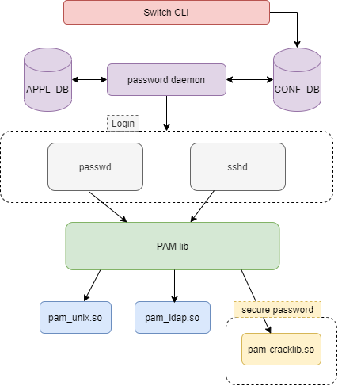

# PW Hardening Design #

##  1. <a name='TableofContent'></a>Table of Content 
* 1. [Table of Content](#TableofContent)
	* 1.1. [Revision](#Revision)
	* 1.2. [Scope](#Scope)
	* 1.3. [Definitions/Abbreviations](#DefinitionsAbbreviations)
	* 1.4. [Overview](#Overview)
	* 1.5. [Requirements](#Requirements)
	* 1.6. [Architecture Design](#ArchitectureDesign)
	* 1.7. [High-Level Design](#High-LevelDesign)
		* 1.7.1. [Flow description:](#Flowdescription:)
		* 1.7.2. [Password Hardening Constrains](#PasswordHardeningConstrains)
	* 1.8. [SAI API](#SAIAPI)
	* 1.9. [Configuration and management](#Configurationandmanagement)
		* 1.9.1. [CLI/YANG model Enhancements](#CLIYANGmodelEnhancements)
		* 1.9.2. [Config DB Enhancements](#ConfigDBEnhancements)
		* 1.9.3. [Secure Password Table Schema](#SecurePasswordTableSchema)
	* 1.10. [3rd Party Components](#rdPartyComponents)
		* 1.10.1. [pam-cracklib](#pam-cracklib)
		* 1.10.2. [PW Age](#PWAge)
		* 1.10.3. [PW History](#PWHistory)
	* 1.11. [Warmboot and Fastboot Design Impact](#WarmbootandFastbootDesignImpact)
	* 1.12. [Restrictions/Limitations](#RestrictionsLimitations)
	* 1.13. [Test Plan](#TestPlan)
		* 1.13.1. [Setups](#Setups)
		* 1.13.2. [CLI configurational tests](#CLIconfigurationaltests)
		* 1.13.3. [Precondition:](#Precondition:)
		* 1.13.4. [Case 3: check secure password age (expiration) and warning configuration](#Case3:checksecurepasswordageexpirationandwarningconfiguration)
		* 1.13.5. [Case 4 – sanity test](#Case4sanitytest)
		* 1.13.6. [Negative cases](#Negativecases)
		* 1.13.7. [Case 1: check basic configuration – bad flow with invalid input](#Case1:checkbasicconfigurationbadflowwithinvalidinput)
		* 1.13.8. [Test Open Issues](#TestOpenIssues)


###  1.1. <a name='Revision'></a>Revision  
Rev 0.1
###  1.2. <a name='Scope'></a>Scope  

	This password hardening hld doc described the requirements, arcquitecture and configuration details of password hardening feature in switches Sonic OS based.

###  1.3. <a name='DefinitionsAbbreviations'></a>Definitions/Abbreviations 
	PW - password
	SPASSWD - secure password daemon

###  1.4. <a name='Overview'></a>Overview 

	Password Hardening, a user password is the key credential used in order to verify the user accessing the switch and acts as the first line of defense in regards of securing the switch.
	The complexity of the password, it's replacement capabilities and change frequency define the security level of the first perimeter of the switch.
	Therefore - in order to further improve and harden the switch - a secure mechanism is required to enforce PW policies.

###  1.5. <a name='Requirements'></a>Requirements
| Requirement | Capabilities | Config Parameters | Notes
| ------ | ------| ------ | ------ |
| PW Length	 | The PW length should have a minimum length requirement <br /><br />The PW length should have a maximum length requirement| The user should be able to configure the minimum PW length <br /><br />The user should be able to configure the maximum PW length | Min PW length is between 0 to 32 chars (default 8)<br /><br />Max PW length is between 64 to 80 chars (default 64)
| PW Aging | The PW should have an expiration date, after which the user is required to change the PW <br /><br />A warning to change the PW should be presented to the user a fixed time before the expiration date arrives. This warning should appear in every login so long as the PW expiration time <= warning time. |The user should be able to configure the expiration time of the PW.  The user will be able to configure "no aging" for the PW<br /><br />The user should be able to configure the amount of days to present the warning before the PW expires | PW age time is to be between 1 to 365 days (default 180)<br /><br />PW warning show is to be between 1 to 30 days (default 15)
| PW constraints | The PW class represents the possible characters comprising the PW. There are 4 character classes that can make up the PW:small characters, big characters, numbers and special chars presented on a standard keyboard <br /><br />The account name and PW need to be different <br /><br />The new PW is to be different from current PW|The user should be able to define which characters classes are required for the PW out of the 4 provided<br /><br /><br /><br />The user will be able to enable or disable this feature|Legal special characters `~!@#$%^&*()-_=+\|[{}];:',<.>/? and white space<br /><br /><br /><br />An error will be shown to the user if it tries to set the same PW as the username<br /><br /><br /><br />default - enable

###  1.6. <a name='ArchitectureDesign'></a>Architecture Design 
Arc design diagram\


(flow description in the chapter below)

###  1.7. <a name='High-LevelDesign'></a>High-Level Design 

	In this section we will present the design (as thorough as possible) for the secure PW implementation.

	User password as explained before is the first line defence, in order to support it according the requirement section and user preferences, the secure password feature need a strengh-checking for password.
			
	The feature will use 3 linux libs: pam-cracklib, chage and pam_pwhistory.so

	pam-cracklib: This module can be plugged into the password stack of a given application to provide some plug-in strength-checking for passwords.

	The action of this module is to prompt the user for a password and check its strength against a system dictionary and a set of rules for identifying poor choices.
	This module support many options, including the requirements of PW Length & PW constraints. (see option strengh-checking below)

	chage: support the requirement of PW Aging, change user password expiry information

	pam_pwhistory - PAM module to remember last passwords

	Note:
	See linux 3d party component chapter for more description


##### Flow diagram:


####  1.7.1. <a name='Flowdescription:'></a>Flow description:
	Users by using Switch CLI will set new password/password configuration (see PW options below), the input will be saved in CONF_DB in PASSW_CONF_TABLE.\
	The daemon call PASSHD (password hardening daemon) listen to changes, parse the inputs and set the configuration to kernel by using pam-cracklib ,chage, pwhistory linux libs. 
	After that, it will save the configuration and results in APPL_DB in PASSW_CONF_TABLE.

	Note:
	The table PASSW_CONF_TABLE should reduce time consuming when users need to read configuration, because it will avoid to make additional calls to kernel.

####  1.7.2. <a name='PasswordHardeningConstrains'></a>Password Hardening Constrains
	The PW Hardening features will be support different options by encapsulate cracklib, chage and pwhistory options according the constrains definitions below.

##### PW enable 

	Enable/Disable password hardening feature

	Note: when this feature is disable will be just the default password validation without strength-checking for passwords.

##### PW Class
	PW class is the type of characters the user is required to enter when setting/updating a PW.

	There are 4 classes:

	Small characters - a-z

	Big characters - A-Z

	Numbers - 0-9

	Special Characters   `~!@#$%^&*()-_+=\|[{}];:',<.>/? and white space

	Each of these classes will receive a Regexp to represent the class.

	The user will be able to choose whether to enforce all PW class characters in the PW or only a subset of the characters.

	Note:
	In order to implement it, the daemon will encapsulate some pam-cracklib options.
	i.e:

	To request at least one character of every class, the PASSWD daemon will set:
	pam-cracklib options: lcredit=-1, ucredit=-1, dcredit=-1.
	(meaning that the user need at least one character of the types.)

##### PW Length
	PW length is a base requirement for the PW.

	All password length enforcements and changes will be applied the next time the user would require a PW change or would want to change his own password

* Minimum Length

	The minimum length of the PW should be subject to a user change.

	The user will be able to change the password minimum length if he has the necessary permissions to change the PW.

	Implementation:
	In order to implement it, the cracklib option minlen=N should be set.


	Note:
	Once the user changed the minimum password length - the settings will be applied to the config node and will be enforced on the next pw change

##### PW Age
	Along with every PW set to a user, attached to it is the age of the PW - the amount of time that has passed since a PW change has occurred.

	This PW change can either be from the initial config wizard or from the CLI.

* PW Age Change
	Once a PW change takes place - the DB record for said PW is updated with the new PW value and a fresh new age (=0).

	Every login (and PW entry) will check the PW age field to see if it has exceeded its maximum time alive (the amount of time before the PW needs to change).

	If so - a prompt will be shown to the user forcing it to change the PW before logging into the switch. Prompt PW change view will be explained in TBD.

	To support it, can be use chage lib option "--maxdays"

* PW Age Change Warning
	The switch will provide a warning for PW change beforehand (this is to allow a sufficient warning for upgrading the PW which might by relevant to numerous switches).

	Along with this warning - the user will also be able to control how long before the PW expiration this warning will appear.

	To support it, can be use chage option "--warndays"

Aging(expire) implementation :
	For implement the "aging" we need to change the /etc/login.def file and set max days and warning days, this changes affection globally, meaning all new users.
	For read the information per user we will use the "chage" library.
	In addition, when we change the file /etc/login.def its change globally by only new users, so basically for change existing users expired day we need to iterate every one of them using the "chage" lib.


##### PW username-match
	By enabling this feature, the user will not be permitted to set the same username & password


##### PW Saving
	Saved previous passwords in the DB,  for enable this. is necessary to set how many old password you would like to save.

	Implementation: will be support by using pam_pwhistory.so, remmember=N option.
	
	Note:
	For saving password with sha512, need to modify the /etc/pam.d/system-auth-a file to contain this line:

		password    sufficient    pam_unix.so sha512 shadow use_authtok

###  1.8. <a name='SAIAPI'></a>SAI API 
	no changed.

###  1.9. <a name='Configurationandmanagement'></a>Configuration and management

####  1.9.1. <a name='CLIYANGmodelEnhancements'></a>CLI/YANG model Enhancements

##### PW enable 

```
password hardening enable
```

##### PW Class
	PW class is the type of characters the user is required to enter when setting/updating a PW.

	There are 4 classes. (see description in arc section)

	The user will be able to choose whether to enforce all PW class characters in the PW or only a subset of the characters.

	A CLI command will be available to the user for this configuration. Once a user has selected the class types he wants to enforce (from a pre-defined options list), this will enforce the PW selected by the user to have at least 1 character from each class in the selected option.

	The CLI classes options will be as follows:

	None - Meaning no required classes.

	lower- lowerLowercase Characters

	lower-upper - Lowercase + Uppercase 

	lower-upper-digit - Lowercase + Uppercase + Numbers

	lower-upper-digit-special - Lowercase + Uppercase + Numbers + Special

	multiple char enforcement

	There will be no enforcement of multiple characters from a specific class or a specific characters (be either letter or symbol) to appear in the PW.

The CLI command to configure the PW class type will be along the following lines:

```
password complexity-class <lower/lower-upper/lower-upper-digit/lower-upper-digit-special>
```

##### PW Length

```
password length min <length>
```
Note: Where length is a number between 0 and 32.

Once the user changed the minimum password length - the settings will be applied to the config node and will be enforced on the next pw change

##### PW Age

* PW age expire


	```
	password age expiration <age>
	```
	Notes: Where age is in days and between 1 and 365 days (default 180). 


* PW Age Change Warning


	```
	password age warning <warning_days>
	```
	Notes: The warning_days can be configured between 1 and 30 days (default 15).


##### PW username-match

	password username-password-match <enable/disable>

##### PW Saving

	password history <num of old passwords to save>

##### CLI permissions
	The CLI commands should be allowed only to the admin user. Other users should be able to view the parameters but not change them.

####  1.9.2. <a name='ConfigDBEnhancements'></a>Config DB Enhancements
	This DB will include a new table "PASSW_CONF_TABLE" (Secure Password Table)
####  1.9.3. <a name='SecurePasswordTableSchema'></a>Secure Password Table Schema
The table named PASSW_CONF_TABLE in CONF_DB will hold the follow key-values:

```
secure_enable=True/False
passwd_class=lower/lower-upper/lower-upper-digit/lower-upper-digit-special
passwd_expiration=N
passwd_expiration_warining=N
passwd_history=N
len_max=N
len_min=N
debug=True/False
retry=N
difok=N
minlen=N
dcredit=N
ucredit=N
lcredit=N
ocredit=N
minclass=N
maxrepeat=N
maxsequence=N
maxclassrepeat=N
dictpath=<path to cracklib dict>
```

Notes:

	Similar option will be saved in PASSW_CONF_TABLE in APPL_CONF.\
	the main difference is that other applications read from APPL_DB, and not from CONF_DB according Sonic arq. In addition, CONF_DB contain values requested by user, when APPL_DB contain the result values, meaning that if some option fail to set in the linux module the APPL_CONF will have the founded state of the option.

###  1.10. <a name='rdPartyComponents'></a>3rd Party Components
In this section you can find most of the options of pam-cracklib, chage and pwhistory, we are going to use just the options mention in the Arc chapter, the other option maybe could be use for future features

####  1.10.1. <a name='pam-cracklib'></a>pam-cracklib

Options:

##### debug
	This option makes the module write information to syslog(3) indicating the behavior of the module (this option does not write password information to the log file).
##### authtok_type=XXX
	The default action is for the module to use the following prompts when requesting passwords: "New UNIX password: " and "Retype UNIX password: ". The example word UNIX can be replaced with this option, by default it is empty.
##### retry=N
	Prompt user at most N times before returning with error. The default is 1.
	difok=N
	This argument will change the default of 5 for the number of character changes in the new password that differentiate it from the old password.
##### minlen=N
	The minimum acceptable size for the new password (plus one if credits are not disabled which is the default). In addition to the number of characters in the new password, credit (of +1 in length) is given for each different kind of character (other, upper, lower and digit). The default for this parameter is 9 which is good for a old style UNIX password all of the same type of character but may be too low to exploit the added security of a md5 system. Note that there is a pair of length limits in Cracklib itself, a "way too short" limit of 4 which is hard coded in and a defined limit (6) that will be checked without reference to minlen. If you want to allow passwords as short as 5 characters you should not use this module.
##### dcredit=N
	(N >= 0) This is the maximum credit for having digits in the new password. If you have less than or N digits, each digit will count +1 towards meeting the current minlen value. The default for dcredit is 1 which is the recommended value for minlen less than 10.
	(N < 0) This is the minimum number of digits that must be met for a new password.

##### ucredit=N
	(N >= 0) This is the maximum credit for having upper case letters in the new password. If you have less than or N upper case letters each letter will count +1 towards meeting the current minlen value. The default for ucredit is 1 which is the recommended value for minlen less than 10.
	(N < 0) This is the minimum number of upper case letters that must be met for a new password.

##### lcredit=N
	(N >= 0) This is the maximum credit for having lower case letters in the new password. If you have less than or N lower case letters, each letter will count +1 towards meeting the current minlen value. The default for lcredit is 1 which is the recommended value for minlen less than 10.
	(N < 0) This is the minimum number of lower case letters that must be met for a new password.

##### ocredit=N
	(N >= 0) This is the maximum credit for having other characters in the new password. If you have less than or N other characters, each character will count +1 towards meeting the current minlen value. The default for ocredit is 1 which is the recommended value for minlen less than 10.
	(N < 0) This is the minimum number of other characters that must be met for a new password.

##### minclass=N
	The minimum number of required classes of characters for the new password. The default number is zero. The four classes are digits, upper and lower letters and other characters. The difference to the credit check is that a specific class if of characters is not required. Instead N out of four of the classes are required.
	maxrepeat=N
	Reject passwords which contain more than N same consecutive characters. The default is 0 which means that this check is disabled.
##### maxsequence=N
	Reject passwords which contain monotonic character sequences longer than N. The default is 0 which means that this check is disabled. Examples of such sequence are '12345' or 'fedcb'. Note that most such passwords will not pass the simplicity check unless the sequence is only a minor part of the password.
##### maxclassrepeat=N
	Reject passwords which contain more than N consecutive characters of the same class. The default is 0 which means that this check is disabled.
	reject_username
	Check whether the name of the user in straight or reversed form is contained in the new password. If it is found the new password is rejected.
##### gecoscheck
	Check whether the words from the GECOS field (usually full name of the user) longer than 3 characters in straight or reversed form are contained in the new password. If any such word is found the new password is rejected.
##### enforce_for_root
	The module will return error on failed check also if the user changing the password is root. This option is off by default which means that just the message about the failed check is printed but root can change the password anyway.
##### use_authtok
	This argument is used to force the module to not prompt the user for a new password but use the one provided by the previously stacked password module.
##### dictpath=/path/to/dict
	Path to the cracklib dictionaries.
	Module Types Provided
	Only the password module type is provided.

##### Return Values
###### PAM_SUCCESS
	The new password passes all checks.
###### PAM_AUTHTOK_ERR
	No new password was entered, the username could not be determined or the new password fails the strength checks.
###### PAM_AUTHTOK_RECOVERY_ERR
	The old password was not supplied by a previous stacked module or got not requested from the user. The first error can happen if use_authtok is specified.
###### PAM_SERVICE_ERR
	A internal error occurred.

####  1.10.2. <a name='PWAge'></a>PW Age


The options which apply to the chage command are:

	-d, --lastday LAST_DAY

	Set the number of days since January 1st, 1970 when the password was last changed. The date may also be expressed in the format YYYY-MM-DD (or the format more commonly used in your area).

	-E, --expiredate EXPIRE_DATE

	Set the date or number of days since January 1, 1970 on which the users account will no longer be accessible. The date may also be expressed in the format YYYY-MM-DD (or the format more commonly used in your area). A user whose account is locked must contact the system administrator before being able to use the system again.

	Passing the number -1 as the EXPIRE_DATE will remove an account expiration date.

	-h, --help

	Display help message and exit.

	-i, --iso8601

	When printing dates, use YYYY-MM-DD format.

	-I, --inactive INACTIVE

	Set the number of days of inactivity after a password has expired before the account is locked. The INACTIVE option is the number of days of inactivity. A user whose account is locked must contact the system administrator before being able to use the system again.

	Passing the number -1 as the INACTIVE will remove an accounts inactivity.

	-l, --list

	Show account aging information.

	-m, --mindays MIN_DAYS

	Set the minimum number of days between password changes to MIN_DAYS. A value of zero for this field indicates that the user may change their password at any time.

	-M, --maxdays MAX_DAYS

	Set the maximum number of days during which a password is valid. When MAX_DAYS plus LAST_DAY is less than the current day, the user will be required to change their password before being able to use their account. This occurrence can be planned for in advance by use of the -W option, which provides the user with advance warning.

	Passing the number -1 as MAX_DAYS will remove checking a passwords validity.

	-R, --root CHROOT_DIR

	Apply changes in the CHROOT_DIR directory and use the configuration files from the CHROOT_DIR directory.

	-W, --warndays WARN_DAYS

	Set the number of days of warning before a password change is required. The WARN_DAYS option is the number of days prior to the password expiring that a user will be warned their password is about to expire.

	If none of the options are selected, chage operates in an interactive fashion, prompting the user with the current values for all of the fields. Enter the new value to change the field, or leave the line blank to use the current value. The current value is displayed between a pair of [ ] marks.

Notes: If we want to do "age" configuration globally and not per user, it necessary to modify this file:  /etc/login.defs, example:
	
	PASS_MAX_DAYS 90
	PASS_WARN_AGE 7

####  1.10.3. <a name='PWHistory'></a>PW History
pam_pwhistory: PAM module to remember last passwords

##### DESCRIPTION

	This module saves the last passwords for each user in order to force password change history and keep the user from alternating between the same password too frequently.

	This module does not work together with kerberos. In general, it does not make much sense to use this module in conjunction with NIS or LDAP, since the old passwords are stored on the local machine and are not available on another machine for password history checking.

OPTIONS

##### debug

	Turns on debugging via syslog(3).
	use_authtok

	When password changing enforce the module to use the new password provided by a previously stacked password module (this is used in the example of the stacking of the pam_cracklib module documented below).
##### enforce_for_root
	If this option is set, the check is enforced for root, too.
##### 	remember=N

	The last N passwords for each user are saved in /etc/security/opasswd. The default is 10. Value of 0 makes the module to keep the existing contents of the opasswd file unchanged.
##### retry=N

	Prompt user at most N times before returning with error. The default is 1.
	authtok_type=STRING

	See pam_get_authtok(3) for more details.
	MODULE TYPES PROVIDED
	Only the password module type is provided.

##### RETURN VALUES
	PAM_AUTHTOK_ERR

	No new password was entered, the user aborted password change or new password couldn't be set.
	PAM_IGNORE

	Password history was disabled.
	PAM_MAXTRIES

	Password was rejected too often.
	PAM_USER_UNKNOWN

	User is not known to system.
##### EXAMPLES
	An example password section would be:

	#%PAM-1.0
	password     required       pam_pwhistory.so
	password     required       pam_unix.so        use_authtok
		
	In combination with pam_cracklib:

	#%PAM-1.0
	password     required       pam_cracklib.so    retry=3
	password     required       pam_pwhistory.so   use_authtok
	password     required       pam_unix.so        use_authtok
		

##### FILES
	/etc/security/opasswd

	File with password history
###  1.11. <a name='WarmbootandFastbootDesignImpact'></a>Warmboot and Fastboot Design Impact
	Not relevant.

###  1.12. <a name='RestrictionsLimitations'></a>Restrictions/Limitations  
	the secure password feature is not supported on remote AAA.
	LDAP/Radius/Tacacs is under customer responsability.


###  1.13. <a name='TestPlan'></a>Test Plan

####  1.13.1. <a name='Setups'></a>Setups
	The test setup consists of a single switch (director and 1U, IB and Eth).

####  1.13.2. <a name='CLIconfigurationaltests'></a>CLI configurational tests

#####  2.2.1. <a name='Case1:checkbasicconfigurationgoodflow'></a>Case 1: check basic configuration – good flow

Test Objective:

	The test will create several secure password configurations, and verify them with show command and will verify in the Redis DB according the new table present in Config DB chapter. Also, it will verify the default values are configured correctly.

####  1.13.3. <a name='Precondition:'></a>Precondition:

	Admin user is logged in and secure password feature is enabled with default values (can enable it in the test if needed). 

**Setup descriptions and objectives:**

`	`All Switches.

|#|Test steps|Expected result|
| :-: | :-: | :-: |
||<p>If can’t be done in pre-test:</p><p>Reset secure password, so it will be enabled with default values.<br>Disable feature: </p><p>[no password security enable]</p>|secure password is disabled|
||<p>Enable feature: </p><p>[password security enable]</p>|secure password is enabled|
||<p>Perform show command </p><p>[show password security]</p>|Configured values are shown|
||<p>` `Verify that all the values are equal to the default:</p><p>Min password length: 8 (characters) </p><p>Max password length: 64 (characters) </p><p>Password age: 180 (days) </p><p>Expiration warning message: 15 (days) </p><p>Password history length: 5 </p><p>Character class: Lowercase, uppercase and digits </p><p>Different username and password: Enabled </p><p></p>|All values are equal to default|
||<p>Configure random min password </p><p>[password length minimal <0-32>]</p>|min password configured|
||<p>Configure random max password </p><p>[password length maximal <64-80>]</p>|max password configured|
||<p>Configure random age expiration password </p><p>[password age expiration<0-365>]</p>|age expiration password configured|
||<p>Configure random age warning password</p><p>[password age warning <0-30, **not larger than expiration**>]</p>|age warning password configured|
||<p>Configure random complexity-class password</p><p>[password complexity-class >lower| lower-upper | lower-upper-digit | lower-upper-digit-special<]</p>|complexity-class password configured|
||<p>Configure random password history</p><p>[password history <0-20>]</p>|History password configured|
||<p>Disable password and username to be different </p><p>[no password username-password-match enable]</p><p>(configuring to disabled because the default is enabled)</p>|username-password-match configured|
||<p>Perform a show command to verify all above configurations are set</p><p>[show password security]</p><p></p>|All configurations are set correctly|
||<p>Validate all appear in show running config</p><p>[show running-config]</p>|All appear|
||<p>Change the password to a password that e.g. length 33, different that old passwords, with lower case, upper case ,number and at least one char of:</p><p>`~!@#$%^&\*()-\_=+[{}];:',<.>  </p>|Password is replaced|
||<p>Check “return to default, perform the “no” commands:</p><p>[no password age expiration]</p><p>[no password age warning]</p><p>[no password complexity-class]</p><p>[no password history]</p><p></p>|All configurations are configured and returned to default |
||<p>Perform a show command to verify all above configurations are set</p><p>[show password security]</p><p></p>|All configurations are set correctly– age to 180, warning to 15, complexity-class to  lower-upper-digit, history to 5|
||<p>Disable the feature</p><p>[no password security enable]</p><p></p>|Configuration is set|
||[show running-config]|Feature is not set|

#####  2.3.1. <a name='Case2:checksecurepasswordhistoryconfiguration'></a>Case 2: check secure password history configuration

Test Objective:

	The test will create several secure password history configurations.

Precondition:

	Admin user is logged in and secure password feature is enabled. 

Setup descriptions and objectives:

`	`All Switches.

|#|Test steps|Expected result|
| :-: | :-: | :-: |
||<p>Set history to <1-20>, CLI command: “password history <1-20>”</p><p>(possible: 0-20. Randomize 1-20. Let’s call it X. Also randomize a lower number for false try (1-Y).</p>|The history is configured to X|
||<p>Change password to a different password than current one and different to old ones (Repeat X-1 times, notice, in the middle there will be next step)</p><p></p>|Password is changed|
||<p>Inside the loop, somewhere in 1 - Y, try to set the initial password (that was already set).</p><p></p>|The password is not accepted.|
||<p>After X times, try to set the initial password (that was already set).</p><p></p>|The password is accepted.|
||<p>Disable the history </p><p>[password history 0]</p>|The configuration is set|
||Change to the same as last password|The password is set|

####  1.13.4. <a name='Case3:checksecurepasswordageexpirationandwarningconfiguration'></a>Case 3: check secure password age (expiration) and warning configuration

Test Objective:

	The test will create several secure password age (expiration) and warning configurations.

Precondition:

	Admin user is logged in and secure password feature is enabled.

Setup descriptions and objectives:

	All Switches.

|#|Test steps|Expected result|
| :-: | :-: | :-: |
||<p>Set age to X:</p><p>` `[password age expiration <1-365>]</p>|The age is configured to X|
||<p>Configure first without a warning </p><p>[password warning 0]</p>|The warning is configured to 0|
||<p>Log out</p><p></p>|The admin user is logged out|
||Log in|Logged in (if set to 1, only if not after 24:00, if after 24:00 it will be forced to change the password because it will be expired, and the test will fail…)|
||change the machine’s date to be larger than X (X+1 or more days from today)|Date is changed|
||Log out|Logged out|
||<p>Try to log in</p><p></p>|Password is forced to be changed|
||<p>Change the password to a legal one.</p><p>e.g. length 33, different that old passwords, with lower case, upper case, number.</p>|Password is changed and we are logged in|
||<p>Configure a warning to Y – notice, needs to be smaller than age.</p><p>[password warning <1-30>, not larger than expiration]</p>|configuration is set|
||change the machine’s date to be inside the range of the warning|Date is changed|
||<p>Log out</p><p></p>|The user is logged out|
||Log in|Logged in and the warning is shown|
||<p>Configure 0 to disable the age</p><p>[password age expiration 0]</p>|configuration is set|
||change the machine’s date to be larger than X (X+1 or more days from today)|Date is changed|
||Log out|Logged out.|
||Log in|Logged in, password is accepted.|


####  1.13.5. <a name='Case4sanitytest'></a>Case 4 – sanity test
Test Objective: 

	The test will create several secure password configurations and check users

Precondition:

	Admin user is logged in and secure password feature is enabled.

Setup descriptions and objectives:

	All Switches.


|#|Test steps|Expected result|
| :-: | :-: | :-: |
||` `Add a user with random capability (admin/monitor/v\_admin/unpriv) with a password that is accepted with the feature’s default values. e.g. length 33, different that old passwords, with lower case, upper case, number |User is added|
||Open a new session and try to login the user with the password that was set|Able to log in|
||<p>Configure random min password </p><p>[password length minimal <0-32>]</p>|min password configured|
||<p>Configure random max password </p><p>[password length maximal <64-80>]</p>|max password configured|
||<p>Configure random age expiration password </p><p>[password age expiration<0-365>]</p>|age expiration password configured|
||<p>Configure random age warning password</p><p>[password age warning <0-30>, not larger than expiration] </p>|Age warning password configured|
||<p>Configure random complexity-class password</p><p>[password complexity-class >lower| lower-upper | lower-upper-digit | lower-upper-digit-special<]</p>|complexity-class password configured|
||<p>Configure random password history</p><p>[password history <0-20>]</p>|History password configured|
||<p>Enable/Disable password and username to be different </p><p>[no] password username-password-match enable]</p><p></p>|username-password-match configured|
||<p>Perform a show command to verify all above configurations are set</p><p>[show password security]</p><p></p>|All configurations are set correctly|
||<p>Change password according to the new restrictions.</p><p>` `e.g. length 33, different that old passwords, with lower case, upper case, number and at least one char of:</p><p>`~!@#$%^&\*()-\_=+[{}];:',<.>  </p>|password configured|
||Open a session and try to login to test user|Able to log in|
||Open another session to the same user and try to login with the most updated password|Logged in|
||Try to change password from second session to a non legal one|Password not configured|
||change password from second session to a legal one|Password configured|
||Logout from first session|Logged out|
||Log in from first session with new legal password|Logged in|


####  1.13.6. <a name='Negativecases'></a>Negative cases
####  1.13.7. <a name='Case1:checkbasicconfigurationbadflowwithinvalidinput'></a>Case 1: check basic configuration – bad flow with invalid input

Test Objective: 

	The test will try to set several secure password false configurations, and verify they ae not set.

**Precondition:** 

	Admin user is logged in and secure password feature is enabled.

Setup descriptions and objectives:

	All Switches.


|#|Test steps|Expected result|
| :-: | :-: | :-: |
||<p>Perform a show command to verify the configuration later</p><p>[show password security]</p><p></p>|Configured values are shown|
||<p>Configure min password with random false value:</p><p>` `Negative numbers, letters, chars, fragments (e.g. 4.5), numbers **not** in the allowed range (0-32)</p><p>[password length minimal <>]</p>|min password not configured, error message is returned|
||<p>Configure max password with random false value:</p><p>` `Negative numbers, letters, chars, fragments (e.g. 4.5), numbers **not** in the allowed range(64-80)</p><p></p><p>[password length maximal <>]</p>|max password  not configured, error message is returned|
||<p>Configure age expiration password with random false value:</p><p>` `Negative numbers, letters, chars, fragments (e.g. 4.5), numbers **not** in the allowed range(0-365)</p><p></p><p>[password age expiration<>]</p>|age expiration password  not configured, error message is returned|
||<p>Configure age warning password with random false value:</p><p>` `Negative numbers, letters, chars, fragments (e.g. 4.5), numbers **not** in the allowed range(0-30)</p><p></p><p>[password age warning <>]</p>|age warning password not configured, error message is returned|
||<p>Configure complexity-class password with random false value:</p><p>` `Negative numbers, letters, chars, fragments (e.g. 4.5), it can be any data **not** equal to: “lower| lower-upper | lower-upper-digit | lower-upper-digit-special”.</p><p></p><p>[password complexity-class <>]</p>|complexity-class password not configured, error message is returned|
||<p>Configure history password with random false value:</p><p>Negative numbers, letters, chars, fragments (e.g. 4.5), numbers **not** in the allowed range (0-20)</p><p>[password history <>]</p>|history password not configured, error message is returned|
||<p>Configure username-password-match with random false value that is **not** enable</p><p>[password username-password-match <>]</p>|username-password-match not configured, error message is returned|
||<p>Try to configure </p><p>[password age expiration <1-14>]</p><p>` `lower than warning that is set to 15</p>|Should return a message – warning can’t larger than age.|
||<p>Perform a show command to verify all above configurations are not set</p><p>[show password security]</p><p></p>|All configurations are not changed|
||<p>Try to configure a very long password (above the max, even hundreds of chars)</p><p>[username admin password X]</p>|Should fail – longer than maximum|

Note:
	There are 2 DB to test: CONF_DB and APPL_DB, need to be test both of them in every test case.
####  1.13.8. <a name='TestOpenIssues'></a>Test Open Issues

Is this feature support when user uses multiple sessions in same time, i.e:
	Try to set a new password from 2 different sessions at the same time (for the same user).  – do we have a lock mechanism? What do we expect to happen?

	