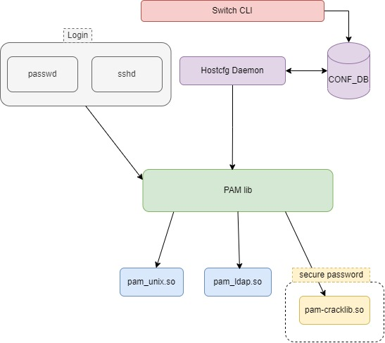
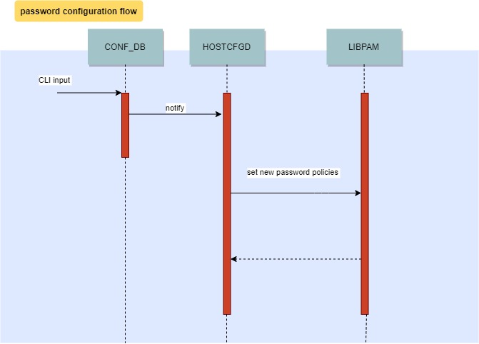

# PW Hardening Design #

##  1. <a name='TableofContent'></a>Table of Content

<!-- vscode-markdown-toc -->
* 1. [Table of Content](#TableofContent)
	* 1.1. [Revision](#Revision)
	* 1.2. [Scope](#Scope)
	* 1.3. [Definitions/Abbreviations](#DefinitionsAbbreviations)
	* 1.4. [Overview](#Overview)
	* 1.5. [Requirements](#Requirements)
	* 1.6. [Architecture Design](#ArchitectureDesign)
	* 1.7. [High-Level Design](#High-LevelDesign)
		* 1.7.1. [Flow description:](#Flowdescription:)
		* 1.7.2. [Password Hardening Constrains](#PasswordHardeningConstrains)
	* 1.8. [Init Flow](#InitFlow)
		* 1.8.1. [Compilation](#Compilation)
		* 1.8.2. [dependencies](#dependencies)
		* 1.8.3. [Feature default](#Featuredefault)
	* 1.9. [SAI API](#SAIAPI)
	* 1.10. [Configuration and management](#Configurationandmanagement)
		* 1.10.1. [PASSWH configDB table](#PASSWHconfigDBtable)
		* 1.10.2. [ConfigDB schemas](#ConfigDBschemas)
		* 1.10.3. [CLI/YANG model Enhancements](#CLIYANGmodelEnhancements)
		* 1.10.4. [Config DB Enhancements](#ConfigDBEnhancements)
	* 1.11. [Warmboot and Fastboot Design Impact](#WarmbootandFastbootDesignImpact)
	* 1.12. [Restrictions/Limitations](#RestrictionsLimitations)
	* 1.13. [Upgrade Flow](#UpgradeFlow)
	* 1.14. [Test Plan](#TestPlan)
		* 1.14.1. [Unit Test cases](#UnitTestcases)
		* 1.14.2. [System Test cases](#SystemTestcases)
	* 1.15. [3rd Party Components](#rdPartyComponents)
		* 1.15.1. [pam-cracklib](#pam-cracklib)
		* 1.15.2. [PW Age/History](#PWAgeHistory)
		* 1.15.3. [PW History](#PWHistory)

<!-- vscode-markdown-toc-config
	numbering=true
	autoSave=true
	/vscode-markdown-toc-config -->
<!-- /vscode-markdown-toc -->


###  1.1. <a name='Revision'></a>Revision
|  Rev  |  Date   |      Author      | Change Description |
| :---: | :-----: | :--------------: | ------------------ |
|  0.1  | 11/2020 |   David Pilnik   | Phase 1 Design     |

###  1.2. <a name='Scope'></a>Scope

This password hardening hld doc described the requirements, architecture and configuration details of password hardening feature in switches SONIC OS based.

###  1.3. <a name='DefinitionsAbbreviations'></a>Definitions/Abbreviations
	PW - password
	PASSWH - Password Hardening

###  1.4. <a name='Overview'></a>Overview

Password Hardening, a user password is the key credential used in order to verify the user accessing the switch and acts as the first line of defense in regards to securing the switch.
The complexity of the password, it's replacement capabilities and change frequency define the security level of the first perimeter of the switch.
Therefore - in order to further improve and harden the switch - a secure mechanism is required to enforce PW policies.

###  1.5. <a name='Requirements'></a>Requirements
| Requirement | Capabilities | Config Parameters | Notes
| ------ | ------| ------ | ------ |
| PW Length	 | The PW length should have a minimum length requirement <br /><br />The PW length should have a maximum length requirement| The user should be able to configure the minimum PW length <br /><br />The user should be able to configure the maximum PW length | Min PW length is between 0 to 32 chars (default 8)<br /><br />Max PW length is between 64 to 80 chars (default 64)
| PW Aging | The PW should have an expiration date, after which the user is required to change the PW <br /><br />A warning to change the PW should be presented to the user a fixed time before the expiration date arrives. This warning should appear in every login so long as the PW expiration time <= warning time. |The user should be able to configure the expiration time of the PW.  The user will be able to configure "no aging" for the PW<br /><br />The user should be able to configure the amount of days to present the warning before the PW expires | PW age time is to be between 1 to 365 days (default 180)<br /><br />PW warning show is to be between 1 to 30 days (default 15)
| PW constraints | The PW class represents the possible characters comprising the PW. There are 4 character classes that can make up the PW:small characters, big characters, numbers and special chars presented on a standard keyboard <br /><br />The account name and PW need to be different <br /><br />The new PW is to be different from current PW|The user should be able to define which characters classes are required for the PW out of the 4 provided<br /><br /><br /><br />The user will be able to enable or disable this feature|Legal special characters `~!@#$%^&*()-_=+\|[{}];:',<.>/? and white space<br /><br /><br /><br />An error will be shown to the user if it tries to set the same PW as the username<br /><br /><br /><br />default - enable, default remember last 10 password

###  1.6. <a name='ArchitectureDesign'></a>Architecture Design
Arc design diagram\


(flow description in the chapter below)

###  1.7. <a name='High-LevelDesign'></a>High-Level Design

In this section we will present the design (as thorough as possible) for the secure PW implementation.

User password as explained before is the first line defence, in order to support it according to the requirement section and user preferences, the secure password feature needs a strength-checking for password.

The feature will use 2 linux libs: pam-cracklib, chage and pam_pwhistory.so

pam-cracklib: This module can be plugged into the password stack of a given application to provide some plug-in strength-checking for passwords.

The action of this module is to prompt the user for a password and check its strength against a system dictionary and a set of rules for identifying poor choices.
This module supports many options, including the requirements of PW Length & PW constraints. (see option strength-checking below)

chage: support the requirement of PW Aging, change user password expiry information

pam_pwhistory - PAM module to remember last passwords (seen that Debian already supported it without installing this package)

Note:
See linux 3d party component chapter for more description


##### Flow diagram:



####  1.7.1. <a name='Flowdescription:'></a>Flow description:
When the feature is enabled, Users by using SONIC CLI will set new password policies/configuration (see PW options below) saving those in CONF_DB in PASSWH_TABLE.

The daemon named hostcfgd daemon will be extended to listen to password hardening policies/configurations from PASSWH table, parse the inputs and set the new policies to PAM lib using pam-cracklib, chage, pwhistory libs.

Note:

The Daemon is running in the host (without container) that matches this feature, because it is basically writing policies at PAM lib installed in the host.

In addition, hostcfgd will avoid future conflicts with other feature related to PAM lib, because this daemon is also writing to PAM files for support other features, so it is better to save this convention and also manage the password hardening policies in this daemon.
####  1.7.2. <a name='PasswordHardeningConstrains'></a>Password Hardening Constrains
The PW Hardening features will support different options by encapsulating cracklib, chage and pwhistory options according to the constrains definitions below.

##### PW enable

Enable/Disable password hardening feature

Note: when this feature is disable will be just the default password validation without strength-checking for passwords.

##### PW Class
PW class is the type of characters the user is required to enter when setting/updating a PW.

There are 4 classes:

Small characters - a-z

Big characters - A-Z

Numbers - 0-9

Special Characters   `~!@#$%^&*()-_+=\|[{}];:',<.>/? and white space

Each of these classes will receive a Regexp to represent the class.

The user will be able to choose whether to enforce all PW class characters in the PW or only a subset of the characters.

Note:
In order to implement it, the daemon will encapsulate some pam-cracklib options.
i.e:

To request at least one character of every class, the PASSWD daemon will set:
pam-cracklib options: lcredit=-1, ucredit=-1, dcredit=-1.
(meaning that the user needs at least one character of the types.)
See explanation of cracklib options in 3rd Party component chapter.

##### PW Length
PW length is a base requirement for the PW.

All password length enforcements and changes will be applied the next time the user would require a PW change or would want to change his own password

* Minimum Length

	The minimum length of the PW should be subject to a user change.

	The user will be able to change the password minimum length if he has the necessary permissions to change the PW.

	Implementation:
	In order to implement it, the cracklib option minlen=N should be set.


	Note:
	Once the user changed the minimum password length - the settings will be applied to the config node and will be enforced on the next pw change

##### PW Age
Along with every PW set to a user, attached to it is the age of the PW - the amount of time that has passed since a PW change has occurred.

This PW change can either be from the initial config wizard or from the CLI.

* PW Age Change
	Once a PW change takes place - the DB record for said PW is updated with the new PW value and a fresh new age (=0).

	Every login (and PW entry) will check the PW age field to see if it has exceeded its maximum time alive (the amount of time before the PW needs to change).

	If so - a prompt will be shown to the user forcing it to change the PW before logging into the switch. Prompt PW change view will be explained in TBD.

	To support it, can be use chage lib option "--maxdays"

* PW Age Change Warning
	The switch will provide a warning for PW change before and (this is to allow a sufficient warning for upgrading the PW which might be relevant to numerous switches).

	Along with this warning - the user will also be able to control how long before the PW expiration this warning will appear.

	To support it, can be use chage option "--warndays"

Aging(expire) implementation :

For implement the "aging" we need to change the /etc/login.def file and set max days and warning days, this changes affection globally, meaning all new users.
For read the information per user we will use the "chage" library.
In addition, when we change the file /etc/login.def its change globally by only new users, so basically for change existing users expired day we need to iterate every one of them using the "chage" lib.

See the example below regarding global expiration time and warning time:

	# /etc/login.def
	# Password aging controls:
	#
	#       PASS_MAX_DAYS   Maximum number of days a password may be used.
	#       PASS_MIN_DAYS   Minimum number of days allowed between password changes.
	#       PASS_WARN_AGE   Number of days warning given before a password expires.
	#
	PASS_MAX_DAYS   1
	PASS_MIN_DAYS   0
	PASS_WARN_AGE   7

As a result of the changes above, new users will have an expiration time of 1 day, so warning time notification will be prompt in the terminal:

	root@arc-switch1004:/home/admin# adduser test_user1
	root@arc-switch1004:/home/admin# su test_user1
	Warning: your password will expire in 1 day

Regaring the policy when expiration time end (PASS_MAX_DAYS):

The maximum number of days a password may be used. If the
password is older than this, a password change will be
forced. In other words, the user remained block until he update a new password.

##### PW username-match
By enabling this feature, the user will not be permitted to set the same username & password


##### PW Saving
Saved previous passwords in the DB to verify that the user cannot used old password

Implementation: will be supported by using pam_pwhistory.so, remember=N option (N- number of old passwords to be saved).
See that in Debian it's not necessary to install this package. It's enough to add the remember=N option to the common-password file.

Note:
For saving password with sha512, need to modify the /etc/pam.d/system-auth-a file to contain this line:

		password    sufficient    pam_unix.so sha512 shadow use_authtok

###  1.8. <a name='InitFlow'></a>Init Flow
####  1.8.1. <a name='Compilation'></a>Compilation
This feature will be compiled always, but it will be disabled by default (from running time point of view).
Meaning that the switch will boot with an image that includes the feature code and the status of the feature will be disabled, so no password hardening policies are configured in the system. 
This default configuration can be founded in init_cfg.json.j2.

In addition, the user can enable/disable the feature in running time by using the SONIC CLI (details in CLI chapter).

####  1.8.2. <a name='Dependencies'></a>Dependencies
Service dependencies: same dependencies as HOSTCFGD, INIT_CONF and NTP service.

Note:
NTP service should be secure, because it can influence expiration time of some policies.

####  1.8.3. <a name='FeatureDefault'></a>Feature Default
When a user decides to add the feature in the compilation the feature will be enabled by default.

Description of default values in init_cfg.json regarding Password Hardening:
```
feature enable: True
expiration: 180 	// days unit
expiration warning: 15 //days unit
history: 10 // num of old password that the system will recorded
len_max: 61
len_min: 8
username password match: True
lower class: True
upper class: True
digit class: True
special class: True
```
Notes:
-  Old users (existing users before feature was enabled) will not be influenced by this feature, only new users will have to set passwords according to the password hardening policies, or old user when changing to new password will be force to be according the new policies.
-  Default password of the system will remained with default value even when the feature is enable. It will be secure password only when the user decide to change the password.

###  1.9. <a name='SAIAPI'></a>SAI API
no changed.

###  1.10. <a name='Configurationandmanagement'></a>Configuration and management

####  1.10.1. <a name='PASSWHconfigDBtable'></a>PASSWH configDB table

```
PASSWH:{
	policies:{
		"enable": {{True/False}}
		"expiration": {{days}}
		"expiration_warning": {{days}}
		"history": {{num_passw_history}}
		"len_max": {{num}}
		"len_min": {{num}}
		"username_passw_match": {{True/False}}
		"lower_class": {{True/False}}
		"upper_class": {{True/False}}
		"digit_class": {{True/False}}
		"special_class": {{True/False}}
	}
}
```
####  1.10.2. <a name='ConfigDBschemas'></a>ConfigDB schemas

```
; Defines schema for PASSWH configuration attributes in PASSWH table:
key                                   = "POLICIES"             ;password hardening configuration
; field                               = value
FEATURE_ENABLE                        = "True" / "False"        ; Feature feature enable/disable
EXPIRATION                            = 3*DIGIT                    ; password expiration in days units, should be 365 days max
EXPIRATION_WARNING                    = 2*DIGIT                   ; password expiration warning  1 month(30 days) in days units
PASSW_HISTORY                         = 2*DIGIT                 ; number of old password to be stored (0-99)
LEN_MIN                               = 2*DIGIT                 ; max characters in password (0-32 chars)
LEN_MAX                               = 2*DIGIT                 ; min characters in password (64-80 chars)
USERNAME_PASSW_MATCH                  = "True" / "False"
LOWER_CLASS                           = "True" / "False"
UPPER_CLASS                           = "True" / "False"
DIGITS_CLASS                          = "True" / "False"
SPECIAL_CLASS                         = "True" / "False"
```


####  1.10.3. <a name='CLIYANGmodelEnhancements'></a>CLI/YANG model Enhancements
```yang
//filename:  sonic-passw.yang
module sonic-passwh {
    yang-version 1.1;
    namespace "http://github.com/Azure/sonic-passwh";
	prefix passwh;

    description "PASSWORD HARDENING YANG Module for SONiC OS";

	revision 2021-10-12 {
        description
            "First Revision";
    }
    typedef feature_state {
        type enumeration {
			enum enabled;
			enum disabled;
		}
	}

    container sonic-passwh {
		container PASSWH {
			description "PASSWORD HARDENING part of config_db.json";
			container POLICIES {
				leaf state {
					description "state of the feature";
					type feature_state;
					default "disabled";
				}
				leaf expiration {
					description "expiration time (days unit)";
					default 180;
					type uint32 {
						range 1..365;
					}
				}
				leaf expiration_warning {
					description "expiration warning time (days unit)";
					default 15;
					type uint8 {
						range 1..30;
					}
				}
				leaf history_cnt {
					description "num of old password that the system will recorded";
					default 10;
					type uint8 {
						range 1..100;
					}
				}
				leaf len_max {
					description "password max length";
					default 64;
					type uint8 {
						range 64..80;
					}
				}
				leaf len_min {
					description "password min length";
					default 8;
					type uint8 {
						range 1..32;
					}
				}
				leaf username_passw_match{
					description "username password match";
					default true;
					type boolean;
				}
				leaf lower_class{
					description "password lower chars policy";
					default true;
					type boolean;
				}
				leaf upper_class{
					description "password upper chars policy";
					default true;
					type boolean;
				}
				leaf digits_class{
					description "password digits chars policy";
					default true;
					type boolean;
				}
				leaf special_class{
					description "password special chars policy";
					default true;
					type boolean;
				}
			}/*container policies */
		} /* container PASSWH  */
    }/* container sonic-passwh */
}/* end of module sonic-passwh */
```

##### Config CLI
###### PW enable

Passwoed Hardening enable feature, set configuration:

```
root@r-panther-13:/home/admin# config passwh policies state --help
Usage: config passwh policies state [OPTIONS] STATE

  state of the feature

Options:
  -?, -h, --help  Show this message and exit.
```

PW Classes:

PW class is the type of characters the user is required to enter when setting/updating a PW.

There are 4 classes. (see description in arc section)

The user will be able to choose whether to enforce all PW class characters in the PW or only a subset of the characters.

A CLI command will be available to the user for this configuration. Once a user has selected the class types he wants to enforce (from a pre-defined options list), this will enforce the PW selected by the user to have at least 1 character from each class in the selected option.

The CLI classes options will be as follows:

None - Meaning no required classes.

lower- lowerLowercase Characters

upper - Uppercase

digit - Numbers

special - Special symbols (seen in requirement chapter)

multiple char enforcement

There will be no enforcement of multiple characters from a specific class or a specific character (be either letter or symbol) to appear in the PW.

The CLI command to configure the PW class type will be along the following lines:

Set classes configuration:
```
==============================================================================
root@r-panther-13:/home/admin# config passwh policies lower-class --help
Usage: config passwh policies lower-class [OPTIONS] LOWER_CLASS

  password lower chars policy

Options:
  -?, -h, --help  Show this message and exit.
==============================================================================
root@r-panther-13:/home/admin# config passwh policies upper-class --help
Usage: config passwh policies upper-class [OPTIONS] UPPER_CLASS

  password upper chars policy

Options:
  -h, -?, --help  Show this message and exit.
==============================================================================
root@r-panther-13:/home/admin# config passwh policies digits-class --help
Usage: config passwh policies digits-class [OPTIONS] DIGITS_CLASS

  password digits chars policy

Options:
  -h, -?, --help  Show this message and exit.
==============================================================================
root@r-panther-13:/home/admin# config passwh policies special-class --help
Usage: config passwh policies special-class [OPTIONS] SPECIAL_CLASS

  password special chars policy

Options:
  -?, -h, --help  Show this message and exit.
==============================================================================
```

Note: Meaning: no must use of lower, no must use of upper, must use digit, must use special characters

###### PW Length

Set len-min configuration:
```
root@r-panther-13:/home/admin# config passwh policies len-min --help
Usage: config passwh policies len-min [OPTIONS] LEN_MIN

  password min length

Options:
  -?, -h, --help  Show this message and exit.
```

Note: Where length is a number between 0 and 32.

Once the user changed the minimum password length - the settings will be applied to the config node and will be enforced on the next pw change

###### PW Age

* PW age expire

Set configuration:
```
root@r-panther-13:/home/admin# config passwh policies expiration --help
Usage: config passwh policies expiration [OPTIONS] EXPIRATION

  expiration time (days unit)

Options:
  -h, -?, --help  Show this message and exit.
```

Notes: Where age is in days and between 1 and 365 days (default 180).
* PW Age Change Warning

Set configuration:
```
root@r-panther-13:/home/admin# config passwh policies expiration-warning --help
Usage: config passwh policies expiration-warning [OPTIONS] EXPIRATION_WARNING

  expiration warning time (days unit)

Options:
  -?, -h, --help  Show this message and exit.
```

Notes: The warning_days can be configured between 1 and 30 days (default 15).


###### PW username-match

Set configuration:

```
root@r-panther-13:/home/admin# config passwh policies username-passw-match --help
Usage: config passwh policies username-passw-match [OPTIONS]
                                                   USERNAME_PASSW_MATCH

  username password match

Options:
  -h, -?, --help  Show this message and exit.
```

###### PW Saving
Set configuration:

```
root@r-panther-13:/home/admin# config passwh policies history --help
Usage: config passwh policies history [OPTIONS] HISTORY

  num of old password that the system will recorded

Options:
  -h, -?, --help  Show this message and exit.
```
##### Show CLI

Show command should be extended in order to add "passwh" alias:

```
root@r-panther-13:/home/admin# show passwh policies
STATE    EXPIRATION    EXPIRATION WARNING    HISTORY    LEN MAX    LEN MIN    USERNAME PASSW MATCH    LOWER CLASS    UPPER CLASS    DIGITS CLASS    SPECIAL CLASS
-------  ------------  --------------------  ---------  ---------  ---------  ----------------------  -------------  -------------  --------------  ---------------
enabled      30           10                   4         100        30               false                 true            true            true          true
```

##### CLI permissions
	The CLI commands should be allowed only to the admin user. Other users should be able to view the parameters but not change them.

####  1.10.4. <a name='ConfigDBEnhancements'></a>Config DB Enhancements

The ConfigDB will be extended with next objects:

```json
{
	"PASSWH": {
		"policies":{
			"enable": "True",
			"expiration": "30",
			"expiration_warning": "10",
			"history": "10",
			"len_max": "30",
			"len_min": "15",
			"username_passw_match": "True",
			"lower class": "True",
			"upper class": "True",
			"digit class": "True",
			"special class": "True",
		}
	}
}
```


###  1.11. <a name='WarmbootandFastbootDesignImpact'></a>Warmboot and Fastboot Design Impact
Not relevant.

###  1.12. <a name='RestrictionsLimitations'></a>Restrictions/Limitations
The secure password feature is not supported on remote AAA.

LDAP/Radius/Tacacs is under customer responsibility.

###  1.13. <a name='UpgradeFlow'></a>Upgrade Flow
When user with the correspond permission is doing upgrade from image with password hardening enable to password enable as well, the configuration related to the feature should be remain the same as was set before the update.

When user is doing upgrade from image with password hardening feature disable to enable, old password will remain exactly as was set before, the feature is setting rules/policies to new passwords or to new users, so old passwords will remained as was set before.

Upgrade image from feature enable to image with feature disable, from the security POV should assume that the user that is doing this image update have the corresponding permissions.
From the feature POV, old password records that were set using the feature will remain the same, and new passwords will be set without the password hardening policies, because the feature is disable in the new image.

Note:
First time, the default password will remained the same, even when the feature is enabled, and if the user will like to have a secure password he will need to change it, and in result that the feature is enabled the current policies will required an strong password this time.

###  1.14. <a name='TestPlan'></a>Test Plan
####  1.14.1. <a name='UnitTestcases'></a>Unit Test cases
- Configuration – good flow
  - Enable/Disable feature
  - Perform show command
  - Verify default values
  - Configure passwh classes of every existing types
  - Configure passwh length min using different valid values
  - Configure passwh age expiration using different valid values
  - Configure passwh age warning using different valid values
  - Configure passwh username-password-match
  - Configure passwh history using different valid values

- Configuration - Negative flow
   - Configure min password with random false values
   - Configure age expiration password with random false values
   - Configure age warning password with random false values
   - Configure complexity-class password with random false values
   - Configure history password with random false values

##### Notes:
- After creating a new policy is necessary to set a new password to a user to verify that the policy match the configured.
- Valid values: could be random values from valid ranges.
- The set configuration should be validate using the show command.

####  1.14.2. <a name='SystemTestcases'></a>System Test cases
- Test all passwh policies together
  - Configure all the passwh options.
  - Create a new user and change an existing user password.
  - Validate that policies match the configured


###  1.15. <a name='rdPartyComponents'></a>3rd Party Components
In this section you can find most of the options of pam-cracklib, chage and pwhistory, we are going to use just the options mention in the Arc chapter, the other option maybe could be use for future features

####  1.15.1. <a name='pam-cracklib'></a>pam-cracklib

Options:

##### debug
This option makes the module write information to syslog(3) indicating the behavior of the module (this option does not write password information to the log file).
##### authtok_type=XXX
The default action is for the module to use the following prompts when requesting passwords: "New UNIX password: " and "Retype UNIX password: ". The example word UNIX can be replaced with this option, by default it is empty.
##### retry=N
Prompt user at most N times before returning with error. The default is 1.
##### difok=N
This argument will change the default of 5 for the number of character changes in the new password that differentiate it from the old password.
##### minlen=N
The minimum acceptable size for the new password (plus one if credits are not disabled which is the default). In addition to the number of characters in the new password, credit (of +1 in length) is given for each different kind of character (other, upper, lower and digit). The default for this parameter is 9 which is good for a old style UNIX password all of the same type of character but may be too low to exploit the added security of a md5 system. Note that there is a pair of length limits in Cracklib itself, a "way too short" limit of 4 which is hard coded in and a defined limit (6) that will be checked without reference to minlen. If you want to allow passwords as short as 5 characters you should not use this module.
##### dcredit=N
(N >= 0) This is the maximum credit for having digits in the new password. If you have less than or N digits, each digit will count +1 towards meeting the current minlen value. The default for dcredit is 1 which is the recommended value for minlen less than 10.
(N < 0) This is the minimum number of digits that must be met for a new password.

##### ucredit=N
(N >= 0) This is the maximum credit for having upper case letters in the new password. If you have less than or N upper case letters each letter will count +1 towards meeting the current minlen value. The default for ucredit is 1 which is the recommended value for minlen less than 10.
(N < 0) This is the minimum number of upper case letters that must be met for a new password.

##### lcredit=N
(N >= 0) This is the maximum credit for having lower case letters in the new password. If you have less than or N lower case letters, each letter will count +1 towards meeting the current minlen value. The default for lcredit is 1 which is the recommended value for minlen less than 10.
(N < 0) This is the minimum number of lower case letters that must be met for a new password.

##### ocredit=N
(N >= 0) This is the maximum credit for having other characters in the new password. If you have less than or N other characters, each character will count +1 towards meeting the current minlen value. The default for ocredit is 1 which is the recommended value for minlen less than 10.
(N < 0) This is the minimum number of other characters that must be met for a new password.

##### minclass=N
The minimum number of required classes of characters for the new password. The default number is zero. The four classes are digits, upper and lower letters and other characters. The difference to the credit check is that a specific class if of characters is not required. Instead N out of four of the classes are required.
maxrepeat=N
Reject passwords which contain more than N same consecutive characters. The default is 0 which means that this check is disabled.
##### maxsequence=N
Reject passwords which contain monotonic character sequences longer than N. The default is 0 which means that this check is disabled. Examples of such sequence are '12345' or 'fedcb'. Note that most such passwords will not pass the simplicity check unless the sequence is only a minor part of the password.
##### maxclassrepeat=N
Reject passwords which contain more than N consecutive characters of the same class. The default is 0 which means that this check is disabled.
reject_username
Check whether the name of the user in straight or reversed form is contained in the new password. If it is found the new password is rejected.
##### gecoscheck
Check whether the words from the GECOS field (usually full name of the user) longer than 3 characters in straight or reversed form are contained in the new password. If any such word is found the new password is rejected.
##### enforce_for_root
The module will return error on failed check also if the user changing the password is root. This option is off by default which means that just the message about the failed check is printed but root can change the password anyway.
##### use_authtok
This argument is used to force the module to not prompt the user for a new password but use the one provided by the previously stacked password module.
##### dictpath=/path/to/dict
Path to the cracklib dictionaries.
Module Types Provided
Only the password module type is provided.

##### Return Values
###### PAM_SUCCESS
The new password passes all checks.
###### PAM_AUTHTOK_ERR
No new password was entered, the username could not be determined or the new password fails the strength checks.
###### PAM_AUTHTOK_RECOVERY_ERR
The old password was not supplied by a previous stacked module or got not requested from the user. The first error can happen if use_authtok is specified.
###### PAM_SERVICE_ERR
A internal error occurred.

####  1.15.2. <a name='PWAgeHistory'></a>PW Age/History


The options which apply to the chage command are:

	-d, --lastday LAST_DAY

Set the number of days since January 1st, 1970 when the password was last changed. The date may also be expressed in the format YYYY-MM-DD (or the format more commonly used in your area).

	-E, --expiredate EXPIRE_DATE

Set the date or number of days since January 1, 1970 on which the users account will no longer be accessible. The date may also be expressed in the format YYYY-MM-DD (or the format more commonly used in your area). A user whose account is locked must contact the system administrator before being able to use the system again.

Passing the number -1 as the EXPIRE_DATE will remove an account expiration date.

	-h, --help

Display help message and exit.

	-i, --iso8601

When printing dates, use YYYY-MM-DD format.

	-I, --inactive INACTIVE

Set the number of days of inactivity after a password has expired before the account is locked. The INACTIVE option is the number of days of inactivity. A user whose account is locked must contact the system administrator before being able to use the system again.

Passing the number -1 as the INACTIVE will remove an accounts inactivity.

	-l, --list

Show account aging information.

	-m, --mindays MIN_DAYS

Set the minimum number of days between password changes to MIN_DAYS. A value of zero for this field indicates that the user may change their password at any time.

	-M, --maxdays MAX_DAYS

Set the maximum number of days during which a password is valid. When MAX_DAYS plus LAST_DAY is less than the current day, the user will be required to change their password before being able to use their account. This occurrence can be planned for in advance by use of the -W option, which provides the user with advance warning.

Passing the number -1 as MAX_DAYS will remove checking a passwords validity.

	-R, --root CHROOT_DIR

Apply changes in the CHROOT_DIR directory and use the configuration files from the CHROOT_DIR directory.

	-W, --warndays WARN_DAYS

Set the number of days of warning before a password change is required. The WARN_DAYS option is the number of days prior to the password expiring that a user will be warned their password is about to expire.

If none of the options are selected, chage operates in an interactive fashion, prompting the user with the current values for all of the fields. Enter the new value to change the field, or leave the line blank to use the current value. The current value is displayed between a pair of [ ] marks.

Notes: If we want to do "age" configuration globally and not per user, it necessary to modify this file:  /etc/login.defs, example:

	PASS_MAX_DAYS 90
	PASS_WARN_AGE 7

####  1.15.3. <a name='PWHistory'></a>PW History
pam_pwhistory: PAM module to remember last passwords

##### DESCRIPTION

This module saves the last passwords for each user in order to force password change history and keep the user from alternating between the same password too frequently.

This module does not work together with kerberos. In general, it does not make much sense to use this module in conjunction with NIS or LDAP, since the old passwords are stored on the local machine and are not available on another machine for password history checking.

OPTIONS

##### debug

Turns on debugging via syslog(3).
use_authtok

When password changing enforce the module to use the new password provided by a previously stacked password module (this is used in the example of the stacking of the pam_cracklib module documented below).
##### enforce_for_root
If this option is set, the check is enforced for root, too.
##### 	remember=N

The last N passwords for each user are saved in /etc/security/opasswd. The default is 10. Value of 0 makes the module to keep the existing contents of the opasswd file unchanged.
##### retry=N

Prompt user at most N times before returning with error. The default is 1.
authtok_type=STRING

See pam_get_authtok(3) for more details.
MODULE TYPES PROVIDED
Only the password module type is provided.

##### RETURN VALUES
	PAM_AUTHTOK_ERR

No new password was entered, the user aborted password change or new password couldn't be set.
	PAM_IGNORE

Password history was disabled.
	PAM_MAXTRIES

Password was rejected too often.
	PAM_USER_UNKNOWN

User is not known to system.
##### EXAMPLES
An example password section would be:

	#%PAM-1.0
	password     required       pam_pwhistory.so
	password     required       pam_unix.so        use_authtok

	In combination with pam_cracklib:

	#%PAM-1.0
	password     required       pam_cracklib.so    retry=3
	password     required       pam_pwhistory.so   use_authtok
	password     required       pam_unix.so        use_authtok


##### FILES
File with password history
	/etc/security/opasswd
