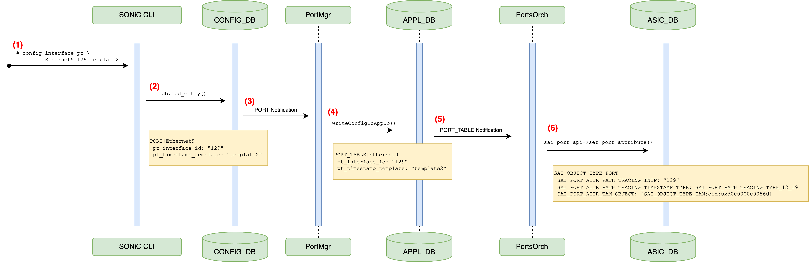
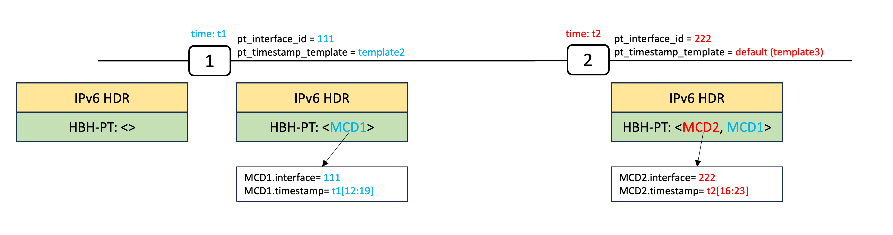

# Path Tracing Midpoint #

## Table of Content 

- [Revision](#revision)
- [Scope](#scope)
- [Definitions/Abbreviations](#definitionsabbreviations)
- [Overview](#overview)
- [Requirements](#requirements)
    - [Functional requirements](#functional-requirements)
    - [Configuration and Management Requirements](#configuration-and-management-requirements)
- [Architecture Design](#architecture-design)
- [High-Level Design](#high-level-design)
    - [SONiC CLI Changes](#sonic-cli-changes)
        - [CLI Configuration Commands](#cli-configuration-commands)
        - [CLI Show Commands](#cli-show-commands)
    - [CONFIG_DB Changes](#config_db-changes)
    - [PortSyncd Changes](#portsyncd-changes)
    - [PortMgrd Changes](#portmgrd-changes)
    - [APPL_DB Changes](#APPL_DB-changes)
    - [PortsOrch OrchAgent Changes](#portsorch-orchagent-changes)
    - [ASIC_DB Changes](#asic_db-changes)
- [SAI API](#sai-api)
- [YANG Models Enhancements](#yang-model-enhancements)
- [Testing Requirements/Design](#testing-requirementsdesign)
    - [Unit Test cases](#unit-test-cases)
        - [Test cases for configuration CLI commands](#test-cases-for-configuration-cli-commands)
        - [Test cases for configuration show commands](#test-cases-for-configuration-show-commands)
        - [Test cases for PortMgr](#test-cases-for-portmgr)
        - [Test cases for OrchAgent](#test-cases-for-orchagent)
    - [System Test cases](#system-test-cases)
- [Open/Action items](#openaction-items)
- [References](#references)

## Revision  

| Rev  |   Date    |      Author                         | Change Description      |
| :--: | :-------: | :---------------------------------: | :---------------------: |
| 0.1  | 22/8/2023 | Carmine Scarpitta, Ahmed Abdelsalam |  Initial version        |

## Scope  

This document describes the requirements, architecture, and configuration details of the SRv6 Path Tracing Midpoint feature in SONiC.

## Definitions/Abbreviations 

| **Term**                 | **Definition**                                                                                      |
|--------------------------|-----------------------------------------------------------------------------------------------------|
| PT                       | Path Tracing                                                                                        |
| MCD                      | Midpoint Compressed Data.  Information that every transit router adds to the packet for PT purposes |
| HbH-PT                   | IPv6 Hop-by-Hop Path Tracing Option used for PT. It contains a stack of MCDs                        |
| PT Source                | A Source node that starts a PT Probing Instance and generates PT probes                             |
| PT Midpoint              | A transit node that performs plain IPv6 forwarding (or SR Endpoint processing) and in addition records PT information in the HbH-PT |
| PT Sink                  | A node that receives PT probes sent from the SRC containing the information recorded by every PT Midpoint along the path, and forwards them to a regional collector after recording its PT information |
| RC                       | Regional collector that receives PT probes, parses, and stores them in TimeSeries Database. It uses the PT information to construct the packet delivery path as well as the timestamp at each node |

The Path Tracing terminologies are defined in [draft-filsfils-spring-path-tracing](https://www.ietf.org/archive/id/draft-filsfils-spring-path-tracing-04.html#name-terminology).

## Overview 

Path Tracing provides a record of the packet path as a sequence of interface ids. In addition, it provides a record of end-to-end delay, per-hop delay, and load on each egress interface along the packet delivery path. 

Path Tracing supports fine grained timestamp. It has been designed for linerate hardware implementation in the base pipeline.

Path Tracing enjoys a very rich ecosystem both from Vendor and Open-Source point of view. 

Path Tracing is supported across many HW ASIC including Cisco Silicon One, Cisco Light Speed, Broadcom Jericho, Broadcom Jericho2, Marvell and many others. 

Path Tracing has also a very opensource ecosystem that includes the Linux Kernel, FD.io VPP, an open P4 implementation, and support in applications such as Wireshark and TCPDump.

The list routing of platforms that have successfully participated in the Path Tracing interop testing are reported in 
[draft-filsfils-spring-path-tracing](https://www.ietf.org/archive/id/draft-filsfils-spring-path-tracing-04.html#name-implementation-status).

## PT Midpoint 

Each PT Midpoint node on the packet path records a tiny piece of information known as Midpoint Compressed Data (MCD). 

The Midpoint Compressed Data (MCD) contains the outgoing interface ID, outgoing (truncated) timestamp, and the load of the outgoing interface.

Every interface of the PT Midpoint is assigned an interface ID and timestamp template. The timestamp template defines how to trunacte the timestamp (i.e., which bits of the timestamp are selected). 

In this document, we provide the SONiC High Level Design (HLD) to program the Path Tracing Interface ID and timestamp template. 

The SAI Port object has been extended with two new attributes for the [Interface ID](https://github.com/opencomputeproject/SAI/blob/master/inc/saiport.h#L2346) and the [timestamp template](https://github.com/opencomputeproject/SAI/blob/master/inc/saiport.h#L2355).

The SAI Port header defines [four different timestamp templates](https://github.com/opencomputeproject/SAI/blob/master/inc/saiport.h#L507C14-L507C53) as follows: 

| Name       | Description                          |
| :--------: | :----------------------------------: |
| template1  | Select bits 08-15 from the timestamp |
| template2  | Select bits 12-19 from the timestamp |
| template3  | Select bits 16-23 from the timestamp |
| template4  | Select bits 20-27 from the timestamp |


## Requirements

### Functional requirements

This feature provides the following high-level functional requirements:

- Configuration of the Path Tracing *Interface ID* and *Timestamp Template* of a physical port
- Verification of the configured Path Tracing *Interface ID* and *Timestamp Template* of a physical port

### Configuration and Management Requirements

- Extend SONiC CLI to support the configuration of the Path Tracing *Interface ID* and *Timestamp Template* of a physical port
- Extend SONiC CLI to support the verification of the configured Path Tracing *Interface ID* and *Timestamp Template* of a physical port

## Architecture Design 

This document describes the changes required to support the PT Midpoint in SONiC.

The overall architecture of SONiC is not modified. Supporting the PT Midpoint functionality in SONiC does not require any additional components.

The only requirement is to extend some components (namely SONiC CLI and OrchAgent) to support the configuration and validation of port parameters required by the PT Midpoint functionality.

## High-Level Design 

The following diagram shows the steps required to configure the PT Midpoint feature in SONiC:
<br> <br>

.

(1) The user configures the *PT Interface ID* and *PT Timestamp Template* of a physical port via the SONiC CLI.

(2) The SONiC CLI injects the PT Interface ID and PT Timestamp Template into the PORT table in CONFIG_DB.

(3) portmgrd receives a PORT update notification (portmgrd is an CONFIG_DB subscriber).

(4) portmgrd inject the PT Interface ID and PT Timestamp Template into the PORT_TABLE in APPL_DB.

(5) PortsOrch receives a PORT_TABLE update notification (PortsOrch is an APPL_DB subscriber).

(6) PortsOrch invokes the sairedis `set_port_attribute()` APIs to set the port PT attributes including PT Interface ID, PT Timestamp Template, PT TAM Object. The port PT attributes are injected  into the ASIC_DB.

The next subsections describe the changes required to support the PT Midpoint HLD described above. 

### SONiC CLI Changes

#### CLI Configuration Commands

The existing `config interface` command is extended by introducing a new subcommand `path-tracing` that allows users to enable/disable Path Tracing and configure the Interface ID and Timestamp Template parameters required for the PT Midpoint functionality. The Timestamp Template is optional. The default template is *template3*.

Enable Path Tracing and configure Interface ID and Timestamp Template:

```
admin@sonic:~# config interface path-tracing add <interface_name> --interface-id <pt_interface_id> --ts-template [pt_timestamp_template]

    <interface_name>: interface name 
    <pt_interface_id>: Path Tracing Interface ID (1-4095)
    [pt_timestamp_template]: Path Tracing timestamp template (optional)
        Supported templates {template1, template2, template3, template4}
            template1: timestamp[08:15]
            template2: timestamp[12:19]
            template3: timestamp[16:23]
            template4: timestamp[20:27]
        Default: template3
```

Disable Path Tracing:

```
admin@sonic:~# config interface path-tracing del <interface_name>

    <interface_name>: interface name 
```

During the initialization of PortsOrch, we query ASIC_DB Path Tracing capability to check if Path Tracing is supported by the ASIC and store the result in the STATE_DB SWITCH_CAPABILITY table.
When the user tries to configure Path Tracing, we check the STATE_DB SWITCH_CAPABILITY table and return an error if Path Tracing is not supported.

We added a new attribute `path_tracing_capable` to the STATE_DB SWITCH_CAPABILITY table schema. When Path Tracing is supported, `path_tracing_capable` is set to `true`.

**Example 1:**

```
admin@sonic:~# config interface path-tracing add Ethernet8 --interface-id 128
```

The above command assigns Ethernet8 a Path Tracing Interface ID of 128 and a Timestamp Template template3 (default).

**Example 2:**

```
admin@sonic:~# config interface path-tracing add Ethernet9 --interface-id 129 --ts-template template2
```

The above command assigns Ethernet9 a Path Tracing Interface ID of 129 and a Timestamp Template template2.

**Example 3:**

```
admin@sonic:~# config interface path-tracing del Ethernet9
```

The above command disable Path Tracing on Ethernet9.

#### CLI Show Commands

The existing `show interfaces` command is extended by introducing a new subcommand `path-tracing` that allows users to verify the current PT Midpoint configuration (i.e., the Interface ID and Timestamp Template parameters).

```
admin@sonic:~$ show interfaces path-tracing [interface_name]
```

**Example 1** - Show PT Midpoint configuration for all interfaces:

```
admin@sonic:~$ show interfaces path-tracing

      Interface            Alias    Oper    Admin    PT Interface ID   PT Timestamp Template
---------------  ---------------  ------  -------  -----------------  ---------------------- 
      Ethernet8   fortyGigE0/0/8      up       up                128               template3
      Ethernet9   fortyGigE0/0/9      up       up                129               template2 
```

**Example 2** - Show PT Midpoint configuration for interface Ethernet9:

```
admin@sonic:~$ show interfaces path-tracing Ethernet9

      Interface            Alias    Oper    Admin    PT Interface ID   PT Timestamp Template
---------------  ---------------  ------  -------  -----------------  ---------------------- 
      Ethernet9   fortyGigE0/0/9      up       up                129               template2
```

The following example clarifies how the PT Midpoint functionality works:

.

Using the SONiC CLI,
- the user assigns an Interface ID of 111 and a Timestamp Template template2 to the node 1 interface facing node 2
- the user assigns an Interface ID of 222 and a Timestamp Template template3 (default) to the outward-facing interface of node 2

Node 1 receives an IPv6 packet that contains an IPv6 HBH-PT option. Node 1 does the regular packet processing, and just before forwarding the packet on the outgoing interface, node 1 pushes a new MCD (MCD1) to the HBH-PT. MCD1 encodes the outgoing interface ID (111) and the timestamp at which the packet is being forwarded (t1). According to the timestamp template template2, only bits [12-19] of the timestamp are encoded in the MCD.

Then, node 1 forwards to the packet to node 2. Node 2 does the regular packet processing, and just before forwarding the packet on the outgoing interface, node 2 pushes a new MCD (MCD2). MCD2 encodes the outgoing interface ID (222) and the timestamp at which the packet is being forwarded (t2). According to the timestamp template template3, only bits [16-23] of the timestamp are encoded in the MCD.


### CONFIG_DB Changes

The configuration parameters for the port are stored in the PORT table in CONFIG_DB.

Currently, the PORT table has the following schema:

```
;Configuration for layer 2 ports
key                 = PORT|ifname   ; ifname must be unique across PORT,INTF,VLAN,LAG TABLES
admin_status        = "down" / "up" ; admin status
lanes               = list of lanes ; (need format spec???)
mac                 = 12HEXDIG      ;
alias               = 1*64VCHAR     ; alias name of the port used by LLDP and SNMP, must be unique
description         = 1*64VCHAR     ; port description
speed               = 1*6DIGIT      ; port line speed in Mbps
mtu                 = 1*4DIGIT      ; port MTU
fec                 = 1*64VCHAR     ; port fec mode
autoneg             = BIT           ; auto-negotiation mode
```

To support PT Midpoint in SONiC, two new attributes `pt_interface_id` and `pt_timestamp_template` are added to the PORT table schema.

```
;Configuration for layer 2 ports
key                   = PORT|ifname   ; ifname must be unique across PORT,INTF,VLAN,LAG TABLES
...
pt_interface_id       = 1*4DIGIT      ; Path Tracing Interface ID (0-4095)
pt_timestamp_template = "template1" / "template2" / "template3" / "template4"; Path Tracing Timestamp Template
```

### PortSyncd Changes

PortSyncd is an existing daemon in SWSS container that reads the port configurations from configDB on boot and pushes them into APPL_DB. Then, Portsyncd listens on Netlink messages to make sure interfaces are ready before other subsystem can continue to work on port-related objects.

There is no PortSyncd modification required to support PT Midpoint as PortSyncd propagates all port attributes from CONFIG_DB PORT table to APPL_DB PORT_TABLE. Propagated attributes also include the new PT Interface ID and Timestamp Template attributes required for PT Midpoint.

### PortMgrd Changes

PortMgrd is an existing daemon in SWSS container that monitors operations in CONFIG_DB on the PORT table.

There is no PortMgrd modification required to support PT Midpoint as PortMgrd propagates all port attributes from CONFIG_DB PORT table to APPL_DB PORT_TABLE. Propagated attributes also include the new PT Interface ID and Timestamp Template attributes required for PT Midpoint.

### APPL_DB Changes

The configuration parameters for the port are stored in the PORT_TABLE in APPL_DB.

Currently, the PORT_TABLE has the following schema:

```
;Defines layer 2 ports
;In SONiC, Data is loaded from configuration file by portsyncd
key                 = PORT_TABLE:ifname    ; ifname must be unique across PORT,INTF,VLAN,LAG TABLES
admin_status        = "down" / "up"        ; admin status
oper_status         = "down" / "up"        ; oper status
lanes               = list of lanes ; (need format spec???)
mac                 = 12HEXDIG      ;
alias               = 1*64VCHAR     ; alias name of the port used by LLDP and SNMP, must be unique
description         = 1*64VCHAR     ; port description
speed               = 1*6DIGIT      ; port line speed in Mbps
mtu                 = 1*4DIGIT      ; port MTU
fec                 = 1*64VCHAR     ; port fec mode
autoneg             = BIT           ; auto-negotiation mode
preemphasis         = 1*8HEXDIG *( "," 1*8HEXDIG) ; list of hex values, one per lane
idriver             = 1*8HEXDIG *( "," 1*8HEXDIG) ; list of hex values, one per lane
ipredriver          = 1*8HEXDIG *( "," 1*8HEXDIG) ; list of hex values, one per lane
```

To support PT Midpoint in SONiC, two new attributes `pt_interface_id` and `pt_timestamp_template` are added to the PORT_TABLE schema.

```
;Defines layer 2 ports
key                   = PORT_TABLE:ifname    ; ifname must be unique across PORT,INTF,VLAN,LAG TABLES
...
pt_interface_id       = 1*4DIGIT      ; Path Tracing Interface ID (0-4095)
pt_timestamp_template = "template1" / "template2" / "template3" / "template4"; Path Tracing Timestamp Template
```

### PortsOrch (OrchAgent) Changes

PortsOrch is an existing component of the OrchAgent daemon in the SWSS container. PortsOrch monitors operations on Port related tables in APPL_DB and converts those operations into SAI commands to manage port entries.

PortsOrch is extended to support PT Midpoint. It  invokes the sairedis `set_port_attribute()` APIs to set the port PT attributes including PT Interface ID, PT Timestamp Template, PT TAM Object. The port PT attributes are injected  into the ASIC_DB.

### STATE_DB Changes

The capabilities supported by the switch are stored in the SWITCH_CAPABILITY table in STATE_DB.

To support PT Midpoint in SONiC, a new attribute `path_tracing_capable` is added to the SWITCH_CAPABILITY schema.

```
key                   = SWITCH_CAPABILITY:switch
...
path_tracing_capable       = "true" / "false"      ; Whether Path Tracing is supported or not
```

During the initialization, PortsOrch uses the sairedis `sai_query_attribute_capability()` API to check if the switch supports Path Tracing or not and sets the `path_tracing_capable` attribute in SWITCH_CAPABILITY table accordingly.

The `path_tracing_capable` attribute is used by the SONiC CLI to prevent users from enabling Path Tracing if it is not supported by the switch. 

## SAI API 

The SAI Port object has been extended with two new attributes [SAI_PORT_ATTR_PATH_TRACING_INTF](https://github.com/opencomputeproject/SAI/blob/master/inc/saiport.h#L2346) and the [SAI_PORT_ATTR_PATH_TRACING_TIMESTAMP_TYPE](https://github.com/opencomputeproject/SAI/blob/master/inc/saiport.h#L2355) to support PT Midpoint. 

```
    /**
    * @brief Attribute data for #SAI_PORT_ATTR_PATH_TRACING_TIMESTAMP_TYPE
    */
    typedef enum _sai_port_path_tracing_timestamp_type_t
    {
        /** Timestamp nanosecond bits [8:15] */
        SAI_PORT_PATH_TRACING_TIMESTAMP_TYPE_8_15,

        /** Timestamp nanosecond bits [12:19] */
        SAI_PORT_PATH_TRACING_TIMESTAMP_TYPE_12_19,

        /** Timestamp nanosecond bits [16:23] */
        SAI_PORT_PATH_TRACING_TIMESTAMP_TYPE_16_23,

        /** Timestamp nanosecond bits [20:27] */
        SAI_PORT_PATH_TRACING_TIMESTAMP_TYPE_20_27,

    } sai_port_path_tracing_timestamp_type_t;

    /**
     * @brief Configure path tracing interface id
     *
     * @type sai_uint16_t
     * @flags CREATE_AND_SET
     * @isvlan false
     * @default 0
     */
    SAI_PORT_ATTR_PATH_TRACING_INTF,

    /**
     * @brief Configure path tracing timestamp template
     *
     * @type sai_port_path_tracing_timestamp_type_t
     * @flags CREATE_AND_SET
     * @default SAI_PORT_PATH_TRACING_TIMESTAMP_TYPE_16_23
     */
    SAI_PORT_ATTR_PATH_TRACING_TIMESTAMP_TYPE,
```

In addition, the SAI TAM INT object has been extended with one new attribute [SAI_TAM_INT_TYPE_PATH_TRACING](https://github.com/opencomputeproject/SAI/blob/1eceedf7609841c3e08075d60fdc8d76f5dc3421/inc/saitam.h#L482). 

```
/**
 * @brief TAM INT types
 */
typedef enum _sai_tam_int_type_t
{
    /**
     * @brief INT type IOAM
     */
    SAI_TAM_INT_TYPE_IOAM,

    /**
     * @brief INT type IFA1
     */
    SAI_TAM_INT_TYPE_IFA1,

    /**
     * @brief INT type IFA2
     */
    SAI_TAM_INT_TYPE_IFA2,

    /**
     * @brief INT type P4 INT v1
     */
    SAI_TAM_INT_TYPE_P4_INT_1,

    /**
     * @brief INT type P4 INT v2
     */
    SAI_TAM_INT_TYPE_P4_INT_2,

    /**
     * @brief Direct Export (aka postcard)
     */
    SAI_TAM_INT_TYPE_DIRECT_EXPORT,

    /**
     * @brief Telemetry data at the end of the packet
     */
    SAI_TAM_INT_TYPE_IFA1_TAILSTAMP,

    /**
     * @brief INT type Path Tracing
     */
    SAI_TAM_INT_TYPE_PATH_TRACING,

} sai_tam_int_type_t;

```

These attributes allows to enable PatH Tracing on the interface and set the PT Interface ID and PT Timestamp Template for a SAI_OBJECT_TYPE_PORT. The new SAI attributes is merged in SAI in [PR#1841](https://github.com/opencomputeproject/SAI/pull/1841#) and will be will be available in SAI 1.13 release.

## YANG Model Enhancements

A new enumeration is added to `sonic-types.yang.j2` to enumerate the supported Timestamp Templates.

```
module sonic-types {

    yang-version 1.1;

    namespace "http://github.com/sonic-net/sonic-head";
    prefix sonic-types;

    description "SONiC type for yang Models of SONiC OS";
    /*
     * Try to define only sonic specific types here. Rest can be written in
     * respective YANG files.
     */

+    typedef path_tracing_timestamp_template {
+        description "Path Tracing Timestamp Template ";
+        type enumeration {
+            enum template1;
+            enum template2;
+            enum template3;
+            enum template4;
+        }
+    }
}
```

The existing `sonic-port.yang` model is extended to support the new `pt_interface_id` and `pt_timestamp_template` port attributes.

```
module sonic-port{

	container sonic-port{

		container PORT {

			description "PORT part of config_db.json";

			list PORT_LIST {

				key "name";

+				leaf pt_interface_id {
+					description "Path Tracing Interface ID";
+					type int16 {
+						range 1..4095;
+					}
+				}
+
+				leaf pt_timestamp_template {
+					when "current()/../pt_interface_id";
+					description "Path Tracing Timestamp Template";
+					type stypes:path_tracing_timestamp_template;
+					default template3;
+				}

			} /* end of list PORT_LIST */

		} /* end of container PORT */

	} /* end of container sonic-port */

} /* end of module sonic-port */
```
		
## Testing Requirements/Design  

### Unit Test cases  

#### Test cases for configuration CLI commands

A new unit test `config_int_pt_test.py` is created to verify the new `config interface pt ...` CLI command introduced in SONiC.

This test includes two test cases:

- `test_interface_pt_interface_id_check` provides a valid PT Midpoint configuration to SONiC via the CLI and verifies that the SONiC CLI processes the command correctly (i.e., no errors are returned).
- `test_interface_invalid_pt_interface_id_check` provides an invalid Interface ID and Timestamp Template to SONiC and verifies that the SONiC CLI rejects the configuration.

#### Test cases for configuration show commands

The existing `intfutil_test.py` is extended to verify the new `show interfaces pt [interface_name]` CLI command introduced in SONiC.

Two new test cases are added:

- `test_show_interfaces_pt_status` verifies that the `show interfaces pt` returns the expected output.
- `test_show_interfaces_pt_Ethernet9_status` verifies that the `show interfaces pt Ethernet9` returns the expected output.

#### Test cases for PortMgr

To validate PT Midpoint, two test cases are added to the existing PortMgr unit test (`portmgr_ut.cpp`):

- `ConfigurePortPTDefaultTimestampTemplate` writes a port configuration to the CONFIG_DB (without specifying the PT Timestamp Template) and verifies that PortMgr correctly propagates the PT Midpoint parameters to the APP_DB.
- `ConfigurePortPTNonDefaultTimestampTemplate` writes a port configuration to the CONFIG_DB (with a specific PT Timestamp Template) and verifies that PortMgr correctly propagates the PT Midpoint parameters to the APP_DB.

#### Test cases for OrchAgent

To validate PT Midpoint, two test cases are added to the existing PortsOrch unit test (`portsorch_ut.cpp`):

- `PortPTConfigDefaultTimestampTemplate` writes a port configuration to the APPL_DB (with PT Interface ID non-zero and default PT Timestamp Template) and verifies that PortsOrch propagates the PT Midpoint parameters to the ASIC_DB.
- `PortPTConfigNonDefaultTimestampTemplate` writes a port configuration to the APPL_DB (with PT Interface ID non-zero and PT Timestamp Template specified) and verifies that PortsOrch correctly propagates the PT Midpoint parameters to the ASIC_DB.

### System Test cases

To validate PT Midpoint, two test cases are added to the existing `tests/test_port.py` (in the `sonic-swss` repository):

- `test_PortPtDefaultTimestampTemplate` writes a port configuration to the CONFIG_DB (with PT Interface ID non-zero and default PT Timestamp Template) and verifies that APPL_DB and ASIC_DB are updated correctly.
- `test_PortPtNonDefaultTimestampTemplate` writes a port configuration to the CONFIG_DB (with PT Interface ID non-zero and PT Timestamp Template specified) and verifies that APPL_DB and ASIC_DB are updated correctly.

## Open/Action items

The PT Midpoint feature proposed in this document depends on the following PRs:

- [SONiC CLI] Add CLI commands for SRv6 Path Tracing: https://github.com/sonic-net/sonic-utilities/pull/2983.
- [orchagent] Add support for SRv6 Path Tracing Midpoint: https://github.com/sonic-net/sonic-swss/pull/2903
- [sonic-yang-models] Add Path Tracing attributes to SONiC Port YANG model: https://github.com/sonic-net/sonic-buildimage/pull/16758

## References

- [Path Tracing in SRv6 Networks](https://www.ietf.org/archive/id/draft-filsfils-spring-path-tracing-04.html)
- [SAI-Proposal-SRv6-Path-Tracing](https://github.com/opencomputeproject/SAI/blob/master/doc/SAI-Proposal-SRv6-Path-Tracing.md)
