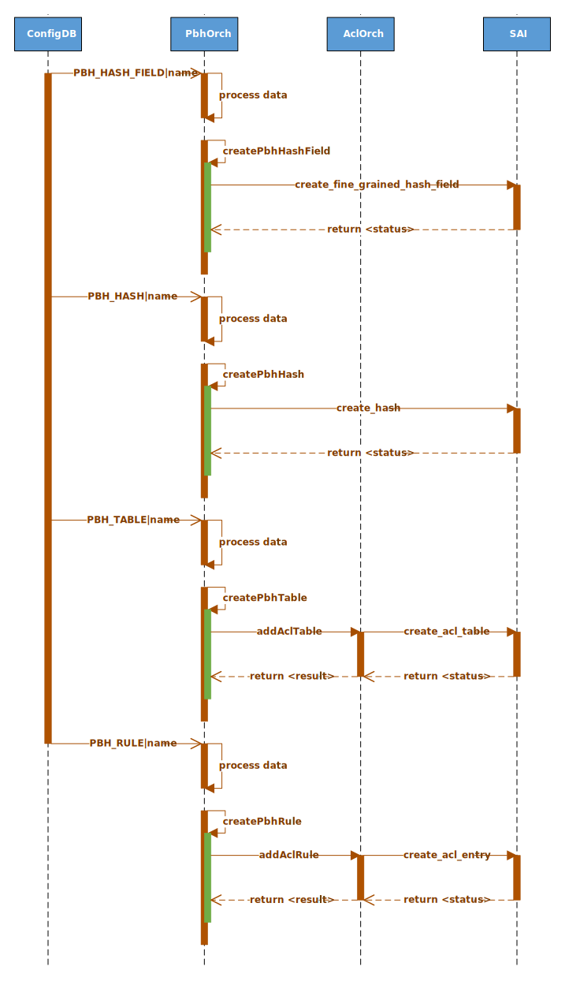

# SONiC Policy Based Hashing

## High Level Design document

## Table of contents

- [About this manual](#about-this-manual)
- [Revision](#revision)
- [Abbreviations](#abbreviations)
- [1 Introduction](#1-introduction)
    - [1.1 Feature overview](#11-feature-overview)
    - [1.2 Requirements](#12-requirements)
        - [1.2.1 Functionality](#121-functionality)
        - [1.2.2 Command interface](#122-command-interface)
        - [1.2.3 Error handling](#123-error-handling)
        - [1.2.4 Event logging](#124-event-logging)
- [2 Design](#2-design)
    - [2.1 Overview](#21-overview)
    - [2.2 SAI API](#22-sai-api)
    - [2.3 Orchestration agent](#23-orchestration-agent)
        - [2.3.1 Overview](#231-overview)
        - [2.3.2 PBH orch](#232-pbh-orch)
        - [2.3.3 ACL orch](#233-acl-orch)
    - [2.4 DB schema](#24-db-schema)
        - [2.4.1 Config DB](#241-config-db)
            - [2.4.1.1 PBH table](#2411-pbh-table)
            - [2.4.1.2 PBH rule](#2412-pbh-rule)
            - [2.4.1.3 PBH hash](#2413-pbh-hash)
        - [2.4.2 Configuration sample](#242-configuration-sample)
    - [2.5 Flows](#25-flows)
        - [2.5.1 PBH add](#251-pbh-add)
        - [2.5.2 PBH remove](#252-pbh-remove)
    - [2.6 CLI](#26-cli)
        - [2.6.1 Command structure](#261-command-structure)
        - [2.6.2 Usage examples](#262-usage-examples)
            - [2.6.2.1 Config command group](#2621-config-command-group)
            - [2.6.2.2 Show command group](#2622-show-command-group)
    - [2.7 DPB YANG model](#27-dpb-yang-model)
    - [2.8 Warm/Fast boot](#28-warm_fast-boot)
- [3 Test plan](#3-test-plan)
    - [3.1 Unit tests](#31-unit-tests)
    - [3.2 Data plane tests](#32-data-plane-tests)

## About this manual

This document provides general information about PBH implementation in SONiC

## Revision

| Rev | Date       | Author         | Description     |
|:---:|:----------:|:--------------:|:----------------|
| 0.1 | 15/03/2021 | Nazarii Hnydyn | Initial version |

## Abbreviations

| Term   | Meaning                                                    |
|:-------|:-----------------------------------------------------------|
| SONiC  | Software for Open Networking in the Cloud                  |
| PBH    | Policy Based Hashing                                       |
| ACL    | Access Control List                                        |
| SAI    | Switch Abstraction Interface                               |
| FG     | Fine-Grained                                               |
| API    | Application Programming Interface                          |
| CRC    | Cyclic Redundancy Check                                    |
| ID     | Identifier                                                 |
| ECMP   | Equal-Cost Multi-Path                                      |
| LAG    | Link Aggregation Group                                     |
| NVGRE  | Network Virtualization Using Generic Routing Encapsulation |
| VxLAN  | Virtual eXtensible Local Area Network                      |
| GRE    | Generic Routing Encapsulation                              |
| OA     | Orchestration agent                                        |
| DB     | Database                                                   |
| CLI    | Сommand-line Interface                                     |
| DPB    | Dynamic Port Breakout                                      |
| YANG   | Yet Another Next Generation                                |

## List of figures

[Figure 1: PBH design](#figure-1-pbh-design)  
[Figure 2: PBH OA design](#figure-2-pbh-oa-design)  
[Figure 3: PBH add flow](#figure-3-pbh-add-flow)  
[Figure 4: PBH remove flow](#figure-4-pbh-remove-flow)

## List of tables

[Table 1: Event logging](#table-1-event-logging)

# 1 Introduction

## 1.1 Feature overview

PBH is a feature which allows user to configure a custom hashing for different packet types.  
Under the hood is uses ACL rules to match the specific types of frames and calculates hash  
based on user-defined rules.

For flexible hash calculation a new SAI FG Hash API is used.  
It allows user not only to configure which fields should be used,  
but also to specify a mask for IPv4/IPv6 addresses and sequence ID.  
The last one defines in which order the fields are hashed,  
and which of them should be associative for CRC with the same sequence ID.

PBH supports hash configuration for ECMP and LAG.  
Both Regular ECMP and FG ECMP are eligible.

## 1.2 Requirements

### 1.2.1 Functionality

**This feature will support the following functionality:**
1. NVGRE and VxLAN packets match with inner/outer IPv4/IPv6 frames
2. Custom hashing based on inner 5-tuple: IP proto, L4 dst/src port, IPv4/IPv6 dst/src
3. Hash configuration for Regular/FG ECMP and LAG
4. Warm/Fast reboot

### 1.2.2 Command interface

**This feature will support the following commands:**
1. config: add/remove PBH table/rule/hash configuration
2. show: display PBH table/rule/hash configuration

### 1.2.3 Error handling

**This feature will provide error handling for the next situations:**
1. Invalid object reference
2. Incompatible options/parameters

### 1.2.4 Event logging

**This feature will provide event logging for the next situations:**
1. PBH table/rule/hash add/remove

###### Table 1: Event logging

| Event                                   | Severity |
|:----------------------------------------|:---------|
| PBH table/rule/hash add/remove: success | NOTICE   |
| PBH table/rule/hash add/remove: error   | ERROR    |

# 2 Design

## 2.1 Overview


###### Figure 1: PBH design

PBH uses ACL engine to match NVGRE/VxLAN packets and calculates hash based on user-defined rules.  
Hashing is configured based on inner 5-tuple: IP proto, L4 dst/src port, IPv4/IPv6 dst/src.  
A custom hashing can be configured for Regular/FG ECMP and LAG.

## 2.2 SAI API

**SAI attributes which shall be used for PBH:**

| API  | Function                       | Attribute                                          | Comment                    |
|:-----|:-------------------------------|:---------------------------------------------------|:---------------------------|
| ACL  | create_acl_table               | SAI_ACL_TABLE_ATTR_FIELD_GRE_KEY                   |                            |
|      |                                | SAI_ACL_TABLE_ATTR_FIELD_IP_PROTOCOL               |                            |
|      |                                | SAI_ACL_TABLE_ATTR_FIELD_IPV6_NEXT_HEADER          |                            |
|      |                                | SAI_ACL_TABLE_ATTR_FIELD_L4_DST_PORT               |                            |
|      |                                | SAI_ACL_TABLE_ATTR_FIELD_INNER_ETHER_TYPE          |                            |
|      | create_acl_entry               | SAI_ACL_ENTRY_ATTR_PRIORITY                        | PBH_RULE\|priority         |
|      |                                | SAI_ACL_ENTRY_ATTR_FIELD_GRE_KEY                   | PBH_RULE\|gre_key          |
|      |                                | SAI_ACL_ENTRY_ATTR_FIELD_IP_PROTOCOL               | PBH_RULE\|ip_protocol      |
|      |                                | SAI_ACL_ENTRY_ATTR_FIELD_IPV6_NEXT_HEADER          | PBH_RULE\|ipv6_next_header |
|      |                                | SAI_ACL_ENTRY_ATTR_FIELD_L4_DST_PORT               | PBH_RULE\|l4_dst_port      |
|      |                                | SAI_ACL_ENTRY_ATTR_FIELD_INNER_ETHER_TYPE          | PBH_RULE\|inner_ether_type |
|      |                                | SAI_ACL_ENTRY_ATTR_ACTION_SET_LAG_HASH_ID          | PBH_RULE\|packet_action    |
|      |                                | SAI_ACL_ENTRY_ATTR_ACTION_SET_ECMP_HASH_ID         | PBH_RULE\|packet_action    |
| HASH | create_hash                    | SAI_HASH_ATTR_FINE_GRAINED_HASH_FIELD_LIST         |                            |
|      | create_fine_grained_hash_field | SAI_FINE_GRAINED_HASH_FIELD_ATTR_NATIVE_HASH_FIELD | PBH_HASH\|hash_field       |
|      |                                | SAI_FINE_GRAINED_HASH_FIELD_ATTR_IPV4_MASK         | PBH_HASH\|ipv4_mask        |
|      |                                | SAI_FINE_GRAINED_HASH_FIELD_ATTR_IPV6_MASK         | PBH_HASH\|ipv6_mask        |
|      |                                | SAI_FINE_GRAINED_HASH_FIELD_ATTR_SEQUENCE_ID       | PBH_HASH\|sequence_id      |

## 2.3 Orchestration agent

### 2.3.1 Overview


###### Figure 2: PBH OA design

OA needs to be updated to support PBH in Config DB and SAI FG Hash API.  
There will be class `PbhOrch` and a set of data structures implemented to handle PBH feature.  
OA will process table/rule/hash updates based on Config DB changes.  
Some object updates will be handled and some will be considered as invalid.

### 2.3.2 PBH orch

Class `PbhOrch` will hold a set of methods matching generic `Orch` class pattern to handle Config DB updates.  
For that purpose a producer-consumer mechanism (implemented in `sonic-swss-common`) will be used.  
Method `PbhOrch::doTask()` will be called on PBH table/rule/hash update. It will distribute handling of DB updates  
between other handlers based on the table key which was updated (Redis Keyspace Notifications).

This class will be responsible for:
1. Processing updates of the PBH table/rule/hash (add/remove)
2. Partial input PBH data validation (including cross-table validation)
3. Replicating PBH data from the Config DB to the SAI DB via SAI Redis
4. Caching of the PBH objects in order to detect objects update and perform state dump

PBH table objects are stored under `PBH_TABLE:*` keys in Config DB. On `PBH_TABLE` update,  
method `PbhOrch::doPbhTableTask()` will be called to process the change.  
On table create, `PbhOrch` will verify if the table already exists. Creating the table which is already  
exists will be treated as an error. Regular table add/remove will update the internal class structures  
and appropriate SAI objects will be created/deleted.

PBH rule objects are stored under `PBH_RULE:*` keys in Config DB. On `PBH_RULE` update,  
method `PbhOrch::doPbhRuleTask()` will be called to process the change.  
On rule create, `PbhOrch` will verify if the rule already exists. Creating the rule which is already  
exists will be treated as an error. Regular rule add/remove will update the internal class structures  
and appropriate SAI objects will be created/deleted.

PBH hash objects are stored under `PBH_HASH:*` keys in Config DB. On `PBH_HASH` update,  
method `PbhOrch::doPbhHashTask()` will be called to process the change.  
On hash create, `PbhOrch` will verify if the hash already exists. Creating the hash which is already  
exists will be treated as an error. Regular hash add/remove will update the internal class structures  
and appropriate SAI objects will be created or deleted.

**Skeleton code:**
```cpp
class PbhOrch : public Orch
{
public:
    PbhOrch(
        vector<TableConnector> &connectorList,
        SwitchOrch *switchOrch,
        PortsOrch *portOrch
    );
    ~PbhOrch();

    using Orch::doTask;  // Allow access to the basic doTask

private:
    void doPbhTableTask(Consumer &consumer);
    void doPbhRuleTask(Consumer &consumer);
    void doPbhHashTask(Consumer &consumer);
    void doTask(Consumer &consumer);

    SwitchOrch *m_switchOrch;
    PortsOrch *m_portOrch;
};
```

### 2.3.3 ACL orch

This orchestrator provides API for ACL table/rule configuration.  
It is already exists in SONiC.

ACL orchestrator will be extended to support PBH table/rule concept.  
PBH table will use a dedicated set of keys to allow match of NVGRE and VxLAN packets.

**Skeleton code:**
```cpp
bool AclTable::create()
{
    ...

    if (type == ACL_TABLE_PBH)
    {
        attr.id = SAI_ACL_TABLE_ATTR_FIELD_GRE_KEY;
        attr.value.booldata = true;
        table_attrs.push_back(attr);

        attr.id = SAI_ACL_TABLE_ATTR_FIELD_IP_PROTOCOL;
        attr.value.booldata = true;
        table_attrs.push_back(attr);

        attr.id = SAI_ACL_TABLE_ATTR_FIELD_L4_DST_PORT;
        attr.value.booldata = true;
        table_attrs.push_back(attr);

        attr.id = SAI_ACL_TABLE_ATTR_FIELD_INNER_ETHER_TYPE;
        attr.value.booldata = true;
        table_attrs.push_back(attr);

        attr.id = SAI_ACL_TABLE_ATTR_ACL_STAGE;
        attr.value.s32 = SAI_ACL_STAGE_INGRESS;
        table_attrs.push_back(attr);

        sai_status_t status = sai_acl_api->create_acl_table(&m_oid, gSwitchId, (uint32_t)table_attrs.size(), table_attrs.data());

        if (status == SAI_STATUS_SUCCESS)
        {
            gCrmOrch->incCrmAclUsedCounter(CrmResourceType::CRM_ACL_TABLE, acl_stage, SAI_ACL_BIND_POINT_TYPE_PORT);
            gCrmOrch->incCrmAclUsedCounter(CrmResourceType::CRM_ACL_TABLE, acl_stage, SAI_ACL_BIND_POINT_TYPE_LAG);
        }

        return status == SAI_STATUS_SUCCESS;
    }

    ...
}

class AclRulePbh: public AclRule
{
public:
    AclRulePbh(AclOrch *m_pAclOrch, string rule, string table, acl_table_type_t type, bool createCounter = false);

    bool validateAddAction(string attr_name, string attr_value);
    bool validateAddMatch(string attr_name, string attr_value);
    bool validate();
    void update(SubjectType, void *);
};
```

## 2.4 DB schema

### 2.4.1 Config DB

#### 2.4.1.1 PBH table
```abnf
; defines schema for PBH table configuration attributes
key = PBH_TABLE|table_name ; table name. Must be unique

; field     = value
port_list   = port-list ; ports to which this table is applied. Can be empty
lag_list    = lag-list  ; portchannels to which this table is applied. Can be empty
description = *255VCHAR ; table description. Can be empty

; value annotations
port-name = 1*64VCHAR                         ; name of the port
port-list = port-name [ 1*( "," port-name ) ] ; list of the ports. Valid values range is platform dependent
lag-name  = "PortChannel" 1*4DIGIT            ; name of the portchannel
lag-list  = lag-name [ 1*( "," lag-name ) ]   ; list of the portchannels. Valid values range is platform dependent
```

**Note:** at least one member of _port_list_ or _lag_list_ is required

#### 2.4.1.2 PBH rule
```abnf
; defines schema for PBH rule configuration attributes
key = PBH_RULE|table_name|rule_name ; rule name. Must be unique across the table

; field           = value
priority         = 1*5DIGIT      ; rule priority. Valid values range is platform dependent
gre_key          = h32 "/" h32   ; GRE key (32 bits)
ip_protocol      = h8 "/" h8     ; IP protocol (8 bits)
ipv6_next_header = h8 "/" h8     ; IPv6 Next Header (8 bits)
l4_dst_port      = h16 "/" h16   ; L4 destination port (16 bits)
inner_ether_type = h16 "/" h16   ; Inner EtherType (16 bits)
hash_list        = hash-list     ; Hash list (PBH_HASH|hash_name)
packet_action    = packet-action ; Packet action
counter          = flow-counter  ; Packet/Byte counter

; value annotations
h8            = 1*2HEXDIG
h16           = 1*4HEXDIG
h32           = 1*8HEXDIG
hash-name     = 1*64VCHAR
hash-list     = hash-name [ 1*( "," hash-name ) ]
packet-action = "SET_ECMP_HASH" / "SET_LAG_HASH"
flow-counter  = "enabled" / "disabled"
```

**Note:** at least one match field (_gre_key_/_ip_protocol_/_l4_dst_port_/_inner_ether_type_) is required

#### 2.4.1.3 PBH hash
```abnf
; defines schema for PBH hash configuration attributes
key = PBH_HASH|hash_name ; hash name. Must be unique

; field     = value
hash_field  = hash-field  ; Hash native field
ipv4_mask   = ipv4-prefix ; Mask for a IPv4 address.
                          ; Valid only when hash_field is one of:
                          ; INNER_SRC_IPV4, INNER_DST_IPV4
ipv6_mask   = ipv6-prefix ; Mask for a IPv6 address.
                          ; Valid only when hash_field is one of:
                          ; INNER_SRC_IPV6, INNER_DST_IPV6
sequence_id = 1*5DIGIT    ; Specifies in which order the fields are hashed,
                          ; and defines which fields should be associative
                          ; for CRC with the same sequence ID

; value annotations
hash-field  = "INNER_IP_PROTOCOL"
              / "INNER_L4_DST_PORT"
              / "INNER_L4_SRC_PORT"
              / "INNER_DST_IPV4"
              / "INNER_SRC_IPV4"
              / "INNER_DST_IPV6"
              / "INNER_SRC_IPV6"
h16         = 1*4HEXDIG
ls32        = h16 ":" h16
dec-octet   = DIGIT                  ; 0-9
              / %x31-39 DIGIT        ; 10-99
              / %x31 2DIGIT          ; 100-199
              / %x32 %x30-35 %x30-35 ; 200-255
ipv4-prefix = dec-octet "." dec-octet "."
              dec-octet "." dec-octet
ipv6-prefix = 6( h16 ":" ) ls32
              /                       "::" 5( h16 ":" ) ls32
              / [               h16 ] "::" 4( h16 ":" ) ls32
              / [ *1( h16 ":" ) h16 ] "::" 3( h16 ":" ) ls32
              / [ *2( h16 ":" ) h16 ] "::" 2( h16 ":" ) ls32
              / [ *3( h16 ":" ) h16 ] "::"    h16 ":"   ls32
              / [ *4( h16 ":" ) h16 ] "::"              ls32
              / [ *5( h16 ":" ) h16 ] "::"              h16
              / [ *6( h16 ":" ) h16 ] "::"
```

**Note:** field _ipv4_mask_/_ipv6_mask_ is only valid when _hash_field_ equals _INNER_DST/SRC_IPV4/IPV6_

### 2.4.2 Configuration sample

**Inner 5-tuple hashing:**
```json
{
    "PBH_HASH": {
        "inner_ip_proto": {
            "hash_field": "INNER_IP_PROTOCOL",
            "sequence_id": "1"
        },
        "inner_l4_dst_port": {
            "hash_field": "INNER_L4_DST_PORT",
            "sequence_id": "2"
        },
        "inner_l4_src_port": {
            "hash_field": "INNER_L4_SRC_PORT",
            "sequence_id": "2"
        },
        "inner_dst_ipv4": {
            "hash_field": "INNER_DST_IPV4",
            "ipv4_mask": "255.0.0.0",
            "sequence_id": "3"
        },
        "inner_src_ipv4": {
            "hash_field": "INNER_SRC_IPV4",
            "ipv4_mask": "0.0.0.255",
            "sequence_id": "3"
        },
        "inner_dst_ipv6": {
            "hash_field": "INNER_DST_IPV6",
            "ipv6_mask": "FFFF::",
            "sequence_id": "4"
        },
        "inner_src_ipv6": {
            "hash_field": "INNER_SRC_IPV6",
            "ipv6_mask": "::FFFF",
            "sequence_id": "4"
        }
    },
    "PBH_RULE": {
        "pbh_table|nvgre": {
            "priority": "1",
            "gre_key": "0x2500/0xffffff00",
            "inner_ether_type": "0x86dd/0xffff",
            "hash_list": [
                "inner_ip_proto",
                "inner_l4_dst_port",
                "inner_l4_src_port",
                "inner_dst_ipv6",
                "inner_src_ipv6"
            ],
            "packet_action": "SET_ECMP_HASH"
        },
        "pbh_table|vxlan": {
            "priority": "2",
            "ip_protocol": "0x11/0xff",
            "l4_dst_port": "0x12b5/0xffff",
            "inner_ether_type": "0x0800/0xffff",
            "hash_list": [
                "inner_ip_proto",
                "inner_l4_dst_port",
                "inner_l4_src_port",
                "inner_dst_ipv4",
                "inner_src_ipv4"
            ],
            "packet_action": "SET_LAG_HASH"
        }
    },
    "PBH_TABLE": {
        "pbh_table": {
            "port_list": [
                "Ethernet0",
                "Ethernet4"
            ],
            "lag_list": [
                "PortChannel0001",
                "PortChannel0002"
            ],
            "description": "NVGRE and VxLAN"
        }
    }
}
```

## 2.5 Flows

### 2.5.1 PBH add



###### Figure 3: PBH add flow

### 2.5.2 PBH remove


###### Figure 4: PBH remove flow

## 2.6 CLI

### 2.6.1 Command structure

**User interface**:
```
config
|--- pbh
     |--- table
     |    |--- add <table_name> OPTIONS
     |    |--- remove <table_name>
     |
     |--- rule
     |    |--- add <rule_name> <table_name> OPTIONS
     |    |--- update <rule_name> <table_name> OPTIONS
     |    |--- remove <rule_name> <table_name>
     |
     |--- hash
          |--- add <hash_name> OPTIONS
          |--- remove <hash_name>

show
|--- pbh
     |--- table
     |--- rule
     |--- hash
     |--- statistics
```

**Options:**

_config pbh table add_
1. -p|--port_list - port list
2. -l|--lag_list - portchannel list
3. -d|--description - table description

_config pbh rule add_
1. -p|--priority - rule priority
2. -m|--match - match field
3. -h|--hash_list - hash field list
4. -a|--action=<set_ecmp_hash|set_lag_hash> - packet action
5. -c|--counter=<true|false> - packet/byte counter

_config pbh rule update_
1. -c|--counter=<enabled|disabled> - packet/byte counter

_config pbh hash add_
1. -f|--field - hash field
3. -m|--mask - ip mask
2. -s|--sequence - sequence id

### 2.6.2 Usage examples

#### 2.6.2.1 Config command group

**The following command adds/removes table:**
```bash
config pbh table add 'pbh_table' --port_list 'Ethernet0,Ethernet4' --lag_list 'PortChannel0001,PortChannel0002' \
--description 'NVGRE and VxLAN'
config pbh table remove 'pbh_table'
```

**The following command adds/updates/removes rule:**
```bash
config pbh rule add 'vxlan' 'pbh_table' --priority 1 \
--match gre_key 0x2500/0xffffff00 --match inner_ether_type 0x86dd/0xffff \
--hash_list 'inner_ip_proto,inner_l4_dst_port,inner_l4_src_port,inner_dst_ipv6,inner_src_ipv6' \
--action set_ecmp_hash --counter
config pbh rule update 'vxlan' 'pbh_table' --counter disabled
config pbh rule remove 'vxlan' 'pbh_table'
```

**The following command adds/removes hash:**
```bash
config pbh hash add 'inner_dst_ipv6' --field 'INNER_DST_IPV6' --mask 'FFFF::' --sequence 4
config pbh hash remove 'inner_dst_ipv6'
```

#### 2.6.2.2 Show command group

**The following command shows table configuration:**
```bash
root@sonic:/home/admin# show pbh table
Name       Interface        Description
---------  ---------------  ---------------
pbh_table  Ethernet0        NVGRE and VxLAN
           Ethernet4
           PortChannel0001
           PortChannel0002
```

**The following command shows rule configuration:**
```bash
root@sonic:/home/admin# show pbh rule
Table      Rule    Priority    Match                            Hash               Action
---------  ------  ----------  -------------------------------  -----------------  -------------
pbh_table  nvgre   1           GRE_KEY: 0x11/0xff               inner_ip_proto     SET_ECMP_HASH
                               INNER_ETHER_TYPE: 0x0800/0xffff  inner_l4_dst_port
                                                                inner_l4_src_port
                                                                inner_dst_ipv6
                                                                inner_src_ipv6
           vxlan   2           IP_PROTOCOL: 0x11/0xff           inner_ip_proto     SET_LAG_HASH
                               L4_DST_PORT: 0x12b5/0xffff       inner_l4_dst_port
                               INNER_ETHER_TYPE: 0x0800/0xffff  inner_l4_src_port
                                                                inner_dst_ipv4
                                                                inner_src_ipv4
```

**The following command shows hash configuration:**
```bash
root@sonic:/home/admin# show pbh hash
Name               Field              Mask       Sequence    Symmetric
-----------------  -----------------  ---------  ----------  -----------
inner_ip_proto     INNER_IP_PROTOCOL             1           No
inner_l4_dst_port  INNER_L4_DST_PORT             2           Yes
inner_l4_src_port  INNER_L4_SRC_PORT             2           Yes
inner_dst_ipv4     INNER_DST_IPV4     255.0.0.0  3           Yes
inner_src_ipv4     INNER_SRC_IPV4     0.0.0.255  3           Yes
inner_dst_ipv6     INNER_DST_IPV6     FFFF::     4           Yes
inner_src_ipv6     INNER_SRC_IPV6     ::FFFF     4           Yes
```

**The following command shows statistics:**
```bash
root@sonic:/home/admin# show pbh statistics
Table      Rule    Packets Count    Bytes Count
---------  ------  ---------------  -------------
pbh_table  nvgre   0                0
           vxlan   0                0
```

## 2.7 DPB YANG model

A new YANG model `sonic-pbh.yang` will be added to `sonic-buildimage/src/sonic-yang-models/yang-models`  
in order to provide support for DPB and management framework.

**Skeleton code:**
```yang
module sonic-pbh {

    yang-version 1.1;

    namespace "http://github.com/Azure/sonic-pbh";
    prefix pbh;

    import ietf-inet-types {
        prefix inet;
    }

    import sonic-types {
        prefix stypes;
        revision-date 2019-07-01;
    }

    import sonic-extension {
        prefix ext;
        revision-date 2019-07-01;
    }

    import sonic-port {
        prefix port;
        revision-date 2019-07-01;
    }

    import sonic-portchannel {
        prefix lag;
        revision-date 2019-07-01;
    }

    description "PBH YANG Module for SONiC OS";

    revision 2021-03-15 {
        description "First Revision";
    }

    container sonic-pbh {

        container PBH_HASH {

            description "PBH_HASH part of config_db.json";

            key "PBH_HASH_NAME";

            ...

        }
        /* end of container PBH_HASH */

        container PBH_RULE {

            description "PBH_RULE part of config_db.json";

            list PBH_RULE_LIST {

                key "PBH_TABLE_NAME PBH_RULE_NAME";

                leaf PBH_TABLE_NAME {
                    type leafref {
                        path "/pbh:sonic-pbh/pbh:PBH_TABLE/pbh:PBH_TABLE_LIST/pbh:PBH_TABLE_NAME";
                    }
                    description "PBH table reference"
                }

                leaf PBH_RULE_NAME {
                    type string {
                        length 1..255;
                    }
                    description "PBH rule"
                }

                ...

            }
            /* end of PBH_RULE_LIST */
        }
        /* end of container PBH_RULE */

        container PBH_TABLE {

            description "PBH_TABLE part of config_db.json";

            list PBH_TABLE_LIST {

                key "PBH_TABLE_NAME";

                leaf PBH_TABLE_NAME {
                    type string;
                    description "PBH table"
                }

                ...

            }
            /* end of PBH_TABLE_LIST */
        }
        /* end of container PBH_TABLE */
    }
    /* end of container sonic-pbh */
}
/* end of module sonic-pbh */
```

## 2.8 Warm/Fast boot

No special handling is required

# 3 Test plan

## 3.1 Unit tests

TBD

## 3.2 Data plane tests

PBH will reuse and extend the existing test plan:  
[Inner packet hashing test plan #759](https://github.com/Azure/SONiC/pull/759)
