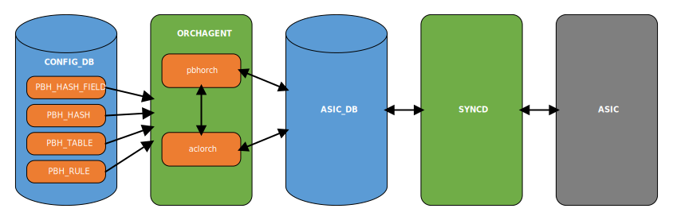
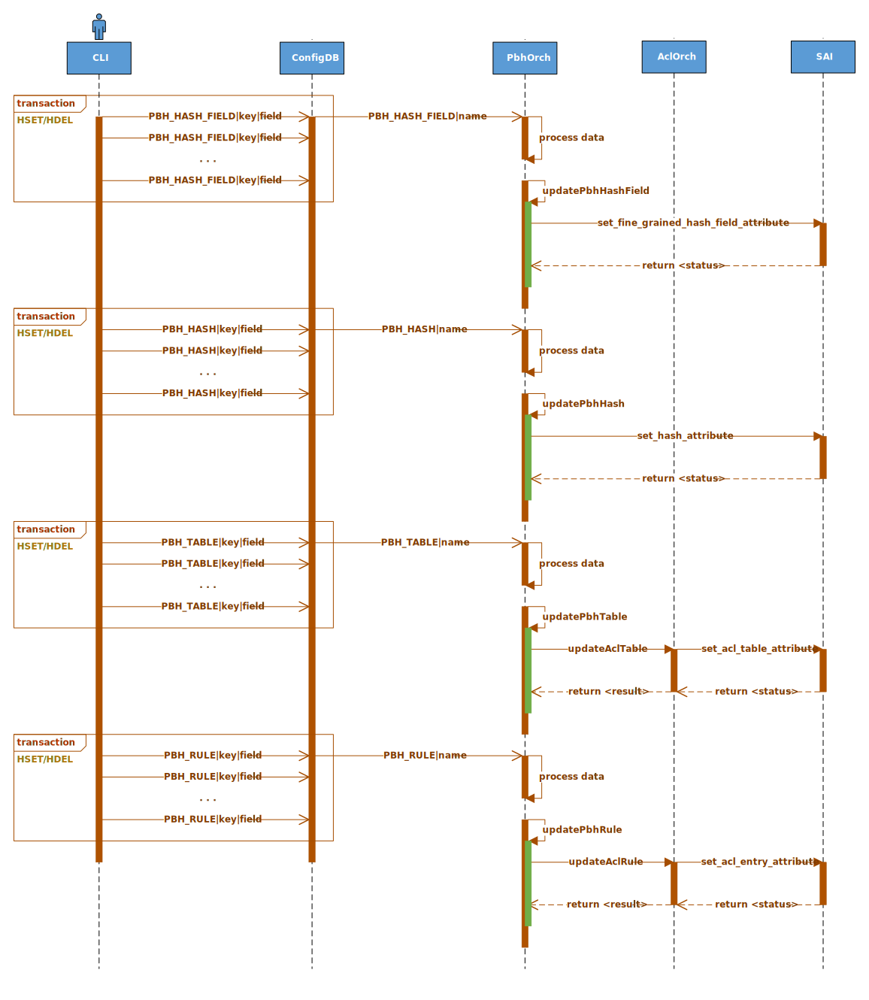

# SONiC Policy Based Hashing

## High Level Design document

## Table of contents

- [Revision](#revision)
- [About this manual](#about-this-manual)
- [Scope](#scope)
- [Abbreviations](#abbreviations)
- [1 Introduction](#1-introduction)
    - [1.1 Feature overview](#11-feature-overview)
    - [1.2 Requirements](#12-requirements)
        - [1.2.1 Functionality](#121-functionality)
        - [1.2.2 Command interface](#122-command-interface)
        - [1.2.3 Error handling](#123-error-handling)
        - [1.2.4 Event logging](#124-event-logging)
- [2 Design](#2-design)
    - [2.1 Overview](#21-overview)
    - [2.2 SAI API](#22-sai-api)
    - [2.3 Orchestration agent](#23-orchestration-agent)
        - [2.3.1 Overview](#231-overview)
        - [2.3.2 PBH orch](#232-pbh-orch)
        - [2.3.3 ACL orch](#233-acl-orch)
    - [2.4 DB schema](#24-db-schema)
        - [2.4.1 Config DB](#241-config-db)
            - [2.4.1.1 PBH table](#2411-pbh-table)
            - [2.4.1.2 PBH rule](#2412-pbh-rule)
            - [2.4.1.3 PBH hash](#2413-pbh-hash)
            - [2.4.1.4 PBH hash field](#2414-pbh-hash-field)
        - [2.4.2 State DB](#242-state-db)
            - [2.4.2.1 PBH table](#2421-pbh-table)
            - [2.4.2.2 PBH rule](#2422-pbh-rule)
            - [2.4.2.3 PBH hash](#2423-pbh-hash)
            - [2.4.2.4 PBH hash field](#2424-pbh-hash-field)
        - [2.4.3 Data sample](#243-data-sample)
        - [2.4.4 Configuration sample](#244-configuration-sample)
    - [2.5 Flows](#25-flows)
        - [2.5.1 Key modification](#251-key-modification)
            - [2.5.1.1 PBH add](#2511-pbh-add)
            - [2.5.1.2 PBH remove](#2512-pbh-remove)
        - [2.5.2 Field modification](#252-field-modification)
            - [2.5.2.1 PBH update](#2521-pbh-update)
    - [2.6 CLI](#26-cli)
        - [2.6.1 Command structure](#261-command-structure)
        - [2.6.2 Usage examples](#262-usage-examples)
            - [2.6.2.1 Config command group](#2621-config-command-group)
            - [2.6.2.2 Show command group](#2622-show-command-group)
    - [2.7 YANG model](#27-yang-model)
    - [2.8 Warm/Fast boot](#28-warmfast-boot)
- [3 Test plan](#3-test-plan)
    - [3.1 Unit tests via VS](#31-unit-tests-via-vs)
    - [3.2 Data plane tests via PTF](#32-data-plane-tests-via-ptf)

## Revision

| Rev | Date       | Author         | Description                                     |
|:---:|:----------:|:--------------:|:------------------------------------------------|
| 0.1 | 15/03/2021 | Nazarii Hnydyn | Initial version                                 |
| 0.2 | 07/06/2021 | Nazarii Hnydyn | Update DB schema: introduce PBH hash field      |
| 0.3 | 15/11/2021 | Nazarii Hnydyn | PBH modification flows: introduce field set/del |

## About this manual

This document provides general information about PBH implementation in SONiC

## Scope

This document describes the high level design of PBH feature in SONiC

**In scope:**  
1. PBH for NVGRE/VxLAN packets based on inner 5-tuple (IP proto, L4 dst/src port, IPv4/IPv6 dst/src)

**Out of scope:**  
1. CRM support for PBH FG hash resources

## Abbreviations

| Term   | Meaning                                                    |
|:-------|:-----------------------------------------------------------|
| SONiC  | Software for Open Networking in the Cloud                  |
| PBH    | Policy Based Hashing                                       |
| CRM    | Critical Resource Monitoring                               |
| ACL    | Access Control List                                        |
| SAI    | Switch Abstraction Interface                               |
| FG     | Fine-Grained                                               |
| API    | Application Programming Interface                          |
| CRC    | Cyclic Redundancy Check                                    |
| ID     | Identifier                                                 |
| ECMP   | Equal-Cost Multi-Path                                      |
| LAG    | Link Aggregation Group                                     |
| NVGRE  | Network Virtualization Using Generic Routing Encapsulation |
| VxLAN  | Virtual eXtensible Local Area Network                      |
| GRE    | Generic Routing Encapsulation                              |
| OA     | Orchestration agent                                        |
| DB     | Database                                                   |
| CLI    | Сommand-line Interface                                     |
| DPB    | Dynamic Port Breakout                                      |
| YANG   | Yet Another Next Generation                                |
| VS     | Virtual Switch                                             |
| PTF    | Packet Test Framework                                      |

## List of figures

[Figure 1: PBH design](#figure-1-pbh-design)  
[Figure 2: PBH OA design](#figure-2-pbh-oa-design)  
[Figure 3: PBH add flow](#figure-3-pbh-add-flow)  
[Figure 4: PBH remove flow](#figure-4-pbh-remove-flow)  
[Figure 5: PBH update flow](#figure-5-pbh-update-flow)

## List of tables

[Table 1: Event logging](#table-1-event-logging)

# 1 Introduction

## 1.1 Feature overview

PBH is a feature which allows user to configure a custom hashing for different packet types.  
Under the hood it uses ACL rules to match the specific types of frames and calculates hash  
based on user-defined rules.

For flexible hash calculation a new SAI FG Hash API is used.  
It allows user not only to configure which fields should be used,  
but also to specify a mask for IPv4/IPv6 addresses and sequence ID.  
The last one defines in which order the fields are hashed,  
and which of them should be associative for CRC with the same sequence ID.

PBH supports hash configuration for ECMP and LAG.  
Both Regular ECMP and FG ECMP are eligible.

## 1.2 Requirements

### 1.2.1 Functionality

**This feature will support the following functionality:**
1. NVGRE and VxLAN packets match with inner/outer IPv4/IPv6 frames
2. Custom hashing based on inner 5-tuple: IP proto, L4 dst/src port, IPv4/IPv6 dst/src
3. Hash configuration for Regular/FG ECMP and LAG
4. Warm/Fast reboot

### 1.2.2 Command interface

**This feature will support the following commands:**
1. config: add/update/delete PBH table/rule/hash/hash-field configuration
2. show: display PBH table/rule/hash/hash-field configuration and statistics

### 1.2.3 Error handling

**This feature will provide error handling for the next situations:**
1. Invalid object reference
2. Incompatible options/parameters

### 1.2.4 Event logging

**This feature will provide event logging for the next situations:**
1. PBH table/rule/hash/hash-field add/update/delete

###### Table 1: Event logging

| Event                                                     | Severity |
|:----------------------------------------------------------|:---------|
| PBH table/rule/hash/hash-field add/update/delete: success | NOTICE   |
| PBH table/rule/hash/hash-field add/update/delete: error   | ERROR    |

# 2 Design

## 2.1 Overview


###### Figure 1: PBH design

PBH uses ACL engine to match NVGRE/VxLAN packets and calculates hash based on user-defined rules.  
Hashing is configured based on inner 5-tuple: IP proto, L4 dst/src port, IPv4/IPv6 dst/src.  
A custom hashing can be configured for Regular/FG ECMP and LAG.

## 2.2 SAI API

**SAI attributes which shall be used for PBH:**

| API  | Function                       | Attribute                                          | Comment                     |
|:-----|:-------------------------------|:---------------------------------------------------|:----------------------------|
| ACL  | create_acl_table               | SAI_ACL_TABLE_ATTR_FIELD_GRE_KEY                   |                             |
|      |                                | SAI_ACL_TABLE_ATTR_FIELD_ETHER_TYPE                |                             |
|      |                                | SAI_ACL_TABLE_ATTR_FIELD_IP_PROTOCOL               |                             |
|      |                                | SAI_ACL_TABLE_ATTR_FIELD_IPV6_NEXT_HEADER          |                             |
|      |                                | SAI_ACL_TABLE_ATTR_FIELD_L4_DST_PORT               |                             |
|      |                                | SAI_ACL_TABLE_ATTR_FIELD_INNER_ETHER_TYPE          |                             |
|      | create_acl_entry               | SAI_ACL_ENTRY_ATTR_PRIORITY                        | PBH_RULE\|priority          |
|      |                                | SAI_ACL_ENTRY_ATTR_FIELD_GRE_KEY                   | PBH_RULE\|gre_key           |
|      |                                | SAI_ACL_ENTRY_ATTR_FIELD_ETHER_TYPE                | PBH_RULE\|ether_type        |
|      |                                | SAI_ACL_ENTRY_ATTR_FIELD_IP_PROTOCOL               | PBH_RULE\|ip_protocol       |
|      |                                | SAI_ACL_ENTRY_ATTR_FIELD_IPV6_NEXT_HEADER          | PBH_RULE\|ipv6_next_header  |
|      |                                | SAI_ACL_ENTRY_ATTR_FIELD_L4_DST_PORT               | PBH_RULE\|l4_dst_port       |
|      |                                | SAI_ACL_ENTRY_ATTR_FIELD_INNER_ETHER_TYPE          | PBH_RULE\|inner_ether_type  |
|      |                                | SAI_ACL_ENTRY_ATTR_ACTION_SET_LAG_HASH_ID          | PBH_RULE\|packet_action     |
|      |                                | SAI_ACL_ENTRY_ATTR_ACTION_SET_ECMP_HASH_ID         | PBH_RULE\|packet_action     |
|      |                                | SAI_ACL_ENTRY_ATTR_ACTION_COUNTER                  | PBH_RULE\|flow_counter      |
| HASH | create_hash                    | SAI_HASH_ATTR_FINE_GRAINED_HASH_FIELD_LIST         | PBH_HASH\|hash_field_list   |
|      | create_fine_grained_hash_field | SAI_FINE_GRAINED_HASH_FIELD_ATTR_NATIVE_HASH_FIELD | PBH_HASH_FIELD\|hash_field  |
|      |                                | SAI_FINE_GRAINED_HASH_FIELD_ATTR_IPV4_MASK         | PBH_HASH_FIELD\|ip_mask     |
|      |                                | SAI_FINE_GRAINED_HASH_FIELD_ATTR_IPV6_MASK         | PBH_HASH_FIELD\|ip_mask     |
|      |                                | SAI_FINE_GRAINED_HASH_FIELD_ATTR_SEQUENCE_ID       | PBH_HASH_FIELD\|sequence_id |

## 2.3 Orchestration agent

### 2.3.1 Overview



###### Figure 2: PBH OA design

A `PbhOrch` class with a set of data structures will be implemented to handle PBH feature.  
OA will be extended with a new PBH Config DB/State DB schema and SAI FG Hash API support.  
PBH table/rule/hash/hash-field updates will be processed by OA based on Config DB changes.  
Each update operation will be verified against generic/vendor specific capabilities.  
Generic/Vendor specific capabilities by default will be stored in State DB by OA.  
Some object updates will be handled and some will be considered as invalid.

### 2.3.2 PBH orch

Class `PbhOrch` will hold a set of methods matching generic `Orch` class pattern to handle Config DB updates.  
For that purpose a producer-consumer mechanism (implemented in `sonic-swss-common`) will be used.  
Method `PbhOrch::doTask()` will be called on PBH table/rule/hash/hash-field update. It will distribute handling  
of DB updates between other handlers based on the table key which was updated (Redis Keyspace Notifications).

This class will be responsible for:
1. Processing updates of the PBH table/rule/hash/hash-field (add/remove)
2. Partial input PBH data validation (including cross-table validation)
3. Replicating PBH data from the Config DB to the SAI DB via SAI Redis
4. Caching of the PBH objects in order to detect objects update and perform state dump

PBH table objects are stored under `PBH_TABLE:*` keys in Config DB. On `PBH_TABLE` update,  
method `PbhOrch::doPbhTableTask()` will be called to process the change.  
On table create, `PbhOrch` will verify if the table already exists. Creating the table which is already  
exists will be treated as an update. Regular table add/remove will update the internal class structures  
and appropriate SAI objects will be created/deleted.

PBH rule objects are stored under `PBH_RULE:*` keys in Config DB. On `PBH_RULE` update,  
method `PbhOrch::doPbhRuleTask()` will be called to process the change.  
On rule create, `PbhOrch` will verify if the rule already exists. Creating the rule which is already  
exists will be treated as an update. Regular rule add/remove will update the internal class structures  
and appropriate SAI objects will be created/deleted.

PBH hash objects are stored under `PBH_HASH:*` keys in Config DB. On `PBH_HASH` update,  
method `PbhOrch::doPbhHashTask()` will be called to process the change.  
On hash create, `PbhOrch` will verify if the hash already exists. Creating the hash which is already  
exists will be treated as an update. Regular hash add/remove will update the internal class structures  
and appropriate SAI objects will be created or deleted.

PBH hash field objects are stored under `PBH_HASH_FIELD:*` keys in Config DB. On `PBH_HASH_FIELD` update,  
method `PbhOrch::doPbhHashFieldTask()` will be called to process the change.  
On hash field create, `PbhOrch` will verify if the hash field already exists. Creating the hash field which is already  
exists will be treated as an update. Regular hash field add/remove will update the internal class structures  
and appropriate SAI objects will be created or deleted.

PBH object modification concept allows to do a fine-grained field/value tuple management.  
For that purpose a PBH capabilities table will be introduced. Each PBH key will have it's own set of  
field capabilities defined in a State DB.

PBH capabilities:
1. ADD - field can be set to the redis hash in case it does not exist yet
2. UPDATE - field can be set to the redis hash in case it already exists
3. REMOVE - field can be deleted from the redis hash in case it does exist

In general, PBH capabilities represent a mix of SAI interface/vendor restrictions.  
When special policy is not required, a generic SAI-based implementation will be used by OA.  
Platform/Vendor identification will be done via `platform` environment variable.

**Skeleton code:**
```cpp
class PbhOrch : public Orch
{
public:
    PbhOrch(
        std::vector<TableConnector> &connectorList,
        AclOrch *aclOrch,
        PortsOrch *portsOrch
    );
    ~PbhOrch();

    using Orch::doTask;  // Allow access to the basic doTask

private:
    void doPbhTableTask(Consumer &consumer);
    void doPbhRuleTask(Consumer &consumer);
    void doPbhHashTask(Consumer &consumer);
    void doPbhHashFieldTask(Consumer &consumer);
    void doTask(Consumer &consumer);

    AclOrch *aclOrch;
    PortsOrch *portsOrch;
};
```

### 2.3.3 ACL orch

This orchestrator provides API for ACL table/rule configuration.  
It is already exists in SONiC.

ACL orchestrator will be extended to support PBH table/rule concept.  
PBH table will use a dedicated set of keys to allow match of NVGRE and VxLAN packets.

**Skeleton code:**
```cpp
class AclOrch : public Orch, public Observer
{
    ...

    bool updateAclTable(string table_id, AclTable &table);
    bool updateAclRule(shared_ptr<AclRule> updatedAclRule);

    ...
};

class AclTable
{
    ...

    bool validateAddType(const acl_table_type_t &value);
    bool validateAddStage(const acl_stage_type_t &value);
    bool validateAddPorts(const unordered_set<string> &value);

    ...
};

bool AclTable::create()
{
    ...

    if (type == ACL_TABLE_PBH)
    {
        attr.id = SAI_ACL_TABLE_ATTR_ACL_STAGE;
        attr.value.s32 = SAI_ACL_STAGE_INGRESS;
        table_attrs.push_back(attr);

        attr.id = SAI_ACL_TABLE_ATTR_FIELD_GRE_KEY;
        attr.value.booldata = true;
        table_attrs.push_back(attr);

        attr.id = SAI_ACL_TABLE_ATTR_FIELD_ETHER_TYPE;
        attr.value.booldata = true;
        table_attrs.push_back(attr);

        attr.id = SAI_ACL_TABLE_ATTR_FIELD_IP_PROTOCOL;
        attr.value.booldata = true;
        table_attrs.push_back(attr);

        attr.id = SAI_ACL_TABLE_ATTR_FIELD_IPV6_NEXT_HEADER;
        attr.value.booldata = true;
        table_attrs.push_back(attr);

        attr.id = SAI_ACL_TABLE_ATTR_FIELD_L4_DST_PORT;
        attr.value.booldata = true;
        table_attrs.push_back(attr);

        attr.id = SAI_ACL_TABLE_ATTR_FIELD_INNER_ETHER_TYPE;
        attr.value.booldata = true;
        table_attrs.push_back(attr);

        sai_status_t status = sai_acl_api->create_acl_table(&m_oid, gSwitchId, (uint32_t)table_attrs.size(), table_attrs.data());

        if (status == SAI_STATUS_SUCCESS)
        {
            gCrmOrch->incCrmAclUsedCounter(CrmResourceType::CRM_ACL_TABLE, SAI_ACL_STAGE_INGRESS, SAI_ACL_BIND_POINT_TYPE_PORT);
            gCrmOrch->incCrmAclUsedCounter(CrmResourceType::CRM_ACL_TABLE, SAI_ACL_STAGE_INGRESS, SAI_ACL_BIND_POINT_TYPE_LAG);
        }

        return status == SAI_STATUS_SUCCESS;
    }

    ...
}

class AclRulePbh: public AclRule
{
public:
    AclRulePbh(AclOrch *pAclOrch, string rule, string table, bool createCounter = false);

    bool validateAddPriority(const sai_uint32_t &value);
    bool validateAddMatch(const sai_attribute_t &attr);
    bool validateAddAction(const sai_attribute_t &attr);
    bool validate() override;
    void onUpdate(SubjectType, void *) override;
};
```

## 2.4 DB schema

### 2.4.1 Config DB

#### 2.4.1.1 PBH table
```abnf
; defines schema for PBH table configuration attributes
key = PBH_TABLE|table_name ; table name. Must be unique

; field        = value
interface_list = interface-list ; interfaces to which this table is applied
description    = 1*255VCHAR     ; table description

; value annotations
port-name      = 1*64VCHAR                                   ; name of the port
lag-name       = "PortChannel" 1*4DIGIT                      ; name of the portchannel
interface-name = port-name / lag-name                        ; name of the interface
interface-list = interface-name [ 1*( "," interface-name ) ] ; list of the interfaces. Valid values range is platform dependent
```

**Note:** at least one member of _interface_list_ is required

#### 2.4.1.2 PBH rule
```abnf
; defines schema for PBH rule configuration attributes
key = PBH_RULE|table_name|rule_name ; rule name. Must be unique across the table

; field           = value
priority         = 1*5DIGIT      ; rule priority. Valid values range is platform dependent.
                                 ; The evaluation order is descending: the higher priorities shall be evaluated first
gre_key          = h32 "/" h32   ; GRE key (32 bits)
ether_type       = h16           ; EtherType (16 bits)
ip_protocol      = h8            ; IP protocol (8 bits)
ipv6_next_header = h8            ; IPv6 Next Header (8 bits)
l4_dst_port      = h16           ; L4 destination port (16 bits)
inner_ether_type = h16           ; Inner EtherType (16 bits)
hash             = 1*255VCHAR    ; Hash (PBH_HASH|hash_name)
packet_action    = packet-action ; Packet action
flow_counter     = flow-counter  ; Packet/Byte counter

; value annotations
h8            = 1*2HEXDIG
h16           = 1*4HEXDIG
h32           = 1*8HEXDIG
packet-action = "SET_ECMP_HASH" / "SET_LAG_HASH"
flow-counter  = "DISABLED" / "ENABLED"
```

**Note:** at least one match field (_gre_key_/_ether_type_/_ip_protocol_/etc.) is required

#### 2.4.1.3 PBH hash
```abnf
; defines schema for PBH hash configuration attributes
key = PBH_HASH|hash_name ; hash name. Must be unique

; field         = value
hash_field_list = hash-field-list ; Hash field list (PBH_HASH_FIELD|hash_field_name)

; value annotations
hash-field-name = 1*255VCHAR
hash-field-list = hash-field-name [ 1*( "," hash-field-name ) ]
```

**Note:** at least one member of _hash_field_list_ is required

#### 2.4.1.4 PBH hash field
```abnf
; defines schema for PBH hash field configuration attributes
key = PBH_HASH_FIELD|hash_field_name ; hash field name. Must be unique

; field     = value
hash_field  = hash-field ; Hash native field
ip_mask     = ip-mask    ; Mask for a IPv4/IPv6 address.
                         ; Valid only when hash_field is one of:
                         ; INNER_SRC_IPV4, INNER_DST_IPV4,
                         ; INNER_SRC_IPV6, INNER_DST_IPV6
sequence_id = 1*5DIGIT   ; Specifies in which order the fields are hashed,
                         ; and defines which fields should be associative
                         ; for CRC with the same sequence ID

; value annotations
hash-field = "INNER_IP_PROTOCOL"
             / "INNER_L4_DST_PORT"
             / "INNER_L4_SRC_PORT"
             / "INNER_DST_IPV4"
             / "INNER_SRC_IPV4"
             / "INNER_DST_IPV6"
             / "INNER_SRC_IPV6"
h16        = 1*4HEXDIG
ls32       = h16 ":" h16
dec-octet  = DIGIT               ; 0-9
             / %x31-39 DIGIT     ; 10-99
             / "1" 2DIGIT        ; 100-199
             / "2" %x30-34 DIGIT ; 200-249
             / "25" %x30-35      ; 250-255
ipv4-addr  = dec-octet "." dec-octet "." dec-octet "." dec-octet
ipv6-addr  = 6( h16 ":" ) ls32
             /                       "::" 5( h16 ":" ) ls32
             / [               h16 ] "::" 4( h16 ":" ) ls32
             / [ *1( h16 ":" ) h16 ] "::" 3( h16 ":" ) ls32
             / [ *2( h16 ":" ) h16 ] "::" 2( h16 ":" ) ls32
             / [ *3( h16 ":" ) h16 ] "::"    h16 ":"   ls32
             / [ *4( h16 ":" ) h16 ] "::"              ls32
             / [ *5( h16 ":" ) h16 ] "::"              h16
             / [ *6( h16 ":" ) h16 ] "::"
ip-mask    = ipv4-addr / ipv6-addr
```

**Note:** field _ip_mask_ is only valid when _hash_field_ equals _INNER_DST/SRC_IPV4_ or _INNER_DST/SRC_IPV6_

### 2.4.2 State DB

#### 2.4.2.1 PBH table
```abnf
; defines schema for PBH table capabilities
key = PBH_CAPABILITIES|table ; must be unique

; field        = value
interface_list = capabilities
description    = capabilities

; value annotations
capabilities = "" \ "ADD" \ "UPDATE" \ "REMOVE" \
               "ADD" "," "UPDATE" \
               "ADD" "," "REMOVE" \
               "UPDATE" "," "ADD" \
               "UPDATE" "," "REMOVE" \
               "REMOVE" "," "ADD" \
               "REMOVE" "," "UPDATE" \
               "ADD" "," "UPDATE" "," "REMOVE"
```

#### 2.4.2.2 PBH rule
```abnf
; defines schema for PBH rule capabilities
key = PBH_CAPABILITIES|rule ; must be unique

; field          = value
priority         = capabilities
gre_key          = capabilities
ether_type       = capabilities
ip_protocol      = capabilities
ipv6_next_header = capabilities
l4_dst_port      = capabilities
inner_ether_type = capabilities
hash             = capabilities
packet_action    = capabilities
flow_counter     = capabilities

; value annotations
capabilities = "" \ "ADD" \ "UPDATE" \ "REMOVE" \
               "ADD" "," "UPDATE" \
               "ADD" "," "REMOVE" \
               "UPDATE" "," "ADD" \
               "UPDATE" "," "REMOVE" \
               "REMOVE" "," "ADD" \
               "REMOVE" "," "UPDATE" \
               "ADD" "," "UPDATE" "," "REMOVE"
```

#### 2.4.2.3 PBH hash
```abnf
; defines schema for PBH hash capabilities
key = PBH_CAPABILITIES|hash ; must be unique

; field         = value
hash_field_list = capabilities

; value annotations
capabilities = "" \ "ADD" \ "UPDATE" \ "REMOVE" \
               "ADD" "," "UPDATE" \
               "ADD" "," "REMOVE" \
               "UPDATE" "," "ADD" \
               "UPDATE" "," "REMOVE" \
               "REMOVE" "," "ADD" \
               "REMOVE" "," "UPDATE" \
               "ADD" "," "UPDATE" "," "REMOVE"
```

#### 2.4.2.4 PBH hash field
```abnf
; defines schema for PBH hash field capabilities
key = PBH_CAPABILITIES|hash-field ; must be unique

; field        = value
hash_field  = capabilities
ip_mask     = capabilities
sequence_id = capabilities

; value annotations
capabilities = "" \ "ADD" \ "UPDATE" \ "REMOVE" \
               "ADD" "," "UPDATE" \
               "ADD" "," "REMOVE" \
               "UPDATE" "," "ADD" \
               "UPDATE" "," "REMOVE" \
               "REMOVE" "," "ADD" \
               "REMOVE" "," "UPDATE" \
               "ADD" "," "UPDATE" "," "REMOVE"
```

### 2.4.3 Data sample

**Config DB:**
```bash
redis-cli -n 4 HGETALL 'PBH_HASH_FIELD|inner_ip_proto'
1) "hash_field"
2) "INNER_IP_PROTOCOL"
3) "sequence_id"
4) "1"

redis-cli -n 4 HGETALL 'PBH_HASH_FIELD|inner_l4_dst_port'
1) "hash_field"
2) "INNER_L4_DST_PORT"
3) "sequence_id"
4) "2"

redis-cli -n 4 HGETALL 'PBH_HASH_FIELD|inner_l4_src_port'
1) "hash_field"
2) "INNER_L4_SRC_PORT"
3) "sequence_id"
4) "2"

redis-cli -n 4 HGETALL 'PBH_HASH_FIELD|inner_dst_ipv4'
1) "hash_field"
2) "INNER_DST_IPV4"
3) "ip_mask"
4) "255.0.0.0"
5) "sequence_id"
6) "3"

redis-cli -n 4 HGETALL 'PBH_HASH_FIELD|inner_src_ipv4'
1) "hash_field"
2) "INNER_SRC_IPV4"
3) "ip_mask"
4) "0.0.0.255"
5) "sequence_id"
6) "3"

redis-cli -n 4 HGETALL 'PBH_HASH_FIELD|inner_dst_ipv6'
1) "hash_field"
2) "INNER_DST_IPV6"
3) "ip_mask"
4) "ffff::"
5) "sequence_id"
6) "4"

redis-cli -n 4 HGETALL 'PBH_HASH_FIELD|inner_src_ipv6'
1) "hash_field"
2) "INNER_SRC_IPV6"
3) "ip_mask"
4) "::ffff"
5) "sequence_id"
6) "4"

redis-cli -n 4 HGETALL 'PBH_HASH|inner_v4_hash'
1) "hash_field_list@"
2) "inner_ip_proto,inner_l4_dst_port,inner_l4_src_port,inner_dst_ipv4,inner_src_ipv4"

redis-cli -n 4 HGETALL 'PBH_HASH|inner_v6_hash'
1) "hash_field_list@"
2) "inner_ip_proto,inner_l4_dst_port,inner_l4_src_port,inner_dst_ipv6,inner_src_ipv6"

redis-cli -n 4 HGETALL 'PBH_RULE|pbh_table|nvgre'
 1) "ether_type"
 2) "0x0800"
 3) "flow_counter"
 4) "DISABLED"
 5) "gre_key"
 6) "0x2500/0xffffff00"
 7) "hash"
 8) "inner_v6_hash"
 9) "inner_ether_type"
10) "0x86dd"
11) "ip_protocol"
12) "0x2f"
13) "packet_action"
14) "SET_ECMP_HASH"
15) "priority"
16) "2"

redis-cli -n 4 HGETALL 'PBH_RULE|pbh_table|vxlan'
 1) "ether_type"
 2) "0x0800"
 3) "flow_counter"
 4) "ENABLED"
 5) "hash"
 6) "inner_v4_hash"
 7) "inner_ether_type"
 8) "0x0800"
 9) "ip_protocol"
10) "0x11"
11) "l4_dst_port"
12) "0x12b5"
13) "packet_action"
14) "SET_LAG_HASH"
15) "priority"
16) "1"

redis-cli -n 4 HGETALL 'PBH_TABLE|pbh_table'
1) "description"
2) "NVGRE and VxLAN"
3) "interface_list@"
4) "Ethernet0,Ethernet4,PortChannel0001,PortChannel0002"
```

**State DB:**
```bash
redis-cli -n 6 HGETALL 'PBH_CAPABILITIES|table'
 1) "interface_list"
 2) "UPDATE"
 3) "description"
 4) "UPDATE"

redis-cli -n 6 HGETALL 'PBH_CAPABILITIES|rule'
 1) "priority"
 2) "UPDATE"
 3) "ether_type"
 4) "ADD,UPDATE,REMOVE"
 5) "ip_protocol"
 6) "ADD,UPDATE,REMOVE"
 7) "ipv6_next_header"
 8) "ADD,UPDATE,REMOVE"
 9) "l4_dst_port"
 10) "ADD,UPDATE,REMOVE"
 11) "gre_key"
 12) "ADD,UPDATE,REMOVE"
 13) "inner_ether_type"
 14) "ADD,UPDATE,REMOVE"
 15) "hash"
 16) "UPDATE"
 17) "packet_action"
 18) "ADD,UPDATE,REMOVE"
 19) "flow_counter"
 20) "ADD,UPDATE,REMOVE"

redis-cli -n 6 HGETALL 'PBH_CAPABILITIES|hash'
 1) "hash_field_list"
 2) "UPDATE"

redis-cli -n 6 HGETALL 'PBH_CAPABILITIES|hash-field'
 1) "hash_field"
 2) ""
 3) "ip_mask"
 4) ""
 5) "sequence_id"
 6) ""
```

### 2.4.4 Configuration sample

**Inner 5-tuple hashing:**
```json
{
    "PBH_HASH_FIELD": {
        "inner_ip_proto": {
            "hash_field": "INNER_IP_PROTOCOL",
            "sequence_id": "1"
        },
        "inner_l4_dst_port": {
            "hash_field": "INNER_L4_DST_PORT",
            "sequence_id": "2"
        },
        "inner_l4_src_port": {
            "hash_field": "INNER_L4_SRC_PORT",
            "sequence_id": "2"
        },
        "inner_dst_ipv4": {
            "hash_field": "INNER_DST_IPV4",
            "ip_mask": "255.0.0.0",
            "sequence_id": "3"
        },
        "inner_src_ipv4": {
            "hash_field": "INNER_SRC_IPV4",
            "ip_mask": "0.0.0.255",
            "sequence_id": "3"
        },
        "inner_dst_ipv6": {
            "hash_field": "INNER_DST_IPV6",
            "ip_mask": "ffff::",
            "sequence_id": "4"
        },
        "inner_src_ipv6": {
            "hash_field": "INNER_SRC_IPV6",
            "ip_mask": "::ffff",
            "sequence_id": "4"
        }
    },
    "PBH_HASH": {
        "inner_v4_hash": {
            "hash_field_list": [
                "inner_ip_proto",
                "inner_l4_dst_port",
                "inner_l4_src_port",
                "inner_dst_ipv4",
                "inner_src_ipv4"
            ]
        },
        "inner_v6_hash": {
            "hash_field_list": [
                "inner_ip_proto",
                "inner_l4_dst_port",
                "inner_l4_src_port",
                "inner_dst_ipv6",
                "inner_src_ipv6"
            ]
        }
    },
    "PBH_RULE": {
        "pbh_table|nvgre": {
            "priority": "2",
            "ether_type": "0x0800",
            "ip_protocol": "0x2f",
            "gre_key": "0x2500/0xffffff00",
            "inner_ether_type": "0x86dd",
            "hash": "inner_v6_hash",
            "packet_action": "SET_ECMP_HASH",
            "flow_counter": "DISABLED"
        },
        "pbh_table|vxlan": {
            "priority": "1",
            "ether_type": "0x0800",
            "ip_protocol": "0x11",
            "l4_dst_port": "0x12b5",
            "inner_ether_type": "0x0800",
            "hash": "inner_v4_hash",
            "packet_action": "SET_LAG_HASH",
            "flow_counter": "ENABLED"
        }
    },
    "PBH_TABLE": {
        "pbh_table": {
            "interface_list": [
                "Ethernet0",
                "Ethernet4",
                "PortChannel0001",
                "PortChannel0002"
            ],
            "description": "NVGRE and VxLAN"
        }
    }
}
```

## 2.5 Flows

### 2.5.1 Key modification

#### 2.5.1.1 PBH add


###### Figure 3: PBH add flow

#### 2.5.1.2 PBH remove


###### Figure 4: PBH remove flow

### 2.5.2 Field modification

#### 2.5.2.1 PBH update



###### Figure 5: PBH update flow

## 2.6 CLI

### 2.6.1 Command structure

**User interface**:
```
config
|--- pbh
     |--- table
     |    |--- add <table_name> OPTIONS
     |    |--- update <table_name> OPTIONS
     |    |--- delete <table_name>
     |
     |--- rule
     |    |--- add <table_name> <rule_name> OPTIONS
     |    |--- update
     |    |    |--- field
     |    |         |--- set <table_name> <rule_name> OPTIONS
     |    |         |--- del <table_name> <rule_name> OPTIONS
     |    |--- delete <table_name> <rule_name>
     |
     |--- hash
     |    |--- add <hash_name> OPTIONS
     |    |--- update <hash_name> OPTIONS
     |    |--- delete <hash_name>
     |
     |--- hash-field
          |--- add <hash_field_name> OPTIONS
          |--- update <hash_field_name> OPTIONS
          |--- delete <hash_field_name>

show
|--- pbh
     |--- table
     |--- rule
     |--- hash
     |--- hash-field
     |--- statistics
```

**Options:**

_config pbh table add/update_
1. -i|--interface-list - interface list
2. -d|--description - table description

_config pbh rule add/update_
1. -p|--priority - rule priority
2. -g|--gre-key - GRE key match
3. -e|--ether-type - EtherType match
4. -r|--ip-protocol - IP protocol match
5. -n|--ipv6-next-header - IPv6 Next Header match
6. -d|--l4-dst-port - L4 destination port
7. -t|--inner-ether-type - inner EtherType match
8. -h|--hash - hash
9. -a|--packet-action=<SET_ECMP_HASH|SET_LAG_HASH> - packet action
10. -c|--flow-counter=<DISABLED|ENABLED> - packet/byte counter

_config pbh hash add/update_
1. -f|--hash-field-list - hash field list

_config pbh hash-field add/update_
1. -f|--hash-field - hash field
2. -m|--ip-mask - ip mask
3. -s|--sequence-id - sequence id

### 2.6.2 Usage examples

#### 2.6.2.1 Config command group

**The following command adds/updates/deletes table:**
```bash
config pbh table add 'pbh_table' \
--interface-list 'Ethernet0,Ethernet4,PortChannel0001,PortChannel0002' \
--description 'NVGRE and VxLAN'
config pbh table update 'pbh_table' \
--interface-list 'Ethernet0'
config pbh table delete 'pbh_table'
```

**The following command adds/updates/deletes rule:**
```bash
config pbh rule add 'pbh_table' 'nvgre' \
--priority '2' \
--ether-type '0x0800' \
--ip-protocol '0x2f' \
--gre-key '0x2500/0xffffff00' \
--inner-ether-type '0x86dd' \
--hash 'inner_v6_hash' \
--packet-action 'SET_ECMP_HASH' \
--flow-counter 'DISABLED'
config pbh rule update field del 'pbh_table' 'nvgre' \
--ip-protocol
config pbh rule update field set 'pbh_table' 'nvgre' \
--ether-type '0x86dd' \
--ipv6-next-header '0x2f' \
--flow-counter 'ENABLED'
config pbh rule delete 'pbh_table' 'nvgre'
```

**The following command adds/updates/deletes hash:**
```bash
config pbh hash add 'inner_v6_hash' \
--hash-field-list 'inner_ip_proto,inner_l4_dst_port,inner_l4_src_port,inner_dst_ipv6,inner_src_ipv6'
config pbh hash update 'inner_v6_hash' \
--hash-field-list 'inner_ip_proto'
config pbh hash delete 'inner_v6_hash'
```

**The following command adds/updates/deletes hash-field:**
```bash
config pbh hash-field add 'inner_dst_ipv6' \
--hash-field 'INNER_DST_IPV6' \
--ip-mask 'ffff::' \
--sequence-id '4'
config pbh hash-field update 'inner_dst_ipv6' \
--ip-mask 'ffff:ffff::'
config pbh hash-field delete 'inner_dst_ipv6'
```

#### 2.6.2.2 Show command group

**The following command shows table configuration:**
```bash
root@sonic:/home/admin# show pbh table
Name       Interface        Description
---------  ---------------  ---------------
pbh_table  Ethernet0        NVGRE and VxLAN
           Ethernet4
           PortChannel0001
           PortChannel0002
```

**The following command shows rule configuration:**
```bash
root@sonic:/home/admin# show pbh rule
Table      Rule    Priority    Match                                 Hash           Action         Counter
---------  ------  ----------  ------------------------------------  -------------  -------------  ---------
pbh_table  nvgre   2           ether_type:        0x0800             inner_v6_hash  SET_ECMP_HASH  DISABLED
                               ip_protocol:       0x2f
                               gre_key:           0x2500/0xffffff00
                               inner_ether_type:  0x86dd
pbh_table  vxlan   1           ether_type:        0x0800             inner_v4_hash  SET_LAG_HASH   ENABLED
                               ip_protocol:       0x11
                               l4_dst_port:       0x12b5
                               inner_ether_type:  0x0800
```

**The following command shows hash configuration:**
```bash
root@sonic:/home/admin# show pbh hash
Name           Hash field
-------------  -----------------
inner_v4_hash  inner_ip_proto
               inner_l4_dst_port
               inner_l4_src_port
               inner_dst_ipv4
               inner_src_ipv4
inner_v6_hash  inner_ip_proto
               inner_l4_dst_port
               inner_l4_src_port
               inner_dst_ipv6
               inner_src_ipv6
```

**The following command shows hash-field configuration:**
```bash
root@sonic:/home/admin# show pbh hash-field
Name               Field              Mask       Sequence    Symmetric
-----------------  -----------------  ---------  ----------  -----------
inner_ip_proto     INNER_IP_PROTOCOL             1           No
inner_l4_dst_port  INNER_L4_DST_PORT             2           Yes
inner_l4_src_port  INNER_L4_SRC_PORT             2           Yes
inner_dst_ipv4     INNER_DST_IPV4     255.0.0.0  3           Yes
inner_src_ipv4     INNER_SRC_IPV4     0.0.0.255  3           Yes
inner_dst_ipv6     INNER_DST_IPV6     ffff::     4           Yes
inner_src_ipv6     INNER_SRC_IPV6     ::ffff     4           Yes
```

**The following command shows statistics:**
```bash
root@sonic:/home/admin# show pbh statistics
Table      Rule    Packets count (Rx)    Bytes count (Rx)
---------  ------  --------------------  ------------------
pbh_table  nvgre   0                     0
pbh_table  vxlan   0                     0
```

## 2.7 YANG model

A new YANG model `sonic-pbh.yang` will be added to `sonic-buildimage/src/sonic-yang-models/yang-models`  
in order to provide support for DPB and management framework.

**Skeleton code:**
```yang
module sonic-pbh {

    yang-version 1.1;

    namespace "http://github.com/Azure/sonic-pbh";
    prefix pbh;

    import ietf-inet-types {
        prefix inet;
    }

    import sonic-port {
        prefix port;
    }

    import sonic-portchannel {
        prefix lag;
    }

    description "PBH YANG Module for SONiC OS: hashing for NVGRE & VxLAN with IPv4/IPv6 inner 5-tuple";

    revision 2021-04-23 {
        description "First Revision";
    }

    container sonic-pbh {

        container PBH_HASH_FIELD {

            description "PBH_HASH_FIELD part of config_db.json";

            list PBH_HASH_FIELD_LIST {

                key "hash_field_name";

                leaf hash_field_name {
                    description "The name of this hash field";
                    type string {
                        length 1..255;
                    }
                }

                ...

            }
            /* end of PBH_HASH_FIELD_LIST */
        }
        /* end of container PBH_HASH_FIELD */

        container PBH_HASH {

            description "PBH_HASH part of config_db.json";

            list PBH_HASH_LIST {

                key "hash_name";

                leaf hash_name {
                    description "The name of this hash";
                    type string {
                        length 1..255;
                    }
                }

                ...

            }
            /* end of PBH_HASH_LIST */
        }
        /* end of container PBH_HASH */

        container PBH_RULE {

            description "PBH_RULE part of config_db.json";

            list PBH_RULE_LIST {

                key "table_name rule_name";

                leaf table_name {
                    description "The name of table which holds this rule";
                    type leafref {
                        path "/pbh:sonic-pbh/pbh:PBH_TABLE/pbh:PBH_TABLE_LIST/pbh:table_name";
                    }
                }

                leaf rule_name {
                    description "The name of this rule";
                    type string {
                        length 1..255;
                    }
                }

                ...

            }
            /* end of PBH_RULE_LIST */
        }
        /* end of container PBH_RULE */

        container PBH_TABLE {

            description "PBH_TABLE part of config_db.json";

            list PBH_TABLE_LIST {

                key "table_name";

                leaf table_name {
                    description "The name of this table";
                    type string {
                        length 1..255;
                    }
                }

                ...

            }
            /* end of PBH_TABLE_LIST */
        }
        /* end of container PBH_TABLE */
    }
    /* end of container sonic-pbh */
}
/* end of module sonic-pbh */
```

## 2.8 Warm/Fast boot

No special handling is required

# 3 Test plan

## 3.1 Unit tests via VS

PBH interface binding test:
1. Create PBH table with PORT/LAG
2. Verify ASIC DB object count
3. Verify ACL table group members
4. Verify ACL table port binding
5. Remove PBH table
6. Verify ASIC DB object count

PBH basic configuration test:
1. Verify ASIC DB object count after PBH table creation/removal
2. Verify ASIC DB object count after PBH rule creation/removal
3. Verify ASIC DB object count after PBH hash creation/removal
4. Verify ASIC DB object count after PBH hash field creation/removal

PBH basic update test:
1. Verify ASIC DB object state after PBH table update
2. Verify ASIC DB object state after PBH rule update
3. Verify ASIC DB object state after PBH hash update

PBH extended configuration test:
1. Create inner 5-tuple PBH hash fields
2. Create PBH hash
3. Create PBH table
4. Create NVGRE/VxLAN PBH rules
5. Verify ASIC DB object count
6. Remove PBH rules
7. Remove PBH table
8. Remove PBH hash
9. Remove PBH hash fields
10. Verify ASIC DB object count

## 3.2 Data plane tests via PTF

PBH will reuse and extend the existing test plan:  
[Inner packet hashing test plan #759](https://github.com/sonic-net/SONiC/pull/759)
