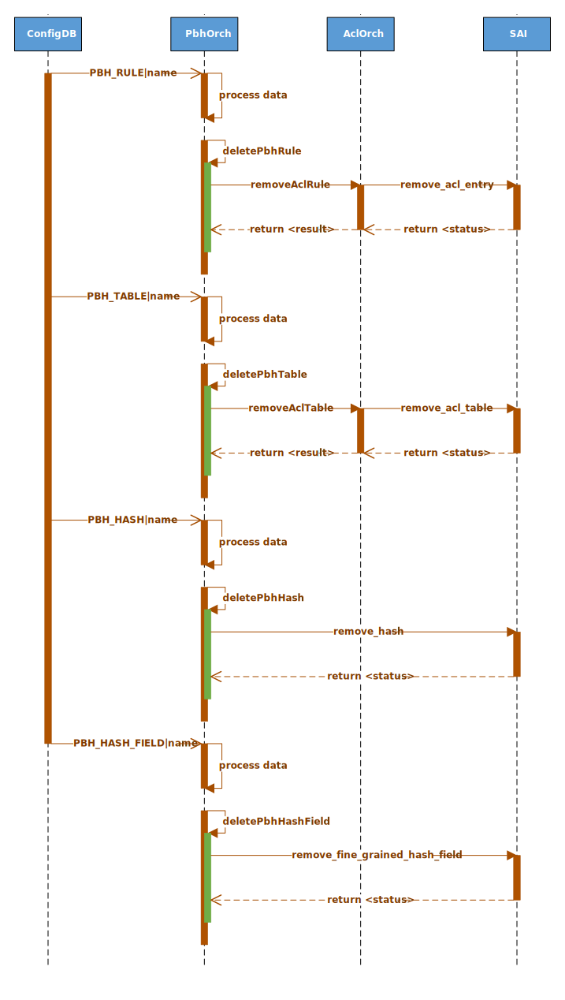

# SONiC Policy Based Hashing

## High Level Design document

## Table of contents

TBD

## About this manual

This document provides general information about PBH implementation in SONiC

## Revision

| Rev | Date       | Author         | Description                       |
|:---:|:----------:|:--------------:|:----------------------------------|
| 0.1 | 15/03/2021 | Nazarii Hnydyn | Initial version                   |

## Abbreviations

| Term   | Meaning                                             |
|:-------|:----------------------------------------------------|
| PBH    | Policy Based Hashing                                |
| ECMP   | Equal-Cost Multi-Path                               |
| FG     | Fine-Grained                                        |
| CLI    | Сommand-line Interface                              |
| DB     | Database                                            |
| CRC    | Cyclic Redundancy Check                             |
| ID     | Identifier                                          |

## List of figures

TBD

# Introduction

## Feature overview

PBH is a feature which allows user to configure a custom hashing for different packet types.  
Under the hood is uses ACL rules to match the specific types of frames and calculates hash  
based on user-defined rules.

For flexible hash calculation a new SAI FG Hash API is used.  
It allows user not only to configure which fields should be used,  
but also to specify a mask for IPv4/IPv6 addresses and sequence ID.  
The last one defines in which order the fields are hashed,  
and which of them should be associative for CRC with the same sequence ID.

PBH supports hash configuration for ECMP and LAG.  
Both Dynamic ECMP and FG ECMP are eligible.

## Requirements

### Functionality

**This feature will support the following functionality:**
1. Configure hashing based on inner 5-tuple: IP proto, L4 dst/src port, IPv4/IPv6 dst/src
2. Match NVGRE and VxLAN with inner/outer IPv4/IPv6 frames
3. Support hash configuration for Dynamic/FG ECMP and LAG
4. Support Warm/Fast reboot

### Command interface

**This feature will support the following commands:**
1. config: add/remove PBH table/rule/hash configuration
2. show: display PBH table/rule/hash configuration

# 2 Design

## Overview

TBD

## Flows

### PBH add


###### Figure 2: PBH add flow

### PBH remove



###### Figure 3: PBH remove flow

## DB Schema

### Config DB

#### PBH table
```abnf
; defines schema for PBH table configuration attributes
key = PBH_TABLE|table_name ; table name. Must be unique

; field     = value
port_list   = [0-max_ports]*port_name ; ports to which this table is applied. Can be empty
lag_list    = [0-max_ports]*port_name ; portchannels to which this table is applied. Can be empty
description = *255VCHAR               ; table description. Can be empty

; value annotations
port_name = 1*64VCHAR ; name of the port, must be unique
max_ports = 1*5DIGIT  ; number of ports supported on the chip
```

**Note:** at least one member of _port_list_ or _lag_list_ is required

#### PBH rule
```abnf
; defines schema for PBH rule configuration attributes
key = PBH_RULE|table_name|rule_name ; rule name. Must be unique across the table

; field           = value
priority         = 1*5DIGIT      ; rule priority. Valid values range is platform dependent
gre_key          = h32 "/" h32   ; GRE key (32 bits)
ip_protocol      = h8 "/" h8     ; IP protocol (8 bits)
l4_dst_port      = h16 "/" h16   ; L4 destination port (16 bits)
inner_ether_type = h16 "/" h16   ; Inner EtherType (16 bits)
hash_list        = hash-list     ; Hash list (PBH_HASH|hash_name)
packet_action    = packet-action ; Packet action

; value annotations
h8            = 1*2HEXDIG
h16           = 1*4HEXDIG
h32           = 1*8HEXDIG
hash-name     = 1*64VCHAR
hash-list     = "[" hash-name [ 1*( "," hash-name ) ] "]"
packet-action = "SET_ECMP_HASH" / "SET_LAG_HASH"
```

#### PBH hash
```abnf
; defines schema for PBH hash configuration attributes
key = PBH_HASH|hash_name ; hash name. Must be unique

; field     = value
hash_field  = hash-field  ; Hash native field
ipv4_mask   = ipv4-prefix ; Mask for a IPv4 address.
                          ; Valid only when hash_field is one of:
                          ; INNER_SRC_IPV4, INNER_DST_IPV4
ipv6_mask   = ipv6-prefix ; Mask for a IPv6 address.
                          ; Valid only when hash_field is one of:
                          ; INNER_SRC_IPV6, INNER_DST_IPV6
sequence_id = 1*5DIGIT    ; Specifies in which order the fields are hashed,
                          ; and defines which fields should be associative
                          ; for CRC with the same sequence ID

; value annotations
hash-field  = "INNER_IP_PROTOCOL" 
              / "INNER_L4_DST_PORT"
              / "INNER_L4_SRC_PORT"
              / "INNER_DST_IPV4"
              / "INNER_SRC_IPV4"
              / "INNER_DST_IPV6"
              / "INNER_SRC_IPV6"

h16         = 1*4HEXDIG
ls32        = ( h16 ":" h16 )

dec-octet   = DIGIT                  ; 0-9
              / %x31-39 DIGIT        ; 10-99
              / %x31 2DIGIT          ; 100-199
              / %x32 %x30-35 %x30-35 ; 200-255
ipv4-prefix = dec-octet "." dec-octet "."
              dec-octet "." dec-octet
ipv6-prefix = 6( h16 ":" ) ls32
              /                       "::" 5( h16 ":" ) ls32
              / [               h16 ] "::" 4( h16 ":" ) ls32
              / [ *1( h16 ":" ) h16 ] "::" 3( h16 ":" ) ls32
              / [ *2( h16 ":" ) h16 ] "::" 2( h16 ":" ) ls32
              / [ *3( h16 ":" ) h16 ] "::"    h16 ":"   ls32
              / [ *4( h16 ":" ) h16 ] "::"              ls32
              / [ *5( h16 ":" ) h16 ] "::"              h16
              / [ *6( h16 ":" ) h16 ] "::"
```

### Configuration sample

**Inner 5-tuple hashing:**
```json
{
    "PBH_HASH": {
        "inner_ip_proto": {
            "hash_field": "INNER_IP_PROTOCOL",
            "sequence_id": "1"
        },
        "inner_l4_dst_port": {
            "hash_field": "INNER_L4_DST_PORT",
            "sequence_id": "2"
        },
        "inner_l4_src_port": {
            "hash_field": "INNER_L4_SRC_PORT",
            "sequence_id": "2"
        },
        "inner_dst_ipv4": {
            "hash_field": "INNER_DST_IPV4",
            "ipv4_mask": "255.0.0.0",
            "sequence_id": "3"
        },
        "inner_src_ipv4": {
            "hash_field": "INNER_SRC_IPV4",
            "ipv4_mask": "0.0.0.255",
            "sequence_id": "3"
        },
        "inner_dst_ipv6": {
            "hash_field": "INNER_DST_IPV6",
            "ipv6_mask": "FFFF::",
            "sequence_id": "4"
        },
        "inner_src_ipv6": {
            "hash_field": "INNER_SRC_IPV6",
            "ipv6_mask": "::FFFF",
            "sequence_id": "4"
        }
    },
    "PBH_RULE": {
        "pbh_table|nvgre": {
            "priority": "1",
            "gre_key": "0x2500/0xffffff00",
            "inner_ether_type": "0x86dd/0xffff",
            "hash_list": [
                "inner_ip_proto",
                "inner_l4_dst_port",
                "inner_l4_src_port",
                "inner_dst_ipv6",
                "inner_src_ipv6"
            ],
            "packet_action": "SET_ECMP_HASH"
        },
        "pbh_table|vxlan": {
            "priority": "2",
            "ip_protocol": "0x11/0xff",
            "l4_dst_port": "0x12b5/0xffff",
            "inner_ether_type": "0x0800/0xffff",
            "hash_list": [
                "inner_ip_proto",
                "inner_l4_dst_port",
                "inner_l4_src_port",
                "inner_dst_ipv4",
                "inner_src_ipv4"
            ],
            "packet_action": "SET_LAG_HASH"
        }
    },
    "PBH_TABLE": {
        "pbh_table": {
            "port_list": [
                "Ethernet0",
                "Ethernet4"
            ],
            "lag_list": [
                "PortChannel0001",
                "PortChannel0002"
            ],
            "description": "NVGRE and VxLAN"
        }
    }
}
```

## CLI

### Command structure

**User interface**:
```
pbhutil
|--- config
|    |--- table
|    |    |--- add <table_name> OPTIONS
|    |    |--- remove <table_name>
|    |
|    |--- rule
|    |    |--- add <rule_name> <table_name> OPTIONS
|    |    |--- remove <rule_name>
|    |
|    |--- hash
|         |--- add <hash_name> OPTIONS
|         |--- remove <hash_name>
|
|--- show
     |--- table
     |--- rule
     |--- hash
```

**Options:**  

_pbhutil table add_  
1. -p|--port_list - port list
2. -l|--lag_list - portchannel list
3. -d|--description - table description

_pbhutil rule add_  
1. -p|--priority - rule priority
2. -m|--match - match field
3. -h|--hash_list - hash field list
4. -a|--action=<set_ecmp_hash|set_lag_hash> - packet action

_pbhutil hash add_  
1. -f|--field - hash field
3. -m|--mask - ip mask
2. -s|--sequence - sequence id

### Usage examples

#### Config command group

**The following command adds/removes table:**
```bash
pbhutil config table add 'pbh_table' --port_list 'Ethernet0,Ethernet4' --lag_list 'PortChannel0001,PortChannel0002' \
--description 'NVGRE and VxLAN'
pbhutil config table remove 'pbh_table'
```

**The following command adds/removes rule:**
```bash
pbhutil config rule add 'vxlan' --priority 1 \
--match gre_key 0x2500/0xffffff00 --match inner_ether_type 0x86dd/0xffff \
--hash_list 'inner_ip_proto,inner_l4_dst_port,inner_l4_src_port,inner_dst_ipv6,inner_src_ipv6' \
--action set_ecmp_hash
pbhutil config rule remove 'vxlan'
```

**The following command adds/removes hash:**
```bash
pbhutil config hash add 'inner_dst_ipv6' --field 'INNER_DST_IPV6' --mask 'FFFF::' --sequence 4
pbhutil config hash remove 'inner_dst_ipv6'
```

#### Show command group

**The following command shows table configuration:**
```bash
root@sonic:/home/admin# pbhutil show table
Name       Port        Lag              Description
---------  ----------  ---------------  ---------------
pbh_table  Ethernet0   PortChannel0001  NVGRE and VxLAN
           Ethernet4   PortChannel0002
```

**The following command shows rule configuration:**
```bash
root@sonic:/home/admin# pbhutil show rule
Table      Rule    Priority    Match                            Hash               Action
---------  ------  ----------  -------------------------------  -----------------  -------------
pbh_table  nvgre   1           GRE_KEY: 0x11/0xff               inner_ip_proto     SET_ECMP_HASH
                               INNER_ETHER_TYPE: 0x0800/0xffff  inner_l4_dst_port
                                                                inner_l4_src_port
                                                                inner_dst_ipv6
                                                                inner_src_ipv6
           vxlan   2           IP_PROTOCOL: 0x11/0xff           inner_ip_proto     SET_LAG_HASH
                               L4_DST_PORT: 0x12b5/0xffff       inner_l4_dst_port
                               INNER_ETHER_TYPE: 0x0800/0xffff  inner_l4_src_port
                                                                inner_dst_ipv4
                                                                inner_src_ipv4
```

**The following command shows hash configuration:**
```bash
root@sonic:/home/admin# pbhutil show hash
Name               Field              Mask       Sequence
-----------------  -----------------  ---------  ----------
inner_ip_proto     INNER_IP_PROTOCOL             1
inner_l4_dst_port  INNER_L4_DST_PORT             2
inner_l4_src_port  INNER_L4_SRC_PORT             2
inner_dst_ipv4     INNER_DST_IPV4     255.0.0.0  3
inner_src_ipv4     INNER_SRC_IPV4     0.0.0.255  3
inner_dst_ipv6     INNER_DST_IPV6     FFFF::     4
inner_src_ipv6     INNER_SRC_IPV6     ::FFFF     4
```

## Warm/Fast boot support

No special handling is required

# Test Plan

The following testing is planned for this feature:
1. SWSS unit tests via virtual switch
2. Data plane tests via pytest

# Open questions

1. PBH rule hit statistics: do we need it?
