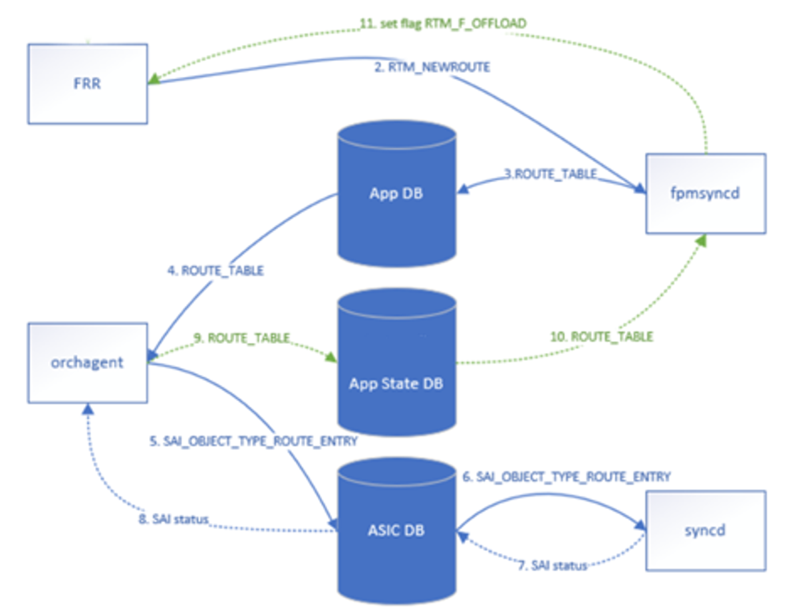

# SONiC Route Download Performance

**Authors**:
Mike Dubrovsky - Cisco

**Date:** 8/21/2025

## Table of Contents

- [1. Revision](#1-revision)
- [2. Scope](#2-scope)
- [3. Definitions/Abbreviations](#3-definitionsabbreviations)
- [4. Overview](#4-overview)
- [5. Requirements](#5-requirements)
  - [5.1 Functional Requirements](#51-functional-requirements)
  - [5.2 Performance Requirements](#52-performance-requirements)
  - [5.3 Configuration and Management Requirements](#53-configuration-and-management-requirements)
- [6. Performance Analysis and Optimizations](#6-performance-analysis-and-optimizations)
  - [Testbed](#testbed)
  - [Performance Summary](#performance-summary)
  - [Data Flow](#data-flow)
  - [Conclusion](#conclusion)
  - [Next Steps](#next-steps)
  - [Additional Optimizations](#additional-optimizations)
  - [Redis Performance](#redis-performance)
  - [Additional Parameters](#additional-parameters)
  - [Ideas](#ideas)
- [Appendix A: Routing Workgroup Meeting Summary](#appendix-a-routing-workgroup-meeting-summary)

---

## 1. Revision

| Rev | Date       | Author             | Change Description |
|-----|------------|--------------------|--------------------|
| 0.1 | 8/21/2025  | Mike Dubrovsky     | Initial version    |

---

## 2. Scope

This document describes the scope of route download performance analysis and optimization in SONiC. It covers performance measurements, bottleneck identification, and various optimization techniques to improve route programming speed from BGP to hardware. The document analyzes the data flow through the SONiC pipeline including FRR, fpmsyncd, orchagent, syncd, and SAI layers, and presents optimization strategies that can improve route download performance by up to 10x.

---

## 3. Definitions/Abbreviations

| Term              | Definition                                                                 |
|-------------------|----------------------------------------------------------------------------|
| APPL_DB           | Application Database - Redis database for application layer               |
| APPL_STATE_DB     | Application State Database - Redis database for application state         |
| ASIC_DB           | ASIC Database - Redis database for ASIC configuration                     |
| BGP               | Border Gateway Protocol                                                    |
| CONFIG_DB         | Configuration Database - Redis database for system configuration          |
| FIB               | Forwarding Information Base                                                |
| FPM               | Forwarding Plane Manager                                                   |
| FRR               | Free Range Routing - routing protocol suite                               |
| HLD               | High Level Design                                                          |
| ISSU              | In-Service Software Upgrade                                                |
| Orchagent         | Orchestration Agent - translates app-level to ASIC operations            |
| PST               | ProducerStateTable                                                         |
| CST               | ConsumerStateTable                                                         |
| SAI               | Switch Abstraction Interface                                               |
| Syncd             | Synchronization Daemon - communicates with SAI                            |
| ZMQ               | ZeroMQ - high-performance asynchronous messaging library                  |

---

## 4. Overview

Route download performance is a critical aspect of SONiC's control plane efficiency, directly impacting network convergence time and BGP session establishment. This document analyzes the complete route programming pipeline and identifies performance bottlenecks across multiple components.

The analysis was performed on a Cisco 8201-32FH-O platform with a D-1530 CPU (4 cores/8 threads @ 2.40GHz) and 32GB RAM, using a test setup with 600K IPv4/24 routes. The baseline performance showed approximately 2K routes/second, which was improved to over 20K routes/second through various optimizations.

This document serves multiple purposes:
1. **Performance Analysis**: Identifies bottlenecks in the route programming pipeline
2. **Optimization Guide**: Documents proven optimization techniques and their impact
3. **Configuration Reference**: Provides configuration examples for enabling optimizations
4. **Design Considerations**: Discusses trade-offs between performance and features like warm boot and FIB suppression

The optimizations range from simple configuration changes (async mode, batch sizes) to architectural improvements (ZMQ, ring buffers, bypassing metadata validation) and require careful consideration of their impact on existing features and stability.

---

## 5. Requirements

### 5.1 Functional Requirements

This performance analysis and optimization work maintains the following functional requirements:

1. **Route Programming Correctness**: All optimizations must maintain correct route programming to hardware
2. **Feature Compatibility**: Optimizations should be compatible with existing SONiC features where possible
3. **Backward Compatibility**: Configuration changes should not break existing deployments
4. **Data Plane Integrity**: No data plane disruption during route programming
5. **Monitoring Capability**: Ability to measure and verify route programming performance

### 5.2 Performance Requirements

1. **Baseline Performance**: Establish baseline route programming performance metrics
2. **Improvement Target**: Achieve 10x improvement in route download speed (from 2K to 20K+ routes/second)
3. **Scalability**: Handle 600K+ routes efficiently
4. **CPU Efficiency**: Minimize CPU overhead during route programming
5. **Memory Efficiency**: Avoid memory growth during high-volume route updates

### 5.3 Configuration and Management Requirements

1. **Configuration Flexibility**: Optimizations should be configurable and not require code changes where possible
2. **Feature Flags**: Use existing SONiC configuration mechanisms (CONFIG_DB, device metadata)
3. **Documentation**: Clear documentation of configuration options and their trade-offs
4. **Monitoring**: Ability to verify which optimizations are active
5. **Build Options**: Support for build-time optimization flags (e.g., ENABLE_MULTIDB)

---

## 6. Performance Analysis and Optimizations

This section presents detailed performance analysis and optimization techniques tested on the reference platform. Each optimization is evaluated individually and in combination to understand its impact on route download performance.

---

## Testbed

- **Device:** Cisco 8201-32FH-O (Churchill Mono) on master branch
- **Form Factor:** Pizza box 32x400G
- **CPU:** D-1530 4 cores / 8 threads @ 2.40GHz
- **RAM:** 32G

**Test Setup:**

```
┌──────────────────────┐                    ┌─────────────┐
│   BGP generator      │ ───────────────────│     DUT     │
│ (600K ipv4/24 routes)│                    │             │
└──────────────────────┘                    └─────────────┘
```

---

## Performance Summary


| Optimization                                                                              | Evaluation |Baseline| ON/OFF | ON/OFF | ON/OFF | ON/OFF | ON/OFF | ON/OFF | ON/OFF | ON/OFF | ON/OFF |
|-------------------------------------------------------------------------------------------|------------|--------|--------|--------|--------|--------|--------|--------|--------|--------|--------|
| [Async mode](#async-mode)                                                                 |            |        |        | On     |        |        |        | On     | On     | On     | On     |
| [Multi db](#multi-db)                                                                     |            |        |        |        | On     | On     | On     | On     | On     | On     | On     |
| [Batch / bulk sizes](#batch--bulk-sizes)                                                  |            |        |        |        |        | On     | On     |        | On     | On     | On     |
| [No APPL_STATE_DB population](#no-appl_state_db-population)                               |            |        | On     |        |        | On     | On     | On     | On     | On     | On     |
| [Separate pthread for APPL_STATE_DB](#separate-pthread-for-responsepublisher)             |            |        |        |        |        |        |        |        |        |        |        |
| [Ring buffer](#ring-buffer)                                                               |            |        |        |        |        | On     | On     | On     | On     | On     | On     |
| [ZMQ for ConsumerStateTable](#zmq-for-consumerstatetable)                                 |            |        |        |        |        | On     | On     |        | On     | On     | On     |
| [No logs](#no-logs)                                                                       |            |        |        |        |        | On     | On     |        | On     | On     | On     |
| [Use nexthop groups (even for single nbr)](#use-nexthop-groups-even-for-single-nbr)       |            |        |        |        |        |        |        |        |        |        | On     |
| [Sort SAI route bulk](#sort-sai-route-bulk)                                               |            |        |        |        |        | On     | On     |        | On     | On     | On     |
| [Bypass saimeta::Meta for bulk operations](#bypass-saimetameta-for-bulk-operations)       |            |        |        |        |        | On     | On     |        | On     | On     | On     |
| [No APPL_DB and APPL_ASIC_DB populations](#no-appl_db-and-appl_asic_db-populations)       |            |        |        |        |        |        | On     |        |        | On     | On     |
| **Total speed (1K route/sec)**                                                            |            | **2**  | **4**  | **2.9**| **3.6**| **12** | **13** | **14** |**18.5**|**20.6**| **21** |

---

## Background - Data Flow

**Reference:** [BGP Suppress FIB Pending - FPM Syncd](https://github.com/stepanblyschak/SONiC/blob/bgp-suppress-fib-pending/doc/BGP/BGP-supress-fib-pending.md#74-fpmsyncd)



**Simplified Orchagent Single Thread Data Flow:**

Zooming on the orchagent, the pipeline of operation during route update looks like:
1. Pop from APPL_DB into m_toSync
2. RouteOrch::doTask creates SAI route bulk
3. Sends bulk via sairedis to syncd
4. waitForBulkResponse waits for reply from syncd
5. ResponsePublisher puts into APPL_STATE_DB

---

## Async Mode

**Documentation:** [Synchronous Mode Configuration](https://github.com/sonic-net/SONiC/blob/master/doc/synchronous-mode/synchronous-mode-cfg.md)

### Configuration

To switch to async mode:

```bash
config synchronous_mode {enable|disable}
```

Or in configuration:

```json
"DEVICE_METADATA": {
    "localhost": {
        "synchronous_mode": "disable"
    }
}
```

**Note:** The above configuration is broken due to typos. It's easier to comment out `--s` in:
- `swss:/usr/bin/orchagent.sh`
- `syncd:/usr/bin/syncd_init_common.sh`

### Known Issues

- Async mode was broken by: [sonic-sairedis#1362](https://github.com/sonic-net/sonic-sairedis/pull/1362)
- Fix available: [sonic-swss-common#1023](https://github.com/sonic-net/sonic-swss-common/pull/1023)

---

## Multi DB

**Documentation:** [Multi Database Instances](https://github.com/sonic-net/SONiC/blob/b2c6b27905dad9b995fc9cc93dc38061983ac498/doc/database/multi_database_instances.md)

### Build Configuration

```bash
make … ENABLE_MULTIDB=y … sonic-cisco-8000.bin
```

Or add to `rules/config`

---

## Batch / Bulk Sizes

### Parameters

- **gBatchSize:** Drain from APP_DB
- **gMaxBulkSize:** Pack to sairedis

### Default Values

- **gMaxBulkSize:** 1000 (can be set with `-k` CLI param)
- **gBatchSize:** 1024 (can be set with `-b` CLI param)

### Recommended Configuration

Change in `swss:/usr/bin/orchagent.sh`:

```bash
# From: -k 1000
# To:   -k 10000 -b 10000
```

**Note:**
- For ZMQ: Only need to set gMaxBulkSize
- For Silicon One: Use 50K

---

## No APPL_STATE_DB Population

APPL_STATE_DB route population was introduced by FIB suppression and **halved the route programming speed in 202405 stream**.

### Solution

Populate route state into APPL_STATE_DB (ResponsePublisher) only when FIB suppression is enabled.

**Reference:** [RouteOrch Implementation](https://github.com/sonic-net/sonic-swss/blob/c3f5270fc8e37bab982039335b9955c825aa82d8/orchagent/routeorch.cpp#L3149)

### Implementation Options

1. **Simplest:** Force orchagent restart when FIB suppression config changes
2. **More complex:** Force re-population from FRR

---

## Separate pthread for ResponsePublisher

**Pull Request:** [sonic-swss#3066](https://github.com/sonic-net/sonic-swss/pull/3066)

### Code Change

File: `orchagent/orch.h`

```cpp
@@ -323,7 +323,7 @@ protected:
 void addExecutor(Executor* executor);
 Executor *getExecutor(std::string executorName);
 
- ResponsePublisher m_publisher{"APPL_STATE_DB"};
+ ResponsePublisher m_publisher{"APPL_STATE_DB", /*bool buffered=*/true, /*db_write_thread=*/true};
```

---

## Ring Buffer

**Documentation:** [BGP Loading Optimization HLD](https://github.com/sonic-net/SONiC/blob/3e9cfba11b195e64f5d2f7138fb15fdcc4affbfa/doc/bgp_loading_optimization/bgp-loading-optimization-hld.md)

### Configuration

```json
"DEVICE_METADATA": {
    "localhost": {
        "ring_thread_enabled": "true"
    }
}
```

### Verification

Check that orchagent runs with `--R` flag

### Known Issues

- Was not working initially - suspected to be broken by [sonic-swss#2511](https://github.com/sonic-net/sonic-swss/pull/2511/)
- But seems to work fine without ResponsePublisher

---

## ZMQ for ConsumerStateTable

**Documentation:** [Improve Route Performance](https://github.com/sonic-net/SONiC/blob/b578f6c1a5135d60c087427d8c421df9dc670e05/doc/orchagent_zmq/Improve_route_performance.md)

### Configuration

```json
"DEVICE_METADATA": {
    "localhost": {
        "orch_northbond_route_zmq_enabled": "true"
    }
}
```

### Related Pull Requests

- [sonic-swss#3632](https://github.com/sonic-net/sonic-swss/pull/3632)
- [sonic-buildimage#23028](https://github.com/sonic-net/sonic-buildimage/pull/23028)

### Additional Optimization

Can unset `dbPersistence` in Producer to not populate APPL_DB

---

## No Logs

All logs are saved on flash partition: `/var/log/swss/`

These are logged per prefix.

### Configuration

```bash
orchagent -r 0

# Also set log level to ERROR
swssloglevel -a -l ERROR
```

---

## Use Nexthop Groups (even for single nbr)

**Documentation:**
- [FPM Syncd HLD](https://github.com/sonic-net/SONiC/blob/master/doc/pic/hld_fpmsyncd.md)
- [Next Hop Group HLD](https://github.com/sonic-net/SONiC/blob/master/doc/ip/next_hop_group_hld.md)

### Configuration

```json
"DEVICE_METADATA": {
    "localhost": {
        "nexthop_group": "enabled"
    }
}
```

Or via CLI:

```bash
feature next-hop-group enable
sudo config save -y
fpm use-next-hop-groups
```

**Template:** `sonic-frr-mgmt-framework/templates/frr/frr.conf.j2`

### Limitations

**Currently this feature does not work with Warmboot/Fastboot.**

---

## Sort SAI Route Bulk

This smooths the route re-ordering (m_toSync, gRouteBulker and SET in Redis).

### Configuration

File: `/usr/share/sonic/hwsku/asic_cfg.json`

```json
{
    "devices": [
        {
            "device_property": {
                "sort_routes": true
            }
        }
    ]
}
```

Need to change in `platform_npu_cfg.yaml`:

```
SAI_API_SWITCH, "%s internal sorting routes when performing bulk operations", value ? "Enabling" : "Disabling"
```

---

## Bypass saimeta::Meta for Bulk Operations

The Meta class maintains local database/cache of all SAI objects that have been created, along with their current attribute values. Used for validation.

**Reference:** [Meta.cpp](https://github.com/sonic-net/sonic-sairedis/blob/master/meta/Meta.cpp)

### Implementation

We disabled the cache population for bulk functions:

- `bulkCreate`
- `bulkRemove`
- `bulkSet`
- `bulkGet`

And left only the essential code:

```cpp
auto status = m_implementation->bulkCreate(object_count, ot, attr_count, attr_list, mode, object_statuses);
```

---

## No APPL_DB and APPL_ASIC_DB Populations

### For APPL_DB

Disable via:

```cpp
void ZmqProducerStateTable::initialize(DBConnector *db, const std::string &tableName, bool dbPersistence)
```

### For ASIC_DB

Disable via `m_modifyRedis` in `ConsumerTable::pops()`

---

## SNMP Fix

SNMP queries the full routing table every 5 seconds to check default route nexthops.

### Location

```bash
docker exec -it snmp bash
/usr/local/lib/python3.11/dist-packages/sonic_ax_impl/mibs/ietf/rfc1213.py
```

### Route Check Script

Runs approximately every 5 minutes:

```
/etc/monit/conf.d/sonic-host
  route_check.py
    show ip route json
```

---

## Conclusion

### Bad Things

- **Multi DB** needs re-compile image
- **Async mode** breaks FIB suppression
- **Next hop groups** does not support warm reboot / single neighbor
- **Not populating APPL_DB or APPL_STATE_DB** breaks warm reboot
  - But warm boot (Cisco ISSU) is needed mostly for T0 devices
- **Stability?**

### Key Issue

FIB suppression introduced routes in APPL_STATE_DB (step 9).

In 202405, the route programming speed **halved** even if the feature is disabled.

Even Google stopped using APPL_STATE_DB for P4 due to slowness.

**Solution:** Conditional population depends on features

---

## Next Steps

### Option 1: Restart Orchagent After FIB Suppression Config Changed

| Pro | Cons | Comments |
|-----|------|----------|
| Easy to implement and clean | Causing dockers go down | |

### Option 2: No Orchagent Restart

| Pro | Cons | Comments |
|-----|------|----------|
| | | Needs to trigger from FRR |

### Add More pthreads to syncd

One thread in syncd in async mode does 3 operations:
1. Pop from APPL_ASIC_DB
2. Write success to APPL_ASIC_DB
3. Do work

| Approach | Pro | Cons | Comments |
|----------|-----|------|----------|
| Split IO and the rest using ring buffer into 2 threads | More gain | m_mutex | |
| Write into APPL_ASIC_DB in separate thread using AsyncDBUpdater | | Specific to async case that is obscure | Doing |

---

## Additional Optimizations

### Unordered Map for Nexthop

Done for nexthop groups but not for single neighbor.

**Pull Request:** [sonic-swss#3742](https://github.com/sonic-net/sonic-swss/pull/3742)

**Status:** Got bad result... Need to check

### Sync Mode from Broadcom?

Under investigation

### Simplify Consumer / ProducerStateTable

Change lua script to avoid temp _ (_ROUTE_TABLE)

---

## Redis Performance

Performance between fpmsyncd and orchagent via Python script that uses ConsumerStateTable:

### Single Redis Process

- 100K background requests per minute
- **Write:** 9K/s
- **Read:** 13K/s
- **Together:** ~6K/sec

### Multi-DB

1K background requests in APP_DB redis process:

- **Write:** 17K-27K (1K batch), 30K (10K batch)
- **Read:** 46K (10K batch)
- **50% CPU util:**
  - Write: 21-22K
  - Read: 35-37K
  - Together: ~20K

```bash
stress-ng --cpu 0 --cpu-load 50
```

### FRR to APPL_DB (Step 2-4)

22-28K/sec (25K/sec without kernel updates), but no overall improvement.

---

## Additional Parameters

### fpmsyncd Parameters

```c
#define FLUSH_TIMEOUT 500 // 500 milliseconds
static int gFlushTimeout = FLUSH_TIMEOUT;
// consider the traffic is small if pipeline contains < 500 entries
#define SMALL_TRAFFIC 500
```

### Orchagent Pause Issue

Goes to 10K/sec if we pause orchagent.

Seems to be an ordering issue. There are 3 places where we reshuffle prefixes:
- ConsumerStateTable
- m_toSync
- gRouteBulker

**With fake ordering:** 19K/sec; 17K/sec

### syncd Parameters

```cpp
ConsumerTable(DBConnector *db, const std::string &tableName,
              int popBatchSize = DEFAULT_POP_BATCH_SIZE, int pri = 0);

static constexpr int DEFAULT_POP_BATCH_SIZE = 128;
```

---

## Ideas

- Change to preserve order of routes in communication channels
- FIB suppression – commit no APPL_STATE_DB options
- Log into tmpfs and then logrotate to flash
- Debug is generated when syslog set to ERROR?
- Change state producer to eliminate _
- Vid bulk allocation, RID in background thread; PST/CST replacement (Google changes)
- Check Cisco SAI SDK implementation for bulk route create
- Community suggested ideas / collaboration?

---

## Appendix A: Routing Workgroup Meeting Summary

**Meeting Date:** December 11, 2025

### Summary

The team discussed the challenges and improvements related to async mode, failure handling, and performance metrics. They noted that async mode allows for selective enabling and disabling but requires careful failure message conveyance. The latest code handles ASIC programming failures gracefully, avoiding crashes. Performance improvements were observed, with bulk support enabling faster processing. The multi-DB feature was debated, highlighting its benefits and potential memory and CPU impacts. The application state DB population was discussed, noting a significant performance drop when enabled. The team agreed to test various configurations and optimizations, including synchronous and asynchronous modes, to ensure robust performance and avoid unnecessary overhead.

### Action Items

- Perform tests to understand the performance impact of async mode, both standalone and when combined with other optimizations.
- Investigate the current status of the multi-DB feature and explore options to make it more configurable.
- Characterize the performance impact of different batch and bulking size configurations and ensure there are no negative side effects.
- Explore the possibility of not populating the app state DB when the FIB suppression feature is disabled.

### Discussion on Async Mode and Failure Handling

- There are challenges of validating for every platform and mentions the use of async mode for selective enabling and disabling.
- Suggestion is to enable async mode only for specific devices in a data center network.
- Discussed the difficulty in conveying failure messages to the northbound API when using async mode.
- The latest code handles ASIC programming failures gracefully, requiring manual intervention later.
- The offload flag in FRR waits for the app state DB population before advertising routes.
- The current workflow where the API considers a programming operation successful, updating the app state DB.
- The performance improvements brought by async mode and bulking support must be quantify
- Hybrid mode was introduced by Broadcom, which sends multiple batches and waits for responses.
- Testing with both synchronous and async modes to compare performance.
- Emphasized the need for thorough testing before enabling async mode to ensure full benefits.

### Multi-DB and Compilation Flags

- Discussed the multi-DB feature, which distributes databases across multiple Redis processes.
- Discussed the benefits and drawbacks of multi-DB, including increased memory and CPU usage.
- Concerns about managing different images with different flags for various platforms.
- Suggestion about using a runtime option in the platform.json file for database initialization.

### Batch and Bulk Size Optimization

- Discussed the impact of batch and bulk size on performance, noting that larger batches can improve speed but slow down reaction times.
- Community requested more characterization on the benefits and potential issues of different batch sizes.
- A mention about issues with interface bring-up times on chassis when batch sizes are too large.
- Suggested testing different batch sizes to find the optimal balance.

### Application State DB Population

- Discussed the performance impact of populating the application state DB, noting a significant drop in performance.
- Suggestion about coupling the app state DB population from the asynchronous mode.
- Discussed the importance of the wait-for-install feature in preventing unnecessary traffic i.e., prevents BGP from advertising uninstalled prefixes. Seems like only a small percentage of users currently use the feature.
- Suggestion is to configure the feature based on user needs and platform capabilities.

---
