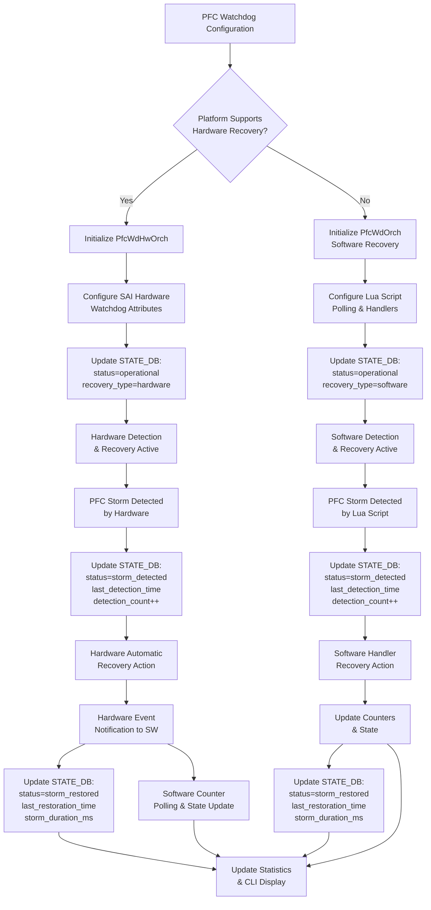
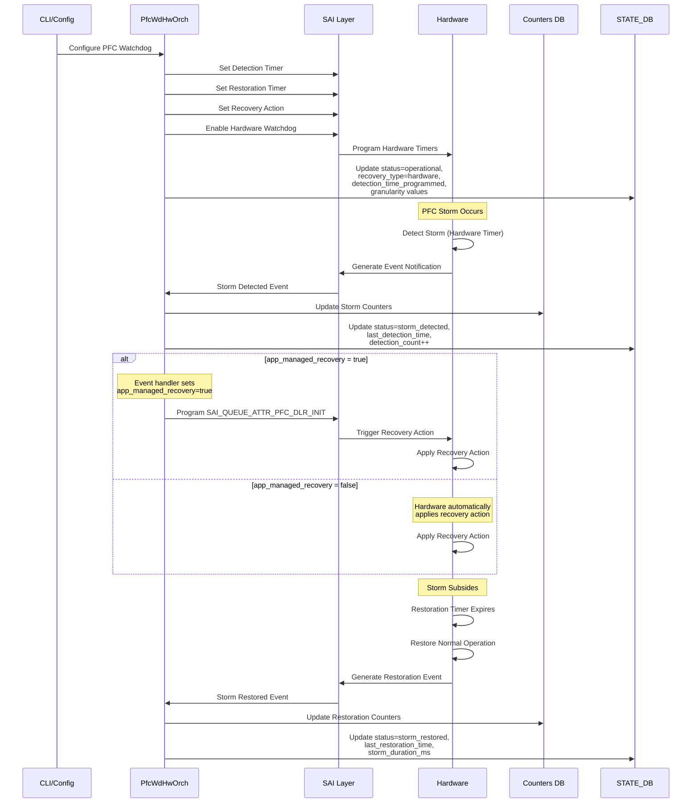
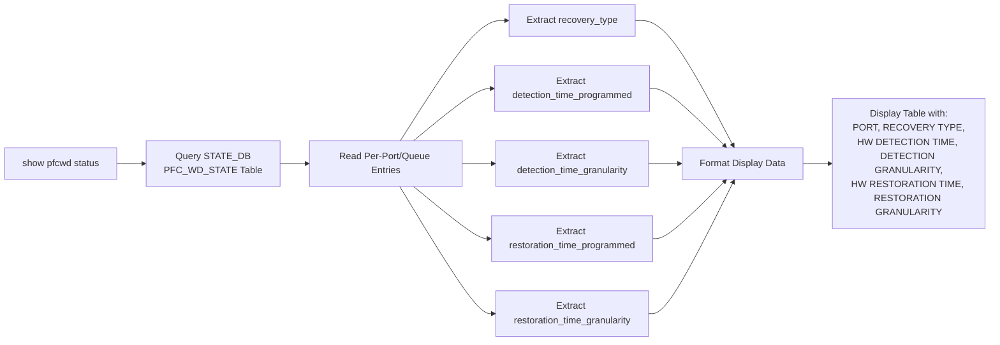

# PFC Watchdog Hardware Recovery

## Table of Contents
- [Revision](#revision)
- [Scope](#scope)
- [Abbreviations](#abbreviations)
- [1. Overview](#1-overview)
- [2. Requirements](#2-requirements)
- [3. Architecture Design](#3-architecture-design)
- [4. High-Level Design](#4-high-level-design)
  - [4.1 Hardware Recovery Mechanism](#41-hardware-recovery-mechanism)
    - [4.1.1 Hardware vs Software Recovery Flow](#411-hardware-vs-software-recovery-flow)
    - [4.1.2 Hardware Recovery Workflow](#412-hardware-recovery-workflow)
    - [4.1.3 SDK and Hardware Responsibilities](#413-sdk-and-hardware-responsibilities)
  - [4.2 PFC Watchdog Orchagent Refactoring](#42-pfc-watchdog-orchagent-refactoring)
- [5. CLI Changes](#5-cli-changes)
  - [5.1 New CLI command](#51-new-cli-command)
  - [5.2 CLI Data Flow](#52-cli-data-flow)
- [6. SAI API](#6-sai-api)
  - [6.1 SAI Attributes](#61-sai-attributes)
  - [6.2 SAI Events](#62-sai-events)
  - [6.3 SAI Statistics](#63-sai-statistics)
- [7. Configuration and Management](#7-configuration-and-management)
- [8. Manifest](#8-manifest)
- [9. CLI-YANG Model Enhancements](#9-cli-yang-model-enhancements)
- [10. Warmboot and Fastboot Design Impact](#10-warmboot-and-fastboot-design-impact)
- [11. Restrictions/Limitations](#11-restrictionslimitations)
- [12. Testing Requirements/Design](#12-testing-requirementsdesign)
  - [12.1 Additional Test Cases for Hardware Recovery](#121-additional-test-cases-for-hardware-recovery)

## Revision

| Rev | Date       | Author        | Change Description |
|-----|------------|---------------|--------------------|
| 0.1 | 12/13/2025 | Pinky Agrawal | Initial version    |
| 0.2 | 02/05/2026 | Pinky Agrawal | Addressed review comments: Added configuration validation using SAI_SWITCH_ATTR_PFC_TC_DLD_INTERVAL_RANGE, updated SAI attributes section with extension attributes, clarified counter polling mechanism, updated show pfcwd status for software mode, added telemetry test cases |

## Scope

This document describes the design for hardware-based PFC (Priority Flow Control) watchdog recovery mechanism in SONiC. It covers the extension of existing software-based PFC watchdog functionality to support hardware-accelerated detection and recovery.

## Abbreviations

| Abbreviation | Description |
|--------------|-------------|
| PFC | Priority Flow Control |
| HLD | High Level Design |
| SAI | Switch Abstraction Interface |
| CLI | Command Line Interface |
| ACL | Access Control List |
| TC | Traffic Class |
| DLR | Deadlock Recovery |
| DLD | Deadlock Detection |

## 1. Overview

This design document is an extension of the existing PFC watchdog functionality described in the [PFC Watchdog Design](https://github.com/sonic-net/SONiC/wiki/PFC-Watchdog-Design). Newer network chips are capable of PFC storm detection and mitigation in the hardware without software intervention. Current implementation of software based PFC watchdog detection depends on constant polling of the queue's pause state, mitigation requires installation of ACLs to take drop action and restoration requires constant polling of PFC frames received on the queue.

This document provides an overview of the programming requirements to enable hardware based recovery for PFC watchdog.

## 2. Requirements

The hardware-based PFC watchdog recovery feature shall provide:

1. **Hardware Detection**: Automatic PFC deadlock detection in hardware without software polling
2. **Hardware Recovery**: Automatic recovery actions (drop/forward) performed by hardware
3. **Backward Compatibility**: Existing software-based PFC watchdog functionality remains unchanged
4. **Runtime Selection**: Automatic selection between hardware and software implementations based on platform capabilities
5. **Enhanced CLI**: New `show pfcwd status` command to display recovery type, actual hardware timer values, and granularity information
6. **Error Handling**: Proper validation and error reporting for hardware timer granularity constraints

## 3. Architecture Design

The architecture maintains separation between hardware and software PFC watchdog implementations while sharing common CLI parsing and validation logic.

```
Current: Orch -> PfcWdOrch<Handler> -> PfcWdSwOrch<Handler>
Proposed: Orch -> PfcWdBaseOrch -> {PfcWdHwOrch | PfcWdSwOrch<Handler>}
```

## 4. High-Level Design

### 4.1 Hardware Recovery Mechanism

Hardware recovery mechanism requires the application to program certain SAI attributes to initiate hardware based PFC deadlock detection and recovery. The below table highlights the key differences between hardware and software recovery.
Each phase of hardware detection and recovery happens based on the programming of a corresponding SAI attribute.

| Phase | Software Recovery | Hardware Recovery |
| ----- | ----- | ----- |
| Deadlock detection requirement | Polling period for lua script configured in S/W | Enable h/w deadlock detection and recovery. Configure detection timer. Register callback for h/w events |
| Detection mechanism | Lua script polls the queue to check if queue received PFC frames continuously for detection time | H/w detects the deadlock and publishes an event to the s/w to take action, if required. |
| PFC pause frame handling | Software disables PFC by clearing the PFC mask bit for the affected queue (ignores incoming PFC pause frames) | Hardware sets the registers that ignores PFC pause frames for the affected queue during storm mitigation |
| Mitigation | Orchagent programs ACLS to take drop action or programs a zero-buffer profile | H/w takes the drop/forward action |
| Recovery requirement | Polling period for lua script configured in S/W | Configure recovery timer attribute |
| Recovery | Lua script polls if the queue remains unpaused for restoration-time amount of time to recover | H/w recovers the queue and publishes an event to the s/w to take action, if required. |

**Timer granularity constraints:**
- Hardware may have granularity limitations (e.g., 100ms granularity)
- Configured values may differ from actual hardware-programmed values
- Upper limits may apply based on platform (e.g., Broadcom: 1-15 × granularity)

**Hardware recovery advantages:**
- **Better accuracy in storm detection**: Hardware-based detection operates at line rate without software polling delays, providing more precise detection timing
- **Better accuracy in storm restoration**: Hardware-based restoration timing is more accurate as it doesn't depend on software polling intervals or system load
- **Reduced latency**: Hardware detection and recovery actions happen immediately without waiting for software polling cycles
- **Lower CPU overhead**: Eliminates continuous software polling, reducing CPU utilization and system load

#### 4.1.1 Hardware vs Software Recovery Flow

The following diagram illustrates the decision flow for selecting hardware vs software recovery:



#### 4.1.2 Hardware Recovery Workflow

The following diagram shows the detailed hardware recovery process:



#### 4.1.3 SDK and Hardware Responsibilities

In hardware-based PFC watchdog recovery, the responsibilities are distributed between the SDK layer and the hardware (ASIC).

**SDK Responsibilities:**

The SDK layer (e.g., Broadcom SDK) acts as the intermediary between SAI and the hardware. It is responsible for:
- Translating SAI attribute calls into hardware-specific register programming
- Reporting hardware capabilities such as supported timer ranges and granularity constraints
- Monitoring hardware event registers and translating them into SAI event callbacks (`SAI_QUEUE_PFC_DEADLOCK_EVENT_TYPE_DETECTED` and `SAI_QUEUE_PFC_DEADLOCK_EVENT_TYPE_RECOVERED`)
- Managing hardware resource allocation for timers, counters, and event queues
- Reading hardware counter registers and providing statistics via SAI APIs

**Hardware (ASIC) Responsibilities:**

The hardware performs the actual line-rate detection and recovery operations:
- Monitoring incoming PFC pause frames on each queue and tracking continuous pause state duration
- Comparing pause duration against programmed detection timers and generating detection events when timers expire
- Automatically applying recovery actions (drop/forward) to packets in affected queues
- Maintaining hardware timers for both detection and restoration at the configured granularity (e.g., 100ms increments)
- Generating hardware interrupts or events on storm detection and restoration

### 4.2 PFC Watchdog Orchagent Refactoring

This document outlines a proposal to refactor the PFC watchdog orchestrator architecture to support both hardware-based and software-based PFC recovery mechanisms.

#### Design Goals

- **Clean separation**: Hardware-specific logic isolated from software watchdog logic  
- **Backward compatibility**: Existing software implementation remains unchanged  
- **Code reuse**: Common functionality (CLI parsing, validation) remains in one place for both.

#### Current Architecture

```
Orch (base class)
  └── PfcWdOrch<DropHandler, ForwardHandler> (template class)
      └── PfcWdSwOrch<DropHandler, ForwardHandler> (template class)
```

#### Proposed Architecture

```
Orch (base class)
  └── PfcWdBaseOrch (new base class)
      ├── PfcWdHwOrch (new hardware-based class - no handlers)
      └── PfcWdSwOrch<DropHandler, ForwardHandler> (existing template class)
```

#### Implementation Details

`PfcWdBaseOrch` is the new base class that will have the common logic of parsing the CLI and creating the tasks. This implementation exists in `PfcWdOrch` today and will be moved to this new class. `PfcWdOrch` will be removed and renamed to `PfcWdBaseOrch` without the template parameters.

`PfcWdHwOrch` is the new class that will handle hardware recovery mechanisms. There will be no handlers defined in hardware-based recovery unlike software recovery which defines drop and forward handlers. To update the counters periodically, `PfcWdHwOrch` will use the same counter polling mechanism as software-based recovery. The counter querying remains the same as the software-based approach, using SAI queue statistics APIs (`SAI_QUEUE_STAT_PACKETS`, `SAI_QUEUE_STAT_DROPPED_PACKETS`, etc.) to read hardware counters and update COUNTERS_DB.

#### SKU-Based Override Mechanism

In some cases, certain SKUs may need to use software-based PFCWD even when hardware capability is available. This can be due to:
- Hardware recovery in development mode
- Hardware limitations or bugs specific to certain SKU models
- Platform-specific requirements
- Testing or validation purposes

For such cases, the orchagent can maintain a list of such SKUs and skip creating `PfcWdHwOrch` for those SKUs as given in the code below.

Runtime selection in `orchdaemon.cpp`:

```c
// Check hardware capability
bool pfcHwRecoverySupported = gSwitchOrch->checkPfcHwRecoverySupport();

// Check if SKU is in the override list to force software-based PFCWD
std::vector<std::string> swPfcwdSkuList = getSwPfcwdSkuOverrideList();
std::string currentSku = gSwitchOrch->querySwitchSku();
bool skuForcesSwPfcwd = std::find(swPfcwdSkuList.begin(), swPfcwdSkuList.end(), currentSku) != swPfcwdSkuList.end();

// Check hardware capability
bool pfcHwRecoverySupported = gSwitchOrch->checkPfcHwRecoverySupport();

if (pfcHwRecoverySupported && !skuForcesSwPfcwd)
{
    SWSS_LOG_NOTICE("Starting hardware-based PFC watchdog (no handlers)");

    // Query hardware timer range capabilities during initialization
    sai_attribute_t attr_dld, attr_dlr;
    attr_dld.id = SAI_SWITCH_ATTR_PFC_TC_DLD_INTERVAL_RANGE;
    attr_dlr.id = SAI_SWITCH_ATTR_PFC_TC_DLR_INTERVAL_RANGE;

    sai_status_t status_dld = sai_switch_api->get_switch_attribute(gSwitchId, 1, &attr_dld);
    sai_status_t status_dlr = sai_switch_api->get_switch_attribute(gSwitchId, 1, &attr_dlr);

    if (status_dld == SAI_STATUS_SUCCESS && status_dlr == SAI_STATUS_SUCCESS)
    {
        uint32_t detection_min = attr_dld.value.u32range.min;
        uint32_t detection_max = attr_dld.value.u32range.max;
        uint32_t restoration_min = attr_dlr.value.u32range.min;
        uint32_t restoration_max = attr_dlr.value.u32range.max;

        SWSS_LOG_NOTICE("PFC watchdog hardware detection timer range: %u - %u ms",
                       detection_min, detection_max);
        SWSS_LOG_NOTICE("PFC watchdog hardware restoration timer range: %u - %u ms",
                       restoration_min, restoration_max);

        // Store hardware capabilities in STATE_DB for CLI validation
        DBConnector stateDb("STATE_DB", 0);
        Table capabilitiesTable(&stateDb, "PFC_WD_HW_CAPABILITIES");

        vector<FieldValueTuple> fvVector;
        fvVector.emplace_back("detection_timer_min", to_string(detection_min));
        fvVector.emplace_back("detection_timer_max", to_string(detection_max));
        fvVector.emplace_back("restoration_timer_min", to_string(restoration_min));
        fvVector.emplace_back("restoration_timer_max", to_string(restoration_max));
        fvVector.emplace_back("recovery_type", "hardware");

        capabilitiesTable.set("GLOBAL", fvVector);
        SWSS_LOG_NOTICE("Stored PFC watchdog hardware capabilities in STATE_DB");
    }
    else
    {
        SWSS_LOG_WARN("Failed to query PFC watchdog hardware timer ranges");
    }

    m_orchList.push_back(new PfcWdHwOrch(
                    m_configDb,
                    pfc_wd_tables,
                    portStatIds,
                    queueStatIds,
                    queueAttrIds));
}
```


## 5. CLI Changes

All existing CLI commands for PFC watchdog will remain unchanged as documented in [section 2.7 of the PFC Watchdog Design](https://github.com/sonic-net/SONiC/wiki/PFC-Watchdog-Design#27-cli).

### 5.1 Configuration Validation

During orchagent initialization, the valid range for programming the detection and restoration intervals is queried using the SAI attribute `SAI_SWITCH_ATTR_PFC_TC_DLD_INTERVAL_RANGE`. This range is stored in STATE_DB and used to validate the `config pfcwd` command before programming the hardware.

**Validation Process:**
1. **Initialization**: During orchagent startup, query `SAI_SWITCH_ATTR_PFC_TC_DLD_INTERVAL_RANGE` to get the hardware-supported timer range (min/max values) and store in STATE_DB
2. **Config Validation**: When user executes `config pfcwd start`, validate that the configured detection_time and restoration_time fall within the queried hardware range
3. **Rejection**: If the configured values are out of range, reject the configuration with an appropriate error message
4. **Programming**: Only valid configurations are programmed to hardware

**STATE_DB Storage:**
The hardware timer range is stored in STATE_DB for access by CLI and other components:
```
PFC_WD_HW_CAPABILITIES|GLOBAL
    "detection_timer_min": <value_in_ms>
    "detection_timer_max": <value_in_ms>
    "restoration_timer_min": <value_in_ms>
    "restoration_timer_max": <value_in_ms>
    "recovery_type": "hardware" | "software"
```
**Example:**
```bash
# Hardware supports range: 10ms - 1500ms
admin@sonic:~$ config pfcwd start --action drop --restoration-time 2000 Ethernet0 400
Error: Restoration time 2000ms exceeds hardware maximum of 1500ms

admin@sonic:~$ config pfcwd start --action drop --restoration-time 800 Ethernet0 400
Success: PFC watchdog configured on Ethernet0
```

**Hardware Constraints:**

Even with validation, hardware may have additional constraints:

**Timer granularity**
There may be a granularity associated with the timers, so it is possible that the value programmed in hardware is different from the value configured through the CLI.
For example: if the hardware granularity is 100 ms and configured detection time through CLI is 250 ms, then hardware might program either 200ms or 300ms.

Since there is no SAI attribute to query the current granularity setting today, the `show pfcwd status` command is needed to display the actual hardware-programmed values and verify if they match the configured values.

### 5.2 New CLI command
We propose to add a new CLI command `show pfcwd status` to display hardware-specific information including recovery type, hardware detection time, hardware restoration time, detection time granularity, and restoration time granularity.

**Purpose of this command:**
- Display the actual hardware-programmed timer values (which may differ from configured values due to granularity constraints) in h/w recovery mode. This command is N/A for s/w recovery mode.
- Since there is no SAI attribute to query the current granularity setting, users need visibility into what values were actually programmed in hardware 

**Timer determination for hardware-based model**
For hardware-based recovery, the actual timer values programmed in hardware are determined through the following process:
1. **User Configuration**: User configures desired timer values through CLI (e.g., detection_time=250ms)
2. **Range Validation**: Software validates the configured value against the queried hardware range (`SAI_SWITCH_ATTR_PFC_TC_DLD_INTERVAL_RANGE`)
3. **Granularity Selection**: Software determines the appropriate granularity (1ms, 10ms, or 100ms) based on the configured value
4. **Value Adjustment**: Software adjusts the configured value to the nearest multiple of the selected granularity (e.g., 250ms with 100ms granularity → 200ms or 300ms)
5. **Hardware Programming**:
   - First, set the granularity using `SAI_SWITCH_ATTR_PFC_TC_DLD_TIMER_INTERVAL` or `SAI_PORT_ATTR_PFC_TC_DLD_TIMER_INTERVAL`
   - Then, program the timer value as `configured_value / granularity` using `SAI_PORT_ATTR_PFC_TC_DLD_INTERVAL` / `SAI_PORT_ATTR_PFC_TC_DLR_INTERVAL`
6. **Verification**: Software reads back the actual programmed value from hardware to display in `show pfcwd status`


### 5.3 CLI Data Flow

The following diagram illustrates how the new `show pfcwd status` command retrieves and displays information:



**Example: ASIC with Hardware Recovery**

First, let's view the configured values using the existing `show pfcwd config` command:

```shell
admin@sonic:~$ show pfcwd config
PORT        ACTION    DETECTION TIME    RESTORATION TIME
----------  --------  ----------------  ------------------
Ethernet0   drop      350               550
Ethernet12  drop      400               800
```

Now, let's use the new `show pfcwd status` command to see the actual hardware-programmed values:

```shell
admin@sonic:~$ show pfcwd status
PORT        RECOVERY TYPE    HW DETECTION TIME    DETECTION GRANULARITY    HW RESTORATION TIME    RESTORATION GRANULARITY
----------  -------------    -------------------  ---------------------    ---------------------  -------------------------
Ethernet0   hardware         300                  100ms                    500                    100ms
Ethernet12  hardware         400                  100ms                    800                    100ms
```

**Key Observations:**
- **Ethernet0**: Configuration (350ms/550ms) was adjusted to (300ms/500ms) by hardware due to 100ms granularity. The `show pfcwd config` shows what the user requested (350/550), but `show pfcwd status` reveals the actual hardware-programmed values (300/500).
- **Ethernet12**: Configuration (400ms/800ms) successfully programmed to hardware. Granularity is 100ms.

**Note**: Since configuration validation is performed at both CLI and orchagent layers (see section 5.1), invalid configurations (e.g., values exceeding hardware timer range) are rejected before programming, ensuring all entries in `show pfcwd status` represent successfully programmed configurations.

**Example: ASIC with Software Recovery**

For platforms using software-based PFC watchdog recovery, the `show pfcwd status` command is not applicable since there are no hardware-programmed values or granularity constraints to display.

```shell
admin@sonic:~$ show pfcwd status
This command is not applicable for software-based PFC watchdog recovery mode.
```

## 6. SAI API

Following SAI statistics and attributes are used in this feature:

### 6.1 SAI Attributes

**Queue Attributes (SAI_OBJECT_TYPE_QUEUE):**

| SAI Attribute | Type | Flags | Description |
| ------------- | ---- | ----- | ----------- |
| `SAI_QUEUE_ATTR_ENABLE_PFC_DLDR` | bool | CREATE_AND_SET | Enable PFC deadlock detection and recovery on a lossless queue |
| `SAI_QUEUE_ATTR_PFC_DLR_INIT` | bool | CREATE_AND_SET | Start/stop PFC deadlock recovery manually (app-managed recovery) |

**Port Attributes (SAI_OBJECT_TYPE_PORT):**

| SAI Attribute | Type | Flags | Description |
| ------------- | ---- | ----- | ----------- |
| `SAI_PORT_ATTR_PFC_TC_DLD_INTERVAL_RANGE` | sai_u32_range_t | READ_ONLY | Query supported detection timer range per port (capability query) |
| `SAI_PORT_ATTR_PFC_TC_DLD_INTERVAL` | sai_map_list_t | CREATE_AND_SET | Detection timer intervals per port/per TC in milliseconds |
| `SAI_PORT_ATTR_PFC_TC_DLR_INTERVAL_RANGE` | sai_u32_range_t | READ_ONLY | Query supported recovery timer range per port (capability query) |
| `SAI_PORT_ATTR_PFC_TC_DLR_INTERVAL` | sai_map_list_t | CREATE_AND_SET | Recovery timer intervals per port/per TC in milliseconds |
| `SAI_PORT_ATTR_PFC_TC_DLD_TIMER_INTERVAL` (Extension) | sai_map_list_t | CREATE_AND_SET | Port PFC Deadlock Detection timer granularity of all PFC priorities |

**Switch Attributes (SAI_OBJECT_TYPE_SWITCH):**

| SAI Attribute | Type | Flags | Description |
| ------------- | ---- | ----- | ----------- |
| `SAI_SWITCH_ATTR_QUEUE_PFC_DEADLOCK_NOTIFY` | sai_pointer_t | CREATE_AND_SET | Register callback for PFC deadlock events |
| `SAI_SWITCH_ATTR_PFC_DLR_PACKET_ACTION` | sai_packet_action_t | CREATE_AND_SET | Configure drop/forward action during recovery |
| `SAI_SWITCH_ATTR_PFC_TC_DLD_INTERVAL_RANGE` | sai_u32_range_t | READ_ONLY | Query supported detection timer range at switch level (capability query) |
| `SAI_SWITCH_ATTR_PFC_TC_DLD_TIMER_INTERVAL` (Extension) | sai_map_list_t | CREATE_AND_SET | PFC Deadlock Detection timer granularity in milliseconds (1ms, 10ms, or 100ms) |

**Notes:**
- Extension attributes are defined in `saiportextensions.h` and `saiswitchextensions.h`
- The `*_RANGE` attributes are READ_ONLY and used to query hardware capabilities (min/max timer values)
- The `*_TIMER_INTERVAL` attributes are used to SET granularity values, not query them
- There is no READ_ONLY attribute to query the current granularity setting; applications must track what they configured

### 6.2 SAI Events

- `SAI_QUEUE_PFC_DEADLOCK_EVENT_TYPE_DETECTED` - PFC deadlock detected event
- `SAI_QUEUE_PFC_DEADLOCK_EVENT_TYPE_RECOVERED` - PFC deadlock recovered event

### 6.3 SAI Statistics

Hardware-based PFC watchdog will use existing SAI statistics for counter collection:

- `SAI_QUEUE_STAT_PACKETS` - Queue packet counters
- `SAI_QUEUE_STAT_BYTES` - Queue byte counters
- `SAI_QUEUE_STAT_DROPPED_PACKETS` - Queue dropped packet counters
- `SAI_QUEUE_STAT_DROPPED_BYTES` - Queue dropped byte counters

## 7. Configuration and Management

The hardware-based PFC watchdog uses the same configuration interface as the existing software implementation:

- Configuration is done through CONFIG_DB PFC_WD table
- Runtime selection between hardware and software is automatic based on platform capabilities
- No additional configuration parameters are required for hardware mode

### 7.1 STATE_DB Schema

The following STATE_DB table is used to track PFCWD detection and restoration events for both hardware and software-based methods. This table serves as the data source for the `show pfcwd status` command and telemetry reporting.

**PFC_WD_STATE Table:**

This table tracks the current state and configuration of PFC watchdog on each port/queue.

```
PFC_WD_STATE|<port_name>|<queue_index>
    "recovery_type": "hardware" | "software"
    "status": "operational" | "storm_detected" | "storm_restored"
    "detection_count": <number>
    "restoration_count": <number>
    "last_detection_time": <timestamp>
    "last_restoration_time": <timestamp>
    "storm_duration_ms": <value>
    "detection_time_configured": <value_in_ms>
    "detection_time_programmed": <value_in_ms>  // N/A for software mode
    "detection_time_granularity": <value_in_ms>  // N/A for software mode
    "restoration_time_configured": <value_in_ms>
    "restoration_time_programmed": <value_in_ms>  // N/A for software mode
    "restoration_time_granularity": <value_in_ms>  // N/A for software mode
    "action": "drop" | "forward"
```

**Example Entries:**

PFC_WD_STATE table (Hardware mode):
```
PFC_WD_STATE|Ethernet0|3
    "recovery_type": "hardware"
    "status": "storm_detected"
    "detection_count": "5"
    "restoration_count": "4"
    "last_detection_time": "2026-02-02T10:15:30Z"
    "last_restoration_time": "2026-02-02T10:14:25Z"
    "storm_duration_ms": "5000"
    "detection_time_configured": "250"
    "detection_time_programmed": "300"
    "detection_time_granularity": "100"
    "restoration_time_configured": "450"
    "restoration_time_programmed": "500"
    "restoration_time_granularity": "100"
    "action": "drop"
```

PFC_WD_STATE table (Software mode):
```
PFC_WD_STATE|Ethernet8|3
    "recovery_type": "software"
    "status": "operational"
    "detection_count": "2"
    "restoration_count": "2"
    "last_detection_time": "2026-02-02T09:30:15Z"
    "last_restoration_time": "2026-02-02T09:30:20Z"
    "storm_duration_ms": "5000"
    "detection_time_configured": "400"
    "detection_time_programmed": "N/A"
    "detection_time_granularity": "N/A"
    "restoration_time_configured": "400"
    "restoration_time_programmed": "N/A"
    "restoration_time_granularity": "N/A"
    "action": "drop"
```

## 8. Manifest

Not applicable - this is a core SONiC feature enhancement.

## 9. CLI-YANG Model Enhancements

No YANG model changes are required for this feature. The new `show pfcwd status` command displays operational state data, not configuration data.

**Rationale**: The new command displays runtime operational data (actual hardware values, granularity constraints, recovery type) rather than user configuration. This operational data is derived from:
- Platform hardware capabilities (granularity values)
- Runtime hardware programming (actual timer values)
- Platform detection logic (recovery type selection)

The existing PFC watchdog configuration YANG model remains unchanged as all user-configurable parameters (detection_time, restoration_time, action, etc.) are already supported.

## 10. Warmboot and Fastboot Design Impact

There are no impacts to warmboot or fastboot. The hardware PFC watchdog configuration will be restored during the warmboot process through the standard CONFIG_DB restoration mechanism.

## 11. Restrictions/Limitations

- Hardware timer granularity constraints may prevent exact timer value programming
- Platform-specific upper limits on timer values may apply
- Manual recovery control requires platform support for `SAI_QUEUE_ATTR_PFC_DLR_INIT`

## 12. Testing Requirements/Design

All existing PFC watchdog testing remains unchanged as documented in the [PFC Watchdog Test Plan](https://github.com/sonic-net/SONiC/wiki/PFC-Watchdog-Test-Plan).

### 12.1 Additional Test Cases for Hardware Recovery

#### New CLI Command Testing
- Verify `show pfcwd status` command displays all required fields correctly
- Test recovery type display (hardware vs software)
- Validate hardware timer values and granularity information display
- Test N/A display for software recovery ports
- Verify column alignment and formatting

#### Configuration Validation Testing
- Verify that `config pfcwd start` validates timer values against hardware range queried via `SAI_SWITCH_ATTR_PFC_TC_DLD_INTERVAL_RANGE`
- Test rejection of out-of-range timer values with appropriate error messages
- Validate that only in-range configurations are accepted and programmed to hardware
- Test edge cases (minimum value, maximum value, just below minimum, just above maximum)

#### Hardware Recovery Functionality Testing
- Verify hardware capability detection and automatic selection between hardware/software implementations
- Test SAI attribute programming for hardware watchdog configuration
- Validate timer granularity constraints and hardware programming
- Verify that granularity is set correctly before programming timer values

#### Telemetry Testing
- **Test STATE_DB telemetry reporting via gNMI/streaming telemetry**
  - Subscribe to `PFC_WD_STATE` table updates via gNMI
  - Trigger a PFC storm and verify detection event is reported via telemetry
  - Verify restoration event is reported via telemetry
  - Validate all fields are correctly mapped in telemetry data model
  - Test telemetry reporting for both hardware and software recovery modes
  - Verify detection_count and restoration_count are correctly incremented
- **Test telemetry data model mapping**
  - Verify STATE_DB fields map correctly to OpenConfig or SONiC YANG paths
  - Test telemetry subscription filters (per-port, per-queue)
  - Validate telemetry data types and encoding