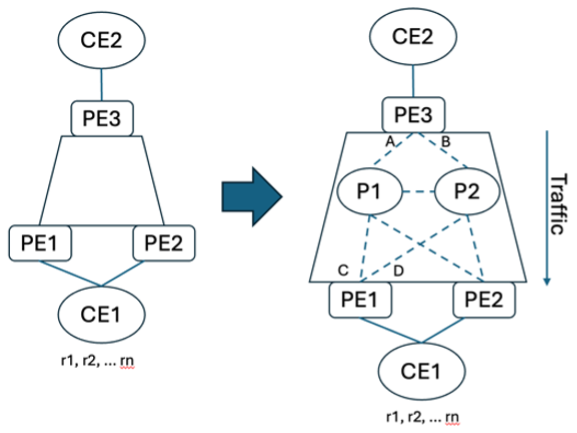
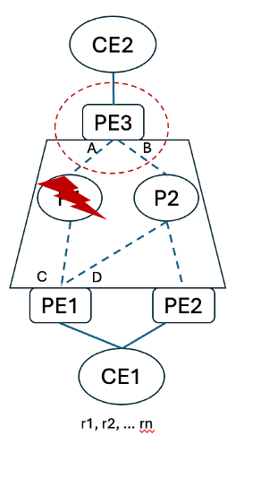
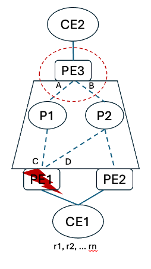
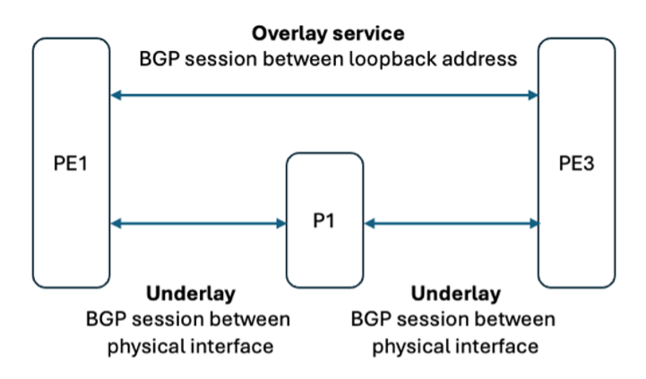
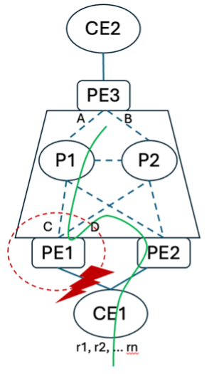
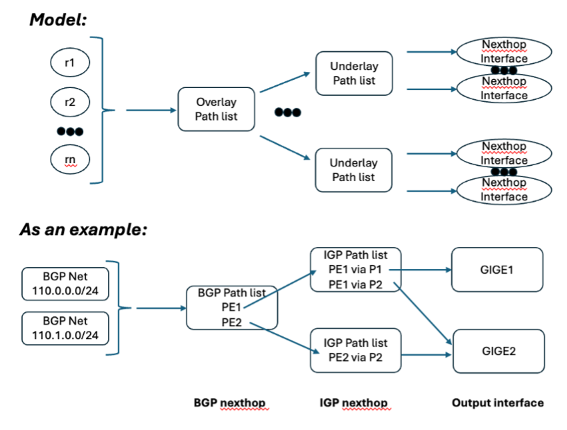
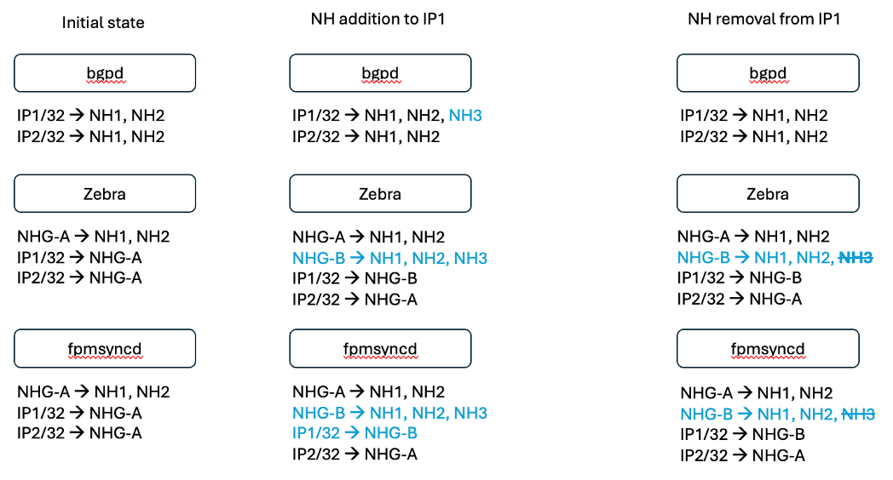
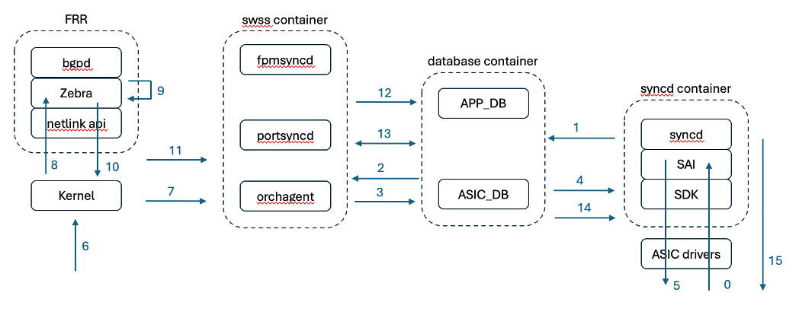
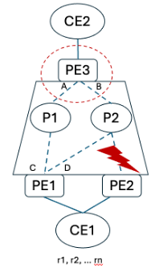
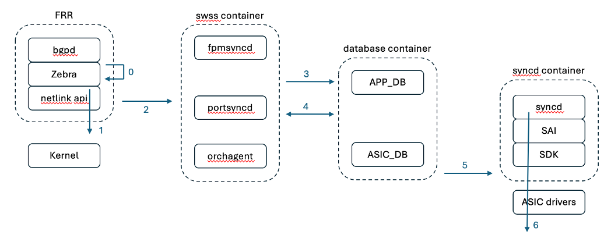

# BGP Prefix Independent Convergence Architecture Document

#### Rev 1.0

# Table of Contents

- [Revision](#revision)
- [1 Background](#1-background)
- [2 PIC Core](#2-pic-core)
- [3 PIC Edge](#3-pic-edge)
- [4 PIC Local aka Fast Reroute](#4-pic-local-aka-fast-reroute)
- [5 PIC Requirements](#5-pic-requirements)
- [6 Concepts](#6-concept)
- [7 SONIC PIC Core Call Flow](#7-sonic-pic-core-call-flow)
  - [7.1 Core Local Failure](#71-core-local-failure)
  - [7.2 Core Remote Failure](#72-core-remote-failure)
- [8 SONIC PIC Edge Call Flow](#8-sonic-pic-edge-call-flow)
- [9 References](#9-references)

# Revision

| Rev  |    Date    |       Author        | Change Description                                           |
|:--:|:--------:|:-----------------:|:------------------------------------------------------------:|
| 1.0  | Jan 2024 |   Patrice Brissette (Cisco), Eddie Ruan (Alibaba), Donald Sharp (Nvidia), Syed Hasan Raza Naqvi (Broadcom)  | Initial version

# 1 Background

Link and/or node failure in a network causes packet loss. Loss may cause black-holes and/or micro-loops until all relevant nodes in the path have converged. Overlay (BGP) and underlay (iGP) are quite different for convergence. They have their own challenges. Underlay deals with hundreds of routes. Overlay is designed to carry millions of routes. Upon network failure, the amount of packet loss may be astronomic if each single affected route is reprogrammed along the affected path.

Prefix Independent Convergence (PIC) is a solution allowing network elements to address a network failure independently of the number of affected objects. Usually, PIC makes use of multi-paths capability i.e., ECMP or primary / backup reachability paths.

PIC solution is well described and cover at IETF by <https://datatracker.ietf.org/doc/draft-ietf-rtgwg-bgp-pic/>.

The picture illustrates a typical network. Three PEs are connected via two P routers. CE devices are directly connected: CE1 is multi homed to PE1 and PE2 and CE2 is single homed to PE3. PE3 is connected to P1 via interface A and connected to P2 via interface B. PE1 is connected to P1 via interface C and connected to P2 via interface D. CEs are either device, hosts, applications, etc. They are represented by r1, r2, … rn. PE3 has reachability to PE1 via interfaces A and B. PE3 has reachability to PE2 via B only.

__Figure 1: PIC Topology__

In this document, explanations are based on traffic flow from North to South direction.

# 2 PIC Core

PIC Core is about prefix independent convergence when underlay / IGP is affected.

The overlay service runs between PEs routers where it gets terminated on PE1, PE2 and PE3. PIC core matters when failure happens within the core (e.g., P1 is impacted).

Initially at steady state, PE3 has a full routing knowledge about CE1 in its table. Upon failure and detection, the underlay / IGP reconverge. The interface A is removed for the routing table without having the need to update each single route (r1, r2, …rn). Basically, PIC functionality allows the PE3 to avoid looping across all prefixes for hardware reprogramming.

__Figure 2: PIC Core__

<table>
    <thead>
        <tr>
            <th></th>
            <th>@PE3</th>
        </tr>
    </thead>
    <tbody>
        <tr>
            <td>Steady State</td>
            <td>(r1, r2, … rn) -> PE1 (sC1) + PE2 (sC2)  
                PE1 -> Intf-A (uC1) + Intf-B (uC2)  
                PE2 -> Intf-B (uC4)</td>
        </tr>
        <tr>
            <td>Failure</td>
            <td>P1 failure:    
                (r1, r2, … rn) -> PE1 (sC1) + PE2 (sC2)  
                PE1 -> <s>Intf-A (uC1)</s> + Intf-B (uC2)  
                PE2 -> Intf-B (uC4) </td>
        </tr>
        <tr>
            <td>Result</td>
            <td>Only PE3 affected underlay interface has been removed from forwarding. The impact is limited to underlay routes.</td>
        </tr>
    </tbody>
</table>

Where PEx = IP address of specific remote nexthop, sCx = Overlay Service Context (VRF, label, VNI, etc.), Intf-x = Interface, uCx = Underlay Context (label, nexthop, etc.).

# 3 PIC Edge

PIC Edge is about prefix independent convergence when service overlay is affected … as well as the underlay / IGP. However, different devices on the network perform different PIC. As seen before, PIC Core applies to P1 and P2. However, PE3 triggers PIC Edge. In the following example, the overlay service runs between PEs.

__Figure 3: PIC Edge__

<table>
    <thead>
        <tr>
            <th></th>
            <th>@PE3</th>
        </tr>
    </thead>
    <tbody>
        <tr>
            <td>Steady State</td>
            <td>(r1, r2, … rn) -> PE1 (sC1) + PE2 (sC2)  
                PE1 -> Intf-A (uC1) + Intf-B (uC2)  
                PE2 -> Intf-B (uC4)</td>
        </tr>
        <tr>
            <td>Failure</td>
            <td>P1 failure:    
                (r1, r2, … rn) -> <s>PE1 (sC1)</s> + PE2 (sC2)  
                <s>PE1 -> Intf-A (uC1) + Intf-B (uC2) </s> 
                PE2 -> Intf-B (uC4) </td>
        </tr>
        <tr>
            <td>Result</td>
            <td>PE1 is removed from underlay / IGP reachability. PE1 nexthop is completely removed from PE3 routing table. </td>
        </tr>
    </tbody>
</table>

Where PEx = IP address of specific remote nexthop, sCx = Overlay Service Context (VRF, label, VNI, etc.), Intf-x = Interface, uCx = Underlay Context (label, nexthop, etc.).

In datacenters today, many providers build them with BGP as overlay and as underlay protocol. BGP peers between devices at different levels for overlay and underlay. BGP sessions are between loopback addresses for overlay service while different BGP sessions are between physical interface for underlay.

__Figure 4: BGP Peering__

In the case of the PE1 node failure as shown above for PIC edge, the following sequence of event happens:

1. P1 detects PE1 down; link is down towards PE1
2. P1 withdraws PE1 reachable route/info from BGP towards PE3 (underlay)
3. PE3 adjusts locally the underlay path list accordingly upon receiving withdraw message.
4. PE3 adjusts locally the overlay path list based on underlay adjustment

# 4 PIC Local aka FAST Reroute

PIC local aka Fast Reroute is yet another tool to perform prefix independent convergence but done for locally connected interfaces. It is performed mainly for a short period of time; enough time to allow the network to re-converge (helping PIC edge). PIC-Edge provides quick convergence at Ingress Side;  FRR provides supporting quick convergence at Egress side until Ingress gets notified/signaled about egress loss. PE3 performs PIC Edge and Core behaviors while P1 and P2 perform PIC core behavior. FRR is a local behavior using the concept of primary / backup path. FRR may be performed on either P or PE routers. However, when people refer to FRR, it is mainly of edge devices.  In the core, terms like LFA, etc. are used.

The idea behind FRR is to reroute a specific flow to peering PE where another path is available to reach a specific destination. In this case, PE2CE protocol runs between CE and PE devices.

__Figure 5: PIC Local__

<table>
    <thead>
        <tr>
            <th></th>
            <th>@PE1</th>
        </tr>
    </thead>
    <tbody>
        <tr>
            <td>Steady State</td>
            <td>(r1, r2, … rn) -> P: Local intf, B: PE2 (sC2)  
                PE2 -> Intf-C (uC3) + Intf-D (uC4)</td>
        </tr>
        <tr>
            <td>Failure</td>
            <td>Link failure between PE1 and CE1:  
                (r1, r2, … rn) -> <s>P: Local intf</s>, B: PE2 (sC2)  
                PE2 -> Intf-C (uC3), Intf-D (uC4) </td>
        </tr>
        <tr>
            <td>Result</td>
            <td>The local interface is removed from the forwarding table. PE1 promotes the backup path (via PE2) as primary path to reach CE1.</td>
        </tr>
    </tbody>
</table>

Where PEx = IP address of specific remote nexthop, sCx = Overlay Service Context (VRF, label, VNI, etc.), Intf-x = Interface, uCx = Underlay Context (label, nexthop, etc.).

# 5 PIC Requirements

Efficient architecture and design of PIC is very important to achieve high-performance convergence. Many variables may affect the overall result.

- Although its use was popularized using BGP, PIC is a protocol independent routing and forwarding feature
- Work independently from overlay e.g., overlay protocols such BGP, controllers, etc.
- Work independently from underlay (IGP)
- PIC Edge requires multi-path (ECMP, UCMP, pre-computed backup)
- PIC Core may make use of multi-path or primary / backup to pre-compute alternative paths
- Level of indirection must be shareable and design in a hierarchical manner
- Level of indirection must be shared across many prefixes. Shared path-list count is targeted to be much smaller than per prefix count.
- Forwarding plane must be capable of accessing multiple level of indirection
- Drivers in software (SAI / SDK) must be capable to program that level of indirection in specific ASIC accordingly

Requirements are slightly different between PIC core and PIC edge but they share common goals. That is due to how the router detect (or get to know) about a failure. Generally speaking, the detections happen as such:

- PIC core: local interface failure on any nodes of the network or BFD equivalent
- PIC edge: Nexthop tracking. Failure provided by IGP/BGP.
- PIC local: local interface failure on any nodes of the network or BFD equivalent
Regardless of the detection mechanism, requirements are:

- Provide hierarchical forwarding chains which can be shared across multiple routes/objects
- Hardware must be preprogrammed using these hierarchical forwarding chains.
  - E.g., objects -> level of indirection -> [multi-path list]. The list can be for ECMP or active/backup.
  - In FRR/SONIC context, the level of indirection is equal to the NHG object (nexthop group)
- For PIC core and PIC local, upon local failure, low level software or hardware must do:
  - Pruned the multi-path list for the affected path. Translate that into a single hardware update. The content of the NHG is updated with “less” path.
  - Tell upper layer of software about the issue.
  - Control plane updates, at its own pace, the hardware accordingly once protocol converge.
- For PIC edge, upon remote failure, control plane must update only the level of indirection first (NHG). It may re-apply new reachability after once the network is fully converge.
- Any transition programmed by control plane must be hitless from datapath point of view (zero packet loss)
  - Applicable when going from single path to multi-path (or vice versa)
  - Going from a level of indirection to a new level of indirection (e.g., from NHG-A to NHG-B)
  - Going from pure single path info to a level of indirection and vice versa.
- ECMP hardware resource is very limited. For scalability purpose, the usage of NHG (level of indirection) may be limited to only where it is applicable. For instance, NHG may NOT be used for single path only.

# 6 Concept

Conceptually speaking, PIC works by using level of indirections where shareable entries are used by many routes / objects.

The following picture shows the various levels of indirection required to perform efficient PIC functionality.

__Figure 6: Concept__

The logic is as follow:

- Prefixes / routes point to a set of remote nexthop where each element represents the IP address of the remote overlay service nexthop. (PEx loopback address)
- Each element points to a list of outgoing underlay nexthop where each element represents an interface, NH, etc., to reach the next network device along the path to get to destination.

In FRR / SONIC, the level of indirection is represented by the nexthop group object e.g., NHG. A NHG is made of a path list. For example, NHG-A = [nexthop 1, nexthop 2] where multiple routes points that NHG.

The following diagram shows the high level concept of the interaction between FRR (bgpd and zebra) and SONIC fpmsyncd. The first column shows the initial state. There are 2 routes in BGP pointing to the same remote nexthop (NH1, NH2). Zebra creates a NHG object with that list of paths where both IP routes (IP1, IP2) point to. The NHG and routes are provided to fpmsyncd.

The second column shows the addition of a new remote nexthop for the IP1 entry. Zebra creates a 2nd NHG which is now used by IP1 route. Fpmsyncd receives the new update. From SONIC side, the hardware must be programmed first with that new NHG object. Then, IP1 route can be reprogrammed using it. This is to avoid packet loss during the transition from NHG-A to NH-B.

The third column shows the remote nexthop removal. Zebra simply remove the affected path from the NHG object path list. The IP route does not get updated. Later on, Zebra may decide to delete NHG-B and move IP1 to NHG-A. That transition should be hitless. When the ECMP path has 2 members, upon removal on one, the end result is a single path. Zebra may decide to delete that NHG object using a single NH and move affected routes to use directly a nexthop ID; without having a nexthop group. Again, the transition from the usage of NHG object to plain nexthop ID should be hitless.

__Figure 7: High Level Flows__

It is worth to note that BGP PIC works with the concept of <b>FAST DOWNLOAD</b> and <b>SLOW DOWNLOAD</b> updates. <b>FAST DOWNLOAD</b> update must be done "as fast as possible” to achieve proper BGP PIC convergence results. It consists mainly to trigger a single update in hardware e.g. NHG object update. The <b>SLOW DOWNLOAD</b> is mainly about applying proper control plane convergence results. It consists of updating, validating the <b>FAST DOWNLOAD</b> hardware update at its own pace.

# 7 SONIC PIC CORE Call flow

## 7.1 Core Local Failure

The link between PE3 and P1 goes down. That translates to interface A down on PE3.

__Figure 8 PIC Core Local Failure__

The following diagram describes the interaction happening in FRR and SONIC for such failure:

__Figure 9: Core Local Failure Call Flow__

<b> FAST DOWNLOAD</b> update:

0. LOSS detection done by the ASIC; a notification is sent to syncd
1. syncd sends port-down event to ASIC DB
2. orchagent collects the new state
3. orchagent (nhgorch) updates the NHG from ASIC_DB by removing affected path from the list
4. syncd receives the update thru ASIC_DB and invoke SAI
5. single NHG object update done in hardware via SDK + Kernel update

<b>SLOW DOWNLOAD</b> update:

6. syncd updates (via SAI/SDK) update the kernel with interface oper down status
7. a netlink message is received in portsyncd (silently discarded)
8. a netlink message is received in zebra with interface oper down status for the affected interface
9. BGP and/or IGP sends new path and zebra recomputes the NHG
    - if the reachability do not impact BGP, it is skip and solution rely on IGP only
10. zebra redownloads the updated NHG object by sending netlink message
11. Kernel and fpmsyncd get updated
12. fpmsyncd process netlink message and pushes the update to APP_DB
13. orchagent (nhgorch) gets notified, process the received information and updates the ASIC_DB
14. syncd gets notified and update SAI/SDK accordingly.
15. Hardware is finally updated.

Alternatively, to align design between PIC Edge and core, local events may go straight to FRR and let zebra performs the <b>FAST DOWNLOAD</b>. This solution is not desirable since it does not provide full performance on the convergence.

## 7.2 Core Remote Failure

The link between PE2 and P2 goes down. That translates to an iGP update on PE3.

__Figure 10: PIC Core Remote Failure__

The following diagram describes the interaction happening in FRR and SONIC for such failure:

__Figure 11: Core Remote Failure Call Flow__

In this scenario, only <b>FAST DOWNLOAD</b> is considered:

0. zebra finds about actual dependent NHGs and trigger PIC NHG update first before any other updates.
1. zebra redownloads the updated NHG object by sending netlink message. It may redownload some affected routes when NHG id change or fallback on NH-ID only.
2. Kernel and fpmsyncd get updated
3. fpmsyncd process netlink message and pushes the update to APP_DB
4. orchagent gets notified, process the received information and updates the ASIC_DB
5. syncd gets notified and update SAI/SDK accordingly.
6. Hardware is finally updated.

## 8 SONIC PIC Edge Call flow

PE1 router goes down. That translates to an iGP and BGP updates to PE3.

__Figure 12: PIC Core Remote Failure__

The following diagram describes the interaction happening in FRR and SONIC for such failure:

__Figure 13: Core Remote Failure Call Flow__

In this scenario, only <b>FAST DOWNLOAD</b> is considered:

0. zebra finds about actual dependent NHGs and trigger PIC NHG update first before any other updates.
1. zebra redownloads the updated NHG object by sending netlink message. It may redownload some affected routes when NHG id change or fallback on NH-ID only.
2. Kernel and fpmsyncd get updated
3. fpmsyncd process netlink message and pushes the update to APP_DB
4. orchagent gets notified, process the received information and updates the ASIC_DB
5. syncd gets notified and update SAI/SDK accordingly.
6. Hardware is finally updated.

# 9 References

- [IETF BGP PIC draft](https://datatracker.ietf.org/doc/draft-ietf-rtgwg-bgp-pic/)
