<!-- omit in toc -->
# BGP PIC HLD
<!-- omit in toc -->
### Revision
| Rev |     Date    |       Author           | Change Description                |
|:---:|:-----------:|:----------------------:|-----------------------------------|
| 0.1 | Oct  8 2023 |   Eddie Ruan / Lingyu Zhang   | Initial Draft              |

<!-- omit in toc -->
## Table of Content
- [Goal and Scope](#goal-and-scope)
  - [BGP PIC Edge at high level](#bgp-pic-edge-at-high-level)
  - [Current Linux Kernel Forwarding behavior](#current-linux-kernel-forwarding-behavior)
- [High Level Design](#high-level-design)
- [Zebra's Data Structure Modifications](#zebras-data-structure-modifications)
  - [Exiting Struct nexthop](#exiting-struct-nexthop)
  - [Updated data structure with BGP PIC changes](#updated-data-structure-with-bgp-pic-changes)
  - [struct nhg\_hash\_entry](#struct-nhg_hash_entry)
  - [struct dplane\_route\_info](#struct-dplane_route_info)
  - [struct dplane\_neigh\_info](#struct-dplane_neigh_info)
- [Zebra Modifications](#zebra-modifications)
  - [BGP\_PIC enable flag](#bgp_pic-enable-flag)
  - [Create pic\_nhe](#create-pic_nhe)
  - [Handles kernel forwarding objects](#handles-kernel-forwarding-objects)
  - [Handles FPM forwarding objects](#handles-fpm-forwarding-objects)
    - [Map Zebra objects to APP\_DB via FPM](#map-zebra-objects-to-app_db-via-fpm)
    - [How would pic\_nhg improve BGP convergence](#how-would-pic_nhg-improve-bgp-convergence)
    - [SRv6 VPN SAI Objects](#srv6-vpn-sai-objects)
    - [Map APP\_DB to SAI objects](#map-app_db-to-sai-objects)
  - [Orchagent Modifications](#orchagent-modifications)
- [Zebra handles NHG member down events](#zebra-handles-nhg-member-down-events)
  - [Local link down events](#local-link-down-events)
  - [BGP NH down events](#bgp-nh-down-events)
- [Unit Test](#unit-test)
  - [FRR Topotest](#frr-topotest)
  - [SONiC mgmt test](#sonic-mgmt-test)
  - [BGP\_PIC Traffic Verification Test](#bgp_pic-traffic-verification-test)
    - [Test Bed for BGP PIC Test](#test-bed-for-bgp-pic-test)
    - [Traffic Verification Test](#traffic-verification-test)
    - [Test result without PIC](#test-result-without-pic)
    - [Test result with PIC](#test-result-with-pic)
  - [Recursive Traffic Verification Test](#recursive-traffic-verification-test)
    - [Test Bed for Recursive Test](#test-bed-for-recursive-test)
    - [Traffic Verification Test](#traffic-verification-test-1)
- [References](#references)

## Goal and Scope
BGP PIC, as detailed in the RFC available at https://datatracker.ietf.org/doc/draft-ietf-rtgwg-bgp-pic/, addresses the enhancement of BGP route convergence. This document outlines a method to arrange forwarding structures that can lead to improved BGP route convergence. From architecture level, the same approach could enhance prefixes convergence for all VPN cases, MPLS VPN, SRv6 VPN and EVPN. 

The above draft offers two primary enhancements:

- It prevents BGP load balancing updates from being triggered by IGP load balancing updates. This is essentially the recursive VPN route support, a.k.a PIC core case. This issue, which is discussed in the SONiC Routing Working Group (https://lists.sonicfoundation.dev/g/sonic-wg-routing/files/SRv6%20use%20case%20-%20Routing%20WG.pptx), can be effectively resolved. The recursive routes support would be detailed in a separate HLD.

<figure align=center>
    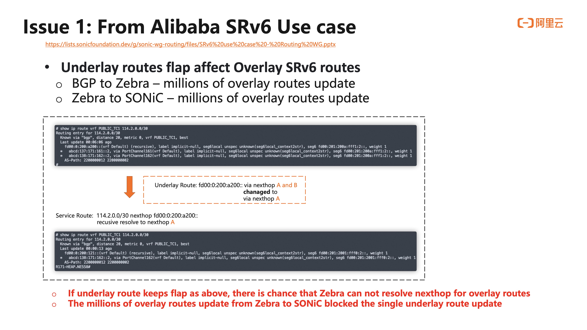
    <figcaption>Figure 1. Alibaba issue Underlay routes flap affecting Overlay SRv6 routes <figcaption>
</figure> 

-  We aim to achieve fast convergence in the event of a hardware forwarding failure related to a remote BGP PE becoming unreachable. Convergence in the slow path forwarding mode is not a priority. This is the main benefit for BGP PIC edge case which would be addressed in this HLD.
  
For detail information about PIC core and PIC edge could be found at SONiC PIC architecture document, https://github.com/sonic-net/SONiC/blob/master/doc/pic/bgp_pic_arch_doc.md 

### BGP PIC Edge at high level
<figure align=center>
    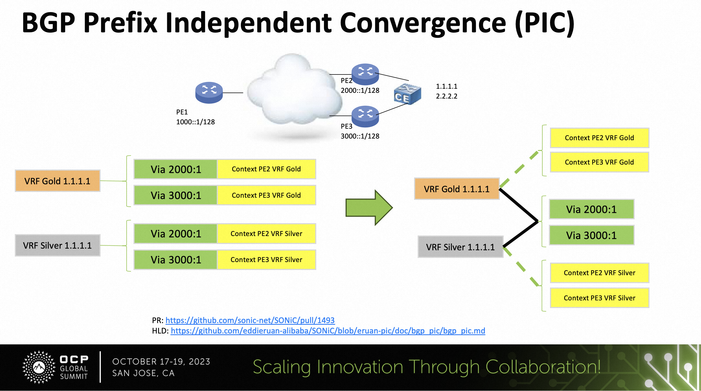
    <figcaption>Figure 2. BGP PIC for improving remote BGP PE down event handling <figcaption>
</figure> 

  -  The provided graph illustrates that the BGP route 1.1.1.1 is advertised by both PE2 and PE3 to PE1. Each BGP route update message not only conveys the BGP next-hop information but also includes VPN context details. 
  
  -  Consequently, when forming BGP Equal-Cost Multipath (ECMP) data structures, it is natural to retain both the BGP next-hop data and context information for each path. The VPN context could be specific to each prefix (a.k.a per prefix), individual customer edge (a.k.a per CE), or Virtual Routing and Forwarding (per VRF) type. This often leads to situations where BGP ECMP data structures cannot be effectively shared, as indicated in the lower-left section of the diagram. When a remote PE goes offline, PE1 must update all relevant BGP ECMP data structures, which can involve handling prefixes of varying lengths, resulting in an operation with a time complexity of O(N). 
  
   - The concept of the Prefix Independent Convergence's (PIC) proposal is to restructure this information by segregating the BGP next-hop information from the VPN context. The BGP next-hop-only information will constitute a new BGP ECMP structure that can be shared among all associated BGP VPN routes, as depicted in the lower-right part of the diagram. This approach allows for more efficient updates when the Interior Gateway Protocol (IGP) detects a BGP next-hop failure, resulting in an operation with a time complexity of O(1). This strategy aims to minimize traffic disruption in the hardware. The VPN context will be updated once BGP routes have reconverged.

### Current Linux Kernel Forwarding behavior
NHG in kernel is flat. BGP and IGP ECMP have to be collapsed in the same NHG. Currently, MPLS VPN, BGP EVPN are supported in Linux kernel. SRv6 VPN's support has not supported in. 

There are two aspects of view on adding routes in Linux. 
1. FRR is used as the routing stack for SONiC for white box switch / routers. For these devices, VPN routes may not be required to add to kernel since these devices normally are the middle man for VPN traffic. For SRv6 VPN case, we add a route map to skip Linux kernel programming for SRv6 VPN routes. We only keep underlay routes in kernel for routing protocols.
2. For NFV type of services, linux kernel forwarding is their main forwarding resource.

Current thought is to find a balance way to support both kinds of requirements.

| Features | Linux Kernel |
|:---:|:-----------:|
| MPLS VPN | Flat   | 
| EVPN     | Hierarchy  |
| SRv6 VPN | No support | 

## High Level Design
One of the challenges in implementing PIC within FRR is the absence of PIC support in the Linux kernel. To minimize alterations in FRR while enabling PIC on platforms that do not require Linux kernel support for this feature, we are primarily focused on two key modifications:
1. In the 'zebra' component:
    - Introduce a new Next Hop Group (PIC-NHG) specifically for the FORWARDING function. This NHG will serve as the shareable NHG in hardware.
    - When a BGP next hop becomes unavailable, zebra will first update the new FORWARDING-ONLY NHG before BGP convergence takes place.
    - When IGP updates, zebra will check associated BGP NHs' reachabilities. If the reachability of each individual member within the BGP NHG is not changed, there is no need to update the BGP NHG.
    - Zebra will transmit two new forwarding objects, BGP PIC context, and NHG, to orchagent via FPM. The handling of NHG is outlined in https://github.com/sonic-net/SONiC/pull/1425.
    - Zebra will continue to update kernel routes in the same manner as before, as the kernel does not support BGP PIC.
2. In the orchagent component:
    - Orchagent will be responsible for managing the two new forwarding objects, BGP PIC context, and NHG.

## Zebra's Data Structure Modifications
### Exiting Struct nexthop
The existing zebra nexthop structure encompasses both FORWARDING details and certain route CONTEXT information, such as VNI (Virtual Network Identifier) and srv6_nh, for various VPN (Virtual Private Network) functionalities. Given that route CONTEXT may vary among different VPN routes, it is not feasible for VPN routes to share the current VPN nexthop group generated by the zebra nexthop structure. When a remote BGP peer becomes inactive, zebra is required to update all linked VPN nexthop groups, potentially involving a significant number of VPN routes.

struct nexthop {

        struct nexthop *next;
        struct nexthop *prev;
        /*
         * What vrf is this nexthop associated with?
         */                
        vrf_id_t vrf_id;
        /* Interface index. */
        ifindex_t ifindex;

        enum nexthop_types_t type;

        uint16_t flags;

        /* Nexthop address */
        union {
                union g_addr gate; 
                enum blackhole_type bh_type;
        };
        union g_addr src;

        ...

        /* Encapsulation information. */
        enum nh_encap_type nh_encap_type;
        union {
                vni_t vni;
        } nh_encap;
        /* EVPN router's MAC.
         * Don't support multiple RMAC from the same VTEP yet, so it's not
         * included in hash key.
         */
        struct ethaddr rmac;
        /* SR-TE color used for matching SR-TE policies */
        uint32_t srte_color;
        /* SRv6 information */
        struct nexthop_srv6 *nh_srv6;
};

The forwarding objects in zebra are organized as the following mannar. Each struct nexthop contains forwarding only part and route context part. Due to route context parts are route attributes, they may be different for different routes. Therefore, struct nexthop_group may not be sharable. 
<figure align=center>
    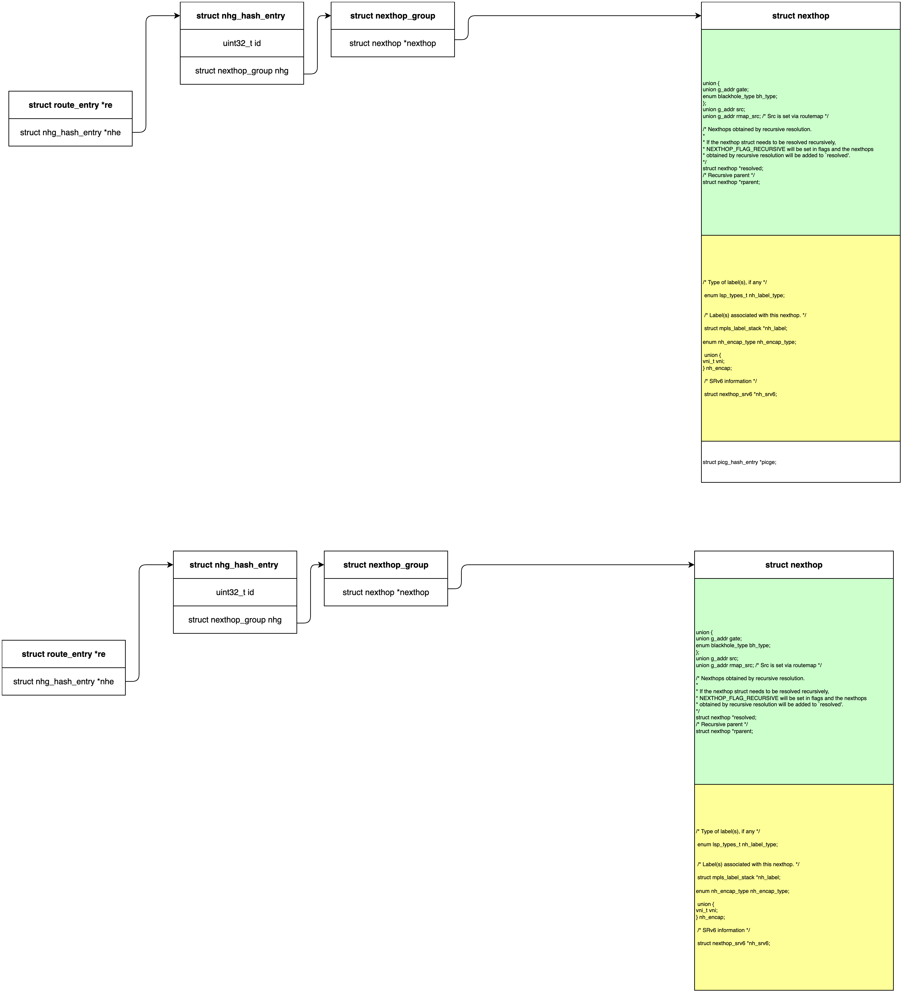
    <figcaption>Figure 3. Existing Zebra forwarding objects <figcaption>
</figure> 

### Updated data structure with BGP PIC changes
Instead of dividing the current 'struct nexthop' into two separate structures, we have opted to utilize the same nexthop structure to store both the route context part (also known as PIC CONTEXT) and the forwarding part.

Within the 'struct nhg_hash_entry,' we introduce a new field, 'struct nhg_hash_entry *pic_nhe.' This 'pic_nhe' is created when the original NHG pertains to BGP PIC. 'pic_nhe' points to an NHG that exclusively contains the original nexthop's forwarding part. The original nexthop retains both the PIC CONTEXT part and the forwarding part.

This approach allows us to achieve the following objectives:
- Utilize existing code for managing nexthop dependencies.
- Maintain a consistent approach for dplane to handle updates to the Linux kernel.

The new forwarding chain will be organized as follows.
<figure align=center>
    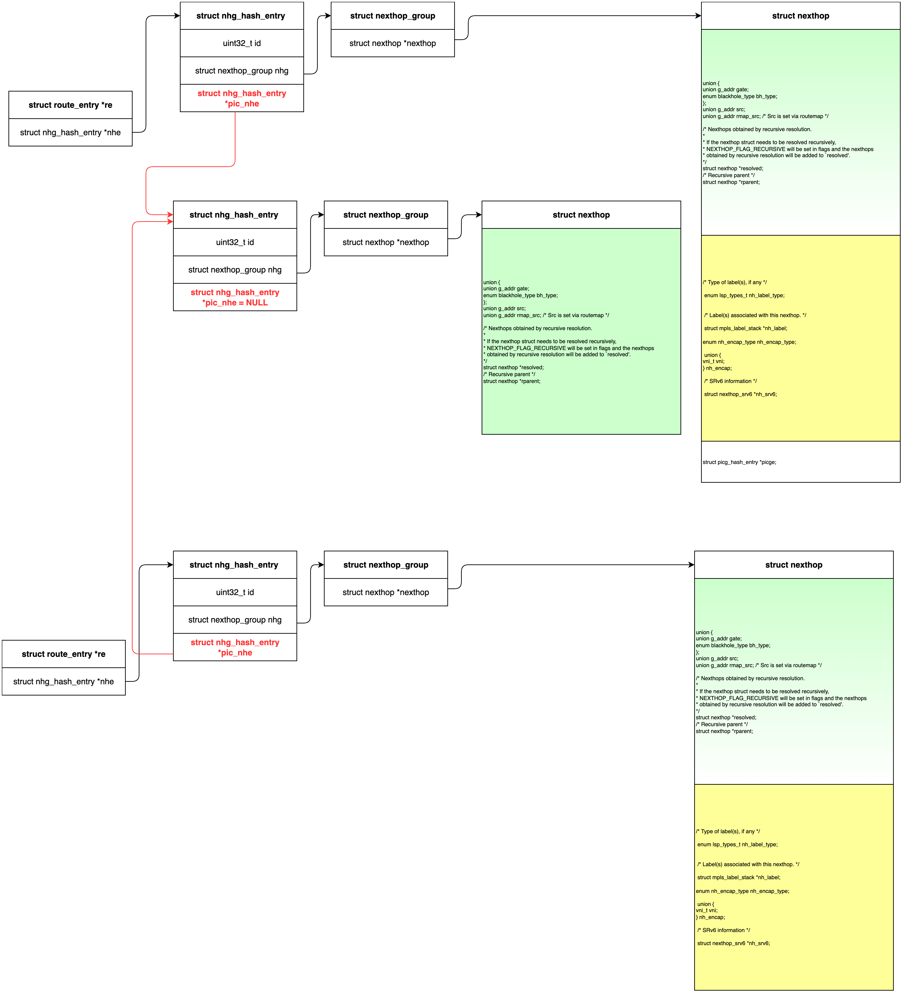
    <figcaption>Figure 4. Zebra forwarding objects after enabling BGP PIC <figcaption>
</figure> 

### struct nhg_hash_entry 
As described in the previous section, we will add a new field struct nhg_hash_entry *pic_nhe in struct nhg_hash_entry, zebra_nhg.h

	struct nhg_connected_tree_head nhg_depends, nhg_dependents;
    struct nhg_hash_entry *pic_nhe;

If PIC NHE is not used, pic_nhe would be set to NULL.

### struct dplane_route_info
dplane_route_info is in struct zebra_dplane_ctx 

We will add two new fields, zd_pic_nhg_id , zd_pic_ng. zd_pic_nhg_id is for pic_nhg's nh id, zd_pic_ng stores pic_nhg.  These two new fields would be collected via dplane_ctx_route_init().

		/* Nexthops */
	uint32_t zd_nhg_id;
	struct nexthop_group zd_ng;
        /* PIC Nexthops */
    uint32_t zd_pic_nhg_id;
	struct nexthop_group zd_pic_ng;

 These fields would be used in the following manner.

| Cases |    Linux Kernel Update (slow path)   |      FPM (fast path)          |
|:-----:|:------------------------------------:|:-----------------------------:|
| No BGP PIC enabled | zd_ng is used as NHG  |    zd_ng is used as NHG |
| BGP PIC enabled | zd_ng is used as NHG | zd_ng is used for PIC_CONTEXT, zd_pic_ng is used for NHG |

### struct dplane_neigh_info
This stucture is initialized via dplane_ctx_nexthop_init(), which is used to trigger NHG events. We don't need to make changes in this structure.

## Zebra Modifications
### BGP_PIC enable flag
fpm_pic_nexthop flag would be set based on zebra's command line arguments and only on the platform which Linux kernel supports NHG, a.k.a kernel_nexthops_supported() returns true.

### Create pic_nhe
From dplane_nexthop_add(), when normal NHG is created, we will try to create PIC NHG as well. Currently, PIC NHG would be created for both BGP and IGP NHGs for all cases once pic is enable a.k.a fpm_pic_nexthop flag is set. We could skip IGP NHG's handling since the value is not big, although it is stated in the draft.

	if (fpm_pic_nexthop && created && !pic) {
		zebra_pic_nhe_find(&pic_nhe, *nhe, afi, from_dplane);
		if (pic_nhe && pic_nhe != *nhe && ((*nhe)->pic_nhe) == NULL) {
			(*nhe)->pic_nhe = pic_nhe; 
			zebra_nhg_increment_ref(pic_nhe);
			SET_FLAG(pic_nhe->flags, NEXTHOP_GROUP_PIC_NHT);
		}
	}

zebra_nhe_find() is used to create or find a NHE. In create case, when NHE is for BGP PIC and BGP_PIC is enabled, we use a similar API zebra_pic_nhe_find() to create a pic_nhe, a.ka. create nexthop with FORWARDING information only. The created pic_nhe would be stored in the new added field struct nhg_hash_entry *pic_nhe. The following code is a sample code which would be created in zebra_nhg.c.

    bool zebra_pic_nhe_find(struct nhg_hash_entry **pic_nhe, /* return value */
			   struct nhg_hash_entry *nhe,
			   afi_t afi, bool from_dplane)
    {
	    bool created = false;
	    struct nhg_hash_entry *picnhe;
	    struct nexthop *nh = NULL;
	    struct nhg_hash_entry pic_nh_lookup = {};
	    //struct nexthop *nexthop_tmp;
	    struct nexthop *pic_nexthop_tmp;
	    bool ret = 0;

    if (nhe->pic_nhe) {
		*pic_nhe = nhe->pic_nhe;
		return false;
    }
	/* Use a temporary nhe to find pic nh */
	pic_nh_lookup.type = nhe->type ? nhe->type : ZEBRA_ROUTE_NHG;
	pic_nh_lookup.vrf_id = nhe->vrf_id;
    /* the nhg.nexthop is sorted */
	for (nh = nhe->nhg.nexthop; nh; nh = nh->next) {
		if (nh->type == NEXTHOP_TYPE_IFINDEX)
			continue;
		pic_nexthop_tmp = nexthop_dup_no_context(nh, NULL);
		ret = nexthop_group_add_sorted_nodup(&pic_nh_lookup.nhg, pic_nexthop_tmp);
		if (!ret)
			nexthop_free(pic_nexthop_tmp);
	}
	if (pic_nh_lookup.nhg.nexthop == NULL) {
		*pic_nhe = NULL;
		return false;
    }

	if (!zebra_nhg_dependents_is_empty(nhe) || pic_nh_lookup.nhg.nexthop->next) {
		/* Groups can have all vrfs and AF's in them */
		pic_nh_lookup.afi = AFI_UNSPEC;
	} else {
		switch (pic_nh_lookup.nhg.nexthop->type) {
		case (NEXTHOP_TYPE_IFINDEX):
		case (NEXTHOP_TYPE_BLACKHOLE):
			/*
			 * This switch case handles setting the afi different
			 * for ipv4/v6 routes. Ifindex/blackhole nexthop
			 * objects cannot be ambiguous, they must be Address
			 * Family specific. If we get here, we will either use
			 * the AF of the route, or the one we got passed from
			 * here from the kernel.
			 */
			pic_nh_lookup.afi = afi;
			break;
		case (NEXTHOP_TYPE_IPV4_IFINDEX):
		case (NEXTHOP_TYPE_IPV4):
			pic_nh_lookup.afi = AFI_IP;
			break;
		case (NEXTHOP_TYPE_IPV6_IFINDEX):
		case (NEXTHOP_TYPE_IPV6):
			pic_nh_lookup.afi = AFI_IP6;
			break;
		}
	}

	created = zebra_nhe_find(&picnhe, &pic_nh_lookup, NULL, afi, from_dplane, true);
	*pic_nhe = picnhe;
	if (pic_nh_lookup.nhg.nexthop)
		nexthops_free(pic_nh_lookup.nhg.nexthop);
	if (IS_ZEBRA_DEBUG_NHG_DETAIL)
		zlog_debug("%s: create PIC nhe id %d for nhe %d",
			   __func__, picnhe->id, nhe->id);
	return created;

}

This function is called by zebra_nhe_find() when pic_nhe is needed, but not gets created. 

    ...
    done:
	      /* create pic_nexthop */
	      if (fpm_pic_nexthop && created && !pic) {
		        zebra_pic_nhe_find(&pic_nhe, *nhe, afi, from_dplane);
		        if (pic_nhe && pic_nhe != *nhe && ((*nhe)->pic_nhe) == NULL) {
			          (*nhe)->pic_nhe = pic_nhe; 
			          zebra_nhg_increment_ref(pic_nhe);
			          SET_FLAG(pic_nhe->flags, NEXTHOP_GROUP_PIC_NHT);
		        }
	      }

	    /* Reset time since last update */
	    (*nhe)->uptime = monotime(NULL);
      ...

### Handles kernel forwarding objects
There is no change for zebra to handle kernel forwarding objects. Only zg_ng is used for NHG programming in kernel. 

### Handles FPM forwarding objects
#### Map Zebra objects to APP_DB via FPM
When BGP_PIC is enabled, nhe's NHG would map to PIC_LIST, pic_nhe's NHG would map to forwarding NHG.
Route object would use nhe's id as context id and use pic_nhe's id as NHG id.

<figure align=center>
    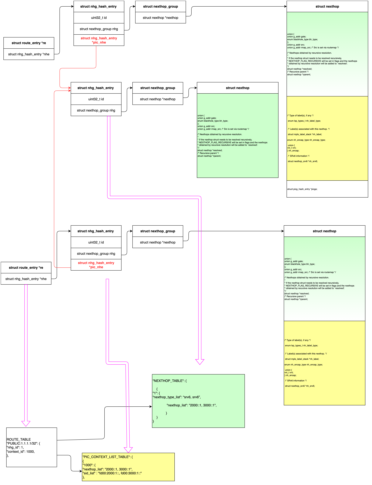
    <figcaption>Figure 5. Zebra maps forwarding objects to APP DB Objs when BGP PIC enables.<figcaption>
</figure> 

The following talbe compares the number of forwarding objects created with and without PIC enabled. N is the number of VPN routes and assume all N VPN routes share the same forwarding only part which makes the discussion easy. 
| Forwarding Objects | No BGP PIC enabled | BGP PIC enabled |
|:-----:|:------------------------------------:|:-----------------------------:|
| Route |  N  | N |
| NHG   |  N  | 1 |
| CONTEXT | n/a | N |

Here is an example of the "show ip route"'s information, which shows two IDs. One ID is for NHG ID. The other ID is for PIC CONTEXT ID.
<figure align=center>
    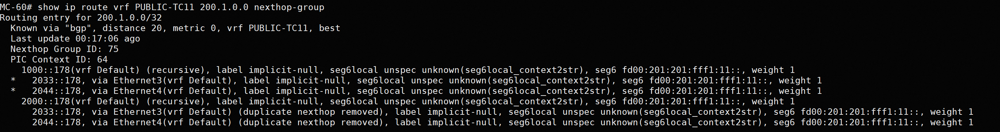
    <figcaption>Figure 6. The output for show ip route.<figcaption>
</figure> 

The following graph shows pic_nhe, i.e. NHE with forwarding only part. In hardwward forwarding, it is associated with the NHG ID shown in "show ip route".
<figure align=center>
    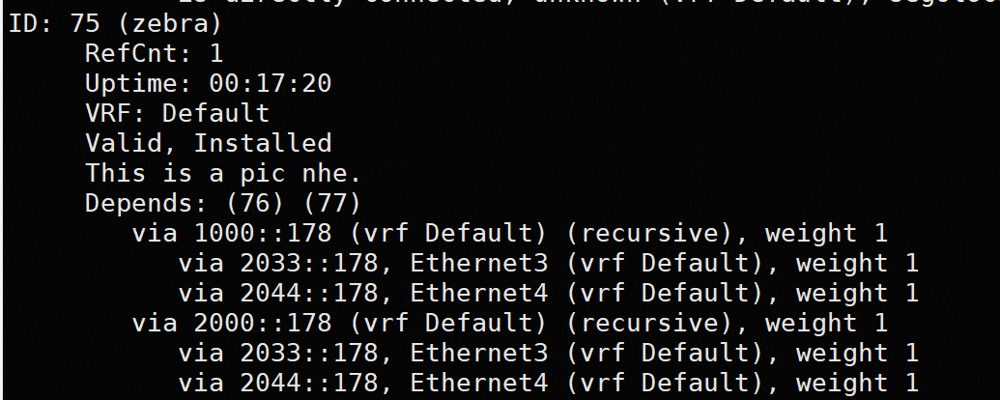
    <figcaption>Figure 7. PIC NHG<figcaption>
</figure> 

The following graph shows normal NHE, which contains both forwarding information and context. In hardware forwarding, it is associated with the PIC CONTEXT ID shown in "show ip route".
<figure align=center>
    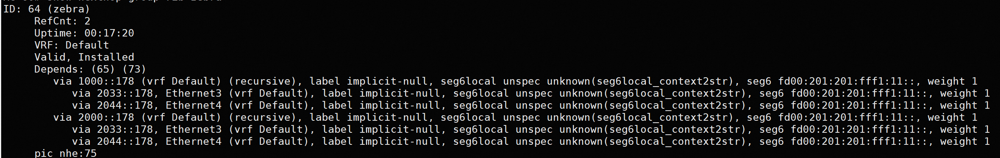
    <figcaption>Figure 8. Normal NHG.<figcaption>
</figure> 

#### How would pic_nhg improve BGP convergence
When IGP detects a BGP Nexthop is down, IGP would inform zebra on this route delete event. Zebra needs to make the following handlings. 
1. Find out all associated forwarding only nexthops resolved via this route. The nexthop lookup logic is similar to what it does in zebra_nhg_proto_add().
2. Trigger a back walk from each impacted nexthop to all associated PIC NHG and reresolve each PIC NHG
3. Update each PIC NHG in hardware. Sine PIC NHG is shared by VPN routes, it could quickly stop traffic loss before BGP reconvergence.
4. BGP nexthop down event would lead to BGP reconvergence which would update CONTEXT properly later. 

#### SRv6 VPN SAI Objects
Current use case is for SRv6 VPN. Therefore, we explicitly call out how to map fpm object to SRv6 VPN SAI objects. For MPLS VPN, EVPN use cases, the fpm to SAI object mapping would be added later once we have solid use cases in SONIC. 

The following diagram shows SAI objects related to SRv6. The detail information could be found at
https://github.com/opencomputeproject/SAI/blob/master/doc/SAI-IPv6-Segment-Routing-VPN.md

<figure align=center>
    
    <figcaption>Figure 9. SRv6 VPN SAI Objects<figcaption>
</figure> 

#### Map APP_DB to SAI objects
<figure align=center>
    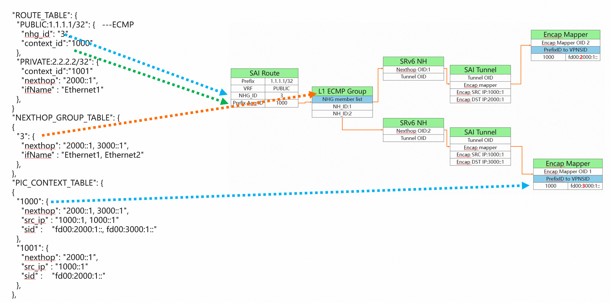
    <figcaption>Figure 10. APP DB to SAI OBJs mapping<figcaption>
</figure> 

### Orchagent Modifications
Handle two new forwarding objects from APP_DB, NEXTHOP_TABLE and PIC_CONTEXT_TABLE.  Orchagent would map proper objects to the proper SAI objects.

## Zebra handles NHG member down events
### Local link down events
https://github.com/sonic-net/SONiC/pull/1425 brings in NHG support, but it doesn't bring in how to trigger NHG update for various events. The recursive route support would be documented via a separate HLD document, since it is independent with BGP PIC approach.

### BGP NH down events
BGP NHG not reachable could be triggered from eBGP events or local link down events. We want zebra to backwalk all related BGP PIC NHG and update these NHG directly. 
1. After a routing update occurs, update the processing result of this route in rib_process_result and call zebra_rib_evaluate_rn_nexthops.

2. In the zebra_rib_evaluate_rn_nexthops function, construct a pic_nhg_hash_entry based on rn->p and find the corresponding pic_nhg. Based on the dependents list stored in pic_nhg, find all other nexthop groups associated with the current nhg, and then remove the nexthop members in these nexthop groups.

3. Trigger a refresh of pic_nhg to fpm.

4. To ensure that nhg refresh messages can be triggered first, add prectxqueue in fpm_nl_ctx as a higher-priority downstream queue for fnc. When triggering nhg updates, attach the nhg's ctx to prectxqueue, and when refreshing fpm, prioritize getting ctx from prectxqueue for downstream.

As shown in the following image：

<figure align=center>
    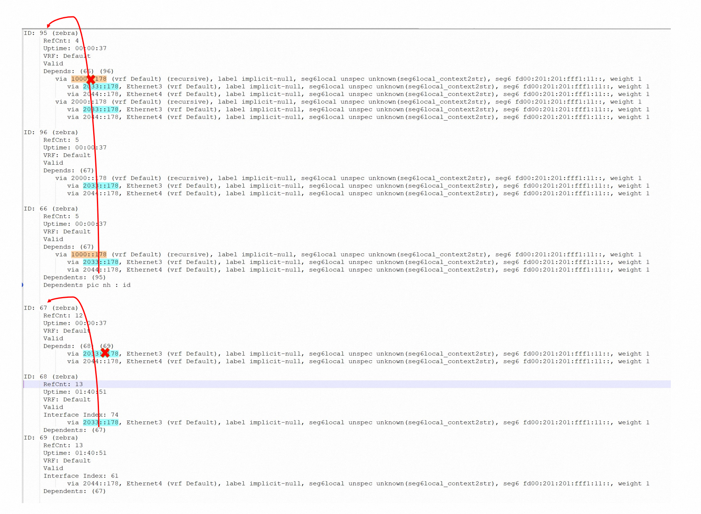
    <figcaption>Figure 11. BGP NH down event Handling<figcaption>
</figure> 

When the route 2033::178, marked in blue, is deleted, find its corresponding nhg(68) based on 2033::178. Then, iterate through the Dependents list of nhg(68) and find the dependent nhg(67). Remove the nexthop member(2033::178) from nhg(67). After completing this action, trigger a refresh of nhg(67) to fpm.

Similarly, when the route 1000::178, marked in brown, is deleted, find its corresponding nhg(66). Based on the dependents list of nhg(66), find nhg(95) and remove the nexthop member(1000::178) from nhg(95). After completing this action, trigger a refresh of nhg(95) to fpm.

Notes: this would be share with the same backwalk infra for recursive routes handling. 

## Unit Test
### FRR Topotest
Add a new SRv6 VPN topotest test topology, and use fpm simulator to check fpm output with the following scenarios.
1. Normal set up
2. Simulate IGP NH down event via shutting down an IGP link
3. Simulate BGP NH down event via shutting down remote BGP session. 

### SONiC mgmt test
Add a new SRv6 VPN test in sonic_mgmt. 

### BGP_PIC Traffic Verification Test
#### Test Bed for BGP PIC Test
We utilize two physical devices to establish a logically configured 3 PE testbed. One physical device corresponds to a single PE (PE1), while the other physical device represents two PEs (PE2 and PE3) solely from a BGP perspective. PE1 is interconnected with both PE2 and PE3. IXIA serves as CEs, with one CE connected to PE1 and the other CE dual-homed to PE2 and PE3.

The loopback address on PE2 is 1000::178, disseminated through an eBGP session between PE1 and PE2. Similarly, the loopback address on PE3 is 2000::178, published via an eBGP session between PE1 and PE3. PE1 acquires knowledge of CE2's SRv6 VPN routes through PE2 and PE3. Consequently, these VPN routes form an Equal-Cost Multipath (ECMP) on PE1, accessible via both PE2 and PE3.

CE2 published 400K routes to PE1, while CE1 (IXIA) generates traffic with a destination address traversing through these 400K routes. The traffic is evenly distributed through PE2 and PE3 to reach CE2 (IXIA).
<figure align=center>
    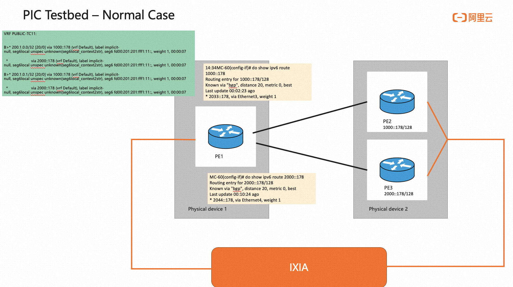
    <figcaption>Figure 12. PIC Testbed via two physical devices<figcaption>
</figure> 

####  Traffic Verification Test
Our objective is to deactivate PE2 and assess the speed at which all traffic can be redirected to PE3 on PE1.
<figure align=center>
    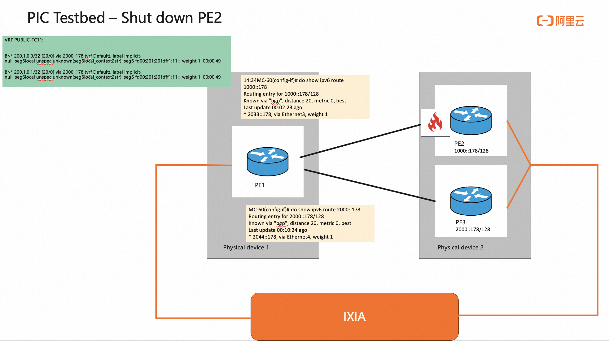
    <figcaption>Figure 13. PIC Testbed when shut down PE2<figcaption>
</figure> 

#### Test result without PIC
Initially, we conduct this test without activating PIC. The traffic rate is expected to decrease by nearly half due to the absence of PE2. As PE1 sequentially updates 400K routes to eliminate the PE2 path, the traffic rate gradually recovers. The packet loss persists for approximately 1 minute during this process.
<figure align=center>
    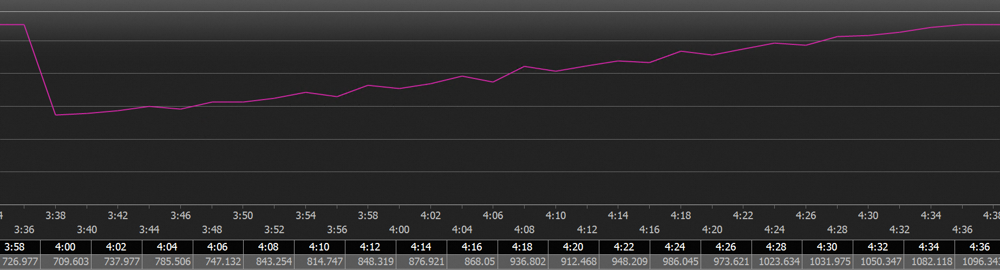
    <figcaption>Figure 14. Packet loss lasts for about 1 minute<figcaption>
</figure> 

#### Test result with PIC
Subsequently, we activate PIC and replicate the identical test. Remarkably, there is virtually no continuous packet loss, and the overall count of lost packets stands at 4,516 (with a packet transmission rate of 1750MB/s). This translates to an optimized actual packet loss duration of approximately 2 milliseconds.
<figure align=center>
    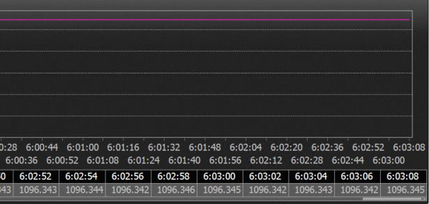
    <figcaption>Figure 15. Packet loss for about 2ms<figcaption>
</figure> 

| Cases |    Traffic loss window   | 
|:-----:|:------------------------------------:|
| without PIC |  About 60 second |
| with PIC | about 2ms

### Recursive Traffic Verification Test
#### Test Bed for Recursive Test
Different from previous test bed, We utilize two physical devices to establish a logically configured 2 PE testbed. Each physical device is one PE. There are two links conncected with these two PEs, (PE1 and PE3). IXIA serves as CEs, with one CE connected to PE1 and the other CE2 is connected to PE3.

The loopback address on PE3 is 2000::178, disseminated through eBGP sessions between PE1 and PE3 via two links, a.k.a 2000::178 takes two IGP paths from PE1 to PE3. CE2 published 400K routes to PE1, while CE1 (IXIA) generates traffic with a destination address traversing through these 400K routes. The traffic is evenly distributed between two IGP paths between PE1 and PE3. 

<figure align=center>
    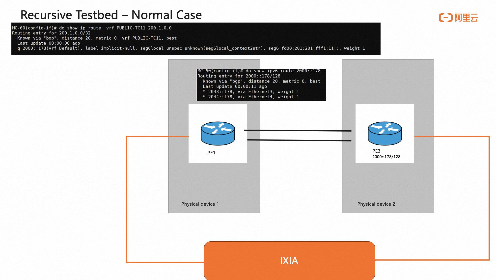
    <figcaption>Figure 16. Recursive Testbed<figcaption>
</figure> 

####  Traffic Verification Test
Our objective is to deactivate one link between PE1 and PE3, and assess the speed at which all traffic should take the remaining link from PE1 to PE3.
<figure align=center>
    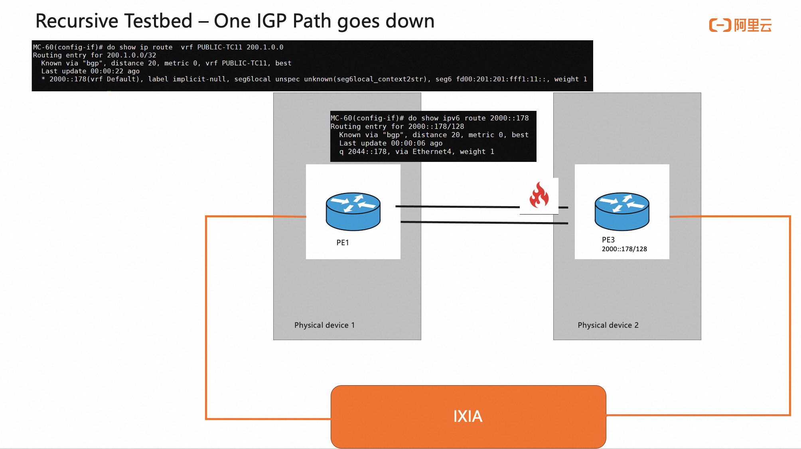
    <figcaption>Figure 17. Recursive Test : shut one IGP path<figcaption>
</figure> 

By incorporating recursive routes support, we can streamline the transition from two paths to one path in the IGP NHG when a link-down notification is received. As the reachability of BGP NH remains unchanged, there is no need to update the BGP NHG or BGP routes. The transition period does not result in noticeable traffic loss.

<figure align=center>
    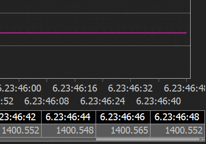
    <figcaption>Figure 18. Resurvie Test : no noticeable traffic loss<figcaption>
</figure> 

**Note:** we may not be able to upstream this part as Cisco Silicon one's dataplane simulator has not been upstreamed to vSONiC yet. 

## References
- https://datatracker.ietf.org/doc/draft-ietf-rtgwg-bgp-pic/
- https://github.com/sonic-net/SONiC/blob/master/doc/pic/bgp_pic_arch_doc.md
- https://github.com/opencomputeproject/SAI/blob/master/doc/SAI-IPv6-Segment-Routing-VPN.md
- https://github.com/sonic-net/SONiC/pull/1425

